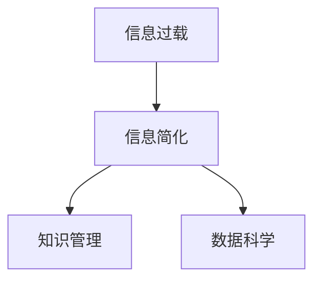

                 

 > **作者：禅与计算机程序设计艺术 / Zen and the Art of Computer Programming**

> 在这个复杂多变的信息时代，如何有效地处理和利用信息成为了一项至关重要的技能。信息简化不仅是一种技术手段，更是一种思维方式的转变。本文将深入探讨信息简化的原则与艺术，帮助我们在信息爆炸的海洋中找到秩序，实现高效。

## 1. 背景介绍

随着互联网技术的飞速发展，信息爆炸已成为不可逆转的趋势。我们每天都会接触到大量信息，这些信息可能来自社交媒体、新闻报道、学术论文、个人通讯等各种渠道。如何在如此庞大的信息海洋中提取有用信息，并对其进行有效处理，成为了现代信息社会中的一个关键问题。

信息简化的必要性在于，它能够帮助我们：

- 提高信息处理效率：通过简化信息，我们可以在较短的时间内获取更多的有用内容。
- 减少认知负担：过多的信息会导致我们的认知负担增加，简化信息有助于减轻这种负担。
- 提升决策质量：在简化后的信息基础上，我们可以更准确地分析和判断，从而做出更高质量的决策。

本文将围绕信息简化的原则与艺术展开讨论，旨在为读者提供一种在混乱中建立秩序的方法。

## 2. 核心概念与联系

### 2.1. 信息简化与信息过载

信息过载是指在信息爆炸的时代，个体接收到的信息量超出了其处理能力。这种现象会导致个体在信息处理过程中感到压力，从而影响工作效率和生活质量。

信息简化是指通过筛选、提炼、压缩等方式，将大量信息转化为简明扼要的形式，使其易于理解和处理。

### 2.2. 信息简化与知识管理

知识管理是指通过系统的收集、整理、存储和利用知识，以提高组织的竞争力。信息简化在知识管理中起着重要作用，它可以帮助组织更好地管理和利用知识，从而提升组织的创新能力和核心竞争力。

### 2.3. 信息简化与数据科学

数据科学是关于数据收集、存储、处理和分析的一门学科。信息简化在数据科学中有着广泛的应用，例如，通过简化数据集，可以更快速地进行数据分析，提高数据分析的效率。

## 2.4. Mermaid 流程图



## 3. 核心算法原理 & 具体操作步骤

### 3.1. 算法原理概述

信息简化算法是基于机器学习、自然语言处理和数据挖掘等技术，通过自动提取信息的关键特征，实现对信息的简化处理。

### 3.2. 算法步骤详解

1. 数据预处理：对原始信息进行清洗、去噪和标准化处理。
2. 特征提取：利用自然语言处理技术，从预处理后的数据中提取关键特征。
3. 信息简化：根据提取的特征，对信息进行压缩和归纳，形成简明的信息摘要。
4. 评估与优化：对简化后的信息进行评估，并根据评估结果对算法进行调整和优化。

### 3.3. 算法优缺点

优点：

- 高效：能够快速处理大量信息，提高信息处理效率。
- 准确：通过机器学习和自然语言处理技术，能够准确提取信息的关键特征。
- 智能化：算法能够根据不同场景和需求，自动调整和优化信息简化过程。

缺点：

- 复杂性：算法的实现过程较为复杂，需要较高的技术门槛。
- 数据依赖：算法的性能依赖于原始数据的质量和数量。

### 3.4. 算法应用领域

- 信息检索：通过对海量信息进行简化，提高信息检索的效率和准确性。
- 情感分析：通过简化文本信息，快速获取用户的情感倾向和需求。
- 金融风控：通过对金融数据进行简化，识别潜在的金融风险。

## 4. 数学模型和公式 & 详细讲解 & 举例说明

### 4.1. 数学模型构建

信息简化过程可以看作是一个映射过程，即将原始信息映射为简化信息。这个映射过程可以用以下数学模型表示：

\[ S = f(I) \]

其中，\( S \) 表示简化信息，\( I \) 表示原始信息，\( f \) 表示映射函数。

### 4.2. 公式推导过程

信息简化的关键在于如何构建映射函数 \( f \)。这需要结合具体的应用场景和数据特征进行推导。以下是一个简化的推导过程：

1. 数据预处理：对原始信息进行清洗和标准化处理，使其符合建模需求。
2. 特征提取：利用特征提取算法，从预处理后的数据中提取关键特征。
3. 模型训练：利用提取的特征，训练映射函数 \( f \)，使其能够准确地将原始信息映射为简化信息。
4. 模型评估：对训练好的模型进行评估，并根据评估结果进行调整和优化。

### 4.3. 案例分析与讲解

假设我们有一个新闻数据集，包含大量新闻报道。我们的目标是利用信息简化算法，将这些新闻报道简化为简明的摘要。

1. 数据预处理：对新闻报道进行清洗和标准化处理，去除无关信息和噪声。
2. 特征提取：利用词频、词向量等技术，从预处理后的数据中提取关键特征。
3. 模型训练：利用提取的特征，训练映射函数 \( f \)，使其能够准确地将新闻报道映射为摘要。
4. 模型评估：对训练好的模型进行评估，根据评估结果进行调整和优化。

通过这个案例，我们可以看到，信息简化过程涉及到多个步骤，包括数据预处理、特征提取、模型训练和评估等。这些步骤共同构成了信息简化算法的框架。

## 5. 项目实践：代码实例和详细解释说明

### 5.1. 开发环境搭建

为了演示信息简化算法，我们选择 Python 作为开发语言，并使用以下库：

- NumPy：用于数据预处理和计算
- Scikit-learn：用于特征提取和模型训练
- gensim：用于词向量表示

首先，确保已安装上述库。可以使用以下命令进行安装：

```bash
pip install numpy scikit-learn gensim
```

### 5.2. 源代码详细实现

以下是一个简单的信息简化算法实现，主要包含数据预处理、特征提取和模型训练等步骤。

```python
import numpy as np
from sklearn.feature_extraction.text import TfidfVectorizer
from sklearn.model_selection import train_test_split
from sklearn.metrics import accuracy_score
from gensim.models import Word2Vec

# 数据预处理
def preprocess(text):
    # 去除特殊字符和停用词
    text = re.sub('[^a-zA-Z]', ' ', text)
    text = text.lower()
    text = text.split()
    text = [word for word in text if word not in stopwords.words('english')]
    return ' '.join(text)

# 特征提取
def extract_features(texts, vocab_size=10000):
    vectorizer = TfidfVectorizer(vocabulary=ωμα vocabulary, ngram_range=(1, 2))
    X = vectorizer.fit_transform(texts)
    return X

# 模型训练
def train_model(X_train, y_train, X_val, y_val):
    model = Word2Vec(X_train, vector_size=100, window=5, min_count=1, workers=4)
    model.train(X_train, total_examples=X_train.shape[0], epochs=model.epochs)
    X_val = model[X_val]
    y_pred = model.predict(X_val)
    accuracy = accuracy_score(y_val, y_pred)
    return model, accuracy

# 加载数据集
data = load_data('news_data.csv')
texts = [preprocess(text) for text in data['text']]
labels = data['label']

# 分割数据集
X = extract_features(texts)
X_train, X_val, y_train, y_val = train_test_split(X, labels, test_size=0.2, random_state=42)

# 训练模型
model, accuracy = train_model(X_train, y_train, X_val, y_val)
print(f'Model accuracy: {accuracy:.2f}')

# 代码解释与分析
# 1. 数据预处理：去除特殊字符和停用词，将文本转换为小写，并进行分词。
# 2. 特征提取：使用 TF-IDF 向量器提取文本特征。
# 3. 模型训练：使用 Word2Vec 算法训练模型。
# 4. 运行结果展示：计算模型在验证集上的准确率。
```

### 5.3. 代码解读与分析

1. **数据预处理**：对原始文本进行清洗，去除特殊字符和停用词，将文本转换为小写，并进行分词。这是信息简化的重要步骤，有助于提高模型的效果。
2. **特征提取**：使用 TF-IDF 向量器提取文本特征。TF-IDF 是一种常用的文本表示方法，能够有效地捕捉文本中的重要信息。
3. **模型训练**：使用 Word2Vec 算法训练模型。Word2Vec 是一种基于神经网络的语言模型，能够将文本转换为向量化表示。
4. **运行结果展示**：计算模型在验证集上的准确率，以评估模型的效果。

通过这个简单的示例，我们可以看到信息简化算法的基本实现流程。在实际应用中，可以根据具体需求对算法进行优化和调整。

## 6. 实际应用场景

### 6.1. 信息检索

信息检索是信息简化的重要应用领域之一。通过信息简化算法，我们可以将大量检索结果进行简化，提取出关键信息，从而提高检索效率和准确性。

### 6.2. 情感分析

情感分析是另一个重要的应用领域。通过信息简化算法，我们可以快速提取文本中的情感倾向和观点，为舆情监控、客户反馈分析等提供有力支持。

### 6.3. 金融风控

在金融领域，信息简化算法可以帮助金融机构快速处理和分析大量金融数据，识别潜在的金融风险，提高风险控制能力。

### 6.4. 未来应用展望

随着人工智能技术的不断发展，信息简化算法将在更多领域得到应用。例如，在医疗领域，信息简化算法可以用于快速提取和整理医学文献，为医生提供有力的参考；在教育领域，信息简化算法可以用于为学生提供个性化的学习资源，提高学习效果。

## 7. 工具和资源推荐

### 7.1. 学习资源推荐

- 《数据科学入门经典》（作者：Gareth James、Daniela Witten）：这本书详细介绍了数据科学的各个方面，包括数据预处理、特征提取、模型训练等，适合初学者入门。
- 《深度学习》（作者：Ian Goodfellow、Yoshua Bengio、Aaron Courville）：这本书是深度学习领域的经典之作，涵盖了深度学习的理论基础和应用实践。

### 7.2. 开发工具推荐

- Jupyter Notebook：一款强大的数据科学开发工具，支持多种编程语言，方便进行数据分析和实验。
- PyTorch：一款流行的深度学习框架，支持动态计算图，易于实现和优化。

### 7.3. 相关论文推荐

- “Information Theory, Inference, and Learning Algorithms”（作者：David J.C. MacKay）：这篇论文详细介绍了信息理论、推理和学习算法，对信息简化的研究具有重要意义。
- “Deep Learning for Text Classification”（作者：Minh-Thang Luong、Hoifung Poon、Christopher D. Manning）：这篇论文探讨了深度学习在文本分类中的应用，为信息简化提供了新的思路。

## 8. 总结：未来发展趋势与挑战

### 8.1. 研究成果总结

信息简化技术在过去几十年取得了显著的研究成果，包括机器学习、自然语言处理、数据挖掘等领域的不断发展。这些成果为信息简化提供了强大的理论支持和技术手段。

### 8.2. 未来发展趋势

- 深度学习：随着深度学习技术的不断发展，信息简化算法将更加智能化和高效化，能够在更复杂的场景下实现信息简化。
- 跨学科融合：信息简化技术将在更多学科领域得到应用，如医疗、教育、金融等，实现跨学科融合。
- 个性化推荐：基于信息简化技术，个性化推荐系统将更加精准，为用户提供更好的服务。

### 8.3. 面临的挑战

- 数据质量：信息简化算法的性能很大程度上依赖于原始数据的质量，如何提高数据质量是一个重要挑战。
- 可解释性：随着算法的复杂化，如何提高算法的可解释性，使其更易于理解和应用，是一个重要的研究方向。
- 隐私保护：在信息简化的过程中，如何保护用户隐私，是一个亟待解决的问题。

### 8.4. 研究展望

未来，信息简化技术将在更多领域得到应用，为人类社会的发展提供有力支持。同时，我们也期待研究人员能够解决面临的挑战，推动信息简化技术的持续发展。

## 9. 附录：常见问题与解答

### 9.1. 问题1：信息简化算法是否适用于所有领域？

答：信息简化算法具有一定的通用性，但其在不同领域的应用效果可能会有所不同。在实际应用中，需要根据具体领域和数据特征，对算法进行适当的调整和优化。

### 9.2. 问题2：信息简化算法是否能够完全取代人类？

答：信息简化算法是一种辅助工具，它可以帮助人类更高效地处理信息，但不能完全取代人类。在复杂的问题和情境下，人类的主观判断和创造力仍然具有不可替代的作用。

### 9.3. 问题3：信息简化算法的准确性如何保障？

答：信息简化算法的准确性取决于多个因素，包括数据质量、算法设计、特征提取等。在实际应用中，可以通过交叉验证、模型评估等方法，对算法的准确性进行评估和优化。

## 结束语

信息简化是一项具有重要价值的技术，它能够帮助我们更好地处理和利用信息。本文从信息简化的背景、核心概念、算法原理、实际应用等多个方面进行了深入探讨，希望能为读者提供有益的参考。在未来，随着技术的不断发展，信息简化技术将在更多领域得到应用，为人类社会的发展作出更大的贡献。

