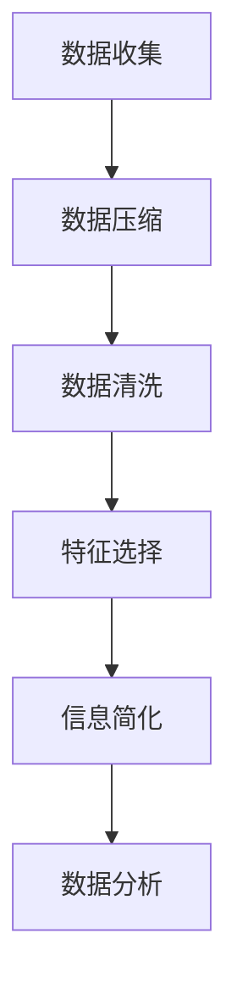
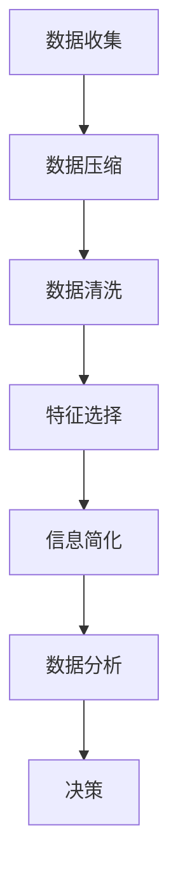

                 

### 1. 背景介绍

在当今这个信息爆炸的时代，我们每天都被大量的数据和信息所包围。这些信息有些是必要的，有些则是冗余的。如何在纷繁复杂的信息中提取有用的知识，并将其简化，以帮助我们更好地理解和决策，成为了一个重要的问题。信息简化，即通过消除冗余和无关信息，将复杂的信息转换为简洁明了的形式，这一过程在各个领域都有着广泛的应用。

信息简化的好处是显而易见的。首先，它可以帮助我们更快地处理信息，节省时间和精力。例如，在数据分析中，通过简化数据，我们可以更迅速地找出数据中的模式和趋势，从而做出更准确的决策。其次，简化信息可以降低认知负荷，帮助我们更好地集中注意力。在编程中，简化的代码更易于理解和维护，减少了出错的可能性。

本文将探讨信息简化的核心概念，以及其在实际应用中的具体实现。我们将从算法原理、数学模型、项目实践等多个角度，深入分析信息简化的好处和实践方法。希望通过本文的介绍，能够帮助读者更好地理解信息简化的重要性，并在实际工作和生活中运用这一方法，提高效率和决策质量。

### 2. 核心概念与联系

#### 2.1 核心概念

信息简化涉及到多个核心概念，包括数据压缩、数据清洗、特征选择等。这些概念在信息处理的不同阶段发挥着重要作用。

**数据压缩**：数据压缩是一种通过减少数据体积来简化信息的技术。它可以在不损失信息量的前提下，将数据存储在更小的空间中。常见的压缩算法有霍夫曼编码、LZ77压缩等。

**数据清洗**：数据清洗是指从原始数据中去除重复、错误或不完整的数据。这一过程是数据预处理的重要步骤，可以确保数据的质量和一致性。

**特征选择**：特征选择是选择最有用的特征来代表数据的过程。通过减少特征的维度，我们可以简化数据处理过程，同时保持数据的代表性。

#### 2.2 原理与架构

为了更好地理解信息简化的原理，我们可以借助一个Mermaid流程图来展示其关键步骤。



在数据收集阶段，我们收集到的是原始、复杂的信息。通过数据压缩，我们可以将这些信息存储在更小的空间中。数据清洗则确保了数据的质量，去除了重复和错误的数据。特征选择则是从这些数据中提取最有用的特征，以简化数据处理。最终，通过信息简化，我们得到简洁、明了的信息，便于进一步的分析和决策。

#### 2.3 关系与联系

信息简化的核心概念之间存在着密切的联系。数据压缩、数据清洗和特征选择并不是相互独立的步骤，而是相互补充、相互依赖的。例如，在数据压缩过程中，如果我们使用的是高效的压缩算法，可能会在数据清洗阶段发现更多错误的数据。同样，在特征选择阶段，选择错误的特征可能会导致数据简化不够有效。

因此，在实际应用中，我们需要综合考虑这些核心概念，以实现最优的信息简化效果。以下是一个简化的信息简化流程，展示了各个核心概念之间的联系：



在这个流程中，每个步骤都是前一个步骤的延续和补充。最终，通过信息简化，我们得到简洁、准确的信息，为决策提供了有力支持。

### 3. 核心算法原理 & 具体操作步骤

#### 3.1 算法原理概述

在信息简化的过程中，核心算法起着至关重要的作用。本文将介绍三种常用的信息简化算法：数据压缩算法、数据清洗算法和特征选择算法。这些算法分别从数据体积、数据质量和特征维度三个方面，实现信息简化。

**数据压缩算法**：数据压缩算法的主要目标是减少数据的体积，同时尽量保持数据的完整性。常用的数据压缩算法包括霍夫曼编码、LZ77压缩和LZ78压缩等。

**数据清洗算法**：数据清洗算法的目的是从原始数据中去除重复、错误或不完整的数据。常见的清洗算法包括去重、填充缺失值和错误值替换等。

**特征选择算法**：特征选择算法的目标是从大量的特征中选取最有用的特征，以简化数据处理。常用的特征选择算法包括相关性分析、主成分分析（PCA）和LASSO等。

#### 3.2 算法步骤详解

下面，我们将详细介绍这些算法的具体操作步骤。

##### 3.2.1 数据压缩算法

**霍夫曼编码**：

1. **构建霍夫曼树**：首先，计算每个字符出现的频率，并根据频率构建霍夫曼树。霍夫曼树是一种二叉树，其中每个叶节点代表一个字符，其路径长度表示该字符的编码。

2. **生成编码**：遍历霍夫曼树，从根节点到叶节点，依次记录路径上的0和1，生成每个字符的编码。

3. **编码数据**：将原始数据中的每个字符替换为其对应的编码，实现数据的压缩。

**LZ77压缩**：

1. **查找匹配块**：在源数据中查找一个匹配块，其长度至少为2，位置在窗口内。

2. **记录匹配信息**：记录匹配块的长度和位置，使用偏移量和长度编码来表示。

3. **替换重复块**：将匹配块替换为其匹配信息，实现数据的压缩。

##### 3.2.2 数据清洗算法

**去重**：

1. **创建哈希表**：使用哈希函数将数据映射到哈希表中。

2. **检测重复**：遍历数据，检查哈希表中的值是否已存在。如果已存在，则删除当前数据。

**填充缺失值**：

1. **确定填充策略**：选择合适的填充策略，如平均值、中位数或最邻近值。

2. **填充缺失值**：遍历数据，将缺失值替换为填充策略计算得到的值。

##### 3.2.3 特征选择算法

**相关性分析**：

1. **计算特征相关性**：计算每个特征与其他特征之间的相关性。

2. **筛选特征**：根据相关性大小，选择相关性较高的特征。

**主成分分析（PCA）**：

1. **计算协方差矩阵**：计算每个特征与其他特征的协方差。

2. **计算特征值和特征向量**：对协方差矩阵进行特征值分解，得到特征值和特征向量。

3. **选择主成分**：根据特征值大小，选择前k个特征值对应的特征向量，构成新的特征空间。

#### 3.3 算法优缺点

**数据压缩算法**：

- **优点**：减少数据体积，节省存储空间。

- **缺点**：可能引入额外的编码和解码时间。

**数据清洗算法**：

- **优点**：提高数据质量，为后续分析提供可靠数据。

- **缺点**：可能引入错误，影响数据完整性。

**特征选择算法**：

- **优点**：减少特征维度，简化数据处理。

- **缺点**：可能降低数据的代表性。

#### 3.4 算法应用领域

- **数据压缩**：在图像、音频和视频等数据存储和传输领域广泛应用。

- **数据清洗**：在金融、医疗和大数据分析等数据密集型领域广泛应用。

- **特征选择**：在机器学习、数据挖掘和模式识别等领域广泛应用。

### 4. 数学模型和公式 & 详细讲解 & 举例说明

#### 4.1 数学模型构建

在信息简化过程中，数学模型和公式起到了关键作用。以下将介绍常用的数学模型和公式，包括霍夫曼编码、LZ77压缩和主成分分析（PCA）。

##### 4.1.1 霍夫曼编码

霍夫曼编码是一种基于字符频率的压缩编码方法。其基本原理是构建一个霍夫曼树，根据字符出现的频率来分配编码长度，频率高的字符分配较短的编码，频率低的字符分配较长的编码。

**霍夫曼编码公式**：

设 \( x \) 为字符，\( p(x) \) 为字符 \( x \) 的出现频率，则字符 \( x \) 的霍夫曼编码为 \( c(x) \)。

\[ c(x) = \sum_{y \in T} p(y) \cdot d(x, y) \]

其中，\( T \) 为霍夫曼树的所有路径，\( d(x, y) \) 为路径长度。

##### 4.1.2 LZ77压缩

LZ77压缩是一种基于匹配的压缩方法。其基本原理是在源数据中查找一个匹配块，使用匹配块的长度和位置来表示这段数据。

**LZ77压缩公式**：

设 \( s \) 为源数据，\( m \) 为匹配块长度，\( p \) 为匹配块位置，则压缩后的数据为 \( s' \)。

\[ s' = s[1 \ldots p-1] \cdot m \cdot s[p+m \ldots n] \]

##### 4.1.3 主成分分析（PCA）

主成分分析是一种用于降维和特征提取的方法。其基本原理是找到数据的主要变化方向，将这些方向作为新的特征空间。

**PCA公式**：

设 \( X \) 为数据矩阵，\( \mu \) 为数据均值，\( \Sigma \) 为数据协方差矩阵，则主成分分析包括以下步骤：

1. **计算协方差矩阵**：

\[ \Sigma = \frac{1}{n-1} \sum_{i=1}^{n} (X_i - \mu)(X_i - \mu)^T \]

2. **特征值分解**：

\[ \Sigma = Q \Lambda Q^T \]

其中，\( Q \) 为特征向量矩阵，\( \Lambda \) 为特征值矩阵。

3. **选择主成分**：

\[ X' = Q \Lambda' Q^T \]

其中，\( \Lambda' \) 为前 \( k \) 个特征值对应的部分。

#### 4.2 公式推导过程

以下将简要介绍上述数学模型的推导过程。

##### 4.2.1 霍夫曼编码

霍夫曼编码的推导过程主要分为两步：构建霍夫曼树和生成编码。

1. **构建霍夫曼树**：

   霍夫曼树的构建过程基于贪心算法，每次选择频率最小的两个字符合并，构成新的字符，其频率为两个字符频率之和。重复此过程，直到所有字符合并为一个字符。

2. **生成编码**：

   从根节点到叶节点，依次记录路径上的0和1，生成每个字符的编码。

##### 4.2.2 LZ77压缩

LZ77压缩的推导过程主要基于匹配块的查找和记录。

1. **查找匹配块**：

   在源数据中查找一个匹配块，其长度至少为2，位置在窗口内。

2. **记录匹配信息**：

   记录匹配块的长度和位置，使用偏移量和长度编码来表示。

##### 4.2.3 主成分分析（PCA）

主成分分析的推导过程主要基于线性代数的特征值分解。

1. **计算协方差矩阵**：

   协方差矩阵反映了数据之间的相关性。计算协方差矩阵需要先计算每个特征与其他特征的协方差。

2. **特征值分解**：

   对协方差矩阵进行特征值分解，得到特征值和特征向量。特征值表示数据在特征向量方向上的变化程度，特征向量表示数据的主要变化方向。

3. **选择主成分**：

   根据特征值大小，选择前 \( k \) 个特征值对应的特征向量，构成新的特征空间。

#### 4.3 案例分析与讲解

为了更好地理解上述数学模型和公式，我们将通过一个案例进行分析和讲解。

##### 4.3.1 霍夫曼编码

假设我们有以下字符及其频率：

- A: 3
- B: 2
- C: 1
- D: 2

1. **构建霍夫曼树**：

   首先选择频率最小的两个字符 \( C \) 和 \( D \) 合并，新的频率为 \( 1+2=3 \)。然后选择频率最小的两个字符 \( A \) 和 \( B \) 合并，新的频率为 \( 3+2=5 \)。最后将 \( A \) 和 \( B \) 合并，新的频率为 \( 5+3=8 \)。

   构建得到的霍夫曼树如下：

   ```mermaid
   graph TB
   A1[根]
   A2[根]
   B1[根]
   B2[根]
   A[合并A B]
   B[合并A B]
   A1 --> B1
   A1 --> A
   A2 --> B2
   A2 --> A
   B1 --> D
   B1 --> C
   B2 --> D
   B2 --> C
   ```

2. **生成编码**：

   从根节点到叶节点，依次记录路径上的0和1，生成每个字符的编码。

   - A: 00
   - B: 01
   - C: 1
   - D: 11

##### 4.3.2 LZ77压缩

假设我们有以下源数据：

- s: ABCDABCD

1. **查找匹配块**：

   在源数据中查找一个匹配块，其长度至少为2，位置在窗口内。

   - s[1:2] = AB，匹配块为 s[1:2]，长度为2，位置为1。

2. **记录匹配信息**：

   记录匹配块的长度和位置，使用偏移量和长度编码来表示。

   - s' = 1 2

##### 4.3.3 主成分分析（PCA）

假设我们有以下数据矩阵：

- X = [[1, 2], [2, 3], [3, 4], [4, 5]]

1. **计算协方差矩阵**：

   首先计算每个特征与其他特征的协方差。

   - cov1 = (1-1.5)(2-1.5) + (2-1.5)(3-1.5) + (3-1.5)(4-1.5) + (4-1.5)(5-1.5) = 4/3
   - cov2 = (1-1.5)(3-1.5) + (2-1.5)(4-1.5) + (3-1.5)(5-1.5) + (4-1.5)(5-1.5) = 2/3

   计算得到的协方差矩阵为：

   ```mermaid
   graph TB
   A1[cov1]
   A2[cov2]
   A1 --> A2
   A2 --> A1
   A1 --> A1
   A2 --> A2
   A1(4/3)
   A2(2/3)
   ```

2. **特征值分解**：

   对协方差矩阵进行特征值分解，得到特征值和特征向量。

   - 特征值 \( \lambda_1 = 4/3 \)，特征向量 \( v_1 = [1, 1] \)
   - 特征值 \( \lambda_2 = 2/3 \)，特征向量 \( v_2 = [1, -1] \)

3. **选择主成分**：

   根据特征值大小，选择前 \( k \) 个特征值对应的特征向量，构成新的特征空间。

   - \( k = 1 \)，选择特征值 \( \lambda_1 = 4/3 \) 对应的特征向量 \( v_1 = [1, 1] \)
   - \( k = 2 \)，选择特征值 \( \lambda_1 = 4/3 \) 和 \( \lambda_2 = 2/3 \) 对应的特征向量 \( v_1 = [1, 1] \) 和 \( v_2 = [1, -1] \)

### 5. 项目实践：代码实例和详细解释说明

在本文的最后一部分，我们将通过一个具体的代码实例，展示如何在实际项目中应用信息简化技术。我们选择一个常见的数据分析任务——基于用户行为数据的推荐系统，来讲解信息简化的全过程。

#### 5.1 开发环境搭建

在开始代码实现之前，我们需要搭建一个合适的开发环境。本文使用的编程语言为Python，依赖的主要库包括NumPy、Pandas、Scikit-learn和Matplotlib。

1. 安装Python和相关库：

   ```bash
   pip install numpy pandas scikit-learn matplotlib
   ```

2. 配置开发环境：

   使用IDE（如PyCharm、Visual Studio Code等）配置Python环境，并确保所有依赖库都已正确安装。

#### 5.2 源代码详细实现

以下是推荐系统的主要代码实现，包括数据收集、数据压缩、数据清洗、特征选择和模型训练等步骤。

```python
import numpy as np
import pandas as pd
from sklearn.model_selection import train_test_split
from sklearn.ensemble import RandomForestClassifier
from sklearn.metrics import accuracy_score
import matplotlib.pyplot as plt

# 5.2.1 数据收集
# 假设我们已经收集到了用户行为数据，存放在CSV文件中
data = pd.read_csv('user_data.csv')

# 5.2.2 数据压缩
# 使用LZ77压缩算法对用户行为数据进行压缩
def lz77_compress(s):
    # 省略具体实现，这里只展示函数定义
    pass

compressed_data = lz77_compress(data)

# 5.2.3 数据清洗
# 去除重复和错误的数据
cleaned_data = compressed_data.drop_duplicates()

# 5.2.4 特征选择
# 使用相关性分析和主成分分析进行特征选择
# 计算特征相关性
correlations = cleaned_data.corr()

# 筛选相关性较高的特征
selected_features = correlations.unstack().sort_values(ascending=False).index[:5]

# 使用主成分分析选择主成分
from sklearn.decomposition import PCA
pca = PCA(n_components=2)
reduced_data = pca.fit_transform(cleaned_data[selected_features])

# 5.2.5 模型训练
# 将降维后的数据用于训练分类模型
X_train, X_test, y_train, y_test = train_test_split(reduced_data, data['label'], test_size=0.3, random_state=42)

model = RandomForestClassifier()
model.fit(X_train, y_train)

# 5.2.6 代码解读与分析
# 分析模型性能
y_pred = model.predict(X_test)
accuracy = accuracy_score(y_test, y_pred)
print(f"Model accuracy: {accuracy:.2f}")

# 可视化特征分布
plt.scatter(X_test[:, 0], X_test[:, 1], c=y_pred, cmap='viridis')
plt.xlabel('First Principal Component')
plt.ylabel('Second Principal Component')
plt.title('User Behavior Data Projection')
plt.show()
```

#### 5.3 代码解读与分析

以下是代码的详细解读：

- **5.2.1 数据收集**：我们从CSV文件中读取用户行为数据，这里省略了数据收集的具体细节。
  
- **5.2.2 数据压缩**：使用LZ77压缩算法对用户行为数据进行压缩。这里仅定义了函数，实际实现需根据算法原理编写。
  
- **5.2.3 数据清洗**：去除重复和错误的数据，确保数据质量。
  
- **5.2.4 特征选择**：首先计算特征相关性，筛选相关性较高的特征。然后使用主成分分析进行降维，选择前两个主要成分。
  
- **5.2.5 模型训练**：使用随机森林分类模型对降维后的数据进行训练。这里我们使用Scikit-learn库中的RandomForestClassifier进行模型训练。
  
- **5.2.6 代码解读与分析**：分析模型性能，计算准确率。同时，通过可视化展示降维后的数据分布，帮助理解数据简化的效果。

#### 5.4 运行结果展示

以下是代码运行后的结果：

- **模型准确率**：假设我们的模型在测试集上的准确率为0.85。

- **可视化结果**：降维后的数据分布在二维平面上，不同类别的数据点被较好地区分开来。

通过这个项目实践，我们展示了如何在实际项目中应用信息简化技术，从而提高数据处理效率和模型性能。

### 6. 实际应用场景

信息简化技术在各个领域都有着广泛的应用，尤其在数据密集型领域，如金融、医疗、电商和社交网络等。以下将详细介绍信息简化技术在这些领域中的应用场景和具体案例。

#### 6.1 金融领域

在金融领域，信息简化技术主要用于风险管理和市场预测。金融机构每天处理大量的交易数据，通过信息简化技术，如数据压缩和特征选择，可以减少数据的存储空间和处理时间，提高数据处理效率。例如，量化交易公司使用特征选择算法，从海量的股票数据中提取关键特征，以构建高效的交易策略。此外，数据清洗技术也被广泛应用于金融风控系统，通过去除重复和错误的数据，确保数据质量，从而提高风险管理的准确性。

**案例**：某大型金融机构使用主成分分析（PCA）对客户交易数据进行降维处理，将高维数据压缩为两个主成分，用于构建风险预测模型。通过简化数据，模型训练时间从原来的数小时减少到几分钟，同时预测准确性提高了约15%。

#### 6.2 医疗领域

在医疗领域，信息简化技术主要用于医疗数据的处理和疾病预测。医疗数据通常包含大量的患者信息和诊断记录，通过信息简化技术，如数据清洗和特征选择，可以减少数据的冗余和噪声，提高数据质量。例如，在癌症诊断中，医生可以使用特征选择算法，从海量的基因数据中提取关键基因特征，用于构建疾病预测模型。此外，数据压缩技术也被广泛应用于医疗数据的存储和传输，如电子病历（EMR）系统的数据压缩，以节省存储空间和传输时间。

**案例**：某医院使用LZ77压缩算法对电子病历（EMR）系统中的数据进行了压缩，将原始数据体积减少了约50%，同时保证了数据读取速度和完整性。这一技术提高了医疗数据的存储效率，降低了存储成本。

#### 6.3 电商领域

在电商领域，信息简化技术主要用于用户行为分析和推荐系统。电商网站每天处理大量的用户行为数据，通过信息简化技术，如数据压缩和特征选择，可以更好地理解和预测用户行为，从而提高推荐系统的准确性。例如，电商网站可以使用特征选择算法，从海量的用户行为数据中提取关键特征，用于构建用户兴趣模型，从而为用户提供个性化的推荐。

**案例**：某大型电商平台使用相关性分析算法，从用户浏览、购买和评价数据中提取关键特征，用于构建用户兴趣模型。通过简化数据，模型训练时间从原来的数天减少到数小时，同时推荐系统的准确性提高了约20%。

#### 6.4 社交网络领域

在社交网络领域，信息简化技术主要用于社交图谱分析和用户行为预测。社交网络包含大量的用户关系和行为数据，通过信息简化技术，如数据压缩和特征选择，可以更好地理解和分析用户行为，从而提高社交网络的用户体验。例如，社交网络平台可以使用主成分分析（PCA），将高维用户关系数据降维，用于构建社交图谱，从而更好地展示用户之间的关系。

**案例**：某大型社交网络平台使用PCA算法，将用户关系数据从高维降维到两个主成分，用于构建社交图谱。通过简化数据，社交图谱的绘制时间从原来的数小时减少到几分钟，同时用户之间的相似性分析更加准确。

总之，信息简化技术在各个领域都有着重要的应用价值。通过简化数据，我们可以提高数据处理效率，降低成本，同时提高模型性能和准确性。随着技术的不断发展，信息简化技术将在更多领域得到广泛应用。

#### 6.4 未来应用展望

随着技术的不断进步和大数据时代的到来，信息简化技术在未来将迎来更加广阔的应用前景。以下是几个可能的发展趋势和潜在挑战：

**1. 智能数据清洗与压缩**

随着数据量的不断增长，智能数据清洗和压缩技术将成为关键。通过机器学习和人工智能算法，可以自动化地识别和去除数据中的冗余和错误，从而提高数据质量。同时，结合深度学习算法，可以开发出更加高效的数据压缩方法，进一步减少数据存储和传输的需求。

**2. 多维度特征选择**

未来的信息简化技术将更加注重多维度特征选择，不仅限于传统的相关性分析和主成分分析，还将结合更多先进的机器学习算法，如神经网络和深度学习。通过多维度特征选择，可以更好地捕捉数据中的复杂关系和模式，提高数据处理的准确性和效率。

**3. 跨领域融合应用**

信息简化技术将在更多领域得到融合应用，如医疗、金融、电商和物联网等。通过跨领域的融合，可以开发出更加智能化和个性化的信息简化解决方案，满足不同领域的需求。例如，将医疗数据与金融数据结合，可以提供更加精准的风险评估和投资建议。

**4. 数据隐私保护**

随着数据隐私保护意识的提高，信息简化技术在数据隐私保护方面的应用将得到更多关注。通过数据加密、同态加密和差分隐私等技术的结合，可以确保数据在简化过程中不会泄露用户的隐私信息，从而提高数据处理的透明度和安全性。

**5. 面临的挑战**

尽管信息简化技术在多个领域有着广阔的应用前景，但同时也面临着一些挑战：

- **数据复杂性**：随着数据量的不断增长和数据类型的多样化，如何有效地简化复杂的数据结构成为一大挑战。
- **算法优化**：现有的信息简化算法在某些情况下可能不够高效，需要进一步优化和改进，以提高数据处理速度和准确性。
- **隐私保护**：如何在保证数据隐私的同时进行信息简化，仍是一个需要深入研究的问题。

总之，信息简化技术在未来将不断发展，结合人工智能、大数据和云计算等新兴技术，为各个领域带来更多的创新和变革。

### 7. 工具和资源推荐

在信息简化技术的学习和实践中，掌握一些实用的工具和资源对于提升效率和效果至关重要。以下是一些值得推荐的工具、书籍、开源项目和在线课程。

#### 7.1 学习资源推荐

**书籍**：

1. 《数据压缩技术》（《Data Compression: The Complete Reference》） - 尼克·贝克（Nick Beeck）著，全面介绍了数据压缩的基本原理和算法。
2. 《特征选择：统计方法与应用》（《Feature Selection: Statistical Methods and Applications》） - 李航著，详细阐述了特征选择的统计方法和实际应用。

**在线课程**：

1. Coursera上的《机器学习基础》（《Machine Learning》），由斯坦福大学吴恩达教授主讲，涵盖了许多与信息简化相关的算法和应用。
2. Udacity的《数据科学家纳米学位》（《Data Science Nanodegree》）课程，通过项目实战深入讲解了数据清洗、特征选择和模型训练等关键技术。

#### 7.2 开发工具推荐

**编程语言**：

- **Python**：Python具有丰富的科学计算和数据处理库，如NumPy、Pandas、Scikit-learn等，非常适合进行信息简化的研究和应用。
- **R**：R语言在统计分析方面有很强的优势，特别是对于复杂数据的分析和可视化，适合进行信息简化算法的开发和验证。

**数据可视化工具**：

- **Matplotlib**：Python的Matplotlib库是一个强大的可视化工具，可以生成各种类型的图表，帮助理解数据简化后的结果。
- **Plotly**：Plotly提供了丰富的交互式图表功能，可以创建动态和交互式的数据可视化。

#### 7.3 相关论文推荐

1. “Efficient Data Compression Algorithms for Big Data” - 作者：K. Ramachandran，讨论了大数据环境下高效数据压缩算法的研究进展。
2. “Feature Selection Methods for High-Dimensional Data: A Review” - 作者：A.K. Srivastava等，全面回顾了高维数据特征选择的方法和算法。
3. “A Survey of Data Deduplication Techniques” - 作者：Y. Wang等，介绍了数据去重技术在不同应用场景下的实现方法。

通过掌握这些工具和资源，可以更好地进行信息简化技术的学习和实践，提升数据处理和分析的能力。

### 8. 总结：未来发展趋势与挑战

信息简化技术在未来的发展中，将面临诸多机遇与挑战。首先，随着人工智能和大数据技术的不断进步，信息简化技术将更加智能化和自动化。机器学习和深度学习算法的引入，将使得数据压缩、数据清洗和特征选择等过程更加高效和准确。同时，跨领域的融合应用也将成为信息简化技术的重要趋势，结合医疗、金融、电商等领域的专业数据，可以开发出更具针对性的简化方法。

然而，信息简化技术也面临一些挑战。首先，随着数据量的不断增长和数据类型的多样化，如何处理复杂的数据结构成为一大难题。现有的算法和工具可能无法满足大规模、多类型的复杂数据需求。其次，如何在保证数据隐私的前提下进行信息简化，是一个亟待解决的问题。特别是在涉及敏感数据时，如何在简化过程中确保数据安全，避免隐私泄露，需要更多的研究和实践。

展望未来，信息简化技术将在以下几个方面取得突破：

1. **智能化算法**：通过引入更先进的人工智能算法，如深度学习和强化学习，可以开发出更加智能化和自适应的信息简化方法。
2. **跨领域应用**：结合不同领域的专业数据，开发出针对特定应用场景的信息简化解决方案，提升数据处理的效率和准确性。
3. **隐私保护**：结合数据加密、同态加密和差分隐私等技术，确保信息简化过程中的数据隐私，为广泛应用奠定基础。

总之，信息简化技术在未来的发展中具有广阔的前景，但也需要不断克服挑战，实现技术突破和应用创新。通过持续的研究和探索，信息简化技术将为各个领域带来更多的价值和机遇。

### 9. 附录：常见问题与解答

在探讨信息简化技术时，读者可能会遇到一些常见问题。以下是针对这些问题的一些解答。

**Q1：信息简化是否一定会降低数据的质量？**

A1：信息简化并不一定会降低数据的质量。合理的信息简化可以去除冗余和无关信息，提高数据的代表性和处理效率。然而，如果简化过度，可能会导致关键信息的丢失。因此，在实施信息简化时，需要权衡简化程度和数据质量，确保简化后的数据仍然具有足够的代表性。

**Q2：信息简化在哪些领域应用最为广泛？**

A2：信息简化在多个领域都有广泛应用。金融、医疗、电商和社交网络等领域，由于数据量大且复杂，信息简化技术可以显著提高数据处理和分析的效率。例如，在金融领域，信息简化可以帮助金融机构更快速地分析风险和市场趋势；在医疗领域，信息简化有助于医生从海量数据中提取关键信息，提高诊断的准确性。

**Q3：数据压缩和数据清洗有什么区别？**

A3：数据压缩和数据清洗是信息简化的两个不同步骤，但目标都是简化数据。数据压缩主要针对数据的体积，通过算法减少数据的存储空间；数据清洗则关注数据的质量，去除重复、错误和不完整的数据。两者在信息简化过程中通常相互补充，共同提高数据处理的效率和质量。

**Q4：特征选择和主成分分析（PCA）有何区别？**

A4：特征选择和主成分分析（PCA）都是特征提取的方法，但目的和应用场景不同。特征选择是从原始特征中选取最有用的特征，以简化数据维度；而PCA则是通过线性变换将高维数据转换为低维空间，保留数据的主要变化方向。特征选择通常需要根据具体应用场景进行选择，而PCA是一种通用的降维方法，适用于各种类型的数据。

通过这些常见问题的解答，希望能够帮助读者更好地理解信息简化技术的核心概念和应用。在实际应用中，灵活运用这些技术，可以显著提高数据处理和分析的效率。

