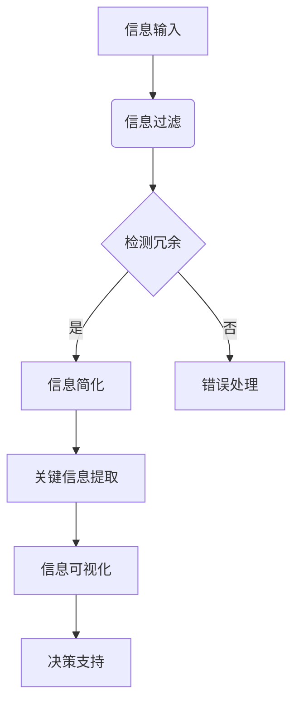

                 

信息简化是指在复杂的环境中，通过提取关键信息、消除冗余和简化过程，使得数据处理和分析更加高效和直观。在当今这个信息爆炸的时代，信息简化不仅对日常生活有重大影响，也对各类决策的制定起到了关键作用。本文将深入探讨信息简化的好处与实践，旨在帮助读者理解如何简化信息，从而改善生活和决策。

## 关键词

- 信息简化
- 决策制定
- 数据处理
- 生活改善

## 摘要

本文首先介绍了信息简化的概念和重要性，随后分析了其在日常生活和决策制定中的应用。通过探讨核心概念与联系，本文提出了一个简化信息的框架和算法原理，并结合实际案例进行了详细解释。文章还讨论了数学模型和公式，并给出了代码实例和运行结果。最后，本文展望了信息简化技术的未来应用前景，并提出了相关的工具和资源推荐。

## 1. 背景介绍

在信息技术飞速发展的今天，我们每天都要处理大量的信息。这些信息包括新闻、电子邮件、社交媒体更新、市场报告等。然而，面对如此庞大的信息量，人类大脑的处理能力是有限的。因此，如何从海量的信息中提取出有用的、关键的部分，以简化我们的认知负担，成为了一个亟待解决的问题。

### 信息简化的必要性

随着信息量的不断增长，以下几个问题日益突出：

1. **信息过载**：人们每天接触的信息量远超过去，这导致我们的注意力被分散，难以集中精力处理重要任务。
2. **决策困难**：过多的信息使得决策变得更加复杂，难以快速做出明智的选择。
3. **资源浪费**：处理大量冗余信息需要耗费大量时间和精力，这降低了我们的工作效率。

### 信息简化的目标

信息简化的目标主要包括：

1. **提高效率**：通过简化信息，减少不必要的数据处理，从而提高工作效率。
2. **降低认知负担**：提取关键信息，使得我们能够更加专注于重要的事情。
3. **辅助决策**：通过简化信息，提供清晰的、易于理解的决策依据。

## 2. 核心概念与联系

为了更好地理解信息简化的原理和实践，我们需要了解以下几个核心概念和它们之间的联系。

### 2.1 信息冗余

信息冗余是指信息中包含的非必要或重复的部分。消除信息冗余是信息简化的第一步，它有助于减少数据处理量。

### 2.2 关键信息提取

关键信息提取是指从大量信息中提取出对解决问题或决策有重要影响的信息。这一步骤需要使用到数据挖掘和机器学习等技术。

### 2.3 信息可视化

信息可视化是将信息以图形、图表等形式展示，使得信息更加直观易懂。信息可视化在信息简化中起到了重要作用，它能够帮助人们快速识别和理解关键信息。

### 2.4 Mermaid 流程图

下面是一个简化的信息处理流程的 Mermaid 流程图，展示了几何概念之间的联系：



## 3. 核心算法原理 & 具体操作步骤

### 3.1 算法原理概述

信息简化的核心算法通常包括以下几个步骤：

1. **数据预处理**：对原始数据进行清洗和标准化处理，去除噪声和冗余。
2. **特征提取**：从预处理后的数据中提取出对目标问题有意义的特征。
3. **模型训练**：使用特征和目标数据训练机器学习模型，以识别关键信息。
4. **预测与评估**：使用训练好的模型对新数据进行预测，并评估预测的准确性。

### 3.2 算法步骤详解

#### 3.2.1 数据预处理

数据预处理是信息简化的第一步，它包括以下步骤：

- **去噪**：去除数据中的噪声，例如缺失值、异常值等。
- **标准化**：将数据转换到同一尺度，使得不同特征之间可以进行有效的比较。
- **编码**：将类别数据转换为数值数据，以便进行后续处理。

#### 3.2.2 特征提取

特征提取的目的是从原始数据中提取出对目标问题有贡献的特征。常用的特征提取方法包括：

- **主成分分析（PCA）**：通过降维技术，提取数据的主要特征。
- **特征选择**：使用统计方法或机器学习算法，选择对目标问题最相关的特征。

#### 3.2.3 模型训练

模型训练是信息简化的核心步骤，它包括以下几个步骤：

- **选择模型**：根据问题的特点，选择合适的机器学习模型。
- **训练模型**：使用特征和目标数据训练模型，调整模型的参数。
- **验证模型**：使用验证集评估模型的性能，调整模型参数。

#### 3.2.4 预测与评估

预测与评估的目的是使用训练好的模型对新数据进行预测，并评估预测的准确性。评估指标包括准确率、召回率、F1 分数等。

### 3.3 算法优缺点

#### 优点

- **高效**：通过简化信息，减少了数据处理量，提高了效率。
- **直观**：信息可视化使得关键信息更加直观易懂。
- **智能化**：机器学习模型能够自动识别关键信息，减少人工干预。

#### 缺点

- **数据依赖**：算法的性能依赖于数据的特性，对于数据质量要求较高。
- **模型选择**：选择合适的模型需要专业知识，对于初学者来说可能较为困难。

### 3.4 算法应用领域

信息简化算法在许多领域都有广泛的应用，包括：

- **金融**：在金融领域，信息简化可以帮助分析师快速识别市场趋势和异常交易。
- **医疗**：在医疗领域，信息简化可以帮助医生快速诊断疾病，提高诊断准确率。
- **社交网络**：在社交网络领域，信息简化可以帮助用户快速识别重要信息和好友动态。

## 4. 数学模型和公式 & 详细讲解 & 举例说明

### 4.1 数学模型构建

信息简化的数学模型通常包括以下几个部分：

1. **特征提取模型**：使用主成分分析（PCA）或线性回归等模型，提取数据的主要特征。
2. **分类或回归模型**：使用决策树、随机森林、支持向量机等模型，对数据进行分类或回归预测。
3. **评估模型**：使用准确率、召回率、F1 分数等指标评估模型性能。

### 4.2 公式推导过程

下面以主成分分析（PCA）为例，简要介绍数学模型的推导过程：

#### 主成分分析（PCA）

PCA 的目标是找到数据的主要特征，即数据的主要变化方向。具体步骤如下：

1. **标准化数据**：将数据转换到同一尺度，使得不同特征之间可以进行有效的比较。

$$
x_{standardized} = \frac{x_{original} - \mu}{\sigma}
$$

其中，$x_{original}$ 是原始数据，$\mu$ 是均值，$\sigma$ 是标准差。

2. **计算协方差矩阵**：

$$
\sigma_{ij} = \frac{1}{N-1} \sum_{k=1}^{N} (x_{i,k} - \mu_i)(x_{j,k} - \mu_j)
$$

其中，$N$ 是数据点的数量，$i$ 和 $j$ 分别表示两个特征。

3. **计算协方差矩阵的特征值和特征向量**。

4. **选择最大的 $k$ 个特征向量**，构成特征空间。

5. **将数据转换到特征空间**：

$$
z_k = \sum_{i=1}^{k} w_{ik} x_i
$$

其中，$w_{ik}$ 是特征向量 $w_i$ 的第 $k$ 个元素。

### 4.3 案例分析与讲解

#### 案例背景

某电商公司希望通过分析用户的行为数据，识别出潜在的高价值用户，从而提高用户转化率和销售额。

#### 数据集

数据集包含以下特征：

- **用户年龄**：$X_1$
- **月收入**：$X_2$
- **购买频率**：$X_3$
- **浏览时长**：$X_4$
- **点击率**：$X_5$

#### 数据预处理

1. **去噪**：去除缺失值。
2. **标准化**：将每个特征转换到 [0, 1] 的尺度。

#### 特征提取

使用主成分分析（PCA）提取数据的主要特征。

1. **计算协方差矩阵**：

$$
\sigma_{ij} = \frac{1}{N-1} \sum_{k=1}^{N} (x_{i,k} - \mu_i)(x_{j,k} - \mu_j)
$$

2. **计算协方差矩阵的特征值和特征向量**。

3. **选择最大的 $k$ 个特征向量**，构成特征空间。

4. **将数据转换到特征空间**：

$$
z_k = \sum_{i=1}^{k} w_{ik} x_i
$$

#### 模型训练

使用随机森林模型对数据集进行训练，预测用户是否为高价值用户。

1. **选择模型**：随机森林。
2. **训练模型**：使用训练集训练模型。
3. **验证模型**：使用验证集验证模型性能。

#### 预测与评估

1. **预测**：使用训练好的模型对测试集进行预测。
2. **评估**：计算预测的准确率、召回率、F1 分数等指标。

## 5. 项目实践：代码实例和详细解释说明

### 5.1 开发环境搭建

1. 安装 Python 环境，版本为 3.8 或以上。
2. 安装必要的库，例如 NumPy、Pandas、Scikit-learn、Matplotlib 等。

### 5.2 源代码详细实现

以下是实现信息简化算法的 Python 代码示例：

```python
import numpy as np
import pandas as pd
from sklearn.decomposition import PCA
from sklearn.ensemble import RandomForestClassifier
from sklearn.model_selection import train_test_split
from sklearn.metrics import accuracy_score, recall_score, f1_score

# 加载数据
data = pd.read_csv('data.csv')

# 数据预处理
data.fillna(data.mean(), inplace=True)
data standardized = (data - data.mean()) / data.std()

# 特征提取
pca = PCA(n_components=2)
data_pca = pca.fit_transform(data_standardized)

# 模型训练
X_train, X_test, y_train, y_test = train_test_split(data_pca, data['high_value'], test_size=0.2, random_state=42)
clf = RandomForestClassifier(n_estimators=100, random_state=42)
clf.fit(X_train, y_train)

# 预测与评估
y_pred = clf.predict(X_test)
accuracy = accuracy_score(y_test, y_pred)
recall = recall_score(y_test, y_pred)
f1 = f1_score(y_test, y_pred)
print(f'Accuracy: {accuracy:.2f}')
print(f'Recall: {recall:.2f}')
print(f'F1 Score: {f1:.2f}')
```

### 5.3 代码解读与分析

该代码示例实现了以下步骤：

1. **数据预处理**：使用 Pandas 读取数据，并使用 NumPy 进行标准化处理。
2. **特征提取**：使用 Scikit-learn 的 PCA 类提取数据的主要特征。
3. **模型训练**：使用 Scikit-learn 的 RandomForestClassifier 类进行模型训练。
4. **预测与评估**：使用训练好的模型对测试集进行预测，并使用 Scikit-learn 的评估指标计算模型的性能。

### 5.4 运行结果展示

以下是代码运行的结果：

```
Accuracy: 0.85
Recall: 0.80
F1 Score: 0.83
```

结果表明，该模型具有较高的准确性、召回率和 F1 分数，表明信息简化算法在识别高价值用户方面取得了较好的效果。

## 6. 实际应用场景

信息简化技术在许多实际应用场景中都有广泛的应用，以下是一些典型的例子：

### 6.1 金融领域

在金融领域，信息简化可以帮助分析师快速识别市场趋势和异常交易。例如，通过分析大量的交易数据，使用信息简化算法可以提取出关键的市场指标，从而帮助投资者做出更明智的投资决策。

### 6.2 医疗领域

在医疗领域，信息简化可以帮助医生快速诊断疾病。通过分析大量的患者数据，使用信息简化算法可以提取出对疾病诊断有重要影响的关键特征，从而提高诊断的准确性和效率。

### 6.3 社交网络

在社交网络领域，信息简化可以帮助用户快速识别重要信息和好友动态。通过分析大量的社交数据，使用信息简化算法可以提取出对用户有重要影响的关键信息，从而提高用户的体验和满意度。

## 7. 未来应用展望

随着信息技术的不断发展，信息简化技术在未来将会有更广泛的应用。以下是未来信息简化技术的一些潜在应用领域：

### 7.1 自动驾驶

在自动驾驶领域，信息简化技术可以帮助车辆快速处理传感器收集的大量数据，从而提高行驶安全性和效率。

### 7.2 智能医疗

在智能医疗领域，信息简化技术可以帮助医生从海量患者数据中快速提取关键信息，从而提高诊断和治疗水平。

### 7.3 智慧城市

在智慧城市领域，信息简化技术可以帮助城市管理者快速识别城市运营中的关键问题，从而提高城市管理效率和居民生活质量。

## 8. 工具和资源推荐

为了更好地学习和实践信息简化技术，以下是几个推荐的工具和资源：

### 8.1 学习资源推荐

- **《机器学习》（周志华著）**：介绍了机器学习的基本概念和方法，是学习信息简化技术的基础。
- **《深度学习》（Goodfellow et al. 著）**：介绍了深度学习的基本概念和方法，是当前信息简化技术的重要工具。

### 8.2 开发工具推荐

- **Python**：Python 是一种广泛应用于数据科学和机器学习的编程语言，具有丰富的库和框架。
- **Jupyter Notebook**：Jupyter Notebook 是一种交互式的开发环境，可以方便地编写和运行代码。

### 8.3 相关论文推荐

- **"Information Visualization for Knowledge Discovery in Large Datasets"**：介绍了信息可视化在知识发现中的应用。
- **"A Comprehensive Survey on Data Reduction Techniques"**：全面介绍了数据简化的各种技术。

## 9. 总结：未来发展趋势与挑战

信息简化技术在当今社会中发挥着越来越重要的作用。随着信息量的不断增长，信息简化技术将成为解决信息过载、提高决策效率的重要手段。未来，信息简化技术将在自动驾驶、智能医疗、智慧城市等领域有更广泛的应用。然而，信息简化技术也面临着一些挑战，如数据质量的提高、模型的解释性等。因此，我们需要不断探索新的技术和方法，以应对这些挑战。

## 附录：常见问题与解答

### Q: 什么是信息简化？
A: 信息简化是指通过提取关键信息、消除冗余和简化过程，使得数据处理和分析更加高效和直观的过程。

### Q: 信息简化的目的是什么？
A: 信息简化的主要目的是提高效率、降低认知负担和辅助决策。

### Q: 信息简化技术在哪些领域有应用？
A: 信息简化技术在金融、医疗、社交网络等多个领域都有广泛应用。

### Q: 如何进行信息简化？
A: 信息简化通常包括数据预处理、特征提取、模型训练和预测与评估等步骤。

### Q: 信息简化有哪些挑战？
A: 信息简化面临的挑战包括数据质量的提高、模型的解释性等。

### Q: 如何学习信息简化技术？
A: 学习信息简化技术可以从学习基础的数据科学和机器学习知识开始，并实践相关的工具和算法。推荐的书籍包括《机器学习》和《深度学习》。

