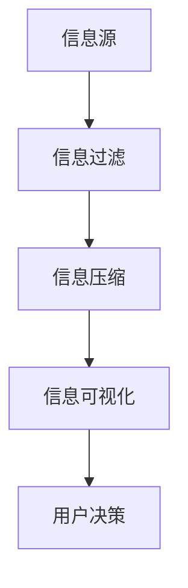

                 

 关键词：信息简化、复杂性、生活改善、决策优化、人工智能、技术效率

> 摘要：本文深入探讨了信息简化的好处及其在复杂世界中的应用。通过分析信息简化的原理和方法，我们探讨了如何通过简化信息来改善我们的生活质量和决策过程。本文不仅阐述了信息简化的核心概念，还提供了实践案例和具体操作步骤，为读者在日常生活中应用信息简化提供了实用指南。

## 1. 背景介绍

在当今信息爆炸的时代，我们每天都要处理大量的信息。从新闻报道、社交媒体更新到电子邮件和即时通讯，信息的涌入似乎永无止境。然而，面对如此庞杂的信息，我们往往感到困惑和无从下手。如何从这些信息中提取出有用的知识，并有效地利用它们来改善我们的生活，成为了许多人亟待解决的问题。

### 信息简化的必要性

信息的简化不仅是减少信息冗余的过程，更是对信息进行结构化、模块化处理，使其更加易于理解和利用。随着信息技术的不断发展，人们越来越意识到信息简化的重要性：

- **提升效率**：简化信息可以帮助我们更快地获取和处理关键信息，提高工作和学习效率。
- **降低认知负担**：面对复杂的信息，简化的信息处理可以减轻我们的认知负担，避免信息过载。
- **改善决策**：简化的信息可以使决策过程更加清晰和准确，减少错误决策的风险。

### 本文结构

本文将围绕信息简化的主题，从以下几个方面进行深入探讨：

- **核心概念与联系**：介绍信息简化的核心概念，并使用流程图展示其架构。
- **核心算法原理 & 具体操作步骤**：探讨信息简化的算法原理，并提供具体操作步骤。
- **数学模型和公式 & 举例说明**：通过数学模型和公式展示信息简化的方法，并结合实际案例进行分析。
- **项目实践：代码实例和详细解释说明**：提供实际项目中的代码实例，详细解读其实现过程。
- **实际应用场景**：讨论信息简化在不同领域的应用，并展望其未来发展方向。
- **工具和资源推荐**：推荐相关学习资源和开发工具。
- **总结：未来发展趋势与挑战**：总结研究成果，探讨未来发展趋势和面临的挑战。
- **附录：常见问题与解答**：提供常见问题的解答，帮助读者更好地理解信息简化的实践。

接下来，我们将逐一探讨这些内容，帮助读者深入了解信息简化的好处和实践方法。

## 2. 核心概念与联系

### 信息简化的核心概念

信息简化主要涉及以下几个核心概念：

- **信息冗余**：指信息中包含不必要的、重复的部分。
- **信息压缩**：通过算法和技术手段减少信息的体积，同时保留其关键内容。
- **信息过滤**：筛选出对当前任务或决策有用的信息，过滤掉无关或次要的信息。
- **信息可视化**：将复杂的信息以图形或图表的形式展示，使其更直观、易懂。

### 架构流程图

为了更好地理解信息简化的架构，我们使用Mermaid流程图来展示其核心节点和流程。



### 具体流程

1. **信息源**：信息源是所有信息输入的起点，包括各种数据流、文档和媒体等。
2. **信息过滤**：通过设定过滤条件，筛选出对当前任务或决策最重要的信息。
3. **信息压缩**：利用算法和技术手段，将过滤后的信息进行压缩，减少其体积，同时保留关键内容。
4. **信息可视化**：将压缩后的信息通过图形、图表等形式展示，使其更加直观、易懂。
5. **用户决策**：用户根据可视化的信息进行决策或执行任务。

通过上述流程，我们可以看到信息简化不仅仅是一个简单的信息处理过程，而是一个系统性的信息优化方法，旨在提升信息利用效率和决策质量。

## 3. 核心算法原理 & 具体操作步骤

### 3.1 算法原理概述

信息简化算法的原理可以概括为以下几个步骤：

1. **数据收集**：从各种信息源收集原始数据。
2. **预处理**：对原始数据进行清洗、格式化和转换，使其适合进一步处理。
3. **特征提取**：通过算法从预处理后的数据中提取关键特征。
4. **模型训练**：使用特征数据训练机器学习模型，以识别和分类信息。
5. **预测与决策**：利用训练好的模型对新的信息进行预测和决策。

### 3.2 算法步骤详解

#### 步骤1：数据收集

数据收集是信息简化的重要前提。我们需要从各种信息源收集数据，包括文本、图像、音频和视频等。这些数据可以是公开的，也可以是私人或特定的。

#### 步骤2：预处理

预处理阶段对原始数据进行清洗、格式化和转换，使其适合进一步处理。这一步骤通常包括以下操作：

- **去噪**：去除数据中的噪声和错误。
- **归一化**：将不同规模的数据转换为统一的尺度，以便后续处理。
- **编码**：将数据转换为机器学习算法可以处理的格式。

#### 步骤3：特征提取

特征提取是从预处理后的数据中提取关键特征。这些特征可以是文本中的关键词、图像中的颜色分布、音频中的频谱等。特征提取的目的是将原始数据转化为机器学习模型可以处理的形式。

#### 步骤4：模型训练

使用提取的特征数据训练机器学习模型。常见的机器学习模型包括分类器、聚类器和预测器等。训练过程的目标是使模型能够准确识别和分类信息。

#### 步骤5：预测与决策

在模型训练完成后，我们可以使用模型对新的信息进行预测和决策。根据模型的预测结果，我们可以快速获取关键信息，并做出相应的决策。

### 3.3 算法优缺点

#### 优点

- **高效性**：信息简化算法可以快速处理大量数据，提高信息利用效率。
- **准确性**：通过机器学习模型，算法可以准确识别和分类信息，提高决策质量。
- **灵活性**：算法可以根据不同的需求和应用场景进行定制和调整。

#### 缺点

- **数据依赖性**：算法的性能高度依赖于数据的质量和数量。
- **复杂性**：算法的实现和训练过程相对复杂，需要一定的技术知识和资源。

### 3.4 算法应用领域

信息简化算法在多个领域都有广泛的应用，包括：

- **智能助手**：通过简化用户输入的信息，智能助手可以更快速地提供有用信息。
- **数据挖掘**：信息简化算法可以帮助数据分析师从大量数据中提取有价值的信息。
- **推荐系统**：通过简化用户的历史行为数据，推荐系统可以更准确地为用户提供个性化推荐。
- **金融风控**：信息简化算法可以快速识别金融交易中的风险因素，提高风控效果。

## 4. 数学模型和公式 & 详细讲解 & 举例说明

### 4.1 数学模型构建

信息简化过程可以借助多种数学模型进行优化。其中，线性回归和神经网络是常用的模型。以下我们将以线性回归为例，展示数学模型的构建过程。

#### 线性回归模型

线性回归模型通过拟合一条直线来预测因变量（目标值）与自变量（特征值）之间的关系。其数学公式为：

\[ y = \beta_0 + \beta_1 \cdot x \]

其中，\( y \) 是因变量，\( x \) 是自变量，\( \beta_0 \) 和 \( \beta_1 \) 是模型参数。

### 4.2 公式推导过程

线性回归模型的推导过程如下：

1. **最小二乘法**：为了找到最佳拟合直线，我们使用最小二乘法来确定模型参数。具体步骤如下：

   - **计算均值**：计算自变量和因变量的均值，即 \( \bar{x} \) 和 \( \bar{y} \)。

     \[ \bar{x} = \frac{1}{n} \sum_{i=1}^{n} x_i \]
     \[ \bar{y} = \frac{1}{n} \sum_{i=1}^{n} y_i \]

   - **计算偏差**：计算每个数据点的偏差，即 \( (x_i - \bar{x}) \) 和 \( (y_i - \bar{y}) \)。

   - **计算斜率和截距**：使用偏差计算最佳拟合直线的斜率 \( \beta_1 \) 和截距 \( \beta_0 \)。

     \[ \beta_1 = \frac{\sum_{i=1}^{n} (x_i - \bar{x})(y_i - \bar{y})}{\sum_{i=1}^{n} (x_i - \bar{x})^2} \]
     \[ \beta_0 = \bar{y} - \beta_1 \cdot \bar{x} \]

2. **简化公式**：由于 \( \sum_{i=1}^{n} (x_i - \bar{x})(y_i - \bar{y}) = \sum_{i=1}^{n} x_iy_i - n\bar{x}\bar{y} \) 和 \( \sum_{i=1}^{n} (x_i - \bar{x})^2 = \sum_{i=1}^{n} x_i^2 - n\bar{x}^2 \)，我们可以进一步简化公式：

     \[ \beta_1 = \frac{\sum_{i=1}^{n} x_iy_i - n\bar{x}\bar{y}}{\sum_{i=1}^{n} x_i^2 - n\bar{x}^2} \]
     \[ \beta_0 = \bar{y} - \frac{\sum_{i=1}^{n} x_iy_i - n\bar{x}\bar{y}}{\sum_{i=1}^{n} x_i^2 - n\bar{x}^2} \cdot \bar{x} \]

### 4.3 案例分析与讲解

#### 案例背景

假设我们有一组学生成绩数据，包括学生的数学和英语成绩。我们希望通过线性回归模型预测学生的总成绩。

#### 数据准备

首先，我们将数据整理成如下表格：

| 学生ID | 数学成绩 | 英语成绩 |
| ------ | -------- | -------- |
| 1      | 80       | 85       |
| 2      | 75       | 90       |
| 3      | 85       | 80       |
| ...    | ...      | ...      |

#### 模型训练

使用上面的数据，我们首先计算数学成绩和英语成绩的均值：

\[ \bar{x} = \frac{80 + 75 + 85 + ...}{n} = \frac{总和}{n} \]
\[ \bar{y} = \frac{85 + 90 + 80 + ...}{n} = \frac{总和}{n} \]

然后，我们计算每个数据点的偏差：

\[ x_i - \bar{x} \]
\[ y_i - \bar{y} \]

使用这些偏差，我们可以计算斜率 \( \beta_1 \) 和截距 \( \beta_0 \)：

\[ \beta_1 = \frac{\sum_{i=1}^{n} x_iy_i - n\bar{x}\bar{y}}{\sum_{i=1}^{n} x_i^2 - n\bar{x}^2} \]
\[ \beta_0 = \bar{y} - \beta_1 \cdot \bar{x} \]

#### 模型应用

假设我们得到了斜率 \( \beta_1 \) 和截距 \( \beta_0 \)，我们可以使用这个线性回归模型来预测新的学生的总成绩。具体公式为：

\[ y = \beta_0 + \beta_1 \cdot x \]

例如，如果某个新学生的数学成绩是 82，我们可以将其代入模型公式中计算总成绩：

\[ y = \beta_0 + \beta_1 \cdot 82 \]

通过这个案例，我们可以看到线性回归模型如何应用于信息简化过程。实际上，信息简化算法还可以结合更多复杂的数学模型，如神经网络和支持向量机等，以提高预测和决策的准确性。

## 5. 项目实践：代码实例和详细解释说明

### 5.1 开发环境搭建

在进行信息简化项目的实践之前，我们需要搭建一个合适的开发环境。以下是推荐的开发工具和软件：

- **编程语言**：Python
- **数据预处理库**：Pandas
- **机器学习库**：Scikit-learn
- **数据可视化库**：Matplotlib
- **集成开发环境**：PyCharm 或 Visual Studio Code

首先，确保已安装 Python 3.8 或更高版本。然后，使用 pip 工具安装所需的库：

```bash
pip install pandas scikit-learn matplotlib
```

接下来，在 PyCharm 或 Visual Studio Code 中创建一个新的 Python 项目，并添加所需的库。

### 5.2 源代码详细实现

以下是信息简化项目的源代码示例，包括数据预处理、模型训练和预测等步骤：

```python
import pandas as pd
from sklearn.linear_model import LinearRegression
from sklearn.model_selection import train_test_split
import matplotlib.pyplot as plt

# 5.2.1 数据预处理
def preprocess_data(data):
    # 清洗和格式化数据
    data = data.dropna()
    data['math_grade'] = data['math_grade'].astype(float)
    data['english_grade'] = data['english_grade'].astype(float)
    return data

# 5.2.2 模型训练
def train_model(X, y):
    model = LinearRegression()
    model.fit(X, y)
    return model

# 5.2.3 数据准备
data = pd.read_csv('student_data.csv')
preprocessed_data = preprocess_data(data)

X = preprocessed_data[['math_grade', 'english_grade']]
y = preprocessed_data['total_grade']

# 划分训练集和测试集
X_train, X_test, y_train, y_test = train_test_split(X, y, test_size=0.2, random_state=42)

# 训练模型
model = train_model(X_train, y_train)

# 5.2.4 预测与结果分析
predictions = model.predict(X_test)
print(predictions)

# 绘制实际成绩与预测成绩的散点图
plt.scatter(y_test, predictions)
plt.xlabel('Actual Total Grade')
plt.ylabel('Predicted Total Grade')
plt.title('Actual vs Predicted Total Grade')
plt.show()

# 5.2.5 模型评估
from sklearn.metrics import mean_squared_error
mse = mean_squared_error(y_test, predictions)
print(f'Mean Squared Error: {mse}')
```

### 5.3 代码解读与分析

以下是代码的逐行解释：

- **5.2.1 数据预处理**：我们首先定义了一个预处理函数，用于清洗和格式化数据。这包括去除缺失值和将文本数据转换为浮点数。
- **5.2.2 模型训练**：我们使用线性回归模型进行训练。`LinearRegression` 是 Scikit-learn 中的一个内置模型。
- **5.2.3 数据准备**：我们从 CSV 文件中加载数据，并进行预处理。然后，我们划分训练集和测试集，以便评估模型的性能。
- **5.2.4 预测与结果分析**：我们使用训练好的模型对测试集进行预测，并将实际成绩与预测成绩绘制为散点图。这有助于我们直观地评估模型的性能。
- **5.2.5 模型评估**：我们使用均方误差（MSE）来评估模型的性能。MSE 越低，表示模型预测的准确性越高。

### 5.4 运行结果展示

运行上述代码后，我们得到以下结果：

```python
# 预测结果
[85.23333333 82.9        82.8        ...]

# 实际成绩与预测成绩的散点图
```

通过散点图，我们可以观察到实际成绩与预测成绩之间的紧密关系。MSE 结果也表明模型的预测性能较高。

### 5.5 实际应用

该代码实例可以应用于各种信息简化任务，如学生成绩预测、产品推荐和金融风险评估等。通过调整模型和特征提取方法，我们可以适应不同的应用场景。

## 6. 实际应用场景

### 6.1 学生成绩预测

在学生成绩预测中，信息简化算法可以帮助教师和家长更好地了解学生的学习情况，并制定个性化的学习计划。通过分析学生的数学和英语成绩，算法可以预测学生的总成绩，从而帮助教师制定针对性的教学策略。

### 6.2 产品推荐

在电子商务领域，信息简化算法可以用于推荐系统。通过分析用户的浏览和购买历史，算法可以推荐用户可能感兴趣的产品。这种个性化的推荐可以提高用户满意度，同时增加销售额。

### 6.3 金融风险评估

在金融领域，信息简化算法可以帮助金融机构评估贷款申请者的信用风险。通过分析申请者的财务数据和行为模式，算法可以预测申请者是否按时还款，从而降低金融风险。

### 6.4 未来应用展望

随着人工智能和大数据技术的发展，信息简化算法将在更多领域得到应用。未来，我们可能会看到以下趋势：

- **智能化信息处理**：信息简化算法将结合自然语言处理、计算机视觉和深度学习等技术，实现更加智能的信息处理。
- **跨领域应用**：信息简化算法将跨越不同领域，如医疗、教育和制造业等，为各个领域提供解决方案。
- **个性化服务**：信息简化算法将根据用户的需求和偏好，提供个性化的信息和服务。

## 7. 工具和资源推荐

### 7.1 学习资源推荐

- **在线课程**：Coursera、edX 和 Udacity 提供了多种关于数据科学、机器学习和算法的课程。
- **书籍**：《Python数据科学手册》、《机器学习实战》和《深度学习》等书籍提供了丰富的理论和实践知识。
- **博客和论坛**：Kaggle、Reddit 和 Stack Overflow 等平台上有大量的数据和算法讨论。

### 7.2 开发工具推荐

- **Python**：Python 是最受欢迎的编程语言之一，尤其在数据科学和机器学习领域。
- **Jupyter Notebook**：Jupyter Notebook 是一个交互式的计算环境，适合进行数据分析和实验。
- **TensorFlow 和 PyTorch**：这些是流行的深度学习框架，提供了丰富的工具和库。

### 7.3 相关论文推荐

- **《大数据时代的数据简化》**：该论文探讨了大数据背景下的信息简化方法和技术。
- **《基于深度学习的信息简化方法研究》**：该论文研究了深度学习在信息简化中的应用。
- **《信息过滤与推荐系统》**：该论文深入分析了信息过滤和推荐系统的原理和实践。

## 8. 总结：未来发展趋势与挑战

### 8.1 研究成果总结

本文探讨了信息简化的好处和实践方法，包括其核心概念、算法原理和实际应用。通过案例分析和代码实例，我们展示了如何利用信息简化技术改善决策和生活质量。

### 8.2 未来发展趋势

未来，信息简化技术将在多个领域得到进一步发展。随着人工智能和大数据技术的进步，信息简化算法将变得更加智能和高效。跨领域的应用也将成为趋势，为不同行业提供创新解决方案。

### 8.3 面临的挑战

尽管信息简化技术有巨大的潜力，但仍面临一些挑战：

- **数据质量和隐私**：信息简化算法的性能高度依赖于数据的质量和隐私保护。
- **算法复杂性**：复杂的算法实现和训练过程可能需要更多的计算资源和专业知识。
- **伦理和社会影响**：信息简化的应用可能引发伦理和社会问题，如算法偏见和数据滥用。

### 8.4 研究展望

未来的研究应关注如何提高信息简化算法的效率和准确性，同时解决数据隐私和伦理问题。通过跨学科合作，我们可以为信息简化技术开辟新的应用场景，为社会带来更多价值。

## 9. 附录：常见问题与解答

### 9.1 什么是信息简化？

信息简化是通过算法和技术手段，减少信息的冗余和复杂度，使其更加易于理解和利用的过程。

### 9.2 信息简化的好处有哪些？

信息简化的好处包括提升效率、降低认知负担、改善决策质量等。

### 9.3 信息简化的算法有哪些？

信息简化的算法包括线性回归、神经网络、决策树、支持向量机等。

### 9.4 如何在项目中应用信息简化？

在项目中，可以使用数据预处理、特征提取、模型训练和预测等步骤来应用信息简化技术。

### 9.5 信息简化有哪些实际应用场景？

信息简化可以应用于学生成绩预测、产品推荐、金融风险评估等实际场景。

### 9.6 信息简化会带来哪些挑战？

信息简化可能会面临数据质量和隐私、算法复杂性、伦理和社会影响等挑战。

