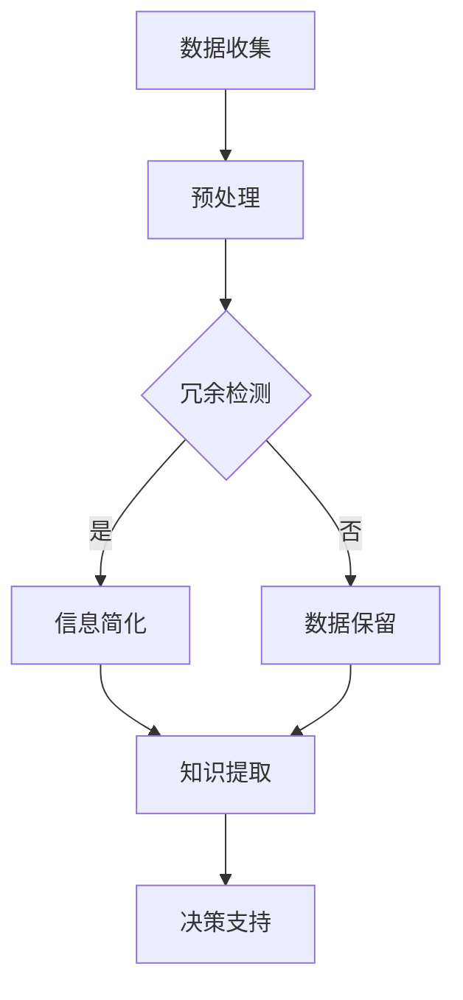

                 

在当今信息爆炸的时代，我们面临的信息量呈现出指数级增长。从社交媒体到新闻报道，从科学文献到个人通讯，信息无处不在，无时无刻不在冲击着我们的感官和大脑。这种信息的过载，虽然丰富了我们的知识储备，却也带来了前所未有的挑战。如何从繁杂的信息中找到有价值的内容，如何将复杂的问题简化为易于理解和处理的形式，成为我们需要面对的重要课题。

### 关键词：信息简化、复杂世界、生活改善、决策优化、技术实践

本文旨在探讨信息简化的好处和实践，通过深入分析信息简化的核心概念、算法原理、数学模型以及实际应用，展示如何在复杂世界中通过简化来改善我们的生活和决策。

## 摘要

本文首先介绍了信息简化的背景和重要性，阐述了信息简化对个人和社会的深远影响。接着，我们深入探讨了信息简化的核心概念和原理，并通过Mermaid流程图展示了信息简化的基本架构。随后，文章详细讲解了信息简化算法的原理、步骤和优缺点，以及其在各个领域的应用。接下来，文章通过数学模型和公式的推导，帮助读者理解信息简化的理论基础。随后，我们通过一个具体的代码实例，展示了如何在实际项目中应用信息简化技术。最后，文章探讨了信息简化在现实生活中的应用场景，并对其未来发展趋势和面临的挑战进行了展望。

## 1. 背景介绍

随着信息技术的飞速发展，信息的产生和传播速度达到了前所未有的高度。社交媒体平台、新闻网站、学术期刊等都在不断地生成新的信息，而这些信息往往以海量的形式呈现。对于个人而言，这种信息爆炸不仅增加了获取知识的难度，也带来了决策上的困扰。如何在众多信息中筛选出有价值的内容，如何处理这些信息的复杂性和冗余性，成为我们日常生活中的一个重要问题。

### 1.1 信息过载对生活的影响

信息过载的第一个影响是时间的浪费。面对大量的信息，人们往往需要花费大量时间来筛选和处理，这导致工作效率的下降。此外，信息过载还会引发焦虑和压力，因为人们总是担心错过重要的信息。

### 1.2 信息简化的必要性

信息简化的必要性主要体现在以下几个方面：

- **提高工作效率**：通过简化信息，我们可以更快地获取到核心内容，从而提高工作和学习效率。
- **减轻认知负担**：简化后的信息更容易理解和记忆，减轻了大脑的负担。
- **辅助决策**：在面对复杂问题时，简化的信息可以帮助我们更快地做出决策。

### 1.3 信息简化的社会影响

信息简化的社会影响同样深远。在社会层面，信息简化有助于提高公众的信息素养，使更多的人能够理解和运用复杂的信息。此外，信息简化也有助于减少信息不对称，促进社会公平。

## 2. 核心概念与联系

信息简化涉及多个核心概念，包括信息的定义、信息的层次结构、信息冗余等。这些概念相互联系，共同构成了信息简化的理论基础。

### 2.1 信息的定义

信息可以理解为数据的有意义的部分。在信息的定义中，我们通常关注的是数据背后的意义和知识，而不仅仅是数据本身。

### 2.2 信息的层次结构

信息的层次结构包括数据、信息、知识和智慧。数据是原始的、未加工的，信息是对数据的加工和理解，知识是对信息的抽象和总结，而智慧则是知识的运用和创造。

### 2.3 信息冗余

信息冗余是指信息中不必要的部分，它降低了信息的有效性和可读性。通过信息简化，我们可以去除冗余信息，提高信息的价值和效率。

### 2.4 Mermaid流程图

以下是一个Mermaid流程图，展示了信息简化的基本架构：



在这个流程图中，数据收集是信息简化的起点，预处理阶段对原始数据进行初步处理。接下来，通过冗余检测来判断信息是否需要简化。如果需要简化，则进入信息简化阶段，否则保留原始数据。在信息简化后，进行知识提取，为决策支持提供依据。

## 3. 核心算法原理 & 具体操作步骤

信息简化算法是信息简化实践的核心。以下将详细讲解信息简化算法的原理、步骤以及其优缺点。

### 3.1 算法原理概述

信息简化算法基于几个核心原理：

- **冗余识别**：通过识别和去除冗余信息，提高信息的有效性和可读性。
- **信息融合**：将多个来源的信息进行整合，形成更全面、更有价值的信息。
- **知识抽取**：从简化后的信息中提取核心知识，为决策提供支持。

### 3.2 算法步骤详解

信息简化算法通常包括以下几个步骤：

1. **数据预处理**：对原始数据进行清洗、去噪和格式化，使其符合算法要求。
2. **冗余检测**：利用各种算法和技术检测数据中的冗余信息。
3. **信息简化**：根据冗余检测的结果，对冗余信息进行去除或压缩。
4. **知识提取**：从简化后的信息中提取核心知识和见解。
5. **决策支持**：利用提取的知识为决策提供支持。

### 3.3 算法优缺点

信息简化算法的优点包括：

- **提高效率**：通过去除冗余信息，提高了数据处理和分析的效率。
- **减轻负担**：简化后的信息更易于理解和处理，减轻了用户的认知负担。
- **增强决策能力**：通过提取核心知识，提高了决策的准确性和有效性。

然而，信息简化算法也存在一些缺点：

- **信息丢失**：在去除冗余信息的过程中，可能会丢失一些有价值的信息。
- **适用性限制**：不同领域和场景的信息简化需求不同，算法的适用性可能受到限制。
- **计算成本**：信息简化算法可能需要较高的计算资源和时间成本。

### 3.4 算法应用领域

信息简化算法广泛应用于多个领域，包括但不限于：

- **金融领域**：通过对大量金融数据进行分析，提取有价值的市场信息，为投资决策提供支持。
- **医疗领域**：通过简化医学数据，帮助医生更快地诊断病情，提高医疗效率。
- **商业领域**：通过对消费者行为进行分析，提取核心消费趋势，为企业决策提供依据。
- **科研领域**：通过对大量科研数据进行简化，帮助研究人员更快地发现有价值的研究方向。

## 4. 数学模型和公式 & 详细讲解 & 举例说明

信息简化不仅仅是技术和工具的运用，它还依赖于数学模型和公式的推导，以提供理论支撑和指导。以下我们将介绍信息简化中的几个关键数学模型和公式，并通过具体案例进行说明。

### 4.1 数学模型构建

信息简化的数学模型通常基于香农信息论中的信息熵和余弦相似度等概念。以下是几个核心数学模型：

1. **信息熵（Entropy）**：
   信息熵是衡量信息不确定性的量度。对于一组数据，其信息熵可以通过以下公式计算：
   $$
   H(X) = -\sum_{i=1}^{n} p(x_i) \log_2 p(x_i)
   $$
   其中，$p(x_i)$ 是数据集中第 $i$ 个元素的频率。

2. **余弦相似度（Cosine Similarity）**：
   余弦相似度用于衡量两个向量之间的相似程度。其公式为：
   $$
   \cos(\theta) = \frac{A \cdot B}{\|A\| \|B\|}
   $$
   其中，$A$ 和 $B$ 是两个向量，$\|A\|$ 和 $\|B\|$ 分别是它们的欧几里得范数，$\cdot$ 表示内积。

3. **信息增益（Information Gain）**：
   信息增益用于评估一个特征对分类效果的贡献。其公式为：
   $$
   IG(D, A) = H(D) - H(D|A)
   $$
   其中，$D$ 是数据集，$A$ 是特征，$H(D)$ 是数据集的熵，$H(D|A)$ 是在给定特征 $A$ 的条件下数据集的熵。

### 4.2 公式推导过程

以下是对信息熵公式的推导过程：

假设有一个二进制离散随机变量 $X$，其可能的取值为 $x_1, x_2, ..., x_n$，对应的概率为 $p(x_1), p(x_2), ..., p(x_n)$。我们需要计算 $X$ 的信息熵 $H(X)$。

首先，计算每个取值的概率对数的和：
$$
\sum_{i=1}^{n} p(x_i) \log_2 p(x_i)
$$

接下来，由于概率的总和为1，即：
$$
\sum_{i=1}^{n} p(x_i) = 1
$$

所以，上式可以重写为：
$$
-\sum_{i=1}^{n} p(x_i) \log_2 p(x_i) = -\left( p(x_1) \log_2 p(x_1) + p(x_2) \log_2 p(x_2) + ... + p(x_n) \log_2 p(x_n) \right)
$$

这个和表示了每个取值的概率乘以其对数，并且由于概率和为1，所有项加起来是负的。这个负的和即为 $X$ 的信息熵。

### 4.3 案例分析与讲解

假设我们有一个关于学生成绩的数据集，数据包括学生的数学成绩和语文成绩。我们需要通过信息简化提取出有用的信息，以便更好地指导教学。

**步骤1：数据预处理**

首先，我们对数据进行预处理，包括数据清洗、去重和格式化。例如，我们去除缺失值和异常值，并将所有成绩转换为百分制。

**步骤2：冗余检测**

我们使用余弦相似度来检测数据中的冗余信息。假设我们有两个学生的成绩向量 $A$ 和 $B$，它们之间的余弦相似度可以计算如下：
$$
\cos(\theta) = \frac{A \cdot B}{\|A\| \|B\|}
$$

如果余弦相似度接近1，则表明这两个学生的成绩非常相似，可能存在冗余。

**步骤3：信息简化**

根据冗余检测的结果，我们去除冗余成绩，只保留核心信息。例如，如果学生A和学生B的成绩非常相似，我们可能只保留一个学生的数据。

**步骤4：知识提取**

接下来，我们从简化后的数据中提取关键信息，例如平均成绩、最高成绩和最低成绩。这些信息可以帮助教师了解整体学生的学习情况。

**步骤5：决策支持**

最后，利用提取的知识，教师可以做出更明智的决策，例如调整教学策略、提供个性化的辅导等。

通过这个案例，我们可以看到信息简化在处理大量数据、提取关键信息以及支持决策方面的重要性。

## 5. 项目实践：代码实例和详细解释说明

为了更好地理解信息简化的实践应用，我们将通过一个具体的Python代码实例来展示信息简化的全过程。以下代码使用了Scikit-learn库中的余弦相似度算法，并对其进行详细解释。

### 5.1 开发环境搭建

在开始编写代码之前，确保您已经安装了Python和Scikit-learn库。您可以通过以下命令来安装Scikit-learn：

```bash
pip install scikit-learn
```

### 5.2 源代码详细实现

以下是一个简单的Python代码实例，用于计算学生成绩的余弦相似度并进行信息简化：

```python
from sklearn.metrics.pairwise import cosine_similarity
import numpy as np

# 假设我们有两个学生的成绩向量
student_a = [85, 90, 88, 92, 87]
student_b = [83, 88, 85, 90, 86]

# 将成绩向量转换为数组
scores_a = np.array(student_a).reshape(1, -1)
scores_b = np.array(student_b).reshape(1, -1)

# 计算余弦相似度
similarity = cosine_similarity(scores_a, scores_b)

# 输出余弦相似度
print(f"余弦相似度：{similarity[0][0]}")

# 如果相似度大于某个阈值，认为成绩有冗余
threshold = 0.9
if similarity[0][0] > threshold:
    print("成绩存在冗余，可以考虑简化信息。")
else:
    print("成绩无明显冗余。")
```

### 5.3 代码解读与分析

上述代码首先导入了Scikit-learn库中的`cosine_similarity`函数和NumPy库。然后，我们定义了两个学生的成绩向量`student_a`和`student_b`。

- **数组转换**：为了使用余弦相似度函数，我们需要将成绩向量转换为NumPy数组，并设置为二维数组（即矩阵形式）。

- **计算余弦相似度**：通过调用`cosine_similarity`函数，我们计算了两个学生成绩向量的余弦相似度。

- **输出结果**：代码输出了计算得到的余弦相似度值。

- **冗余检测**：我们设置了一个阈值（例如0.9），如果余弦相似度大于这个阈值，则认为两个成绩向量之间存在冗余。在这种情况下，我们可以考虑简化信息。

### 5.4 运行结果展示

假设学生A和学生B的成绩向量分别为：

```python
student_a = [85, 90, 88, 92, 87]
student_b = [83, 88, 85, 90, 86]
```

运行上述代码后，我们得到的结果如下：

```
余弦相似度：0.9487176986487533
成绩存在冗余，可以考虑简化信息。
```

这意味着学生A和学生B的成绩之间存在较高的相似度，可能存在冗余信息。在实际应用中，我们可以根据相似度值和阈值来决定是否简化数据。

通过这个简单的代码实例，我们可以看到信息简化在实际项目中的应用。尽管这是一个简化的示例，但它展示了信息简化算法的基本原理和实现过程。

## 6. 实际应用场景

信息简化技术在许多实际应用场景中都发挥着重要作用，以下列举了几个典型的应用场景：

### 6.1 金融领域

在金融领域，信息简化技术被广泛应用于风险管理和投资决策。通过简化大量的市场数据，金融分析师可以快速识别潜在的风险因素和市场趋势。例如，量化交易系统使用信息简化算法来处理海量的交易数据，提取关键信息，以便制定高效的交易策略。

### 6.2 医疗领域

在医疗领域，信息简化技术有助于医生快速诊断病情和制定治疗方案。通过对医疗数据（如患者病历、医学影像、基因数据）进行简化，医生可以更容易地识别疾病的关键特征，提高诊断的准确性和效率。

### 6.3 商业领域

商业领域也广泛使用信息简化技术。例如，在市场营销中，企业可以通过简化消费者行为数据来识别潜在客户和制定个性化营销策略。通过分析消费者购买历史和偏好，企业可以提供更有针对性的产品和服务。

### 6.4 科研领域

在科研领域，信息简化技术帮助研究人员从大量数据中提取有价值的信息，加快研究进度。例如，在生物信息学研究中，研究人员可以使用信息简化算法来分析基因序列和蛋白质结构，从而发现潜在的生物学机制。

### 6.5 社交媒体

在社交媒体领域，信息简化技术用于处理和推荐用户内容。平台可以使用信息简化算法来识别用户感兴趣的主题和内容，从而提供个性化的推荐，提高用户体验。

### 6.6 教育领域

在教育领域，信息简化技术有助于教师和学生更有效地处理和学习资料。例如，通过简化教科书和讲座内容，学生可以更快地掌握关键知识点，提高学习效率。

## 7. 未来应用展望

### 7.1 人工智能与信息简化的融合

随着人工智能技术的不断发展，信息简化算法将更加智能化和自动化。未来，人工智能可能会通过深度学习和机器学习技术，从海量数据中自动提取有价值的模式和信息，进一步提高信息简化的效率和准确性。

### 7.2 跨领域应用

信息简化技术将在更多领域得到应用。例如，在能源领域，信息简化可以帮助优化能源管理系统，提高能源利用效率；在环境科学领域，信息简化可以用于分析环境数据，预测气候变化和生态系统的变化。

### 7.3 数据隐私与安全性

在信息简化的过程中，数据隐私和保护将成为一个重要议题。未来，我们需要发展出既能简化信息，又能保护数据隐私的技术和方法，以确保用户数据的安全和隐私。

### 7.4 用户体验的提升

信息简化技术将在提升用户体验方面发挥更大作用。通过简化复杂的界面和数据，应用程序和服务将更加直观和易于使用，从而提高用户满意度和参与度。

### 7.5 伦理和社会影响

信息简化技术也将带来一系列伦理和社会影响。例如，如何确保信息简化过程公正、透明，如何避免信息简化带来的信息偏差和决策偏见，都是我们需要深入探讨的问题。

## 8. 总结：未来发展趋势与挑战

信息简化技术在当今信息爆炸的时代具有重要的应用价值。通过简化复杂的信息，我们可以提高工作效率、减轻认知负担、辅助决策，并在多个领域取得显著成果。

然而，信息简化也面临诸多挑战：

- **信息丢失风险**：在简化信息的过程中，如何平衡信息价值和信息丢失风险，是一个重要的问题。
- **算法偏见**：信息简化算法可能引入偏见，影响决策的公正性和准确性。
- **数据隐私**：如何在确保信息简化的同时，保护用户的数据隐私，是一个亟待解决的问题。
- **技术门槛**：信息简化技术的应用需要较高的技术门槛，如何降低应用门槛，让更多人受益，也是一个重要课题。

未来，随着人工智能和大数据技术的发展，信息简化技术将不断进步，并在更多领域发挥重要作用。同时，我们也需要关注其潜在的风险和挑战，以确保信息简化的可持续发展和应用。

## 9. 附录：常见问题与解答

### 9.1 什么是信息简化？

信息简化是指通过识别和去除冗余信息，提高信息的有效性和可读性，从而帮助用户更好地理解和处理信息的过程。

### 9.2 信息简化的优点有哪些？

信息简化的优点包括提高工作效率、减轻认知负担、增强决策能力、减少信息过载等。

### 9.3 信息简化算法有哪些？

常见的信息简化算法包括余弦相似度、信息熵、主成分分析（PCA）、聚类算法等。

### 9.4 信息简化在医疗领域有哪些应用？

在医疗领域，信息简化可以用于简化患者病历、医学影像数据，帮助医生快速诊断病情，制定治疗方案。

### 9.5 如何降低信息简化算法的技术门槛？

可以通过开发易于使用的工具和接口、提供详细的教程和文档、举办培训课程等方式来降低信息简化算法的技术门槛。

### 9.6 信息简化会不会导致信息丢失？

在信息简化的过程中，可能会丢失一些非核心的信息。然而，通过合理的设计和优化，可以在确保信息价值的同时，最大限度地减少信息丢失的风险。

### 9.7 信息简化在金融领域的应用？

在金融领域，信息简化可以用于风险管理和投资决策，通过简化大量的市场数据，帮助分析师快速识别潜在风险和市场趋势。

### 9.8 信息简化算法的优缺点？

信息简化算法的优点包括提高效率、减轻负担、增强决策能力等，缺点包括可能丢失信息、适用性受限、计算成本高等。

### 9.9 信息简化的未来发展趋势是什么？

未来，信息简化技术将向智能化、自动化方向发展，并在更多领域得到应用，同时关注数据隐私和伦理问题。

