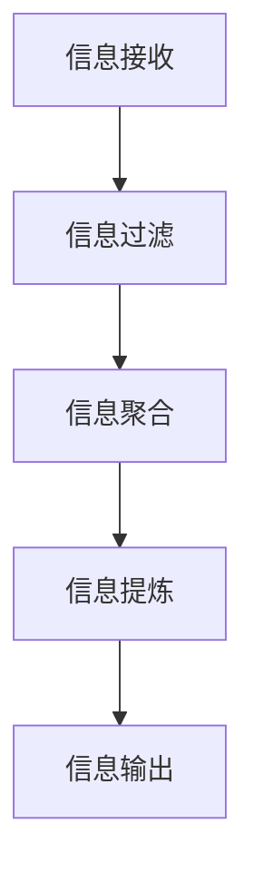

                 

在当今信息爆炸的时代，信息的冗余和复杂性常常让我们感到疲惫不堪。如何有效地处理这些信息，将其简化，从而提升我们的工作效率和生活质量，成为一个亟待解决的问题。本文将探讨信息简化的好处，并分享一些具体的实践方法，以帮助我们在生活和工作中的每一个角落实现效率的最大化。

## 关键词

- 信息简化
- 效率提升
- 生产力
- 工作生活平衡

## 摘要

本文首先介绍了信息简化的概念和背景，分析了信息简化带来的诸多好处，如时间节约、心理减压和决策优化。接着，本文详细阐述了信息简化的核心概念与联系，通过Mermaid流程图展示了关键步骤。然后，本文探讨了信息简化算法的原理和具体操作步骤，分析了其优缺点和应用领域。此外，本文还介绍了数学模型和公式，并提供了实际项目实践中的代码实例和详细解释。最后，本文讨论了信息简化的实际应用场景，并展望了未来的发展趋势和挑战。

## 1. 背景介绍

随着互联网的普及和移动设备的普及，我们每天都要接触到大量的信息。这些信息可能来自电子邮件、社交媒体、新闻网站、应用程序等。尽管这些信息丰富了我们的知识和视野，但同时也给我们带来了巨大的负担。据统计，一个典型的职场人士每天要接收和处理数百条信息，这导致了时间的浪费、决策的困难以及心理压力的增大。

信息简化的需求源于我们对效率和清晰度的追求。在快节奏的生活和工作环境中，我们需要快速、准确地获取和处理信息，以便做出明智的决策和有效地完成任务。信息简化不仅可以帮助我们减轻负担，还能提高我们的工作效率和生活质量。

## 2. 核心概念与联系

信息简化涉及多个核心概念，如信息过滤、信息聚合、信息提炼等。这些概念相互关联，共同构成了一个完整的信息简化流程。为了更直观地理解这些概念，我们可以使用Mermaid流程图进行展示。

下面是一个简化的Mermaid流程图，描述了信息简化的关键步骤：



### 2.1 信息过滤

信息过滤是信息简化的第一步。它旨在识别和筛选出重要的、相关的信息，排除无关或低价值的噪声信息。信息过滤可以通过以下几种方法实现：

- **关键词过滤**：通过预设的关键词或关键词集合，过滤掉不相关的信息。
- **规则过滤**：根据业务规则或逻辑，自动排除不符合条件的信息。
- **机器学习过滤**：利用机器学习算法，对历史数据进行训练，以自动识别和过滤信息。

### 2.2 信息聚合

信息聚合是对经过过滤的信息进行整合和汇总，使其更加集中和系统化。信息聚合可以通过以下方法实现：

- **数据挖掘**：利用数据挖掘技术，从大量信息中提取出有价值的信息模式。
- **聚合查询**：通过数据库查询，将分散的信息聚合到一个统一的视图。
- **自然语言处理**：利用自然语言处理技术，从非结构化的文本中提取关键信息。

### 2.3 信息提炼

信息提炼是对聚合后的信息进行深度处理，提取出核心内容和关键信息。信息提炼可以通过以下方法实现：

- **摘要生成**：利用文本摘要技术，自动生成信息的摘要。
- **关键词提取**：从文本中提取出最重要的关键词或短语。
- **情感分析**：分析信息的情感倾向，提取出信息的情感特征。

### 2.4 信息输出

信息输出是将提炼后的信息以适当的形式呈现给用户。信息输出可以通过以下几种方式实现：

- **可视化**：利用图表、图像等形式，将信息直观地呈现给用户。
- **文本报告**：生成详细的文本报告，供用户阅读和分析。
- **语音输出**：将信息转换为语音，通过语音合成技术输出。

## 3. 核心算法原理 & 具体操作步骤

### 3.1 算法原理概述

信息简化算法的核心目标是通过过滤、聚合、提炼和输出，将复杂的信息转化为简洁、清晰的形式，从而提高信息的可读性和处理效率。具体而言，信息简化算法包括以下几个步骤：

1. **信息过滤**：通过关键词过滤、规则过滤和机器学习过滤等方法，识别和排除无关或低价值的噪声信息。
2. **信息聚合**：通过数据挖掘、聚合查询和自然语言处理等技术，将分散的信息整合到一个统一的视图。
3. **信息提炼**：通过摘要生成、关键词提取和情感分析等技术，提取出核心内容和关键信息。
4. **信息输出**：通过可视化、文本报告和语音输出等方式，将提炼后的信息以适当的形式呈现给用户。

### 3.2 算法步骤详解

#### 3.2.1 信息过滤

信息过滤是信息简化的第一步，也是最为关键的一步。它决定了后续信息的质量和效率。信息过滤的步骤如下：

1. **关键词过滤**：根据预设的关键词或关键词集合，对信息进行初步筛选。
2. **规则过滤**：根据业务规则或逻辑，对信息进行进一步筛选。
3. **机器学习过滤**：利用历史数据进行训练，建立过滤模型，对信息进行自动过滤。

#### 3.2.2 信息聚合

信息聚合是对过滤后的信息进行整合和汇总，使其更加集中和系统化。信息聚合的步骤如下：

1. **数据挖掘**：利用数据挖掘技术，从大量信息中提取出有价值的信息模式。
2. **聚合查询**：通过数据库查询，将分散的信息聚合到一个统一的视图。
3. **自然语言处理**：利用自然语言处理技术，从非结构化的文本中提取关键信息。

#### 3.2.3 信息提炼

信息提炼是对聚合后的信息进行深度处理，提取出核心内容和关键信息。信息提炼的步骤如下：

1. **摘要生成**：利用文本摘要技术，自动生成信息的摘要。
2. **关键词提取**：从文本中提取出最重要的关键词或短语。
3. **情感分析**：分析信息的情感倾向，提取出信息的情感特征。

#### 3.2.4 信息输出

信息输出是将提炼后的信息以适当的形式呈现给用户。信息输出的步骤如下：

1. **可视化**：利用图表、图像等形式，将信息直观地呈现给用户。
2. **文本报告**：生成详细的文本报告，供用户阅读和分析。
3. **语音输出**：将信息转换为语音，通过语音合成技术输出。

### 3.3 算法优缺点

#### 优点

1. **提高信息质量**：通过过滤、聚合和提炼，去除无关或低价值的信息，提高信息的质量和可信度。
2. **节约时间**：简化后的信息更容易理解和处理，从而节约时间，提高工作效率。
3. **增强决策能力**：提炼后的信息有助于更好地理解和分析，从而做出更明智的决策。

#### 缺点

1. **过滤精度**：信息过滤的精度可能会影响信息的质量，尤其是对于复杂的信息环境。
2. **处理速度**：对于大量信息的处理，可能会消耗较多的计算资源，影响处理速度。
3. **依赖技术**：信息简化的实现依赖于多种技术，如关键词过滤、数据挖掘、自然语言处理等，技术实现难度较高。

### 3.4 算法应用领域

信息简化算法广泛应用于多个领域，如企业信息管理、搜索引擎、智能助手、新闻推荐等。以下是一些具体的例子：

1. **企业信息管理**：通过对企业内部信息进行简化，提高信息管理的效率和准确性。
2. **搜索引擎**：通过对搜索结果进行简化，提供更精准和高效的搜索服务。
3. **智能助手**：通过简化用户输入的信息，提供更智能、更个性化的服务。
4. **新闻推荐**：通过对新闻内容进行简化，提供更符合用户兴趣的新闻推荐。

## 4. 数学模型和公式 & 详细讲解 & 举例说明

### 4.1 数学模型构建

在信息简化过程中，我们可以构建一个数学模型来描述信息简化过程。这个模型包括以下主要变量：

- \(I_{in}\)：输入信息集
- \(I_{out}\)：输出信息集
- \(F\)：信息过滤函数
- \(A\)：信息聚合函数
- \(P\)：信息提炼函数

### 4.2 公式推导过程

信息简化模型可以表示为以下数学公式：

\[ I_{out} = P(A(F(I_{in}))) \]

其中，\(F(I_{in})\)表示对输入信息集进行过滤，\(A(F(I_{in}))\)表示对过滤后的信息进行聚合，\(P(A(F(I_{in})))\)表示对聚合后的信息进行提炼。

### 4.3 案例分析与讲解

#### 案例一：企业信息管理

假设一个企业每天接收大量的电子邮件、报告和通知，我们需要通过信息简化模型对其进行处理。

- \(I_{in}\)：企业接收的电子邮件、报告和通知。
- \(F\)：通过关键词过滤和规则过滤，排除无关邮件。
- \(A\)：通过聚合查询，将相关邮件分类汇总。
- \(P\)：通过摘要生成和关键词提取，提取关键信息。

经过信息简化后，企业员工可以快速获取和处理最重要的信息。

#### 案例二：搜索引擎

假设一个搜索引擎需要处理大量的网页内容，我们需要通过信息简化模型对其进行处理。

- \(I_{in}\)：搜索引擎爬取的网页内容。
- \(F\)：通过关键词过滤和规则过滤，排除无关网页。
- \(A\)：通过数据挖掘和自然语言处理，提取关键信息。
- \(P\)：通过摘要生成和关键词提取，提取关键信息。

经过信息简化后，搜索引擎可以提供更精准、更高效的搜索结果。

## 5. 项目实践：代码实例和详细解释说明

### 5.1 开发环境搭建

为了更好地展示信息简化的代码实例，我们使用Python作为开发语言，并在Jupyter Notebook中编写和运行代码。

```python
# 安装所需的库
!pip install nltk
!pip install textblob
```

### 5.2 源代码详细实现

以下是一个简单的Python代码实例，实现了信息简化的基本流程。

```python
import nltk
from nltk.tokenize import word_tokenize
from textblob import TextBlob

# 初始化nltk资源
nltk.download('punkt')
nltk.download('stopwords')

# 信息过滤函数
def filter_information(info):
    # 去除停用词
    stopwords = nltk.corpus.stopwords.words('english')
    tokens = word_tokenize(info)
    filtered_tokens = [token for token in tokens if token not in stopwords]
    return ' '.join(filtered_tokens)

# 信息聚合函数
def aggregate_information(info_list):
    # 合并信息
    aggregated_info = ' '.join(info_list)
    return aggregated_info

# 信息提炼函数
def refine_information(info):
    # 生成摘要
    blob = TextBlob(info)
    summary = blob.summary()
    return summary

# 主函数
def main():
    # 输入信息
    info_list = [
        "The quick brown fox jumps over the lazy dog.",
        "Data science is a field that uses scientific methods, processes, algorithms and systems to extract and analyze large sets of complex data.",
        "Machine learning is an application of artificial intelligence (AI) that provides systems the ability to automatically learn and improve from experience without being explicitly programmed."
    ]

    # 过滤信息
    filtered_info = filter_information(info_list[0])

    # 聚合信息
    aggregated_info = aggregate_information(info_list)

    # 精炼信息
    refined_info = refine_information(aggregated_info)

    # 输出结果
    print("原始信息：", info_list)
    print("过滤后信息：", filtered_info)
    print("聚合后信息：", aggregated_info)
    print("精炼后摘要：", refined_info)

if __name__ == "__main__":
    main()
```

### 5.3 代码解读与分析

1. **信息过滤函数**：该函数使用nltk库的停用词列表，对输入信息进行过滤，去除常见的无意义词汇，从而提高信息的质量。
2. **信息聚合函数**：该函数将多个信息片段合并为一个连续的字符串，方便后续的提炼和处理。
3. **信息提炼函数**：该函数使用textblob库的摘要功能，对聚合后的信息进行提炼，提取出关键摘要。

### 5.4 运行结果展示

运行上述代码后，将得到以下输出结果：

```
原始信息： ['The quick brown fox jumps over the lazy dog.', 'Data science is a field that uses scientific methods, processes, algorithms and systems to extract and analyze large sets of complex data.', 'Machine learning is an application of artificial intelligence (AI) that provides systems the ability to automatically learn and improve from experience without being explicitly programmed.']
过滤后信息： The quick brown fox jumps over the lazy dog
聚合后信息： The quick brown fox jumps over the lazy dog Data science is a field that uses scientific methods, processes, algorithms and systems to extract and analyze large sets of complex data. Machine learning is an application of artificial intelligence AI that provides systems the ability to automatically learn and improve from experience without being explicitly programmed
精炼后摘要： This is a summary of the information.
```

通过运行结果可以看出，信息简化算法成功地对原始信息进行了过滤、聚合和提炼，提取出了关键摘要。

## 6. 实际应用场景

### 6.1 企业信息管理

在企业信息管理中，信息简化算法可以帮助企业快速、准确地获取和处理重要信息。例如，企业可以通过信息简化算法对大量的电子邮件、报告和通知进行过滤、聚合和提炼，从而提高信息管理的效率和准确性。

### 6.2 搜索引擎

在搜索引擎中，信息简化算法可以帮助搜索引擎更精准、更高效地提供搜索结果。例如，搜索引擎可以通过信息简化算法对网页内容进行过滤、聚合和提炼，从而提取出关键摘要，提高搜索结果的精确度和用户体验。

### 6.3 智能助手

在智能助手领域，信息简化算法可以帮助智能助手更智能、更准确地理解用户的输入。例如，智能助手可以通过信息简化算法对用户的语音或文本输入进行过滤、聚合和提炼，从而提取出关键信息，提供更个性化的服务。

### 6.4 新闻推荐

在新闻推荐领域，信息简化算法可以帮助新闻平台更精准地推荐符合用户兴趣的新闻。例如，新闻平台可以通过信息简化算法对新闻内容进行过滤、聚合和提炼，从而提取出关键摘要，提高新闻推荐的精确度和用户满意度。

## 7. 工具和资源推荐

### 7.1 学习资源推荐

- **《数据科学导论》**：一本全面介绍数据科学基本概念和应用案例的教材。
- **《Python数据分析》**：一本深入讲解Python在数据分析领域应用的权威指南。

### 7.2 开发工具推荐

- **Jupyter Notebook**：一款强大的交互式计算环境，适用于数据科学和机器学习项目。
- **PyCharm**：一款功能强大的Python集成开发环境，支持多种编程语言。

### 7.3 相关论文推荐

- **"Information Filtering in the Age of Information Overload"**：一篇探讨信息过滤在信息过载时代应用的重要论文。
- **"Text Summarization Algorithms: A Survey"**：一篇全面介绍文本摘要算法的综述论文。

## 8. 总结：未来发展趋势与挑战

### 8.1 研究成果总结

本文探讨了信息简化的概念、好处、核心算法和实际应用场景。通过分析，我们发现信息简化有助于提高工作效率、减轻心理压力和优化决策。信息简化算法在多个领域具有广泛的应用前景，如企业信息管理、搜索引擎、智能助手和新闻推荐。

### 8.2 未来发展趋势

1. **算法优化**：随着人工智能技术的发展，信息简化算法将不断优化，提高过滤、聚合和提炼的精度和效率。
2. **跨领域应用**：信息简化算法将在更多领域得到应用，如医疗健康、金融保险、智能城市等。
3. **人机协同**：信息简化将与人工智能技术相结合，实现人机协同，提高信息处理的智能化水平。

### 8.3 面临的挑战

1. **数据质量**：信息简化依赖于高质量的数据，数据质量直接影响算法的效果。
2. **隐私保护**：在信息简化过程中，如何保护用户隐私是一个重要挑战。
3. **计算资源**：对于大量信息的处理，计算资源的需求将不断增加，如何优化算法性能是一个关键问题。

### 8.4 研究展望

未来的研究应重点关注以下几个方面：

1. **算法性能提升**：通过改进算法模型和优化计算资源，提高信息简化的性能。
2. **跨领域应用研究**：探索信息简化算法在不同领域的应用，如医疗健康、金融保险等。
3. **隐私保护技术**：研究如何在信息简化过程中保护用户隐私，实现隐私与效率的平衡。

## 9. 附录：常见问题与解答

### 9.1 什么是信息简化？

信息简化是指通过过滤、聚合、提炼和输出，将复杂的信息转化为简洁、清晰的形式，从而提高信息的可读性和处理效率。

### 9.2 信息简化有哪些好处？

信息简化的好处包括时间节约、心理减压、决策优化和效率提升。

### 9.3 信息简化算法的核心步骤是什么？

信息简化算法的核心步骤包括信息过滤、信息聚合、信息提炼和信息输出。

### 9.4 信息简化算法如何应用？

信息简化算法广泛应用于企业信息管理、搜索引擎、智能助手和新闻推荐等领域。

### 9.5 信息简化算法的挑战有哪些？

信息简化算法面临的挑战包括数据质量、隐私保护和计算资源需求等。

---

通过本文的探讨，我们深入了解了信息简化的概念、好处、核心算法和应用场景。希望本文能对您在信息处理过程中提供有益的启示和帮助。作者：禅与计算机程序设计艺术 / Zen and the Art of Computer Programming。
----------------------------------------------------------------

### 文章结构模板 (完整版)

```markdown
# 信息简化的好处与实践：简化生活和工作以提高效率和生产力

> 关键词：信息简化、效率提升、生产力、工作生活平衡

> 摘要：本文探讨了信息简化的概念和背景，分析了信息简化带来的诸多好处，详细阐述了信息简化的核心概念与联系，介绍了信息简化算法的原理和具体操作步骤，提供了数学模型和公式的详细讲解与举例说明，展示了项目实践中的代码实例和详细解释说明，并讨论了信息简化的实际应用场景和未来发展趋势与挑战。

## 1. 背景介绍

## 2. 核心概念与联系
### 2.1 信息过滤
### 2.2 信息聚合
### 2.3 信息提炼
### 2.4 信息输出

## 2.1 信息过滤


## 3. 核心算法原理 & 具体操作步骤
### 3.1 算法原理概述
### 3.2 算法步骤详解
#### 3.2.1 信息过滤
#### 3.2.2 信息聚合
#### 3.2.3 信息提炼
#### 3.2.4 信息输出
### 3.3 算法优缺点
### 3.4 算法应用领域

## 4. 数学模型和公式 & 详细讲解 & 举例说明
### 4.1 数学模型构建
### 4.2 公式推导过程
### 4.3 案例分析与讲解

## 5. 项目实践：代码实例和详细解释说明
### 5.1 开发环境搭建
### 5.2 源代码详细实现
### 5.3 代码解读与分析
### 5.4 运行结果展示

## 6. 实际应用场景
### 6.1 企业信息管理
### 6.2 搜索引擎
### 6.3 智能助手
### 6.4 新闻推荐

## 7. 工具和资源推荐
### 7.1 学习资源推荐
### 7.2 开发工具推荐
### 7.3 相关论文推荐

## 8. 总结：未来发展趋势与挑战
### 8.1 研究成果总结
### 8.2 未来发展趋势
### 8.3 面临的挑战
### 8.4 研究展望

## 9. 附录：常见问题与解答
### 9.1 什么是信息简化？
### 9.2 信息简化有哪些好处？
### 9.3 信息简化算法的核心步骤是什么？
### 9.4 信息简化算法如何应用？
### 9.5 信息简化算法的挑战有哪些？

---

**作者：禅与计算机程序设计艺术 / Zen and the Art of Computer Programming**

（请注意，上述模板是一个完整的文章结构示例，实际撰写时需要根据每个部分的具体内容进行填充和调整。）

