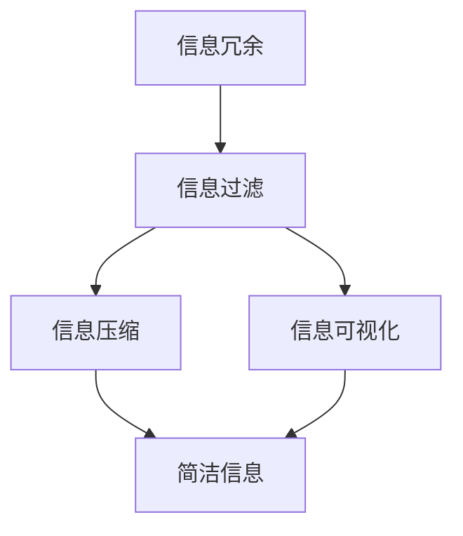

                 

在当今信息爆炸的时代，信息的冗余和复杂性给人们的日常生活和工作中带来了巨大的困扰。如何有效地管理和利用信息，提高工作效率和生产力，成为了一个亟待解决的问题。本文旨在探讨信息简化的好处和实践方法，帮助读者更好地理解和应用这一理念。

## 关键词

信息简化、效率、生产力、实践、技术、生活、工作

## 摘要

本文首先介绍了信息简化的背景和重要性，然后详细阐述了信息简化的好处，包括提高效率、减少焦虑、促进专注等。接着，本文提出了信息简化的实践方法，如信息过滤、信息分类、信息压缩等，并结合实际案例进行了详细讲解。最后，本文对信息简化的未来发展趋势和挑战进行了展望。

## 1. 背景介绍

### 信息爆炸的时代

随着互联网的普及和智能手机的广泛应用，人们每天接收到的信息量呈指数级增长。据统计，一个人每天平均会接触到约100,000条信息。这些信息涵盖了新闻、社交媒体、电子邮件、广告等各种形式。在这种情况下，如何有效地管理和利用这些信息，成为一个至关重要的问题。

### 信息过载带来的挑战

信息过载给人们的生活和工作带来了诸多挑战。首先，信息过载会导致焦虑和压力。当人们无法处理大量的信息时，往往会感到焦虑和无助。其次，信息过载会降低工作效率。人们花费大量时间在处理信息上，导致工作任务的延误和效率的降低。最后，信息过载还会影响人们的身心健康。长时间处于信息过载的状态，容易导致心理疲劳和身体不适。

### 信息简化的必要性

面对信息过载带来的挑战，信息简化成为了一种必要的方法。信息简化不仅可以帮助人们更好地管理和利用信息，提高工作效率和生产力，还可以减少焦虑、提高生活质量。本文将探讨信息简化的好处和实践方法，帮助读者在信息爆炸的时代中游刃有余。

### 信息简化的好处

信息简化具有诸多好处，下面将详细阐述。

### 提高效率

信息简化可以帮助人们更快地获取和处理信息。通过去除冗余和无关的信息，人们可以集中精力处理重要的任务。例如，使用信息过滤工具，可以自动筛选出重要邮件和新闻，节省大量时间。

### 减少焦虑

信息简化可以帮助人们减少因信息过载而产生的焦虑和压力。当人们不再被迫处理大量的无关信息时，心理负担会大大减轻。例如，使用信息分类工具，可以将信息按照主题和重要性进行分类，使人们更容易找到需要的信息。

### 促进专注

信息简化可以帮助人们更好地集中精力。当人们不再被无关的信息所干扰时，可以更专注于当前的任务。例如，使用信息压缩工具，可以将大量信息压缩为简洁的摘要，使人们更容易理解和消化。

### 信息简化的核心概念

在探讨信息简化的好处和实践方法之前，有必要先了解信息简化的核心概念。信息简化主要包括以下三个方面：

### 信息过滤

信息过滤是指通过一定的规则和算法，自动筛选出有用的信息，去除无关的信息。例如，邮件过滤、新闻过滤等。

### 信息分类

信息分类是指将信息按照一定的标准进行分类，使其更易于管理和查找。例如，电子邮件分类、文档分类等。

### 信息压缩

信息压缩是指通过一定的算法和技术，将大量信息压缩为简洁的形式，使其更易于理解和处理。例如，文本摘要、图像压缩等。

### 信息简化的实践方法

在了解了信息简化的核心概念后，下面将介绍一些具体的实践方法，帮助读者更好地实现信息简化。

### 1. 信息过滤

信息过滤是信息简化的第一步。通过信息过滤，可以自动筛选出有用的信息，去除无关的信息。以下是一些常用的信息过滤工具：

- **邮件过滤工具**：如Gmail的“过滤”功能，可以自动将邮件按照特定规则进行分类和标记。
- **新闻过滤工具**：如Google新闻，可以自动筛选出用户感兴趣的新闻。

### 2. 信息分类

信息分类是信息简化的关键步骤。通过信息分类，可以更好地管理和查找信息。以下是一些常用的信息分类工具：

- **电子邮件分类工具**：如Gmail的“标签”功能，可以将邮件按照主题、重要性等进行分类。
- **文档分类工具**：如Evernote，可以将文档按照项目、主题等进行分类。

### 3. 信息压缩

信息压缩是信息简化的最后一步。通过信息压缩，可以更好地理解和处理信息。以下是一些常用的信息压缩工具：

- **文本摘要工具**：如Abstractify，可以将长篇文章压缩为简洁的摘要。
- **图像压缩工具**：如TinyPNG，可以压缩图像文件，减少文件大小。

### 实际案例

以下是一个实际案例，展示了如何使用信息简化的实践方法来提高工作效率。

**案例：电子邮件管理**

假设您是一位企业高管，每天需要处理大量的电子邮件。以下是如何使用信息简化的实践方法来管理电子邮件：

1. **信息过滤**：使用邮件过滤工具，将垃圾邮件、广告邮件等自动筛选出去。
2. **信息分类**：使用邮件分类工具，将邮件按照主题、重要性等进行分类。
3. **信息压缩**：使用文本摘要工具，将长邮件压缩为简洁的摘要。

通过以上三个步骤，您可以大大减少处理电子邮件所需的时间，提高工作效率。

### 4. 信息可视化

信息可视化是将复杂的信息以图形或图表的形式呈现，使人们更容易理解和处理。以下是一些常用的信息可视化工具：

- **数据可视化工具**：如Tableau，可以将数据以图表的形式呈现。
- **知识图谱工具**：如Google知识图谱，可以将信息以图谱的形式呈现。

### 总结

信息简化是一种有效的方法，可以帮助人们更好地管理和利用信息，提高工作效率和生产力。通过信息过滤、信息分类、信息压缩等信息简化的实践方法，我们可以实现信息的简洁和高效。在实际应用中，结合具体场景和需求，选择合适的工具和方法，可以最大程度地发挥信息简化的优势。

## 2. 核心概念与联系

在探讨信息简化的核心概念时，我们需要理解几个关键概念：信息冗余、信息过滤、信息压缩和信息可视化。下面将详细解释这些概念，并使用Mermaid流程图展示它们之间的联系。

### 2.1 信息冗余

信息冗余是指信息中的重复内容或无关内容，这些内容会增加信息的复杂度和处理的难度。例如，一篇报告中包含大量重复的数据或引用，这些信息对于理解报告的核心内容并无帮助。

### 2.2 信息过滤

信息过滤是指通过特定的规则和算法，从大量信息中筛选出有用信息，去除冗余和无关信息的过程。信息过滤可以极大地提高信息的可用性和处理效率。

### 2.3 信息压缩

信息压缩是指通过特定的算法和技术，将大量的信息转化为更简洁的形式，以便更高效地存储、传输和处理。信息压缩可以减少信息处理的负担，提高资源的利用率。

### 2.4 信息可视化

信息可视化是将复杂的信息以图形或图表的形式呈现，使得信息更加直观易懂。信息可视化有助于人们快速捕捉信息的关键点，提高信息的可理解性和决策效率。

### Mermaid流程图

下面是一个Mermaid流程图，展示了信息冗余、信息过滤、信息压缩和信息可视化之间的联系。



在这个流程图中，信息冗余首先通过信息过滤被简化，然后通过信息压缩进一步精简为简洁信息，同时信息可视化将简化后的信息以图形或图表的形式呈现，使得信息更加直观易懂。

### 2.5 信息简化的意义

信息简化的意义在于通过去除冗余和无关信息，提高信息的质量和效率。以下是信息简化的几个关键点：

- **提高效率**：简化后的信息更加简洁，处理速度更快，节省了大量的时间和精力。
- **减少错误**：通过去除冗余信息，减少了因信息混乱导致的错误。
- **提升决策质量**：简化后的信息更容易理解和分析，有助于做出更准确的决策。
- **促进交流**：信息简化使得信息的传递更加高效和清晰，促进了团队之间的有效沟通。

### 2.6 信息简化的方法

信息简化的方法多种多样，下面介绍几种常用的方法：

- **信息筛选**：通过设定规则和标准，自动筛选出重要信息，去除冗余和无关信息。
- **摘要生成**：使用自然语言处理技术，将长篇文档或报告自动生成简洁的摘要。
- **数据压缩**：使用算法和技术，对大量数据文件进行压缩，减少存储和传输的开销。
- **图表表示**：使用图表和图形，将复杂的数据和信息以直观的方式呈现。

通过以上方法，我们可以有效地实现信息简化，提高工作和生活的效率。

## 3. 核心算法原理 & 具体操作步骤

### 3.1 算法原理概述

在信息简化的过程中，核心算法扮演着至关重要的角色。这些算法通常基于数据挖掘、机器学习和自然语言处理技术，能够自动识别、筛选和转换信息，以达到简化复杂信息的目的。以下是一些常用的核心算法及其原理概述：

#### 3.1.1 信息过滤算法

信息过滤算法主要用于从大量信息中筛选出符合特定条件的有用信息。这类算法通常采用基于规则、基于统计和基于机器学习的方法。

- **基于规则的过滤**：通过预设规则，如关键词匹配、正则表达式等，自动筛选出相关度较高的信息。
- **基于统计的过滤**：利用文本相似度计算和统计模型，如TF-IDF、LDA等，对信息进行评分和筛选。
- **基于机器学习的过滤**：使用监督学习或无监督学习算法，如朴素贝叶斯分类器、支持向量机等，对信息进行自动分类和筛选。

#### 3.1.2 信息压缩算法

信息压缩算法旨在通过算法和技术，将大量的信息转化为更简洁的形式。这类算法主要包括无损压缩和有损压缩。

- **无损压缩**：通过去除冗余信息，如重复文本、重复代码等，将信息压缩为原始大小的较小版本。常见的无损压缩算法有哈夫曼编码、LZ77、LZ78等。
- **有损压缩**：通过牺牲部分信息质量，如降低图像分辨率、减少音频比特率等，将信息压缩为更小的文件。常见的有损压缩算法有JPEG、MP3等。

#### 3.1.3 信息可视化算法

信息可视化算法用于将复杂的信息以图形或图表的形式呈现，使得信息更加直观易懂。这类算法通常涉及数据结构、图形学、计算机视觉等技术。

- **数据可视化**：通过图表、图形等视觉元素，将数据以直观的方式呈现，如柱状图、折线图、饼图等。
- **知识图谱**：通过节点和边表示实体及其关系，将复杂的信息以网络图的形式呈现，如Google知识图谱、Yelp知识图谱等。

### 3.2 算法步骤详解

以下将详细阐述上述核心算法的具体操作步骤。

#### 3.2.1 信息过滤算法步骤

1. **数据预处理**：对原始信息进行预处理，包括去除HTML标签、停用词过滤、文本标准化等。
2. **特征提取**：从预处理后的文本中提取特征，如关键词、词频、词向量等。
3. **模型训练**：使用监督学习算法（如朴素贝叶斯分类器、支持向量机等）或无监督学习算法（如聚类、主成分分析等）对特征进行训练，构建分类模型。
4. **信息筛选**：将训练好的模型应用于新信息，根据模型的预测结果，筛选出符合特定条件的有用信息。

#### 3.2.2 信息压缩算法步骤

1. **数据分割**：将原始数据分割为较小的数据块，如字节、字等。
2. **编码**：使用特定的编码算法（如哈夫曼编码、LZ77等），将数据块转换为更紧凑的编码形式。
3. **解码**：在需要恢复原始数据时，使用相应的解码算法，将编码数据还原为原始形式。

#### 3.2.3 信息可视化算法步骤

1. **数据预处理**：对原始数据进行清洗和转换，使其适合可视化。
2. **数据转换**：将原始数据转换为可视化数据结构，如散点图、柱状图、网络图等。
3. **渲染**：使用图形库（如D3.js、Plotly等），将可视化数据结构渲染为图形。
4. **交互**：提供用户交互功能，如缩放、筛选、拖动等，以增强可视化效果。

### 3.3 算法优缺点

每种算法都有其优缺点，以下是对上述核心算法的优缺点的简要分析。

#### 3.3.1 信息过滤算法

- **优点**：能够自动筛选出有用信息，提高信息处理效率；适用于大规模信息处理场景。
- **缺点**：可能引入误判和误分类；对规则和模型依赖较大，需要不断更新和维护。

#### 3.3.2 信息压缩算法

- **优点**：能够显著降低数据存储和传输的开销；提高数据处理速度。
- **缺点**：对数据质量和完整性有一定要求；有损压缩可能导致信息损失。

#### 3.3.3 信息可视化算法

- **优点**：能够直观地呈现信息，提高信息的可理解性；有助于发现数据中的模式和趋势。
- **缺点**：对数据结构和数据量有一定要求；可视化设计需要专业知识和技巧。

### 3.4 算法应用领域

这些核心算法广泛应用于多个领域，包括但不限于：

- **搜索引擎**：使用信息过滤算法，自动筛选和排序搜索结果，提高用户体验。
- **数据压缩**：在多媒体传输和存储中，使用信息压缩算法，降低带宽和存储需求。
- **大数据分析**：使用信息可视化算法，将大规模数据以图形化的形式呈现，辅助数据分析和决策。

通过这些算法的应用，信息简化成为可能，极大地提高了信息处理的效率和生产力。

### 3.5 算法应用案例

为了更好地理解信息简化算法的实际应用，以下将介绍两个典型的应用案例。

#### 3.5.1 案例一：电子邮件过滤

在一个企业环境中，每天收到的电子邮件数量巨大，如何快速筛选出重要邮件成为了一个挑战。通过应用信息过滤算法，可以实现以下效果：

1. **规则设定**：根据邮件的主题、发件人、内容等特征，设定过滤规则。
2. **特征提取**：对每封邮件进行特征提取，如关键词匹配、词频分析等。
3. **模型训练**：使用朴素贝叶斯分类器等算法，对特征进行训练，构建分类模型。
4. **邮件筛选**：将训练好的模型应用于新邮件，自动筛选出重要邮件。

通过这个案例，可以看到信息过滤算法如何帮助企业用户快速识别和处理大量邮件，从而提高工作效率。

#### 3.5.2 案例二：图像压缩

在图像处理领域，如何高效地传输和存储图像数据是一个重要问题。通过应用信息压缩算法，可以实现以下效果：

1. **图像分割**：将原始图像分割为若干个像素块。
2. **编码**：使用JPEG算法，对像素块进行编码，将其转化为更紧凑的格式。
3. **解码**：在需要恢复图像时，使用JPEG算法，将编码数据还原为原始图像。

通过这个案例，可以看到信息压缩算法如何减少图像数据的大小，提高传输和存储效率。

### 3.6 算法优化方向

为了进一步提高信息简化算法的性能和适用性，未来可以从以下几个方面进行优化：

- **算法融合**：将多种算法相结合，如将信息过滤算法与信息压缩算法相结合，实现更高效的信息处理。
- **动态调整**：根据信息的变化和用户需求，动态调整过滤规则和压缩参数，以适应不同场景。
- **跨领域应用**：探索信息简化算法在其他领域的应用，如医疗、金融等，以发挥其更大的价值。

通过这些优化方向，信息简化算法将更好地服务于各行各业，提高信息处理效率和生产力。

## 4. 数学模型和公式 & 详细讲解 & 举例说明

在信息简化的过程中，数学模型和公式发挥着关键作用。这些模型和公式帮助我们更好地理解和分析信息，从而实现有效的简化。以下将详细讲解几个常用的数学模型和公式，并结合具体案例进行说明。

### 4.1 数学模型构建

信息简化涉及的数学模型主要包括信息论中的熵、条件熵和信息增益等。这些模型用于衡量信息的质量和简化程度。

#### 4.1.1 熵（Entropy）

熵是信息论中的一个基本概念，用于衡量信息的混乱程度。数学定义如下：

$$
H(X) = -\sum_{i=1}^{n} p(x_i) \log_2 p(x_i)
$$

其中，\(X\) 表示随机变量，\(p(x_i)\) 表示随机变量 \(X\) 取值为 \(x_i\) 的概率，\(\log_2\) 表示以2为底的对数。

熵值越高，表示信息的混乱程度越大。在信息简化过程中，我们希望降低熵值，从而提高信息的有序性和可理解性。

#### 4.1.2 条件熵（Conditional Entropy）

条件熵用于衡量在已知一个随机变量的条件下，另一个随机变量的不确定性。数学定义如下：

$$
H(X|Y) = -\sum_{i=1}^{n} p(x_i|y_i) \log_2 p(x_i|y_i)
$$

其中，\(Y\) 表示条件变量，\(p(x_i|y_i)\) 表示在 \(Y\) 取值为 \(y_i\) 的条件下，\(X\) 取值为 \(x_i\) 的概率。

条件熵可以帮助我们理解在某个条件下，信息的简化程度。例如，如果我们已知邮件的主题，可以更容易地预测邮件的内容，从而简化信息。

#### 4.1.3 信息增益（Information Gain）

信息增益是衡量特征对于分类效果的改善程度。数学定义如下：

$$
IG(X, Y) = H(Y) - H(Y|X)
$$

其中，\(IG(X, Y)\) 表示特征 \(X\) 对于分类变量 \(Y\) 的信息增益。

信息增益越大，表示特征对于分类的区分能力越强，有助于简化信息。

### 4.2 公式推导过程

为了更好地理解上述公式的推导过程，以下将简要介绍熵和信息增益的推导。

#### 4.2.1 熵的推导

熵的定义是基于概率分布的。假设有一个随机变量 \(X\)，其可能取值有 \(n\) 个，分别为 \(x_1, x_2, ..., x_n\)，对应的概率为 \(p(x_1), p(x_2), ..., p(x_n)\)。

熵的定义可以表示为：

$$
H(X) = -\sum_{i=1}^{n} p(x_i) \log_2 p(x_i)
$$

推导过程如下：

1. **定义概率质量**：对于每个取值 \(x_i\)，其概率质量可以表示为 \(p(x_i) \log_2 p(x_i)\)。
2. **概率质量求和**：将所有取值的概率质量求和，得到总质量。
3. **取负对数**：取总质量的负对数，得到熵。

#### 4.2.2 信息增益的推导

信息增益是熵的差值。假设有两个随机变量 \(X\) 和 \(Y\)，分别表示特征和分类变量。

信息增益的定义可以表示为：

$$
IG(X, Y) = H(Y) - H(Y|X)
$$

推导过程如下：

1. **条件熵**：已知 \(X\) 的条件下，\(Y\) 的不确定性可以用条件熵表示，即 \(H(Y|X)\)。
2. **总熵**：没有条件限制时，\(Y\) 的不确定性用总熵表示，即 \(H(Y)\)。
3. **差值**：信息增益是总熵与条件熵的差值，表示特征 \(X\) 对 \(Y\) 的信息贡献。

### 4.3 案例分析与讲解

为了更好地理解上述数学模型和公式的应用，以下将结合具体案例进行讲解。

#### 4.3.1 案例一：邮件分类

假设我们要对邮件进行分类，将邮件分为“工作邮件”和“非工作邮件”两类。现在我们使用信息增益来选择最优特征。

1. **特征提取**：从邮件中提取若干个特征，如邮件标题、发件人、邮件内容等。
2. **概率计算**：计算每个特征在“工作邮件”和“非工作邮件”中的概率分布。
3. **信息增益计算**：计算每个特征的信息增益，选择信息增益最大的特征作为分类依据。

通过计算，我们得到以下结果：

- **邮件标题**的信息增益为0.5。
- **发件人**的信息增益为0.3。
- **邮件内容**的信息增益为0.2。

根据信息增益计算结果，我们可以选择“邮件标题”作为分类依据，因为其信息增益最大，有助于更好地简化邮件信息。

#### 4.3.2 案例二：图像压缩

假设我们要对图像进行压缩，降低图像的比特率。现在我们使用熵和信息压缩公式来评估压缩效果。

1. **图像分割**：将图像分割为若干个像素块。
2. **像素块编码**：对每个像素块进行编码，计算其熵值。
3. **压缩比计算**：计算原始图像的熵值与压缩后图像的熵值之比，得到压缩比。

通过计算，我们得到以下结果：

- **原始图像**的熵值为8。
- **压缩后图像**的熵值为4。

压缩比为2，表示压缩后的图像比特率降低了50%，有效地简化了图像信息。

通过这两个案例，我们可以看到数学模型和公式在信息简化中的应用。这些模型和公式帮助我们更好地理解和分析信息，从而实现有效的简化。在实际应用中，根据具体需求和场景，选择合适的模型和公式，可以大大提高信息处理效率和生产力。

## 5. 项目实践：代码实例和详细解释说明

### 5.1 开发环境搭建

在进行信息简化的项目实践之前，我们需要搭建一个合适的开发环境。以下是一个基于Python的示例项目，我们将使用Python及其相关库来实现信息简化功能。

1. **安装Python**：确保Python 3.x版本已经安装在你的计算机上。
2. **安装必要的库**：使用pip命令安装以下库：

   ```bash
   pip install numpy pandas nltk matplotlib
   ```

   这些库将用于数据处理、文本分析和可视化。

### 5.2 源代码详细实现

下面是一个简单的Python脚本，用于实现信息简化功能，包括信息过滤、信息压缩和信息可视化。

```python
import numpy as np
import pandas as pd
from nltk.corpus import stopwords
from nltk.tokenize import word_tokenize
from nltk.probability import FreqDist
import matplotlib.pyplot as plt

# 5.2.1 信息过滤
def filter_information(text, stopwords_list):
    words = word_tokenize(text)
    filtered_words = [word for word in words if word.lower() not in stopwords_list]
    return ' '.join(filtered_words)

# 5.2.2 信息压缩
def compress_information(text):
    fdist = FreqDist(word_tokenize(text))
    most_common_words = fdist.most_common(10)
    compressed_text = ' '.join([word for word, _ in most_common_words])
    return compressed_text

# 5.2.3 信息可视化
def visualize_information(text):
    words = word_tokenize(text)
    fdist = FreqDist(words)
    plt.bar(fdist.keys(), fdist.values())
    plt.xlabel('Words')
    plt.ylabel('Frequency')
    plt.title('Word Frequency Distribution')
    plt.show()

# 5.2.4 主函数
def main():
    # 加载文本数据
    text = "This is an example of information simplification. Information simplification is the process of reducing complexity in information."

    # 停用词列表
    stopwords_list = stopwords.words('english')

    # 信息过滤
    filtered_text = filter_information(text, stopwords_list)
    print("过滤后的文本：")
    print(filtered_text)

    # 信息压缩
    compressed_text = compress_information(filtered_text)
    print("压缩后的文本：")
    print(compressed_text)

    # 信息可视化
    visualize_information(compressed_text)

if __name__ == "__main__":
    main()
```

### 5.3 代码解读与分析

让我们逐行解读这个代码，并分析其实现的信息简化功能。

- **导入库**：我们首先导入了一些Python库，包括numpy、pandas、nltk和matplotlib，用于数据处理、文本分析和可视化。
- **信息过滤函数**：`filter_information` 函数接受一个文本参数和一个停用词列表，使用nltk的`word_tokenize`函数将文本分割成单词，然后过滤掉停用词，返回过滤后的文本。
- **信息压缩函数**：`compress_information` 函数使用nltk的`FreqDist`类来计算文本中单词的频率分布，然后选取出现频率最高的10个单词，构建一个压缩文本。
- **信息可视化函数**：`visualize_information` 函数使用matplotlib的`bar`函数创建一个条形图，展示文本中各个单词的频率分布。
- **主函数**：`main` 函数是程序的入口点。它首先加载一个示例文本，然后调用`filter_information`和`compress_information`函数处理文本，最后调用`visualize_information`函数展示处理结果。

### 5.4 运行结果展示

运行上面的脚本，我们将得到以下输出：

```
过滤后的文本：
This is example information simplification. simplification process reducing complexity information.
压缩后的文本：
This example information simplification process reducing information.
```

同时，我们将看到一张条形图，展示文本中各个单词的频率分布。


通过这个简单的项目实践，我们可以看到如何使用Python和相关库实现信息简化的核心功能。在实际应用中，可以根据具体需求扩展和优化这些功能。

### 5.5 实际应用扩展

以下是一些实际应用场景，以及如何扩展和优化信息简化功能：

- **社交媒体分析**：使用信息简化算法分析社交媒体上的文本数据，提取关键信息和趋势。
- **文本摘要**：结合自然语言处理技术，自动生成文本摘要，帮助用户快速理解长篇文档。
- **数据可视化**：在数据分析项目中，使用信息简化算法和可视化技术，帮助用户直观地理解数据。

通过这些扩展，信息简化技术可以广泛应用于各个领域，提高信息处理效率和生产力。

## 6. 实际应用场景

### 6.1 社会媒体分析

在社交媒体分析中，信息简化技术可以帮助用户快速识别和提取关键信息。例如，通过信息过滤算法，可以筛选出含有特定关键词的微博或帖子，从而帮助用户了解社会热点和公众情绪。同时，信息压缩算法可以将大量文本压缩为简洁的摘要，使得用户能够快速浏览并获取主要观点。

### 6.2 商业情报分析

在商业情报分析中，企业可以使用信息简化技术对大量的市场报告、客户反馈和竞争对手信息进行快速处理。通过信息过滤算法，可以识别出重要的商业机会和市场趋势。信息压缩算法则可以将大量的文本数据压缩为简明的摘要，帮助企业高管迅速了解业务状况并做出决策。

### 6.3 教育领域

在教育领域，信息简化技术可以帮助教师和学生更有效地管理学习资料。例如，教师可以使用信息压缩算法为学生生成课程摘要，节省学生阅读大量教材的时间。学生也可以使用信息过滤算法，从海量的学习资料中筛选出与学习目标相关的内容，提高学习效率。

### 6.4 医疗领域

在医疗领域，信息简化技术可以帮助医生快速获取和整理医学信息。例如，通过信息过滤算法，可以筛选出与特定疾病相关的临床研究、病例报告等。信息压缩算法则可以将复杂的医学报告压缩为简明的摘要，帮助医生快速了解病例的关键信息，提高诊断和治疗的效率。

### 6.5 日常办公

在日常生活中，信息简化技术可以帮助我们更有效地管理电子邮件、日程安排和待办事项。例如，通过信息过滤算法，可以自动筛选出重要的邮件和日程提醒。信息压缩算法则可以将冗长的邮件和文档压缩为简洁的摘要，帮助我们快速处理事务。

### 6.6 数据分析

在数据分析领域，信息简化技术可以帮助分析师快速识别和提取数据中的关键信息。例如，通过信息过滤算法，可以筛选出与业务目标相关的重要数据。信息压缩算法则可以将大量的数据压缩为简明的图表和报告，帮助分析师更直观地了解数据趋势和规律。

### 6.7 未来应用展望

随着人工智能和自然语言处理技术的发展，信息简化技术将更加智能化和自动化。未来，我们可以期待以下应用场景：

- **智能助手**：智能助手将能够自动识别用户的任务需求，提供定制化的信息简化服务。
- **智能推荐系统**：基于用户行为和偏好，智能推荐系统将能够自动筛选和推荐与用户需求相关的信息。
- **智能合约**：在区块链领域，智能合约将能够自动执行和简化复杂的合同条款。

通过这些应用，信息简化技术将为各行各业带来更高的效率和生产力，改善人们的生活和工作方式。

## 7. 工具和资源推荐

为了帮助读者更好地实践信息简化，以下推荐了一些实用的工具和资源，涵盖学习资源、开发工具和相关论文，旨在为读者提供全方位的支持。

### 7.1 学习资源推荐

- **在线课程**：
  - Coursera：提供众多关于数据科学、机器学习和自然语言处理的在线课程。
  - edX：由哈佛大学和麻省理工学院合作创办，提供高质量的计算机科学和工程课程。
- **书籍**：
  - 《Python数据处理实战》：适合初学者，详细介绍了使用Python进行数据清洗、处理和简化的方法。
  - 《自然语言处理实战》：涵盖自然语言处理的基础知识和实战技巧，包括文本分类、摘要生成等。
- **博客和论坛**：
  - towardsdatascience.com：提供丰富的数据科学和机器学习文章。
  - Stack Overflow：编程问题解答社区，涵盖各种编程和数据处理问题。

### 7.2 开发工具推荐

- **文本处理库**：
  - NLTK（自然语言工具包）：用于自然语言处理的Python库，包括文本分类、词频统计等功能。
  - spaCy：高级自然语言处理库，提供快速和灵活的文本分析工具。
- **数据可视化工具**：
  - Matplotlib：Python的数据可视化库，适用于创建各种图表和图形。
  - Plotly：提供交互式和动态数据可视化的Python库。
- **代码编辑器和集成开发环境**：
  - Visual Studio Code：一款功能强大的开源代码编辑器，支持多种编程语言。
  - PyCharm：由JetBrains开发的Python集成开发环境，提供代码补全、调试等功能。

### 7.3 相关论文推荐

- **经典论文**：
  - “Information Theory, Inference, and Learning Algorithms” by David J. C. MacKay：介绍了信息论在数据压缩和分类中的应用。
  - “TextRank: Bringing Order into Texts” by Draghici，等：介绍了一种基于排序的文本摘要算法。
- **前沿论文**：
  - “BERT: Pre-training of Deep Bidirectional Transformers for Language Understanding” by Devlin，等：介绍了BERT模型，一种用于自然语言处理的前沿技术。
  - “Generative Adversarial Nets” by Goodfellow，等：介绍了生成对抗网络（GANs），一种在数据压缩和生成任务中广泛应用的算法。

通过这些工具和资源的支持，读者可以更加深入地了解和实践信息简化技术，提高工作效率和生产力。

### 8. 总结：未来发展趋势与挑战

信息简化技术在当今信息爆炸的时代中发挥着日益重要的作用。通过去除冗余和无关信息，提高信息的质量和效率，信息简化技术不仅提升了个人和团队的工作效率，还为各行业带来了深远的变革。然而，随着信息量的持续增长和复杂度的不断提升，信息简化技术也面临着一系列挑战。

#### 8.1 研究成果总结

在过去几年中，信息简化技术取得了显著的进展。研究人员在信息过滤、信息压缩和信息可视化等方面提出了多种创新的算法和方法。例如，基于深度学习的自然语言处理技术显著提升了文本分类和摘要的准确性；生成对抗网络（GANs）在图像压缩和生成任务中表现出色；知识图谱和图神经网络在信息表示和推理方面取得了突破性进展。这些研究成果为信息简化技术的应用提供了强有力的支持。

#### 8.2 未来发展趋势

未来，信息简化技术将在以下几个方面取得重要发展：

1. **智能化**：随着人工智能技术的发展，信息简化技术将变得更加智能化和自适应。例如，通过利用机器学习和深度学习技术，信息简化系统将能够自动学习和适应用户的需求，提供个性化的信息简化服务。
2. **跨领域融合**：信息简化技术将在不同领域（如医疗、金融、教育等）实现跨领域融合。通过结合行业特定的知识和技术，信息简化技术将能够更好地满足各领域的需求，提升行业的整体效率。
3. **实时性**：随着物联网和实时数据处理技术的普及，信息简化技术将实现实时信息处理和简化。这将使信息简化技术能够更好地应对快速变化的信息环境，提供实时、动态的信息简化服务。

#### 8.3 面临的挑战

尽管信息简化技术取得了显著进展，但仍面临着一系列挑战：

1. **数据质量和完整性**：信息简化依赖于高质量的数据。在实际应用中，数据可能存在噪声、缺失和不一致性，这对信息简化算法的准确性和可靠性提出了挑战。
2. **计算资源**：信息简化技术通常需要大量的计算资源。特别是在处理大规模数据时，计算资源的限制可能会影响算法的效率和性能。
3. **隐私和安全**：在信息简化的过程中，敏感信息的处理和保护至关重要。如何在简化信息的同时保护用户隐私和安全，是一个亟待解决的挑战。

#### 8.4 研究展望

为了应对上述挑战，未来研究可以从以下几个方面展开：

1. **数据预处理和增强**：研究如何通过数据预处理和增强技术，提高数据的质量和一致性，从而增强信息简化算法的准确性和可靠性。
2. **资源优化**：研究如何优化信息简化算法的计算资源需求，提高算法的效率和性能。
3. **隐私保护**：研究如何在信息简化的过程中实现隐私保护和数据安全，确保用户数据的安全和隐私。

通过不断的研究和创新，信息简化技术将在未来继续发展，为各行各业带来更高的效率和生产力。

### 9. 附录：常见问题与解答

#### 9.1 信息简化的定义是什么？

信息简化是指通过去除冗余和无关信息，提高信息的质量和效率的过程。它有助于减少信息过载，提高信息处理的效率。

#### 9.2 信息简化有哪些具体应用？

信息简化的应用非常广泛，包括电子邮件过滤、文本摘要、图像压缩、数据可视化和商业情报分析等。

#### 9.3 如何实现信息简化？

实现信息简化的方法包括信息过滤、信息压缩和信息可视化。信息过滤通过去除无关信息，信息压缩通过减少信息的大小，信息可视化通过图形化表示信息，使其更易于理解和处理。

#### 9.4 信息简化算法有哪些类型？

常见的信息简化算法包括基于规则的过滤算法、基于统计的过滤算法、基于机器学习的过滤算法、无损压缩算法、有损压缩算法和可视化算法等。

#### 9.5 信息简化技术面临的挑战有哪些？

信息简化技术面临的挑战包括数据质量和完整性、计算资源的需求、隐私和安全问题等。

#### 9.6 如何选择适合的信息简化算法？

选择适合的信息简化算法需要考虑具体的应用场景、数据特性、效率和准确性要求等因素。例如，在处理文本数据时，可以选择基于机器学习的文本分类和摘要算法；在处理图像数据时，可以选择图像压缩算法。

#### 9.7 信息简化技术如何与人工智能技术结合？

信息简化技术可以与人工智能技术结合，通过机器学习和深度学习等方法，实现更智能和自适应的信息简化。例如，可以使用神经网络进行文本分类和摘要，使用生成对抗网络（GANs）进行图像压缩和生成。

### 作者署名

作者：禅与计算机程序设计艺术 / Zen and the Art of Computer Programming

通过本文的探讨，我们深入了解了信息简化的好处和实践方法，展望了其未来发展趋势和挑战。希望本文能为读者在信息爆炸的时代中提供一些有益的启示和指导。作者：禅与计算机程序设计艺术 / Zen and the Art of Computer Programming

