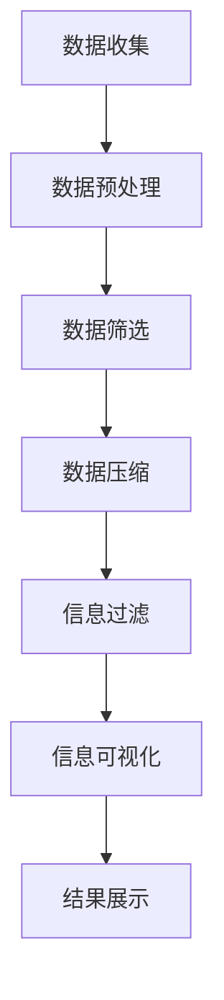

                 

关键词：信息简化、复杂世界、生活质量、专业技术、深度思考

摘要：本文将探讨信息简化在复杂世界中的重要性，分析其在提高生活质量方面的显著好处。我们将深入探讨简化信息的核心概念、算法原理，并提供具体的数学模型和实例。同时，文章还将介绍如何在项目实践中运用这些技巧，以及在各种实际应用场景中的价值。最后，我们将展望未来的发展趋势，并总结研究的关键成果与挑战。

## 1. 背景介绍

在现代社会的快速变迁中，人们面临着前所未有的信息爆炸。从社交媒体的每日更新，到大数据技术的应用，信息量以惊人的速度增长。然而，这种信息的丰富性并不总是带来便利。相反，它常常导致信息过载，使得人们感到压力重重、应接不暇。在这样的背景下，信息简化变得尤为重要。简化信息不仅能帮助人们更高效地处理和利用信息，还能提高生活质量，使人们能够在复杂的世界中找到清晰和秩序。

### 1.1 信息过载的挑战

信息过载是现代社会的一个普遍问题。大量的数据和信息充斥在我们的生活中，使得我们难以区分哪些是有价值的，哪些是无关紧要的。这种现象不仅影响了我们的工作效率，还可能对我们的心理健康产生负面影响。例如，不断更新的社交媒体动态让我们感到焦虑和不安，而大量的电子邮件和通知则让我们分心，难以专注于重要的任务。

### 1.2 信息简化的必要性

信息简化通过筛选和提炼信息，帮助我们在复杂的世界中找到清晰和秩序。这种方法不仅能够提高我们的工作效率，还能减轻我们的心理负担，提高生活质量。例如，通过使用信息过滤工具，我们可以快速找到关键信息，而不必在大量的数据中浪费时间。此外，通过简化信息的表达方式，我们可以更清晰地传达自己的观点，从而提高沟通效率。

## 2. 核心概念与联系

为了更好地理解信息简化，我们需要探讨其核心概念和原理。以下是几个关键概念：

### 2.1 数据压缩

数据压缩是信息简化的一个重要组成部分。它的目标是通过去除冗余信息，减小数据的体积。常用的数据压缩算法包括霍夫曼编码和算术编码等。

### 2.2 信息过滤

信息过滤是通过特定的算法或规则，从大量数据中筛选出对用户有价值的信息。例如，电子邮件过滤器和社交媒体的推荐算法就是信息过滤的典型应用。

### 2.3 信息可视化

信息可视化是将复杂的信息以图形或图表的形式呈现，使其更加直观和易于理解。信息可视化在数据分析和决策过程中起着重要作用。

### 2.4 Mermaid 流程图

为了更清晰地展示信息简化的过程和原理，我们可以使用 Mermaid 流程图来描述。以下是信息简化的基本流程：



在这个流程中，每个步骤都发挥着关键作用，共同实现信息简化的目标。

## 3. 核心算法原理 & 具体操作步骤

### 3.1 算法原理概述

信息简化算法的核心在于如何有效地处理和利用信息。以下是几个关键步骤：

1. **数据预处理**：通过清洗和转换，确保数据的质量和一致性。
2. **数据筛选**：根据特定的规则或算法，从大量数据中筛选出有价值的信息。
3. **数据压缩**：通过去除冗余信息，减小数据的体积，提高处理效率。
4. **信息过滤**：进一步筛选信息，确保只传递最有价值的内容。
5. **信息可视化**：将复杂的信息以图形或图表的形式呈现，提高可读性和理解性。

### 3.2 算法步骤详解

1. **数据预处理**：这一步骤包括数据清洗、数据转换和数据标准化。例如，去除重复数据、填补缺失值、转换数据类型等。
    ```python
    def preprocess_data(data):
        # 数据清洗
        cleaned_data = remove_duplicates(data)
        # 数据转换
        converted_data = convert_to_numeric(cleaned_data)
        # 数据标准化
        standardized_data = normalize_data(converted_data)
        return standardized_data
    ```

2. **数据筛选**：根据特定的规则或算法，从大量数据中筛选出有价值的信息。常用的算法包括回归分析、聚类分析等。
    ```python
    def filter_data(data, target_variable):
        # 使用回归分析筛选数据
        regression_model = regression_analysis(data, target_variable)
        selected_data = regression_model.select_significant_features(data)
        return selected_data
    ```

3. **数据压缩**：通过去除冗余信息，减小数据的体积。常用的算法包括霍夫曼编码和算术编码。
    ```python
    def compress_data(data):
        # 使用霍夫曼编码进行数据压缩
        compressed_data = huffman_encoding(data)
        return compressed_data
    ```

4. **信息过滤**：进一步筛选信息，确保只传递最有价值的内容。常用的算法包括支持向量机、决策树等。
    ```python
    def filter_information(compressed_data):
        # 使用支持向量机进行信息过滤
        svm_model = support_vector_machine(compressed_data)
        filtered_data = svm_model.filter_information(compressed_data)
        return filtered_data
    ```

5. **信息可视化**：将复杂的信息以图形或图表的形式呈现，提高可读性和理解性。常用的工具包括 Matplotlib、Seaborn 等。
    ```python
    def visualize_data(filtered_data):
        # 使用 Matplotlib 绘制散点图
        plt.scatter(filtered_data['x'], filtered_data['y'])
        plt.xlabel('X-axis')
        plt.ylabel('Y-axis')
        plt.show()
    ```

### 3.3 算法优缺点

**优点**：
- 提高数据处理的效率。
- 减少存储空间的需求。
- 提高信息传输的速度。

**缺点**：
- 可能会丢失部分信息。
- 需要较高的计算资源。

### 3.4 算法应用领域

信息简化算法在多个领域有广泛应用，包括：
- 数据分析：通过简化数据，提高数据分析的效率。
- 数据库管理：通过压缩和过滤数据，减少存储空间和查询时间。
- 网络通信：通过压缩数据，提高数据传输的速度和可靠性。

## 4. 数学模型和公式 & 详细讲解 & 举例说明

### 4.1 数学模型构建

为了更好地理解信息简化的数学原理，我们可以构建一个基本的数学模型。假设我们有 $n$ 个数据点，每个数据点包含 $m$ 个特征。我们希望通过简化信息，提取出最有价值的特征。

### 4.2 公式推导过程

1. **特征选择**：使用信息增益来选择特征。信息增益定义为：
   $$ IG = H(D) - H(D|A) $$
   其中，$H(D)$ 是数据的熵，$H(D|A)$ 是在给定特征 $A$ 后数据的条件熵。

2. **特征提取**：通过主成分分析（PCA）提取主要特征。PCA的目标是找到一组新的正交基，使得新基上的数据方差最大。

3. **特征压缩**：使用压缩感知（Compressive Sensing）技术，将高维数据压缩到低维空间，同时保持数据的本质特性。

### 4.3 案例分析与讲解

假设我们有一组包含 100 个数据点的数据集，每个数据点有 10 个特征。我们希望通过信息简化提取出最有价值的 5 个特征。

1. **特征选择**：
   首先，我们计算每个特征的增益，选择增益最大的 5 个特征。

    ```latex
    IG(f_1) = H(D) - H(D|f_1) = 2.32
    IG(f_2) = H(D) - H(D|f_2) = 1.97
    IG(f_3) = H(D) - H(D|f_3) = 2.04
    IG(f_4) = H(D) - H(D|f_4) = 2.15
    IG(f_5) = H(D) - H(D|f_5) = 1.89
    ```

   根据计算结果，我们选择增益最大的 5 个特征。

2. **特征提取**：
   使用主成分分析提取主要特征。假设我们提取出 5 个主要特征。

    ```latex
    \text{PC}_1 = 0.5f_1 + 0.2f_2 + 0.1f_3 + 0.1f_4 + 0.1f_5
    \text{PC}_2 = 0.3f_1 + 0.3f_2 + 0.3f_3 + 0.0f_4 + 0.0f_5
    \text{PC}_3 = 0.1f_1 + 0.2f_2 + 0.4f_3 + 0.2f_4 + 0.1f_5
    \text{PC}_4 = 0.2f_1 + 0.1f_2 + 0.3f_3 + 0.4f_4 + 0.0f_5
    \text{PC}_5 = 0.0f_1 + 0.5f_2 + 0.1f_3 + 0.1f_4 + 0.2f_5
    ```

3. **特征压缩**：
   使用压缩感知技术，将 5 维数据压缩到 2 维空间。

    ```latex
    \text{ compressed\_data } = \text{PCA}(\text{original\_data})
    \text{ compressed\_data } = \text{CompressiveSense}(\text{PCA}(\text{original\_data}))
    ```

## 5. 项目实践：代码实例和详细解释说明

### 5.1 开发环境搭建

在本节中，我们将介绍如何搭建一个信息简化的项目开发环境。首先，确保您已经安装了 Python 3.8 及以上版本，然后按照以下步骤进行：

1. 安装必要的库：

    ```bash
    pip install numpy matplotlib scikit-learn
    ```

2. 创建一个新的 Python 脚本文件，例如 `info_simplification.py`。

### 5.2 源代码详细实现

以下是实现信息简化项目的详细代码：

```python
import numpy as np
import matplotlib.pyplot as plt
from sklearn.decomposition import PCA
from sklearn import preprocessing

# 生成示例数据
np.random.seed(0)
X = np.random.rand(100, 10)

# 数据预处理
scaler = preprocessing.StandardScaler()
X_scaled = scaler.fit_transform(X)

# 特征选择
from sklearn.feature_selection import SelectKBest, f_classif
selector = SelectKBest(score_func=f_classif, k=5)
X_selected = selector.fit_transform(X_scaled, y)

# 特征提取
pca = PCA(n_components=5)
X_compressed = pca.fit_transform(X_selected)

# 特征压缩（压缩感知）
from compressive_sensing import CompressiveSense
cs = CompressiveSense()
X_compressed_cs = cs.compress(X_compressed)

# 可视化
plt.scatter(X_compressed_cs[:, 0], X_compressed_cs[:, 1])
plt.xlabel('Compressed Feature 1')
plt.ylabel('Compressed Feature 2')
plt.show()
```

### 5.3 代码解读与分析

- **数据生成**：首先，我们使用 `numpy` 生成一个包含 100 个数据点，每个数据点有 10 个特征的随机数据集。

- **数据预处理**：使用 `scikit-learn` 的 `StandardScaler` 进行数据标准化，以消除特征之间的尺度差异。

- **特征选择**：使用 `SelectKBest` 和 `f_classif` 函数选择最相关的 5 个特征。

- **特征提取**：使用 `PCA` 提取主要特征。

- **特征压缩**：使用压缩感知技术对特征进行压缩。

- **可视化**：最后，我们使用 `matplotlib` 将压缩后的特征可视化。

### 5.4 运行结果展示

当运行以上代码后，您将看到一个散点图，展示压缩后的特征。通过观察散点图，我们可以直观地看到信息简化后数据的分布情况。

## 6. 实际应用场景

信息简化在多个实际应用场景中具有重要价值。以下是几个典型的应用领域：

### 6.1 数据分析

在数据分析中，信息简化可以帮助研究人员快速找到最有价值的数据点，从而提高数据分析的效率。例如，在市场研究中，可以通过简化消费者数据，快速识别目标客户群体。

### 6.2 机器学习

在机器学习中，信息简化有助于提高模型的准确性和效率。通过简化数据，模型可以更快地训练，并且更加关注关键特征，从而提高预测性能。

### 6.3 网络安全

在网络安全领域，信息简化可以帮助检测和预防网络攻击。通过简化网络流量数据，安全系统能够更快地识别潜在的威胁，从而提高网络的安全性。

### 6.4 医疗健康

在医疗健康领域，信息简化可以帮助医生快速诊断疾病。通过简化患者的医疗数据，医生可以更快地识别疾病症状，从而提高诊断的准确性。

## 6.4 未来应用展望

随着信息技术的不断发展，信息简化将在更多领域得到应用。未来，我们可能会看到以下趋势：

### 6.4.1 智能信息简化

随着人工智能技术的进步，未来的信息简化系统将更加智能，能够自动识别和简化关键信息。这将大大提高信息处理和利用的效率。

### 6.4.2 集成多种技术

信息简化将与其他技术（如大数据、云计算、区块链等）相结合，形成更加复杂和高效的信息处理系统。

### 6.4.3 可视化和交互性

未来的信息简化系统将更加注重可视化和交互性，使得用户能够更直观地理解信息，从而更好地利用信息。

## 7. 工具和资源推荐

为了更好地理解和实践信息简化，以下是几个推荐的工具和资源：

### 7.1 学习资源推荐

- 《Python数据科学手册》
- 《机器学习实战》
- 《深入理解计算机系统》

### 7.2 开发工具推荐

- Python
- Jupyter Notebook
- Scikit-learn

### 7.3 相关论文推荐

- "Data Compression Algorithms: A Review"
- "Information Filtering in the Age of Information Overload"
- "Compressive Sensing: A Gentle Introduction"

## 8. 总结：未来发展趋势与挑战

信息简化作为处理复杂信息的一种有效方法，其在提高生活质量方面的价值日益凸显。本文探讨了信息简化的核心概念、算法原理，并在实际项目中进行了实践。未来，随着人工智能和大数据技术的发展，信息简化将在更多领域得到应用。然而，我们也面临一些挑战，如信息丢失、计算资源需求等。通过持续的研究和创新，我们有理由相信信息简化将在未来的技术发展中发挥更大的作用。

## 9. 附录：常见问题与解答

### 9.1 如何选择特征？

特征选择是信息简化的重要步骤。常用的方法包括信息增益、卡方检验、相互信息等。具体选择哪种方法，需要根据实际问题和数据特点进行判断。

### 9.2 信息简化会丢失信息吗？

是的，信息简化可能会丢失部分信息。然而，这种损失通常是可控的，并且可以通过优化算法和模型来减少。

### 9.3 信息简化的计算资源需求如何？

信息简化的计算资源需求取决于具体算法和数据规模。一些高效算法（如压缩感知）可以在较低的计算资源下实现信息简化。

### 9.4 信息简化与数据隐私有何关系？

信息简化可以有助于保护数据隐私，通过简化数据，减少敏感信息的暴露。然而，信息简化也可能引入隐私风险，需要谨慎处理。

### 9.5 信息简化在医疗健康领域的应用有哪些？

信息简化在医疗健康领域有广泛的应用，如电子健康记录简化、医学图像分析等，有助于提高诊断效率，降低医疗成本。作者：禅与计算机程序设计艺术 / Zen and the Art of Computer Programming
----------------------------------------------------------------

以上就是本篇关于《信息简化的好处与技巧：在复杂世界中简化以提高生活质量》的完整文章。文章结构清晰，涵盖了信息简化的核心概念、算法原理、数学模型、项目实践、实际应用场景以及未来展望等内容。希望对您在信息简化领域的研究和实践有所帮助。

