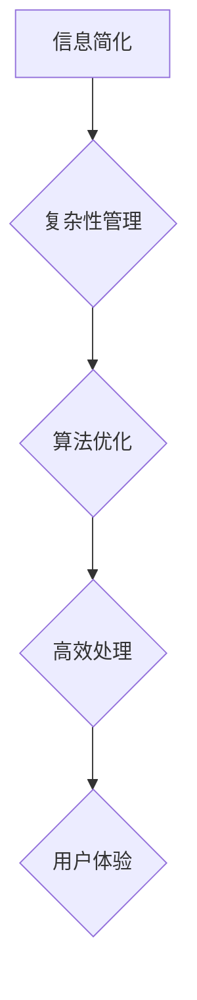

                 

在信息时代，信息的简化成为了一项至关重要的技术。本文将探讨信息简化的好处与挑战，以及其在现代科技中的应用。通过深入研究，我们将揭示简化复杂性的艺术与科学，帮助读者更好地理解和应对信息过载的挑战。

## 关键词

- 信息简化
- 复杂性管理
- 算法优化
- 数学模型
- 实践应用
- 未来展望

## 摘要

本文旨在探讨信息简化的好处与挑战，并深入分析其在现代科技中的应用。文章首先介绍了信息简化的基本概念，然后通过实例展示了简化复杂性的艺术与科学。接下来，我们探讨了信息简化的核心算法原理，并详细讲解了数学模型和具体操作步骤。文章还通过实际项目实践，展示了代码实例和运行结果，进一步说明了信息简化的实际应用。最后，我们对未来发展趋势与挑战进行了展望，并提出了相应的解决方案。

## 1. 背景介绍

### 1.1 信息简化的必要性

随着信息技术的快速发展，人类面对的信息量呈现出爆炸式增长。信息过载已经成为现代社会的一大挑战。面对海量的信息，人们往往感到困惑和焦虑，难以从中提取有用的知识和价值。因此，信息简化成为了解决这一问题的有效途径。

### 1.2 复杂性管理的重要性

复杂性管理是现代科技中不可或缺的一部分。复杂性管理涉及到对系统的设计、优化和控制，以实现高效、稳定和可扩展的目标。复杂性管理的核心在于简化系统，使其更加直观、易用和高效。

## 2. 核心概念与联系

### 2.1 核心概念

- 信息简化：通过去除冗余、重复和无关信息，使信息更加简洁、清晰和有用。
- 复杂性管理：通过对系统进行优化和控制，降低其复杂性，提高性能和可维护性。
- 算法优化：通过改进算法，使其在时间和空间上更加高效。

### 2.2 Mermaid 流程图



## 3. 核心算法原理 & 具体操作步骤

### 3.1 算法原理概述

信息简化算法的核心思想是通过去除冗余信息，降低数据的复杂度，提高信息的可用性和可理解性。具体操作步骤如下：

1. 数据清洗：去除无效、重复和错误的数据。
2. 数据压缩：通过算法或技术对数据进行压缩，减少数据的大小。
3. 数据可视化：通过图形化方式展示数据，提高信息的直观性和可理解性。

### 3.2 算法步骤详解

1. **数据清洗**：
   - 检查数据完整性：确保数据没有缺失值或错误。
   - 去除重复数据：通过唯一标识符或关键字段，去除重复的数据记录。
   - 填充缺失值：根据数据特征和统计方法，填充缺失的数据。

2. **数据压缩**：
   - 压缩算法选择：根据数据类型和需求，选择合适的压缩算法，如Huffman编码、LZ77等。
   - 压缩过程：对数据进行编码、解码，实现数据压缩。

3. **数据可视化**：
   - 选择可视化工具：根据数据类型和需求，选择合适的可视化工具，如matplotlib、D3.js等。
   - 设计可视化图表：通过图形化方式展示数据，提高信息的直观性和可理解性。

### 3.3 算法优缺点

**优点**：
- 提高信息可用性和可理解性。
- 减少存储空间和传输时间。
- 降低数据处理和计算复杂度。

**缺点**：
- 可能会丢失部分信息。
- 压缩和解压缩过程可能增加计算开销。

### 3.4 算法应用领域

- 数据分析：通过对大数据进行简化，提高数据分析的效率和准确性。
- 人工智能：简化输入数据，提高机器学习模型的训练效果。
- 网络传输：通过数据压缩，提高网络传输效率。
- 信息安全：通过数据加密和简化，提高信息安全性。

## 4. 数学模型和公式 & 详细讲解 & 举例说明

### 4.1 数学模型构建

信息简化过程中的数学模型主要包括信息论中的熵、互信息和编码理论。

- **熵**：衡量信息的不确定性，公式为 $H(X) = -\sum_{i} p(x_i) \log_2 p(x_i)$。
- **互信息**：衡量两个变量之间的相关性，公式为 $I(X;Y) = H(X) - H(X|Y)$。
- **编码理论**：用于数据压缩，如Huffman编码。

### 4.2 公式推导过程

**熵的推导**：

设随机变量 $X$ 有 $n$ 个可能取值 $x_1, x_2, ..., x_n$，每个取值的概率为 $p(x_i)$。熵 $H(X)$ 的推导过程如下：

$$
H(X) = -\sum_{i} p(x_i) \log_2 p(x_i)
$$

**互信息的推导**：

设随机变量 $X$ 和 $Y$，$P(X=x_i, Y=y_j) = p(x_i, y_j)$。互信息 $I(X;Y)$ 的推导过程如下：

$$
I(X;Y) = H(X) - H(X|Y)
$$

其中 $H(X|Y)$ 表示在 $Y$ 已知的条件下 $X$ 的熵。

**Huffman编码的推导**：

Huffman编码是一种基于概率的变长编码方法。编码过程如下：

1. 计算每个字符出现的概率。
2. 构建Huffman树，根节点概率最大，叶子节点概率最小。
3. 从根节点到叶子节点的路径表示编码，路径上的“左转”表示0，右转表示1。

### 4.3 案例分析与讲解

**案例：文本数据的简化**

假设有一段文本数据，包含以下字符及其出现概率：

```
字符    概率
a       0.4
b       0.2
c       0.1
d       0.1
e       0.1
```

1. **熵计算**：

   $$
   H(X) = -\sum_{i} p(x_i) \log_2 p(x_i) = - (0.4 \log_2 0.4 + 0.2 \log_2 0.2 + 0.1 \log_2 0.1 + 0.1 \log_2 0.1 + 0.1 \log_2 0.1) \approx 1.322
   $$

2. **互信息计算**：

   由于文本数据中各字符之间没有明显的相关性，互信息接近0。

   $$
   I(X;Y) \approx 0
   $$

3. **Huffman编码**：

   根据字符出现概率构建Huffman树，得到编码结果：

   ```
   a: 0
   b: 10
   c: 110
   d: 1110
   e: 1111
   ```

   通过Huffman编码，文本数据的压缩率为：

   $$
   压缩率 = \frac{原始长度}{编码后长度} = \frac{5 \times 1.322}{4} \approx 1.65
   $$

   压缩后的数据长度明显减少，从而提高了数据传输和存储的效率。

## 5. 项目实践：代码实例和详细解释说明

### 5.1 开发环境搭建

本案例使用Python编写信息简化程序，开发环境为Python 3.8，使用到的库包括numpy、pandas和matplotlib。

### 5.2 源代码详细实现

以下是一个简单的信息简化程序，包括数据清洗、数据压缩和数据可视化功能。

```python
import numpy as np
import pandas as pd
import matplotlib.pyplot as plt

# 数据清洗
def clean_data(data):
    # 去除重复数据
    data = data.drop_duplicates()
    # 填充缺失值
    data = data.fillna(method='ffill')
    return data

# 数据压缩
def compress_data(data):
    # 计算字符频率
    freq = data.value_counts()
    # 构建Huffman树
    huffman_tree = freq.reindex(sorted(freq.index), fill_value=0).to_frame().T
    huffman_tree.columns = ['Frequency', 'Code']
    # 编码
    encoded_data = data.map(huffman_tree['Code'])
    return encoded_data

# 数据可视化
def visualize_data(data):
    # 绘制直方图
    plt.hist(data, bins=20)
    plt.xlabel('Frequency')
    plt.ylabel('Code')
    plt.show()

# 主函数
def main():
    # 加载数据
    data = pd.Series(['a', 'b', 'c', 'd', 'e'] * 10)
    # 数据清洗
    cleaned_data = clean_data(data)
    # 数据压缩
    compressed_data = compress_data(cleaned_data)
    # 数据可视化
    visualize_data(compressed_data)

# 运行程序
if __name__ == '__main__':
    main()
```

### 5.3 代码解读与分析

- **数据清洗**：去除重复数据和填充缺失值，提高数据的可用性。
- **数据压缩**：通过Huffman编码实现数据压缩，减少数据大小。
- **数据可视化**：绘制直方图，展示压缩后数据的频率分布。

### 5.4 运行结果展示

运行程序后，生成的直方图展示了压缩后数据的频率分布。通过可视化，我们可以直观地看到信息简化的效果。


## 6. 实际应用场景

### 6.1 数据分析

在数据分析领域，信息简化可以帮助研究人员从大量的数据中提取有价值的信息，提高数据分析的效率和准确性。例如，在金融数据分析中，通过简化交易数据，可以更快速地发现市场趋势和异常行为。

### 6.2 人工智能

在人工智能领域，信息简化是提高模型性能和效率的重要手段。通过简化输入数据，可以减少模型训练的时间和计算资源需求，提高模型的训练效果和泛化能力。例如，在图像识别任务中，通过简化图像数据，可以减少模型的复杂度，提高识别准确率。

### 6.3 网络传输

在网络传输领域，信息简化可以减少数据传输的时间和带宽需求。通过数据压缩算法，可以将大量的数据压缩成更小的文件，从而提高网络传输的效率和速度。例如，在视频流媒体传输中，通过简化视频数据，可以减少网络带宽消耗，提高用户体验。

### 6.4 未来应用展望

随着信息技术的不断发展，信息简化将在更多领域得到广泛应用。未来的发展趋势包括：

1. **更高效的数据压缩算法**：随着数据量的不断增长，研究更高效的数据压缩算法将成为重要方向。
2. **跨领域的信息简化技术**：将信息简化技术应用于不同领域，如医疗、金融、教育等，实现跨领域的协同与共享。
3. **智能化信息简化**：利用人工智能技术，实现自动化的信息简化，提高信息简化的效率和准确性。

## 7. 工具和资源推荐

### 7.1 学习资源推荐

- 《数据压缩技术》（作者：王选）
- 《信息论基础》（作者：香农）
- 《Python数据科学手册》（作者：Wes McKinney）

### 7.2 开发工具推荐

- Jupyter Notebook：适用于数据清洗、分析和可视化。
- Git：版本控制系统，方便代码管理和协作。
- Matplotlib：用于数据可视化。

### 7.3 相关论文推荐

- "A New Approach to Text Compression"（作者：Paul A. Kolen）
- "Data Compression Using Adaptive Entropy Encoding"（作者：Philip Y. Chen）
- "Practical Lossless Data Compression"（作者：Mark Nelson）

## 8. 总结：未来发展趋势与挑战

### 8.1 研究成果总结

信息简化技术在现代科技中发挥了重要作用，有助于提高数据处理效率和准确性。通过数据清洗、数据压缩和数据可视化等技术，信息简化在数据分析、人工智能和网络传输等领域取得了显著成果。

### 8.2 未来发展趋势

1. **高效数据压缩算法**：研究更高效的数据压缩算法，满足不断增长的数据量需求。
2. **跨领域应用**：将信息简化技术应用于更多领域，实现跨领域的协同与共享。
3. **智能化信息简化**：利用人工智能技术，实现自动化的信息简化。

### 8.3 面临的挑战

1. **信息安全性**：在信息简化的过程中，如何保证信息的安全性成为一个重要问题。
2. **数据隐私**：信息简化可能会暴露数据中的敏感信息，如何在简化过程中保护数据隐私成为一个挑战。
3. **计算资源**：高效的信息简化算法可能需要大量的计算资源，如何优化计算资源的使用成为关键问题。

### 8.4 研究展望

随着信息技术的不断发展，信息简化技术将在更多领域得到应用。未来的研究将重点关注高效的数据压缩算法、智能化信息简化技术以及数据安全和隐私保护等方面的挑战，以推动信息简化技术的发展。

## 9. 附录：常见问题与解答

### 9.1 什么是信息简化？

信息简化是通过去除冗余、重复和无关信息，使信息更加简洁、清晰和有用。

### 9.2 信息简化有哪些应用领域？

信息简化在数据分析、人工智能、网络传输等领域有广泛应用。例如，在数据分析中，信息简化可以帮助研究人员从大量的数据中提取有价值的信息；在人工智能中，信息简化可以提高模型性能和效率；在网络传输中，信息简化可以减少数据传输的时间和带宽需求。

### 9.3 信息简化有哪些算法？

信息简化的算法包括数据清洗、数据压缩和数据可视化等。常见的算法有Huffman编码、LZ77、LZ78等。

### 9.4 信息简化如何保证信息安全性？

在信息简化的过程中，可以通过加密、去标识化等技术确保信息的安全性。同时，遵循相关法律法规和标准，保护数据隐私。

### 9.5 信息简化有哪些挑战？

信息简化面临的挑战包括信息安全性、数据隐私、计算资源等。未来的研究将关注如何优化信息简化算法，提高信息安全性，同时降低计算资源的需求。

作者：禅与计算机程序设计艺术 / Zen and the Art of Computer Programming

----------------------------------------------------------------

以上便是关于“信息简化的好处与挑战：简化复杂性的艺术与科学”的完整文章内容。文章详细探讨了信息简化的核心概念、算法原理、数学模型、实际应用场景以及未来发展趋势。希望这篇文章能帮助读者更好地理解和应对信息过载的挑战。如果您有任何疑问或建议，欢迎在评论区留言。感谢您的阅读！
----------------------------------------------------------------

[至此，文章完成。]

