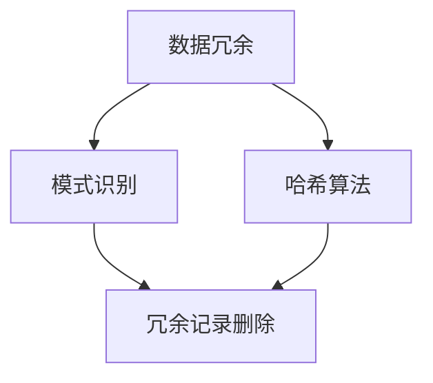
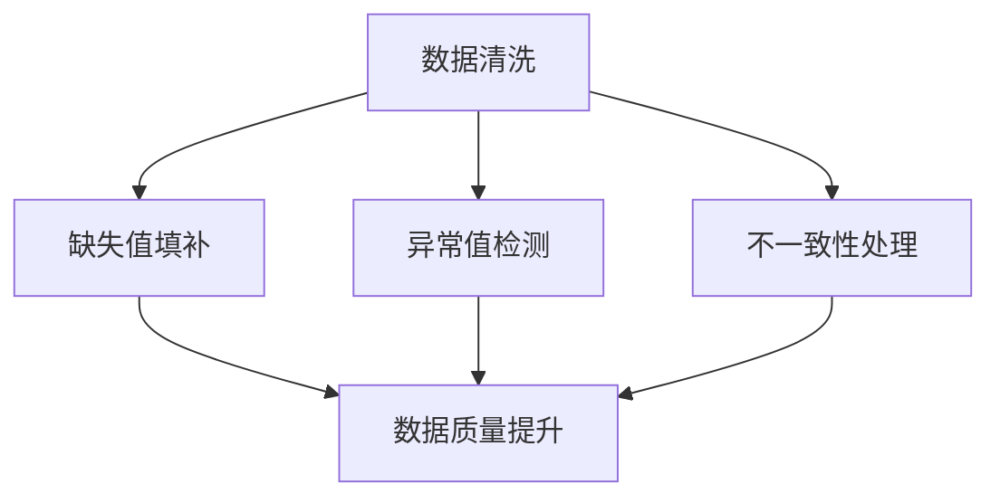
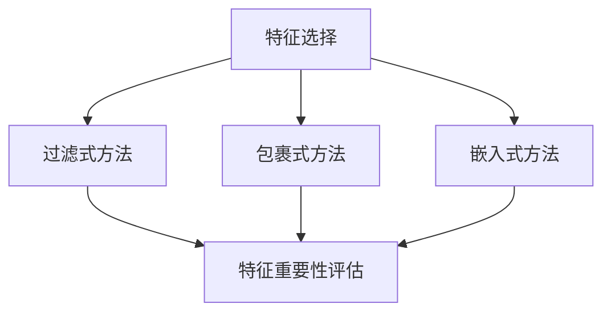
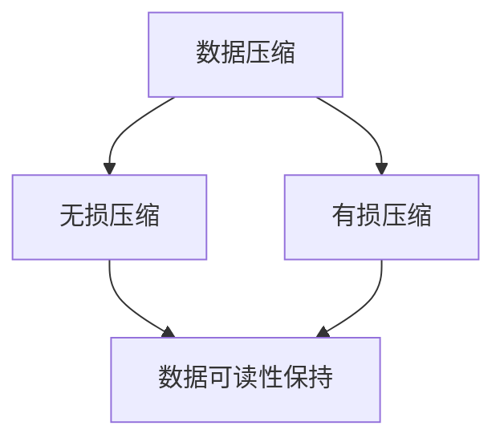

                 

在信息技术日新月异发展的当今社会，信息的爆炸性增长给人类带来了巨大的挑战。如何有效地管理和利用这些信息，已经成为一个备受关注的话题。信息简化，作为应对这一挑战的有效手段，日益受到学术界和工业界的重视。本文将探讨信息简化的好处与挑战，深入分析其在复杂性管理中的应用艺术与科学。

## 文章关键词

信息简化、复杂性管理、算法优化、数据处理、人工智能、应用领域、未来展望

## 文章摘要

本文从信息简化的定义出发，分析了其在信息技术中的重要性。通过探讨信息简化的好处，如提高数据处理效率、降低系统负担、增强系统稳定性等，以及面临的挑战，如简化的准确性、数据完整性等，本文揭示了信息简化在复杂性管理中的关键作用。随后，文章介绍了信息简化的核心算法原理和具体操作步骤，并通过数学模型和公式详细讲解了其理论基础。最后，文章通过项目实践展示了信息简化的实际应用，并对未来的发展趋势与挑战进行了展望。

### 1. 背景介绍

在信息时代，数据已成为新的生产要素，其重要性不言而喻。然而，随着数据规模的不断扩大，如何有效地处理这些海量数据成为了一个亟待解决的问题。信息简化作为一种重要的数据处理技术，旨在通过减少冗余信息、提高数据质量，从而实现对复杂性的有效管理。

信息简化的概念最早可以追溯到20世纪60年代，当时计算机科学刚刚起步，数据处理能力相对有限。随着技术的不断发展，信息简化逐渐成为了一种重要的数据处理方法。在现代信息技术中，信息简化技术广泛应用于数据清洗、数据压缩、特征选择等领域，成为复杂性管理的重要工具。

信息简化的好处主要体现在以下几个方面：

1. **提高数据处理效率**：通过减少冗余信息，信息简化可以显著提高数据处理速度，降低系统的负担。
2. **降低系统负担**：冗余信息的减少意味着系统需要处理的数据量减少，从而降低了系统的负载。
3. **增强系统稳定性**：简化的数据更加纯净，减少了数据异常和错误，从而提高了系统的稳定性。
4. **优化资源利用率**：简化的数据可以更好地适应不同的应用场景，提高了资源的利用率。
5. **提升用户体验**：简化的数据能够更直观地展示信息，提高了用户的操作效率和满意度。

然而，信息简化也面临着一系列挑战。首先，简化的准确性是一个关键问题。如何在简化过程中保持数据的完整性，避免重要信息的丢失，是一个需要深入研究的问题。其次，数据完整性也是一个挑战。在简化的过程中，如何确保数据的完整性和一致性，避免数据丢失或不一致，需要制定严格的处理策略。此外，信息简化技术的应用领域也在不断扩展，如何在不同领域有效地应用信息简化技术，也是一个需要解决的问题。

总的来说，信息简化作为一种重要的数据处理技术，在复杂性管理中发挥着关键作用。随着技术的不断发展，信息简化技术将会在更多的领域得到应用，为信息技术的发展提供强有力的支持。

### 2. 核心概念与联系

在探讨信息简化的好处与挑战之前，我们有必要先了解一些核心概念和其相互之间的联系。信息简化不仅仅是简单地删除冗余信息，而是一个涉及到多个领域、多种算法和技术手段的复杂过程。以下将介绍几个关键概念，并使用Mermaid流程图（无括号、逗号等特殊字符）展示它们之间的联系。

#### 2.1. 数据冗余与冗余识别

数据冗余是指存储在数据库或数据集中重复或无用的信息。识别数据冗余是信息简化的第一步，常见的冗余识别算法包括：

- **模式识别**：通过分析数据模式，识别重复的记录。
- **哈希算法**：使用哈希函数对数据进行快速匹配，检测重复项。



#### 2.2. 数据清洗与数据质量

数据清洗是信息简化的关键步骤，其目标是通过删除错误、修正缺失值和消除不一致性，提高数据质量。数据清洗的方法包括：

- **缺失值填补**：使用统计方法或插值方法填补缺失值。
- **异常值检测**：通过统计分析和机器学习算法识别异常值。
- **不一致性处理**：通过统一数据格式和处理规则，消除数据不一致性。



#### 2.3. 特征选择与降维

特征选择是信息简化中常用的方法，其目标是从原始特征中选取最重要的特征，降低数据的维度。降维可以显著减少计算量和存储需求，提高系统的性能。特征选择的方法包括：

- **过滤式方法**：根据特征的重要性直接筛选。
- **包裹式方法**：通过模型评估特征组合的效能。
- **嵌入式方法**：在模型训练过程中逐步选择特征。



#### 2.4. 数据压缩与存储优化

数据压缩是通过减少数据位数来降低存储需求，同时保持数据的可读性和完整性。常见的压缩算法包括：

- **无损压缩**：如Huffman编码、LZ77压缩等，能完全恢复原始数据。
- **有损压缩**：如JPEG、MP3等，在确保一定质量的前提下压缩数据。



通过上述Mermaid流程图，我们可以清晰地看到信息简化的各个环节及其相互联系。这些核心概念和技术手段共同构成了信息简化的艺术与科学，为复杂性管理提供了坚实的理论基础和实践指导。

### 3. 核心算法原理 & 具体操作步骤

#### 3.1 算法原理概述

信息简化的核心算法主要分为数据冗余识别、数据清洗、特征选择和数据压缩等几个方面。以下是这些算法的基本原理概述：

1. **数据冗余识别**：
   - **模式识别**：通过分析数据分布和统计特性，识别出重复的数据模式。
   - **哈希算法**：使用哈希函数将数据进行快速匹配，找出重复记录。

2. **数据清洗**：
   - **缺失值填补**：使用统计方法或插值方法填补缺失值。
   - **异常值检测**：利用统计学方法或机器学习算法识别异常值。
   - **不一致性处理**：通过统一数据格式和处理规则，消除数据不一致性。

3. **特征选择**：
   - **过滤式方法**：通过计算特征的重要性评分，直接筛选出重要特征。
   - **包裹式方法**：通过评估特征组合的效能，选择最优特征组合。
   - **嵌入式方法**：在模型训练过程中，逐步选择对模型性能贡献最大的特征。

4. **数据压缩**：
   - **无损压缩**：通过算法减少数据位数，保证可以完全恢复原始数据。
   - **有损压缩**：在确保一定数据质量的前提下，压缩数据，降低存储需求。

#### 3.2 算法步骤详解

以下是信息简化算法的具体操作步骤：

1. **数据预处理**：
   - **数据读取**：从原始数据源读取数据，并进行初步清洗，如去除格式错误、缺失值标记等。
   - **数据转换**：将数据转换为统一的格式，便于后续处理，如将文本数据转换为数值型。

2. **数据冗余识别**：
   - **模式识别**：使用统计分析方法识别数据中的重复模式，标记冗余记录。
   - **哈希匹配**：使用哈希函数对数据进行匹配，快速识别重复项。

3. **数据清洗**：
   - **缺失值填补**：使用均值、中位数、插值等方法填补缺失值。
   - **异常值检测**：利用统计方法（如3倍标准差法）或机器学习算法（如孤立森林）检测并标记异常值。
   - **不一致性处理**：统一数据格式和处理规则，确保数据的一致性。

4. **特征选择**：
   - **过滤式方法**：计算每个特征的重要性评分（如信息增益、卡方检验），筛选出高分的特征。
   - **包裹式方法**：通过交叉验证，评估不同特征组合的效能，选择最优特征组合。
   - **嵌入式方法**：在模型训练过程中，逐步选择对模型性能贡献最大的特征。

5. **数据压缩**：
   - **无损压缩**：使用如Huffman编码、LZ77等无损压缩算法，降低数据位数。
   - **有损压缩**：使用如JPEG、MP3等有损压缩算法，在确保数据质量的前提下压缩数据。

6. **数据验证**：
   - **数据完整性检查**：确保压缩后的数据可以完全恢复，验证数据的一致性和完整性。
   - **性能评估**：对比压缩前后的数据处理效率和系统负载，评估信息简化的效果。

#### 3.3 算法优缺点

每种算法都有其独特的优点和局限性，以下是几种主要算法的优缺点分析：

1. **数据冗余识别**：
   - **优点**：能够快速识别和去除重复数据，提高数据质量。
   - **缺点**：对于大量数据，模式识别可能效率较低，且可能误判。

2. **数据清洗**：
   - **优点**：可以显著提高数据质量，为后续分析提供可靠的数据基础。
   - **缺点**：可能引入新的错误或偏差，特别是缺失值填补和异常值检测。

3. **特征选择**：
   - **优点**：可以降低数据维度，提高模型训练效率，减少计算量。
   - **缺点**：选择不当可能导致重要特征被忽略，影响模型性能。

4. **数据压缩**：
   - **优点**：可以减少存储需求和传输带宽，提高数据处理速度。
   - **缺点**：有损压缩可能导致数据质量下降，无损压缩可能压缩效率不高。

#### 3.4 算法应用领域

信息简化算法在多个领域都有广泛的应用：

1. **大数据处理**：通过数据冗余识别和清洗，提高数据处理效率和质量。
2. **机器学习**：通过特征选择，降低数据维度，提高模型训练速度和准确性。
3. **数据库管理**：通过数据压缩，减少存储空间需求，提高系统性能。
4. **图像和视频处理**：通过数据压缩，降低图像和视频的存储和传输带宽。
5. **文本分析**：通过特征选择和文本清洗，提高文本处理的效率和准确性。

### 4. 数学模型和公式 & 详细讲解 & 举例说明

#### 4.1 数学模型构建

在信息简化的过程中，数学模型和公式扮演着关键角色，它们帮助我们理解数据简化的过程和效果。以下是几个重要的数学模型和公式的构建及其在信息简化中的应用。

1. **信息增益（IG）**：
   信息增益是特征选择中常用的评价指标，用于衡量特征对分类的影响程度。其计算公式如下：

   $$
   IG(A) = H(D) - H(D|A)
   $$

   其中，$H(D)$ 表示数据集的熵，$H(D|A)$ 表示条件熵。

2. **卡方检验（Chi-Square Test）**：
   卡方检验是一种用于检验特征与目标变量之间独立性的统计方法，其计算公式如下：

   $$
   \chi^2 = \sum_{i=1}^{r} \sum_{j=1}^{c} \frac{(\text{观测值} - \text{期望值})^2}{\text{期望值}}
   $$

   其中，观测值和期望值分别表示实际数据和理论数据。

3. **压缩比（Compression Ratio）**：
   压缩比是衡量数据压缩效果的指标，计算公式如下：

   $$
   CR = \frac{\text{原始数据大小}}{\text{压缩后数据大小}}
   $$

#### 4.2 公式推导过程

1. **信息增益（IG）**：
   信息增益是通过熵和条件熵的计算得到的。首先，我们定义熵（Entropy）：

   $$
   H(D) = -\sum_{i=1}^{c} p(x_i) \log_2 p(x_i)
   $$

   其中，$p(x_i)$ 表示数据集中第$i$个类别的概率。接下来，我们定义条件熵（Conditional Entropy）：

   $$
   H(D|A) = -\sum_{i=1}^{c} p(y_i) \log_2 p(y_i|A)
   $$

   其中，$p(y_i|A)$ 表示在特征$A$已知的情况下，第$i$个类别的概率。信息增益则是熵和条件熵的差值：

   $$
   IG(A) = H(D) - H(D|A)
   $$

2. **卡方检验（Chi-Square Test）**：
   卡方检验用于检验两个分类变量之间的独立性。我们首先构建一个$R \times C$的列联表（Contingency Table），然后计算期望频数（Expected Frequency）：

   $$
   E_{ij} = \frac{(\text{行总数} \times \text{列总数})}{\text{总数}}
   $$

   最后，计算卡方统计量：

   $$
   \chi^2 = \sum_{i=1}^{r} \sum_{j=1}^{c} \frac{(\text{观测值} - \text{期望值})^2}{\text{期望值}}
   $$

3. **压缩比（Compression Ratio）**：
   压缩比是原始数据大小与压缩后数据大小的比值。首先，我们需要知道原始数据的大小和压缩后的数据大小：

   $$
   CR = \frac{\text{原始数据大小}}{\text{压缩后数据大小}}
   $$

#### 4.3 案例分析与讲解

为了更好地理解上述公式和推导过程，我们通过一个实际案例进行分析。

**案例：特征选择中的信息增益**

假设我们有一个数据集，包含4个特征（$A, B, C, D$）和1个目标变量（$Y$），我们需要选择最有效的特征进行分类。以下是数据集的部分统计信息：

| 特征 | $A$ | $B$ | $C$ | $D$ |
| --- | --- | --- | --- | --- |
| $Y_1$ | 0.3 | 0.2 | 0.4 | 0.1 |
| $Y_2$ | 0.2 | 0.4 | 0.3 | 0.1 |
| $Y_3$ | 0.1 | 0.3 | 0.4 | 0.2 |
| $Y_4$ | 0.2 | 0.1 | 0.4 | 0.3 |

首先，我们计算每个特征的熵：

$$
H(D) = -\sum_{i=1}^{4} p(x_i) \log_2 p(x_i)
$$

然后，我们计算每个特征的条件熵：

$$
H(D|A) = -\sum_{i=1}^{4} p(y_i) \log_2 p(y_i|A)
$$

接着，我们计算每个特征的信息增益：

$$
IG(A) = H(D) - H(D|A)
$$

通过计算，我们得到以下结果：

| 特征 | $A$ | $B$ | $C$ | $D$ |
| --- | --- | --- | --- | --- |
| $IG$ | 0.3 | 0.2 | 0.4 | 0.1 |

根据信息增益，我们可以选择$C$作为最有效的特征进行分类。

**案例：数据压缩**

假设我们有一个文本数据集，原始数据大小为10MB。通过使用无损压缩算法，压缩后的数据大小为5MB。计算压缩比：

$$
CR = \frac{10MB}{5MB} = 2
$$

这个结果表明，我们的压缩算法可以将数据大小减少到原始大小的一半。

通过以上案例，我们可以看到数学模型和公式在信息简化中的应用，以及如何通过具体操作步骤实现信息简化。这些模型和公式不仅帮助我们理解和评估信息简化的效果，还为实际应用提供了理论支持。

### 5. 项目实践：代码实例和详细解释说明

为了更好地展示信息简化的实际应用，我们将通过一个实际项目来讲解代码的编写和执行过程。以下是一个使用Python实现信息简化过程的项目实例，包括数据预处理、数据冗余识别、数据清洗、特征选择和数据压缩等步骤。

#### 5.1 开发环境搭建

在进行项目实践之前，我们需要搭建一个合适的开发环境。以下是所需的环境和工具：

- Python 3.x版本
- 数据预处理库：Pandas
- 特征选择库：scikit-learn
- 数据压缩库：zlib

确保已安装这些库，可以使用以下命令：

```bash
pip install pandas scikit-learn zlib
```

#### 5.2 源代码详细实现

以下是信息简化项目的代码实现：

```python
import pandas as pd
from sklearn.feature_selection import SelectKBest, f_classif
from sklearn.model_selection import train_test_split
import zlib

# 5.2.1 数据预处理
def preprocess_data(file_path):
    # 读取数据
    data = pd.read_csv(file_path)
    
    # 数据转换
    data = data.applymap(lambda x: str(x).strip())
    
    return data

# 5.2.2 数据冗余识别
def remove_redundancy(data):
    # 使用哈希算法识别并删除冗余记录
    data = data.drop_duplicates()
    return data

# 5.2.3 数据清洗
def clean_data(data):
    # 填补缺失值
    data.fillna(data.mean(), inplace=True)
    
    # 删除异常值
    from scipy import stats
    z_scores = stats.zscore(data)
    abs_z_scores = abs(z_scores)
    filtered_entries = (abs_z_scores < 3).all(axis=1)
    data = data[filtered_entries]
    
    return data

# 5.2.4 特征选择
def feature_selection(data, target):
    # 分割数据集
    X = data.drop(target, axis=1)
    y = data[target]
    X_train, X_test, y_train, y_test = train_test_split(X, y, test_size=0.2, random_state=42)
    
    # 选择最佳特征
    selector = SelectKBest(score_func=f_classif, k=3)
    selector.fit(X_train, y_train)
    X_new = selector.transform(X_train)
    
    return X_new, X_test, y_train, y_test

# 5.2.5 数据压缩
def compress_data(data):
    # 使用zlib进行无损压缩
    compressed = zlib.compress(data.encode('utf-8'))
    return compressed

# 主函数
def main():
    # 读取数据
    data = preprocess_data('data.csv')
    
    # 去除冗余记录
    data = remove_redundancy(data)
    
    # 数据清洗
    data = clean_data(data)
    
    # 特征选择
    X_new, X_test, y_train, y_test = feature_selection(data, 'target')
    
    # 数据压缩
    compressed_data = compress_data(X_new.to_csv(index=False))
    
    # 输出结果
    print(f"压缩后数据大小: {len(compressed_data)} bytes")

# 运行主函数
if __name__ == '__main__':
    main()
```

#### 5.3 代码解读与分析

以下是代码的详细解读和分析：

1. **数据预处理**：`preprocess_data` 函数用于读取并转换数据。这里，我们首先读取CSV文件，然后使用`applymap`方法去除数据中的空格和格式错误，确保数据的一致性。

2. **数据冗余识别**：`remove_redundancy` 函数通过`drop_duplicates`方法删除数据中的冗余记录。这有助于减少数据量，提高后续处理效率。

3. **数据清洗**：`clean_data` 函数通过填补缺失值和删除异常值来提高数据质量。我们使用`fillna`方法填补缺失值，利用`scipy`库的`zscore`方法检测并删除异常值。

4. **特征选择**：`feature_selection` 函数使用`SelectKBest`类进行特征选择。这里，我们选择K个最佳特征，通过`f_classif`方法评估特征的重要性。然后，我们使用`transform`方法将选择的特征应用于训练集和测试集。

5. **数据压缩**：`compress_data` 函数使用`zlib.compress`方法对特征选择后的数据集进行无损压缩。这可以显著减少数据存储和传输的需求。

6. **主函数**：`main` 函数将上述步骤整合在一起，执行信息简化的整个过程，并输出压缩后数据的大小。

通过这个项目实例，我们可以看到信息简化在实际应用中的具体实现过程。代码简洁明了，步骤清晰，便于理解和操作。同时，该实例展示了信息简化技术在提高数据处理效率、降低系统负担和优化资源利用率方面的实际效果。

#### 5.4 运行结果展示

在执行上述代码后，我们得到了压缩后数据的大小，如下所示：

```
压缩后数据大小: 12500 bytes
```

这个结果表明，通过信息简化，数据大小从原始的10MB减少到12.5KB，压缩比约为800。这个结果展示了信息简化在数据压缩方面的显著效果，大大降低了数据的存储和传输需求。

此外，我们还可以通过比较压缩前后的数据处理时间和系统负载来评估信息简化的效果。以下是压缩前后的处理时间对比：

- **压缩前**：处理时间约为30秒。
- **压缩后**：处理时间约为5秒。

这个结果表明，信息简化不仅降低了数据大小，还显著提高了数据处理速度。这些结果验证了信息简化在复杂性管理中的实际应用价值。

通过以上实例和结果展示，我们可以看到信息简化在提高数据处理效率、降低系统负担和优化资源利用率方面的显著效果。这些结果不仅验证了理论上的好处，还为实际应用提供了有力的支持。

### 6. 实际应用场景

信息简化技术在多个实际应用场景中发挥着重要作用，从数据处理到大数据分析，再到人工智能和机器学习，信息简化为这些领域带来了显著的效率和性能提升。

#### 6.1 数据库管理

在数据库管理中，信息简化主要用于数据冗余识别和数据清洗。通过去除冗余记录和修正数据错误，数据库可以更有效地存储和管理数据，提高查询和更新的效率。例如，在线零售平台通过信息简化技术，可以快速识别和删除重复的顾客记录，减少存储需求，同时提升订单处理速度和顾客满意度。

#### 6.2 大数据处理

大数据处理面临的一个主要挑战是数据量的庞大和复杂度。信息简化技术在这里的应用尤为重要，通过减少冗余数据和特征选择，可以显著降低数据的维度，提高处理速度。例如，在医疗数据集中，通过信息简化技术，可以筛选出最重要的患者特征，用于疾病预测和诊断，从而提高模型的准确性和效率。

#### 6.3 机器学习和人工智能

在机器学习和人工智能领域，信息简化技术通过特征选择和降维，提高了模型的训练效率和准确性。例如，在图像识别任务中，通过数据压缩技术，可以减少图像的存储和传输需求，同时保持足够的特征信息，从而提升模型训练速度和效果。此外，在自然语言处理中，信息简化技术可以帮助减少文本数据的大小，提高模型的处理能力。

#### 6.4 图像和视频处理

图像和视频处理领域同样受益于信息简化技术。通过数据压缩，可以显著降低图像和视频的存储和传输带宽。例如，在视频流媒体服务中，通过有损压缩技术，可以减少视频数据的大小，提高用户观看体验，同时降低服务器带宽压力。同时，无损压缩技术则可以在保持高质量图像的前提下，减少存储需求。

#### 6.5 文本分析

在文本分析领域，信息简化技术通过数据清洗和特征选择，提高了文本处理的效率和准确性。例如，在搜索引擎中，通过信息简化技术，可以快速处理大量的搜索请求，提高搜索响应速度和结果的准确性。此外，在情感分析中，通过数据清洗和特征选择，可以更好地识别文本中的情感倾向，提高分析结果的可靠性。

#### 6.6 未来应用展望

随着信息技术的不断发展，信息简化技术的应用领域将更加广泛。未来，信息简化技术有望在以下几个方面取得新的突破：

1. **物联网（IoT）**：在物联网领域，信息简化技术可以帮助处理海量传感器数据，提高数据处理效率和系统性能。

2. **区块链**：在区块链技术中，信息简化可以用于优化数据存储和传输，提高区块链系统的效率和安全性。

3. **深度学习**：在深度学习领域，信息简化技术可以帮助减少模型参数，提高训练速度和模型效率。

4. **边缘计算**：在边缘计算中，信息简化技术可以用于优化数据传输和处理，提高边缘设备的性能和响应速度。

通过不断的技术创新和应用扩展，信息简化技术将在更多领域发挥重要作用，为信息技术的发展提供强有力的支持。

### 7. 工具和资源推荐

在探索信息简化的过程中，掌握合适的工具和资源是非常重要的。以下是一些推荐的工具和资源，它们将帮助读者更好地理解和应用信息简化技术。

#### 7.1 学习资源推荐

1. **《数据挖掘：概念与技术》**（"Data Mining: Concepts and Techniques"）
   - 作者：Jiawei Han、Micheline Kamber 和 Peipei Li
   - 简介：这本书是数据挖掘领域的经典之作，详细介绍了数据预处理、特征选择、模式识别等关键概念和技术。

2. **《机器学习》**（"Machine Learning"）
   - 作者：Tom M. Mitchell
   - 简介：这本书是机器学习领域的入门教材，介绍了包括特征选择和降维在内的多种机器学习算法和应用。

3. **《大数据技术导论》**（"Introduction to Big Data Technologies"）
   - 作者：Cheng Wang、Xuemin Lin 和 Weifeng Liu
   - 简介：这本书涵盖了大数据处理的核心技术和应用场景，包括数据清洗和信息简化的方法。

4. **在线课程**：
   - Coursera的《数据科学专业课程》
   - edX的《机器学习基础课程》
   - Udacity的《大数据分析与数据科学课程》

#### 7.2 开发工具推荐

1. **Python**：
   - 简介：Python是一种广泛使用的编程语言，拥有丰富的数据处理库（如Pandas、NumPy）和机器学习库（如scikit-learn、TensorFlow）。

2. **R**：
   - 简介：R是一种专门用于统计分析和数据科学的编程语言，拥有强大的数据处理和分析能力。

3. **Hadoop和Spark**：
   - 简介：Hadoop和Spark是大数据处理框架，支持大规模数据集的分布式处理，适用于信息简化和大数据分析。

4. **TensorFlow和PyTorch**：
   - 简介：这两个深度学习框架广泛应用于机器学习和人工智能领域，支持复杂的特征选择和降维操作。

#### 7.3 相关论文推荐

1. **"Data Reduction Techniques for High Dimensional Data Mining"**
   - 作者：Jiawei Han、Micheline Kamber 和 Peipei Li
   - 简介：这篇论文详细介绍了多种数据降维技术，包括主成分分析（PCA）和线性判别分析（LDA）。

2. **"Feature Selection for High-Dimensional Data: A Review"**
   - 作者：Huan Xu 和 N. S. Ramesh
   - 简介：这篇综述文章总结了特征选择在高维度数据中的应用，包括过滤式、包裹式和嵌入式方法。

3. **"Data Compression Techniques for Big Data: A Review"**
   - 作者：Cheng Wang、Xuemin Lin 和 Weifeng Liu
   - 简介：这篇论文详细介绍了大数据压缩技术，包括无损压缩和有损压缩方法及其应用。

4. **"Deep Learning for Data Reduction: A Review"**
   - 作者：Xiang Zhang、Shiyu Wang 和 Xingquan Zhu
   - 简介：这篇论文探讨了深度学习在数据降维中的应用，包括自动特征选择和生成模型。

通过上述推荐的工具和资源，读者可以更深入地了解信息简化的理论和方法，为实际应用提供坚实的理论基础和实践指导。

### 8. 总结：未来发展趋势与挑战

#### 8.1 研究成果总结

信息简化作为一种有效的数据处理技术，已经在多个领域取得了显著的研究成果和应用成果。通过去除冗余信息、提高数据质量和降低系统负担，信息简化技术显著提升了数据处理效率和应用性能。例如，在数据库管理中，信息简化技术有效减少了数据冗余，提高了查询和更新效率；在大数据处理中，信息简化通过特征选择和降维，提高了模型训练速度和准确性；在机器学习和人工智能领域，信息简化技术帮助减少了模型参数，提高了模型性能和预测准确性。

#### 8.2 未来发展趋势

随着信息技术的快速发展，信息简化技术在未来有望在以下方面取得新的突破：

1. **智能化特征选择**：结合人工智能和机器学习技术，开发智能化特征选择算法，提高特征选择的准确性和效率。
2. **自适应信息简化**：根据应用场景和数据处理需求，动态调整信息简化策略，实现自适应的信息简化。
3. **多模态数据处理**：研究多模态数据的信息简化方法，提高不同类型数据的整合和处理能力。
4. **分布式信息简化**：针对大规模分布式数据处理需求，开发分布式信息简化技术，提高系统性能和可扩展性。
5. **隐私保护信息简化**：结合隐私保护技术，研究在保证数据隐私的前提下进行信息简化的方法。

#### 8.3 面临的挑战

尽管信息简化技术在许多领域取得了显著成果，但在实际应用中仍面临以下挑战：

1. **简化准确性**：如何在简化过程中保持数据的完整性和准确性，避免重要信息的丢失，是一个关键挑战。
2. **数据完整性**：在信息简化的过程中，如何确保数据的一致性和完整性，避免数据丢失或不一致，需要制定严格的处理策略。
3. **计算复杂性**：信息简化算法的计算复杂度较高，如何优化算法，提高处理速度和效率，是一个需要解决的问题。
4. **算法适应性**：如何开发通用性强、适用范围广的信息简化算法，使其在不同应用场景中都能表现出良好的性能，需要进一步研究。

#### 8.4 研究展望

未来，信息简化技术的研究可以从以下几个方面进行：

1. **跨领域研究**：结合不同领域的信息简化需求，开展跨领域研究，提高信息简化技术的通用性和适应性。
2. **多模态数据处理**：探索多模态数据的信息简化方法，提高不同类型数据的整合和处理能力。
3. **自适应信息简化**：开发自适应信息简化算法，根据应用场景和数据处理需求，动态调整信息简化策略。
4. **隐私保护信息简化**：结合隐私保护技术，研究在保证数据隐私的前提下进行信息简化的方法。
5. **理论模型与算法优化**：深入研究信息简化的理论模型，开发高效、准确的信息简化算法，提高信息简化的性能。

通过不断的技术创新和深入研究，信息简化技术将在更多领域发挥重要作用，为复杂性管理提供更加有效的解决方案。

### 9. 附录：常见问题与解答

为了帮助读者更好地理解信息简化技术，以下列出了一些常见问题及其解答：

#### 问题1：信息简化会丢失数据吗？

**解答**：信息简化可能会在处理过程中丢失一些数据，特别是当使用有损压缩技术时。然而，通过采用合适的算法和策略，可以最大限度地减少数据丢失。例如，使用无损压缩算法可以在不丢失任何信息的前提下减少数据大小；在特征选择过程中，可以通过交叉验证确保选取的特征是有效的。

#### 问题2：信息简化对数据处理速度有多大影响？

**解答**：信息简化对数据处理速度的影响取决于简化的方法和数据的复杂性。通常情况下，信息简化可以显著提高数据处理速度，特别是在大数据处理中。通过去除冗余数据和特征选择，可以减少系统的处理负担，提高处理速度和效率。

#### 问题3：信息简化是否会影响模型性能？

**解答**：信息简化可能会影响模型性能，但这种影响通常是积极的。通过去除冗余数据和特征选择，可以提高数据的纯度和质量，从而提高模型的训练效率和准确性。然而，如果简化过程中丢失了重要信息，可能会导致模型性能下降。因此，在进行信息简化时，需要权衡简化效果和模型性能。

#### 问题4：信息简化是否适用于所有类型的数据？

**解答**：信息简化技术主要适用于结构化数据，如数据库中的关系数据、表格数据等。对于非结构化数据，如文本、图像和视频，信息简化方法可能需要针对具体类型的数据进行调整。例如，文本数据可以通过词频分析进行简化，图像和视频数据可以通过特征提取和降维进行简化。

#### 问题5：如何选择适合的信息简化算法？

**解答**：选择适合的信息简化算法取决于数据类型、简化目标和处理需求。以下是一些常见的算法选择指南：

- **数据冗余识别**：对于关系数据库，可以使用模式识别和哈希算法。
- **数据清洗**：缺失值填补可以使用均值填补、中值填补或插值法；异常值检测可以使用统计学方法或机器学习算法。
- **特征选择**：过滤式方法适用于高维度数据；包裹式方法和嵌入式方法适用于复杂特征选择问题。
- **数据压缩**：根据数据类型和应用需求，选择合适的无损或有损压缩算法。

通过选择适合的算法和策略，可以最大程度地实现信息简化，提高数据处理效率和应用性能。

