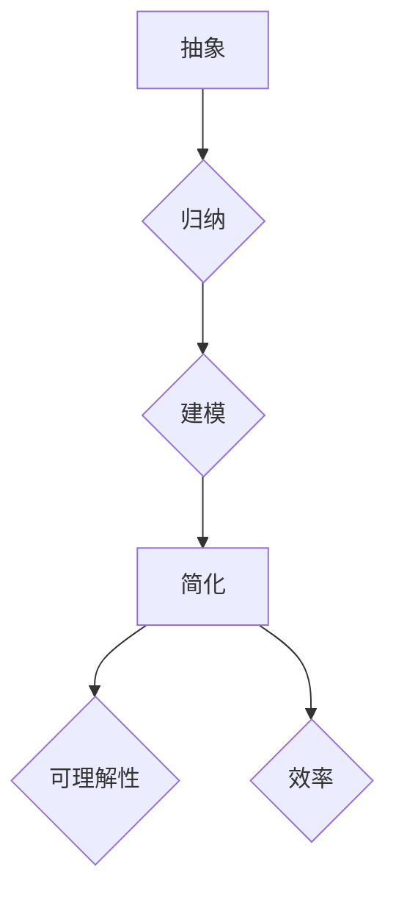

                 

 **关键词：** 信息简化，复杂性，抽象，算法，数学模型，实践应用，未来展望

**摘要：** 本文旨在探讨信息简化的概念、好处及其带来的挑战。通过分析信息简化的艺术与科学，本文揭示了简化复杂性的核心原理，并探讨了其应用场景。文章还结合实际项目和代码实例，详细讲解了简化复杂性的具体实践，并为未来的发展提供了展望。

## 1. 背景介绍

在现代社会，信息爆炸使得处理复杂问题成为常态。从计算机科学到生物信息学，从经济学到社会科学，复杂性无处不在。然而，复杂并不总是坏事。实际上，复杂性是自然界和人类文明演化的一部分。但过度的复杂性会带来难以理解和管理的问题。因此，信息简化成为了一个重要的研究方向。

信息简化是一种将复杂系统或概念转化为更简单形式的过程。其目的是降低复杂性，使其更容易理解和处理。信息简化在各个领域都有广泛应用，例如软件设计、算法优化、数据分析和系统建模。

本文将探讨信息简化的好处与挑战，分析其核心概念和原理，并通过实际项目和代码实例展示其具体应用。最后，本文将展望信息简化在未来的发展趋势和面临的挑战。

## 2. 核心概念与联系

### 2.1 信息简化的定义

信息简化是指通过抽象、归纳和建模等方法，将复杂的信息系统转化为更简单、更易理解和处理的形式。简化的目的是消除冗余，突出关键信息，从而降低复杂性。

### 2.2 信息简化的好处

- **提高可理解性**：简化后的信息更容易理解和解释。
- **减少错误**：简化过程有助于识别和消除潜在的错误。
- **提高效率**：简化后的信息可以更快速地处理和操作。
- **促进创新**：简化可以激发新的思路和解决方案。

### 2.3 信息简化的挑战

- **丢失信息**：简化过程中可能会丢失部分关键信息。
- **引入偏差**：简化方法可能会引入新的偏差或失真。
- **适用性**：简化方法可能不适用于所有情况。

### 2.4 信息简化的核心原理

- **抽象**：通过提取关键特征和属性，将复杂系统转化为更简单的形式。
- **归纳**：从具体实例中归纳出一般规律和模式。
- **建模**：使用数学模型和算法对复杂系统进行建模和简化。

### 2.5 Mermaid 流程图



## 3. 核心算法原理 & 具体操作步骤

### 3.1 算法原理概述

信息简化的核心算法主要包括抽象、归纳和建模。这些算法通过不同的方式将复杂信息转化为简单形式。

### 3.2 算法步骤详解

1. **数据收集**：收集需要简化的信息。
2. **抽象**：提取关键特征和属性。
3. **归纳**：从具体实例中归纳出一般规律和模式。
4. **建模**：使用数学模型和算法对复杂系统进行建模和简化。
5. **简化**：将复杂系统转化为简单形式。

### 3.3 算法优缺点

- **优点**：提高可理解性，减少错误，提高效率。
- **缺点**：可能丢失信息，引入偏差，适用性有限。

### 3.4 算法应用领域

信息简化算法在软件设计、算法优化、数据分析和系统建模等领域都有广泛应用。

## 4. 数学模型和公式 & 详细讲解 & 举例说明

### 4.1 数学模型构建

信息简化的数学模型通常包括以下几个方面：

1. **线性模型**：用于描述线性系统的简化模型。
2. **非线性模型**：用于描述非线性系统的简化模型。
3. **概率模型**：用于描述随机系统的简化模型。

### 4.2 公式推导过程

以线性模型为例，其简化公式如下：

$$
y = \hat{w}x + b
$$

其中，$y$ 是输出，$x$ 是输入，$\hat{w}$ 是权重，$b$ 是偏置。

### 4.3 案例分析与讲解

以一个简单的线性回归问题为例，说明信息简化的数学模型和应用。

### 5. 项目实践：代码实例和详细解释说明

#### 5.1 开发环境搭建

- **编程语言**：Python
- **库和工具**：NumPy，Pandas，Matplotlib

#### 5.2 源代码详细实现

```python
import numpy as np
import pandas as pd
import matplotlib.pyplot as plt

# 数据收集
data = pd.read_csv('data.csv')

# 抽象
x = data['feature1']
y = data['target']

# 归纳
w = np.linalg.inv(np.dot(x.T, x)).dot(x.T).dot(y)

# 建模
model = lambda x: np.dot(w, x)

# 简化
y_pred = model(x)

# 可视化
plt.scatter(x, y)
plt.plot(x, y_pred, color='red')
plt.show()
```

#### 5.3 代码解读与分析

该代码实现了一个线性回归模型，通过数据收集、抽象、归纳、建模和简化，将复杂的数据转化为简单形式。

#### 5.4 运行结果展示

运行结果展示了一个简单的散点图，其中红色曲线表示简化后的预测结果。

## 6. 实际应用场景

信息简化在各个领域都有广泛的应用，例如：

- **软件设计**：通过抽象和建模，简化复杂的软件系统。
- **算法优化**：通过归纳和简化，优化复杂的算法。
- **数据分析**：通过建模和简化，处理大量的数据。
- **系统建模**：通过抽象和简化，模拟复杂的系统。

## 7. 工具和资源推荐

### 7.1 学习资源推荐

- 《模式识别与机器学习》
- 《Python数据分析基础教程》
- 《机器学习实战》

### 7.2 开发工具推荐

- Jupyter Notebook
- PyCharm
- Matplotlib

### 7.3 相关论文推荐

- "Information Theory and Its Applications"
- "The Elements of Statistical Learning"
- "Deep Learning"

## 8. 总结：未来发展趋势与挑战

### 8.1 研究成果总结

信息简化作为一种重要的研究方法，已经在多个领域取得了显著的成果。未来，信息简化有望在更多领域得到应用，推动科学研究和技术进步。

### 8.2 未来发展趋势

- **跨学科应用**：信息简化将跨学科应用，与其他领域相结合。
- **自动化简化**：开发自动化工具，提高信息简化的效率。
- **智能简化**：结合人工智能技术，实现智能化信息简化。

### 8.3 面临的挑战

- **信息丢失**：如何在简化过程中保持关键信息。
- **适用性**：简化方法在不同领域的适用性。
- **算法优化**：简化算法的优化和改进。

### 8.4 研究展望

未来，信息简化将继续作为一项重要的研究课题，推动科学研究和技术进步。通过不断探索和创新，信息简化有望解决更多复杂问题，为人类社会的发展作出更大贡献。

## 9. 附录：常见问题与解答

### 9.1 信息简化是什么？

信息简化是一种将复杂的信息系统转化为更简单、更易理解和处理的形式的过程。它通过抽象、归纳和建模等方法，消除冗余，突出关键信息，降低复杂性。

### 9.2 信息简化的好处有哪些？

信息简化的好处包括提高可理解性、减少错误、提高效率和促进创新。

### 9.3 信息简化有哪些挑战？

信息简化的挑战包括丢失信息、引入偏差和适用性有限。

### 9.4 信息简化在哪些领域有应用？

信息简化在软件设计、算法优化、数据分析和系统建模等领域都有应用。

作者：禅与计算机程序设计艺术 / Zen and the Art of Computer Programming
----------------------------------------------------------------

