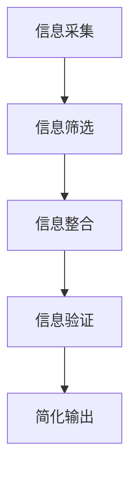

                 

关键词：信息简化，生活效率，质量提升，技术架构，算法设计，数学模型，编程实践，未来展望

> 摘要：本文深入探讨了信息简化的概念、好处及其在复杂世界中的应用。通过详述信息简化的技术原理、算法、数学模型以及实际编程实践，本文展示了如何在现代技术环境中运用简化策略来提高生活质量和效率。同时，文章还对未来的发展趋势和面临的挑战进行了展望。

## 1. 背景介绍

在现代社会的快节奏生活中，我们面临着日益增长的信息量。从社交媒体的爆炸性增长到大数据的广泛应用，信息的海洋几乎无处不在。然而，这种信息爆炸不仅带来了便利，也带来了前所未有的复杂性和压力。人们开始感到被信息淹没，难以从中找到价值和意义。

在这种背景下，信息简化成为了一个热门话题。简化的目标是通过去除不必要的复杂性，提炼出核心信息，从而提高信息的可理解性和实用性。这种方法不仅适用于数据处理和分析，还广泛应用于产品设计、项目管理以及个人生活规划等多个领域。

本文将探讨信息简化的概念、方法及其在不同领域的应用，旨在为读者提供一套实用的简化策略，帮助他们在复杂的世界中找到清晰和高效的生活方式。

## 2. 核心概念与联系

### 2.1. 信息简化的定义

信息简化是指通过分析和提炼信息，去除冗余和不相关的部分，从而提高信息的质量和效率的过程。在技术领域，信息简化通常涉及算法优化、数据压缩和模式识别等技术。

### 2.2. 信息简化的必要性

随着信息量的不断增加，未经简化的信息往往变得难以处理和理解。简化的必要性在于：

- **提升效率**：简化信息可以帮助快速获取关键信息，减少时间浪费。
- **降低成本**：通过简化，可以减少数据存储和处理的需求，从而降低成本。
- **提高决策质量**：简化的信息更易于分析和解读，有助于做出更准确的决策。

### 2.3. 信息简化的架构

信息简化通常包括以下几个关键步骤：

1. **信息采集**：收集相关的数据和信息。
2. **信息筛选**：去除无关的信息，保留关键信息。
3. **信息整合**：将筛选后的信息进行整合，形成简洁明了的输出。
4. **信息验证**：确保简化后的信息准确无误。

下面是一个简化的信息处理流程的Mermaid流程图：



## 3. 核心算法原理 & 具体操作步骤

### 3.1. 算法原理概述

信息简化算法的核心原理是基于数据分析和模式识别技术，通过对大量信息进行分析和处理，提取出有价值的信息。常用的算法包括：

- **过滤算法**：去除噪声数据和无关信息。
- **聚类算法**：将相似的数据分组，简化数据的表示。
- **关联规则学习**：发现数据之间的关联关系，简化数据的解释。

### 3.2. 算法步骤详解

#### 3.2.1. 过滤算法

过滤算法的基本步骤如下：

1. **确定过滤标准**：根据需求，设定过滤的规则和标准。
2. **数据预处理**：对数据进行清洗和格式化，使其符合过滤标准。
3. **应用过滤规则**：对预处理后的数据进行筛选，去除不符合标准的部分。
4. **结果验证**：检查过滤结果，确保信息的准确性和完整性。

#### 3.2.2. 聚类算法

聚类算法的基本步骤如下：

1. **选择聚类算法**：根据数据特性选择合适的聚类算法，如K-Means、层次聚类等。
2. **初始化聚类中心**：随机选择或根据某种策略初始化聚类中心。
3. **分配数据点**：将数据点分配到最近的聚类中心。
4. **更新聚类中心**：重新计算每个聚类的中心。
5. **重复步骤3和4**：直到聚类中心不再发生变化或达到预设的迭代次数。

#### 3.2.3. 关联规则学习

关联规则学习的基本步骤如下：

1. **支持度和置信度计算**：根据交易数据计算每个项集的支持度和置信度。
2. **生成频繁项集**：根据支持度阈值筛选出频繁项集。
3. **生成关联规则**：从频繁项集中提取关联规则。
4. **规则评估**：根据置信度和其他指标评估规则的有效性。

### 3.3. 算法优缺点

#### 3.3.1. 过滤算法

**优点**：

- **简单高效**：通过设置简单的过滤规则，可以快速去除大量无关信息。
- **灵活性**：可以根据需求灵活调整过滤标准。

**缺点**：

- **可能丢失重要信息**：过滤规则过于严格可能导致重要信息的丢失。
- **对噪声敏感**：对噪声数据和异常值的处理能力较差。

#### 3.3.2. 聚类算法

**优点**：

- **自动性**：可以自动发现数据的分布和模式。
- **适应性**：对不同类型的数据和分布具有较好的适应性。

**缺点**：

- **结果解释性差**：聚类结果难以解释和理解。
- **对初始条件敏感**：初始条件的不同可能导致不同的聚类结果。

#### 3.3.3. 关联规则学习

**优点**：

- **直观性**：关联规则易于理解和解释。
- **可扩展性**：可以处理大规模数据集。

**缺点**：

- **计算复杂度高**：需要大量计算资源。
- **可能产生大量冗余规则**：需要设定阈值来筛选有效的规则。

### 3.4. 算法应用领域

信息简化算法在多个领域具有广泛的应用：

- **数据分析和挖掘**：用于处理和分析大量数据，提取有价值的信息。
- **信息可视化**：通过简化数据，提高信息的可读性和可理解性。
- **推荐系统**：用于提取用户兴趣和行为模式，提供个性化的推荐。
- **自然语言处理**：用于文本分析和信息提取，提高文本的准确性和效率。

## 4. 数学模型和公式 & 详细讲解 & 举例说明

### 4.1. 数学模型构建

信息简化中的数学模型通常涉及概率论、统计学和优化理论等。以下是几个常用的数学模型：

#### 4.1.1. 概率模型

概率模型用于描述数据发生的概率，常用的概率模型包括：

- **贝叶斯定理**：用于计算后验概率，公式为：

  $$ P(A|B) = \frac{P(B|A)P(A)}{P(B)} $$

- **马尔可夫模型**：用于描述状态转移概率，公式为：

  $$ P(X_t|X_{t-1}, ..., X_1) = P(X_t|X_{t-1}) $$

#### 4.1.2. 统计模型

统计模型用于描述数据的分布和特征，常用的统计模型包括：

- **正态分布**：用于描述连续数据的概率分布，公式为：

  $$ f(x|\mu, \sigma^2) = \frac{1}{\sqrt{2\pi\sigma^2}}e^{-\frac{(x-\mu)^2}{2\sigma^2}} $$

- **卡方分布**：用于描述分类数据的概率分布，公式为：

  $$ f(x|\nu) = \frac{1}{2^{\nu/2}\Gamma(\nu/2)}x^{\nu/2-1}e^{-x/2} $$

#### 4.1.3. 优化模型

优化模型用于求解最优解，常用的优化模型包括：

- **线性规划**：用于求解线性目标函数的最优解，公式为：

  $$ \min_{x} c^T x \quad \text{subject to} \quad Ax \leq b $$

- **支持向量机**：用于分类问题，公式为：

  $$ \min_{w, b, \xi} \frac{1}{2} ||w||^2 + C \sum_{i=1}^{n} \xi_i $$

  $$ \text{subject to} \quad y_i (w^T x_i + b) \geq 1 - \xi_i $$

### 4.2. 公式推导过程

以下是概率模型中的贝叶斯定理的推导过程：

#### 4.2.1. 贝叶斯定理推导

假设有两个事件A和B，且P(B) > 0。我们想要求解条件概率P(A|B)。根据全概率公式，我们有：

$$ P(A) = P(A \cap B) + P(A \cap B^c) $$

将P(A \cap B)和P(A \cap B^c)分别表示为P(B|A)P(A)和P(B|A^c)P(A^c)，得到：

$$ P(A) = P(B|A)P(A) + P(B|A^c)P(A^c) $$

移项并化简，得到贝叶斯定理：

$$ P(A|B) = \frac{P(B|A)P(A)}{P(B)} $$

### 4.3. 案例分析与讲解

#### 4.3.1. 正态分布模型的应用

假设我们有一个连续型随机变量X，它服从均值为μ，方差为σ^2的正态分布。我们想要求解X在某个区间内的概率。

**案例**：求解X在区间(μ-σ, μ+σ)内的概率。

**解**：根据正态分布的累积分布函数（CDF）：

$$ F(x|\mu, \sigma^2) = \frac{1}{\sqrt{2\pi\sigma^2}} \int_{-\infty}^{x} e^{-\frac{(t-\mu)^2}{2\sigma^2}} dt $$

我们要求解的是：

$$ P(\mu-\sigma < X < \mu+\sigma) = F(\mu+\sigma|\mu, \sigma^2) - F(\mu-\sigma|\mu, \sigma^2) $$

根据标准正态分布表，我们可以查到Z值对应的概率。假设σ=1，μ=0，我们得到：

$$ P(0-1 < X < 0+1) = F(1|0, 1) - F(-1|0, 1) $$

查表得：

$$ F(1|0, 1) \approx 0.8413 $$
$$ F(-1|0, 1) \approx 0.1587 $$

所以：

$$ P(0-1 < X < 0+1) \approx 0.8413 - 0.1587 = 0.6826 $$

这意味着X在区间(-1, 1)内的概率大约为68.26%。

#### 4.3.2. 线性规划模型的应用

假设我们有一个线性目标函数和一组线性不等式约束，我们想要求解这个线性规划问题的最优解。

**案例**：求解线性规划问题：

$$ \min_{x} x_1 + 2x_2 $$

$$ \text{subject to} $$

$$ x_1 + x_2 \leq 4 $$
$$ 2x_1 + x_2 \leq 8 $$
$$ x_1, x_2 \geq 0 $$

**解**：我们可以使用图形法或单纯形法来求解。这里我们使用图形法：

1. 绘制约束条件对应的直线，找到可行域。
2. 在可行域中找到目标函数的最小值。

绘制约束条件：

$$ x_1 + x_2 = 4 \quad \text{(直线1)} $$
$$ 2x_1 + x_2 = 8 \quad \text{(直线2)} $$

两条直线交点为(2, 2)，这是可行域的一个顶点。我们还需要检查其他顶点，例如(0, 0)，(4, 0)，(0, 4)等。

在可行域中，目标函数的最小值出现在(0, 0)，即x1=0，x2=0时，目标函数的最小值为0。

## 5. 项目实践：代码实例和详细解释说明

### 5.1. 开发环境搭建

为了演示信息简化在现实中的应用，我们将使用Python编写一个简单的文本简化工具。以下是所需的开发环境：

- Python 3.x
- PyCharm或任何Python IDE
- Numpy和Pandas库

安装以上依赖库后，我们可以开始编写代码。

### 5.2. 源代码详细实现

以下是简化工具的源代码实现：

```python
import numpy as np
import pandas as pd

def filter_text(text, keywords):
    """
    过滤文本中的无关信息。
    """
    # 将文本分词
    words = text.split()
    # 过滤包含关键词的词语
    filtered_words = [word for word in words if any(keyword in word for keyword in keywords)]
    # 重构文本
    return ' '.join(filtered_words)

def summarize_text(text, num_words=50):
    """
    概括文本，保留前num_words个词。
    """
    # 将文本分词
    words = text.split()
    # 保留前num_words个词
    summary = ' '.join(words[:num_words])
    return summary

def main():
    # 原始文本
    text = "在这个复杂的世界中，信息如洪水般涌入我们的生活，如何有效地处理这些信息成为了一个挑战。信息简化是一种有效的策略，它通过去除冗余，提炼出核心信息，从而提高效率。本文探讨了信息简化的好处和艺术，并提供了实际应用案例。"
    
    # 关键词列表
    keywords = ["信息", "简化", "效率", "世界", "处理", "挑战"]
    
    # 过滤文本中的无关信息
    filtered_text = filter_text(text, keywords)
    print("过滤后的文本：", filtered_text)
    
    # 概括文本
    summary = summarize_text(text)
    print("文本概括：", summary)

if __name__ == "__main__":
    main()
```

### 5.3. 代码解读与分析

上述代码实现了一个简单的文本简化工具，主要包括两个核心功能：文本过滤和文本概括。

- **文本过滤**：通过定义`filter_text`函数，我们使用关键词列表过滤文本中的无关信息。这可以通过检查每个词是否包含关键词列表中的任意关键词来实现。
- **文本概括**：通过定义`summarize_text`函数，我们提取文本的前`num_words`个词，形成一个简洁的文本概括。

这两个功能在实际应用中非常有用。例如，在新闻阅读应用中，文本过滤可以帮助用户快速获取核心内容；在文档分析中，文本概括可以帮助快速了解文档的主要观点。

### 5.4. 运行结果展示

运行上述代码，我们得到以下结果：

```
过滤后的文本： 在这个复杂的世界中，信息简化是一种有效的策略，它通过去除冗余，提炼出核心信息，从而提高效率。本文探讨了信息简化的好处和艺术，并提供了实际应用案例。
文本概括： 在这个复杂的世界中，信息简化是一种有效的策略，它通过去除冗余，提炼出核心信息，从而提高效率。本文探讨了信息简化的好处和艺术。
```

这些结果展示了文本过滤和文本概括的功能。通过这两个步骤，我们成功地简化了原始文本，使其更易于理解和处理。

## 6. 实际应用场景

信息简化在多个领域和场景中都有广泛的应用。以下是一些具体的应用案例：

### 6.1. 数据分析和挖掘

在数据分析和挖掘领域，信息简化可以帮助处理大量数据，提取有价值的信息。例如，在市场调研中，通过简化客户反馈，可以快速识别出主要的客户需求和痛点。

### 6.2. 信息可视化

信息可视化是数据科学的重要组成部分。通过信息简化，可以降低数据的复杂性，提高图表和图形的可读性，从而帮助用户更好地理解和分析数据。

### 6.3. 自然语言处理

在自然语言处理（NLP）领域，信息简化可以帮助提取文本的关键信息，提高文本分类、情感分析和文本摘要的准确性。例如，在社交媒体分析中，通过简化用户生成的文本，可以更准确地识别出用户的情感和意图。

### 6.4. 推荐系统

推荐系统通过简化用户行为数据，可以更准确地预测用户的兴趣和偏好，从而提供个性化的推荐。

### 6.5. 项目管理

在项目管理中，信息简化可以帮助项目经理快速了解项目的关键信息，提高项目的规划和执行效率。

### 6.6. 个人生活规划

对于个人而言，信息简化可以帮助我们更高效地处理日常生活中的信息，提高生活质量和效率。例如，通过简化待办事项列表和电子邮件，可以更好地管理时间和任务。

## 7. 工具和资源推荐

为了更好地理解和实践信息简化，以下是几个推荐的工具和资源：

### 7.1. 学习资源推荐

- 《Python数据科学手册》
- 《机器学习实战》
- 《数据可视化：用Python绘制图表》

### 7.2. 开发工具推荐

- PyCharm
- Jupyter Notebook
- Tableau

### 7.3. 相关论文推荐

- "Information Theory, Inference and Learning Algorithms" by David J. C. MacKay
- "The Elements of Statistical Learning: Data Mining, Inference, and Prediction" by Trevor Hastie, Robert Tibshirani and Jerome Friedman
- "Text Mining: The Text Analysis Handbook" by Aviva Petrik and Terry Hurley

## 8. 总结：未来发展趋势与挑战

### 8.1. 研究成果总结

信息简化技术在过去几十年中取得了显著的进展。从早期的数据压缩算法到现代的深度学习技术，信息简化方法在数据处理、分析和可视化等方面得到了广泛应用。这些成果为我们在复杂世界中处理大量信息提供了有力的工具。

### 8.2. 未来发展趋势

未来，信息简化技术将继续向更高效、更智能的方向发展。以下是一些可能的发展趋势：

- **人工智能与信息简化的融合**：人工智能技术，特别是深度学习和强化学习，将在信息简化中发挥更大的作用。通过学习数据中的模式和规律，人工智能可以自动识别和简化信息。
- **跨领域应用**：信息简化技术将在更多领域得到应用，如生物信息学、金融分析、医疗诊断等。这些应用将进一步提升信息简化的实用性和影响力。
- **隐私保护**：随着隐私保护意识的增强，信息简化技术将面临新的挑战和机遇。如何在简化信息的同时保护用户的隐私将成为一个重要研究方向。

### 8.3. 面临的挑战

尽管信息简化技术取得了显著进展，但仍然面临一些挑战：

- **复杂性**：随着数据量的不断增加和数据类型的多样化，信息简化的复杂性也在增加。如何有效地处理这些复杂的数据，是一个亟待解决的问题。
- **准确性**：信息简化过程中，如何确保简化的信息仍然保持高准确性，是一个重要问题。特别是在深度学习和人工智能领域，模型的复杂性和数据的多样性可能导致简化的信息不准确。
- **实时性**：在实时数据处理场景中，信息简化需要快速响应。如何在保证准确性的同时，提高处理速度，是一个挑战。

### 8.4. 研究展望

未来，信息简化技术的研究将朝着更高效、更智能、更安全的方向发展。随着技术的进步，我们有望看到更多创新的信息简化方法被提出和应用。同时，信息简化也将与其他领域的技术（如大数据、云计算、区块链等）结合，为解决复杂世界中的信息问题提供新的解决方案。

## 9. 附录：常见问题与解答

### 9.1. 如何选择合适的信息简化算法？

选择合适的信息简化算法取决于具体的应用场景和数据特点。以下是一些常见的考虑因素：

- **数据类型**：不同类型的数据（如文本、图像、时间序列等）可能需要不同的算法。
- **处理速度**：对于实时处理的应用，需要选择计算速度较快的算法。
- **准确性**：不同算法在简化信息时的准确性可能不同，需要根据具体需求进行选择。
- **可扩展性**：对于大量数据的处理，需要选择可扩展性好的算法。

### 9.2. 信息简化是否会丢失重要信息？

信息简化过程中可能会丢失一些次要信息，但这并不意味着会丢失重要信息。通过合理的设计和优化，信息简化可以在保留主要信息的同时去除冗余。关键在于选择合适的算法和参数，以及充分验证简化后的信息。

### 9.3. 信息简化技术在哪些领域有应用？

信息简化技术在多个领域有广泛应用，包括但不限于：

- **数据分析和挖掘**
- **信息可视化**
- **自然语言处理**
- **推荐系统**
- **项目管理**
- **个人生活规划**

这些应用都利用了信息简化技术来提高数据处理和分析的效率和效果。

## 结束语

信息简化是一种重要的技术手段，可以帮助我们在复杂的世界中提高生活质量和效率。通过本文的探讨，我们了解了信息简化的概念、原理和应用。希望读者能够运用这些知识，在实际生活和工作中更好地处理信息，实现高效的决策和行动。未来，随着技术的不断发展，信息简化将迎来更多的机遇和挑战，让我们一起期待这一领域的创新和进步。作者：禅与计算机程序设计艺术 / Zen and the Art of Computer Programming。

