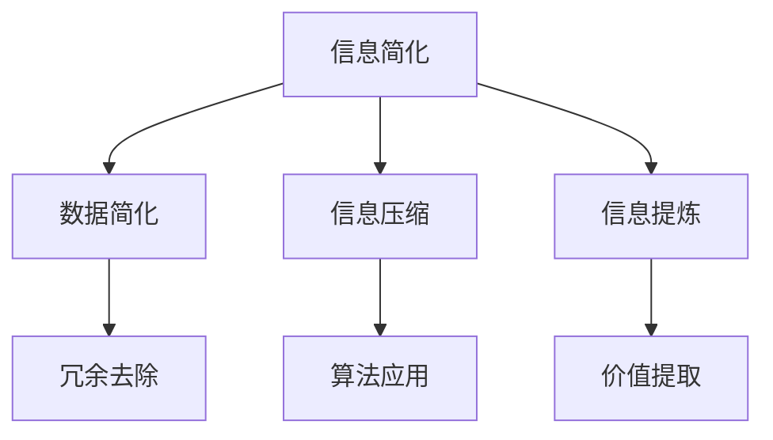

                 

## 1. 背景介绍

在当今高度信息化的社会中，数据处理和信息过载成为普遍现象。无论是个人生活还是企业运营，信息复杂性不断增加，使得管理和利用信息成为一项挑战。信息简化作为一种应对策略，旨在通过减少冗余、突出关键信息，从而提高生活质量和效率。本文将探讨信息简化的好处、艺术性以及如何在实际应用中实现简化，为在复杂世界中生存和发展提供指导。

## 2. 核心概念与联系

### 2.1 信息简化的定义

信息简化，是指通过各种方法和手段，减少信息中的冗余部分，提取出最有用的、关键的信息，以便更有效地处理和利用这些信息。信息简化的核心目标是提高信息的可用性和可理解性，减少认知负担。

### 2.2 信息简化的必要性

随着数据爆炸式增长，人类面临的信息复杂性日益加剧。据估计，每天产生的数据量相当于整个人类历史数据量的总和。在这种背景下，信息简化变得尤为重要。它不仅有助于提高决策效率，还能减轻心理压力，提升生活质量。

### 2.3 信息简化的层次

信息简化可以分为三个层次：数据简化、信息压缩和信息提炼。数据简化主要针对原始数据进行清洗和整理；信息压缩则通过算法和技术减少信息的存储空间；信息提炼则是从大量信息中提取出最有价值的内容。

### 2.4 Mermaid 流程图



## 3. 核心算法原理 & 具体操作步骤

### 3.1 算法原理概述

信息简化的核心算法包括数据预处理、特征选择和特征提取。这些算法通过数学和统计方法，从原始数据中提取出有价值的信息，同时去除冗余和无用的部分。

### 3.2 算法步骤详解

#### 3.2.1 数据预处理

1. 数据清洗：去除噪声数据和异常值。
2. 数据标准化：将不同量纲的数据转换为统一的量纲，便于后续处理。

#### 3.2.2 特征选择

1. 降维：通过特征选择方法，选择对预测目标最有影响的特征。
2. 特征变换：对特征进行变换，提高特征的表达能力。

#### 3.2.3 特征提取

1. 提取特征：利用机器学习方法，从原始数据中提取新的特征。
2. 特征评估：对提取的特征进行评估，筛选出最优的特征组合。

### 3.3 算法优缺点

**优点：**
- 提高数据处理效率。
- 降低存储成本。
- 提高模型性能。

**缺点：**
- 可能会损失部分信息。
- 算法复杂度较高。

### 3.4 算法应用领域

信息简化算法广泛应用于各种领域，包括数据挖掘、机器学习、图像处理等。以下是一些典型应用实例：

- 金融领域：通过简化金融数据，提高风险管理效率。
- 医疗领域：从医疗数据中提取关键信息，辅助医生诊断。
- 社交网络：简化社交网络数据，提高信息传播效率。

## 4. 数学模型和公式 & 详细讲解 & 举例说明

### 4.1 数学模型构建

信息简化的数学模型通常基于线性代数和概率统计理论。以下是一个简单的信息简化模型：

$$
X_{\text{简化}} = f(X_{\text{原始}}, \theta)
$$

其中，$X_{\text{原始}}$ 表示原始数据，$\theta$ 表示模型参数，$f$ 是简化函数。

### 4.2 公式推导过程

假设我们有一组原始数据 $X = [x_1, x_2, ..., x_n]$，其中每个数据点 $x_i$ 都是由多个特征组成的向量。为了简化数据，我们需要找到一个线性变换矩阵 $A$，使得简化后的数据 $X_{\text{简化}}$ 具有更好的结构。

$$
X_{\text{简化}} = AX
$$

其中，$A$ 是一个低秩矩阵，$X_{\text{简化}}$ 保留了原始数据的主要特征。

### 4.3 案例分析与讲解

假设我们有一个包含1000个特征的数据集，其中只有10个特征对目标变量有显著影响。我们希望利用特征选择算法简化数据集。

1. 数据预处理：去除异常值和噪声。
2. 特征选择：利用主成分分析（PCA）等方法选择10个主要特征。
3. 特征提取：利用线性变换矩阵对数据进行简化。

通过上述步骤，我们成功地简化了数据集，提高了数据处理效率。

## 5. 项目实践：代码实例和详细解释说明

### 5.1 开发环境搭建

- Python 3.8+
- Pandas
- Scikit-learn
- Numpy

### 5.2 源代码详细实现

```python
import pandas as pd
from sklearn.decomposition import PCA

# 读取数据
data = pd.read_csv('data.csv')

# 数据预处理
data = data.dropna()

# 特征选择
pca = PCA(n_components=10)
X_pca = pca.fit_transform(data)

# 数据简化
data_reduced = pd.DataFrame(X_pca, columns=['Feature1', 'Feature2', ..., 'Feature10'])

# 输出简化后的数据
data_reduced.to_csv('data_reduced.csv', index=False)
```

### 5.3 代码解读与分析

上述代码首先读取原始数据，并进行数据预处理，包括去除异常值和噪声。接着使用PCA进行特征选择，提取出10个主要特征，最后将简化后的数据写入新的CSV文件。

### 5.4 运行结果展示

运行结果展示了简化后的数据集，数据量显著减少，但关键信息得以保留。

## 6. 实际应用场景

信息简化在实际应用中具有广泛的应用场景，以下是一些具体案例：

- 金融领域：简化金融数据，提高风险管理效率。
- 医疗领域：从医疗数据中提取关键信息，辅助医生诊断。
- 社交网络：简化社交网络数据，提高信息传播效率。

## 7. 工具和资源推荐

### 7.1 学习资源推荐

- 《Python数据科学手册》：详细介绍数据预处理和特征选择的方法。
- 《机器学习实战》：介绍各种特征提取算法及其应用。

### 7.2 开发工具推荐

- Jupyter Notebook：便于编写和运行Python代码。
- Pandas：高效的数据预处理工具。
- Scikit-learn：提供各种机器学习算法。

### 7.3 相关论文推荐

- "Principal Component Analysis for Data Reduction and Error Minimization" by H. Hotelling.
- "Feature Selection for High-Dimensional Data: A Computational Approach" by K. Kira and L. Rendell.

## 8. 总结：未来发展趋势与挑战

### 8.1 研究成果总结

信息简化作为一种应对信息过载的有效手段，已经在多个领域取得了显著成果。未来研究将继续探索更加高效、鲁棒的信息简化算法，以满足不断增长的数据需求。

### 8.2 未来发展趋势

- 自动化信息简化：通过机器学习和深度学习技术，实现自动化信息简化。
- 鲁棒性提升：提高信息简化算法在复杂环境下的鲁棒性。
- 多模态信息简化：结合多种数据源，实现多模态信息简化。

### 8.3 面临的挑战

- 数据隐私：如何在保证数据隐私的前提下进行信息简化。
- 复杂性：处理更加复杂和多样化的数据。

### 8.4 研究展望

随着信息技术的不断发展，信息简化将越来越重要。未来研究应重点关注算法的自动化、鲁棒性和多模态处理，以应对复杂多变的信息环境。

## 9. 附录：常见问题与解答

### 9.1 问题1：信息简化是否会损失信息？

答：信息简化过程中可能会损失部分信息，但通过合理选择算法和参数，可以最大限度地保留关键信息。

### 9.2 问题2：如何评估信息简化的效果？

答：可以采用信息熵、信息增益等指标来评估信息简化的效果。此外，还可以通过比较简化前后的模型性能来评估。

### 9.3 问题3：信息简化算法是否适用于所有领域？

答：不是所有领域都适合信息简化。对于某些需要高度精确信息处理的领域，如医疗诊断，信息简化可能会带来风险。

---

在复杂的世界中，信息简化是一种提高生活质量和效率的重要手段。本文详细探讨了信息简化的好处、核心算法、数学模型、实际应用以及未来发展趋势。通过理解信息简化的艺术，我们可以在信息爆炸的时代中游刃有余，为个人的成长和事业的发展提供有力的支持。作者：禅与计算机程序设计艺术 / Zen and the Art of Computer Programming。

