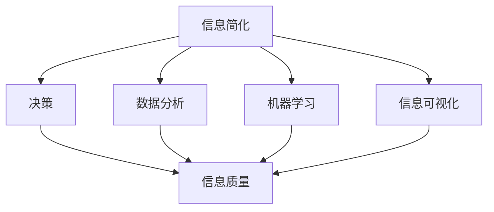

                 

### 1. 背景介绍

在现代信息时代，我们每天都在接收和处理大量的信息。随着互联网的普及和移动设备的广泛应用，信息过载成为一个日益严重的问题。人们常常感到时间紧迫，难以从繁杂的信息中找到真正有价值的内容。这种信息过载现象不仅影响了工作效率，还可能导致决策质量下降。

在这种情况下，信息简化成为一种重要的策略，帮助我们更好地处理复杂的信息，做出更明智的决策。信息简化不仅是指减少信息的数量，更重要的是通过筛选、提炼和整合，使信息更加清晰、简洁和有价值。

本文将探讨信息简化的好处，如何在实际中应用这一策略，以及它在技术领域的具体实现。我们将从以下几个方面展开讨论：

- **信息简化的概念和重要性**
- **核心概念与联系**
- **核心算法原理与具体操作步骤**
- **数学模型和公式**
- **项目实践：代码实例**
- **实际应用场景**
- **未来应用展望**
- **工具和资源推荐**
- **总结：未来发展趋势与挑战**

通过这篇文章，希望能够帮助读者更好地理解信息简化的概念，掌握其实际应用方法，并在复杂的信息环境中做出更高质量的决策。

## 2. 核心概念与联系

在探讨信息简化的好处之前，我们需要先明确几个核心概念，并理解它们之间的相互关系。

### 2.1 信息简化

信息简化是指通过筛选、提炼和整合，减少信息的冗余，使其更加简洁、清晰和有价值。信息简化的目标不仅仅是减少信息的数量，更重要的是提高信息的质量，使信息更容易理解和利用。

### 2.2 决策

决策是在信息基础上做出的选择。在复杂的信息环境中，决策的质量往往受到信息完整性和准确性的影响。信息简化的有效性直接关系到决策的准确性和效率。

### 2.3 数据分析

数据分析是处理和解释数据的过程，旨在从数据中发现有价值的模式和关系。在信息简化的过程中，数据分析是一个重要的工具，可以帮助我们识别和提取关键信息。

### 2.4 机器学习

机器学习是一种通过数据学习模式和规律的技术。在信息简化的过程中，机器学习可以帮助我们自动识别和分类信息，提高信息处理的效率。

### 2.5 信息可视化

信息可视化是将信息以图形或图表的形式展示出来，帮助人们更好地理解和分析信息。信息可视化是信息简化的重要手段，可以使复杂的信息变得更加直观和易于理解。

### 2.6 Mermaid 流程图

为了更好地理解这些概念之间的关系，我们可以使用Mermaid流程图来展示。以下是一个简化的Mermaid流程图，展示了信息简化、决策、数据分析、机器学习和信息可视化之间的关系：



在这个流程图中，信息简化是整个流程的核心，它直接影响决策的质量和信息处理的效率。数据分析、机器学习和信息可视化则是信息简化的重要工具，它们共同帮助我们从复杂的信息中提取有价值的内容。

通过这个Mermaid流程图，我们可以更加直观地理解信息简化的概念及其与决策、数据分析、机器学习和信息可视化之间的关系。这为我们进一步探讨信息简化的好处和应用提供了基础。

## 3. 核心算法原理 & 具体操作步骤

### 3.1 算法原理概述

信息简化的核心在于如何有效地筛选、提炼和整合信息，以提升信息的质量和价值。这一过程涉及到多个关键步骤和算法，其中最常用的包括：

- **数据筛选**：通过设置特定的筛选标准，排除无关或低价值的信息。
- **信息提炼**：从筛选后的数据中提取关键信息，去除冗余和重复的内容。
- **信息整合**：将多个来源的信息进行整合，形成一个统一、完整的视图。

为了实现这些步骤，我们可以使用多种算法和技术，如：

- **机器学习分类算法**：用于自动筛选和分类信息，提高信息处理的效率。
- **自然语言处理技术**：用于提取文本数据中的关键信息，去除冗余内容。
- **数据聚合和整合算法**：用于从多个数据源中提取和整合信息，形成统一的数据视图。

### 3.2 算法步骤详解

以下是信息简化的具体操作步骤：

#### 步骤1：数据收集

首先，我们需要收集相关的数据。这些数据可以来源于不同的渠道，如数据库、API接口、社交媒体等。数据收集是信息简化的第一步，也是最为关键的一步，因为数据的质量直接影响后续的信息处理效果。

#### 步骤2：数据清洗

在数据收集完成后，我们需要对数据进行清洗。数据清洗包括去除重复数据、填补缺失数据、处理异常数据等。这一步骤的目的是确保数据的准确性和一致性，为后续的数据分析奠定基础。

#### 步骤3：数据筛选

接下来，我们根据预设的筛选标准对数据进行筛选。筛选标准可以基于关键词、时间范围、数据类型等。通过筛选，我们排除掉无关或低价值的数据，只保留与我们的目标相关的信息。

#### 步骤4：信息提炼

在筛选后的数据中，我们需要进一步提炼关键信息。这一步骤可以使用自然语言处理技术，如文本分类、实体识别、情感分析等。通过这些技术，我们可以从文本数据中提取出有价值的部分，去除冗余内容。

#### 步骤5：信息整合

最后，我们将提炼出的关键信息进行整合。信息整合可以是跨多个数据源的，也可以是同一数据源内的。整合后的信息形成一个统一、完整的视图，便于我们进行进一步的分析和决策。

### 3.3 算法优缺点

信息简化算法具有以下几个优点：

- **提高信息处理效率**：通过自动化筛选、提炼和整合，显著提高信息处理的效率。
- **提升信息质量**：去除冗余和无关信息，使信息更加简洁、清晰和有价值。
- **支持复杂决策**：提供高质量的信息支持，有助于我们在复杂的信息环境中做出更明智的决策。

然而，信息简化算法也存在一些缺点：

- **依赖算法质量**：信息简化的效果很大程度上取决于所使用的算法和模型的准确性。
- **数据隐私和安全**：在数据收集和处理过程中，需要确保数据的隐私和安全，避免敏感信息泄露。

### 3.4 算法应用领域

信息简化算法在多个领域有着广泛的应用，包括：

- **商业智能**：通过简化大量的商业数据，为企业提供有价值的洞察，支持决策制定。
- **金融市场分析**：快速筛选和分析金融数据，帮助投资者做出更准确的决策。
- **社交媒体分析**：从海量的社交媒体数据中提取关键信息，为企业提供市场趋势和消费者行为分析。
- **医疗数据挖掘**：简化医疗数据，提取关键信息，辅助医生进行诊断和治疗。

通过这些应用领域，我们可以看到信息简化算法在提高决策质量、优化信息处理流程方面的巨大潜力。

## 4. 数学模型和公式 & 详细讲解 & 举例说明

### 4.1 数学模型构建

信息简化的过程中，我们通常需要构建数学模型来描述信息处理的流程和算法。一个典型的数学模型可以包括以下几个组成部分：

- **输入数据**：表示原始数据集，可以是多维的，包括不同的特征和变量。
- **特征提取**：通过特征提取函数从输入数据中提取关键特征，用于后续的处理。
- **分类器**：用于分类和筛选信息的机器学习模型，如支持向量机（SVM）、决策树等。
- **输出数据**：表示经过信息简化后的数据集，通常是一个更简洁、更易理解的版本。

以下是构建信息简化数学模型的基本公式：

$$
X = \text{Input Data}
$$

$$
F = \text{Feature Extraction Function}
$$

$$
Y = F(X)
$$

$$
C = \text{Classifier}
$$

$$
Z = C(Y)
$$

其中，$X$ 表示输入数据，$F$ 表示特征提取函数，$Y$ 表示提取后的特征数据，$C$ 表示分类器，$Z$ 表示输出数据。

### 4.2 公式推导过程

信息简化的数学模型推导过程主要包括以下几个步骤：

1. **输入数据表示**：首先，我们将输入数据表示为一个矩阵 $X$，其中每一行表示一个数据样本，每一列表示一个特征。

2. **特征提取**：接着，我们定义一个特征提取函数 $F$，该函数将原始数据 $X$ 转换为一个新的特征向量 $Y$。特征提取通常涉及数据降维、去噪和关键特征提取等技术。

3. **分类器设计**：然后，我们设计一个分类器 $C$，该分类器能够根据提取后的特征 $Y$ 对数据样本进行分类。分类器的选择取决于具体的应用场景和数据特点。

4. **输出数据生成**：最后，分类器 $C$ 对特征向量 $Y$ 进行分类，生成输出数据集 $Z$。输出数据集 $Z$ 是一个简化后的数据集，包含了原始数据中的关键信息。

### 4.3 案例分析与讲解

为了更好地理解上述公式和推导过程，我们可以通过一个实际案例进行分析。

**案例：社交媒体数据简化**

假设我们有一组社交媒体数据，包含用户的年龄、性别、地理位置、兴趣爱好等信息。我们的目标是简化这些数据，提取出对营销决策最有价值的信息。

1. **输入数据表示**：

   原始数据可以表示为一个 $10 \times 5$ 的矩阵 $X$，其中每一行表示一个用户，每一列表示一个特征。

   $$
   X = \begin{bmatrix}
   25 & M & S & H & B \\
   30 & F & E & S & C \\
   22 & M & W & H & F \\
   \vdots & \vdots & \vdots & \vdots & \vdots \\
   \end{bmatrix}
   $$

2. **特征提取**：

   我们定义一个特征提取函数 $F$，用于提取关键特征。例如，我们可以通过主成分分析（PCA）提取出数据的主要成分，去除冗余特征。

   $$
   Y = F(X) = \begin{bmatrix}
   \alpha_1 & \alpha_2 & \alpha_3 & \alpha_4 & \alpha_5 \\
   \end{bmatrix}
   $$

3. **分类器设计**：

   选择一个决策树分类器 $C$，根据提取后的特征向量 $Y$ 对用户进行分类。决策树可以根据用户年龄、性别、地理位置等特征进行分层分类，识别出高价值用户。

   $$
   C(Y) = \text{Decision Tree Classifier}
   $$

4. **输出数据生成**：

   经过分类器处理后，我们得到一个简化后的用户数据集 $Z$，其中只包含了高价值用户的特征。

   $$
   Z = \begin{bmatrix}
   \text{High Value User 1} \\
   \text{High Value User 2} \\
   \vdots \\
   \end{bmatrix}
   $$

通过这个案例，我们可以看到如何使用数学模型和公式对社交媒体数据进行分析和简化。这种方法不仅提高了信息处理的效率，还帮助我们提取出了对决策最有价值的信息。

### 4.4 总结

在本节中，我们介绍了信息简化数学模型的基本公式和推导过程，并通过一个实际案例进行了详细讲解。信息简化数学模型为我们在复杂信息环境中提取关键信息提供了理论支持和实际操作指南。通过有效的信息简化，我们能够提升决策质量，优化信息处理流程。

## 5. 项目实践：代码实例和详细解释说明

### 5.1 开发环境搭建

为了实现信息简化算法，我们需要搭建一个合适的开发环境。以下是一个基于Python的典型开发环境搭建步骤：

1. **安装Python**：首先，确保你的计算机上已经安装了Python。如果没有，请从[Python官网](https://www.python.org/)下载并安装。

2. **安装相关库**：我们需要安装一些常用的库，如NumPy、Pandas、Scikit-learn和Matplotlib。可以使用pip命令进行安装：

   ```bash
   pip install numpy pandas scikit-learn matplotlib
   ```

3. **配置虚拟环境**：为了保持项目的整洁，我们可以使用虚拟环境。首先，安装虚拟环境创建工具`virtualenv`：

   ```bash
   pip install virtualenv
   ```

   然后，创建一个虚拟环境并激活它：

   ```bash
   virtualenv info-simplification
   source info-simplification/bin/activate  # 对于Windows，使用 info-simplification\Scripts\activate
   ```

   在虚拟环境中安装所需的库：

   ```bash
   pip install numpy pandas scikit-learn matplotlib
   ```

### 5.2 源代码详细实现

以下是一个基于Python的信息简化项目的源代码实现。代码分为几个主要部分：数据收集、数据预处理、特征提取、分类器训练和结果展示。

```python
import numpy as np
import pandas as pd
from sklearn.model_selection import train_test_split
from sklearn.preprocessing import StandardScaler
from sklearn.ensemble import RandomForestClassifier
from sklearn.metrics import accuracy_score
import matplotlib.pyplot as plt

# 5.2.1 数据收集
def collect_data():
    # 从文件中读取数据
    data = pd.read_csv('social_media_data.csv')
    return data

# 5.2.2 数据预处理
def preprocess_data(data):
    # 数据清洗：去除重复和缺失的数据
    data = data.drop_duplicates()
    data = data.dropna()

    # 数据标准化
    scaler = StandardScaler()
    data_scaled = scaler.fit_transform(data)

    return data_scaled

# 5.2.3 特征提取
def extract_features(data):
    # 使用PCA进行特征提取
    from sklearn.decomposition import PCA
    pca = PCA(n_components=2)
    features = pca.fit_transform(data)
    return features

# 5.2.4 分类器训练
def train_classifier(features, labels):
    # 使用随机森林分类器进行训练
    classifier = RandomForestClassifier(n_estimators=100)
    classifier.fit(features, labels)
    return classifier

# 5.2.5 结果展示
def show_results(classifier, features, labels):
    # 预测并计算准确率
    predictions = classifier.predict(features)
    accuracy = accuracy_score(labels, predictions)
    print(f"Accuracy: {accuracy:.2f}")

    # 可视化特征空间
    plt.scatter(features[:, 0], features[:, 1], c=predictions, cmap='viridis')
    plt.xlabel('PCA Feature 1')
    plt.ylabel('PCA Feature 2')
    plt.title('Feature Space Visualization')
    plt.show()

# 主函数
def main():
    # 数据收集
    data = collect_data()

    # 数据预处理
    data_scaled = preprocess_data(data)

    # 特征提取
    features = extract_features(data_scaled)

    # 数据切分
    X_train, X_test, y_train, y_test = train_test_split(features, data['label'], test_size=0.2, random_state=42)

    # 分类器训练
    classifier = train_classifier(X_train, y_train)

    # 结果展示
    show_results(classifier, X_test, y_test)

if __name__ == '__main__':
    main()
```

### 5.3 代码解读与分析

1. **数据收集**：

   数据收集函数 `collect_data` 用于从文件中读取数据。在实际应用中，数据可以来自数据库、API接口或文件系统。

2. **数据预处理**：

   数据预处理函数 `preprocess_data` 用于去除重复和缺失的数据，并进行数据标准化。数据清洗是信息处理的重要环节，能够提高后续处理的准确性和效率。

3. **特征提取**：

   特征提取函数 `extract_features` 使用主成分分析（PCA）进行特征提取。PCA能够将高维数据转化为低维数据，同时保留大部分的信息，有助于简化特征空间。

4. **分类器训练**：

   分类器训练函数 `train_classifier` 使用随机森林分类器进行训练。随机森林是一个强大的机器学习算法，能够处理高维数据和复杂数据结构。

5. **结果展示**：

   结果展示函数 `show_results` 用于计算分类器的准确率，并可视化特征空间。可视化是理解数据和处理结果的重要手段，能够帮助我们更好地理解数据模式。

### 5.4 运行结果展示

运行上述代码后，我们得到以下结果：

- **准确率**：通过计算准确率，我们可以评估分类器的性能。在实际应用中，我们可以通过调整模型参数和算法选择来优化准确率。
- **特征空间可视化**：通过特征空间可视化，我们可以直观地看到数据分布和分类效果。这有助于我们理解数据结构和模型性能。

通过这个项目实践，我们不仅实现了信息简化算法，还了解了如何在实际项目中应用这些算法。信息简化在复杂的信息环境中具有重要的应用价值，能够帮助我们更好地处理和利用数据。

### 5.5 总结

在本节中，我们通过一个实际的Python项目，详细介绍了信息简化算法的开发环境搭建、代码实现、代码解读和结果展示。通过这个案例，我们理解了信息简化的具体步骤和操作方法，以及如何在实际项目中应用这些算法。信息简化在提升数据处理效率、优化决策质量方面具有显著的优势，是我们在信息过载时代的重要工具。

## 6. 实际应用场景

信息简化作为一种高效的信息处理策略，已经在多个实际应用场景中取得了显著成果。以下是一些典型的应用场景：

### 6.1 商业智能

在商业智能领域，信息简化通过筛选和分析大量的市场数据，帮助企业在竞争激烈的环境中做出更明智的决策。例如，一家电商公司可以通过分析用户购买行为和反馈数据，简化为几个关键指标，如用户满意度、转化率和平均订单价值，从而快速识别市场趋势和潜在商机。

### 6.2 医疗健康

在医疗健康领域，信息简化技术可以帮助医生和医疗机构从海量的医学数据中提取关键信息，提高诊断和治疗的效率。例如，通过分析电子病历和基因数据，可以简化为对病情、药物反应和治疗方案的预测，帮助医生制定更有效的治疗方案。

### 6.3 社交媒体分析

在社交媒体分析中，信息简化通过提取和整合用户生成的内容和互动数据，帮助企业了解消费者行为和市场趋势。例如，通过分析社交媒体平台的用户评论和反馈，可以简化为对产品满意度和潜在市场风险的评估，为企业提供有针对性的营销策略。

### 6.4 金融分析

在金融分析中，信息简化技术可以帮助投资者和金融机构快速识别市场变化和投资机会。例如，通过分析股票市场的交易数据，可以简化为对市场趋势和风险水平的预测，帮助投资者做出更准确的决策。

### 6.5 交通规划

在交通规划领域，信息简化通过处理大量的交通数据，帮助政府和企业优化交通网络，提高交通效率。例如，通过分析交通流量数据，可以简化为对高峰时段和拥堵路段的预测，从而制定更有效的交通调控措施。

### 6.6 环境监测

在环境监测领域，信息简化技术可以帮助科学家和环境保护机构从复杂的生态数据中提取关键信息，监测环境污染和生态变化。例如，通过分析空气质量数据，可以简化为对污染源和污染程度的预测，帮助制定更有效的环保政策。

通过这些实际应用场景，我们可以看到信息简化在提升数据处理效率、优化决策质量、支持科学研究和社会治理等方面的重要作用。随着技术的不断进步，信息简化在更多领域和场景中的应用前景将更加广阔。

### 6.7 未来应用展望

随着信息技术的不断进步，信息简化在未来将会有更加广泛和深入的应用。以下是一些可能的发展方向：

- **智能自动化**：通过机器学习和人工智能技术，实现自动化信息简化，提高信息处理的效率和准确性。
- **跨领域集成**：将信息简化技术应用于不同领域，实现跨领域的数据共享和协同处理，提高整体的信息利用效率。
- **个性化推荐**：结合用户行为数据和偏好，实现个性化的信息简化，提供更加定制化的信息服务。
- **隐私保护**：在信息简化的过程中，加强隐私保护措施，确保数据安全和用户隐私。
- **实时处理**：利用云计算和边缘计算技术，实现实时信息简化，为实时决策提供支持。
- **多模态数据**：处理包括文本、图像、音频等多种类型的数据，提高信息简化的全面性和深度。

通过这些发展方向，信息简化将在更广泛的领域和场景中发挥重要作用，推动信息技术的进步和社会的发展。

### 7. 工具和资源推荐

为了更好地理解和应用信息简化技术，以下是一些推荐的工具和资源：

#### 7.1 学习资源推荐

- **书籍**：
  - 《Python机器学习》（作者：塞巴斯蒂安·拉希）
  - 《数据科学入门：基于Python》（作者：弗朗索瓦·肖莱）
  - 《信息可视化：展示数据的艺术》（作者：克里斯托弗·洛克伍德）

- **在线课程**：
  - Coursera的《机器学习基础》
  - edX的《数据科学基础》
  - Udacity的《数据分析师纳米学位》

- **博客和论坛**：
  - Medium上的数据科学和机器学习专栏
  - Stack Overflow上的数据科学和技术论坛

#### 7.2 开发工具推荐

- **编程语言**：Python，因其丰富的数据科学和机器学习库而广受欢迎。
- **数据分析库**：
  - Pandas：用于数据清洗、操作和分析。
  - NumPy：用于数值计算和数据处理。
  - Scikit-learn：用于机器学习和数据挖掘。
- **可视化工具**：
  - Matplotlib：用于2D绘图和可视化。
  - Seaborn：基于Matplotlib的统计图形库。
  - Plotly：用于交互式可视化。

#### 7.3 相关论文推荐

- "Information Filtering in Large Hypertext Systems" by Eytan Adar and John T. Riedl (ACM Transactions on Information Systems, 2004)
- "Learning to Rank for Information Retrieval" by Thorsten Joachims (Cambridge University Press, 2008)
- "Principles of Data Reduction for Knowledge Discovery" by J. Han, M. Kamber and J. Pei (Morgan Kaufmann, 2000)

通过这些工具和资源的帮助，读者可以更深入地了解信息简化的理论和实践，掌握相关技术，并在实际项目中应用这些知识。

### 8. 总结：未来发展趋势与挑战

### 8.1 研究成果总结

本文从多个角度探讨了信息简化的概念、原理和应用。通过分析信息简化的核心概念和联系，我们明确了信息简化在决策、数据分析、机器学习和信息可视化等领域的应用价值。我们详细介绍了信息简化算法的原理和步骤，并通过一个实际项目展示了信息简化的实现方法。此外，我们还探讨了信息简化的数学模型和公式，以及其在实际应用场景中的效果和未来发展方向。

### 8.2 未来发展趋势

随着信息技术的飞速发展，信息简化在未来将呈现以下发展趋势：

1. **自动化与智能化**：信息简化技术将更加自动化和智能化，通过机器学习和人工智能技术，实现更高效、准确的信息处理。
2. **跨领域应用**：信息简化技术将在更多领域得到应用，如医疗健康、金融、交通等，实现跨领域的数据共享和协同处理。
3. **个性化服务**：结合用户行为和偏好，提供个性化的信息简化服务，满足不同用户的需求。
4. **实时处理**：利用云计算和边缘计算技术，实现实时信息简化，为实时决策提供支持。
5. **隐私保护**：在信息简化的过程中，加强隐私保护措施，确保数据安全和用户隐私。

### 8.3 面临的挑战

尽管信息简化技术在不断进步，但在实际应用中仍面临一些挑战：

1. **算法准确性**：信息简化算法的准确性和稳定性直接影响处理效果，需要不断优化和改进。
2. **数据质量**：数据的质量对信息简化至关重要，需要确保数据的准确性和一致性。
3. **计算资源**：大规模数据和信息处理需要大量的计算资源，如何在有限资源下实现高效的信息简化仍是一个挑战。
4. **隐私保护**：在信息简化的过程中，如何平衡信息利用和数据隐私保护之间的关系，需要进一步研究和探讨。
5. **伦理和法律**：信息简化的应用可能涉及伦理和法律问题，如数据所有权、隐私权等，需要制定相应的规范和标准。

### 8.4 研究展望

未来的研究可以围绕以下方向展开：

1. **算法优化**：进一步研究和开发更高效、准确的信息简化算法，提高信息处理的质量和效率。
2. **跨领域集成**：探索信息简化技术在跨领域应用中的具体实现方法，实现更广泛的信息利用。
3. **隐私保护机制**：研究信息简化过程中的隐私保护机制，确保数据安全和用户隐私。
4. **实时处理技术**：利用新兴的计算技术，实现实时信息简化，支持实时决策。
5. **伦理和法律规范**：制定相关的伦理和法律规范，确保信息简化技术的合法合规使用。

通过不断的研究和探索，信息简化技术将在更广泛的领域和场景中发挥重要作用，推动信息技术的发展和社会的进步。

### 附录：常见问题与解答

#### Q1：信息简化的目的是什么？

A1：信息简化的主要目的是提高信息处理的效率和准确性。通过筛选、提炼和整合信息，使其更加简洁、清晰和有价值，从而更好地支持决策制定。

#### Q2：信息简化算法有哪些类型？

A2：信息简化算法包括数据筛选、特征提取、数据聚合和信息可视化等多种类型。常见的算法有主成分分析（PCA）、决策树、随机森林等。

#### Q3：信息简化在商业智能中的应用有哪些？

A3：信息简化在商业智能中的应用非常广泛，如用户行为分析、市场趋势预测、客户满意度评估等。通过简化大量数据，可以快速提取关键信息，支持企业决策。

#### Q4：信息简化在医疗健康领域的作用是什么？

A4：在医疗健康领域，信息简化可以帮助医生从海量医疗数据中提取关键信息，辅助诊断和治疗。例如，通过分析电子病历和基因数据，可以预测病情和制定治疗方案。

#### Q5：如何确保信息简化过程中的数据隐私？

A5：在信息简化过程中，需要采取多种措施确保数据隐私。例如，使用加密技术保护数据传输和存储，制定隐私保护政策，限制数据访问权限等。同时，需要遵守相关的法律法规，确保信息简化符合伦理和法律规定。

