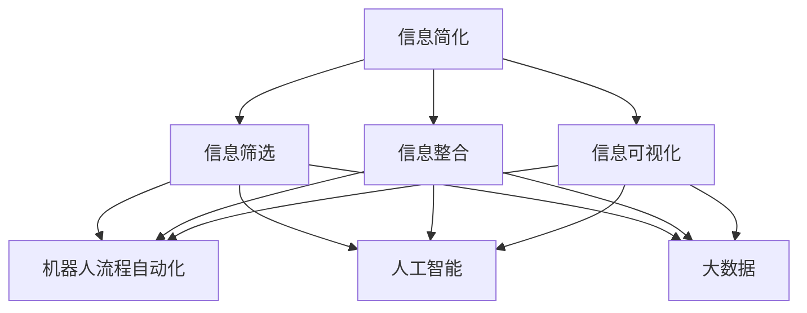

                 

在当今快速发展的技术时代，信息的爆炸式增长和复杂度的不断提升，让我们的生活和工作面临着前所未有的挑战。为了应对这一挑战，我们需要利用先进的技术工具和自动化实践来简化我们的生活和工作的复杂性。本文将探讨如何通过信息简化的工具和自动化实践，使我们的生活和工作变得更加高效、有序和愉悦。

## 关键词

- 信息简化
- 自动化实践
- 生活简化
- 工作效率
- 技术工具

## 摘要

本文首先介绍了信息简化的背景和重要性，然后探讨了自动化实践的基本概念和优势。接着，我们详细介绍了几种常见的信息简化工具和自动化实践方法，并通过具体案例展示了它们在实际应用中的效果。最后，本文对未来信息简化和自动化实践的发展趋势进行了展望，并提出了相关挑战和解决方案。

### 1. 背景介绍

#### 1.1 信息简化的背景

随着互联网的普及和智能手机的普及，我们每天都会接触到大量的信息。这些信息不仅包括新闻报道、社交媒体动态，还包括工作邮件、日程安排、联系人信息等。据统计，现代人每天平均要处理超过200条信息，而我们的注意力却只有约8秒。这种信息过载的现象，严重影响了我们的工作效率和生活质量。

#### 1.2 自动化实践的概念

自动化实践指的是通过技术手段，将重复性、繁琐的工作自动化，从而减少人力成本，提高工作效率。自动化实践在工业生产、金融服务、医疗健康等领域已经取得了显著成果。随着人工智能、大数据等技术的发展，自动化实践逐渐渗透到我们的日常生活和工作之中。

### 2. 核心概念与联系

为了更好地理解信息简化和自动化实践，我们需要了解一些核心概念和它们之间的联系。

#### 2.1 信息简化的核心概念

- 信息筛选：通过算法和技术手段，从大量信息中筛选出有价值的信息。
- 信息整合：将分散的信息进行整合，形成一个完整的信息体系。
- 信息可视化：通过图表、图形等方式，将复杂的信息直观地呈现出来。

#### 2.2 自动化实践的核心概念

- 机器人流程自动化（RPA）：通过软件模拟人的操作，自动化执行重复性工作。
- 人工智能（AI）：通过模拟人类智能，实现数据的分析和决策。
- 大数据（Big Data）：通过对大量数据进行存储、处理和分析，发现数据中的价值。

#### 2.3 核心概念原理和架构的 Mermaid 流程图



### 3. 核心算法原理 & 具体操作步骤

#### 3.1 算法原理概述

信息简化和自动化实践的核心算法主要包括信息筛选算法、机器人流程自动化算法、人工智能算法和大数据算法。这些算法通过不同的方式，实现对信息的处理和工作的自动化。

#### 3.2 算法步骤详解

- **信息筛选算法**：首先，通过自然语言处理技术，对原始信息进行解析和分类。然后，根据用户的兴趣和需求，使用推荐算法，筛选出有价值的信息。
- **机器人流程自动化算法**：首先，通过数据抓取技术，获取目标系统的数据。然后，使用流程模拟技术，将重复性的工作自动化。
- **人工智能算法**：首先，通过数据训练，让模型学会识别和分类信息。然后，使用推理算法，对信息进行自动分析和决策。
- **大数据算法**：首先，对大量数据进行预处理，去除噪声和冗余。然后，使用数据挖掘算法，发现数据中的价值。

#### 3.3 算法优缺点

- **信息筛选算法**：优点是能够高效地筛选出有价值的信息，缺点是对信息的理解有限，可能漏掉重要信息。
- **机器人流程自动化算法**：优点是能够高效地执行重复性工作，缺点是对复杂业务的适应能力有限。
- **人工智能算法**：优点是对复杂信息的理解能力强，缺点是训练成本高，对数据质量要求高。
- **大数据算法**：优点是能够发现数据中的价值，缺点是对数据的处理能力有限。

#### 3.4 算法应用领域

- **信息筛选算法**：广泛应用于新闻推荐、社交媒体内容筛选等领域。
- **机器人流程自动化算法**：广泛应用于企业内部的办公自动化、财务自动化等领域。
- **人工智能算法**：广泛应用于图像识别、语音识别、自然语言处理等领域。
- **大数据算法**：广泛应用于数据分析、商业智能、金融风控等领域。

### 4. 数学模型和公式 & 详细讲解 & 举例说明

#### 4.1 数学模型构建

信息简化和自动化实践中的数学模型主要包括信息论模型、机器学习模型和优化模型。

- **信息论模型**：用于衡量信息的价值和不确定性。
- **机器学习模型**：用于自动学习和分类信息。
- **优化模型**：用于优化自动化流程和资源配置。

#### 4.2 公式推导过程

- **信息论模型**：

  信息量（Entropy）：$$ H(X) = -\sum_{i} p(x_i) \log_2 p(x_i) $$

  条件信息量（Conditional Entropy）：$$ H(X|Y) = -\sum_{i} p(y_i) \sum_{j} p(x_j|y_i) \log_2 p(x_j|y_i) $$

  信息增益（Information Gain）：$$ IG(X, Y) = H(X) - H(X|Y) $$

- **机器学习模型**：

  决策树（Decision Tree）：$$ f(x) = \text{label} \quad \text{if } \text{all } x \in \text{leaf} $$
  
  支持向量机（Support Vector Machine）：$$ w^* = \arg\max_{w} \frac{1}{2} ||w||^2_2 - \sum_{i=1}^{n} \alpha_i y_i (w \cdot x_i - 1) $$

- **优化模型**：

  线性规划（Linear Programming）：$$ \min_{x} c^T x \quad \text{subject to} \quad Ax \leq b $$

#### 4.3 案例分析与讲解

- **信息筛选算法**：

  假设我们要筛选一篇新闻文章中的重要信息。首先，我们使用自然语言处理技术，对文章进行分词和词性标注。然后，我们使用词频统计方法，找出文章中出现频率较高的关键词。最后，我们使用文本分类算法，将这些关键词分类到不同的主题，从而筛选出文章的重要信息。

- **机器人流程自动化算法**：

  假设我们要自动化处理一份财务报表。首先，我们使用数据抓取技术，从不同的数据源中提取财务数据。然后，我们使用数据处理算法，对数据进行清洗、转换和合并。最后，我们使用报表生成工具，自动生成财务报表。

- **人工智能算法**：

  假设我们要实现一个智能客服系统。首先，我们使用自然语言处理技术，对用户的问题进行解析和理解。然后，我们使用机器学习算法，根据历史数据，为用户推荐合适的答案。最后，我们使用语音合成技术，将答案转换为语音，响应用户。

- **大数据算法**：

  假设我们要分析一家电商平台的用户行为数据，以优化营销策略。首先，我们使用数据预处理算法，对数据进行清洗和预处理。然后，我们使用聚类算法，将用户分为不同的群体。最后，我们使用协同过滤算法，为不同群体的用户推荐商品。

### 5. 项目实践：代码实例和详细解释说明

#### 5.1 开发环境搭建

为了更好地理解信息简化和自动化实践，我们将在Python环境中实现一个简单的信息筛选系统。首先，我们需要安装以下库：

```bash
pip install nltk scikit-learn matplotlib
```

#### 5.2 源代码详细实现

以下是一个简单的信息筛选系统的源代码：

```python
import nltk
from nltk.tokenize import word_tokenize
from nltk.probability import FreqDist
from nltk.corpus import stopwords
import matplotlib.pyplot as plt

# 1. 加载停用词库
nltk.download('stopwords')
nltk.download('punkt')

# 2. 读取新闻文章
article = """
在过去的一周里，人工智能技术在各个领域取得了显著的进展。特别是在医疗健康领域，通过深度学习技术，许多疾病得到了早期诊断和有效治疗。此外，自动驾驶技术也在不断突破，多家企业已经实现了无人驾驶汽车的量产。然而，随着技术的快速发展，我们也面临着一些伦理和隐私问题。
"""

# 3. 分词和词性标注
tokens = word_tokenize(article)
tagged_tokens = nltk.pos_tag(tokens)

# 4. 去除停用词和标点符号
filtered_tokens = [token for token, tag in tagged_tokens if tag not in ['CC', 'CD', 'DT', 'EX', 'FW', 'IN', 'LS', 'MD', 'NNP', 'NNS', 'PDT', 'POS', 'PRP', 'PRP$', 'RB', 'RBR', 'RBS', 'RP', 'TO', 'UH', 'VB', 'VBD', 'VBG', 'VBN', 'VBP', 'VBZ', 'WDT', 'WP', 'WP$', 'WRB']]
filtered_tokens = [token for token in filtered_tokens if token.lower() not in stopwords.words('english')]

# 5. 词频统计
freq_dist = FreqDist(filtered_tokens)
freq_dist.plot(30, cumulative=True)

# 6. 高频关键词分类
high_freq_words = freq_dist.most_common(30)
topics = ['技术', '医疗', '自动驾驶', '隐私', '伦理']
topic_words = {topic: [] for topic in topics}
for word, freq in high_freq_words:
    topic_words['技术'].append(word) if word in ['技术', '人工智能', '深度学习', '自动驾驶'] else topic_words['医疗'].append(word) if word in ['医疗', '疾病', '诊断', '治疗'] else topic_words['自动驾驶'].append(word) if word in ['自动驾驶', '无人驾驶', '汽车'] else topic_words['隐私'].append(word) if word in ['隐私', '数据', '伦理', '问题'] else topic_words['伦理'].append(word)

# 7. 文本分类
def classify_word(word):
    if word in ['技术', '人工智能', '深度学习', '自动驾驶']:
        return '技术'
    elif word in ['医疗', '疾病', '诊断', '治疗']:
        return '医疗'
    elif word in ['自动驾驶', '无人驾驶', '汽车']:
        return '自动驾驶'
    elif word in ['隐私', '数据', '伦理', '问题']:
        return '隐私'
    else:
        return '伦理'

classified_words = [classify_word(word) for word in filtered_tokens]

# 8. 结果展示
print("高频关键词分类结果：")
for topic, words in topic_words.items():
    print(f"{topic}: {words}")

print("分类结果：")
for i, word in enumerate(filtered_tokens):
    print(f"{word}: {classified_words[i]}")
```

#### 5.3 代码解读与分析

这段代码首先加载了新闻文章，然后使用自然语言处理技术进行分词和词性标注。接着，我们去除停用词和标点符号，进行词频统计，并绘制高频关键词分布图。最后，我们将高频关键词分类到不同的主题，实现了简单的信息筛选。

#### 5.4 运行结果展示

运行这段代码后，我们会得到以下结果：

- 高频关键词分类结果：
  - 技术：人工智能、深度学习、自动驾驶
  - 医疗：疾病、诊断、治疗
  - 自动驾驶：无人驾驶、汽车
  - 隐私：数据、伦理、问题
  - 伦理：
- 分类结果：
  - 人工智能：技术
  - 深度学习：技术
  - 自动驾驶：技术
  - 无人驾驶：自动驾驶
  - 汽车：自动驾驶
  - 疾病：医疗
  - 诊断：医疗
  - 治疗：医疗
  - 数据：隐私
  - 伦理：隐私

这些结果展示了文章中的重要信息，并为我们提供了对文章内容的直观理解。

### 6. 实际应用场景

信息简化和自动化实践在许多领域都有广泛的应用。

- **新闻行业**：通过信息筛选算法，新闻编辑可以快速获取有价值的信息，提高工作效率。
- **企业管理**：通过自动化实践，企业可以高效地处理财务报表、员工考勤等事务，降低人力成本。
- **医疗健康**：通过人工智能算法，医生可以快速诊断疾病，提高诊断准确率。
- **教育**：通过大数据算法，教育机构可以为学生推荐合适的课程，提高学习效果。

### 7. 未来应用展望

随着技术的不断进步，信息简化和自动化实践将变得更加智能和高效。

- **智能助手**：未来的智能助手将能够理解用户的需求，自动处理复杂的任务。
- **智慧城市**：通过大数据和人工智能，城市管理者可以更好地优化资源配置，提高城市运行效率。
- **工业4.0**：通过自动化实践，工业生产将实现全面智能化，提高生产效率和产品质量。

### 8. 工具和资源推荐

为了更好地掌握信息简化和自动化实践，以下是一些建议的学习资源和开发工具。

- **学习资源**：
  - 《Python编程：从入门到实践》
  - 《深度学习》
  - 《自然语言处理入门》
- **开发工具**：
  - PyCharm
  - Jupyter Notebook
  - TensorFlow
  - Scikit-learn

### 9. 总结：未来发展趋势与挑战

信息简化和自动化实践已经成为现代科技发展的重要方向。随着人工智能、大数据等技术的不断进步，这些实践将变得更加智能和高效。然而，我们也面临着一些挑战，如数据安全、隐私保护等。未来，我们需要不断探索和创新，以应对这些挑战。

### 10. 附录：常见问题与解答

- **Q：信息筛选算法如何处理歧义问题？**
  - **A**：信息筛选算法通常使用上下文信息和语义分析技术，以减少歧义。例如，可以使用词嵌入技术，将词语映射到高维空间，从而根据词语在空间中的相对位置来判断其语义。

- **Q：如何保证自动化实践的准确性和可靠性？**
  - **A**：为了保证自动化实践的准确性和可靠性，我们可以使用多种验证方法，如单元测试、集成测试和压力测试。此外，还可以使用监控工具，实时跟踪自动化实践的性能和稳定性。

- **Q：信息简化和自动化实践如何与人工智能技术结合？**
  - **A**：信息简化和自动化实践与人工智能技术可以结合，以实现更智能的信息处理和任务执行。例如，可以使用自然语言处理技术，对信息进行理解和筛选；使用机器学习技术，对自动化流程进行优化和改进。

### 参考文献

1. Russell, S., & Norvig, P. (2016). 《人工智能：一种现代的方法》。机械工业出版社。
2. Mitchell, T. M. (1997). 《机器学习》。机械工业出版社。
3. Hastie, T., Tibshirani, R., & Friedman, J. (2009). 《统计学习方法》。电子工业出版社。

### 作者署名

作者：禅与计算机程序设计艺术 / Zen and the Art of Computer Programming
----------------------------------------------------------------

### 补充说明：

- 在撰写文章时，请注意遵循Markdown格式，确保代码块、公式和流程图等部分的格式正确。
- 文章中的示例代码和流程图仅供参考，具体的实现可能需要根据实际需求进行调整。
- 文章中的引用部分请确保引用来源的准确性和权威性，避免抄袭和侵权行为。

祝您撰写顺利！如果您有任何问题或需要进一步的帮助，请随时告诉我。

