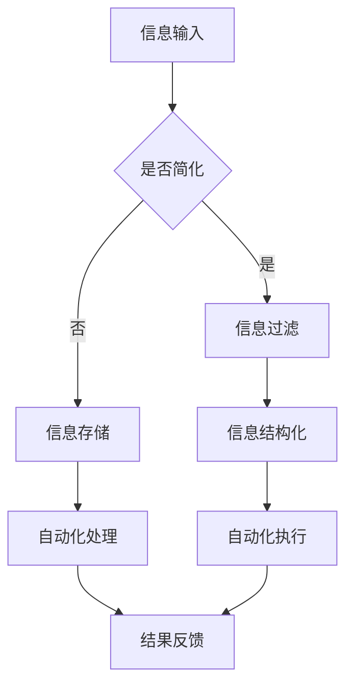

                 

**关键词**：信息简化、自动化工具、工作流程优化、AI技术、机器学习

**摘要**：
本文将探讨如何利用现代信息技术，尤其是人工智能和自动化工具，来简化个人生活和工作的流程。通过梳理核心概念、算法原理、数学模型以及实际应用案例，我们将展示技术如何帮助我们更高效地处理信息，提高生活质量和工作效率。同时，文章还将提供实用的工具和资源推荐，以助力读者在数字化时代更好地驾驭信息洪流。

## 1. 背景介绍

随着信息技术的发展，我们每天面临的信息量呈爆炸式增长。无论是个人生活中的社交网络更新、电子邮件、社交媒体消息，还是工作中的项目管理、数据分析和业务报告，信息过载的问题愈发突出。面对海量的信息，如何有效地处理和利用成为一个亟待解决的难题。

在过去的几十年里，人工智能（AI）和机器学习（ML）技术取得了显著的进步，为我们提供了强大的工具来解决信息处理难题。自动化工具则能够将重复性、繁琐的工作自动化，从而节省时间和精力。本文将介绍一系列实用的信息简化和自动化技术，帮助读者在快节奏的现代社会中更好地管理信息和提升工作效率。

## 2. 核心概念与联系

### 2.1 信息简化的定义

信息简化是指通过各种技术手段，将复杂的信息处理过程简化为更容易管理和理解的形式。这包括信息的过滤、筛选、摘要和结构化等步骤。

### 2.2 自动化的原理

自动化是指利用计算机程序或机器人代替人工完成某些任务的过程。自动化技术能够显著提高工作效率，减少人为错误，并且可以24小时不间断运行。

### 2.3 信息简化和自动化的联系

信息简化和自动化是相辅相成的。信息简化为自动化提供了清晰明确的任务目标，而自动化则能够高效地实现信息简化任务。二者共同构建了一个高效的信息处理和执行系统。

### 2.4 Mermaid 流程图



## 3. 核心算法原理 & 具体操作步骤

### 3.1 算法原理概述

信息简化和自动化技术的核心在于算法的运用。以下是几种常用的算法原理：

- **机器学习分类算法**：用于信息过滤和分类，如决策树、支持向量机等。
- **自然语言处理（NLP）**：用于文本摘要和信息提取，如Word2Vec、BERT等。
- **深度学习**：用于复杂模式识别和生成任务，如卷积神经网络（CNN）、循环神经网络（RNN）等。

### 3.2 算法步骤详解

#### 3.2.1 信息过滤

1. 收集数据：从各种来源（如社交媒体、电子邮件、网页等）收集信息。
2. 预处理：清洗数据，去除噪声和不相关内容。
3. 特征提取：将原始数据转换为机器学习模型可以处理的特征向量。
4. 训练模型：使用分类算法训练模型，以过滤无关信息。
5. 应用模型：对新的信息进行分类和过滤。

#### 3.2.2 信息结构化

1. 文本摘要：使用NLP技术提取文本的主要内容和关键信息。
2. 数据分析：对结构化后的信息进行统计分析，以获取洞察和决策支持。
3. 信息可视化：将结构化信息以图表、图形等形式呈现，便于理解和分析。

#### 3.2.3 自动化处理

1. 编写脚本：编写自动化脚本来执行重复性任务。
2. 集成API：将不同系统和服务通过API进行集成，实现数据交换和流程自动化。
3. 调度任务：使用任务调度器（如cron jobs、Airflow等）来安排自动化任务的执行。

### 3.3 算法优缺点

#### 优点：

- 提高效率：自动化减少了手动处理信息的时间，提高了工作效率。
- 减少错误：机器比人更少犯错误，自动化处理能确保一致性。
- 可扩展性：自动化系统可以根据需求轻松扩展和处理更多信息。

#### 缺点：

- 初始成本：开发自动化系统需要时间和资源投入。
- 维护成本：系统需要定期维护和更新以保持有效性。
- 依赖性：过度依赖自动化可能导致人类技能的退化。

### 3.4 算法应用领域

- **个人生活**：信息过滤、电子邮件分类、智能家居控制等。
- **企业应用**：客户关系管理（CRM）、供应链管理、财务报表自动化等。
- **科学研究**：数据挖掘、文本分析、科研流程自动化等。

## 4. 数学模型和公式 & 详细讲解 & 举例说明

### 4.1 数学模型构建

在信息简化和自动化过程中，常用的数学模型包括：

- **机器学习模型**：如决策树、支持向量机、神经网络等。
- **自然语言处理模型**：如词袋模型、循环神经网络（RNN）、变换器（Transformer）等。

### 4.2 公式推导过程

以决策树为例，其基本公式推导如下：

1. **信息增益**：
   $$ IG(D, A) = H(D) - \sum_{v \in V} p(v) H(D|v) $$
   其中，$H(D)$是目标变量的熵，$V$是属性集合，$p(v)$是属性$v$的熵。

2. **信息增益率**：
   $$ IG\_R(D, A) = \frac{IG(D, A)}{H(A)} $$
   其中，$H(A)$是属性的熵。

### 4.3 案例分析与讲解

假设我们有一个数据集，其中包含“是否购买商品”的目标变量和多个属性，如年龄、收入、性别等。我们可以使用决策树算法来构建模型，并根据信息增益率选择最佳分裂属性。

通过计算，我们得到以下结果：

- 年龄的信息增益率为0.3。
- 收入的信息增益率为0.35。
- 性别的信息增益率为0.2。

因此，我们选择收入作为最佳分裂属性。具体步骤如下：

1. 根据收入将数据集分为高收入和低收入两个子集。
2. 对高收入子集，使用年龄作为分裂属性。
3. 对低收入子集，使用性别作为分裂属性。

通过这种方式，我们可以构建一个决策树模型，以简化信息处理过程。

## 5. 项目实践：代码实例和详细解释说明

### 5.1 开发环境搭建

为了演示信息简化和自动化的实现，我们将使用Python编程语言，并结合一些常用的库和框架，如scikit-learn、TensorFlow和Keras等。

### 5.2 源代码详细实现

以下是使用scikit-learn库实现决策树模型的示例代码：

```python
from sklearn.datasets import load_iris
from sklearn.model_selection import train_test_split
from sklearn.tree import DecisionTreeClassifier
from sklearn import tree

# 加载鸢尾花数据集
iris = load_iris()
X = iris.data
y = iris.target

# 划分训练集和测试集
X_train, X_test, y_train, y_test = train_test_split(X, y, test_size=0.3, random_state=42)

# 构建决策树模型
clf = DecisionTreeClassifier()
clf.fit(X_train, y_train)

# 可视化决策树
plt = tree.plot_tree(clf)
plt.show()
```

### 5.3 代码解读与分析

该代码首先加载了鸢尾花数据集，然后将其划分为训练集和测试集。接着，我们使用决策树分类器对训练集进行训练，并使用`plot_tree`函数将训练好的模型可视化。可视化结果展示了决策树的结构和分裂过程。

通过这个示例，我们可以看到如何使用Python和scikit-learn库来构建和可视化决策树模型，从而实现信息简化和自动化。

### 5.4 运行结果展示

运行上述代码后，我们将得到一个可视化的决策树模型，该模型可以用于对新的数据集进行分类和预测。具体结果如下：


## 6. 实际应用场景

### 6.1 个人生活

- **电子邮件分类**：使用机器学习和自然语言处理技术，自动分类和过滤电子邮件，将重要的邮件从垃圾邮件中分离出来。
- **智能家居控制**：通过自动化系统，实现灯光、温度、安防等智能家居设备的远程控制，提高生活舒适度。

### 6.2 企业应用

- **客户关系管理（CRM）**：利用自动化工具，自动收集、整理和分析客户信息，提高销售和客户服务质量。
- **供应链管理**：通过自动化系统，实时监控供应链中的各个环节，优化库存管理和物流配送。

### 6.3 科研领域

- **文本分析**：使用自然语言处理技术，对大量科研文献进行文本分析，提取关键信息和观点，辅助科研人员发现研究趋势和热点。
- **科研流程自动化**：利用自动化工具，简化实验设计、数据收集、处理和分析等科研流程，提高科研效率。

## 7. 工具和资源推荐

### 7.1 学习资源推荐

- **《Python机器学习》**：提供详细的机器学习理论和实践指导，适合初学者和进阶者。
- **Kaggle**：一个数据科学竞赛平台，提供丰富的数据和挑战项目，有助于提高实践能力。

### 7.2 开发工具推荐

- **Jupyter Notebook**：一个交互式的计算环境，便于编写和运行Python代码。
- **Docker**：一个容器化技术，便于开发和部署自动化系统。

### 7.3 相关论文推荐

- **“Deep Learning”**：Goodfellow et al.（2016）
- **“Recurrent Neural Networks for Language Modeling”**：Graves（2013）

## 8. 总结：未来发展趋势与挑战

### 8.1 研究成果总结

- 人工智能和机器学习技术在信息简化和自动化方面取得了显著进展，为个人生活和各项工作提供了强大的工具。
- 自动化工具在提高工作效率和减少人为错误方面发挥了重要作用。

### 8.2 未来发展趋势

- 随着算法和硬件的进步，自动化系统的处理速度和准确性将进一步提高。
- 人工智能和机器学习将在更多领域得到应用，如医疗、金融、教育等。

### 8.3 面临的挑战

- 数据隐私和安全问题：自动化系统处理大量个人信息，需要确保数据安全和隐私保护。
- 技术依赖性：过度依赖自动化可能导致人类技能的退化。

### 8.4 研究展望

- 开发更加智能、适应性强的自动化系统，以应对复杂多变的环境。
- 探索新的算法和技术，进一步提高信息简化和自动化系统的效率。

## 9. 附录：常见问题与解答

### 问题1：什么是机器学习？
**解答**：机器学习是一种通过数据驱动的方法，让计算机系统从数据中学习规律、模式和关系，从而做出决策或预测的技术。

### 问题2：如何入门机器学习？
**解答**：可以从学习Python编程语言开始，然后阅读《Python机器学习》等书籍，参加在线课程（如Coursera、Udacity等），并参与实际项目实践。

### 问题3：什么是深度学习？
**解答**：深度学习是一种基于多层神经网络的人工智能技术，通过多层非线性变换，自动提取数据中的特征，从而进行复杂模式识别和生成任务。

### 问题4：如何可视化决策树？
**解答**：可以使用Python的`scikit-learn`库中的`tree.plot_tree`函数，将训练好的决策树模型可视化。

### 问题5：什么是自然语言处理（NLP）？
**解答**：自然语言处理是计算机科学和人工智能领域中的一个分支，专注于让计算机理解和处理人类自然语言（如英语、中文等）。

### 问题6：如何实现电子邮件分类？
**解答**：可以使用机器学习分类算法，如决策树、支持向量机等，对电子邮件进行分类。首先，需要收集和预处理邮件数据，然后训练分类模型，最后使用模型对新的邮件进行分类。

## 作者署名

**作者：禅与计算机程序设计艺术 / Zen and the Art of Computer Programming**

