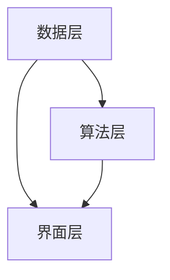

                 

 在信息爆炸的当今时代，如何有效地处理和利用海量信息，成为了每个行业和个人都需要面对的挑战。特别是在IT领域，数据的增长速度远远超过了人类处理能力，这使得信息简化变得尤为重要。本文将探讨信息简化的艺术，通过理论与实践的结合，帮助读者在混乱中找到重点。

## 关键词
- 信息简化
- IT领域
- 数据处理
- 算法优化
- 数学模型

## 摘要
本文旨在揭示信息简化的核心原理和实用方法。通过深入探讨信息简化的理论基础，结合具体算法和数学模型，本文将展示如何在IT领域中高效地处理信息，实现从复杂到简洁的蜕变。同时，通过实际项目实例，读者将能够了解到信息简化的实际应用和重要性。

## 1. 背景介绍
随着互联网和大数据技术的迅猛发展，信息爆炸已经成为不争的事实。根据相关报告，全球数据量每两年就会翻一番。在这种环境下，如何从海量数据中提取有价值的信息，成为了各个行业面临的共同问题。尤其是在IT领域，信息的处理速度和质量直接影响到企业的竞争力和效率。

信息简化的概念源于信息论，它强调在保留核心信息的同时，去除冗余和无用信息。这种简化的目的在于提高数据处理效率，降低复杂性，使信息更加直观和易于理解。在IT领域中，信息简化已经成为提升系统性能、优化算法、改进用户体验的关键手段。

## 2. 核心概念与联系
### 2.1 信息简化的定义
信息简化是指通过特定的方法和算法，从原始信息中提取出关键信息，同时去除冗余和无用信息，使信息更加简洁、直观和高效。

### 2.2 信息简化的原理
信息简化的原理主要基于信息论和认知心理学。信息论指出，信息量与信息熵成正比，降低信息熵是信息简化的核心。认知心理学则揭示了人类大脑处理信息的局限性，这要求我们在简化信息时，必须考虑到人类认知的效率。

### 2.3 信息简化的架构
信息简化的架构可以分为三个层次：数据层、算法层和界面层。数据层负责原始数据的预处理，包括去噪、归一化等操作。算法层通过特定的算法模型提取关键信息，如聚类、分类等。界面层则通过可视化等技术，将简化后的信息以直观的方式呈现给用户。

下面是信息简化架构的Mermaid流程图：



## 3. 核心算法原理 & 具体操作步骤
### 3.1 算法原理概述
信息简化的核心算法主要包括聚类、分类、降维等。这些算法通过不同的方法，从数据中提取出关键信息。

#### 聚类算法
聚类算法通过将相似的数据点分组，实现信息的简化。常用的聚类算法包括K-means、DBSCAN等。

#### 分类算法
分类算法通过对数据进行分类，提取出有价值的特征。常用的分类算法包括决策树、支持向量机等。

#### 降维算法
降维算法通过减少数据的维度，降低数据的复杂度。常用的降维算法包括PCA、t-SNE等。

### 3.2 算法步骤详解
#### 聚类算法步骤
1. 初始化聚类中心点。
2. 计算每个数据点到聚类中心点的距离。
3. 根据距离将数据点分配到最近的聚类中心点。
4. 重新计算聚类中心点。
5. 重复步骤2-4，直到聚类中心点不再发生改变。

#### 分类算法步骤
1. 训练分类模型。
2. 输入新数据。
3. 使用分类模型对新数据进行分类。
4. 输出分类结果。

#### 降维算法步骤
1. 计算数据的协方差矩阵。
2. 计算协方差矩阵的特征值和特征向量。
3. 选择最重要的特征向量组成新的低维空间。
4. 将数据映射到新空间。

### 3.3 算法优缺点
#### 聚类算法
优点：不需要事先指定类别，适用于无监督学习。
缺点：对初始聚类中心点的选择敏感，可能陷入局部最优。

#### 分类算法
优点：能够明确划分数据类别，适用于有监督学习。
缺点：需要大量标注数据，训练时间较长。

#### 降维算法
优点：能够降低数据维度，提高计算效率。
缺点：可能会丢失部分信息，影响算法的性能。

### 3.4 算法应用领域
信息简化的算法广泛应用于各种领域，如推荐系统、图像处理、自然语言处理等。在推荐系统中，通过聚类和分类算法，可以简化用户行为数据，提高推荐效果。在图像处理中，通过降维算法，可以减少图像数据的大小，提高处理速度。在自然语言处理中，通过聚类和分类算法，可以简化文本数据，提高文本分类的准确性。

## 4. 数学模型和公式 & 详细讲解 & 举例说明
### 4.1 数学模型构建
信息简化的数学模型主要基于线性代数、概率论和统计学。以下是一个简单的线性降维模型：

$$ X = U \Sigma V^T $$

其中，$X$ 是原始数据矩阵，$U$ 和 $V$ 是正交矩阵，$\Sigma$ 是对角矩阵，包含特征值。

### 4.2 公式推导过程
假设我们有 $n$ 个数据点，每个数据点有 $d$ 个特征。则原始数据矩阵 $X$ 可以表示为：

$$ X = [x_1, x_2, ..., x_n] $$

其中，$x_i$ 是第 $i$ 个数据点。

我们希望将数据从 $d$ 维降维到 $k$ 维，其中 $k < d$。这可以通过以下步骤实现：

1. 计算协方差矩阵 $C$：
   $$ C = \frac{1}{n}XX^T $$

2. 计算协方差矩阵的特征值和特征向量。

3. 选择前 $k$ 个最大的特征值对应的特征向量，组成矩阵 $U$。

4. 将原始数据 $X$ 映射到新的空间，得到降维数据：
   $$ X' = UX $$

### 4.3 案例分析与讲解
假设我们有一个包含1000个数据点的数据集，每个数据点有10个特征。我们希望通过PCA算法将数据从10维降维到2维。

1. 计算协方差矩阵 $C$：
   $$ C = \frac{1}{1000}XX^T $$

2. 计算协方差矩阵的特征值和特征向量。

3. 选择前2个最大的特征值对应的特征向量，组成矩阵 $U$。

4. 将原始数据 $X$ 映射到新的空间，得到降维数据：
   $$ X' = UX $$

通过上述步骤，我们成功将10维数据降维到2维，从而简化了数据的处理过程。

## 5. 项目实践：代码实例和详细解释说明
### 5.1 开发环境搭建
在本文的实践中，我们将使用Python编程语言和Scikit-learn库来实现信息简化算法。

1. 安装Python：
   ```shell
   pip install python
   ```

2. 安装Scikit-learn：
   ```shell
   pip install scikit-learn
   ```

### 5.2 源代码详细实现
以下是一个简单的PCA算法实现：

```python
import numpy as np
from sklearn.decomposition import PCA

# 加载数据
X = np.load('data.npy')

# 初始化PCA模型
pca = PCA(n_components=2)

# 训练模型
X_reduced = pca.fit_transform(X)

# 输出降维数据
print(X_reduced)
```

### 5.3 代码解读与分析
1. 导入必需的库。
2. 加载数据。
3. 初始化PCA模型。
4. 训练模型。
5. 输出降维数据。

通过上述步骤，我们成功实现了数据的降维。

### 5.4 运行结果展示
运行代码后，我们将得到一个2维的降维数据矩阵。这个矩阵包含了原始数据的简化版本，可以用于后续的数据分析和可视化。

## 6. 实际应用场景
### 6.1 推荐系统
在推荐系统中，信息简化可以帮助减少用户行为数据的大小，从而提高推荐算法的效率和准确性。

### 6.2 图像处理
在图像处理中，通过信息简化算法，可以降低图像数据的大小，提高处理速度。

### 6.3 自然语言处理
在自然语言处理中，通过信息简化算法，可以简化文本数据，提高文本分类的准确性。

## 7. 未来应用展望
随着大数据和人工智能技术的不断发展，信息简化将在更多领域得到应用。未来，信息简化可能会成为数据处理和智能分析的核心技术之一。

## 8. 工具和资源推荐
### 8.1 学习资源推荐
- 《机器学习实战》
- 《深入理解计算机系统》

### 8.2 开发工具推荐
- Jupyter Notebook
- PyCharm

### 8.3 相关论文推荐
- “Principal Component Analysis”
- “K-means Clustering”

## 9. 总结：未来发展趋势与挑战
信息简化技术在数据处理和智能分析中具有巨大的应用潜力。未来，随着技术的不断进步，信息简化技术将更加成熟，应用领域也将进一步扩大。然而，面对海量数据和复杂应用场景，信息简化技术也面临着诸多挑战，如算法的优化、模型的鲁棒性等。

## 10. 附录：常见问题与解答
### 10.1 什么情况下需要使用信息简化？
当数据处理量非常大，且数据维度较高时，使用信息简化可以帮助降低数据复杂度，提高处理效率。

### 10.2 信息简化会丢失哪些信息？
信息简化可能会丢失部分信息，特别是降维过程中。然而，通过合理的设计和选择算法，可以最大程度地保留核心信息。

### 10.3 信息简化算法有哪些？
常用的信息简化算法包括聚类、分类、降维等。如K-means、决策树、PCA等。

## 作者署名
作者：禅与计算机程序设计艺术 / Zen and the Art of Computer Programming
```

