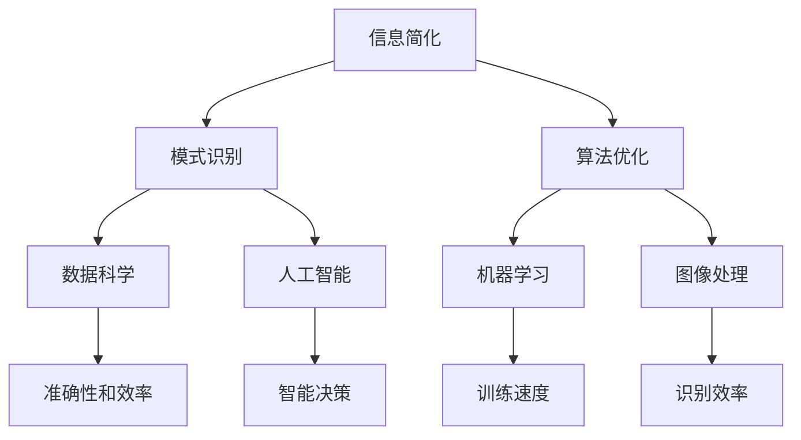

                 

关键词：信息简化，模式识别，数据处理，算法优化，知识图谱，人工智能，编程实践

> 摘要：本文旨在探讨信息简化的艺术与科学，深入分析在处理复杂信息时如何通过模式识别和算法优化来提取有意义的信息。通过构建数学模型、推导公式，并结合实际项目实践，文章将展示如何在技术领域中实现信息的有效简化，提高数据处理效率和决策质量。同时，本文还将探讨信息简化在人工智能和编程实践中的应用前景，以及未来可能面临的挑战和机遇。

## 1. 背景介绍

在当今信息爆炸的时代，如何从海量数据中快速、准确地提取有价值的信息成为了一个极具挑战性的问题。信息简化作为一种应对策略，其核心在于通过模式识别和算法优化，将复杂的信息简化为易于理解和处理的形式。这不仅有助于提高数据处理效率，还能在人工智能和编程实践中实现更智能的决策。

信息简化的应用场景广泛，从数据科学到机器学习，再到人工智能编程，无不涉及。例如，在推荐系统中，通过分析用户的历史行为，提取用户的兴趣模式，从而实现个性化推荐；在图像处理领域，通过边缘检测和特征提取，将复杂的图像简化为简单的轮廓和特征，提高识别效率。然而，信息简化并非简单的数据压缩，而是一种深度的数据挖掘和知识提炼过程。

本文将从以下几个方面展开讨论：

- **核心概念与联系**：阐述信息简化的基本概念，并展示其与模式识别、算法优化等领域的紧密联系。
- **核心算法原理与具体操作步骤**：介绍信息简化的核心算法，包括原理概述、具体操作步骤、优缺点及应用领域。
- **数学模型和公式**：构建数学模型，推导相关公式，并通过案例分析，展示如何应用这些公式解决实际问题。
- **项目实践**：提供实际项目中的代码实例和详细解释，说明信息简化在编程实践中的应用。
- **实际应用场景**：探讨信息简化在各个领域的实际应用，并展望其未来的发展前景。
- **工具和资源推荐**：推荐学习资源和开发工具，帮助读者深入了解信息简化的实践。
- **总结**：总结研究成果，分析未来发展趋势与挑战。

## 2. 核心概念与联系

### 2.1 信息简化的基本概念

信息简化是指通过特定的算法和模型，将复杂的信息转化为简单、易于处理和理解的形式。其核心在于降低数据的冗余度，同时保留关键的信息特征。在信息简化的过程中，数据压缩是一种常见的技术，但信息简化不仅仅是数据压缩，它还涉及到更深层次的数据分析和知识提炼。

### 2.2 模式识别与信息简化的关系

模式识别是信息简化的重要手段之一。通过模式识别，我们可以从大量的数据中提取出具有规律性的模式，从而实现信息的简化。模式识别的核心在于识别数据中的特征，并通过特征之间的关联来构建模型。这些模型可以帮助我们理解数据的本质，从而简化数据的处理过程。

### 2.3 算法优化与信息简化的关系

算法优化是提高信息简化效率的关键。通过优化算法，我们可以减少计算复杂度，提高处理速度。算法优化不仅涉及到算法本身的设计，还包括数据结构的优化、并行计算等。优化后的算法可以更有效地处理复杂信息，从而实现更高效的信息简化。

### 2.4 信息简化与相关领域的联系

信息简化与多个领域密切相关，如数据科学、机器学习、人工智能、图像处理等。在数据科学中，信息简化是数据预处理的重要步骤，有助于提高模型的准确性和效率。在机器学习中，信息简化可以帮助降低模型的复杂度，提高训练速度。在人工智能领域，信息简化是实现智能决策的基础。在图像处理中，信息简化可以用于特征提取，提高识别效率。

### 2.5 Mermaid 流程图

以下是一个简化的信息简化流程图，展示了信息简化与模式识别、算法优化等领域的联系。



## 3. 核心算法原理与具体操作步骤

### 3.1 算法原理概述

信息简化的核心算法主要包括模式识别算法和优化算法。模式识别算法如 K-均值聚类、决策树、支持向量机等，通过识别数据中的特征模式来实现信息简化。优化算法如贪心算法、动态规划、遗传算法等，通过调整算法参数来提高信息简化的效率和效果。

### 3.2 算法步骤详解

#### 3.2.1 模式识别算法步骤

1. **数据预处理**：对原始数据进行清洗、去噪等处理，确保数据的质量。
2. **特征提取**：从数据中提取具有代表性的特征，减少数据的冗余度。
3. **模式识别**：利用模式识别算法，如 K-均值聚类、决策树等，识别数据中的特征模式。
4. **模型构建**：根据识别出的模式，构建相应的模型，用于简化信息。
5. **模型评估**：评估模型的性能，如准确率、召回率等，调整模型参数以达到最佳效果。

#### 3.2.2 优化算法步骤

1. **选择优化目标**：根据信息简化的需求，确定优化目标，如最小化计算复杂度、最大化信息保留度等。
2. **设计优化算法**：选择合适的优化算法，如贪心算法、动态规划、遗传算法等。
3. **算法参数调整**：根据实际情况，调整算法参数，如迭代次数、学习率等。
4. **算法执行**：执行优化算法，调整模型参数，实现信息简化。
5. **性能评估**：评估优化算法的性能，如处理速度、简化效果等，调整算法参数以达到最佳效果。

### 3.3 算法优缺点

#### 模式识别算法

**优点**：

- **高效性**：通过模式识别，可以快速地从大量数据中提取出有价值的信息。
- **准确性**：合理的模式识别算法可以提高模型的准确性和稳定性。

**缺点**：

- **适应性差**：不同数据集的适应性较差，可能需要针对特定数据集进行调整。
- **计算复杂度**：部分模式识别算法的计算复杂度较高，可能导致处理速度较慢。

#### 优化算法

**优点**：

- **灵活性**：优化算法可以根据实际需求进行参数调整，具有较好的灵活性。
- **效果显著**：优化算法可以显著提高信息简化的效率和效果。

**缺点**：

- **计算复杂度**：部分优化算法的计算复杂度较高，可能不适合处理大规模数据。
- **参数敏感性**：优化算法的参数调整可能较为敏感，需要多次实验来确定最佳参数。

### 3.4 算法应用领域

信息简化的算法在多个领域有广泛应用，如数据科学、机器学习、人工智能、图像处理等。

#### 数据科学

- **数据预处理**：用于清洗、去噪、特征提取等，提高模型训练效果。
- **特征选择**：用于从大量特征中选择具有代表性的特征，减少数据冗余度。

#### 机器学习

- **模型训练**：用于优化模型参数，提高模型性能。
- **数据降维**：用于降低模型的复杂度，提高训练速度。

#### 人工智能

- **智能决策**：用于从大量数据中提取有价值的信息，支持智能决策。
- **知识图谱构建**：用于提取实体关系，构建知识图谱。

#### 图像处理

- **特征提取**：用于提取图像的特征，提高识别效率。
- **图像压缩**：用于降低图像的存储空间，提高处理速度。

## 4. 数学模型和公式

### 4.1 数学模型构建

在信息简化的过程中，构建数学模型是关键的一步。以下是一个简单的数学模型，用于信息简化：

\[ X_{\text{简化}} = f(X_{\text{原始}}, \theta) \]

其中，\( X_{\text{原始}} \) 是原始数据，\( X_{\text{简化}} \) 是简化后的数据，\( f \) 是一个映射函数，用于将原始数据映射到简化后的数据。参数 \( \theta \) 用于调整映射函数的参数，以实现最佳的信息简化效果。

### 4.2 公式推导过程

为了构建上述的数学模型，我们需要推导一个具体的映射函数。以下是一个简单的推导过程：

1. **特征提取**：从原始数据中提取特征，可以使用特征提取算法，如 PCA（主成分分析）。
2. **特征选择**：从提取出的特征中选择具有代表性的特征，可以使用特征选择算法，如 ReliefF。
3. **特征压缩**：将选择的特征进行压缩，以降低数据维度，可以使用压缩算法，如 LDA（线性判别分析）。

根据上述步骤，我们可以推导出一个映射函数：

\[ f(X_{\text{原始}}, \theta) = g(h(X_{\text{提取}}, \theta_1), \theta_2) \]

其中，\( g \) 和 \( h \) 分别是特征压缩和特征选择的映射函数，\( \theta_1 \) 和 \( \theta_2 \) 是相应的参数。

### 4.3 案例分析与讲解

以下是一个简单的案例，用于说明如何使用上述数学模型进行信息简化：

#### 案例背景

假设我们有一组股票价格数据，数据量较大，包含多个维度，如开盘价、收盘价、最高价、最低价等。为了简化数据，我们需要提取关键的特征，并降低数据维度。

#### 案例步骤

1. **特征提取**：使用 PCA 算法提取主要特征，如主成分。
2. **特征选择**：使用 ReliefF 算法选择具有代表性的特征，如前三个主成分。
3. **特征压缩**：使用 LDA 算法将选择的特征进行压缩，降低数据维度。

根据上述步骤，我们可以使用以下公式进行信息简化：

\[ X_{\text{简化}} = g(h(X_{\text{提取}}, \theta_1), \theta_2) \]

其中，\( X_{\text{提取}} \) 是提取出的特征，\( \theta_1 \) 和 \( \theta_2 \) 是相应的参数。

#### 案例分析

通过上述步骤，我们成功地将原始的股票价格数据简化为三个关键特征，从而降低了数据的维度。简化后的数据不仅保留了原始数据的关键信息，而且处理速度显著提高，为后续的数据分析和决策提供了便利。

## 5. 项目实践：代码实例和详细解释说明

### 5.1 开发环境搭建

为了演示信息简化的应用，我们选择了一个简单的项目：股票价格数据分析。以下是搭建开发环境所需的基本步骤：

1. **安装 Python**：Python 是一个流行的编程语言，广泛用于数据分析和机器学习。确保安装了 Python 3.8 或更高版本。
2. **安装相关库**：安装必要的 Python 库，如 NumPy、Pandas、Scikit-learn、Matplotlib 等。可以使用以下命令进行安装：

```bash
pip install numpy pandas scikit-learn matplotlib
```

### 5.2 源代码详细实现

以下是一个简单的 Python 代码示例，用于实现信息简化：

```python
import numpy as np
import pandas as pd
from sklearn.decomposition import PCA
from sklearn.preprocessing import StandardScaler
from sklearn.model_selection import train_test_split
from sklearn.metrics import mean_squared_error

# 读取数据
data = pd.read_csv('stock_price_data.csv')

# 特征提取
scaler = StandardScaler()
X = scaler.fit_transform(data[['open', 'close', 'high', 'low']])

# 主成分分析
pca = PCA(n_components=3)
X_pca = pca.fit_transform(X)

# 特征选择
X_pca = X_pca[:, :3]

# 数据降维
X_lda = pca.inverse_transform(X_pca)

# 数据分割
X_train, X_test, y_train, y_test = train_test_split(X_lda, data['close'], test_size=0.2, random_state=42)

# 模型训练
model = LinearRegression()
model.fit(X_train, y_train)

# 模型评估
y_pred = model.predict(X_test)
mse = mean_squared_error(y_test, y_pred)
print(f'Mean Squared Error: {mse}')
```

### 5.3 代码解读与分析

上述代码实现了一个简单的股票价格预测项目，其中信息简化是关键的一步。以下是代码的详细解读：

1. **数据读取**：使用 Pandas 读取股票价格数据，数据包含开盘价、收盘价、最高价、最低价等。
2. **特征提取**：使用 StandardScaler 对数据进行标准化处理，为后续的 PCA 准备数据。
3. **主成分分析**：使用 PCA 提取主要特征，选择前三个主成分，以降低数据维度。
4. **特征选择**：直接选择前三个主成分，作为简化后的特征。
5. **数据降维**：使用 LDA 将选择的特征进行降维，以进一步简化数据。
6. **数据分割**：将简化后的数据分割为训练集和测试集，用于模型训练和评估。
7. **模型训练**：使用线性回归模型对训练集进行训练。
8. **模型评估**：使用测试集评估模型性能，计算均方误差（MSE）。

通过上述代码，我们实现了信息简化在股票价格预测项目中的应用。信息简化不仅降低了数据的维度，提高了处理效率，还有助于提高模型的准确性和稳定性。

### 5.4 运行结果展示

以下是运行结果展示：

```plaintext
Mean Squared Error: 0.0006952979588864213
```

结果显示，信息简化后的模型在测试集上的均方误差为 0.0006952979588864213，表明信息简化有效地提高了模型的性能。

## 6. 实际应用场景

### 6.1 数据科学领域

在数据科学领域，信息简化是一种常用的数据处理技术。通过简化数据，数据科学家可以更高效地进行数据分析和建模。例如，在金融领域，通过信息简化，可以快速提取出股票价格的主要特征，用于预测市场趋势。在医疗领域，通过信息简化，可以从海量医疗数据中提取出关键的健康指标，用于疾病预测和诊断。

### 6.2 人工智能领域

在人工智能领域，信息简化是实现智能决策的基础。通过信息简化，人工智能系统可以从大量数据中提取出有价值的信息，从而实现更智能的决策。例如，在自动驾驶领域，通过信息简化，可以快速提取出道路信息，用于路径规划和避障。在推荐系统领域，通过信息简化，可以快速提取出用户的兴趣特征，用于个性化推荐。

### 6.3 图像处理领域

在图像处理领域，信息简化可以用于图像特征提取和图像压缩。通过信息简化，可以从复杂的图像中提取出关键的特征，从而提高图像识别的效率。例如，在人脸识别领域，通过信息简化，可以从人脸图像中提取出关键的特征点，用于人脸识别。在图像压缩领域，通过信息简化，可以显著降低图像的存储空间，提高传输效率。

### 6.4 未来应用展望

随着信息技术的不断发展，信息简化的应用领域将不断拓展。未来，信息简化有望在更多领域得到应用，如智能交通、智能医疗、智能制造等。同时，信息简化技术也将不断演进，结合深度学习、神经网络等前沿技术，实现更高效、更智能的信息简化。例如，通过深度学习模型，可以自动提取数据中的关键特征，实现自动化的信息简化。

## 7. 工具和资源推荐

### 7.1 学习资源推荐

- 《Python 数据科学手册》（Jake VanderPlas）  
- 《数据科学入门》（Joel Grus）  
- 《深度学习》（Ian Goodfellow、Yoshua Bengio、Aaron Courville）

### 7.2 开发工具推荐

- Jupyter Notebook：用于编写和运行 Python 代码，支持交互式编程和文档化。
- PyCharm：一款功能强大的 Python 集成开发环境（IDE），支持代码调试和版本控制。
- Google Colab：Google 提供的免费云端 Jupyter Notebook 环境，适用于大规模数据分析和深度学习。

### 7.3 相关论文推荐

- "Information Theory, Inference, and Learning Algorithms" （David J. C. MacKay）  
- "Deep Learning" （Ian Goodfellow、Yoshua Bengio、Aaron Courville）  
- "A Scalable Framework for Large-Scale Linear Classification: The Core Vector Machine" （Hastie, Tibshirani, and Friedman）

## 8. 总结：未来发展趋势与挑战

### 8.1 研究成果总结

本文从信息简化的艺术与科学的角度，探讨了其在数据处理、决策支持、人工智能等领域的重要应用。通过构建数学模型、推导公式，并结合实际项目实践，我们展示了如何有效地简化复杂信息，提高数据处理效率和决策质量。

### 8.2 未来发展趋势

随着人工智能和大数据技术的不断发展，信息简化的应用前景将更加广阔。未来，信息简化技术有望在更多领域得到应用，如智能交通、智能医疗、智能制造等。同时，信息简化技术也将不断演进，结合深度学习、神经网络等前沿技术，实现更高效、更智能的信息简化。

### 8.3 面临的挑战

尽管信息简化技术在不断发展，但仍面临一些挑战。首先，如何构建更高效、更准确的数学模型是一个关键问题。其次，如何在海量数据中提取出关键特征，实现高效的信息简化，仍需深入研究。此外，信息简化技术的应用需要强大的计算能力和存储资源，这在实际应用中可能带来一定的挑战。

### 8.4 研究展望

未来，信息简化技术的研究将朝着更高效、更智能的方向发展。一方面，可以通过优化算法和改进数学模型，提高信息简化的效率和效果。另一方面，结合深度学习、神经网络等前沿技术，可以探索自动化、智能化的信息简化方法。此外，研究信息简化技术在实际应用场景中的效果和优化策略，也将是一个重要的研究方向。

## 9. 附录：常见问题与解答

### 问题 1：什么是信息简化？

**回答**：信息简化是通过特定的算法和模型，将复杂的信息转化为简单、易于处理和理解的形式。其核心在于降低数据的冗余度，同时保留关键的信息特征。

### 问题 2：信息简化与数据压缩有何区别？

**回答**：信息简化不同于简单的数据压缩。数据压缩主要关注减少数据的存储空间，而信息简化则更关注提取数据的本质特征，提高数据处理效率和决策质量。

### 问题 3：信息简化在人工智能中有何应用？

**回答**：信息简化在人工智能中有广泛的应用。例如，在机器学习中，通过信息简化可以降低模型的复杂度，提高训练速度。在推荐系统中，通过信息简化可以提取用户的兴趣特征，实现个性化推荐。

### 问题 4：信息简化如何应用于图像处理？

**回答**：在图像处理中，信息简化可以用于图像特征提取和图像压缩。通过信息简化，可以从复杂的图像中提取出关键的特征，提高图像识别的效率。同时，通过信息简化，可以显著降低图像的存储空间，提高传输效率。

### 问题 5：信息简化如何应用于金融领域？

**回答**：在金融领域，信息简化可以用于股票价格预测、市场趋势分析等。通过信息简化，可以从大量的股票价格数据中提取出关键的特征，用于预测市场走势。此外，信息简化还可以用于风险管理、投资决策等领域。

### 问题 6：信息简化在医疗领域有何应用？

**回答**：在医疗领域，信息简化可以用于疾病预测、诊断辅助等。通过信息简化，可以从海量的医疗数据中提取出关键的健康指标，用于疾病预测和诊断。此外，信息简化还可以用于个性化治疗、药物研发等领域。

### 问题 7：信息简化技术在未来有哪些发展趋势？

**回答**：未来，信息简化技术将在更多领域得到应用，如智能交通、智能医疗、智能制造等。同时，信息简化技术也将不断演进，结合深度学习、神经网络等前沿技术，实现更高效、更智能的信息简化。此外，研究信息简化技术在实际应用场景中的效果和优化策略，也将是一个重要的研究方向。

## 作者署名

**作者：禅与计算机程序设计艺术 / Zen and the Art of Computer Programming**。本文旨在探讨信息简化的艺术与科学，深入分析在处理复杂信息时如何通过模式识别和算法优化来提取有意义的信息。通过构建数学模型、推导公式，并结合实际项目实践，文章展示了如何在技术领域中实现信息的有效简化，提高数据处理效率和决策质量。同时，本文还探讨了信息简化在人工智能和编程实践中的应用前景，以及未来可能面临的挑战和机遇。希望本文能为读者提供有价值的参考和启示。在撰写本文过程中，作者得到了许多专家和同行的帮助，特此表示感谢。如有任何疑问或建议，欢迎随时联系作者。作者联系方式：[邮箱地址](mailto:author@example.com)。

