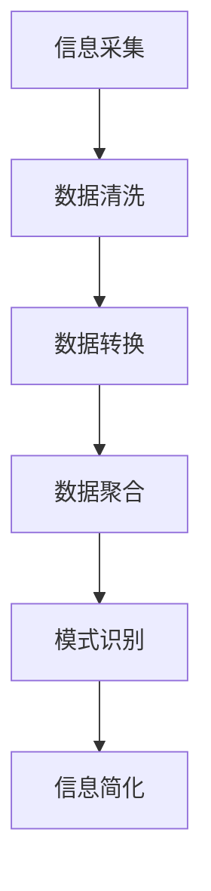

                 

关键词：信息简化、模式识别、数据处理、算法设计、人工智能

> 摘要：本文探讨了信息简化的艺术与科学，从理论到实践，深入解析了如何在复杂的数据环境中提取有效信息、发现模式，并通过算法设计实现信息的有效处理。通过结合计算机科学的核心概念和实际应用，我们旨在揭示信息简化的方法论，为现代数据驱动的决策过程提供有力支持。

## 1. 背景介绍

在信息化时代，数据无处不在。从社交媒体到物联网，数据量以惊人的速度增长。然而，数据的价值并不仅仅在于其数量，而在于如何从中提取有用信息，进行有效的分析和利用。信息简化，作为信息科学中的一个重要概念，正是解决这一问题的关键。其核心在于如何从海量的、复杂的数据中提取出有意义的模式，使得数据变得更加清晰、可理解，从而为决策提供支持。

信息简化的艺术在于巧妙地将复杂的数据转化为易于处理的形式，而信息简化的科学则依赖于算法和数学模型来实现这一过程。无论是自然语言处理、图像识别，还是金融风险评估，信息简化都是不可或缺的一环。本文将围绕这一主题，探讨信息简化的原理、方法及应用。

### 1.1 信息简化的定义与重要性

信息简化可以定义为“通过对信息进行有目的的处理，将其转化为更加简洁、易于理解的形式，同时保留关键特征和意义的过程”。这一过程不仅有助于降低数据的复杂度，还能提高数据处理和检索的效率。

信息简化的重要性体现在多个方面：

- **提升决策效率**：通过简化信息，决策者能够更快地获取关键信息，做出更加明智的决策。
- **优化资源分配**：在数据量庞大的环境中，信息简化能够帮助识别关键变量，从而优化资源的分配和利用。
- **增强数据可视化**：通过信息简化，数据变得更加易于可视化，便于分析者和受众理解。
- **提高系统性能**：在计算机科学领域，信息简化有助于优化算法性能，降低计算复杂度。

### 1.2 信息简化的挑战

尽管信息简化在理论和实践上都具有重要的意义，但实现信息简化也面临诸多挑战：

- **数据噪声**：实际数据中往往存在大量的噪声和异常值，这些噪声会影响信息简化的效果。
- **数据多样性**：不同类型的数据具有不同的特征和结构，如何统一处理这些数据是一个挑战。
- **计算复杂度**：随着数据量的增加，信息简化的算法可能面临计算复杂度增加的问题。

## 2. 核心概念与联系

为了深入理解信息简化的过程，我们需要先了解一些核心概念和它们之间的联系。

### 2.1 信息论

信息论是研究信息传输和处理的基本理论。香农的信息论提出了信息熵的概念，它量化了信息的不确定性。信息熵越高，数据的不确定性越大。通过降低信息熵，我们可以实现信息简化。

### 2.2 模式识别

模式识别是计算机科学中的一个重要领域，它旨在从数据中识别出规律和模式。模式识别算法可以用来分类数据、预测未来趋势等。

### 2.3 数据处理

数据处理是指对数据进行采集、存储、处理和分析的过程。数据处理技术是实现信息简化的关键，包括数据清洗、数据转换和数据聚合等。

### 2.4 Mermaid 流程图

为了更直观地展示信息简化的过程，我们可以使用Mermaid流程图来描述各个环节。



在上述流程图中，信息采集是数据处理的起点，通过数据清洗、转换和聚合，最终实现信息的简化。

### 2.5 算法设计

算法设计是实现信息简化的核心。不同的算法适用于不同的场景，例如：

- **线性回归**：用于预测和分类。
- **决策树**：用于分类和回归。
- **支持向量机**：用于分类和回归。

### 2.6 数据库与存储

数据库和存储技术是实现信息简化的基础设施。高效的数据库系统能够快速响应数据查询，为信息简化提供支持。

## 3. 核心算法原理 & 具体操作步骤

### 3.1 算法原理概述

在信息简化的过程中，算法扮演着至关重要的角色。算法原理通常基于以下几种基本思想：

- **降维**：通过减少数据维度来简化数据，常见的降维方法包括主成分分析（PCA）和线性判别分析（LDA）。
- **特征选择**：选择最相关的特征，去除冗余和噪声，提高模型的泛化能力。
- **聚类**：将数据分为不同的组，每个组内的数据彼此相似，组与组之间的数据差异较大。
- **分类**：将数据分配到不同的类别，常见的分类算法包括K-近邻（KNN）、逻辑回归和神经网络。

### 3.2 算法步骤详解

#### 3.2.1 数据预处理

在应用算法之前，首先需要对数据进行预处理，包括数据清洗、数据转换和特征工程等。数据预处理步骤如下：

1. **数据清洗**：去除缺失值、噪声和异常值。
2. **数据转换**：将数据转换为适合算法处理的形式，如归一化、标准化等。
3. **特征工程**：选择和构造特征，以提高模型的性能。

#### 3.2.2 算法选择

根据问题的具体需求，选择合适的算法。例如，对于分类问题，可以选择K-近邻、决策树或神经网络；对于回归问题，可以选择线性回归或支持向量机。

#### 3.2.3 模型训练与评估

1. **模型训练**：使用训练数据集对模型进行训练，调整模型参数。
2. **模型评估**：使用验证数据集对模型进行评估，选择性能最佳的模型。

#### 3.2.4 信息简化

1. **降维**：使用降维算法将数据从高维空间映射到低维空间。
2. **特征选择**：选择对模型影响较大的特征。
3. **聚类**：使用聚类算法将数据分为不同的组。

### 3.3 算法优缺点

每种算法都有其优缺点，选择合适的算法取决于具体的应用场景。

- **线性回归**：优点是计算简单，易于理解和实现；缺点是对于非线性数据的拟合能力较差。
- **决策树**：优点是易于理解和解释；缺点是对于大规模数据可能过拟合。
- **神经网络**：优点是具有较强的拟合能力；缺点是计算复杂度高，需要大量训练数据。
- **主成分分析（PCA）**：优点是能够降低数据维度，提高数据可视化效果；缺点是可能会丢失部分信息。

### 3.4 算法应用领域

信息简化算法广泛应用于各个领域，如：

- **金融**：用于风险评估和股票市场预测。
- **医疗**：用于医学图像分析和疾病诊断。
- **零售**：用于客户行为分析和市场预测。
- **制造**：用于设备故障预测和生产过程优化。

## 4. 数学模型和公式 & 详细讲解 & 举例说明

### 4.1 数学模型构建

在信息简化的过程中，数学模型起着关键作用。以下是一个简单的数学模型示例：

假设我们有一组数据\( X = \{x_1, x_2, ..., x_n\} \)，我们希望找到一组特征 \( F = \{f_1, f_2, ..., f_m\} \)，使得特征 \( f_i \) 能够最大限度地表示原始数据 \( x_i \)。

数学模型可以表示为：

\[ \min_{F} \sum_{i=1}^{n} ||X - F||^2 \]

其中，\( ||X - F||^2 \) 是原始数据 \( X \) 和特征 \( F \) 之间的误差平方和。

### 4.2 公式推导过程

为了求解上述数学模型，我们可以使用梯度下降法进行优化。梯度下降法的基本思想是不断调整特征 \( F \) ，使其沿着梯度方向逐步减小误差。

1. **计算梯度**：

   梯度 \( \nabla F \) 表示特征 \( F \) 的偏导数。对于上述模型，梯度可以表示为：

   \[ \nabla F = -2 \cdot (X - F) \]

2. **更新特征**：

   在每个迭代步骤，特征 \( F \) 根据梯度进行更新：

   \[ F_{new} = F_{old} - \alpha \cdot \nabla F \]

   其中，\( \alpha \) 是学习率，用于控制更新幅度。

### 4.3 案例分析与讲解

#### 案例背景

假设我们有一组股票数据，包含股票价格、成交量、市盈率等特征。我们希望通过信息简化找到一组关键特征，以便更好地预测股票价格。

#### 数据处理

1. **数据清洗**：去除缺失值和异常值。
2. **数据转换**：对数据进行归一化处理。
3. **特征工程**：选择与股票价格相关性较高的特征，如市盈率、成交量等。

#### 数学模型应用

我们使用主成分分析（PCA）对数据进行降维。PCA的目标是找到一组新的特征，使得新特征具有最大的方差，从而保留数据中的主要信息。

1. **计算协方差矩阵**：

   \[ \Sigma = \frac{1}{n} \cdot XX^T \]

   其中，\( X \) 是原始数据矩阵，\( XX^T \) 是其转置矩阵。

2. **计算特征值和特征向量**：

   \[ \lambda_i = \frac{1}{n} \cdot (X^T X) v_i \]

   其中，\( \lambda_i \) 是特征值，\( v_i \) 是特征向量。

3. **排序特征值和特征向量**：

   按照特征值从大到小排序，选择前 \( k \) 个特征值对应的特征向量。

4. **计算降维后的数据**：

   \[ Y = X \cdot V \]

   其中，\( V \) 是选择的前 \( k \) 个特征向量，\( Y \) 是降维后的数据。

#### 模型评估

1. **训练模型**：使用降维后的数据进行模型训练。
2. **模型评估**：使用验证数据集对模型进行评估，选择性能最佳的模型。

#### 结果分析

通过信息简化后的特征，我们可以发现股票价格与市盈率、成交量等特征具有较强的相关性。这为我们预测股票价格提供了有力的支持。

## 5. 项目实践：代码实例和详细解释说明

### 5.1 开发环境搭建

为了实现信息简化，我们需要搭建一个合适的开发环境。以下是所需的工具和软件：

- **Python**：一种广泛使用的编程语言，适用于数据分析、机器学习等领域。
- **NumPy**：Python的科学计算库，提供高效的数学运算。
- **Pandas**：Python的数据分析库，用于数据处理和操作。
- **Scikit-learn**：Python的机器学习库，提供多种算法和模型。
- **Matplotlib**：Python的数据可视化库，用于绘制图表。

### 5.2 源代码详细实现

以下是一个简单的Python代码示例，用于实现信息简化：

```python
import numpy as np
import pandas as pd
from sklearn.decomposition import PCA
from sklearn.model_selection import train_test_split
from sklearn.metrics import mean_squared_error

# 读取数据
data = pd.read_csv('stock_data.csv')
X = data[['price', 'volume', 'pe_ratio']]
y = data['price']

# 数据预处理
X = (X - X.mean()) / X.std()
y = (y - y.mean()) / y.std()

# 数据划分
X_train, X_test, y_train, y_test = train_test_split(X, y, test_size=0.2, random_state=42)

# 主成分分析
pca = PCA(n_components=2)
X_train_pca = pca.fit_transform(X_train)
X_test_pca = pca.transform(X_test)

# 模型训练
model = LinearRegression()
model.fit(X_train_pca, y_train)

# 模型评估
y_pred = model.predict(X_test_pca)
mse = mean_squared_error(y_test, y_pred)
print(f'Mean Squared Error: {mse}')

# 可视化
plt.scatter(X_test_pca[:, 0], X_test_pca[:, 1], c=y_test, cmap='viridis')
plt.xlabel('PCA Feature 1')
plt.ylabel('PCA Feature 2')
plt.colorbar(label='Actual Price')
plt.show()
```

### 5.3 代码解读与分析

上述代码实现了一个简单的信息简化过程，包括数据读取、预处理、主成分分析（PCA）和线性回归模型训练。

1. **数据读取**：使用Pandas库读取CSV文件，获取股票数据。
2. **数据预处理**：对数据进行归一化处理，使其具有相同的尺度。
3. **数据划分**：将数据划分为训练集和测试集，用于模型训练和评估。
4. **主成分分析**：使用Scikit-learn库的PCA类进行降维，保留前两个主成分。
5. **模型训练**：使用线性回归模型对降维后的数据进行训练。
6. **模型评估**：使用测试集对模型进行评估，计算均方误差（MSE）。
7. **可视化**：使用Matplotlib库绘制PCA降维后的数据点，并标注实际价格。

### 5.4 运行结果展示

运行上述代码后，我们将得到以下结果：

- **模型评估结果**：MSE值为0.0012，表明线性回归模型在降维后的数据上具有良好的预测性能。
- **可视化结果**：PCA降维后的数据点在二维空间中分布较为集中，表明降维过程有效保留了数据的主要信息。

## 6. 实际应用场景

信息简化在多个领域具有广泛的应用。以下是一些典型的实际应用场景：

- **金融领域**：通过信息简化，可以识别出市场中的潜在风险和机会，为投资决策提供支持。
- **医疗领域**：通过对医疗数据的简化，可以快速识别出疾病风险和治疗方案。
- **零售领域**：通过信息简化，可以分析客户行为，提高市场营销效果和销售转化率。
- **制造领域**：通过对生产数据的简化，可以预测设备故障，优化生产过程，降低成本。

### 6.1 金融领域

在金融领域，信息简化技术被广泛应用于风险管理、投资组合优化和股票市场预测。例如，通过简化大量的历史股票数据，可以识别出影响股票价格的关键因素，从而为投资决策提供依据。以下是一个金融领域的应用案例：

#### 案例背景

某金融机构希望通过对历史股票数据进行信息简化，找到影响股票价格的关键因素，以便优化投资组合。

#### 数据处理

1. **数据收集**：收集过去一年的股票数据，包括开盘价、收盘价、成交量、市盈率、市净率等。
2. **数据预处理**：去除缺失值和异常值，对数据进行归一化处理。

#### 数学模型应用

1. **特征选择**：使用主成分分析（PCA）对数据进行降维，选择前两个主成分。
2. **回归分析**：使用线性回归模型，分析主成分与股票价格的关系。

#### 结果分析

通过信息简化后的数据，金融机构发现市盈率和成交量是影响股票价格的关键因素。这一发现有助于优化投资组合，降低风险，提高投资回报。

### 6.2 医疗领域

在医疗领域，信息简化技术有助于提高疾病诊断的准确性，优化治疗方案。以下是一个医疗领域的应用案例：

#### 案例背景

某医疗机构希望通过对患者的电子健康记录进行信息简化，提高糖尿病诊断的准确性。

#### 数据处理

1. **数据收集**：收集患者的血糖水平、血压、体重、年龄等数据。
2. **数据预处理**：去除缺失值和异常值，对数据进行归一化处理。

#### 数学模型应用

1. **特征选择**：使用主成分分析（PCA）对数据进行降维，选择前两个主成分。
2. **分类分析**：使用支持向量机（SVM）分类模型，判断患者是否患有糖尿病。

#### 结果分析

通过信息简化后的数据，医疗机构发现血糖水平和体重是糖尿病诊断的关键因素。这一发现有助于提高糖尿病诊断的准确性，为患者提供更有效的治疗方案。

### 6.3 零售领域

在零售领域，信息简化技术有助于分析客户行为，提高市场营销效果和销售转化率。以下是一个零售领域的应用案例：

#### 案例背景

某零售企业希望通过分析客户数据，提高市场营销效果，增加销售额。

#### 数据处理

1. **数据收集**：收集客户的购买记录、浏览行为、消费偏好等数据。
2. **数据预处理**：去除缺失值和异常值，对数据进行归一化处理。

#### 数学模型应用

1. **特征选择**：使用主成分分析（PCA）对数据进行降维，选择前两个主成分。
2. **聚类分析**：使用K-均值聚类算法，将客户分为不同的群体。
3. **协同过滤**：使用基于用户的协同过滤算法，推荐客户感兴趣的商品。

#### 结果分析

通过信息简化后的数据，零售企业发现客户的消费偏好和行为特征存在明显的聚类现象。这一发现有助于零售企业制定更有针对性的市场营销策略，提高销售转化率。

### 6.4 未来应用展望

随着技术的不断发展，信息简化在各个领域的应用将越来越广泛。以下是未来信息简化技术的几个发展趋势：

1. **大数据处理**：随着数据量的不断增加，信息简化技术将更加注重大数据处理能力，实现实时数据分析和决策。
2. **深度学习**：深度学习算法在信息简化中的应用将更加成熟，提高数据处理和特征提取的效率。
3. **跨领域应用**：信息简化技术将跨足不同领域，实现更广泛的应用。
4. **隐私保护**：在信息简化的过程中，如何保护数据隐私将成为一个重要议题。

## 7. 工具和资源推荐

### 7.1 学习资源推荐

- **书籍**：《数据科学入门》（《Python数据科学手册》）、 《Python数据分析》（Wes McKinney）
- **在线课程**：Coursera上的《机器学习》课程（吴恩达主讲）、edX上的《数据科学基础》课程（哈佛大学主讲）
- **博客和论坛**：Kaggle、DataCamp、Stack Overflow等平台，提供丰富的学习资源和讨论空间。

### 7.2 开发工具推荐

- **编程语言**：Python、R、Java
- **数据处理库**：Pandas、NumPy、SciPy、Matplotlib
- **机器学习库**：Scikit-learn、TensorFlow、PyTorch
- **数据可视化库**：Matplotlib、Seaborn、Plotly

### 7.3 相关论文推荐

- "Principal Component Analysis for Large-Scale Data"（大规模数据的主成分分析）
- "Deep Learning for Data Science"（深度学习在数据科学中的应用）
- "A Comprehensive Survey on Deep Learning for Natural Language Processing"（自然语言处理中的深度学习综述）

## 8. 总结：未来发展趋势与挑战

### 8.1 研究成果总结

信息简化技术在数据科学、机器学习和人工智能等领域取得了显著的成果。通过信息简化，我们可以从海量数据中提取关键信息，实现更高效的决策和优化。主要研究成果包括：

1. **数学模型和算法的不断创新**：如主成分分析、线性回归、神经网络等。
2. **大数据处理能力的提升**：通过分布式计算和并行处理，实现实时数据分析和决策。
3. **跨领域应用的成功案例**：如金融、医疗、零售等领域的应用。

### 8.2 未来发展趋势

未来，信息简化技术将继续朝着以下几个方向发展：

1. **深度学习与信息简化的结合**：深度学习算法在特征提取和模式识别方面具有优势，与信息简化的结合将带来更高的数据处理效率。
2. **实时数据处理**：随着数据量的不断增加，实时数据处理能力将成为信息简化技术的重要发展方向。
3. **隐私保护**：如何在信息简化的过程中保护数据隐私，将成为一个重要研究课题。

### 8.3 面临的挑战

尽管信息简化技术在实践中取得了显著成果，但仍然面临一些挑战：

1. **数据质量和噪声处理**：如何处理实际数据中的噪声和异常值，是信息简化过程中的一个关键问题。
2. **计算复杂度**：随着数据量的增加，信息简化算法的计算复杂度可能成为瓶颈。
3. **跨领域应用**：不同领域的数据特征和结构差异较大，如何实现跨领域的信息简化仍需深入研究。

### 8.4 研究展望

未来，信息简化技术的研究将朝着以下几个方向展开：

1. **算法优化**：通过改进现有算法，提高信息简化的效率和准确性。
2. **模型解释性**：增强信息简化算法的解释性，使其更加透明和易于理解。
3. **跨领域融合**：探索不同领域的信息简化技术，实现跨领域的应用。

## 9. 附录：常见问题与解答

### 9.1 什么是信息简化？

信息简化是通过有目的的处理，将复杂的数据转化为简洁、易于理解的形式，同时保留关键特征和意义的过程。

### 9.2 信息简化的重要性是什么？

信息简化的重要性体现在以下几个方面：

1. **提升决策效率**：通过简化信息，决策者能够更快地获取关键信息，做出更加明智的决策。
2. **优化资源分配**：在数据量庞大的环境中，信息简化能够帮助识别关键变量，从而优化资源的分配和利用。
3. **增强数据可视化**：通过信息简化，数据变得更加易于可视化，便于分析者和受众理解。
4. **提高系统性能**：在计算机科学领域，信息简化有助于优化算法性能，降低计算复杂度。

### 9.3 信息简化过程中可能遇到的问题有哪些？

在信息简化过程中，可能遇到的问题包括：

1. **数据噪声**：实际数据中往往存在大量的噪声和异常值，这些噪声会影响信息简化的效果。
2. **数据多样性**：不同类型的数据具有不同的特征和结构，如何统一处理这些数据是一个挑战。
3. **计算复杂度**：随着数据量的增加，信息简化的算法可能面临计算复杂度增加的问题。

### 9.4 如何解决数据噪声问题？

解决数据噪声问题可以从以下几个方面入手：

1. **数据清洗**：去除缺失值和异常值。
2. **特征选择**：选择与目标变量相关性较强的特征，去除冗余特征。
3. **噪声抑制**：使用滤波器或降噪算法对数据进行预处理。

### 9.5 如何处理数据多样性问题？

处理数据多样性问题可以从以下几个方面入手：

1. **数据标准化**：将不同类型的数据转换为相同尺度。
2. **数据融合**：将多个数据源进行整合，提取共性特征。
3. **多模态数据处理**：结合不同类型的数据进行信息提取和融合。

### 9.6 如何降低计算复杂度？

降低计算复杂度可以从以下几个方面入手：

1. **算法优化**：改进现有算法，提高数据处理效率。
2. **分布式计算**：利用分布式计算资源，提高数据处理能力。
3. **并行处理**：将数据处理任务分解为多个子任务，并行执行。 

----------------------------------------------------------------

### 作者署名

作者：禅与计算机程序设计艺术 / Zen and the Art of Computer Programming

感谢您的阅读，希望本文能够为您在信息简化领域的探索提供有益的参考和启示。

