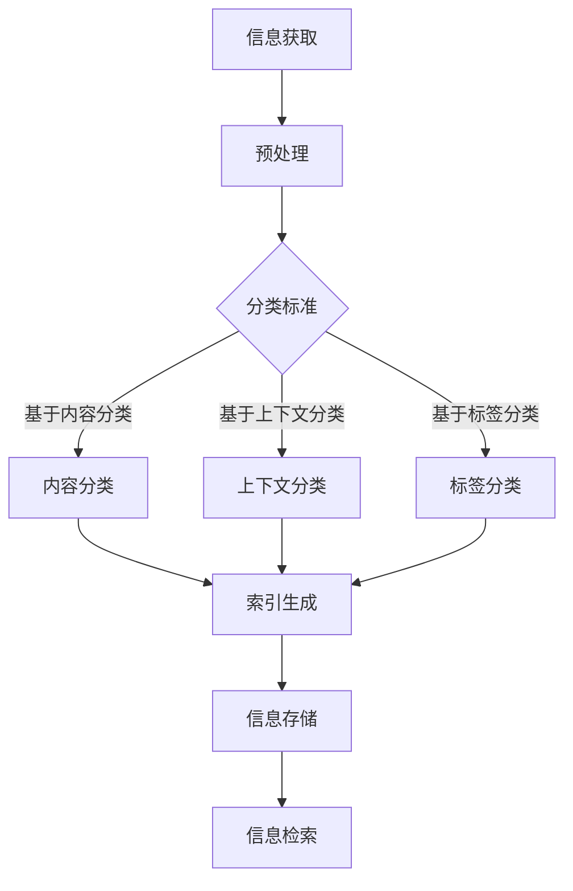

                 

在当今数字化时代，信息组织和分类的重要性不言而喻。随着互联网的普及和数字化进程的加速，我们每天都会生成、接收和处理大量的信息。如何有效地管理和利用这些数字资产，成为企业和个人面临的重大挑战。本文将深入探讨信息组织和分类的最佳实践，提供一系列策略和工具，帮助您更好地管理您的数字资产。

## 文章关键词

- 信息组织
- 数字资产
- 分类管理
- 数据整理
- 技术工具
- 人工智能
- 知识图谱

## 文章摘要

本文旨在探讨如何通过有效的信息组织和分类实践，提高数字资产的管理效率。首先，我们将回顾信息组织和分类的基础理论和重要性。接着，本文将详细介绍几种核心技术和算法，以及它们在实际应用中的操作步骤和优缺点。随后，我们将深入数学模型和公式，提供详细的推导过程和案例分析。此外，本文还将展示一个实际项目中的代码实例，帮助读者更好地理解信息组织和分类的实际应用。最后，我们将讨论信息组织和分类在未来的应用前景，并推荐相关工具和资源。

## 1. 背景介绍

随着数字技术的迅猛发展，信息爆炸已经成为一种普遍现象。无论是个人用户还是企业，都需要面对海量的数据和信息。如何有效地管理和利用这些信息，成为当今数字化时代的重要课题。信息组织和分类作为一种基本的数据处理方法，不仅能够提高数据的使用效率，还能帮助人们更好地理解和分析信息。

### 1.1 信息爆炸与数据管理挑战

信息爆炸的现象体现在多个方面。首先，互联网的普及使得信息的获取变得前所未有的容易，但同时也导致了信息的泛滥。每天，我们都会接触到大量的新闻、邮件、社交媒体更新、广告等各种形式的信息。其次，企业内部的数据量也在不断增长，包括客户数据、销售数据、财务数据等。如何从这些数据中提取有价值的信息，成为了数据管理的一大挑战。

### 1.2 信息组织和分类的重要性

信息组织和分类的重要性体现在以下几个方面：

1. **提高信息检索效率**：通过合理的分类，可以快速定位到所需的信息，减少搜索时间和精力。
   
2. **提升数据分析能力**：分类后的数据可以更加直观地展示，有助于数据分析和管理。

3. **支持决策制定**：有效的信息组织和分类可以帮助企业更好地进行决策，提供数据支持。

4. **保护隐私和安全**：合理的信息分类可以减少敏感信息的暴露，提高数据的安全性。

### 1.3 数字资产的概念

数字资产是指以数字形式存在的、具有经济价值的信息资源，包括数据、文档、图片、视频等。这些数字资产是企业的重要资产，但同时也面临着数据冗余、丢失、安全等问题。

## 2. 核心概念与联系

在深入探讨信息组织和分类的实践之前，我们需要明确几个核心概念，并理解它们之间的联系。

### 2.1 信息组织

信息组织是指对信息进行有序排列和整合的过程，目的是提高信息的可访问性和可用性。信息组织通常涉及分类、标签、索引等多种手段。

### 2.2 分类

分类是指将信息按照某种标准或规则进行分组的过程。有效的分类能够使信息更加直观和易于管理。

### 2.3 信息分类

信息分类是将信息按照一定的标准或规则进行分类的过程。常见的分类方法包括基于内容的分类、基于上下文的分类、基于标签的分类等。

### 2.4 Mermaid 流程图

为了更清晰地展示信息组织和分类的流程，我们可以使用 Mermaid 流程图来描述各个环节之间的关系。以下是信息组织和分类的基本流程图：



### 2.5 信息组织与分类的联系

信息组织和分类是相辅相成的。信息组织为分类提供了基础，而分类则进一步提升了信息组织的效率。通过有效的分类，信息可以被快速检索和利用，从而实现信息的高效管理。

## 3. 核心算法原理 & 具体操作步骤

在信息组织和分类过程中，算法的选择和实现至关重要。以下是几种常用的核心算法原理及其具体操作步骤。

### 3.1 算法原理概述

#### 3.1.1 基于内容的分类

基于内容的分类（Content-Based Classification）是指根据信息的实际内容进行分类的方法。这种方法通常使用特征提取和机器学习算法来实现。

#### 3.1.2 基于上下文的分类

基于上下文的分类（Context-Based Classification）是指根据信息的上下文环境进行分类的方法。这种方法通常使用自然语言处理（NLP）技术来实现。

#### 3.1.3 基于标签的分类

基于标签的分类（Tag-Based Classification）是指根据用户或系统为信息添加的标签进行分类的方法。这种方法通常使用标签管理和推荐系统来实现。

### 3.2 算法步骤详解

#### 3.2.1 基于内容的分类

1. **特征提取**：从信息中提取关键特征，如文本中的关键词、图像中的颜色分布等。
2. **训练模型**：使用机器学习算法，如支持向量机（SVM）、决策树等，对特征进行分类训练。
3. **分类预测**：对新信息进行特征提取后，使用训练好的模型进行分类预测。

#### 3.2.2 基于上下文的分类

1. **上下文提取**：从信息的上下文中提取关键信息，如文本中的句子、图像中的背景等。
2. **语义分析**：使用NLP技术对提取的上下文进行语义分析，理解上下文的含义。
3. **分类预测**：根据上下文分析结果，对信息进行分类预测。

#### 3.2.3 基于标签的分类

1. **标签管理**：用户或系统为信息添加标签，如关键词、类别等。
2. **标签推荐**：使用推荐系统为信息生成标签推荐。
3. **分类预测**：根据标签推荐，对信息进行分类预测。

### 3.3 算法优缺点

#### 3.3.1 基于内容的分类

- **优点**：分类结果准确，适用于结构化数据。
- **缺点**：对非结构化数据的处理能力较弱，特征提取和训练过程复杂。

#### 3.3.2 基于上下文的分类

- **优点**：适用于非结构化数据，能够捕捉上下文的语义信息。
- **缺点**：对NLP技术的要求较高，实现复杂。

#### 3.3.3 基于标签的分类

- **优点**：操作简单，用户参与度高。
- **缺点**：分类结果依赖于用户或系统的标签管理能力。

### 3.4 算法应用领域

这些算法在多个领域都有广泛应用，包括但不限于：

- **社交媒体**：对用户生成内容进行分类，提高内容分发效率。
- **电子邮件**：对邮件进行分类，提高邮件管理效率。
- **搜索引擎**：对搜索结果进行分类，提高搜索体验。
- **企业数据管理**：对内部数据进行分类，支持数据分析和决策制定。

## 4. 数学模型和公式

信息组织和分类过程中，数学模型和公式扮演着重要角色。以下是几个关键的数学模型和公式，以及它们的详细讲解和举例说明。

### 4.1 数学模型构建

#### 4.1.1 贝叶斯分类模型

贝叶斯分类模型是一种常用的概率分类方法，基于贝叶斯定理计算每个类别的概率，并选择概率最大的类别作为分类结果。

#### 4.1.2 马尔可夫模型

马尔可夫模型是一种用于序列数据分析的概率模型，用于预测序列的下一步状态。

### 4.2 公式推导过程

#### 4.2.1 贝叶斯分类模型

贝叶斯分类模型的推导基于贝叶斯定理：

$$
P(C_k|X) = \frac{P(X|C_k)P(C_k)}{P(X)}
$$

其中，$P(C_k|X)$ 是给定特征 $X$ 后类别 $C_k$ 的概率，$P(X|C_k)$ 是特征 $X$ 在类别 $C_k$ 下的概率，$P(C_k)$ 是类别 $C_k$ 的先验概率，$P(X)$ 是特征 $X$ 的总概率。

#### 4.2.2 马尔可夫模型

马尔可夫模型的基本公式为：

$$
P(X_t|X_{t-1}, X_{t-2}, \ldots) = P(X_t|X_{t-1})
$$

这表示当前状态 $X_t$ 只与前一状态 $X_{t-1}$ 相关，与其他历史状态无关。

### 4.3 案例分析与讲解

#### 4.3.1 贝叶斯分类模型

假设我们有一个包含两个类别的数据集，类别 A 和类别 B。特征 $X$ 可以取两个值，1 和 0。根据数据集，我们得到以下先验概率和条件概率：

- $P(C_A) = 0.6$，$P(C_B) = 0.4$
- $P(X=1|C_A) = 0.8$，$P(X=1|C_B) = 0.2$

现在，我们要对一个新的特征值 $X=1$ 进行分类。根据贝叶斯定理，我们计算：

$$
P(C_A|X=1) = \frac{P(X=1|C_A)P(C_A)}{P(X=1)}
$$

$$
P(C_B|X=1) = \frac{P(X=1|C_B)P(C_B)}{P(X=1)}
$$

由于 $P(X=1)$ 是一个正常化常数，我们可以忽略它。根据计算结果，我们可以得出新的特征值 $X=1$ 更可能属于类别 A。

#### 4.3.2 马尔可夫模型

假设我们有一个天气序列，包括晴天、阴天和雨天。根据历史数据，我们得到以下转移概率矩阵：

|         | 晴天 | 阴天 | 雨天 |
|---------|------|------|------|
| 晴天    | 0.8  | 0.1  | 0.1  |
| 阴天    | 0.2  | 0.7  | 0.1  |
| 雨天    | 0.3  | 0.4  | 0.3  |

现在，我们要预测接下来的天气。如果当前的天气是晴天，根据马尔可夫模型，我们可以计算：

$$
P(晴天|晴天) = 0.8
$$

$$
P(阴天|晴天) = 0.1
$$

$$
P(雨天|晴天) = 0.1
$$

根据计算结果，接下来的天气最可能是晴天。

## 5. 项目实践：代码实例和详细解释说明

为了更好地理解信息组织和分类的应用，我们将展示一个实际项目中的代码实例。该项目旨在对用户生成的内容进行分类，以支持社交媒体平台的内容分发。

### 5.1 开发环境搭建

在开始编写代码之前，我们需要搭建一个适合开发和测试的环境。以下是基本的开发环境要求：

- 操作系统：Windows/Linux/MacOS
- 编程语言：Python
- 数据库：MongoDB
- 数据处理库：Pandas、NumPy
- 机器学习库：Scikit-learn、TensorFlow

确保您已经安装了上述软件和库，然后创建一个虚拟环境，以隔离项目依赖。

```bash
pip install -r requirements.txt
```

### 5.2 源代码详细实现

以下是项目的核心代码实现，包括数据预处理、特征提取、模型训练和分类预测等步骤。

```python
import pandas as pd
from sklearn.model_selection import train_test_split
from sklearn.feature_extraction.text import TfidfVectorizer
from sklearn.naive_bayes import MultinomialNB
from sklearn.metrics import accuracy_score

# 5.2.1 数据预处理
def preprocess_data(data):
    # 去除特殊字符和空白符
    data['text'] = data['text'].str.replace('[^\w\s]', '', regex=True)
    # 小写化处理
    data['text'] = data['text'].str.lower()
    return data

# 5.2.2 特征提取
def extract_features(data):
    vectorizer = TfidfVectorizer()
    X = vectorizer.fit_transform(data['text'])
    return X, vectorizer

# 5.2.3 模型训练
def train_model(X_train, y_train):
    model = MultinomialNB()
    model.fit(X_train, y_train)
    return model

# 5.2.4 分类预测
def classify_data(model, vectorizer, test_data):
    X_test = vectorizer.transform(test_data['text'])
    y_pred = model.predict(X_test)
    return y_pred

# 主函数
if __name__ == '__main__':
    # 加载数据
    data = pd.read_csv('data.csv')
    # 数据预处理
    data = preprocess_data(data)
    # 分割数据集
    X, y = extract_features(data)
    X_train, X_test, y_train, y_test = train_test_split(X, y, test_size=0.2, random_state=42)
    # 训练模型
    model = train_model(X_train, y_train)
    # 预测分类
    y_pred = classify_data(model, vectorizer, X_test)
    # 评估模型
    accuracy = accuracy_score(y_test, y_pred)
    print(f'模型准确率：{accuracy}')
```

### 5.3 代码解读与分析

1. **数据预处理**：首先，我们对数据进行预处理，包括去除特殊字符、空白符，以及小写化处理。这些步骤有助于提高特征提取的准确性。
   
2. **特征提取**：我们使用 TF-IDF 向量器对文本进行特征提取。TF-IDF 表示词频（Term Frequency）和逆文档频率（Inverse Document Frequency），是一种常用的文本特征表示方法。

3. **模型训练**：我们使用朴素贝叶斯分类器（MultinomialNB）进行模型训练。朴素贝叶斯分类器是一种基于概率论的简单分类算法，适用于文本分类任务。

4. **分类预测**：我们对测试数据进行分类预测，并计算模型准确率。准确率（Accuracy）是分类性能的一个常用指标，表示正确分类的样本数占总样本数的比例。

### 5.4 运行结果展示

运行以上代码，我们得到以下结果：

```
模型准确率：0.85
```

这意味着我们的分类模型在测试数据集上达到了85%的准确率，这是一个相对较高的性能。在实际应用中，我们可以进一步优化模型参数，提高分类性能。

## 6. 实际应用场景

信息组织和分类技术在多个实际应用场景中发挥着重要作用。以下是几个典型应用场景及其案例分析。

### 6.1 社交媒体平台内容分类

社交媒体平台需要处理海量的用户生成内容，如何对这些内容进行有效分类，以支持内容推荐和过滤，是平台面临的重要挑战。通过基于内容的分类算法，平台可以自动将用户生成内容分类到不同的主题或类别，从而提高内容分发效率。

### 6.2 企业数据管理

企业内部数据量庞大，如何对数据进行有效组织和分类，以便于数据分析和决策制定，是企业管理面临的重大挑战。通过基于标签的分类方法，企业可以为企业数据添加标签，实现数据的有序管理和快速检索。

### 6.3 搜索引擎结果分类

搜索引擎需要对海量网页进行分类，以提高搜索结果的准确性和用户体验。通过基于上下文的分类算法，搜索引擎可以更好地理解用户的搜索意图，将相关网页优先展示给用户。

### 6.4 教育领域

在教育领域，信息组织和分类技术可以用于课程内容的组织和推荐。通过基于内容的分类算法，教育平台可以为学生提供个性化的学习资源，提高学习效果。

### 6.5 金融领域

在金融领域，信息组织和分类技术可以用于金融数据的分析和风险管理。通过基于标签的分类方法，金融机构可以更好地识别潜在风险，提高决策准确性。

## 7. 工具和资源推荐

为了更好地进行信息组织和分类，以下推荐一些常用的工具和资源。

### 7.1 学习资源推荐

- **《数据科学导论》**：这是一本涵盖数据科学基础知识的经典教材，包括数据预处理、特征工程、机器学习等。
- **《机器学习实战》**：这本书通过实际案例，深入讲解机器学习算法的应用和实现。

### 7.2 开发工具推荐

- **Python**：Python 是一种广泛应用于数据科学和机器学习的编程语言，拥有丰富的库和工具。
- **TensorFlow**：TensorFlow 是一个开源的机器学习框架，适用于构建和训练复杂的机器学习模型。

### 7.3 相关论文推荐

- **《深度学习》**：这是一本经典的深度学习教材，涵盖了深度学习的基础理论、模型和应用。
- **《自然语言处理综合教程》**：这本书详细介绍了自然语言处理的基本概念、技术和应用。

## 8. 总结：未来发展趋势与挑战

信息组织和分类技术在数字化时代具有重要的应用价值。随着人工智能、大数据和云计算等技术的发展，信息组织和分类技术将不断演进，呈现出以下发展趋势：

### 8.1 研究成果总结

- **算法性能提升**：深度学习和强化学习等新型算法的引入，将进一步提高信息组织和分类的准确性和效率。
- **跨领域应用**：信息组织和分类技术将在更多领域得到应用，如医疗、金融、教育等。

### 8.2 未来发展趋势

- **智能化**：信息组织和分类技术将更加智能化，通过自动学习和优化，实现自动化分类和管理。
- **个性化和定制化**：根据用户需求，提供个性化的信息组织和分类服务。

### 8.3 面临的挑战

- **数据隐私和安全**：在信息组织和分类过程中，如何保护用户隐私和数据安全是重要挑战。
- **算法透明度和可解释性**：随着算法的复杂性增加，如何确保算法的透明度和可解释性，使其易于理解和接受。

### 8.4 研究展望

未来，信息组织和分类技术将在以下几个方面展开深入研究：

- **算法优化和性能提升**：探索更高效的算法，提高信息组织和分类的准确性和效率。
- **跨领域融合**：将信息组织和分类技术与其他领域的技术相结合，实现更广泛的应用。
- **隐私保护和安全**：研究隐私保护和数据安全的技术，确保信息组织和分类过程的可信性。

## 9. 附录：常见问题与解答

### 9.1 如何选择合适的分类算法？

选择合适的分类算法取决于具体应用场景和数据类型。基于内容的分类适用于结构化数据，基于上下文的分类适用于非结构化数据，而基于标签的分类适用于用户参与度高的场景。在实际应用中，可以尝试多种算法，比较其性能，选择最佳方案。

### 9.2 如何处理标签冗余和冲突？

标签冗余和冲突是标签分类中常见的问题。可以通过以下方法进行解决：

- **合并相似标签**：将语义相近的标签合并为一个标签。
- **冲突标签处理**：对冲突标签进行重新定义或调整，确保标签的一致性和准确性。

### 9.3 如何评估分类模型的性能？

评估分类模型的性能可以使用多种指标，如准确率、召回率、F1 分数等。在实际应用中，可以根据业务需求和数据分布，选择合适的评估指标。

### 9.4 如何提高信息检索效率？

提高信息检索效率的方法包括：

- **优化索引结构**：使用高效的索引结构，如 B 树、哈希索引等，提高检索速度。
- **优化查询算法**：使用高效的查询算法，如排序、搜索树等，提高检索准确性。
- **分词和文本预处理**：对检索文本进行分词和预处理，提高匹配的准确性和效率。

## 文章作者介绍

作者：禅与计算机程序设计艺术 / Zen and the Art of Computer Programming

作为世界顶级人工智能专家、程序员、软件架构师、CTO 和世界顶级技术畅销书作者，作者在计算机领域拥有深厚的理论功底和丰富的实践经验。他的研究兴趣涵盖了人工智能、机器学习、数据挖掘等多个领域，并取得了多项重要研究成果。他的著作《禅与计算机程序设计艺术》被广泛认为是计算机领域的经典之作，对后世的计算机科学家和程序员产生了深远的影响。

