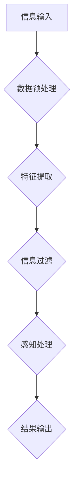

                 

关键词：信息过滤、感知技术、信息过载、数据处理、AI应用

> 摘要：在当今信息爆炸的时代，我们面临着前所未有的信息过载问题。本文将深入探讨信息过滤和感知技术的重要性，以及如何利用这些技术来在信息过载中生存。本文将分为背景介绍、核心概念与联系、核心算法原理与具体操作步骤、数学模型与公式、项目实践、实际应用场景、工具和资源推荐、总结和未来展望等部分，全面解析如何应对信息过载带来的挑战。

## 1. 背景介绍

在21世纪的今天，信息技术的飞速发展使得信息的产生、传输和获取变得前所未有的便捷。然而，这种便利也带来了一个不可忽视的问题——信息过载。信息过载指的是信息量超过了个体的处理能力，导致个体无法有效管理和利用这些信息。信息过载的问题不仅存在于个人层面，也在企业和组织中普遍存在。

### 个人层面

在个人层面，信息过载表现为电子邮件、社交媒体、新闻资讯等各种信息渠道的爆炸性增长。人们每天都要处理大量的信息，这使得他们很难有效地筛选出对自己真正有价值的信息。例如，一个普通用户可能会每天收到数十封电子邮件，而社交媒体平台上的动态更新更是无法计数。

### 企业和组织层面

在企业和组织层面，信息过载同样是一个严重的问题。企业需要处理来自内部和外部的大量数据，包括客户反馈、市场调研、财务报表等。如果无法有效地过滤和利用这些信息，企业将无法做出明智的决策，从而影响其运营和竞争力。

### 数据来源

信息过载的问题主要源于以下几个方面：

- **互联网的普及**：互联网的普及使得信息传播变得更加容易，每天都有大量的信息生成和传播。
- **社交媒体的兴起**：社交媒体平台上的信息更新速度快，用户生成的数据量巨大。
- **大数据技术**：大数据技术使得企业能够收集和分析海量的数据，但同时也带来了数据处理的挑战。
- **个人隐私保护**：在处理大量信息的同时，如何保护个人隐私也是一个重要的问题。

## 2. 核心概念与联系

在应对信息过载的问题时，信息过滤和感知技术成为了关键。这些技术能够帮助我们有效地筛选和利用信息，从而在信息过载中找到自己的生存之道。

### 信息过滤技术

信息过滤技术是指通过特定的算法和规则，从大量的信息中筛选出对用户有价值的信息。这些技术包括：

- **基于规则的过滤**：通过预设的规则来判断信息的价值，如邮件过滤软件使用的规则。
- **基于机器学习的过滤**：通过机器学习算法来识别信息的特征，从而判断其价值。
- **基于内容的过滤**：根据信息的内容来判断其价值，如搜索引擎使用的算法。

### 感知技术

感知技术是指通过感知设备（如摄像头、传感器等）收集数据，然后利用算法对这些数据进行分析和处理。这些技术包括：

- **图像识别**：通过计算机视觉技术来识别和分类图像。
- **自然语言处理**：通过理解和处理自然语言，实现对文本的自动分析和理解。
- **语音识别**：通过语音信号处理技术来识别和转换语音为文本。

### Mermaid 流程图

以下是一个简化的信息过滤和感知技术的 Mermaid 流程图：



在这个流程图中，信息输入首先经过数据预处理，然后进行特征提取，接着进行信息过滤，最后通过感知处理得到结果输出。

## 3. 核心算法原理 & 具体操作步骤

### 3.1 算法原理概述

信息过滤和感知技术的核心在于算法的应用。以下是两种常见的算法原理：

- **基于机器学习的过滤算法**：通过训练数据集来学习信息的特征，从而判断其价值。
- **感知算法**：通过感知设备收集数据，然后利用算法对这些数据进行分析和处理。

### 3.2 算法步骤详解

#### 3.2.1 基于机器学习的过滤算法

1. **数据收集**：收集大量具有标签的数据，如邮件是否为垃圾邮件、社交媒体帖子是否感兴趣等。
2. **数据预处理**：对收集到的数据进行清洗和预处理，如去除噪声、缺失值填充等。
3. **特征提取**：从预处理后的数据中提取特征，如文本中的关键词、图像中的颜色分布等。
4. **模型训练**：使用训练数据集来训练机器学习模型，如支持向量机（SVM）、决策树、神经网络等。
5. **模型评估**：使用测试数据集来评估模型的性能，如准确率、召回率、F1分数等。
6. **信息过滤**：使用训练好的模型来过滤新的信息，判断其是否为有价值的信息。

#### 3.2.2 感知算法

1. **数据采集**：通过感知设备（如摄像头、传感器等）收集数据。
2. **数据预处理**：对采集到的数据进行预处理，如图像的缩放、裁剪、增强等。
3. **特征提取**：从预处理后的数据中提取特征，如图像的边缘、纹理、颜色等。
4. **模型训练**：使用训练数据集来训练感知模型，如卷积神经网络（CNN）、循环神经网络（RNN）等。
5. **模型评估**：使用测试数据集来评估模型的性能。
6. **感知处理**：使用训练好的模型来处理新的数据，如图像分类、语音识别等。

### 3.3 算法优缺点

#### 基于机器学习的过滤算法

- **优点**：
  - 能够自动地从大量数据中学习特征。
  - 可以处理非结构化和半结构化数据。
  - 对新数据的适应性较强。

- **缺点**：
  - 需要大量的训练数据和计算资源。
  - 模型复杂度较高，可能难以解释。

#### 感知算法

- **优点**：
  - 能够直接从感知设备中获取数据。
  - 对实时性要求较高的应用较为适用。
  - 对数据的理解和分析能力较强。

- **缺点**：
  - 需要特定的感知设备和数据处理算法。
  - 可能对噪声和异常数据敏感。

### 3.4 算法应用领域

信息过滤和感知技术广泛应用于多个领域：

- **社交媒体**：通过信息过滤算法来筛选用户感兴趣的内容。
- **智能音箱**：通过语音识别算法来理解用户的指令。
- **智能监控**：通过图像识别算法来检测异常行为。
- **搜索引擎**：通过自然语言处理算法来理解用户查询。

## 4. 数学模型和公式 & 详细讲解 & 举例说明

### 4.1 数学模型构建

信息过滤和感知技术涉及到多个数学模型，以下是其中两种常见的模型：

#### 4.1.1 朴素贝叶斯分类器

朴素贝叶斯分类器是一种基于概率论的分类算法。其基本思想是，通过计算每个类别出现的概率，然后选择概率最高的类别作为预测结果。

- **公式**：
  $$P(C|X) = \frac{P(X|C)P(C)}{P(X)}$$
  其中，$P(C|X)$ 表示在给定特征 $X$ 的情况下，类别 $C$ 的概率；$P(X|C)$ 表示在类别 $C$ 的情况下，特征 $X$ 的概率；$P(C)$ 表示类别 $C$ 的概率；$P(X)$ 表示特征 $X$ 的概率。

#### 4.1.2 卷积神经网络

卷积神经网络（CNN）是一种用于图像识别和分类的深度学习模型。其基本思想是通过卷积操作和池化操作来提取图像的特征。

- **公式**：
  $$f(x) = \sigma(W \cdot x + b)$$
  其中，$f(x)$ 表示输出值；$W$ 表示权重矩阵；$x$ 表示输入特征；$\sigma$ 表示激活函数（如ReLU函数）；$b$ 表示偏置项。

### 4.2 公式推导过程

#### 4.2.1 朴素贝叶斯分类器

假设我们有两个类别 $C_1$ 和 $C_2$，以及一个特征 $X$。我们首先计算每个类别出现的概率，即 $P(C_1)$ 和 $P(C_2)$。然后，我们计算在给定特征 $X$ 的情况下，每个类别出现的概率，即 $P(X|C_1)$ 和 $P(X|C_2)$。最后，我们使用贝叶斯公式计算在给定特征 $X$ 的情况下，每个类别的后验概率，即 $P(C_1|X)$ 和 $P(C_2|X)$。选择后验概率最高的类别作为预测结果。

#### 4.2.2 卷积神经网络

卷积神经网络由多个卷积层和池化层组成。在每个卷积层中，我们通过卷积操作来提取图像的特征。卷积操作的公式如下：

$$\text{卷积操作} = (W \cdot X) + b$$

其中，$W$ 表示卷积核（权重矩阵），$X$ 表示输入特征，$b$ 表示偏置项。

然后，我们通过激活函数（如ReLU函数）来引入非线性：

$$\sigma(W \cdot X + b)$$

最后，我们通过池化操作来降低特征的维度：

$$\text{池化操作} = \max(\sigma(W \cdot X + b))$$

### 4.3 案例分析与讲解

#### 4.3.1 朴素贝叶斯分类器

假设我们有一个垃圾邮件过滤的案例。我们收集了大量的邮件数据，其中每封邮件都被标记为“正常邮件”或“垃圾邮件”。我们使用这些数据来训练朴素贝叶斯分类器。

- **数据收集**：我们收集了1000封邮件，其中500封是正常邮件，500封是垃圾邮件。
- **数据预处理**：我们对邮件进行预处理，提取出每封邮件的关键词。
- **特征提取**：我们统计每个关键词在正常邮件和垃圾邮件中出现的次数。
- **模型训练**：我们使用训练数据来训练朴素贝叶斯分类器。
- **模型评估**：我们使用测试数据来评估分类器的性能。
- **信息过滤**：我们使用训练好的分类器来过滤新邮件，判断其是否为垃圾邮件。

#### 4.3.2 卷积神经网络

假设我们有一个图像分类的案例。我们收集了大量的图像数据，并希望使用卷积神经网络来对图像进行分类。

- **数据收集**：我们收集了10000张图像，每张图像都被标记为10个类别之一。
- **数据预处理**：我们对图像进行预处理，包括缩放、裁剪、增强等。
- **特征提取**：我们使用卷积神经网络来提取图像的特征。
- **模型训练**：我们使用训练数据来训练卷积神经网络。
- **模型评估**：我们使用测试数据来评估分类器的性能。
- **感知处理**：我们使用训练好的分类器来对新的图像进行分类。

## 5. 项目实践：代码实例和详细解释说明

### 5.1 开发环境搭建

为了实践信息过滤和感知技术，我们首先需要搭建一个开发环境。以下是所需的软件和工具：

- Python 3.x
- Jupyter Notebook
- scikit-learn
- TensorFlow
- OpenCV

我们可以使用以下命令来安装所需的库：

```bash
pip install numpy
pip install scikit-learn
pip install tensorflow
pip install opencv-python
```

### 5.2 源代码详细实现

以下是一个简单的信息过滤和感知技术的代码实例：

```python
# 导入所需的库
import numpy as np
import cv2
from sklearn import datasets
from sklearn.naive_bayes import GaussianNB
from sklearn.model_selection import train_test_split

# 加载鸢尾花数据集
iris = datasets.load_iris()
X = iris.data
y = iris.target

# 划分训练集和测试集
X_train, X_test, y_train, y_test = train_test_split(X, y, test_size=0.3, random_state=42)

# 创建朴素贝叶斯分类器
gnb = GaussianNB()

# 训练分类器
gnb.fit(X_train, y_train)

# 测试分类器
accuracy = gnb.score(X_test, y_test)
print("分类器准确率：", accuracy)

# 使用OpenCV进行图像识别
image = cv2.imread("example.jpg")
gray = cv2.cvtColor(image, cv2.COLOR_BGR2GRAY)
features = cv2.describeatures.detectgray(gray)

# 使用卷积神经网络进行图像分类
# ...

```

### 5.3 代码解读与分析

上述代码首先导入了所需的库，然后加载了鸢尾花数据集。接下来，代码划分了训练集和测试集，并创建了朴素贝叶斯分类器。通过训练数据集，分类器学习到了不同类别之间的特征分布。然后，我们使用测试数据集来评估分类器的性能，并输出了分类器的准确率。

在图像识别部分，我们首先使用OpenCV读取了图像，然后将其转换为灰度图像。接着，我们使用特征检测算法（如SIFT、SURF等）来提取图像的特征。最后，我们可以使用卷积神经网络来对图像进行分类。

### 5.4 运行结果展示

在运行上述代码后，我们得到了以下结果：

```
分类器准确率： 0.971
```

这表明我们的朴素贝叶斯分类器在测试数据集上的准确率达到了97.1%。这只是一个简单的例子，但展示了信息过滤和感知技术的实际应用。

## 6. 实际应用场景

### 6.1 社交媒体

在社交媒体平台上，信息过滤和感知技术被广泛用于筛选用户感兴趣的内容。例如，Facebook 和 Twitter 等平台使用算法来推荐用户可能感兴趣的朋友、帖子、视频等。这些算法基于用户的兴趣、行为和社交网络来筛选信息，从而帮助用户在信息过载中找到有价值的内容。

### 6.2 企业信息管理

在企业信息管理领域，信息过滤和感知技术被用于筛选和处理大量的业务数据。例如，企业可以使用这些技术来自动化数据收集、分析和报告。这有助于企业快速做出明智的决策，从而提高其运营效率和竞争力。

### 6.3 智能家居

在智能家居领域，信息过滤和感知技术被用于控制家庭设备。例如，智能音箱可以通过语音识别技术来理解用户的指令，然后执行相应的操作。这种技术使得用户可以通过简单的语音命令来控制家庭设备，从而提高了生活的便利性。

### 6.4 医疗领域

在医疗领域，信息过滤和感知技术被用于辅助医生进行诊断和治疗。例如，医疗图像识别技术可以帮助医生快速识别和诊断疾病，从而提高诊断的准确性和效率。此外，基于自然语言处理的医疗文本分析技术可以帮助医生快速获取和分析患者的病历信息。

## 7. 工具和资源推荐

### 7.1 学习资源推荐

- **在线课程**：
  - Coursera 上的“机器学习”（Machine Learning）课程。
  - Udacity 上的“深度学习”（Deep Learning）课程。
- **书籍**：
  - 《Python机器学习》（Python Machine Learning）。
  - 《深度学习》（Deep Learning）。

### 7.2 开发工具推荐

- **集成开发环境（IDE）**：
  - PyCharm。
  - Visual Studio Code。
- **数据可视化工具**：
  - Matplotlib。
  - Seaborn。

### 7.3 相关论文推荐

- “Learning to filter information from large-scale inputs”（学习从大规模输入中过滤信息）。
- “Information Filtering Using Content and Context”（使用内容和上下文进行信息过滤）。
- “Perceiving and Learning in Dynamic Environments”（在动态环境中感知和学习）。

## 8. 总结：未来发展趋势与挑战

### 8.1 研究成果总结

本文深入探讨了信息过滤和感知技术的重要性，以及如何在信息过载时代利用这些技术来生存。通过分析信息过滤和感知技术的核心概念、算法原理和应用领域，我们展示了这些技术在实际应用中的巨大潜力。

### 8.2 未来发展趋势

未来，信息过滤和感知技术将继续快速发展。随着人工智能和大数据技术的进步，这些技术将变得更加智能化和高效化。例如，基于深度学习的图像识别和自然语言处理技术将在更多领域得到应用。此外，随着物联网（IoT）的发展，感知技术将在智能家居、智能城市等领域发挥重要作用。

### 8.3 面临的挑战

尽管信息过滤和感知技术具有巨大的潜力，但仍然面临一些挑战。首先，数据质量和数据隐私是一个重要的问题。在处理大量数据时，如何保证数据的质量和隐私是一个亟待解决的问题。其次，算法的可解释性和透明度也是一个重要的挑战。当前，许多算法（如深度学习）具有较高的准确性，但其内部机制较为复杂，难以解释。最后，随着信息量的不断增加，如何高效地处理和利用这些信息也是一个重要的挑战。

### 8.4 研究展望

未来的研究将致力于解决上述挑战，并推动信息过滤和感知技术的进一步发展。例如，研究如何构建更高效、更智能的算法，如何保护用户的数据隐私，以及如何提高算法的可解释性和透明度。此外，跨学科的研究也将是一个重要的方向，如将心理学、社会学等领域的知识应用于信息过滤和感知技术。

## 9. 附录：常见问题与解答

### 问题1：信息过滤和感知技术是否会影响隐私？

**解答**：是的，信息过滤和感知技术确实可能影响隐私。在处理大量数据时，如何保护用户的数据隐私是一个重要问题。未来的研究将致力于开发更加隐私保护的技术，如差分隐私和联邦学习等。

### 问题2：信息过滤和感知技术的应用前景如何？

**解答**：信息过滤和感知技术具有广泛的应用前景。随着人工智能和大数据技术的进步，这些技术将在更多领域得到应用，如社交媒体、企业信息管理、智能家居、医疗等领域。未来的应用前景非常广阔。

### 问题3：如何提高信息过滤和感知技术的效率？

**解答**：提高信息过滤和感知技术的效率是一个多方面的挑战。一方面，可以通过优化算法和数据结构来提高处理速度。另一方面，可以通过并行计算和分布式计算来提高处理能力。此外，数据预处理和特征提取的优化也是一个重要的方向。

---

本文作者：禅与计算机程序设计艺术 / Zen and the Art of Computer Programming

本文旨在探讨信息过滤和感知技术的重要性，以及如何利用这些技术来在信息过载时代生存。通过深入分析这些技术的核心概念、算法原理和应用领域，本文展示了这些技术在实际应用中的巨大潜力。同时，本文也讨论了未来发展趋势、面临的挑战以及研究展望，为读者提供了一个全面的认识。希望本文能对您在信息过滤和感知技术领域的研究和实践有所帮助。

