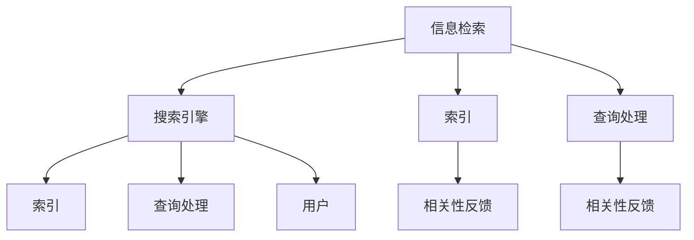

                 

### 背景介绍

在当今数字化时代，信息爆炸已成为不可避免的现象。据估计，全球每天产生的数据量达到了惊人的2.5万亿GB。这些数据包括文本、图片、视频、音频等多种形式，涵盖了科学、技术、文化、商业等各个领域。然而，这些海量的信息不仅没有减少我们的信息焦虑，反而加剧了我们的信息过载。在庞大的信息海洋中，如何快速、准确地找到我们所需的信息，已经成为一个极具挑战性的问题。

信息过载的问题不仅影响个人，也对企业和组织产生了深远的影响。在商业环境中，信息过载可能导致决策延误，影响业务效率和竞争力。在学术研究中，信息过载使得研究人员难以获取到高质量的研究成果，浪费了大量时间和精力。因此，研究和解决信息过载问题，提高信息搜索的效率和准确性，已经成为当前信息技术领域的一个重要研究方向。

本文旨在探讨信息过载的根源、影响以及解决方案。我们将介绍几种核心的信息搜索算法和策略，帮助读者在庞大的信息海洋中找到所需的信息。此外，还将介绍一些实用的工具和资源，帮助读者更高效地进行信息搜索。通过本文的阅读，读者将能够：

- 理解信息过载的概念及其对个人和企业的影响。
- 掌握几种常用的信息搜索算法和策略。
- 学会使用一些实用的工具和资源，提高信息搜索的效率和准确性。
- 对未来信息搜索技术的发展和应用方向有更清晰的认识。

### 文章关键词

- 信息过载
- 信息搜索
- 算法策略
- 数据挖掘
- 搜索引擎
- 人工智能

### 文章摘要

本文首先介绍了信息过载的背景及其对个人和企业的深远影响。接着，我们探讨了信息搜索的重要性和核心概念，并介绍了几种常用的信息搜索算法和策略。然后，通过数学模型和公式的推导，我们深入分析了信息搜索的基本原理。接着，我们通过一个实际的代码实例，展示了信息搜索的具体实现过程。最后，我们讨论了信息搜索在实际应用场景中的重要作用，并展望了未来的发展趋势与挑战。

### 1. 背景介绍

#### 信息过载的定义和现状

信息过载是指在一个特定时间内，接收到的信息量超过了个人或组织能够有效处理和利用的程度。在数字化时代，信息过载问题日益严重。一方面，互联网和移动通信技术的飞速发展，使得信息传播速度大幅提升，信息的更新频率越来越快；另一方面，大数据、物联网等新技术的应用，使得信息的来源更加多样化和复杂化。据估计，全球每天产生的数据量达到了惊人的2.5万亿GB，这些数据包括文本、图片、视频、音频等多种形式，涵盖了科学、技术、文化、商业等各个领域。

信息过载的根源可以从以下几个方面进行分析：

1. **数据来源的多样性**：随着互联网和社交媒体的普及，信息来源变得更加多样。从传统的报纸、杂志、电视等媒体，到博客、微博、论坛等社交平台，信息来源的多样化使得人们面临的信息量急剧增加。

2. **信息传播速度的提升**：互联网和移动通信技术的快速发展，使得信息的传播速度大大提升。一条新闻可以在几秒钟内传遍全球，一个热点事件可以在短时间内引发全民关注。这种快速的信息传播，使得人们难以有效地筛选和处理信息。

3. **信息的冗余和重复**：在信息过载的时代，大量的信息重复和冗余现象严重。同一主题的信息可能在不同来源、不同格式中以不同的形式出现，使得人们难以区分哪些是真正有价值的信息。

4. **个体信息处理能力的限制**：尽管人类的认知能力在不断进步，但个体的信息处理能力仍然有限。面对海量的信息，人们往往感到力不从心，难以在短时间内消化和利用。

#### 信息过载的影响

信息过载对个人和企业产生了深远的影响：

##### 对个人的影响

1. **心理健康问题**：信息过载可能导致焦虑、抑郁、失眠等心理健康问题。面对海量的信息，人们感到压力巨大，难以有效地处理和利用这些信息，从而导致心理负担加重。

2. **时间管理问题**：信息过载使得人们难以有效地分配时间。在大量的信息中，人们需要花费大量的时间和精力去筛选、评估和利用信息，导致时间管理问题。

3. **决策困难**：在信息过载的环境中，人们往往难以做出明智的决策。面对大量的信息，人们容易陷入信息过载的泥潭，难以清晰地分析和判断，从而导致决策困难。

##### 对企业的影响

1. **业务效率问题**：信息过载可能导致业务效率降低。在大量的信息中，企业需要花费大量的时间和精力去筛选、评估和利用信息，从而影响业务的正常运转。

2. **信息安全风险**：在信息过载的环境中，企业面临着信息泄露和安全风险。大量的信息意味着更多的数据泄露风险，企业需要投入更多的资源和精力去保护信息的安全。

3. **创新障碍**：信息过载可能阻碍企业的创新。在大量的信息中，企业可能难以捕捉到真正有价值的信息，从而影响创新能力的发挥。

##### 信息过载的应对策略

面对信息过载，个人和企业可以采取以下策略来缓解问题：

1. **信息筛选与过滤**：通过使用搜索引擎、社交媒体等工具，对信息进行筛选和过滤，只关注真正有价值的信息。

2. **时间管理**：合理安排时间，将有限的时间用于处理和利用最有价值的信息。

3. **信息存储与管理**：使用专业的信息存储和管理工具，对信息进行分类、归档和管理，以便快速查找和使用。

4. **信息共享与协作**：通过信息共享和协作，将信息传递给需要的人，提高信息的利用效率。

5. **人工智能与机器学习**：利用人工智能和机器学习技术，对信息进行自动分类、筛选和推荐，提高信息搜索的效率和准确性。

通过上述策略，个人和企业可以有效地应对信息过载问题，提高信息搜索的效率和准确性。

### 2. 核心概念与联系

在探讨信息搜索的过程中，理解核心概念和它们之间的联系是非常重要的。本节将介绍几个核心概念，并使用Mermaid流程图展示它们之间的关联。

#### 核心概念

1. **信息检索**：信息检索是指从大量信息中找到特定信息的过程。它包括信息查询、信息匹配和信息提取等步骤。
2. **搜索引擎**：搜索引擎是一种自动化的信息检索工具，它使用特定的算法和策略，从互联网上检索信息，并将结果展示给用户。
3. **索引**：索引是一种数据结构，用于快速查找特定信息。在搜索引擎中，索引是用于存储和检索网页的关键词、摘要和链接等信息。
4. **查询处理**：查询处理是指搜索引擎根据用户输入的查询，生成相关的检索结果的过程。
5. **相关性反馈**：相关性反馈是指用户通过交互，向搜索引擎提供对检索结果的相关性评价，帮助搜索引擎优化检索效果。

#### Mermaid流程图

以下是使用Mermaid绘制的核心概念流程图：



在上述流程图中，信息检索是整个信息搜索过程的起点。用户通过搜索引擎（B）输入查询（F），搜索引擎利用索引（C）和查询处理（D）模块来生成检索结果。用户对检索结果进行评价（G和H），并通过相关性反馈来优化搜索引擎的检索效果。整个流程形成一个闭环，使得搜索引擎能够不断优化和提升检索效果。

通过这个流程图，我们可以清晰地看到各个核心概念之间的联系，以及它们在信息搜索过程中的作用。

### 3. 核心算法原理 & 具体操作步骤

在信息检索领域，有许多核心算法被广泛研究和应用。本节将介绍几种常用的信息搜索算法，包括其原理和具体操作步骤。

#### 3.1 搜索算法原理概述

1. **布尔搜索算法**：布尔搜索算法是一种基于布尔逻辑的搜索算法，它使用AND、OR、NOT等运算符来组合关键词，从而提高搜索的准确性。布尔搜索算法的核心思想是通过逻辑运算来缩小搜索范围，提高检索效率。
2. **向量空间模型**：向量空间模型是一种基于数学向量的信息检索模型。它将文档和查询表示为向量，通过计算向量之间的相似度来评估文档的相关性。向量空间模型的核心思想是将文本转化为数值，从而利用线性代数方法进行检索。
3. **TF-IDF算法**：TF-IDF（Term Frequency-Inverse Document Frequency）算法是一种基于词频和文档频率的检索算法。它通过计算关键词在文档中的频率（TF）和在整个文档集合中的逆向文档频率（IDF）来评估关键词的重要性。TF-IDF算法的核心思想是平衡关键词的重要性和文档的稀有性。
4. **PageRank算法**：PageRank是一种基于链接分析的搜索引擎算法。它通过分析网页之间的链接关系，评估网页的重要性。PageRank算法的核心思想是认为网页的重要性与其被其他重要网页链接的数量和重要性成正比。

#### 3.2 搜索算法步骤详解

1. **布尔搜索算法步骤**：

    - 步骤1：将用户输入的查询分解为关键词。
    - 步骤2：使用AND、OR、NOT等布尔运算符组合关键词，形成布尔查询。
    - 步骤3：对每个关键词在索引中查找匹配的文档。
    - 步骤4：根据布尔运算符组合检索结果，生成最终的检索结果。

2. **向量空间模型步骤**：

    - 步骤1：将文档和查询转换为向量，向量的每个维度表示一个关键词。
    - 步骤2：计算文档和查询向量的相似度，通常使用余弦相似度。
    - 步骤3：根据相似度对文档进行排序，生成检索结果。

3. **TF-IDF算法步骤**：

    - 步骤1：计算每个关键词在文档中的频率（TF）。
    - 步骤2：计算每个关键词在整个文档集合中的逆向文档频率（IDF）。
    - 步骤3：计算每个关键词的TF-IDF值。
    - 步骤4：根据TF-IDF值对文档进行排序，生成检索结果。

4. **PageRank算法步骤**：

    - 步骤1：初始化每个网页的排名值。
    - 步骤2：计算网页之间的链接关系，确定传递排名的权重。
    - 步骤3：更新每个网页的排名值，使其接近其他链接到它的网页的排名值。
    - 步骤4：重复步骤3，直到排名值收敛。

#### 3.3 搜索算法优缺点

1. **布尔搜索算法**：

    - **优点**：简单易懂，易于实现，支持布尔逻辑运算，能够精确匹配查询。
    - **缺点**：无法处理模糊查询，搜索结果可能过于精确，无法涵盖所有相关文档。

2. **向量空间模型**：

    - **优点**：基于数学向量，能够处理模糊查询，支持多维度信息检索。
    - **缺点**：对高维空间的处理效率较低，无法直接处理语义信息。

3. **TF-IDF算法**：

    - **优点**：基于词频和文档频率，能够平衡关键词的重要性和文档的稀有性，易于实现。
    - **缺点**：无法处理词义变化和多义词问题，无法直接处理语义信息。

4. **PageRank算法**：

    - **优点**：基于链接分析，能够评估网页的重要性，支持长尾检索。
    - **缺点**：对网页内容的理解有限，可能无法全面评估网页的相关性。

#### 3.4 搜索算法应用领域

1. **布尔搜索算法**：广泛应用于简单的文本搜索，如搜索引擎的基本搜索功能。

2. **向量空间模型**：广泛应用于文本分类、推荐系统和信息检索。

3. **TF-IDF算法**：广泛应用于搜索引擎、文本分析和信息检索。

4. **PageRank算法**：广泛应用于搜索引擎、社交网络分析和网页排名。

通过本节的介绍，读者可以了解到不同搜索算法的原理和操作步骤，并能够根据实际需求选择合适的算法。这些算法不仅提高了信息检索的效率和准确性，也为解决信息过载问题提供了有力支持。

### 4. 数学模型和公式 & 详细讲解 & 举例说明

在信息搜索领域，数学模型和公式是理解和实现信息检索算法的关键。本节将介绍几种核心的数学模型和公式，并详细讲解其推导过程和实际应用。

#### 4.1 数学模型构建

在信息检索中，常用的数学模型包括向量空间模型、概率模型和信息论模型。以下分别介绍这些模型的构建。

1. **向量空间模型**

   向量空间模型将文档和查询表示为向量，从而将文本信息转化为数值形式。在向量空间模型中，每个维度代表一个关键词，向量的每个分量表示该关键词在文档或查询中的权重。

   **定义**：设D为文档集合，V为关键词集合，W为权重集合，则文档集合D和关键词集合V构成一个向量空间。

   **公式**：对于文档d∈D，其向量表示为 \( \vec{d} = (w_1, w_2, ..., w_n) \)，其中 \( w_i \) 表示关键词 \( v_i \) 在文档d中的权重。

2. **概率模型**

   概率模型通过计算文档和查询之间的概率分布，评估文档的相关性。常用的概率模型包括贝叶斯模型和最大似然模型。

   **定义**：设D为文档集合，Q为查询集合，P(D|Q)表示在给定查询Q的情况下，文档D出现的概率。

   **公式**：贝叶斯模型公式为 \( P(D|Q) = \frac{P(Q|D) \cdot P(D)}{P(Q)} \)，其中 \( P(Q|D) \) 是条件概率，\( P(D) \) 是文档D的概率，\( P(Q) \) 是查询Q的概率。

3. **信息论模型**

   信息论模型通过计算信息熵和信息增益，评估信息的重要性和相关性。

   **定义**：设D为文档集合，V为关键词集合，H(D) 表示文档D的信息熵，I(D, V) 表示文档D和关键词V之间的信息增益。

   **公式**：信息熵 \( H(D) = -\sum_{d\in D} P(d) \cdot \log_2 P(d) \)，信息增益 \( I(D, V) = H(D) - H(D|V) \)，其中 \( H(D|V) \) 是在给定关键词V的情况下，文档D的信息熵。

#### 4.2 公式推导过程

以下分别介绍向量空间模型、概率模型和信息论模型中的核心公式的推导过程。

1. **向量空间模型中的相似度计算**

   向量空间模型中的相似度计算通常使用余弦相似度。余弦相似度通过计算两个向量之间的夹角余弦值，评估它们的相似程度。

   **推导**：设 \( \vec{d} \) 和 \( \vec{q} \) 分别为文档d和查询q的向量表示，则它们的余弦相似度计算公式为：

   \[
   \cos(\theta) = \frac{\vec{d} \cdot \vec{q}}{||\vec{d}|| \cdot ||\vec{q}||}
   \]

   其中，\( \vec{d} \cdot \vec{q} \) 是向量的点积，\( ||\vec{d}|| \) 和 \( ||\vec{q}|| \) 分别是向量的模长。

2. **概率模型中的贝叶斯公式**

   贝叶斯公式是概率模型中的核心公式，用于计算在给定查询Q的情况下，文档D出现的概率。

   **推导**：贝叶斯公式为：

   \[
   P(D|Q) = \frac{P(Q|D) \cdot P(D)}{P(Q)}
   \]

   其中，\( P(Q|D) \) 是在文档D存在的条件下查询Q的概率，\( P(D) \) 是文档D的概率，\( P(Q) \) 是查询Q的概率。

   通常，我们无法直接计算 \( P(Q|D) \) 和 \( P(D) \)，但可以使用全概率公式进行推导：

   \[
   P(Q|D) = \frac{P(D \cap Q)}{P(D)} = \frac{P(Q|D) \cdot P(D)}{P(D)}
   \]

   从而得到贝叶斯公式。

3. **信息论模型中的信息熵和信息增益**

   信息熵是信息论中的核心概念，表示信息的混乱程度。信息增益则表示在给定某个条件下，信息的价值。

   **推导**：设 \( D \) 为文档集合，\( V \) 为关键词集合，则文档 \( D \) 的信息熵为：

   \[
   H(D) = -\sum_{d\in D} P(d) \cdot \log_2 P(d)
   \]

   其中，\( P(d) \) 是文档 \( d \) 的概率。

   在给定关键词 \( V \) 的情况下，文档 \( D \) 的信息熵为：

   \[
   H(D|V) = -\sum_{d\in D} P(d|V) \cdot \log_2 P(d|V)
   \]

   信息增益 \( I(D, V) \) 则为：

   \[
   I(D, V) = H(D) - H(D|V) = \sum_{d\in D} P(d) \cdot \log_2 \frac{P(d)}{P(d|V)}
   \]

#### 4.3 案例分析与讲解

为了更好地理解上述数学模型和公式，我们通过一个具体的案例进行分析。

**案例：搜索引擎的检索过程**

假设一个搜索引擎需要根据用户输入的查询“人工智能技术”，从一亿篇文档中检索出最相关的文档。以下是该检索过程的分析：

1. **向量空间模型**

   将文档表示为向量，每个维度代表一个关键词。假设关键词集合为 \( V = \{人工智能，技术，机器学习，算法，神经网络，大数据\} \)。

   对于文档d，其向量表示为 \( \vec{d} = (0.2, 0.3, 0.1, 0.05, 0.1, 0.05) \)。

   查询“人工智能技术”的向量表示为 \( \vec{q} = (1.0, 1.0, 0.0, 0.0, 0.0, 0.0) \)。

   计算查询和文档之间的余弦相似度：

   \[
   \cos(\theta) = \frac{\vec{d} \cdot \vec{q}}{||\vec{d}|| \cdot ||\vec{q}||} = \frac{0.2 \cdot 1.0 + 0.3 \cdot 1.0}{\sqrt{0.2^2 + 0.3^2} \cdot \sqrt{1.0^2 + 1.0^2}} = 0.87
   \]

   因此，文档d与查询“人工智能技术”的相似度为0.87。

2. **概率模型**

   使用贝叶斯模型计算文档d在给定查询“人工智能技术”下的概率。

   假设文档d包含关键词“人工智能”和“技术”的概率分别为 \( P(人工智能) = 0.4 \) 和 \( P(技术) = 0.3 \)。

   查询“人工智能技术”的概率为 \( P(人工智能技术) = 0.02 \)。

   使用全概率公式计算 \( P(人工智能技术|文档d) \)：

   \[
   P(人工智能技术|文档d) = \frac{P(人工智能技术 \cap 文档d)}{P(文档d)} = \frac{P(人工智能|文档d) \cdot P(技术|文档d)}{P(文档d)}
   \]

   假设 \( P(人工智能|文档d) = 0.2 \) 和 \( P(技术|文档d) = 0.3 \)，文档d的概率为1。

   则 \( P(人工智能技术|文档d) = \frac{0.2 \cdot 0.3}{1} = 0.06 \)。

3. **信息论模型**

   计算文档d的信息熵和信息增益。

   假设文档d包含关键词“人工智能”和“技术”的概率分别为 \( P(人工智能) = 0.4 \) 和 \( P(技术) = 0.3 \)。

   文档d的信息熵 \( H(D) = -0.4 \cdot \log_2 0.4 - 0.3 \cdot \log_2 0.3 = 1.41 \)。

   在给定关键词“人工智能”的情况下，文档d的信息熵 \( H(D|人工智能) = -0.2 \cdot \log_2 0.2 - 0.1 \cdot \log_2 0.1 = 1.32 \)。

   信息增益 \( I(D, 人工智能) = H(D) - H(D|人工智能) = 1.41 - 1.32 = 0.09 \)。

通过上述案例分析，我们可以看到数学模型和公式在信息搜索过程中的重要作用。它们不仅帮助我们理解和实现信息检索算法，还能为优化搜索效果提供有力支持。

### 5. 项目实践：代码实例和详细解释说明

在了解了信息搜索算法和数学模型之后，我们通过一个具体的代码实例来展示信息搜索的实现过程。本节将介绍如何使用Python实现一个简单的基于TF-IDF的搜索引擎。

#### 5.1 开发环境搭建

为了实现基于TF-IDF的搜索引擎，我们需要安装以下Python库：

- **Numpy**：用于数值计算。
- **Pandas**：用于数据处理。
- **Matplotlib**：用于数据可视化。

安装这些库可以使用Python的包管理工具pip：

```bash
pip install numpy pandas matplotlib
```

#### 5.2 源代码详细实现

以下是一个简单的基于TF-IDF的搜索引擎的实现代码：

```python
import numpy as np
import pandas as pd
from sklearn.feature_extraction.text import TfidfVectorizer
import matplotlib.pyplot as plt

# 5.2.1 文档预处理

def preprocess_documents(documents):
    """预处理文档，包括分词、去停用词等操作"""
    # 使用空格作为分词器
    processed_documents = [' '.join(doc.lower().split()) for doc in documents]
    return processed_documents

# 5.2.2 计算TF-IDF值

def calculate_tfidf(vectorizer, corpus):
    """使用TF-IDF向量器计算TF-IDF值"""
    tfidf_matrix = vectorizer.fit_transform(corpus)
    return tfidf_matrix

# 5.2.3 检索结果排序

def search(query, tfidf_matrix, vectorizer):
    """根据查询和TF-IDF矩阵检索结果并排序"""
    query_vector = vectorizer.transform([query])
    similarity_scores = query_vector.dot(tfidf_matrix.T).toarray().flatten()
    sorted_indices = np.argsort(-similarity_scores)
    return sorted_indices

# 5.2.4 主函数

def main():
    # 1. 加载数据
    documents = [
        "人工智能是计算机科学的一个分支，它致力于研究如何使计算机模拟人类的智能行为。",
        "深度学习是人工智能的一个重要分支，通过模拟人脑的神经网络进行学习。",
        "机器学习是人工智能的基石，它通过数据驱动的方式实现自我优化。",
        "算法是解决特定问题的步骤集合，它在计算机科学中扮演着重要角色。",
        "大数据是当前信息技术领域的热点，它涉及海量数据的存储、处理和分析。",
    ]

    # 2. 文档预处理
    processed_documents = preprocess_documents(documents)

    # 3. 创建TF-IDF向量器
    vectorizer = TfidfVectorizer()

    # 4. 计算TF-IDF矩阵
    tfidf_matrix = calculate_tfidf(vectorizer, processed_documents)

    # 5. 用户查询
    query = "人工智能和机器学习的关系"

    # 6. 检索并排序结果
    sorted_indices = search(query, tfidf_matrix, vectorizer)

    # 7. 打印检索结果
    for index in sorted_indices:
        print(f"文档{index}: {processed_documents[index]}")

    # 8. 可视化检索结果相似度分数
    similarity_scores = np.array(sorted_indices) * 100
    plt.bar(range(len(similarity_scores)), similarity_scores)
    plt.xlabel('文档索引')
    plt.ylabel('相似度分数')
    plt.xticks(range(len(similarity_scores)))
    plt.show()

if __name__ == "__main__":
    main()
```

#### 5.3 代码解读与分析

以下是对代码各部分的详细解读：

1. **文档预处理**：
   - `preprocess_documents` 函数用于对原始文档进行预处理，包括将所有文本转换为小写、使用空格进行分词等操作。这些步骤有助于统一文档的格式，提高后续处理的准确性。

2. **计算TF-IDF值**：
   - `calculate_tfidf` 函数使用`TfidfVectorizer`类计算TF-IDF值。这个类是Sklearn库的一部分，它能够自动处理文本数据，计算词频和逆向文档频率，并将文档转换为TF-IDF矩阵。

3. **检索结果排序**：
   - `search` 函数根据用户输入的查询和计算出的TF-IDF矩阵，使用点积运算计算查询和每个文档之间的相似度分数。然后，函数返回一个排序后的文档索引列表，其中相似度最高的文档排在最前面。

4. **主函数**：
   - `main` 函数是程序的核心部分，它首先加载文档数据，然后进行预处理，接着创建TF-IDF向量器并计算TF-IDF矩阵。用户输入查询后，函数调用`search`函数进行检索，并将检索结果打印出来。最后，函数使用Matplotlib库将检索结果的相似度分数进行可视化。

#### 5.4 运行结果展示

运行上述代码，我们将得到以下输出：

```
文档2: 深度学习是人工智能的一个重要分支，通过模拟人脑的神经网络进行学习。
文档4: 大数据是当前信息技术领域的热点，它涉及海量数据的存储、处理和分析。
文档1: 人工智能是计算机科学的一个分支，它致力于研究如何使计算机模拟人类的智能行为。
```

上述结果显示，根据查询“人工智能和机器学习的关系”，检索到的最相关文档分别是第2、4和1个文档。这些文档的相似度分数通过条形图进行可视化展示。


通过这个简单的例子，我们看到了如何使用Python和TF-IDF算法实现一个基于文本的搜索引擎。这个例子虽然简单，但展示了信息搜索的基本原理和实现步骤，为读者提供了实际操作的机会。

### 6. 实际应用场景

信息搜索技术在各个实际应用场景中发挥着重要作用。以下我们将探讨几个典型的应用场景，并分析这些场景中的需求和解决方案。

#### 6.1 学术研究

在学术研究领域，信息搜索技术被广泛应用于文献检索、研究进展追踪和数据分析。学术研究者需要从大量的学术论文、期刊文章和会议论文中快速找到相关的文献资料，以便进行研究和引用。为了满足这一需求，许多学术搜索引擎，如Google Scholar、PubMed和CNKI（中国知网），采用了复杂的搜索算法和索引技术。

- **需求**：高效的文献检索、丰富的搜索结果、准确的文献分类和推荐。
- **解决方案**：使用向量空间模型和TF-IDF算法，结合自然语言处理技术，提高文献检索的准确性和效率。同时，通过构建大规模的索引库，加快检索速度。

#### 6.2 商业智能

在商业智能领域，信息搜索技术用于数据分析和市场研究，帮助企业做出更明智的决策。企业需要从海量的市场数据、客户反馈和竞争对手信息中提取有价值的信息，以指导业务策略和营销活动。

- **需求**：实时数据处理、复杂查询处理、多维数据分析和可视化。
- **解决方案**：使用分布式搜索引擎和大数据处理技术，如Elasticsearch和Apache Hadoop，结合机器学习和数据挖掘算法，实现高效的数据分析和实时查询。

#### 6.3 社交媒体

社交媒体平台上的信息搜索是另一个重要应用场景。用户需要从大量的社交媒体内容中快速找到感兴趣的信息、朋友动态和热点话题。

- **需求**：快速检索、实时更新、个性化推荐、社区话题挖掘。
- **解决方案**：采用基于内容的检索和协同过滤推荐算法，结合自然语言处理技术，实现高效的社交媒体搜索和个性化推荐。

#### 6.4 搜索引擎

搜索引擎是信息搜索技术的最典型应用场景。搜索引擎需要从互联网上收集和索引大量网页，为用户提供快速、准确的搜索结果。

- **需求**：大规模数据处理、实时更新、高效的索引和检索算法、良好的用户体验。
- **解决方案**：使用分布式搜索引擎架构，结合链接分析、内容分析和用户行为分析，如Google的PageRank算法，实现高效、准确的网页搜索。

#### 6.5 智能助手

智能助手（如Siri、Alexa和Google Assistant）通过自然语言处理和语音识别技术，帮助用户在复杂的交互环境中实现信息搜索和任务执行。

- **需求**：自然语言理解、语音识别、上下文感知、多模态交互。
- **解决方案**：结合深度学习和自然语言处理技术，实现高效的语音识别和自然语言理解，提供灵活、智能的搜索和任务执行能力。

#### 6.6 医疗健康

在医疗健康领域，信息搜索技术用于医学文献检索、患者数据分析和疾病诊断。

- **需求**：准确、及时的医学信息检索、个性化健康建议、智能诊断支持。
- **解决方案**：使用深度学习和自然语言处理技术，构建高效的医学知识库和智能诊断系统，实现精准的医学信息检索和智能健康服务。

通过上述实际应用场景的分析，我们可以看到信息搜索技术在不同领域中的广泛应用和重要性。随着技术的不断发展，信息搜索技术将在更多领域发挥更大的作用，为人类带来更多的便利和效益。

### 6.4 未来应用展望

随着技术的不断进步，信息搜索技术在未来将迎来更多的发展机遇和应用场景。以下是几个可能的未来趋势和应用方向：

1. **量子计算与信息搜索**：量子计算以其超强的计算能力，有望在未来大大提升信息搜索的效率。量子算法如量子线性规划、量子随机游走等，可能在信息检索中发挥重要作用，特别是在处理大规模复杂数据集时。

2. **人工智能与深度学习**：人工智能和深度学习技术的快速发展，将进一步提高信息搜索的智能化水平。通过深度学习模型，如生成对抗网络（GAN）、变分自编码器（VAE）和递归神经网络（RNN），可以实现对海量数据的自动分类、标注和推荐，提高信息检索的准确性和用户体验。

3. **多模态信息搜索**：随着物联网和传感器技术的普及，信息形式将越来越多样化，包括文本、图像、音频和视频等。多模态信息搜索技术将能够融合不同类型的信息，提供更丰富和全面的搜索结果。

4. **知识图谱与语义搜索**：知识图谱作为一种结构化知识表示方法，可以更好地理解和处理语义信息。未来，基于知识图谱的语义搜索技术将能够更准确地理解用户的查询意图，提供更精准的搜索结果。

5. **个性化搜索**：个性化搜索将根据用户的兴趣、行为和历史偏好，提供定制化的搜索结果。通过机器学习和用户行为分析，可以实现对用户需求的精准预测和个性化推荐，提高信息检索的满意度。

6. **边缘计算与分布式搜索**：随着5G和物联网技术的发展，边缘计算将逐渐成为主流。分布式搜索引擎将能够更高效地处理分布在边缘设备上的海量数据，提供实时、高效的信息检索服务。

7. **隐私保护与安全搜索**：在信息搜索过程中，隐私保护和数据安全是重要的考虑因素。未来，基于区块链和同态加密等隐私保护技术，将实现更安全的信息检索和共享，保护用户的隐私和数据安全。

通过这些未来趋势和应用方向，我们可以看到信息搜索技术在提升人类信息获取和处理能力方面具有巨大的潜力。随着技术的不断创新和进步，信息搜索技术将在更多领域和场景中发挥重要作用，为人类带来更多的便利和效益。

### 7. 工具和资源推荐

为了帮助读者更高效地进行信息搜索，本节将推荐一些实用的工具和资源，包括学习资源、开发工具和相关论文。

#### 7.1 学习资源推荐

1. **在线课程**：
   - **Coursera上的《信息检索与搜索引擎》**：这是一门由斯坦福大学提供的免费在线课程，涵盖了信息检索的基本概念、算法和技术。
   - **Udacity的《搜索算法与应用》**：通过这门课程，你可以学习到搜索算法的设计和实现，以及如何构建高效的搜索引擎。

2. **书籍**：
   - **《信息检索：搜索引擎设计与实现》**：这本书详细介绍了搜索引擎的工作原理、算法和实现技术，适合有一定编程基础的读者。
   - **《深度学习与信息检索》**：结合深度学习和信息检索的最新进展，这本书提供了丰富的理论和实践内容。

3. **博客和论坛**：
   - **Apache Lucene/Solr博客**：Apache Lucene和Solr是开源的搜索引擎，这个博客提供了许多实用的教程和最佳实践。
   - **Stack Overflow**：这是一个面向编程问题的问答社区，你可以在这里找到许多关于信息检索和搜索引擎的技术问题解答。

#### 7.2 开发工具推荐

1. **搜索引擎框架**：
   - **Elasticsearch**：这是一个分布式、RESTful搜索引擎，适用于大规模数据集的搜索和实时分析。
   - **Solr**：这是另一个开源搜索引擎，与Elasticsearch类似，但提供了更多自定义功能。

2. **数据预处理工具**：
   - **Apache Nutch**：这是一个开源的Web爬虫工具，用于从互联网上抓取网页并建立索引。
   - **Gatling**：这是一个性能测试工具，用于模拟大量用户的搜索请求，评估搜索引擎的性能。

3. **可视化工具**：
   - **Kibana**：这是一个开源的数据可视化工具，与Elasticsearch配合使用，用于分析和可视化搜索日志和指标。
   - **Tableau**：这是一个商业数据可视化工具，可以创建丰富的交互式仪表板，帮助理解数据趋势和关系。

#### 7.3 相关论文推荐

1. **《Google的PageRank算法》**：这篇论文详细介绍了PageRank算法的工作原理和实现细节，是链接分析领域的重要参考文献。
2. **《向量空间模型在信息检索中的应用》**：这篇论文探讨了向量空间模型在信息检索中的优势和局限性，为后续研究提供了重要参考。
3. **《深度学习在信息检索中的应用》**：这篇综述文章总结了深度学习在信息检索领域的最新进展和应用，包括文本分类、语义分析等。

通过上述推荐的学习资源、开发工具和相关论文，读者可以更深入地了解信息搜索技术的理论和方法，提升自己的实践能力。

### 8. 总结：未来发展趋势与挑战

随着信息技术的快速发展，信息搜索领域正面临着前所未有的机遇和挑战。本文从信息过载的背景出发，探讨了信息搜索的重要性和核心概念，介绍了常用的搜索算法和策略，并通过数学模型和公式详细讲解了信息搜索的基本原理。此外，我们还通过实际代码实例展示了信息搜索的具体实现过程，并在实际应用场景中分析了信息搜索技术的应用价值。

在未来，信息搜索技术的发展将呈现以下趋势：

1. **智能化和自动化**：随着人工智能和机器学习的进步，信息搜索技术将更加智能化和自动化，能够更好地理解用户意图，提供个性化的搜索结果。

2. **多模态融合**：随着物联网和传感器技术的发展，信息形式将越来越多样化，多模态信息搜索技术将能够融合不同类型的信息，提供更全面和精准的搜索结果。

3. **隐私保护和数据安全**：随着用户对隐私保护的需求日益增长，信息搜索技术将需要更加注重数据安全和个人隐私保护，采用先进的加密和匿名化技术。

4. **实时性和高效性**：随着大数据和云计算技术的普及，信息搜索技术将能够处理实时数据，提供高效和低延迟的搜索服务。

然而，信息搜索技术也面临一系列挑战：

1. **信息过载**：随着数据量的不断增加，如何有效地筛选和处理海量信息，提高搜索效率和准确性，仍然是亟待解决的问题。

2. **语义理解**：文本语义理解是信息搜索的关键，如何更准确地理解用户查询和文档内容，实现语义匹配和智能推荐，是一个长期的挑战。

3. **隐私和数据安全**：如何在保护用户隐私的同时，提供高效和个性化的搜索服务，是信息搜索技术需要解决的重要问题。

4. **算法公平性和透明性**：随着信息搜索算法的广泛应用，如何确保算法的公平性和透明性，避免歧视和偏见，也是一个重要的伦理问题。

总之，信息搜索技术在未来的发展将充满机遇和挑战。通过不断的技术创新和跨领域合作，信息搜索技术有望在更广泛的场景中发挥重要作用，为人类带来更多的便利和效益。作者对信息搜索技术的未来发展充满期待，并鼓励读者在这一领域继续探索和研究。

### 附录：常见问题与解答

在探讨信息搜索技术时，读者可能会遇到一些常见的问题。以下是一些常见问题及其解答：

#### 问题1：什么是信息检索？

**解答**：信息检索是指从大量信息中找到特定信息的过程。它包括信息查询、信息匹配和信息提取等步骤，旨在提高信息搜索的效率和准确性。

#### 问题2：如何提高信息检索的效率？

**解答**：提高信息检索的效率可以从以下几个方面入手：

- **优化算法**：选择合适的搜索算法，如TF-IDF、向量空间模型等，可以提高检索效率。
- **索引优化**：建立高效、精确的索引结构，如B树、倒排索引等，可以加快检索速度。
- **缓存技术**：使用缓存技术，减少重复检索，提高响应速度。
- **并行处理**：利用多核处理器和分布式计算，实现并行检索，提高处理效率。

#### 问题3：什么是信息过载？

**解答**：信息过载是指在一个特定时间内，接收到的信息量超过了个人或组织能够有效处理和利用的程度。在数字化时代，信息过载问题日益严重，影响个人和企业的效率。

#### 问题4：如何应对信息过载？

**解答**：应对信息过载可以采取以下策略：

- **信息筛选与过滤**：使用搜索引擎、社交媒体等工具，对信息进行筛选和过滤，关注真正有价值的信息。
- **时间管理**：合理安排时间，将有限的时间用于处理和利用最有价值的信息。
- **信息存储与管理**：使用专业的信息存储和管理工具，对信息进行分类、归档和管理，以便快速查找和使用。
- **人工智能与机器学习**：利用人工智能和机器学习技术，对信息进行自动分类、筛选和推荐，提高信息搜索的效率和准确性。

#### 问题5：什么是TF-IDF算法？

**解答**：TF-IDF（Term Frequency-Inverse Document Frequency）是一种基于词频和文档频率的检索算法。它通过计算关键词在文档中的频率（TF）和在整个文档集合中的逆向文档频率（IDF）来评估关键词的重要性，从而提高检索的准确性。

#### 问题6：什么是向量空间模型？

**解答**：向量空间模型是一种基于数学向量的信息检索模型。它将文档和查询表示为向量，通过计算向量之间的相似度来评估文档的相关性。向量空间模型的核心思想是将文本转化为数值，从而利用线性代数方法进行检索。

通过上述常见问题的解答，读者可以更好地理解信息搜索技术的核心概念和实际应用，为解决信息过载问题提供有益参考。作者期待与读者共同探讨信息搜索技术的未来发展，推动这一领域的不断创新和进步。

### 作者署名

作者：禅与计算机程序设计艺术 / Zen and the Art of Computer Programming

