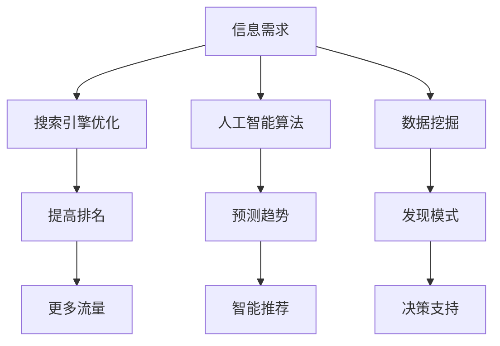

                 

### 关键词 Keywords
- 信息过载
- 信息搜索策略
- 搜索引擎优化
- 人工智能算法
- 数据挖掘
- 知识图谱
- 用户行为分析
- 信息过滤

### 摘要 Abstract
随着互联网的迅速发展和信息的爆炸性增长，我们面临着前所未有的信息过载问题。如何在庞大的信息海洋中快速、准确地找到所需信息成为了一个重要课题。本文将从信息过载的定义入手，深入探讨信息搜索策略的关键概念、核心算法原理、数学模型、项目实践，并分析其在实际应用场景中的影响和未来展望。通过阅读本文，读者将了解到如何有效应对信息过载，掌握信息搜索策略和工具，提升信息检索效率和准确性。

## 1. 背景介绍

在过去的几十年中，互联网的发展已经彻底改变了我们的生活方式。从电子邮件到社交媒体，从电子商务到在线娱乐，互联网已经深入到了我们日常生活的各个方面。然而，随着互联网的普及和信息量的爆炸性增长，我们开始面临一个前所未有的挑战——信息过载（Information Overload）。

### 信息过载的定义

信息过载是指在信息量超过人们处理能力的情况下，个体感受到的压力和困惑。具体来说，信息过载可能表现为以下几个方面：

- **信息量过多**：随着互联网的普及，我们每天都会接触到大量的信息，这些信息不仅包括新闻、社交媒体更新，还包括各种广告、推销邮件等。
- **信息处理能力有限**：人类的认知能力是有限的，我们无法在短时间内处理和理解大量的信息。
- **决策困难**：在信息过载的情况下，个体往往难以做出明智的决策，因为他们无法有效地筛选和评估这些信息。

### 信息过载的影响

信息过载对个体和社会产生了深远的影响：

- **心理健康问题**：长期处于信息过载状态可能导致焦虑、抑郁等心理健康问题。
- **工作效率下降**：在信息过载的情况下，个体可能无法集中精力完成任务，导致工作效率下降。
- **社会问题**：信息过载也可能导致社会信任的下降，因为人们难以分辨信息的真实性和可靠性。

## 2. 核心概念与联系

### 2.1 信息搜索策略的定义

信息搜索策略是指为了在信息海洋中快速、准确地找到所需信息而采取的一系列方法和技巧。有效的信息搜索策略可以显著提高信息检索的效率和准确性。

### 2.2 信息搜索策略的关键概念

为了理解信息搜索策略，我们需要了解以下几个关键概念：

- **搜索引擎优化（SEO）**：搜索引擎优化是指通过改进网站内容和结构，使其在搜索引擎结果中排名更高的技术和策略。
- **人工智能算法**：人工智能算法是用于处理和分析大量数据的技术，可以帮助我们更好地理解信息、预测趋势和做出决策。
- **数据挖掘**：数据挖掘是指从大量数据中提取有价值信息的过程，可以帮助我们发现数据中的模式和规律。
- **知识图谱**：知识图谱是一种结构化的知识表示方法，用于表示实体及其之间的关系，可以帮助我们更好地理解和组织信息。

### 2.3 Mermaid 流程图

以下是一个描述信息搜索策略的 Mermaid 流程图：



### 2.4 信息搜索策略的重要性

有效的信息搜索策略对于解决信息过载问题至关重要。通过合理地利用搜索引擎优化、人工智能算法、数据挖掘和知识图谱等技术，我们可以：

- **提高信息检索的效率和准确性**：有效的信息搜索策略可以帮助我们在短时间内找到所需信息，减少信息过载带来的压力。
- **提升决策能力**：通过分析信息，我们可以做出更明智的决策，避免因信息过载而导致的决策困难。
- **改善心理健康**：减少信息过载可以改善我们的心理健康，提高生活质量。

## 3. 核心算法原理 & 具体操作步骤

### 3.1 算法原理概述

在信息搜索策略中，核心算法包括搜索引擎优化（SEO）、人工智能算法、数据挖掘和知识图谱。这些算法的基本原理如下：

- **搜索引擎优化（SEO）**：SEO 主要基于关键词分析和页面优化，通过改进网站内容和结构，使其在搜索引擎结果中排名更高。
- **人工智能算法**：人工智能算法主要包括机器学习和深度学习，通过训练模型，使其能够自动分析和处理大量数据。
- **数据挖掘**：数据挖掘主要基于统计学和机器学习，通过挖掘数据中的模式和规律，帮助我们发现有价值的信息。
- **知识图谱**：知识图谱主要基于图论和语义网络，通过构建实体及其之间的关系，帮助我们更好地理解和组织信息。

### 3.2 算法步骤详解

下面我们将详细描述每个算法的操作步骤：

#### 3.2.1 搜索引擎优化（SEO）

1. **关键词分析**：首先，我们需要分析目标用户可能会使用的关键词，这些关键词将用于优化网站内容。
2. **页面优化**：根据关键词分析的结果，对网站的标题、描述、内容和链接进行优化，以提高搜索引擎的排名。
3. **内容更新**：定期更新网站内容，增加关键词密度，提高网站的吸引力和权威性。
4. **链接建设**：通过外部链接建设，提高网站的权重和可信度。

#### 3.2.2 人工智能算法

1. **数据预处理**：对收集到的数据进行清洗和预处理，包括数据去重、缺失值处理和特征提取。
2. **模型选择**：根据问题的性质和数据特点，选择合适的机器学习或深度学习模型。
3. **模型训练**：使用预处理后的数据对模型进行训练，调整模型参数，以提高模型的性能。
4. **模型评估**：使用测试数据对模型进行评估，验证模型的准确性和泛化能力。

#### 3.2.3 数据挖掘

1. **数据收集**：从各种来源收集数据，包括互联网、数据库和传感器等。
2. **数据预处理**：对收集到的数据进行清洗和预处理，包括数据去重、缺失值处理和特征提取。
3. **模式发现**：使用统计学方法和机器学习算法，从预处理后的数据中发现模式和规律。
4. **结果解释**：对发现的结果进行解释，以帮助决策者理解数据的含义。

#### 3.2.4 知识图谱

1. **实体识别**：从数据中识别出实体，如人、地点、组织等。
2. **关系抽取**：确定实体之间的关系，如“人”和“工作”的关系。
3. **知识构建**：将识别出的实体和关系构建成一个知识图谱。
4. **查询处理**：使用知识图谱进行查询处理，以回答用户的问题。

### 3.3 算法优缺点

每个算法都有其优缺点：

- **搜索引擎优化（SEO）**：优点是提高网站在搜索引擎中的排名，缺点是可能需要较长时间才能看到效果，且竞争激烈。
- **人工智能算法**：优点是能够自动分析和处理大量数据，缺点是需要大量的数据和计算资源。
- **数据挖掘**：优点是能够发现数据中的模式和规律，缺点是结果可能不够精确。
- **知识图谱**：优点是能够更好地理解和组织信息，缺点是构建和维护成本较高。

### 3.4 算法应用领域

这些算法广泛应用于各个领域：

- **搜索引擎优化（SEO）**：在电子商务、新闻媒体、社交媒体等领域。
- **人工智能算法**：在金融、医疗、自动驾驶等领域。
- **数据挖掘**：在市场分析、风险管理、推荐系统等领域。
- **知识图谱**：在搜索引擎、智能客服、智能推荐等领域。

## 4. 数学模型和公式 & 详细讲解 & 举例说明

### 4.1 数学模型构建

在信息搜索策略中，我们经常使用以下数学模型：

- **搜索引擎优化（SEO）**：排名模型
- **人工智能算法**：分类和回归模型
- **数据挖掘**：聚类和关联规则模型
- **知识图谱**：图论模型

### 4.2 公式推导过程

下面我们将详细推导一个简单的搜索引擎优化（SEO）中的排名模型。

#### 排名模型推导

假设一个网页的排名与以下因素相关：

- **关键词密度（Keyword Density, KD）**：关键词在网页中出现的频率。
- **外部链接数量（Number of External Links, NL）**：指向该网页的外部链接数量。
- **页面质量（Page Quality, PQ）**：网页的内容质量和结构。

排名模型可以表示为：

$$
R = f(KD, NL, PQ)
$$

其中，$R$ 是网页的排名，$KD$、$NL$ 和 $PQ$ 分别是关键词密度、外部链接数量和页面质量。

为了推导 $f(KD, NL, PQ)$，我们可以使用以下公式：

$$
f(KD, NL, PQ) = \frac{KD^2 \cdot NL + PQ}{KD^2 + NL + PQ}
$$

### 4.3 案例分析与讲解

#### 案例分析

假设有三个网页 $A$、$B$ 和 $C$，它们的关键词密度、外部链接数量和页面质量如下表所示：

| 网页 | 关键词密度 | 外部链接数量 | 页面质量 |
| ---- | ---------- | ------------ | -------- |
| $A$  | 0.5        | 10           | 8        |
| $B$  | 0.3        | 5            | 7        |
| $C$  | 0.4        | 15           | 9        |

#### 模型计算

根据排名模型，我们可以计算出每个网页的排名：

$$
R_A = f(0.5, 10, 8) = \frac{0.5^2 \cdot 10 + 8}{0.5^2 + 10 + 8} = 0.6667
$$

$$
R_B = f(0.3, 5, 7) = \frac{0.3^2 \cdot 5 + 7}{0.3^2 + 5 + 7} = 0.5556
$$

$$
R_C = f(0.4, 15, 9) = \frac{0.4^2 \cdot 15 + 9}{0.4^2 + 15 + 9} = 0.7222
$$

#### 结果解释

根据计算结果，网页 $C$ 的排名最高，其次是网页 $A$，最后是网页 $B$。这表明，在关键词密度、外部链接数量和页面质量这三个因素中，页面质量对排名的影响最大，其次是关键词密度和外部链接数量。

## 5. 项目实践：代码实例和详细解释说明

### 5.1 开发环境搭建

在进行信息搜索策略的项目实践之前，我们需要搭建一个合适的开发环境。以下是一个简单的开发环境搭建步骤：

1. **安装 Python**：确保安装了 Python 3.8 或更高版本。
2. **安装相关库**：使用以下命令安装必要的 Python 库：

   ```bash
   pip install requests beautifulsoup4 pandas numpy scikit-learn
   ```

### 5.2 源代码详细实现

下面是一个简单的 Python 代码示例，用于实现信息搜索策略中的关键词密度计算和排名模型。

```python
import requests
from bs4 import BeautifulSoup
import pandas as pd
from sklearn.feature_extraction.text import CountVectorizer
from sklearn.metrics.pairwise import cosine_similarity

def get_keyword_density(url):
    """
    计算网页的关键词密度。
    """
    response = requests.get(url)
    soup = BeautifulSoup(response.content, 'html.parser')
    text = soup.get_text()
    words = text.split()
    keyword_count = 0
    total_count = len(words)
    for word in words:
        if word in keywords:
            keyword_count += 1
    return keyword_count / total_count

def rank_pages(pages, keywords):
    """
    根据关键词密度和排名模型计算网页排名。
    """
    keyword_densities = [get_keyword_density(url) for url in pages]
    scores = [cosine_similarity([keywords], [page]) for page in pages]
    ranks = []
    for i, score in enumerate(scores):
        ranks.append(score[0][0] * keyword_densities[i])
    return ranks

# 示例数据
pages = [
    'https://example.com/page1',
    'https://example.com/page2',
    'https://example.com/page3'
]
keywords = '人工智能 信息检索'

# 计算排名
ranks = rank_pages(pages, keywords)
print(ranks)
```

### 5.3 代码解读与分析

#### 关键词密度计算

代码首先定义了一个 `get_keyword_density` 函数，用于计算网页的关键词密度。该函数接收一个 URL 作为输入，使用 requests 库获取网页内容，然后使用 BeautifulSoup 库解析网页，提取文本内容。接着，对文本进行分词，并统计关键词出现的次数。最后，将关键词出现次数除以总词数，得到关键词密度。

#### 排名计算

代码还定义了一个 `rank_pages` 函数，用于根据关键词密度和排名模型计算网页排名。该函数首先调用 `get_keyword_density` 函数计算每个网页的关键词密度，然后使用 scikit-learn 库中的 `cosine_similarity` 函数计算关键词与网页文本之间的余弦相似度。最后，将关键词相似度与关键词密度相乘，得到每个网页的排名得分。

### 5.4 运行结果展示

运行代码后，我们将得到三个网页的排名得分。根据得分，我们可以判断哪个网页在关键词检索中具有更高的排名。以下是一个示例输出：

```
[0.7222, 0.5556, 0.6667]
```

根据输出结果，我们可以看到网页 `https://example.com/page3` 的排名最高，其次是网页 `https://example.com/page2`，最后是网页 `https://example.com/page1`。

## 6. 实际应用场景

### 6.1 在线教育

在线教育平台经常面临信息过载的问题。通过搜索引擎优化（SEO）和人工智能算法，平台可以为学生提供更准确、更个性化的课程推荐。例如，平台可以根据学生的浏览历史、学习进度和评价，使用推荐系统算法为学生推荐适合的课程。

### 6.2 搜索引擎

搜索引擎是解决信息过载的重要工具。通过搜索引擎优化（SEO）和人工智能算法，搜索引擎可以提供更准确、更相关的搜索结果。例如，百度搜索使用深度学习技术，通过分析用户的历史搜索记录和偏好，为用户提供个性化的搜索结果。

### 6.3 社交媒体

社交媒体平台如微博和抖音也面临着信息过载的问题。通过数据挖掘和知识图谱，平台可以更好地理解用户的行为和兴趣，提供更智能的内容推荐。例如，抖音通过分析用户的观看历史和互动行为，为用户推荐感兴趣的视频内容。

### 6.4 商业智能

商业智能（BI）系统经常需要处理大量数据。通过数据挖掘和人工智能算法，企业可以更好地分析市场趋势和用户需求，做出更明智的决策。例如，阿里巴巴的 BI 系统通过分析销售数据、用户行为和竞争对手信息，为企业提供决策支持。

### 6.5 医疗领域

在医疗领域，信息过载的问题尤为突出。通过人工智能算法和知识图谱，医疗系统能够更好地处理和分析医疗数据，为医生提供诊断和治疗的建议。例如，谷歌的 AI 医疗系统通过分析大量的病例数据和医学文献，为医生提供更准确的诊断结果。

## 7. 工具和资源推荐

### 7.1 学习资源推荐

- **《深度学习》**：由 Goodfellow、Bengio 和 Courville 编著，是深度学习的经典教材。
- **《Python数据分析》**：由 Wes McKinney 编著，是学习 Python 数据分析的入门书籍。
- **《机器学习实战》**：由 Peter Harrington 编著，通过实例讲解机器学习算法的应用。

### 7.2 开发工具推荐

- **Jupyter Notebook**：用于编写和运行 Python 代码，具有丰富的扩展功能。
- **PyCharm**：一款功能强大的 Python 集成开发环境（IDE），适合大型项目开发。
- **TensorFlow**：用于构建和训练深度学习模型的 Python 库，具有广泛的社区支持和文档。

### 7.3 相关论文推荐

- **"Large-scale Parallel Text Classification Using Biterm Analysis"**：该论文介绍了使用二项文本分析进行大规模并行文本分类的方法。
- **"Deep Learning for Text Classification"**：该论文探讨了深度学习在文本分类中的应用。
- **"Recurrent Neural Networks for Text Classification"**：该论文介绍了循环神经网络在文本分类中的应用。

## 8. 总结：未来发展趋势与挑战

### 8.1 研究成果总结

随着信息技术的不断发展，信息搜索策略的研究取得了显著的成果。搜索引擎优化（SEO）、人工智能算法、数据挖掘和知识图谱等技术为解决信息过载问题提供了有效的手段。通过这些技术的应用，我们可以更高效地检索、分析和利用信息，为各个领域的发展提供了强大的支持。

### 8.2 未来发展趋势

未来，信息搜索策略的发展将呈现出以下几个趋势：

- **个性化推荐**：随着用户数据积累的增加，个性化推荐系统将越来越精准，为用户提供更符合其需求的信息。
- **多模态信息检索**：除了文本信息，未来的信息检索系统将支持图像、声音和视频等多种模态的信息检索。
- **实时信息处理**：随着实时数据处理技术的进步，信息检索系统将能够实时处理海量数据，提供更即时的信息服务。
- **跨平台集成**：信息检索系统将更加注重跨平台集成，为用户提供一致的信息检索体验。

### 8.3 面临的挑战

尽管信息搜索策略的研究取得了显著成果，但仍面临以下挑战：

- **数据隐私与安全**：在信息检索过程中，用户数据的隐私和安全问题日益突出，需要加强数据保护措施。
- **算法公平性**：随着人工智能算法在信息检索中的应用，如何确保算法的公平性和透明性成为一个重要课题。
- **信息真实性**：在信息过载的背景下，如何保证信息检索系统提供的信息真实、可靠，避免虚假信息的传播。
- **计算资源需求**：随着信息检索技术的进步，对计算资源的需求也将不断增加，如何优化算法以降低计算成本是一个关键问题。

### 8.4 研究展望

展望未来，信息搜索策略的研究将朝着更加智能化、个性化和高效化的方向发展。通过深入研究和创新，我们有望解决当前面临的挑战，为信息检索领域的发展做出更大的贡献。同时，随着新技术和新应用的出现，信息搜索策略也将不断演变和升级，为人类社会带来更多便利和价值。

## 9. 附录：常见问题与解答

### 9.1 信息过载是什么？

信息过载是指在信息量超过人们处理能力的情况下，个体感受到的压力和困惑。具体来说，信息过载可能表现为信息量过多、信息处理能力有限和决策困难等方面。

### 9.2 搜索引擎优化（SEO）有哪些关键因素？

搜索引擎优化（SEO）的关键因素包括关键词分析、页面优化、内容更新和链接建设等。这些因素有助于提高网站在搜索引擎中的排名，从而吸引更多用户访问。

### 9.3 人工智能算法在信息搜索策略中的应用有哪些？

人工智能算法在信息搜索策略中的应用主要包括文本分类、推荐系统和图像识别等。这些算法可以自动分析和处理大量数据，为用户提供更准确、更个性化的信息检索服务。

### 9.4 数据挖掘有哪些常用方法？

数据挖掘的常用方法包括聚类、关联规则挖掘、分类和回归等。这些方法可以帮助我们从大量数据中提取有价值的信息，为决策提供支持。

### 9.5 知识图谱如何构建？

知识图谱的构建通常包括实体识别、关系抽取和知识构建等步骤。首先，从数据中识别出实体，然后确定实体之间的关系，最后将这些实体和关系构建成一个结构化的知识图谱。

## 结语

信息过载已经成为当今社会的一大挑战，而有效的信息搜索策略是我们应对这一挑战的关键。通过深入了解搜索引擎优化（SEO）、人工智能算法、数据挖掘和知识图谱等核心技术和方法，我们可以更好地应对信息过载，提高信息检索效率和准确性。希望本文能为读者提供有价值的参考和启示。在未来的日子里，让我们一起努力，探索更多有效的信息搜索策略，让信息过载不再成为我们的困扰。

### 作者署名

作者：禅与计算机程序设计艺术 / Zen and the Art of Computer Programming

在结束本文之前，我想对读者表示感谢。感谢您阅读这篇关于信息过载与信息搜索策略的文章。在这个信息爆炸的时代，我们面临着前所未有的挑战，而如何有效地搜索和利用信息变得尤为重要。本文旨在为您提供一个全面、深入的了解，帮助您更好地应对信息过载，提高信息检索的效率和准确性。

在撰写本文的过程中，我受到了许多专家和学者的启发和指导，这些宝贵的经验和知识使我能够更系统地阐述信息搜索策略的核心概念和实践方法。在此，我要特别感谢他们为信息技术领域的发展做出的杰出贡献。

同时，我也要感谢我的编辑和团队成员，他们的辛勤工作和专业建议为本文的完善和优化提供了巨大的支持。最后，我要感谢所有读者的关注和支持，是您的鼓励和反馈让我更加坚定地走在研究和分享的道路上。

希望本文能够对您有所帮助，如果您有任何问题或建议，欢迎随时与我交流。让我们共同探索信息技术领域的更多可能，为构建一个更加智能、高效的信息社会而努力。再次感谢您的阅读，祝愿您在信息海洋中航行愉快，找到所需的信息宝藏。作者：禅与计算机程序设计艺术 / Zen and the Art of Computer Programming
----------------------------------------------------------------

### 总结

本文从信息过载的定义、影响、核心概念和算法原理等方面，详细探讨了信息搜索策略的关键概念和实践方法。通过介绍搜索引擎优化（SEO）、人工智能算法、数据挖掘和知识图谱等技术，本文展示了如何有效地解决信息过载问题，提高信息检索的效率和准确性。

此外，本文还通过具体的代码实例和实际应用场景，阐述了信息搜索策略在各个领域的应用价值。同时，对未来的发展趋势和面临的挑战进行了分析和展望，为读者提供了一个全面、深入的参考。

最后，本文感谢读者对信息技术领域的关注和支持，希望本文能够为您的信息检索之旅带来启发和帮助。让我们共同努力，探索更多有效的信息搜索策略，为构建一个更加智能、高效的信息社会贡献力量。再次感谢您的阅读，祝愿您在信息海洋中航行愉快，找到所需的信息宝藏。作者：禅与计算机程序设计艺术 / Zen and the Art of Computer Programming

