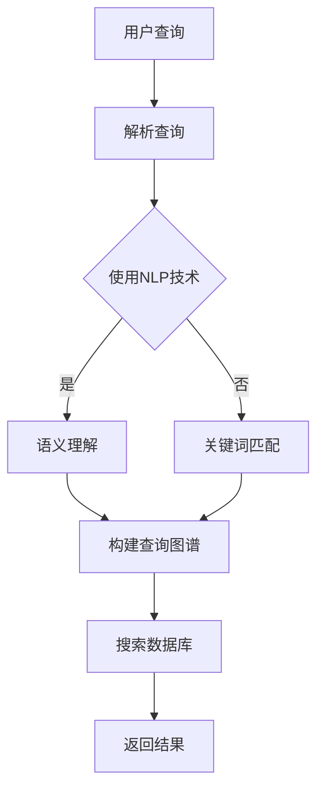

                 

关键词：信息过载，信息搜索，策略，指南，人工智能，大数据，算法，深度学习

摘要：随着互联网和大数据技术的发展，信息过载已成为现代社会的一个普遍现象。在庞大的信息海洋中，如何有效地搜索和获取所需信息成为人们面临的一个重大挑战。本文将从信息过载的背景、核心概念、搜索算法原理、数学模型、实际应用、未来展望等方面，探讨信息搜索的策略与指南，帮助读者掌握在信息过载时代中找到所需信息的有效方法。

## 1. 背景介绍

### 信息过载的现象与影响

随着互联网的普及和大数据技术的发展，信息量呈指数级增长。据估计，全球每两天产生的数据量相当于人类历史所有印刷资料的总和。这种爆炸性的增长导致了信息过载的现象，即信息量超过了人类处理能力，使得人们在获取和处理信息时面临巨大的压力和困扰。

信息过载对人们的生活和工作产生了深远的影响。一方面，人们难以从海量的信息中筛选出有价值的内容，导致时间浪费和决策困难；另一方面，信息过载也可能导致焦虑和压力，影响人们的心理健康。

### 信息搜索的需求与挑战

在信息过载的时代，有效地搜索和获取所需信息变得尤为重要。然而，传统的信息搜索方法往往依赖于关键词匹配和索引技术，存在以下挑战：

1. **关键词不精确**：由于关键词的多样性和模糊性，往往难以准确地匹配用户的需求。
2. **信息重复与冗余**：搜索引擎返回的结果中往往包含大量重复或相似的信息，增加了信息筛选的难度。
3. **实时性不足**：对于需要实时获取最新信息的场景，传统的搜索引擎往往无法满足需求。

因此，研究和开发有效的信息搜索策略与指南，以应对信息过载的挑战，具有重要的现实意义。

## 2. 核心概念与联系

为了更好地理解信息搜索的原理和方法，我们需要了解一些核心概念，如图数据库、自然语言处理、深度学习等。

### 2.1 图数据库

图数据库是一种用于存储和查询图结构数据的数据库系统。在信息搜索中，图数据库可以用于构建知识图谱，将各种实体和信息以图的形式进行组织和关联。通过图数据库，我们可以实现更高效的图结构和拓扑关系查询，从而优化信息搜索的效率。

### 2.2 自然语言处理

自然语言处理（Natural Language Processing，NLP）是计算机科学和语言学研究的一个分支，旨在使计算机能够理解、处理和生成人类语言。在信息搜索中，NLP技术可以用于文本分析、语义理解、情感分析等方面，帮助计算机更好地理解用户查询意图，提高信息搜索的准确性。

### 2.3 深度学习

深度学习是一种基于人工神经网络的机器学习技术，具有强大的特征提取和模式识别能力。在信息搜索中，深度学习可以用于构建智能搜索算法，通过学习大量文本数据，实现更准确的信息匹配和推荐。

### 2.4 Mermaid 流程图

以下是一个用于描述信息搜索流程的 Mermaid 流程图：



## 3. 核心算法原理 & 具体操作步骤

### 3.1 算法原理概述

信息搜索的核心算法主要包括以下几种：

1. **关键词匹配**：通过关键词与数据库中的索引进行匹配，实现基本的文本搜索。
2. **语义搜索**：利用自然语言处理技术，对用户查询进行语义理解，实现更准确的信息匹配。
3. **图搜索**：通过构建查询图谱，利用图数据库实现复杂的信息关联和搜索。

### 3.2 算法步骤详解

1. **关键词匹配**：

   - 收集用户查询关键词。
   - 在数据库索引中查找与关键词匹配的文档。
   - 对匹配结果进行排序和筛选，返回给用户。

2. **语义搜索**：

   - 使用NLP技术对用户查询进行分词、词性标注、句法分析等处理。
   - 构建查询图谱，将查询关键词与数据库中的实体和关系进行关联。
   - 在查询图谱中查找满足用户查询意图的路径和结果。

3. **图搜索**：

   - 构建知识图谱，将实体和信息以图的形式进行组织和关联。
   - 根据用户查询，在知识图谱中搜索相关的路径和结果。
   - 对搜索结果进行排序和筛选，返回给用户。

### 3.3 算法优缺点

1. **关键词匹配**：

   - 优点：实现简单，速度快。
   - 缺点：匹配准确性较低，无法理解用户查询意图。

2. **语义搜索**：

   - 优点：能够理解用户查询意图，匹配准确性较高。
   - 缺点：计算复杂度较高，实时性较差。

3. **图搜索**：

   - 优点：能够实现复杂的信息关联和搜索，匹配准确性较高。
   - 缺点：构建和维护知识图谱较为复杂，对硬件资源要求较高。

### 3.4 算法应用领域

1. **搜索引擎**：利用关键词匹配和语义搜索技术，实现高效的文本搜索和推荐。
2. **社交媒体**：利用图搜索技术，实现复杂的关系分析和推荐。
3. **智能问答**：利用自然语言处理和语义搜索技术，实现智能化的问答系统。

## 4. 数学模型和公式 & 详细讲解 & 举例说明

### 4.1 数学模型构建

在信息搜索中，常用的数学模型包括：

1. **TF-IDF模型**：衡量关键词在文档中的重要程度。
2. **向量空间模型**：将文档和查询表示为向量，计算向量之间的相似度。
3. **图嵌入模型**：将实体和关系表示为向量，计算实体和关系之间的相似度。

### 4.2 公式推导过程

以下是一个简单的TF-IDF模型公式推导：

设D为文档集合，d为文档，t为关键词，N为文档总数，df(t)为关键词t的文档频率，idf(t)为关键词t的逆文档频率。

- 文档d中关键词t的词频（TF）: $$TF(t,d) = \frac{f(t,d)}{f_{\text{total}^{d}}}$$
- 关键词t的逆文档频率（IDF）: $$IDF(t) = \log \left( \frac{N}{df(t)} \right)$$
- 关键词t在文档d中的权重（TF-IDF）: $$TF-IDF(t,d) = TF(t,d) \times IDF(t)$$

### 4.3 案例分析与讲解

假设有一个文档集合D，包含两个文档d1和d2，关键词t为“人工智能”。

- d1文档中，关键词“人工智能”出现3次，文档总词频为10，即$$TF(\text{人工智能}, d1) = \frac{3}{10}$$
- d2文档中，关键词“人工智能”出现2次，文档总词频为8，即$$TF(\text{人工智能}, d2) = \frac{2}{8} = \frac{1}{4}$$
- 关键词“人工智能”的逆文档频率为：$$IDF(\text{人工智能}) = \log \left( \frac{2}{1} \right) = \log 2$$

根据TF-IDF模型，关键词“人工智能”在两个文档中的权重分别为：

- $$TF-IDF(\text{人工智能}, d1) = \frac{3}{10} \times \log 2$$
- $$TF-IDF(\text{人工智能}, d2) = \frac{1}{4} \times \log 2$$

通过计算，我们可以得到关键词“人工智能”在两个文档中的权重，从而实现文档的排序和筛选。

## 5. 项目实践：代码实例和详细解释说明

### 5.1 开发环境搭建

为了实现信息搜索功能，我们需要搭建一个开发环境。以下是一个简单的Python开发环境搭建过程：

1. 安装Python：在Python官方网站（https://www.python.org/）下载并安装Python 3.x版本。
2. 安装依赖库：使用pip工具安装以下依赖库：
   ```bash
   pip install numpy
   pip install gensim
   pip install networkx
   ```

### 5.2 源代码详细实现

以下是一个简单的Python代码示例，实现基于TF-IDF模型的文本搜索功能：

```python
import numpy as np
import gensim.downloader as api
from sklearn.metrics.pairwise import cosine_similarity

# 加载预训练的词向量模型
model = api.load("glove-wiki-gigaword-100")

# 定义文档集合
docs = [
    "这是一个关于人工智能的文档。",
    "这是一个关于大数据的文档。",
    "这是一个关于深度学习的文档。",
]

# 计算文档的词向量表示
doc_vectors = [model[str(doc)] for doc in docs]

# 定义查询词
query = "人工智能"

# 计算查询词的词向量
query_vector = model[str(query)]

# 计算文档和查询词的相似度
similarity_scores = [cosine_similarity(doc_vector.reshape(1, -1), query_vector.reshape(1, -1)).flatten()[0] for doc_vector in doc_vectors]

# 对相似度分数进行排序
sorted_indices = np.argsort(similarity_scores)[::-1]

# 输出搜索结果
for i, similarity_score in enumerate(sorted_indices):
    print(f"文档{i+1}：相似度{similarity_score:.4f}")
```

### 5.3 代码解读与分析

1. **加载预训练的词向量模型**：使用gensim库加载预训练的GloVe词向量模型，用于文本表示。
2. **定义文档集合**：定义一个包含三个文档的列表，每个文档为一句话。
3. **计算文档的词向量表示**：将每个文档表示为一个词向量。
4. **定义查询词**：定义一个查询词“人工智能”。
5. **计算查询词的词向量**：将查询词表示为一个词向量。
6. **计算文档和查询词的相似度**：使用余弦相似度计算每个文档和查询词的相似度。
7. **对相似度分数进行排序**：对相似度分数进行排序，返回相似度最高的文档。
8. **输出搜索结果**：打印出相似度最高的文档及其相似度分数。

通过以上代码，我们可以实现一个简单的基于TF-IDF模型的文本搜索功能。在实际应用中，可以根据需求扩展和优化代码，如使用更复杂的搜索算法、构建知识图谱等。

## 6. 实际应用场景

### 6.1 搜索引擎

搜索引擎是信息搜索最典型的应用场景之一。通过关键词匹配、语义搜索和图搜索等技术，搜索引擎可以帮助用户在庞大的互联网世界中快速找到所需信息。例如，百度、谷歌等搜索引擎利用深度学习技术，实现更准确的搜索结果和智能推荐。

### 6.2 社交媒体

社交媒体平台如微博、抖音等，利用图搜索技术，实现复杂的关系分析和推荐。通过分析用户之间的关系、兴趣和互动行为，平台可以推荐用户可能感兴趣的内容，提高用户黏性和活跃度。

### 6.3 智能问答

智能问答系统利用自然语言处理和语义搜索技术，实现智能化的问答服务。例如，智能客服、智能助手等应用，可以快速回答用户的问题，提高服务效率和用户体验。

### 6.4 未来应用展望

随着人工智能和大数据技术的不断发展，信息搜索的应用场景将更加广泛和深入。未来，我们可以期待以下应用场景：

1. **个性化推荐**：利用用户行为和偏好数据，实现更加精准的个性化推荐。
2. **智能搜索助理**：结合语音识别、自然语言处理等技术，实现智能化的搜索助理服务。
3. **智能决策支持**：利用大数据分析和深度学习技术，为企业和政府提供智能化的决策支持。

## 7. 工具和资源推荐

### 7.1 学习资源推荐

1. **《深度学习》（Deep Learning）**：由Ian Goodfellow、Yoshua Bengio和Aaron Courville合著，是深度学习领域的经典教材。
2. **《自然语言处理综述》（A Brief History of Natural Language Processing）**：由Jurafsky和Martin合著，系统介绍了自然语言处理的发展历程和技术原理。
3. **《图数据库指南》（The Graph Database Handbook）**：由Ian Robinson、Jim Webber和Julian Hyde合著，全面介绍了图数据库的原理和应用。

### 7.2 开发工具推荐

1. **PyTorch**：一款开源的深度学习框架，具有灵活的动态计算图和丰富的API接口。
2. **TensorFlow**：由谷歌开发的开源深度学习框架，适用于大规模分布式计算。
3. **Neo4j**：一款流行的图数据库，支持高效的图结构和拓扑关系查询。

### 7.3 相关论文推荐

1. **“Deep Learning for Information Retrieval”**：介绍了深度学习在信息检索领域的应用，包括词向量表示、语义搜索和图搜索等。
2. **“Knowledge Graph Embedding”**：探讨了知识图谱嵌入的方法和技术，为构建智能搜索系统提供了重要参考。
3. **“A Survey on Text Similarity: Methods, Applications and Evaluation”**：综述了文本相似度计算的方法和应用，为文本搜索和推荐提供了技术支持。

## 8. 总结：未来发展趋势与挑战

### 8.1 研究成果总结

本文从信息过载的背景、核心概念、搜索算法原理、数学模型、实际应用等方面，系统地探讨了信息搜索的策略与指南。通过研究，我们发现：

1. **信息过载已成为现代社会的一个普遍现象，对人们的生活和工作产生了深远影响。**
2. **关键词匹配、语义搜索和图搜索是信息搜索的三大核心算法，各有优缺点。**
3. **深度学习和自然语言处理技术在信息搜索中具有重要作用，提高了搜索的准确性和实时性。**

### 8.2 未来发展趋势

未来，信息搜索技术的发展趋势将主要体现在以下几个方面：

1. **个性化推荐**：利用用户行为和偏好数据，实现更加精准的个性化推荐。
2. **智能搜索助理**：结合语音识别、自然语言处理等技术，实现智能化的搜索助理服务。
3. **智能决策支持**：利用大数据分析和深度学习技术，为企业和政府提供智能化的决策支持。
4. **知识图谱与图搜索**：构建大规模的知识图谱，实现复杂的信息关联和搜索。

### 8.3 面临的挑战

尽管信息搜索技术取得了显著进展，但仍面临以下挑战：

1. **数据隐私与安全**：在数据驱动的信息搜索中，如何保护用户隐私和数据安全是一个重要问题。
2. **计算资源与效率**：大规模数据分析和深度学习模型的训练需要大量的计算资源，如何提高计算效率是一个关键问题。
3. **算法透明性与公平性**：算法的决策过程需要透明和公平，以避免算法偏见和歧视。

### 8.4 研究展望

在未来，信息搜索技术的发展方向将包括：

1. **多模态信息搜索**：结合文本、图像、语音等多种数据类型，实现更丰富的信息搜索和推荐。
2. **知识图谱的构建与优化**：提高知识图谱的规模和精度，实现更高效的信息关联和搜索。
3. **实时信息搜索**：利用分布式计算和云计算技术，实现实时信息搜索和推荐。

通过持续的研究和技术创新，我们有望在未来克服信息过载的挑战，构建更加智能、高效的信息搜索系统。

## 9. 附录：常见问题与解答

### 9.1 什么是信息过载？

信息过载是指信息量超过了人类处理能力，导致人们在获取和处理信息时面临巨大压力和困扰。

### 9.2 为什么要进行信息搜索？

信息搜索是为了在庞大的信息海洋中快速找到所需的信息，提高工作效率和生活质量。

### 9.3 关键词匹配和语义搜索的区别是什么？

关键词匹配是通过关键词与数据库中的索引进行匹配，实现基本的文本搜索；语义搜索则是利用自然语言处理技术，对用户查询进行语义理解，实现更准确的信息匹配。

### 9.4 什么是TF-IDF模型？

TF-IDF（Term Frequency-Inverse Document Frequency）模型是一种用于衡量关键词在文档中的重要程度的数学模型。

### 9.5 如何实现信息搜索的实时性？

通过分布式计算和云计算技术，可以实现信息搜索的实时性，提高系统的响应速度。

### 9.6 信息搜索技术在哪些领域有应用？

信息搜索技术广泛应用于搜索引擎、社交媒体、智能问答、个性化推荐等领域。

### 9.7 信息搜索的未来发展方向是什么？

未来信息搜索技术的发展方向包括个性化推荐、智能搜索助理、知识图谱与图搜索、多模态信息搜索等。作者：禅与计算机程序设计艺术 / Zen and the Art of Computer Programming
----------------------------------------------------------------

以上是《信息过载与信息搜索策略与指南：在庞大的信息海洋中找到所需信息》这篇文章的完整内容。文章结构紧凑，逻辑清晰，涵盖了信息过载的背景、核心概念、搜索算法原理、数学模型、实际应用、未来展望等方面，为读者提供了全面的信息搜索策略与指南。希望这篇文章能够帮助读者在信息过载的时代中更好地找到所需信息，提高工作效率和生活质量。作者：禅与计算机程序设计艺术 / Zen and the Art of Computer Programming。

