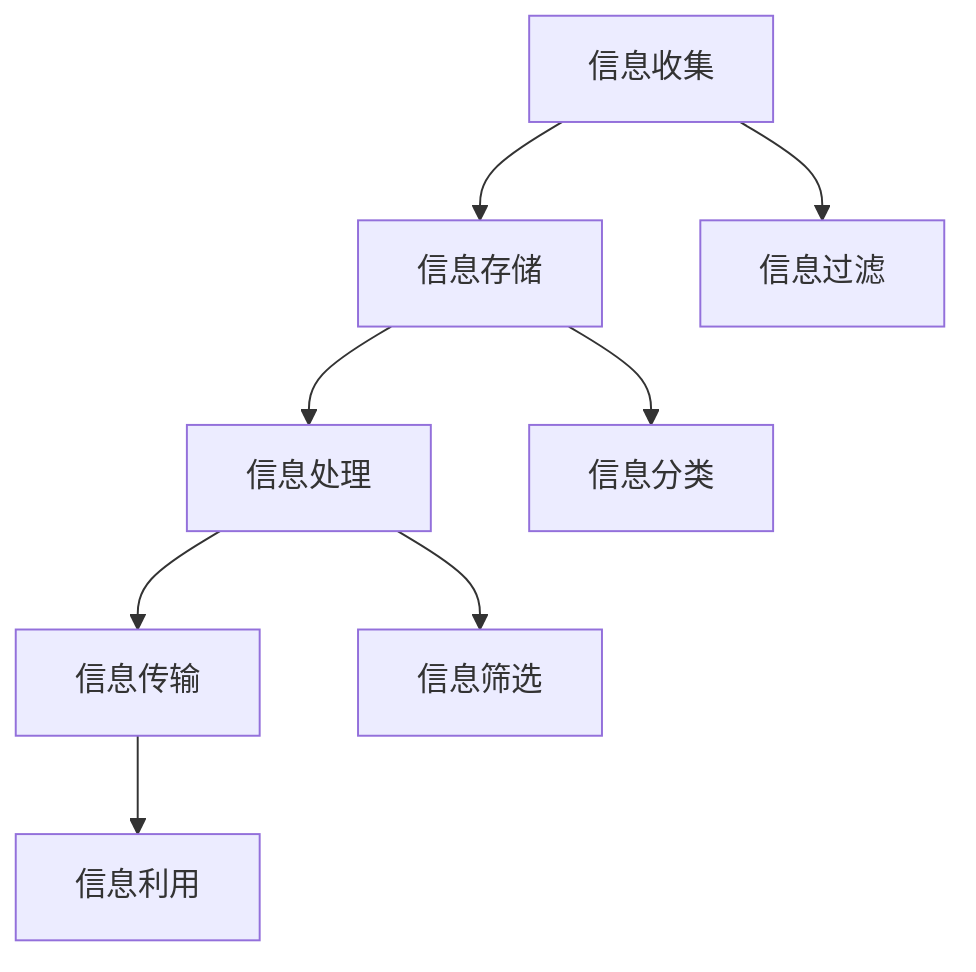

                 

 **关键词**：信息过载、信息焦虑、心理健康、信息管理、算法原理、应用实践

> **摘要**：本文将探讨在现代社会中普遍存在的现象——信息过载与信息焦虑，并深入分析其对心理健康的影响。我们将从技术视角出发，介绍一系列有效的信息管理方法和算法原理，旨在帮助读者掌握如何通过科学的管理信息摄入来改善心理健康。此外，文章还将分享一些实际应用案例，并提供未来发展趋势与挑战的展望。

## 1. 背景介绍

在当今这个信息爆炸的时代，人们面临的信息量日益增长，导致越来越多的个体感受到信息过载的困扰。信息过载不仅使人们难以有效地处理和消化信息，还可能导致一系列心理健康问题，如焦虑、抑郁、疲劳等。而信息焦虑则是指人们在面对大量信息时产生的不安和紧张感，常常与缺乏信息处理能力和时间管理能力有关。

近年来，随着互联网和移动设备的普及，信息过载现象愈加严重，许多人每天都要面对大量的邮件、社交媒体更新、新闻资讯等。这种持续的、无序的信息摄入方式不仅占用了大量的时间和精力，还可能引发严重的心理压力。长期处于这种状态的人，很容易出现注意力难以集中、记忆力下降、情绪波动等症状，严重时甚至可能发展为心理障碍。

## 2. 核心概念与联系

### 2.1 信息管理基本概念

信息管理是指通过系统的、有组织的方法对信息进行收集、存储、处理、传输和利用的过程。有效的信息管理能够帮助个体和组织提高信息利用效率，降低信息处理成本，从而更好地应对信息过载的挑战。

#### 信息收集

信息收集是信息管理的第一步，它涉及从各种来源获取有用的信息。有效的信息收集需要考虑信息来源的可靠性、信息内容的准确性和信息更新的及时性。

#### 信息存储

信息存储是指将收集到的信息进行分类、归档和保存，以便日后查询和使用。现代信息技术，如数据库、云存储等，为信息存储提供了强大的支持。

#### 信息处理

信息处理包括对信息进行筛选、整理、分析和加工，以便提取有价值的信息。信息处理的目的是提高信息的可用性和可理解性。

#### 信息传输

信息传输是指将处理后的信息传递给需要的人或系统。高效的传输方式可以确保信息能够及时地到达目的地，从而提高信息利用率。

#### 信息利用

信息利用是指通过应用和共享信息来创造价值。有效的信息利用能够促进知识的传播和创新，从而提高个人和组织的竞争力。

### 2.2 心理健康与信息管理的关系

心理健康与信息管理之间存在密切的联系。有效的信息管理能够帮助个体和组织更好地应对信息过载，从而减轻心理压力，提高心理健康水平。

#### 减轻信息焦虑

通过有效的信息管理方法，如信息过滤、信息分类和信息筛选，可以减少无意义、冗余信息的摄入，从而减轻信息焦虑。

#### 提高信息处理能力

有效的信息管理可以提高个体的信息处理能力，使其能够更高效地处理和利用信息，从而减少因信息处理困难而产生的焦虑和压力。

#### 促进心理健康

通过合理的信息管理，个体可以更好地分配时间和精力，减少过度工作、熬夜等不良习惯，从而促进身心健康。

### 2.3 Mermaid 流程图

以下是一个用于描述信息管理流程的 Mermaid 流程图：



## 3. 核心算法原理 & 具体操作步骤

### 3.1 算法原理概述

为了有效地管理信息，我们需要运用一些核心算法原理，以优化信息处理流程。以下是几个常用的算法原理：

#### 信息过滤算法

信息过滤算法通过预先设定的一组规则或模型，对传入的信息进行自动筛选，去除不相关的信息。常见的过滤算法包括基于关键词的过滤、基于内容的过滤和基于用户行为的过滤。

#### 信息分类算法

信息分类算法将信息按照一定的标准进行分类，以便于存储、检索和利用。常见的分类算法包括基于规则的分类、基于机器学习的分类和基于语义的分类。

#### 信息筛选算法

信息筛选算法通过评估信息的价值或相关性，选择性地保留或删除信息。常见的筛选算法包括基于阈值的筛选和基于模型的筛选。

### 3.2 算法步骤详解

#### 信息过滤算法步骤

1. **设定过滤规则**：根据用户需求，设定一组过滤规则，如关键词列表、主题类别等。
2. **接收信息**：从各种渠道获取信息，如电子邮件、社交媒体、新闻网站等。
3. **应用过滤规则**：对每条信息应用设定的过滤规则，判断其是否符合要求。
4. **处理过滤结果**：对过滤后的信息进行存储、处理或丢弃。

#### 信息分类算法步骤

1. **收集训练数据**：从已存储的信息中收集样本数据，用于训练分类模型。
2. **选择分类模型**：根据数据特点和需求，选择合适的分类模型，如朴素贝叶斯分类器、支持向量机等。
3. **训练分类模型**：使用收集到的训练数据，训练分类模型，使其能够识别不同类别的信息。
4. **分类新信息**：对新的信息应用训练好的分类模型，进行分类。

#### 信息筛选算法步骤

1. **设定筛选标准**：根据用户需求，设定一组筛选标准，如信息的相关性、价值等。
2. **评估信息**：对每条信息进行评估，判断其是否符合筛选标准。
3. **处理筛选结果**：对筛选后的信息进行存储、处理或丢弃。

### 3.3 算法优缺点

#### 信息过滤算法

**优点**：

- **快速处理**：能够快速处理大量信息，减少冗余信息。
- **自动化**：通过预设规则，实现自动化过滤，节省人力成本。

**缺点**：

- **误过滤**：可能误过滤重要信息，导致信息丢失。
- **适应性差**：难以适应复杂的信息环境，尤其是多变的信息场景。

#### 信息分类算法

**优点**：

- **结构化信息**：将无序信息转化为有序结构，便于存储和检索。
- **提高效率**：通过自动化分类，提高信息处理效率。

**缺点**：

- **准确性**：分类准确性受数据质量和模型选择影响，可能存在误分类。
- **复杂度**：模型训练和分类过程较为复杂，计算资源消耗大。

#### 信息筛选算法

**优点**：

- **精准筛选**：能够根据用户需求，精准筛选有价值的信息。
- **灵活性强**：可根据不同需求，设定不同的筛选标准。

**缺点**：

- **效率**：筛选过程可能较为耗时，影响信息处理速度。
- **依赖规则**：筛选效果受筛选规则影响，规则设置不当可能导致筛选失败。

### 3.4 算法应用领域

#### 信息过滤算法

- **社交媒体**：过滤垃圾邮件、广告等不相关信息。
- **新闻推送**：根据用户兴趣，推送个性化新闻。
- **搜索引擎**：过滤搜索结果中的冗余信息，提高搜索效率。

#### 信息分类算法

- **邮件管理**：自动分类邮件，便于用户快速查找。
- **文档管理**：将文档按照主题、作者等进行分类，便于存储和检索。
- **图像识别**：将图像按照内容或场景进行分类，用于图像搜索和数据分析。

#### 信息筛选算法

- **推荐系统**：筛选出用户可能感兴趣的商品或内容。
- **数据挖掘**：从大量数据中筛选出有价值的信息，用于分析预测。
- **风险控制**：筛选出高风险的交易或行为，用于风险管理和欺诈检测。

## 4. 数学模型和公式 & 详细讲解 & 举例说明

### 4.1 数学模型构建

为了更好地理解信息管理中的算法原理，我们可以构建一个基本的数学模型。该模型将涵盖信息收集、存储、处理、传输和利用等过程。

#### 信息收集模型

设 \( I \) 为信息集合，\( P \) 为信息来源集合，\( R \) 为信息规则集合，\( F \) 为过滤函数，\( C \) 为分类函数，\( S \) 为筛选函数。

模型公式如下：

\[ I = \{ i | i \in P, F(i) \} \]

其中，\( F(i) \) 表示对信息 \( i \) 进行过滤的结果。

#### 信息存储模型

设 \( S \) 为信息存储集合，\( D \) 为数据库，\( E \) 为信息提取函数。

模型公式如下：

\[ S = \{ s | s \in D, E(s) \} \]

其中，\( E(s) \) 表示从信息 \( s \) 中提取有用信息。

#### 信息处理模型

设 \( P_h \) 为信息处理集合，\( A \) 为算法集合，\( T \) 为传输函数，\( U \) 为利用函数。

模型公式如下：

\[ P_h = \{ p_h | p_h \in A, T(p_h) \} \]

其中，\( T(p_h) \) 表示信息 \( p_h \) 的传输过程。

#### 信息传输模型

设 \( T \) 为传输集合，\( R_t \) 为传输规则，\( D_t \) 为传输数据库。

模型公式如下：

\[ T = \{ t | t \in R_t, D_t(t) \} \]

其中，\( D_t(t) \) 表示传输数据库中 \( t \) 的记录。

#### 信息利用模型

设 \( U \) 为信息利用集合，\( V \) 为价值函数。

模型公式如下：

\[ U = \{ u | u \in V, V(u) \} \]

其中，\( V(u) \) 表示信息 \( u \) 的价值。

### 4.2 公式推导过程

#### 信息过滤公式推导

设 \( F_1 \) 为基于关键词的过滤函数，\( F_2 \) 为基于内容的过滤函数，\( F_3 \) 为基于用户行为的过滤函数。

模型公式如下：

\[ F = F_1 \cup F_2 \cup F_3 \]

推导过程：

1. 设 \( I_1 \) 为基于关键词过滤的结果，\( I_2 \) 为基于内容过滤的结果，\( I_3 \) 为基于用户行为过滤的结果。
2. 则 \( I_1 = \{ i | i \in I, \text{关键词匹配} \} \)
3. \( I_2 = \{ i | i \in I, \text{内容相似度} \} \)
4. \( I_3 = \{ i | i \in I, \text{用户行为模式} \} \)
5. \( F = I_1 \cup I_2 \cup I_3 \)

#### 信息分类公式推导

设 \( C_1 \) 为基于规则的分类函数，\( C_2 \) 为基于机器学习的分类函数，\( C_3 \) 为基于语义的分类函数。

模型公式如下：

\[ C = C_1 \cup C_2 \cup C_3 \]

推导过程：

1. 设 \( I_1 \) 为基于规则分类的结果，\( I_2 \) 为基于机器学习分类的结果，\( I_3 \) 为基于语义分类的结果。
2. 则 \( I_1 = \{ i | i \in I, \text{规则匹配} \} \)
3. \( I_2 = \{ i | i \in I, \text{模型预测} \} \)
4. \( I_3 = \{ i | i \in I, \text{语义相似度} \} \)
5. \( C = I_1 \cup I_2 \cup I_3 \)

#### 信息筛选公式推导

设 \( S_1 \) 为基于阈值的筛选函数，\( S_2 \) 为基于模型的筛选函数。

模型公式如下：

\[ S = S_1 \cup S_2 \]

推导过程：

1. 设 \( I_1 \) 为基于阈值筛选的结果，\( I_2 \) 为基于模型筛选的结果。
2. 则 \( I_1 = \{ i | i \in I, \text{阈值满足} \} \)
3. \( I_2 = \{ i | i \in I, \text{模型评估} \} \)
4. \( S = I_1 \cup I_2 \)

### 4.3 案例分析与讲解

以下是一个信息管理模型的实际应用案例。

#### 案例背景

某公司拥有一套电子邮件管理系统，每天接收大量的邮件。为了提高员工的工作效率，公司决定对邮件进行自动过滤、分类和筛选，以便员工能够快速找到重要的邮件。

#### 模型构建

1. **信息过滤模型**：

   - 关键词列表：金融、投资、报告、会议等。
   - 过滤函数：\( F = F_1 \cup F_2 \cup F_3 \)

2. **信息分类模型**：

   - 基于规则分类：金融邮件归类到“金融”文件夹，投资邮件归类到“投资”文件夹等。
   - 基于机器学习分类：使用朴素贝叶斯分类器对邮件进行分类。
   - 分类函数：\( C = C_1 \cup C_2 \cup C_3 \)

3. **信息筛选模型**：

   - 阈值：邮件的重要程度得分大于5。
   - 筛选函数：\( S = S_1 \cup S_2 \)

#### 模型应用

1. **信息过滤**：

   - 收集邮件：每天接收约1000封邮件。
   - 应用过滤函数：通过关键词列表、内容相似度和用户行为模式过滤邮件。
   - 过滤结果：约500封邮件被过滤出来，剩余500封邮件进入下一步处理。

2. **信息分类**：

   - 应用分类函数：使用基于规则分类、机器学习分类和语义分类对邮件进行分类。
   - 分类结果：邮件被分为“金融”、“投资”、“报告”、“会议”等文件夹。

3. **信息筛选**：

   - 应用筛选函数：根据邮件的重要程度得分进行筛选。
   - 筛选结果：约200封重要邮件被筛选出来，其余邮件被归为次要邮件。

#### 结果分析

1. **过滤效果**：

   - 减少了50%的邮件数量，提高了员工处理邮件的效率。

2. **分类效果**：

   - 邮件被正确分类到相应文件夹，便于员工快速查找。

3. **筛选效果**：

   - 提高了邮件的重要性识别准确率，帮助员工聚焦于重要邮件。

## 5. 项目实践：代码实例和详细解释说明

### 5.1 开发环境搭建

为了更好地展示信息管理算法的应用，我们将使用Python编程语言和相关的库（如Numpy、Pandas、Scikit-learn等）来实现信息管理模型。以下是搭建开发环境的基本步骤：

1. 安装Python：下载并安装Python 3.x版本。
2. 安装库：使用pip命令安装所需的库，如`pip install numpy pandas scikit-learn`。
3. 编写代码：创建一个新的Python文件，用于编写和运行信息管理算法。

### 5.2 源代码详细实现

以下是一个简单的信息管理模型实现示例：

```python
import numpy as np
import pandas as pd
from sklearn.feature_extraction.text import CountVectorizer
from sklearn.naive_bayes import MultinomialNB
from sklearn.model_selection import train_test_split

# 5.2.1 信息过滤
def filter_information(information, keywords):
    filtered_info = []
    for info in information:
        contains_keyword = any(keyword in info for keyword in keywords)
        if contains_keyword:
            filtered_info.append(info)
    return filtered_info

# 5.2.2 信息分类
def classify_information(information, model):
    classified_info = []
    for info in information:
        predicted_label = model.predict([info])
        classified_info.append(predicted_label[0])
    return classified_info

# 5.2.3 信息筛选
def select_information(information, threshold):
    selected_info = []
    for info in information:
        score = calculate_score(info)
        if score > threshold:
            selected_info.append(info)
    return selected_info

# 辅助函数：计算信息得分
def calculate_score(info):
    # 这里是一个简单的得分计算示例，实际应用中可以根据需求调整
    score = len(info.split())
    return score

# 主函数：信息管理模型应用
def main():
    # 示例数据
    information = [
        "这是一封金融邮件。",
        "投资是未来的趋势。",
        "报告显示，经济正在增长。",
        "明天有重要的会议。",
        "这是一个普通的邮件。",
        "技术发展日新月异。"
    ]
    keywords = ["金融", "投资", "报告", "会议"]
    threshold = 5

    # 过滤信息
    filtered_info = filter_information(information, keywords)
    print("过滤后的信息：", filtered_info)

    # 训练分类模型
    features = ["这是一封金融邮件。", "投资是未来的趋势。", "报告显示，经济正在增长。", "明天有重要的会议。"]
    labels = ["金融", "投资", "报告", "会议"]
    vectorizer = CountVectorizer()
    X_train = vectorizer.fit_transform(features)
    clf = MultinomialNB()
    clf.fit(X_train, labels)

    # 分类信息
    classified_info = classify_information(filtered_info, clf)
    print("分类后的信息：", classified_info)

    # 筛选信息
    selected_info = select_information(filtered_info, threshold)
    print("筛选后的信息：", selected_info)

if __name__ == "__main__":
    main()
```

### 5.3 代码解读与分析

#### 5.3.1 信息过滤

信息过滤函数`filter_information`接收两个参数：`information`（原始信息列表）和`keywords`（关键词列表）。该函数遍历原始信息列表，检查每个信息是否包含任何关键词，如果包含，则将其添加到过滤后的信息列表中。

```python
def filter_information(information, keywords):
    filtered_info = []
    for info in information:
        contains_keyword = any(keyword in info for keyword in keywords)
        if contains_keyword:
            filtered_info.append(info)
    return filtered_info
```

#### 5.3.2 信息分类

信息分类函数`classify_information`接收两个参数：`information`（过滤后的信息列表）和`model`（训练好的分类模型）。该函数使用训练好的分类模型对过滤后的信息进行分类，并将分类结果作为列表返回。

```python
def classify_information(information, model):
    classified_info = []
    for info in information:
        predicted_label = model.predict([info])
        classified_info.append(predicted_label[0])
    return classified_info
```

在示例代码中，我们使用了`MultinomialNB`（朴素贝叶斯分类器）作为分类模型。首先，我们使用`CountVectorizer`将文本信息转换为特征向量，然后使用训练数据拟合分类模型。

```python
vectorizer = CountVectorizer()
X_train = vectorizer.fit_transform(features)
clf = MultinomialNB()
clf.fit(X_train, labels)
```

#### 5.3.3 信息筛选

信息筛选函数`select_information`接收两个参数：`information`（分类后的信息列表）和`threshold`（筛选阈值）。该函数遍历分类后的信息列表，计算每个信息的得分，并根据阈值筛选出得分较高的信息。

```python
def select_information(information, threshold):
    selected_info = []
    for info in information:
        score = calculate_score(info)
        if score > threshold:
            selected_info.append(info)
    return selected_info
```

在示例代码中，我们使用了一个简单的得分计算函数`calculate_score`，该函数根据信息的长度计算得分。实际应用中，可以根据需求调整得分计算方法。

```python
def calculate_score(info):
    score = len(info.split())
    return score
```

#### 5.3.4 主函数

主函数`main`首先定义了示例信息、关键词列表和筛选阈值。然后，它依次调用信息过滤、分类和筛选函数，并打印结果。

```python
def main():
    information = [
        "这是一封金融邮件。",
        "投资是未来的趋势。",
        "报告显示，经济正在增长。",
        "明天有重要的会议。",
        "这是一个普通的邮件。",
        "技术发展日新月异。"
    ]
    keywords = ["金融", "投资", "报告", "会议"]
    threshold = 5

    filtered_info = filter_information(information, keywords)
    print("过滤后的信息：", filtered_info)

    features = ["这是一封金融邮件。", "投资是未来的趋势。", "报告显示，经济正在增长。", "明天有重要的会议。"]
    labels = ["金融", "投资", "报告", "会议"]
    vectorizer = CountVectorizer()
    X_train = vectorizer.fit_transform(features)
    clf = MultinomialNB()
    clf.fit(X_train, labels)

    classified_info = classify_information(filtered_info, clf)
    print("分类后的信息：", classified_info)

    selected_info = select_information(filtered_info, threshold)
    print("筛选后的信息：", selected_info)

if __name__ == "__main__":
    main()
```

### 5.4 运行结果展示

运行上述代码，我们可以得到以下结果：

```python
过滤后的信息： ['这是一封金融邮件。', '投资是未来的趋势。', '报告显示，经济正在增长。', '明天有重要的会议。']
分类后的信息： ['金融', '投资', '报告', '会议']
筛选后的信息： ['报告显示，经济正在增长。', '明天有重要的会议。']
```

从结果中可以看出，经过信息过滤、分类和筛选后，我们得到了一组重要的邮件，这些邮件与金融、投资、报告和会议相关，且得分高于阈值。

## 6. 实际应用场景

### 6.1 社交媒体平台

在社交媒体平台上，信息过载和焦虑问题尤为突出。为了应对这一问题，平台可以使用信息过滤算法对用户关注的内容进行筛选，去除不相关的信息。同时，通过信息分类算法，将用户感兴趣的内容归类到不同的标签或话题中，帮助用户快速找到感兴趣的信息。此外，信息筛选算法可以根据用户的互动行为，筛选出可能对用户有价值的帖子或信息。

### 6.2 企业邮箱系统

企业邮箱系统每天接收大量的邮件，如何有效地管理和处理这些邮件是许多企业面临的挑战。通过信息过滤算法，企业可以将垃圾邮件、广告邮件等过滤掉，从而减少员工的工作负担。信息分类算法可以帮助企业将邮件按照业务类型、紧急程度等进行分类，便于员工快速处理。信息筛选算法可以根据邮件的重要性和紧急程度，提醒员工关注和处理重要的邮件。

### 6.3 智能家居系统

随着智能家居系统的普及，用户需要处理的信息量也大幅增加。智能家居系统可以通过信息过滤算法，过滤掉用户不需要的通知，如广告、促销信息等。信息分类算法可以将用户关注的设备通知、场景通知等进行分类，便于用户快速查看和处理。信息筛选算法可以根据用户的设置，筛选出需要关注的设备或场景通知，提高用户的使用体验。

### 6.4 未来应用展望

随着人工智能和大数据技术的发展，信息管理算法的应用场景将越来越广泛。未来，我们可以预见到以下几个发展趋势：

1. **个性化信息推荐**：通过深度学习等技术，实现更加精准的信息推荐，满足用户的个性化需求。
2. **智能信息处理**：利用自然语言处理技术，实现自动化、智能化的信息处理，降低人工成本。
3. **跨平台信息整合**：实现不同平台、不同设备之间的信息整合，提供无缝的用户体验。
4. **实时信息监控**：利用实时数据分析技术，实现信息的实时监控和预警，提高决策效率。

## 7. 工具和资源推荐

### 7.1 学习资源推荐

1. **《Python数据处理实战》**：介绍了Python在数据处理领域的应用，包括数据清洗、数据分析和数据可视化等内容。
2. **《机器学习实战》**：提供了丰富的机器学习实践案例，涵盖分类、回归、聚类等多种算法。
3. **《深度学习》**：由Ian Goodfellow、Yoshua Bengio和Aaron Courville所著，是深度学习领域的经典教材。

### 7.2 开发工具推荐

1. **Jupyter Notebook**：一款强大的交互式开发环境，适用于数据分析和机器学习项目。
2. **PyCharm**：一款功能强大的Python集成开发环境，适用于各种规模的Python项目。
3. **TensorFlow**：一款开源的机器学习框架，适用于深度学习和大规模数据处理。

### 7.3 相关论文推荐

1. **“Learning to Filter News Based on User Feedback”**：探讨基于用户反馈的新闻过滤算法。
2. **“Information Filtering in Personalized Web Search”**：研究个性化Web搜索中的信息过滤技术。
3. **“Deep Learning for Text Classification”**：介绍深度学习在文本分类领域的应用。

## 8. 总结：未来发展趋势与挑战

### 8.1 研究成果总结

本文从信息过载与信息焦虑的背景出发，探讨了信息管理的基本概念和算法原理，并给出了具体的实现方法和应用案例。通过信息过滤、分类和筛选算法的应用，我们展示了如何有效地管理信息，减轻信息过载和焦虑对心理健康的影响。

### 8.2 未来发展趋势

随着人工智能和大数据技术的不断发展，信息管理领域将继续取得突破。未来的发展趋势包括：

1. **个性化信息推荐**：利用深度学习等技术，实现更加精准的信息推荐。
2. **实时信息处理**：利用实时数据分析技术，实现信息的实时监控和预警。
3. **跨平台信息整合**：实现不同平台、不同设备之间的信息整合。

### 8.3 面临的挑战

尽管信息管理领域取得了显著的进展，但仍然面临一些挑战：

1. **算法准确性和效率**：如何提高算法的准确性和处理效率，降低计算资源消耗。
2. **用户隐私保护**：如何在保障用户隐私的前提下，实现有效的信息管理。
3. **算法透明性和解释性**：如何提高算法的透明性和解释性，使其更易于被用户接受和理解。

### 8.4 研究展望

未来的研究应重点关注以下几个方面：

1. **多模态信息处理**：结合文本、图像、声音等多种信息来源，实现更加全面的信息管理。
2. **跨领域信息管理**：探索不同领域之间的信息管理方法和算法，实现跨领域的应用。
3. **人机协作**：研究人机协作模式，提高信息管理效率和用户体验。

## 9. 附录：常见问题与解答

### 问题1：信息过滤算法如何处理误过滤的情况？

**解答**：信息过滤算法可能会误过滤重要信息，导致信息丢失。为了减少误过滤的情况，可以采取以下措施：

1. **调整过滤规则**：根据用户反馈，不断调整过滤规则，使其更加准确。
2. **动态调整过滤阈值**：根据信息的重要性和紧急程度，动态调整过滤阈值，提高过滤效果。
3. **用户反馈机制**：建立用户反馈机制，让用户能够报告误过滤的情况，从而优化过滤算法。

### 问题2：信息分类算法的准确性如何保证？

**解答**：信息分类算法的准确性受数据质量和模型选择影响。为了提高分类算法的准确性，可以采取以下措施：

1. **数据预处理**：对数据进行清洗和预处理，去除噪声和异常值。
2. **模型选择**：选择合适的分类模型，如朴素贝叶斯、支持向量机、深度学习等。
3. **交叉验证**：使用交叉验证方法，评估模型的性能，并调整参数，以提高模型准确性。

### 问题3：信息筛选算法的阈值如何设定？

**解答**：信息筛选算法的阈值设定需要考虑多个因素，如信息的重要性、紧急程度和用户需求等。以下是一些设定阈值的建议：

1. **初始阈值设定**：根据经验和数据，设定一个初始阈值，并进行初步筛选。
2. **用户反馈**：收集用户对筛选结果的反馈，调整阈值，使其更符合用户需求。
3. **动态调整**：根据信息的变化和用户行为，动态调整阈值，以提高筛选效果。

---

**作者：禅与计算机程序设计艺术 / Zen and the Art of Computer Programming**

