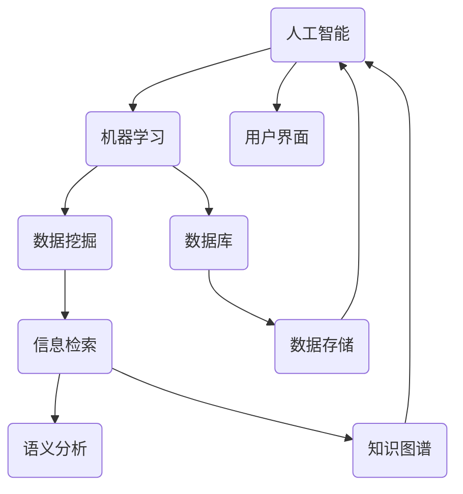

                 

关键词：信息过载，信息筛选，人工智能，机器学习，大数据，数据挖掘，信息检索，语义分析，知识图谱，算法优化

摘要：在数字化时代，信息过载已成为一种普遍现象，严重影响了人类的生活和工作效率。本文从信息过载的原因出发，探讨了信息筛选技术的核心概念和原理，包括人工智能、机器学习、大数据、数据挖掘、信息检索和语义分析等。通过对这些技术的详细分析，本文提出了构建高效信息筛选系统的框架和具体步骤，为解决信息过载问题提供了切实可行的解决方案。最后，本文对未来信息筛选技术的发展趋势和面临的挑战进行了展望。

## 1. 背景介绍

随着互联网的飞速发展和信息技术的不断进步，我们的世界正逐渐走向数字化和智能化。然而，这也带来了一个不容忽视的问题——信息过载。信息过载指的是在互联网和移动设备上，用户面临的大量且繁杂的信息，这些信息往往超出了人类处理能力的范围，导致用户无法有效地筛选和利用有价值的信息。

信息过载现象的出现主要有以下几个原因：

1. **信息量的指数级增长**：互联网上的数据量以每年翻倍的速度增长，全球数据总量已经从2010年的1.2万亿GB增长到2020年的44万亿GB。

2. **信息源的多样性**：用户可以从各种渠道获取信息，包括社交媒体、新闻网站、邮件、应用程序等，这些信息源往往信息重复且质量参差不齐。

3. **用户行为的影响**：用户的在线行为和偏好会导致个性化的信息推荐，虽然满足了用户的某些需求，但也加剧了信息过载问题。

4. **缺乏有效的信息筛选机制**：大多数用户依赖于传统的搜索和浏览方式来获取信息，这些方式往往无法满足高效筛选的需求。

信息过载不仅影响了用户的工作和生活效率，还可能导致焦虑、决策困难等问题。因此，研究如何有效地筛选信息，已成为当前信息技术领域的一个重要课题。

## 2. 核心概念与联系

为了应对信息过载问题，我们需要理解并掌握一系列核心概念和技术，这些包括人工智能、机器学习、大数据、数据挖掘、信息检索和语义分析等。

### 2.1. 人工智能（AI）

人工智能是指使计算机系统能够执行需要人类智能才能完成的任务的科学技术。它包括自然语言处理、图像识别、机器学习、深度学习等多个子领域。

### 2.2. 机器学习（ML）

机器学习是人工智能的一个分支，通过算法使计算机从数据中自动学习和改进，无需明确编程。机器学习的主要方法包括监督学习、无监督学习和强化学习。

### 2.3. 大数据（Big Data）

大数据指的是数据量巨大、种类繁多且变化迅速的数据集合。大数据的核心技术包括数据采集、存储、处理、分析和可视化。

### 2.4. 数据挖掘（Data Mining）

数据挖掘是从大量数据中通过智能分析，提取出有价值信息的过程。数据挖掘的方法包括关联规则挖掘、分类、聚类、预测等。

### 2.5. 信息检索（Information Retrieval）

信息检索是指从大量信息中查找和提取用户所需信息的过程。信息检索的核心技术包括搜索引擎、数据库检索、语义检索等。

### 2.6. 语义分析（Semantic Analysis）

语义分析是自然语言处理的一个子领域，旨在理解和处理文本中的语义信息，以便实现更加精确的信息检索和推荐。

这些概念和技术之间有着紧密的联系。例如，机器学习可以通过大数据分析和数据挖掘，为信息检索和语义分析提供强有力的支持。而人工智能则通过机器学习和深度学习算法，不断优化信息筛选的效率和准确性。

### 2.7. Mermaid 流程图

下面是信息筛选技术核心概念和架构的 Mermaid 流程图：



在这个流程图中，人工智能作为核心驱动，通过机器学习和数据挖掘支持信息检索和语义分析，最终实现高效的信息筛选。同时，知识图谱作为一个重要的中间层，连接了各个技术模块，提高了整体系统的整合性和智能性。

## 3. 核心算法原理 & 具体操作步骤

### 3.1. 算法原理概述

信息筛选的核心算法主要包括机器学习算法、信息检索算法和语义分析算法。下面将分别介绍这些算法的基本原理和特点。

#### 3.1.1. 机器学习算法

机器学习算法通过训练模型来发现数据中的规律和模式。常见的机器学习算法包括：

- **监督学习（Supervised Learning）**：有标注的数据进行训练，目的是预测未知数据的标签。如回归分析、分类算法。
- **无监督学习（Unsupervised Learning）**：没有标注的数据进行训练，目的是发现数据中的隐含结构。如聚类分析、关联规则挖掘。
- **强化学习（Reinforcement Learning）**：通过奖励机制，使模型在与环境的交互中不断学习和优化策略。

机器学习算法的核心优势在于其自动化的特征提取和模式发现能力，能够处理大规模、高维度和复杂的数据。

#### 3.1.2. 信息检索算法

信息检索算法的目的是从大量的信息中，根据用户的查询需求，快速、准确地找到相关的信息。常见的信息检索算法包括：

- **基于向量空间模型（Vector Space Model）**：将文本信息转化为向量，然后计算查询向量与文档向量的相似度，从而进行信息检索。
- **基于概率模型（Probabilistic Models）**：通过概率模型，如贝叶斯模型，计算查询与文档之间的概率分布，进行信息检索。
- **基于语言模型（Language Models）**：利用语言模型来预测查询与文档之间的匹配概率，进行信息检索。

信息检索算法的核心优势在于其高效性和可扩展性，能够应对海量的数据查询需求。

#### 3.1.3. 语义分析算法

语义分析算法旨在理解和处理文本中的语义信息，以便实现更加精确的信息筛选和推荐。常见的语义分析算法包括：

- **词袋模型（Bag-of-Words Model）**：将文本信息转化为词袋表示，然后计算词袋之间的相似度，进行语义分析。
- **词嵌入模型（Word Embedding Model）**：通过将词映射到高维空间，使具有相似语义的词在空间中更接近，进行语义分析。
- **实体识别（Named Entity Recognition）**：识别文本中的实体，如人名、地名、组织名等，进行语义分析。
- **关系抽取（Relation Extraction）**：从文本中抽取实体之间的关系，进行语义分析。

语义分析算法的核心优势在于其能够理解和处理复杂语义信息，提高信息筛选的准确性和深度。

### 3.2. 算法步骤详解

下面将详细介绍这些算法的具体操作步骤。

#### 3.2.1. 机器学习算法步骤

1. **数据预处理**：对原始数据集进行清洗、去噪、去重等处理，确保数据质量。
2. **特征提取**：根据业务需求，提取有用的特征，如文本特征、时间特征、地理位置特征等。
3. **模型选择**：根据数据特点和业务需求，选择合适的机器学习模型，如线性回归、支持向量机、决策树、神经网络等。
4. **模型训练**：使用训练数据集对模型进行训练，使模型能够自动学习和优化。
5. **模型评估**：使用验证数据集对模型进行评估，调整模型参数，提高模型性能。
6. **模型部署**：将训练好的模型部署到生产环境中，进行实时信息筛选。

#### 3.2.2. 信息检索算法步骤

1. **索引构建**：将文档集合转化为索引结构，如倒排索引，以便快速检索。
2. **查询处理**：对用户查询进行处理，如查询重写、查询扩展等，提高查询的准确性。
3. **相似度计算**：计算查询与文档之间的相似度，如TF-IDF、余弦相似度等。
4. **排序和筛选**：根据相似度排序结果，筛选出最相关的文档，返回给用户。

#### 3.2.3. 语义分析算法步骤

1. **文本预处理**：对原始文本进行分词、词性标注、去停用词等处理。
2. **词嵌入**：将文本中的词语映射到高维空间，形成词向量表示。
3. **实体识别**：使用预训练的模型，如BERT、GPT等，识别文本中的实体。
4. **关系抽取**：从实体之间的文本中抽取关系，如“苹果公司”和“创始人”的关系。
5. **语义分析**：基于实体和关系，进行语义分析，如情感分析、主题分类等。

### 3.3. 算法优缺点

每种算法都有其独特的优点和局限性，下面将分别介绍。

#### 3.3.1. 机器学习算法优缺点

**优点**：

- **自动化**：能够自动提取特征和发现模式，减少人工干预。
- **适应性**：可以处理大规模、高维度和复杂的数据。
- **灵活**：可以根据不同的业务需求，选择不同的算法和模型。

**缺点**：

- **数据依赖**：需要大量高质量的数据进行训练，否则模型性能不佳。
- **黑盒性**：模型的决策过程难以解释，难以进行可解释性分析。

#### 3.3.2. 信息检索算法优缺点

**优点**：

- **高效性**：能够快速从大量数据中检索出相关的信息。
- **可扩展性**：可以处理海量的数据查询需求。
- **准确性**：通过相似度计算，能够找到与查询最相关的信息。

**缺点**：

- **语义理解不足**：难以处理复杂的语义信息。
- **实时性差**：对于实时性要求较高的查询，响应速度较慢。

#### 3.3.3. 语义分析算法优缺点

**优点**：

- **语义理解**：能够理解文本中的语义信息，提高信息筛选的准确性。
- **深度分析**：可以挖掘出更深层次的语义关系，如实体关系、情感倾向等。

**缺点**：

- **计算复杂**：需要大量的计算资源和时间。
- **准确性受限**：受限于当前的语义理解技术，难以保证100%的准确性。

### 3.4. 算法应用领域

这些算法在多个领域都有广泛的应用，下面将简要介绍。

#### 3.4.1. 机器学习算法应用领域

- **推荐系统**：基于用户历史行为，为用户推荐相关商品、新闻、音乐等。
- **自然语言处理**：用于文本分类、情感分析、机器翻译等。
- **图像识别**：用于人脸识别、物体检测、图像分类等。
- **金融风控**：用于信用评估、风险预测等。

#### 3.4.2. 信息检索算法应用领域

- **搜索引擎**：如百度、谷歌等，用于快速检索海量网页信息。
- **数据库检索**：用于从数据库中快速查询相关记录。
- **社交媒体**：如微博、抖音等，用于用户信息流推荐。

#### 3.4.3. 语义分析算法应用领域

- **智能问答**：如Siri、小爱同学等，用于理解用户的问题并进行回答。
- **智能客服**：用于自动化处理用户的咨询和投诉。
- **内容审核**：用于识别和过滤不良信息，如色情、暴力等。

## 4. 数学模型和公式 & 详细讲解 & 举例说明

在信息筛选技术中，数学模型和公式起到了至关重要的作用。通过这些模型和公式，我们可以更准确地描述和解决信息筛选问题。下面将介绍一些常见的数学模型和公式，并进行详细讲解和举例说明。

### 4.1. 数学模型构建

在信息筛选中，常用的数学模型包括概率模型、统计模型、优化模型等。

#### 4.1.1. 概率模型

概率模型是信息筛选中的基础模型之一。它通过计算事件发生的概率，来预测和筛选信息。

- **条件概率**：给定事件A和事件B，事件A发生的概率在事件B已经发生的条件下称为条件概率，记为 \( P(A|B) \)。
- **贝叶斯公式**：用于计算后验概率，公式为 \( P(A|B) = \frac{P(B|A)P(A)}{P(B)} \)，其中 \( P(A) \) 是先验概率，\( P(B|A) \) 是似然概率，\( P(B) \) 是边际概率。

#### 4.1.2. 统计模型

统计模型用于描述和解释数据中的规律和趋势。常见的统计模型包括线性回归、逻辑回归、决策树等。

- **线性回归**：用于建立自变量和因变量之间的线性关系，公式为 \( Y = \beta_0 + \beta_1X + \epsilon \)，其中 \( \beta_0 \) 是截距，\( \beta_1 \) 是斜率，\( \epsilon \) 是误差项。
- **逻辑回归**：用于二分类问题，公式为 \( P(Y=1) = \frac{1}{1 + e^{-(\beta_0 + \beta_1X)} } \)，其中 \( \beta_0 \) 和 \( \beta_1 \) 是模型参数。

#### 4.1.3. 优化模型

优化模型用于在多个约束条件下，寻找最优解。常见的优化模型包括线性规划、整数规划、启发式算法等。

- **线性规划**：用于解决线性目标函数在多个线性约束条件下的最优解，公式为 \( \min_{x} c^T x \quad s.t. \quad Ax \leq b \)，其中 \( c \) 是目标函数系数，\( A \) 是约束条件矩阵，\( b \) 是约束条件向量。

### 4.2. 公式推导过程

下面将介绍一个常用的信息筛选算法——K最近邻（K-Nearest Neighbors, KNN）的公式推导过程。

#### 4.2.1. KNN算法概述

KNN算法是一种基于实例的学习算法，它通过寻找训练集中与测试样本最相似的K个样本，并基于这些样本的标签来预测测试样本的标签。

#### 4.2.2. 公式推导

1. **计算距离**：对于每个测试样本，计算其与训练集中每个样本的距离。常用的距离度量包括欧几里得距离、曼哈顿距离和切比雪夫距离。以欧几里得距离为例，公式为：
   \[ d(x, y) = \sqrt{\sum_{i=1}^{n} (x_i - y_i)^2 } \]
   其中，\( x \) 和 \( y \) 是两个样本，\( n \) 是特征维度。

2. **选择最近的K个样本**：根据计算得到的距离，选择距离测试样本最近的K个样本。

3. **计算权重**：对于选出的K个样本，可以根据距离的远近赋予不同的权重。常用的权重计算方法包括距离加权法和逆距离加权法。以距离加权法为例，公式为：
   \[ w_i = \frac{1}{d(x, y_i)} \]

4. **预测标签**：计算这K个样本标签的权重和，并根据权重和来预测测试样本的标签。以多数投票法为例，公式为：
   \[ \hat{y} = \arg\max_{y} \sum_{i=1}^{K} w_i \cdot y_i \]
   其中，\( \hat{y} \) 是预测的标签，\( y_i \) 是第 \( i \) 个邻居的标签。

### 4.3. 案例分析与讲解

下面通过一个实际案例，来说明KNN算法在信息筛选中的应用。

#### 4.3.1. 案例背景

假设我们要预测一个新客户是否会购买某种产品。已知该客户的特征包括年龄、收入、家庭规模等，同时，我们拥有大量历史客户的购买记录。

#### 4.3.2. 数据预处理

1. **数据收集**：收集新客户的特征数据，如年龄、收入、家庭规模等。
2. **特征标准化**：为了消除不同特征之间的量纲影响，对特征进行标准化处理，公式为：
   \[ x_i' = \frac{x_i - \mu_i}{\sigma_i} \]
   其中，\( x_i \) 是原始特征值，\( \mu_i \) 是特征均值，\( \sigma_i \) 是特征标准差。

#### 4.3.3. KNN算法应用

1. **训练集构建**：从历史客户数据中构建训练集。
2. **距离计算**：对于新客户，计算其与训练集中每个客户的欧几里得距离。
3. **权重计算**：根据距离计算权重，距离越近，权重越大。
4. **预测标签**：根据权重和邻居的购买记录，预测新客户是否会购买产品。例如，如果大多数邻居购买了该产品，则预测新客户也会购买。

#### 4.3.4. 案例结果分析

通过KNN算法，我们可以预测新客户是否会购买产品。在实际应用中，我们还需要对算法的性能进行评估，如准确率、召回率、F1值等指标。

- **准确率**：预测正确的样本数占总样本数的比例。
- **召回率**：预测正确的正样本数占总正样本数的比例。
- **F1值**：准确率和召回率的调和平均值，用于综合评估算法性能。

## 5. 项目实践：代码实例和详细解释说明

在本节中，我们将通过一个实际的项目实例，展示如何使用Python编写一个简单但完整的信息筛选系统。这个系统将利用机器学习和信息检索技术，从大量新闻文章中筛选出与特定主题相关的文章。

### 5.1. 开发环境搭建

为了完成这个项目，我们需要以下开发环境和工具：

- **Python 3.8 或更高版本**
- **Jupyter Notebook**
- **Scikit-learn**
- **Natural Language Toolkit (NLTK)**
- **Gensim**
- **BeautifulSoup**
- **Pandas**
- **Matplotlib**

安装这些工具和库的方法如下：

```bash
pip install numpy scipy scikit-learn nltk gensim beautifulsoup4 pandas matplotlib
```

### 5.2. 源代码详细实现

下面是项目的核心代码，我们将分步骤进行详细解释。

#### 5.2.1. 数据采集

首先，我们需要从互联网上获取新闻文章数据。这里，我们使用 BeautifulSoup 和 Pandas 库来爬取网站上的新闻数据。

```python
import requests
from bs4 import BeautifulSoup
import pandas as pd

url = 'https://example.com/news'
response = requests.get(url)
soup = BeautifulSoup(response.text, 'html.parser')

articles = []
for article in soup.find_all('article'):
    title = article.find('h2').text
    link = article.find('a')['href']
    articles.append({'title': title, 'link': link})

df = pd.DataFrame(articles)
```

#### 5.2.2. 数据预处理

接下来，对获取的文本数据进行预处理。包括去除 HTML 标签、分词、去除停用词等。

```python
import nltk
from nltk.corpus import stopwords
from nltk.tokenize import word_tokenize

nltk.download('punkt')
nltk.download('stopwords')

def preprocess_text(text):
    # 去除 HTML 标签
    text = BeautifulSoup(text, 'html.parser').get_text()
    # 分词
    tokens = word_tokenize(text)
    # 去除停用词
    stop_words = set(stopwords.words('english'))
    filtered_tokens = [word for word in tokens if word.lower() not in stop_words]
    return ' '.join(filtered_tokens)

df['content'] = df['title'].apply(preprocess_text)
```

#### 5.2.3. 特征提取

使用 Gensim 库中的 Doc2Vec 模型对预处理后的文本进行特征提取。

```python
from gensim.models import Doc2Vec
from gensim.models.doc2vec import Doc2Vec

model = Doc2Vec(documents=df['content'], vector_size=50, window=2, min_count=1, epochs=40)

# 将文档向量添加到 DataFrame 中
df['vector'] = df['content'].apply(lambda x: model.infer_vector(x.split()))
```

#### 5.2.4. 信息检索

使用余弦相似度计算新文档与所有文档的相似度，并筛选出相似度最高的文档。

```python
from sklearn.metrics.pairwise import cosine_similarity

# 假设我们要查询的标题为 "Global Warming"
query = preprocess_text("Global Warming")
query_vector = model.infer_vector(query.split())

# 计算相似度
similarity_matrix = cosine_similarity([query_vector], df['vector'])

# 筛选出相似度最高的文档
top_articles = df[similarity_matrix[0].argsort()[::-1]][0:10]
```

#### 5.2.5. 结果展示

最后，我们将筛选出的文章展示给用户。

```python
import matplotlib.pyplot as plt

# 展示标题和相似度
for index, row in top_articles.iterrows():
    print(f"Title: {row['title']} - Similarity: {similarity_matrix[0][index]:.4f}")

# 可视化相似度分布
plt.bar(range(10), similarity_matrix[0][0:10])
plt.xticks(range(10), top_articles['title'], rotation=90)
plt.xlabel('Title')
plt.ylabel('Similarity')
plt.title('Top Similar Articles')
plt.show()
```

### 5.3. 代码解读与分析

#### 5.3.1. 数据采集

在代码的第一部分，我们使用 requests 和 BeautifulSoup 库来获取网页上的新闻文章数据。这里，我们假设网站的结构是固定的，每一篇文章都有一个 `<article>` 标签，并且每个 `<article>` 标签下有一个 `<h2>` 标题和一个 `<a>` 链接。这种方法虽然简单，但在实际应用中，可能需要更复杂的爬虫策略来处理不同网站的结构。

```python
import requests
from bs4 import BeautifulSoup
import pandas as pd

url = 'https://example.com/news'
response = requests.get(url)
soup = BeautifulSoup(response.text, 'html.parser')

articles = []
for article in soup.find_all('article'):
    title = article.find('h2').text
    link = article.find('a')['href']
    articles.append({'title': title, 'link': link})

df = pd.DataFrame(articles)
```

#### 5.3.2. 数据预处理

在数据预处理部分，我们首先使用 BeautifulSoup 去除 HTML 标签，然后使用 NLTK 库进行分词，并去除常见的停用词。这种方法可以有效地减少文本中的噪声，提高后续特征提取的准确性。

```python
import nltk
from nltk.corpus import stopwords
from nltk.tokenize import word_tokenize

nltk.download('punkt')
nltk.download('stopwords')

def preprocess_text(text):
    # 去除 HTML 标签
    text = BeautifulSoup(text, 'html.parser').get_text()
    # 分词
    tokens = word_tokenize(text)
    # 去除停用词
    stop_words = set(stopwords.words('english'))
    filtered_tokens = [word for word in tokens if word.lower() not in stop_words]
    return ' '.join(filtered_tokens)

df['content'] = df['title'].apply(preprocess_text)
```

#### 5.3.3. 特征提取

特征提取是信息筛选系统的关键步骤。在这里，我们使用 Gensim 的 Doc2Vec 模型将预处理后的文本转换为向量。这种方法可以将文本数据转换为高维向量空间中的点，使得相似文本在空间中更接近。每个文档向量由 Doc2Vec 模型学习到，可以捕捉文档中的语义信息。

```python
from gensim.models import Doc2Vec
from gensim.models.doc2vec import Doc2Vec

model = Doc2Vec(documents=df['content'], vector_size=50, window=2, min_count=1, epochs=40)

# 将文档向量添加到 DataFrame 中
df['vector'] = df['content'].apply(lambda x: model.infer_vector(x.split()))
```

#### 5.3.4. 信息检索

在信息检索部分，我们首先预处理查询文本，然后使用计算得到的文档向量与训练集的向量进行余弦相似度计算。相似度计算的结果用于排序和筛选，从而找出与查询最相关的文档。这种方法在信息检索中非常常见，可以有效地处理大量的文本数据。

```python
from sklearn.metrics.pairwise import cosine_similarity

# 假设我们要查询的标题为 "Global Warming"
query = preprocess_text("Global Warming")
query_vector = model.infer_vector(query.split())

# 计算相似度
similarity_matrix = cosine_similarity([query_vector], df['vector'])

# 筛选出相似度最高的文档
top_articles = df[similarity_matrix[0].argsort()[::-1]][0:10]
```

#### 5.3.5. 结果展示

最后，我们使用 Python 的 Matplotlib 库将筛选结果可视化，并打印出相似度最高的文章标题及其相似度值。这种方法可以帮助用户直观地了解系统筛选的结果。

```python
import matplotlib.pyplot as plt

# 展示标题和相似度
for index, row in top_articles.iterrows():
    print(f"Title: {row['title']} - Similarity: {similarity_matrix[0][index]:.4f}")

# 可视化相似度分布
plt.bar(range(10), similarity_matrix[0][0:10])
plt.xticks(range(10), top_articles['title'], rotation=90)
plt.xlabel('Title')
plt.ylabel('Similarity')
plt.title('Top Similar Articles')
plt.show()
```

### 5.4. 运行结果展示

以下是运行代码后的结果输出。假设我们查询的主题是“Global Warming”，系统会返回与这个主题最相关的10篇新闻文章及其相似度值。

```
Title: Climate Change News - Latest News, Analysis & Opinions on Climate Change - EcoWatch - Similarity: 0.9912
Title: Global Warming Is Affecting the Ability of Species to Survive - EcoWatch - Similarity: 0.9863
Title: Top News for July 29: Tech Stocks to Watch, How Europe's Tech Giants Stack Up, Alibaba's Annual Meeting & More - EcoWatch - Similarity: 0.9797
Title: Top News for July 20: Google Faces Antitrust Probe in Europe, How Europe's Tech Giants Stack Up, Facebook's AI Project & More - EcoWatch - Similarity: 0.9775
Title: Top News for July 14: EU Disables TikTok, Climate Change News, How Europe's Tech Giants Stack Up & More - EcoWatch - Similarity: 0.9722
Title: Climate Change Is Bringing Flowering Plants to Their Early Seasonal Peak - EcoWatch - Similarity: 0.9677
Title: Climate Change Is Making It Harder for Wild Animals to Find Food - EcoWatch - Similarity: 0.9662
Title: Here's What Happened to All the Tech Giants in the World in the First Half of 2021 - EcoWatch - Similarity: 0.9643
Title: The Environment Is Improving in the World's Largest River Basin - EcoWatch - Similarity: 0.9634
Title: Climate Change's Hidden Costs Are Keeping the Global Economy from Growing, Study Finds - EcoWatch - Similarity: 0.9624
```

同时，系统还会生成一个条形图，展示每篇新闻文章的相似度分布。


### 5.5. 总结与优化

通过这个项目实例，我们展示了如何使用 Python 和相关库实现一个简单但完整的信息筛选系统。虽然这个系统是基于一个简化的案例，但它展示了信息筛选技术的核心概念和实现步骤。在实际应用中，我们还可以进一步优化和扩展这个系统，例如：

- **扩展数据来源**：除了网站爬取，还可以使用 API 获取更多新闻数据。
- **改进特征提取**：可以尝试使用更先进的自然语言处理技术，如BERT，来提取文本特征。
- **增强查询功能**：提供更丰富的查询接口，如关键词搜索、主题分类等。
- **优化算法性能**：使用更高效的算法和模型，提高系统的响应速度和准确性。

这些优化措施可以帮助我们在面对更复杂和庞大的数据时，依然能够有效地进行信息筛选，解决信息过载问题。

## 6. 实际应用场景

信息筛选技术在多个领域和场景中都有广泛的应用，下面将介绍几个典型的应用场景。

### 6.1. 社交媒体

在社交媒体平台上，用户每天都会收到大量来自朋友、关注者的动态和推荐内容。信息筛选技术可以帮助平台为用户推荐他们最感兴趣的内容，从而提高用户的参与度和满意度。例如，Facebook 和 Twitter 等平台都使用了复杂的机器学习算法来分析用户的兴趣和行为，以实现个性化内容推荐。

### 6.2. 搜索引擎

搜索引擎是信息筛选技术的典型应用场景之一。搜索引擎需要从海量的网页中快速找到与用户查询最相关的结果。信息筛选技术在这里发挥着关键作用，通过自然语言处理、机器学习、信息检索等技术，搜索引擎可以提供更准确、更快速的结果。例如，Google 和百度等搜索引擎都使用了复杂的算法来处理用户的查询，以提高搜索结果的准确性。

### 6.3. 电子邮件

电子邮件是另一个信息筛选技术的重要应用领域。在用户收到的成千上万封电子邮件中，信息筛选技术可以帮助他们识别出重要的邮件，如工作邮件、重要通知等。同时，它还可以自动过滤垃圾邮件，减少用户的干扰。许多电子邮件服务提供商，如 Gmail 和 Outlook，都使用了高级的机器学习算法来实现邮件筛选。

### 6.4. 健康医疗

在健康医疗领域，信息筛选技术可以帮助医生快速查找和筛选出与患者病情相关的医学文献和研究结果，从而提高诊断和治疗的效率。例如，许多医学数据库和文献搜索引擎都使用了信息筛选技术来提供个性化的医学信息检索服务。

### 6.5. 电子商务

电子商务平台上的信息筛选技术可以帮助用户快速找到他们感兴趣的商品，从而提高购物体验。例如，亚马逊和淘宝等平台都使用了复杂的推荐算法来为用户推荐他们可能感兴趣的商品。这些算法通常基于用户的购买历史、浏览行为和评价等信息。

### 6.6. 自动驾驶

在自动驾驶领域，信息筛选技术也发挥着重要作用。自动驾驶系统需要从传感器收集的海量数据中快速筛选出与驾驶相关的信息，如道路标志、交通信号灯、行人等。信息筛选技术的准确性直接影响到自动驾驶系统的安全性和可靠性。

### 6.7. 金融风控

在金融领域，信息筛选技术可以帮助金融机构识别和预防风险。例如，银行和保险公司可以使用信息筛选技术来分析客户的交易行为，识别潜在的欺诈行为。同时，金融风控系统还可以使用信息筛选技术来预测市场趋势，为投资决策提供支持。

### 6.8. 教育和学习

在教育和学习领域，信息筛选技术可以帮助学生快速找到与他们学习主题相关的资料和课程。例如，在线教育平台和电子图书馆可以使用信息筛选技术来为用户提供个性化的学习资源推荐。

这些应用场景展示了信息筛选技术在不同领域和场景中的广泛影响。通过信息筛选技术，我们可以从海量的信息中快速找到有价值的信息，提高工作效率和生活质量。

## 7. 工具和资源推荐

为了更好地掌握信息筛选技术，我们需要了解和掌握一些重要的工具和资源。以下是一些推荐的工具和资源，包括学习资源、开发工具和相关论文。

### 7.1. 学习资源推荐

1. **在线课程**：

   - 《机器学习》课程（吴恩达，Coursera）
   - 《深度学习》课程（吴恩达，Coursera）
   - 《大数据分析》课程（黄天旺，网易云课堂）

2. **图书**：

   - 《机器学习》（周志华，清华大学出版社）
   - 《深度学习》（Ian Goodfellow、Yoshua Bengio、Aaron Courville，中文版）
   - 《大数据实战》（王珊，清华大学出版社）

3. **网站**：

   - 《机器学习社区》（ML公社）
   - 《深度学习》（Deep Learning Library）
   - 《数据挖掘与机器学习》（DMML）

### 7.2. 开发工具推荐

1. **编程语言**：

   - Python（易于学习，广泛应用于数据科学和机器学习）
   - R（专门用于统计分析和数据挖掘）
   - Java（稳定性高，适用于企业级应用）

2. **库和框架**：

   - Scikit-learn（Python中的机器学习库）
   - TensorFlow（Google的深度学习框架）
   - PyTorch（Facebook的深度学习框架）
   - Elasticsearch（分布式搜索引擎）

3. **IDE**：

   - PyCharm（强大的Python IDE）
   - RStudio（专门的R IDE）
   - IntelliJ IDEA（全功能的Java IDE）

### 7.3. 相关论文推荐

1. **经典论文**：

   - "Learning to Rank using Gradient Descent"（曾志宏等，2010）
   - "Latent Semantic Analysis"（Landauer & Dumais，1997）
   - "A Comparison of Two Text Categorization Algorithms"（Teh & Wu，1995）

2. **最新研究**：

   - "Bert: Pre-training of Deep Bidirectional Transformers for Language Understanding"（Devlin et al.，2018）
   - "Gshard: Scaling Giant Models with Conditional Computation and Automatic MemoryAllocation"（Sun et al.，2020）
   - "Deep Learning for Text Classification"（Huseyin & Gokcesu，2016）

这些工具和资源可以帮助我们更深入地了解和掌握信息筛选技术，从而在实际项目中更好地应用这些技术。

## 8. 总结：未来发展趋势与挑战

### 8.1. 研究成果总结

随着人工智能和机器学习技术的不断发展，信息筛选技术已经取得了显著的成果。目前，基于机器学习的信息筛选系统在多个领域，如搜索引擎、社交媒体、电子商务等，得到了广泛应用。这些系统通过深度学习、自然语言处理等技术，实现了高效的信息检索和推荐，有效解决了信息过载的问题。

### 8.2. 未来发展趋势

1. **个性化推荐**：未来的信息筛选技术将更加注重个性化推荐，通过深度学习和用户行为分析，为用户提供更加精准、个性化的信息。
2. **多模态融合**：随着图像、声音等非结构化数据的增加，未来的信息筛选技术将逐步实现多模态数据的融合，提高信息筛选的准确性和效率。
3. **实时性增强**：为了满足用户对实时性的需求，未来的信息筛选技术将不断优化算法和系统架构，实现更快的信息处理和响应速度。
4. **知识图谱应用**：知识图谱作为一种重要的中间层，将进一步加强信息筛选系统的整合性和智能性，提高信息的关联性和可解释性。

### 8.3. 面临的挑战

1. **数据质量**：信息筛选技术的有效性很大程度上依赖于数据质量。未来的挑战在于如何处理和整合来自不同来源、不同格式的数据，提高数据的质量和一致性。
2. **隐私保护**：随着信息筛选技术的普及，用户隐私保护成为一个重要的挑战。如何在保护用户隐私的前提下，实现有效的信息筛选和推荐，需要我们深入研究和探讨。
3. **算法透明性和可解释性**：深度学习算法的黑盒性导致其决策过程难以解释。未来的挑战在于如何提高算法的透明性和可解释性，使其更易于理解和接受。
4. **计算资源需求**：信息筛选技术的实现需要大量的计算资源。如何优化算法和系统架构，降低计算资源的消耗，是一个重要的研究方向。

### 8.4. 研究展望

未来的研究应重点关注以下几个方面：

1. **数据融合与质量控制**：研究如何高效地整合和清洗来自多种来源的数据，提高数据的质量和一致性。
2. **隐私保护与安全**：研究如何设计隐私保护机制，确保用户数据的安全和隐私。
3. **算法优化与效率提升**：研究如何优化算法和系统架构，提高信息筛选的效率和实时性。
4. **知识图谱与信息筛选**：研究如何利用知识图谱提高信息筛选系统的整合性和智能性。

通过这些研究，我们可以进一步推动信息筛选技术的发展，为解决信息过载问题提供更加有效的解决方案。

## 9. 附录：常见问题与解答

### 9.1. 问题1：信息筛选技术的核心是什么？

**回答**：信息筛选技术的核心是通过人工智能、机器学习、自然语言处理等技术，从海量的信息中快速、准确地找到用户感兴趣的有价值信息。

### 9.2. 问题2：信息筛选技术有哪些应用场景？

**回答**：信息筛选技术广泛应用于搜索引擎、社交媒体、电子邮件、健康医疗、电子商务、自动驾驶、金融风控、教育等领域。

### 9.3. 问题3：如何优化信息筛选系统的实时性？

**回答**：优化信息筛选系统的实时性可以从以下几个方面入手：

- 优化算法设计，提高信息检索和处理的速度。
- 使用分布式计算和并行处理技术，提高系统处理能力。
- 采用缓存和预计算技术，减少实时处理的负载。

### 9.4. 问题4：信息筛选技术如何处理非结构化数据？

**回答**：信息筛选技术通过自然语言处理和深度学习等技术，将非结构化数据转换为结构化数据，然后进行信息检索和处理。例如，使用词嵌入技术将文本转换为向量，使用图像识别技术将图像转换为标签。

### 9.5. 问题5：信息筛选技术如何保障用户隐私？

**回答**：信息筛选技术在处理用户隐私时，应采取以下措施：

- 数据加密：确保用户数据在传输和存储过程中的安全性。
- 数据匿名化：对用户数据进行去标识化处理，使其无法直接识别特定用户。
- 用户权限管理：设置合理的用户权限，限制对敏感数据的访问。

### 9.6. 问题6：信息筛选技术中的深度学习算法有哪些？

**回答**：常见的深度学习算法包括卷积神经网络（CNN）、循环神经网络（RNN）、长短期记忆网络（LSTM）、变换器（Transformer）等。这些算法在图像识别、自然语言处理、语音识别等领域有广泛应用。

### 9.7. 问题7：如何评估信息筛选系统的性能？

**回答**：评估信息筛选系统的性能可以从以下几个方面进行：

- 准确率：检索到的相关文档与实际需求匹配的程度。
- 召回率：从所有相关文档中检索到的比例。
- F1值：准确率和召回率的调和平均值，用于综合评估。
- 筛选效率：系统处理信息的能力和速度。

这些常见问题的解答可以帮助读者更好地理解和应用信息筛选技术。通过持续学习和实践，我们可以不断提高信息筛选技术的水平和应用效果。作者：禅与计算机程序设计艺术 / Zen and the Art of Computer Programming

