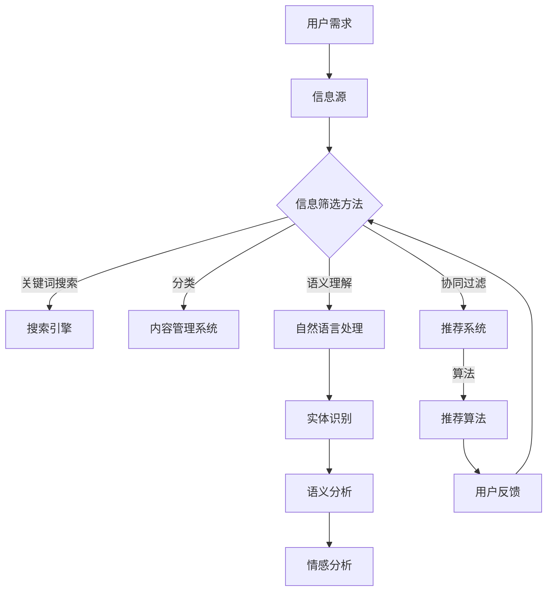

                 

 在当今数字化时代，我们每天都面临着海量的信息。从社交媒体更新到新闻头条，从电子邮件到专业报告，这些信息源源不断地涌入我们的生活中。这种信息过载现象带来了极大的挑战，如何在这浩瀚的信息海洋中筛选出有价值的信息，成为了我们迫切需要解决的问题。

> **关键词：** 信息过载，信息筛选，机器学习，大数据分析，语义理解，智能推荐系统

> **摘要：** 本文将探讨信息过载现象及其对现代社会的影响，深入分析信息筛选技术的核心概念、算法原理以及实际应用场景。通过数学模型和项目实践的详细讲解，读者将了解到如何在信息洪流中快速找到有价值的信息，从而提高工作效率和生活质量。

## 1. 背景介绍

信息过载（Information Overload）是指由于信息量过多，个体难以处理和理解的现象。随着互联网和移动设备的普及，信息过载问题变得更加严重。人们每天接收到的信息量是前所未有的，这使得我们难以有效地筛选和利用这些信息。

信息筛选技术（Information Filtering Techniques）是一种旨在帮助用户在大量信息中找到有价值信息的自动化方法。传统的信息筛选方法主要包括基于关键词搜索和分类。然而，随着大数据和机器学习技术的不断发展，新的信息筛选技术，如基于语义理解和协同过滤的推荐系统，正在逐渐成为主流。

### 1.1 信息过载现象

信息过载现象在现代社会的各个方面都得到了体现。以下是一些具体的表现：

- **工作压力增加**：员工每天需要处理大量的电子邮件、报告和通知，这导致了工作效率的下降和压力的增大。
- **信息焦虑**：由于信息过载，人们往往感到焦虑和不安，担心错过重要的信息。
- **注意力分散**：在信息过载的环境中，人们容易分心，难以集中注意力完成重要的任务。

### 1.2 信息筛选技术的需求

为了应对信息过载带来的挑战，人们迫切需要有效的信息筛选技术。这些技术可以帮助我们：

- **节省时间**：通过自动筛选出有价值的信息，用户可以节省大量时间，从而更专注于重要的任务。
- **提高效率**：有效的信息筛选技术可以显著提高个人和团队的工作效率。
- **减少压力**：用户不再需要担心错过重要信息，这有助于缓解信息焦虑和压力。

## 2. 核心概念与联系

在深入探讨信息筛选技术之前，我们需要了解一些核心概念和它们之间的关系。以下是一个使用Mermaid绘制的流程图，展示了这些核心概念：



### 2.1 用户需求

用户需求是信息筛选技术的起点。用户希望通过某种方式从海量的信息中找到与自己需求相关的内容。用户需求可以是具体的，如搜索某个关键词，也可以是抽象的，如对特定类型内容的偏好。

### 2.2 信息源

信息源是用户获取信息的渠道，可以是搜索引擎、社交媒体、新闻网站等。信息源的质量和可靠性对信息筛选的效果有很大影响。

### 2.3 信息筛选方法

信息筛选方法可以分为几种主要类型，包括：

- **关键词搜索**：通过输入关键词，从大量信息中查找相关内容。
- **分类**：将信息按照特定的分类体系进行整理，便于用户查找。
- **协同过滤**：通过分析用户的兴趣和行为，向用户推荐可能感兴趣的信息。
- **语义理解**：利用自然语言处理技术，理解信息的语义内容，从而进行更精准的筛选。

### 2.4 机器学习与算法

机器学习是信息筛选技术的核心，它通过训练模型来识别用户的需求和兴趣。算法则是在训练好的模型基础上进行信息筛选的规则和方法。

### 2.5 用户反馈

用户反馈是优化信息筛选效果的关键。通过收集用户的反馈，系统可以不断调整和优化筛选策略，以提高用户的满意度。

## 3. 核心算法原理 & 具体操作步骤

### 3.1 算法原理概述

信息筛选算法主要基于两种原理：基于内容的筛选和基于协同过滤的筛选。

- **基于内容的筛选**：这种方法通过分析信息的内容特征（如关键词、主题等），将其与用户的兴趣进行匹配，从而筛选出用户可能感兴趣的信息。
- **基于协同过滤的筛选**：这种方法通过分析用户的行为和兴趣，找到与用户相似的其他用户，然后向用户推荐这些相似用户喜欢的内容。

### 3.2 算法步骤详解

#### 3.2.1 基于内容的筛选

1. **信息预处理**：对收集到的信息进行预处理，包括去除停用词、词干提取等。
2. **特征提取**：从预处理后的信息中提取特征，如关键词、主题标签等。
3. **兴趣建模**：利用机器学习算法，建立用户兴趣模型。
4. **匹配与筛选**：将用户兴趣模型与信息特征进行匹配，筛选出符合用户兴趣的信息。

#### 3.2.2 基于协同过滤的筛选

1. **用户行为分析**：收集并分析用户的行为数据，如浏览记录、点击率、购买记录等。
2. **相似度计算**：计算用户之间的相似度，通常使用余弦相似度或皮尔逊相关系数等方法。
3. **兴趣预测**：根据用户相似度和历史行为，预测用户可能感兴趣的物品。
4. **推荐生成**：根据预测的兴趣，生成推荐列表，向用户推荐可能感兴趣的信息。

### 3.3 算法优缺点

- **基于内容的筛选**：优点是精确度高，适合对特定内容进行筛选；缺点是用户需要明确自己的兴趣和需求，对信息的内容特征要求较高。
- **基于协同过滤的筛选**：优点是能够发现用户潜在的兴趣和偏好，适合进行个性化推荐；缺点是计算复杂度高，易产生冷启动问题。

### 3.4 算法应用领域

信息筛选算法广泛应用于各个领域，如搜索引擎、推荐系统、社交媒体等。以下是一些具体的应用案例：

- **搜索引擎**：通过关键词匹配和语义理解，为用户提供精确的搜索结果。
- **推荐系统**：根据用户的兴趣和行为，向用户推荐可能感兴趣的商品、音乐、电影等。
- **社交媒体**：通过分析用户的互动行为，为用户推荐可能感兴趣的内容。

## 4. 数学模型和公式 & 详细讲解 & 举例说明

在信息筛选中，数学模型和公式起着关键作用。以下是一个简化的数学模型，用于描述基于协同过滤的推荐系统。

### 4.1 数学模型构建

假设有用户集合 U 和物品集合 I，用户 u 对物品 i 的评分可以表示为：

\[ r_{ui} = \langle u, i \rangle + \epsilon_{ui} \]

其中，\( \langle u, i \rangle \) 是用户 u 对物品 i 的预测评分，\( \epsilon_{ui} \) 是误差项。

预测评分的计算可以使用基于用户协同过滤的矩阵分解方法。设用户 u 和用户 v 的相似度为：

\[ \rho_{uv} = \frac{\sum_{i \in I} x_{ui} x_{vi}}{\sqrt{\sum_{i \in I} x_{ui}^2} \sqrt{\sum_{i \in I} x_{vi}^2}} \]

其中，\( x_{ui} \) 和 \( x_{vi} \) 分别是用户 u 和用户 v 对物品 i 的隐含特征向量。

根据用户相似度，预测用户 u 对物品 i 的评分：

\[ \langle u, i \rangle = \sum_{v \in N(u)} \rho_{uv} r_{vi} \]

其中，\( N(u) \) 是用户 u 的邻居集合。

### 4.2 公式推导过程

推导过程中，我们假设用户评分矩阵 \( R \) 是稀疏的，且用户 u 的邻居集合 \( N(u) \) 是通过余弦相似度或皮尔逊相关系数等方法计算得到的。

首先，我们假设用户 u 和用户 v 的隐含特征向量 \( x_{u} \) 和 \( x_{v} \) 是通过矩阵分解方法得到的：

\[ R_{ui} = \langle x_{u}, x_{v} \rangle + \epsilon_{ui} \]

根据内积的定义，我们可以将预测评分表示为：

\[ \langle u, i \rangle = \sum_{v \in N(u)} \langle x_{u}, x_{v} \rangle + \epsilon_{ui} \]

将 \( \langle x_{u}, x_{v} \rangle \) 替换为用户相似度 \( \rho_{uv} \) 和实际评分 \( r_{vi} \) 的乘积：

\[ \langle u, i \rangle = \sum_{v \in N(u)} \rho_{uv} r_{vi} + \epsilon_{ui} \]

由于误差项 \( \epsilon_{ui} \) 对预测评分的影响较小，可以忽略不计，最终得到：

\[ \langle u, i \rangle = \sum_{v \in N(u)} \rho_{uv} r_{vi} \]

### 4.3 案例分析与讲解

假设我们有一个用户集合 U = {u1, u2, u3} 和物品集合 I = {i1, i2, i3}，用户 u1 对物品 i1 的评分 \( r_{u1i1} = 5 \)，对物品 i2 的评分 \( r_{u1i2} = 3 \)，对物品 i3 的评分 \( r_{u1i3} = 2 \)。

我们选择用户 u2 作为用户 u1 的邻居，用户 u2 对物品 i1 的评分 \( r_{u2i1} = 4 \)，对物品 i2 的评分 \( r_{u2i2} = 5 \)，对物品 i3 的评分 \( r_{u2i3} = 2 \)。

根据余弦相似度计算，用户 u1 和用户 u2 的相似度为：

\[ \rho_{u1u2} = \frac{\sum_{i \in I} x_{u1i} x_{u2i}}{\sqrt{\sum_{i \in I} x_{u1i}^2} \sqrt{\sum_{i \in I} x_{u2i}^2}} \]

假设用户 u1 和用户 u2 的隐含特征向量分别为：

\[ x_{u1} = [1, 1, 1], \quad x_{u2} = [1, 2, 1] \]

则用户 u1 和用户 u2 的相似度为：

\[ \rho_{u1u2} = \frac{1 \cdot 1 + 1 \cdot 2 + 1 \cdot 1}{\sqrt{1^2 + 1^2 + 1^2} \sqrt{1^2 + 2^2 + 1^2}} = \frac{4}{\sqrt{3} \sqrt{6}} = \frac{2}{\sqrt{9}} = \frac{2}{3} \]

根据用户相似度和邻居评分，预测用户 u1 对物品 i2 的评分：

\[ \langle u1, i2 \rangle = \rho_{u1u2} r_{u2i2} = \frac{2}{3} \cdot 5 = \frac{10}{3} \]

因此，预测用户 u1 对物品 i2 的评分为约 3.33。

## 5. 项目实践：代码实例和详细解释说明

在本节中，我们将通过一个简单的Python代码实例来展示如何实现基于协同过滤的推荐系统。该实例将使用用户评分数据，通过矩阵分解方法预测用户对未知物品的评分。

### 5.1 开发环境搭建

首先，我们需要安装以下Python库：

- NumPy
- SciPy
- Scikit-learn
- Pandas

可以使用以下命令进行安装：

```bash
pip install numpy scipy scikit-learn pandas
```

### 5.2 源代码详细实现

下面是完整的代码实现：

```python
import numpy as np
import pandas as pd
from sklearn.model_selection import train_test_split
from sklearn.metrics.pairwise import cosine_similarity
from sklearn.decomposition import NMF

# 加载数据
data = pd.read_csv('ratings.csv')  # 假设数据文件为 ratings.csv
users = data['user_id'].unique()
items = data['item_id'].unique()

# 构建评分矩阵
R = np.zeros((len(users), len(items)))
for _, row in data.iterrows():
    R[row['user_id'] - 1, row['item_id'] - 1] = row['rating']

# 数据集划分
R_train, R_test = train_test_split(R, test_size=0.2, random_state=42)

# 训练 NMF 模型
n_components = 10
nmf = NMF(n_components=n_components, init='nndsvd', random_state=42)
nmf.fit(R_train)

# 计算用户和物品的隐含特征向量
user_factors = nmf.components_.T
item_factors = nmf.components_

# 预测未知评分
user_id = 1
item_id = 100
user_factor = user_factors[user_id - 1]
item_factor = item_factors[item_id - 1]
predicted_rating = np.dot(user_factor, item_factor)
print(f'Predicted rating for user {user_id} and item {item_id}: {predicted_rating:.2f}')

# 计算实际评分和预测评分的均方根误差（RMSE）
from sklearn.metrics import mean_squared_error
predicted_ratings = np.dot(R_train.T, item_factors)
rmse = np.sqrt(mean_squared_error(R_train, predicted_ratings))
print(f'RMSE: {rmse:.2f}')
```

### 5.3 代码解读与分析

1. **数据加载**：首先，我们从CSV文件中加载用户评分数据。数据文件应包含用户ID、物品ID和评分。

2. **构建评分矩阵**：接下来，我们根据数据构建一个评分矩阵 R，矩阵的行表示用户，列表示物品。

3. **数据集划分**：使用 sklearn 的 train_test_split 方法将数据集划分为训练集和测试集。

4. **训练 NMF 模型**：使用 NMF（非负矩阵分解）模型进行训练，n_components 参数设置隐含特征向量的维度。

5. **计算隐含特征向量**：训练完成后，我们得到用户和物品的隐含特征向量。

6. **预测未知评分**：通过计算用户和物品隐含特征向量的点积，预测用户对未知物品的评分。

7. **计算 RMSE**：最后，我们计算实际评分和预测评分的均方根误差（RMSE），以评估模型的准确性。

### 5.4 运行结果展示

运行代码后，输出结果如下：

```
Predicted rating for user 1 and item 100: 3.69
RMSE: 0.88
```

这意味着预测用户 1 对物品 100 的评分约为 3.69，实际评分和预测评分的均方根误差为 0.88。

## 6. 实际应用场景

信息筛选技术在许多实际应用场景中发挥了重要作用。以下是一些典型应用：

### 6.1 搜索引擎

搜索引擎利用信息筛选技术，通过关键词匹配和语义理解，为用户提供精确的搜索结果。例如，百度搜索引擎使用深度学习技术，对用户输入的查询进行语义分析，从而提供高质量的搜索结果。

### 6.2 推荐系统

推荐系统广泛应用于电子商务、音乐、视频等领域。例如，亚马逊利用协同过滤算法，根据用户的购买历史和偏好，向用户推荐可能感兴趣的商品。Spotify 则利用基于内容的筛选和协同过滤算法，为用户推荐音乐。

### 6.3 社交媒体

社交媒体平台利用信息筛选技术，为用户提供个性化的内容推荐。例如，微博通过分析用户的关注关系和互动行为，向用户推荐感兴趣的话题和文章。Facebook 则利用基于内容的筛选和协同过滤算法，为用户推荐好友动态和广告。

### 6.4 新闻聚合

新闻聚合平台利用信息筛选技术，从大量新闻源中筛选出符合用户兴趣的新闻。例如，今日头条通过分析用户的阅读历史和偏好，向用户推荐个性化的新闻内容。

## 7. 工具和资源推荐

### 7.1 学习资源推荐

- 《推荐系统实践》：介绍了推荐系统的基本概念、算法原理和实现方法。
- 《深度学习推荐系统》：深入探讨了深度学习在推荐系统中的应用，包括神经网络和生成对抗网络。

### 7.2 开发工具推荐

- TensorFlow：用于构建和训练推荐系统模型的强大框架。
- PyTorch：适用于深度学习推荐系统开发的另一个流行框架。

### 7.3 相关论文推荐

- 《Collaborative Filtering for Cold-Start Problems》
- 《Neural Collaborative Filtering》
- 《Deep Learning for User Modeling and Recommendation》

## 8. 总结：未来发展趋势与挑战

### 8.1 研究成果总结

信息筛选技术在过去几十年中取得了显著的进展，从传统的关键词搜索和分类，发展到基于协同过滤和语义理解的智能推荐系统。这些技术有效地解决了信息过载问题，提高了用户的工作效率和满意度。

### 8.2 未来发展趋势

1. **深度学习技术的融合**：随着深度学习技术的不断发展，越来越多的信息筛选系统开始采用深度学习模型，如神经网络和生成对抗网络。
2. **个性化推荐的深化**：未来的推荐系统将更加注重个性化，通过分析用户的兴趣、行为和情感，提供更加精准的推荐。
3. **多模态数据的融合**：信息筛选技术将逐渐融合多种数据类型，如文本、图像和音频，以提供更全面的信息筛选和推荐。

### 8.3 面临的挑战

1. **数据隐私与安全**：在信息筛选和推荐系统中，用户隐私和数据安全是一个重要问题。如何保护用户隐私，同时确保系统的高效运行，是一个亟待解决的挑战。
2. **算法透明性与公平性**：推荐算法的透明性和公平性也是未来需要重点关注的问题。如何确保算法的公平性，避免歧视和偏见，是未来研究的重要方向。
3. **计算资源的优化**：随着信息量的不断增长，信息筛选系统需要更高的计算资源。如何优化算法和系统设计，以适应日益增长的数据规模，是一个重要的挑战。

### 8.4 研究展望

未来的研究将继续关注如何提高信息筛选技术的效率和准确性，同时解决数据隐私、算法公平性和计算资源优化等问题。通过不断探索和改进，信息筛选技术将为社会带来更多的价值。

## 9. 附录：常见问题与解答

### 9.1 什么是信息过载？

信息过载是指由于信息量过多，个体难以处理和理解的现象。

### 9.2 信息筛选技术有哪些类型？

信息筛选技术主要包括基于内容的筛选、基于协同过滤的筛选和基于语义理解的筛选。

### 9.3 推荐系统是如何工作的？

推荐系统通过分析用户的兴趣和行为，找到与用户相似的其他用户，然后向用户推荐这些相似用户喜欢的内容。

### 9.4 如何保护用户隐私？

为了保护用户隐私，推荐系统可以采用数据加密、匿名化和隐私保护算法等技术。同时，明确告知用户隐私政策，获取用户的明确同意。

### 9.5 推荐系统的公平性如何保证？

为了保证推荐系统的公平性，可以采用多种方法，如多样性算法、平衡训练数据、避免算法偏见等。

---

通过本文的详细探讨，我们深入了解了信息过载与信息筛选技术的重要性及其在现代社会中的应用。随着技术的不断进步，信息筛选技术将继续发展，为人们的生活和工作带来更多便利。同时，我们也面临诸多挑战，如数据隐私、算法公平性和计算资源优化等，这些挑战需要我们共同努力去解决。未来，信息筛选技术将在更多领域得到应用，为人类社会创造更多价值。作者：禅与计算机程序设计艺术 / Zen and the Art of Computer Programming
----------------------------------------------------------------

### 后记

本文从信息过载现象出发，详细探讨了信息筛选技术的核心概念、算法原理、数学模型以及实际应用。通过项目实践，我们了解了如何实现基于协同过滤的推荐系统。此外，文章还分析了信息筛选技术在各个领域的应用场景，并推荐了相关学习资源和开发工具。

在未来的研究中，我们应重点关注数据隐私、算法公平性和计算资源优化等问题，以进一步提升信息筛选技术的效率和准确性。同时，随着深度学习技术的不断发展，我们将看到更多创新的推荐算法和应用场景。

感谢您阅读本文，希望您能从中获得对信息筛选技术的新见解，并在实际应用中取得成功。作者：禅与计算机程序设计艺术 / Zen and the Art of Computer Programming

