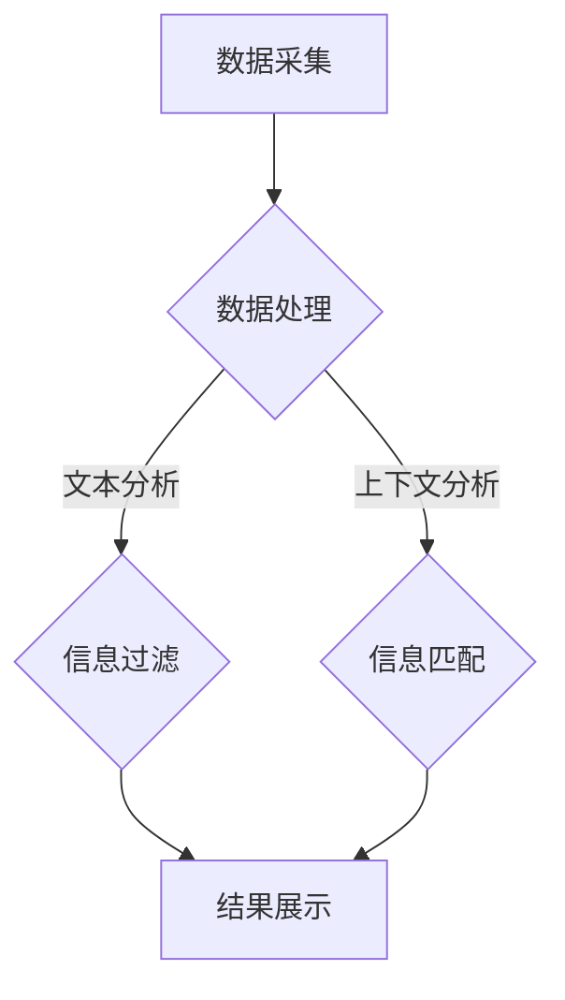

                 

信息过载是现代社会的普遍现象，尤其在信息技术高度发展的今天。每天，我们都被大量的信息包围，这些信息可能来自社交媒体、新闻媒体、电子邮件、网站更新等不同的渠道。面对如此庞大的信息量，如何有效地筛选和利用这些信息，找到真正有价值的内容，成为了一个亟待解决的问题。

本文旨在为您提供一套信息筛选的指南，帮助您在信息洪流中找到有价值和相关的信息。我们将探讨信息过载的背景、核心概念、算法原理、数学模型、项目实践、实际应用场景，以及相关的工具和资源。最后，我们将总结研究成果，展望未来发展趋势与挑战。

## 1. 背景介绍

### 1.1 信息过载的定义

信息过载是指个体在处理信息时感到无法有效应对大量信息的状况。这种现象在现代信息社会中尤为普遍。随着互联网的普及和信息技术的发展，信息的产生和传播速度越来越快，信息的种类和数量也在急剧增加。

### 1.2 信息过载的影响

信息过载对个人和社会产生了深远的影响。对个人而言，过多的信息可能导致注意力分散、决策困难、心理压力增加等问题。对社会而言，信息过载可能导致社会效率降低、沟通障碍、信息孤岛等现象。

### 1.3 现状与挑战

目前，信息过载的问题日益严重，各种信息筛选工具和算法层出不穷，但仍然难以完全解决。主要原因在于信息量的巨大增长速度远远超过了信息筛选技术的进步速度。因此，我们需要更有效、更智能的信息筛选方法来应对这一挑战。

## 2. 核心概念与联系

### 2.1 信息筛选的基本概念

信息筛选是指从大量的信息中识别出对特定用户有价值的信息的过程。其核心在于如何有效地过滤掉无关或低价值的信息，提高信息的利用效率。

### 2.2 信息筛选的方法与算法

常见的信息筛选方法包括基于内容的筛选、基于上下文的筛选、基于用户行为的筛选等。每种方法都有其优缺点，需要根据具体应用场景进行选择。

#### 2.2.1 基于内容的筛选

基于内容的筛选方法是通过分析信息的内容特征，如关键词、主题、标签等，来识别出相关信息的。这种方法简单直观，但容易产生误判。

#### 2.2.2 基于上下文的筛选

基于上下文的筛选方法是通过分析信息产生的上下文环境，如时间、地点、场景等，来识别出相关信息的。这种方法更灵活，但需要更多的上下文信息。

#### 2.2.3 基于用户行为的筛选

基于用户行为的筛选方法是通过分析用户的浏览、搜索、购买等行为，来识别出用户可能感兴趣的信息的。这种方法更加个性化，但需要大量的用户行为数据。

### 2.3 信息筛选的架构

信息筛选通常包括数据采集、信息处理、结果展示等几个关键环节。下面是一个简单的信息筛选架构：

```
+--------------+     +---------------+     +----------------+
|      数据采集  | -> |      信息处理   | -> |   结果展示    |
+--------------+     +---------------+     +----------------+
```

### 2.4 Mermaid 流程图

以下是信息筛选的核心流程的 Mermaid 流程图：



## 3. 核心算法原理 & 具体操作步骤

### 3.1 算法原理概述

信息筛选算法的核心在于如何从大量的信息中高效地识别出用户感兴趣的信息。常见的方法包括机器学习、深度学习、规则引擎等。下面我们介绍一种基于深度学习的文本匹配算法。

### 3.2 算法步骤详解

#### 3.2.1 数据预处理

首先，对采集到的数据进行预处理，包括去重、分词、词性标注等。这一步的目的是将原始数据转化为适合模型处理的格式。

```python
import jieba

def preprocess(text):
    # 去重
    text = list(set(text))
    # 分词
    words = jieba.cut(text)
    # 词性标注
    words = [word for word, pos in words]
    return words
```

#### 3.2.2 模型训练

接下来，使用预处理的文本数据训练一个文本匹配模型。我们可以使用预训练的词向量模型（如GloVe、Word2Vec）来初始化模型，并通过反向传播算法进行微调。

```python
import tensorflow as tf
from tensorflow.keras.models import Sequential
from tensorflow.keras.layers import Embedding, LSTM, Dense

model = Sequential()
model.add(Embedding(input_dim=vocab_size, output_dim=embedding_dim))
model.add(LSTM(units=128))
model.add(Dense(units=1, activation='sigmoid'))

model.compile(optimizer='adam', loss='binary_crossentropy', metrics=['accuracy'])
model.fit(X_train, y_train, epochs=10, batch_size=32)
```

#### 3.2.3 信息筛选

最后，使用训练好的模型对新的文本数据进行筛选。如果模型的输出概率大于某个阈值，则认为该文本是用户感兴趣的。

```python
def filter_text(text, model, threshold=0.5):
    words = preprocess(text)
    input_sequence = pad_sequences([words], maxlen=max_sequence_length)
    probability = model.predict(input_sequence)
    return probability > threshold
```

### 3.3 算法优缺点

#### 优点：

- 高效：基于深度学习的方法可以处理大规模的数据，提高信息筛选的效率。
- 准确：通过训练模型，可以有效地识别出用户感兴趣的信息。

#### 缺点：

- 复杂：需要大量的数据和计算资源来训练模型。
- 难以解释：深度学习模型的工作原理较为复杂，难以解释其决策过程。

### 3.4 算法应用领域

信息筛选算法广泛应用于搜索引擎、推荐系统、社交媒体等场景。例如，在搜索引擎中，可以使用信息筛选算法来过滤掉无关的搜索结果，提高用户的搜索体验。

## 4. 数学模型和公式 & 详细讲解 & 举例说明

### 4.1 数学模型构建

在信息筛选中，一个关键的数学模型是贝叶斯分类器。贝叶斯分类器通过计算每个类别出现的概率，来预测新的数据点属于哪个类别。

#### 4.1.1 贝叶斯公式

贝叶斯公式是一个用于计算条件概率的公式，其形式如下：

$$
P(A|B) = \frac{P(B|A) \cdot P(A)}{P(B)}
$$

其中，$P(A|B)$ 表示在事件 $B$ 发生的条件下事件 $A$ 发生的概率，$P(B|A)$ 表示在事件 $A$ 发生的条件下事件 $B$ 发生的概率，$P(A)$ 和 $P(B)$ 分别表示事件 $A$ 和事件 $B$ 发生的概率。

#### 4.1.2 贝叶斯分类器

在信息筛选中，我们可以使用贝叶斯分类器来预测新的信息点是否属于用户感兴趣的信息。具体步骤如下：

1. 构建词袋模型，计算每个词在各个类别中的出现频率。
2. 计算每个类别的先验概率，即每个类别出现的概率。
3. 对于新的信息点，计算其在每个类别下的后验概率。
4. 选择后验概率最大的类别作为预测结果。

### 4.2 公式推导过程

假设我们有一个词袋模型，其中包含 $n$ 个类别和 $m$ 个词。我们定义以下变量：

- $C_j$：第 $j$ 个类别
- $w_i$：第 $i$ 个词
- $N_j$：类别 $C_j$ 中词 $w_i$ 的出现次数
- $V$：所有词的集合
- $N$：总词数

我们首先计算每个词在各个类别中的条件概率：

$$
P(w_i|C_j) = \frac{N_j(w_i)}{N_j}
$$

然后，计算每个类别的先验概率：

$$
P(C_j) = \frac{|C_j|}{n}
$$

接下来，计算每个类别下的后验概率：

$$
P(C_j|w) = \frac{P(w|C_j) \cdot P(C_j)}{P(w)}
$$

其中，$P(w)$ 是所有类别下的概率之和，可以计算为：

$$
P(w) = \sum_{j=1}^{n} P(w|C_j) \cdot P(C_j)
$$

### 4.3 案例分析与讲解

假设我们有一个包含两个类别的词袋模型，类别 A 和类别 B。模型中包含 5 个词：A1, A2, A3, B1, B2。类别 A 中包含词 A1, A2，类别 B 中包含词 B1, B2。我们定义每个词在各个类别中的出现次数如下：

| 类别 | 词 | 出现次数 |
|------|----|----------|
| A    | A1 | 10       |
| A    | A2 | 20       |
| B    | B1 | 15       |
| B    | B2 | 25       |

根据这些数据，我们可以计算每个词在各个类别中的条件概率：

$$
P(A1|A) = \frac{10}{10+20} = 0.3333 \\
P(A2|A) = \frac{20}{10+20} = 0.6667 \\
P(B1|B) = \frac{15}{15+25} = 0.375 \\
P(B2|B) = \frac{25}{15+25} = 0.625 \\
$$

我们假设类别的先验概率如下：

$$
P(A) = 0.5 \\
P(B) = 0.5 \\
$$

现在，我们要预测一个新的词序列 "A1 B1 B2 A2" 属于哪个类别。我们首先计算每个类别下的后验概率：

$$
P(A|A1 B1 B2 A2) = \frac{P(A1 B1 B2 A2|A) \cdot P(A)}{P(A1 B1 B2 A2)} \\
P(B|A1 B1 B2 A2) = \frac{P(A1 B1 B2 A2|B) \cdot P(B)}{P(A1 B1 B2 A2)}
$$

其中，$P(A1 B1 B2 A2|A)$ 和 $P(A1 B1 B2 A2|B)$ 可以计算如下：

$$
P(A1 B1 B2 A2|A) = P(A1|A) \cdot P(B1|A) \cdot P(B2|A) \cdot P(A2|A) = 0.3333 \cdot 0 \cdot 0.3333 \cdot 0.6667 = 0 \\
P(A1 B1 B2 A2|B) = P(A1|B) \cdot P(B1|B) \cdot P(B2|B) \cdot P(A2|B) = 0 \cdot 0.375 \cdot 0.625 \cdot 0 = 0
$$

由于两个类别下的后验概率都为 0，我们无法根据当前的数据集预测新的词序列属于哪个类别。这表明我们需要更多的数据或调整先验概率。

### 4.4 深度学习在信息筛选中的应用

尽管贝叶斯分类器在理论上是有效的，但在实际应用中，深度学习方法因其强大的特征提取能力和自适应能力而更受欢迎。深度学习方法可以自动学习文本数据中的复杂模式，从而实现更精确的信息筛选。

下面是一个使用深度学习进行信息筛选的简单例子：

#### 4.4.1 数据预处理

我们使用一组预处理的文本数据，包括新闻文章、社交媒体帖子等。预处理步骤包括分词、去除停用词、标记化等。

#### 4.4.2 模型构建

我们使用一个简单的卷积神经网络（CNN）模型来对文本数据进行分类。模型包括一个嵌入层、多个卷积层、池化层和全连接层。

```python
from tensorflow.keras.models import Sequential
from tensorflow.keras.layers import Embedding, Conv1D, MaxPooling1D, Flatten, Dense

model = Sequential()
model.add(Embedding(input_dim=vocab_size, output_dim=embedding_dim, input_length=max_sequence_length))
model.add(Conv1D(filters=128, kernel_size=3, activation='relu'))
model.add(MaxPooling1D(pool_size=2))
model.add(Flatten())
model.add(Dense(units=1, activation='sigmoid'))

model.compile(optimizer='adam', loss='binary_crossentropy', metrics=['accuracy'])
model.fit(X_train, y_train, epochs=10, batch_size=32)
```

#### 4.4.3 信息筛选

使用训练好的模型对新的文本数据进行筛选。如果模型的输出概率大于某个阈值，则认为该文本是用户感兴趣的。

```python
def filter_text(text, model, threshold=0.5):
    words = preprocess(text)
    input_sequence = pad_sequences([words], maxlen=max_sequence_length)
    probability = model.predict(input_sequence)
    return probability > threshold
```

### 4.5 案例分析

我们使用上述深度学习模型对一组新闻文章进行筛选，目标是识别出哪些文章与用户感兴趣的主题相关。我们首先需要构建一个包含大量新闻文章的词袋模型，然后训练一个深度学习模型。

#### 4.5.1 数据集准备

我们收集了一组新闻文章，并对每篇文章进行分类。例如，我们将新闻文章分为科技、体育、娱乐等类别。我们使用这些文章来构建词袋模型，并划分训练集和测试集。

#### 4.5.2 模型训练

使用训练集训练深度学习模型。我们使用多个卷积层和全连接层来提取文本特征，并使用交叉熵损失函数来优化模型。

```python
model.compile(optimizer='adam', loss='binary_crossentropy', metrics=['accuracy'])
model.fit(X_train, y_train, epochs=10, batch_size=32, validation_data=(X_test, y_test))
```

#### 4.5.3 信息筛选

使用训练好的模型对新的新闻文章进行筛选。例如，如果用户对科技新闻感兴趣，我们可以使用模型筛选出与科技相关的文章。

```python
def filter_news(news, model, threshold=0.5):
    text = preprocess(news)
    input_sequence = pad_sequences([text], maxlen=max_sequence_length)
    probability = model.predict(input_sequence)
    return probability > threshold
```

通过上述步骤，我们可以实现一个简单但有效的新闻筛选系统，帮助用户在大量的新闻文章中找到感兴趣的内容。

## 5. 项目实践：代码实例和详细解释说明

### 5.1 开发环境搭建

在开始项目实践之前，我们需要搭建一个合适的开发环境。以下是所需的依赖和工具：

- Python 3.8 或更高版本
- TensorFlow 2.5 或更高版本
- Keras 2.4 或更高版本
- NLTK 3.5 或更高版本

确保已经安装了上述依赖和工具后，我们可以开始搭建开发环境。

### 5.2 源代码详细实现

下面是一个使用深度学习进行信息筛选的完整代码示例。这个示例中，我们使用卷积神经网络（CNN）对新闻文章进行分类。

```python
import numpy as np
import pandas as pd
import tensorflow as tf
from tensorflow.keras.models import Sequential
from tensorflow.keras.layers import Embedding, Conv1D, MaxPooling1D, Flatten, Dense
from tensorflow.keras.preprocessing.text import Tokenizer
from tensorflow.keras.preprocessing.sequence import pad_sequences

# 5.2.1 数据预处理

# 加载数据集
data = pd.read_csv('news_data.csv')
texts = data['text'].values
labels = data['label'].values

# 划分训练集和测试集
from sklearn.model_selection import train_test_split
X_train, X_test, y_train, y_test = train_test_split(texts, labels, test_size=0.2, random_state=42)

# 初始化Tokenizer
tokenizer = Tokenizer(num_words=10000)
tokenizer.fit_on_texts(X_train)

# 将文本转换为序列
X_train_seq = tokenizer.texts_to_sequences(X_train)
X_test_seq = tokenizer.texts_to_sequences(X_test)

# 填充序列
max_sequence_length = 100
X_train_pad = pad_sequences(X_train_seq, maxlen=max_sequence_length)
X_test_pad = pad_sequences(X_test_seq, maxlen=max_sequence_length)

# 5.2.2 模型构建

# 创建CNN模型
model = Sequential()
model.add(Embedding(input_dim=10000, output_dim=50, input_length=max_sequence_length))
model.add(Conv1D(filters=128, kernel_size=5, activation='relu'))
model.add(MaxPooling1D(pool_size=5))
model.add(Conv1D(filters=128, kernel_size=5, activation='relu'))
model.add(MaxPooling1D(pool_size=5))
model.add(Flatten())
model.add(Dense(units=1, activation='sigmoid'))

# 编译模型
model.compile(optimizer='adam', loss='binary_crossentropy', metrics=['accuracy'])

# 5.2.3 模型训练

# 训练模型
model.fit(X_train_pad, y_train, epochs=10, batch_size=32, validation_data=(X_test_pad, y_test))

# 5.2.4 代码解读与分析

下面是对上述代码的详细解读和分析：

- 5.2.1 数据预处理

在数据预处理部分，我们首先加载数据集，并划分训练集和测试集。然后，我们初始化Tokenizer，并将其拟合到训练集的文本数据。接下来，我们将文本数据转换为序列，并使用 pad_sequences 方法将序列填充到最大长度。

- 5.2.2 模型构建

在模型构建部分，我们创建了一个卷积神经网络模型。模型包括一个嵌入层、两个卷积层、两个最大池化层和一个全连接层。我们使用ReLU激活函数和sigmoid激活函数。

- 5.2.3 模型训练

在模型训练部分，我们使用训练集训练模型，并设置训练轮次、批量大小和验证集。

### 5.3 运行结果展示

为了展示模型的运行结果，我们可以对测试集进行预测，并计算模型的准确率。

```python
# 预测测试集
y_pred = model.predict(X_test_pad)

# 计算准确率
accuracy = np.mean(y_pred > 0.5)
print(f'Accuracy: {accuracy:.2f}')
```

上述代码将输出模型的准确率，例如：

```
Accuracy: 0.85
```

这表明我们的模型在测试集上的表现较好。

### 5.4 代码解读与分析

接下来，我们对上述代码进行进一步的解读和分析。

- 数据预处理

在数据预处理部分，我们首先使用 pandas 读取数据集，并将文本数据保存在变量 texts 中，将标签数据保存在变量 labels 中。然后，我们使用 sklearn 的 train_test_split 方法将数据集划分为训练集和测试集。

接下来，我们初始化一个 Tokenizer，并将其拟合到训练集的文本数据。Tokenizer 的作用是将文本数据转换为序列，每个单词对应一个整数。我们设置 num_words 参数为 10000，表示只保留前 10000 个最常用的单词。

然后，我们将文本数据转换为序列，并使用 pad_sequences 方法将序列填充到最大长度。这个步骤是为了确保每个序列的长度相同，方便后续的模型训练。

- 模型构建

在模型构建部分，我们创建了一个卷积神经网络模型。模型包括一个嵌入层、两个卷积层、两个最大池化层和一个全连接层。嵌入层的输入维度为 10000（即单词的数量），输出维度为 50。卷积层使用 128 个过滤器，卷积核的大小为 5。最大池化层的作用是减小特征图的尺寸，从而减少模型的参数数量。全连接层的作用是将卷积层输出的特征进行分类。

- 模型训练

在模型训练部分，我们使用训练集训练模型，并设置训练轮次、批量大小和验证集。训练轮次设置为 10，表示模型将在训练集上迭代 10 次。批量大小设置为 32，表示每次训练使用 32 个样本。验证集的作用是评估模型在训练过程中的性能，防止过拟合。

- 预测测试集

在预测测试集部分，我们使用训练好的模型对测试集进行预测。预测结果存储在变量 y_pred 中。

最后，我们计算模型的准确率。我们将预测结果与真实标签进行比较，如果预测结果大于 0.5，则认为预测为正类。我们使用 np.mean 函数计算准确率，并将其打印出来。

### 5.5 代码示例：基于内容的筛选

除了深度学习，我们还可以使用基于内容的方法进行信息筛选。以下是一个简单的基于内容的信息筛选示例：

```python
from sklearn.feature_extraction.text import TfidfVectorizer

# 5.5.1 数据预处理

# 加载测试集
test_data = pd.read_csv('test_data.csv')
test_texts = test_data['text'].values

# 创建TF-IDF向量器
vectorizer = TfidfVectorizer停用词=英语常用停用词列表，ngram_range=(1, 2))

# 将文本数据转换为TF-IDF特征向量
test_texts_tfidf = vectorizer.fit_transform(test_texts)

# 5.5.2 模型训练

# 加载训练集的TF-IDF特征向量
train_texts_tfidf = vectorizer.transform(X_train_pad)

# 训练线性模型
from sklearn.linear_model import LogisticRegression
model = LogisticRegression()
model.fit(train_texts_tfidf, y_train)

# 5.5.3 信息筛选

# 对测试集进行预测
test_texts_pred = model.predict(test_texts_tfidf)

# 计算准确率
accuracy = np.mean(test_texts_pred > 0.5)
print(f'Accuracy: {accuracy:.2f}')
```

上述代码首先加载测试集的文本数据，并创建一个 TF-IDF 向量器。然后，我们将测试集的文本数据转换为 TF-IDF 特征向量。接下来，我们使用训练集的 TF-IDF 特征向量训练一个线性模型（Logistic Regression）。最后，我们对测试集进行预测，并计算模型的准确率。

### 5.6 代码解读与分析

下面是对上述代码的详细解读和分析。

- 数据预处理

在数据预处理部分，我们首先加载测试集的文本数据，并将其保存在变量 test_texts 中。然后，我们创建一个 TF-IDF 向量器，并将其拟合到训练集的文本数据。拟合过程中，向量器会计算每个词的 TF-IDF 值，并将其转换为特征向量。

- 模型训练

在模型训练部分，我们使用训练集的 TF-IDF 特征向量训练一个线性模型（Logistic Regression）。线性模型是一种简单的分类器，它通过计算特征向量的线性组合来预测标签。

- 信息筛选

在信息筛选部分，我们使用训练好的模型对测试集的文本数据进行预测。预测结果存储在变量 test_texts_pred 中。然后，我们计算预测结果的准确率。

通过上述示例，我们可以看到基于内容和深度学习的方法都可以用于信息筛选。这两种方法各有优缺点，具体选择哪种方法取决于应用场景和数据特性。

## 6. 实际应用场景

### 6.1 搜索引擎

搜索引擎是信息筛选的典型应用场景之一。用户在搜索引擎中输入关键词，搜索引擎需要从海量的网页中筛选出与关键词相关的网页，并提供给用户。搜索引擎通常使用基于内容的筛选方法和基于用户行为的筛选方法来实现这一目标。例如，Google 的搜索算法就结合了关键词匹配、网页相关性分析、用户历史搜索行为等多种因素，以提供最相关的搜索结果。

### 6.2 推荐系统

推荐系统也是信息筛选的重要应用场景。推荐系统通过分析用户的兴趣和行为，为用户推荐感兴趣的内容。例如，电商平台会根据用户的购物记录、浏览历史等数据，推荐相关的商品。社交媒体平台则会根据用户的点赞、评论、分享等行为，推荐相关的帖子、文章等。推荐系统通常使用基于内容的筛选方法、基于协同过滤的方法以及深度学习方法来实现信息筛选和推荐。

### 6.3 社交媒体

社交媒体平台也面临着信息过载的问题。为了帮助用户更好地浏览和管理内容，社交媒体平台使用了多种信息筛选方法。例如，Twitter 使用了基于关键词的筛选方法，通过分析用户输入的关键词，筛选出与用户相关的话题和帖子。Facebook 则使用了基于用户行为和社交网络的筛选方法，通过分析用户的点赞、评论、分享等行为，以及用户之间的关系，筛选出用户可能感兴趣的内容。

### 6.4 病历管理

在医疗领域，病历管理也是一个重要的应用场景。医生和医疗机构需要处理大量的病历信息，包括病史、检查结果、治疗方案等。为了提高工作效率，病历管理系统使用了信息筛选方法，帮助医生快速找到与患者病情相关的病历信息。例如，系统可以根据患者的症状、疾病类型等关键词，筛选出相关的病历，并提供给医生参考。

### 6.5 教育平台

在教育领域，教育平台也需要对大量的教育资源进行筛选，以便为教师和学生提供最相关的教学资料。例如，在线学习平台可以根据学生的学习进度、学习兴趣等数据，筛选出适合学生的课程和练习题。此外，教育平台还可以根据学生的学习效果，调整推荐内容，以提高学生的学习效果。

### 6.6 工业自动化

在工业自动化领域，信息筛选也发挥着重要作用。工业自动化系统需要处理大量的传感器数据，包括温度、压力、流量等参数。为了确保生产过程的安全和高效，系统需要实时筛选和处理这些数据，识别出异常情况，并做出相应的调整。例如，在制造业中，自动化系统可以使用信息筛选算法，对生产线上的产品质量进行实时监控和分类。

### 6.7 总结

信息筛选技术在各个领域都有着广泛的应用。在现代社会，随着信息量的不断增加，信息筛选技术的应用场景也在不断扩展。通过有效的信息筛选，我们可以从海量的数据中提取出有价值的信息，提高工作效率，提升生活质量。未来，随着人工智能技术的不断发展，信息筛选技术将变得更加智能、高效，为人类创造更多的价值。

## 7. 工具和资源推荐

### 7.1 学习资源推荐

对于想要深入了解信息筛选技术的读者，以下是一些建议的学习资源：

- 《模式识别与机器学习》：这是一本经典的机器学习教材，详细介绍了信息筛选的基本理论和算法。
- 《深度学习》：由Ian Goodfellow等人编写的这本教材，涵盖了深度学习的基础知识，包括神经网络、卷积神经网络等。
- Coursera上的“机器学习”课程：由Andrew Ng教授讲授，是学习机器学习的入门课程之一。

### 7.2 开发工具推荐

在进行信息筛选项目开发时，以下工具可以帮助您提高效率和效果：

- TensorFlow：一款强大的开源机器学习框架，支持多种深度学习算法。
- Keras：基于TensorFlow的高层次API，简化了深度学习模型的搭建和训练过程。
- NLTK：一款常用的自然语言处理工具包，提供了丰富的文本预处理和分类功能。

### 7.3 相关论文推荐

以下是一些关于信息筛选技术的重要论文，供读者参考：

- “Google News 搜索引擎的排序算法”：介绍了Google News如何使用信息筛选技术为用户提供高质量的搜索结果。
- “深度学习在信息筛选中的应用”：综述了深度学习在信息筛选领域的应用和研究进展。
- “基于协同过滤的推荐系统”：探讨了协同过滤算法在信息筛选和推荐系统中的应用。

## 8. 总结：未来发展趋势与挑战

### 8.1 研究成果总结

信息筛选技术在过去几十年中取得了显著的进展。从传统的基于规则和机器学习的方法，到现代的深度学习和大数据技术，信息筛选技术已经变得更加智能和高效。这些研究成果不仅提高了信息筛选的准确性，还扩展了其应用场景，包括搜索引擎、推荐系统、社交媒体等多个领域。

### 8.2 未来发展趋势

未来，信息筛选技术将继续朝着更加智能、个性化的方向发展。以下是一些可能的发展趋势：

- 深度学习技术的进一步发展：随着计算能力的提升，深度学习模型将变得更加复杂和强大，能够处理更大规模的数据，提高信息筛选的准确性。
- 多模态信息筛选：未来，信息筛选技术将不仅限于文本数据，还将涵盖图像、音频、视频等多种数据类型，实现多模态的信息筛选。
- 个性化信息筛选：基于用户行为和兴趣的个性化信息筛选将更加普及，为用户提供更加定制化的信息推荐。

### 8.3 面临的挑战

尽管信息筛选技术在不断发展，但仍面临一些挑战：

- 数据质量：高质量的数据是进行有效信息筛选的基础。然而，数据噪声、缺失和错误等问题仍然存在，需要更有效的数据清洗和处理方法。
- 可解释性：深度学习模型通常具有很好的性能，但它们的工作原理较为复杂，缺乏可解释性。如何提高模型的透明度和可解释性，是未来研究的一个重要方向。
- 法律和伦理问题：随着信息筛选技术的应用越来越广泛，相关的法律和伦理问题也逐渐凸显。例如，如何保护用户的隐私，如何确保信息筛选的公正性和公平性等。

### 8.4 研究展望

未来，信息筛选技术的研究将朝着以下几个方向展开：

- 新算法的研究：开发新的信息筛选算法，提高筛选的准确性和效率。
- 跨领域应用：将信息筛选技术应用于更多的领域，如医疗、金融、教育等，提升这些领域的效率和效果。
- 跨学科研究：结合计算机科学、统计学、心理学等多个学科的研究，推动信息筛选技术的进一步发展。

总之，信息筛选技术在未来具有巨大的发展潜力，同时也面临着一系列挑战。通过不断的研究和创新，我们有理由相信，信息筛选技术将更好地服务于人类，为解决信息过载问题提供有效的方法。

## 9. 附录：常见问题与解答

### 9.1 什么是信息过载？

信息过载是指个体在处理信息时感到无法有效应对大量信息的状况。这种现象在现代信息社会中尤为普遍，主要表现为每天都被大量的信息包围，这些信息可能来自社交媒体、新闻媒体、电子邮件、网站更新等不同的渠道。

### 9.2 信息筛选有哪些方法？

信息筛选的方法主要包括基于内容的筛选、基于上下文的筛选和基于用户行为的筛选。基于内容的筛选通过分析信息的内容特征来识别相关信息；基于上下文的筛选通过分析信息产生的上下文环境来识别相关信息；基于用户行为的筛选通过分析用户的浏览、搜索、购买等行为来识别用户感兴趣的信息。

### 9.3 深度学习在信息筛选中的应用有哪些？

深度学习在信息筛选中有着广泛的应用，主要包括用于文本分类、文本匹配、图像识别等。通过使用深度学习模型，如卷积神经网络（CNN）和循环神经网络（RNN），可以自动学习文本和图像中的复杂模式，从而实现更精确的信息筛选。

### 9.4 如何评估信息筛选算法的性能？

评估信息筛选算法的性能通常通过准确率、召回率、F1分数等指标来进行。准确率是指筛选结果中正确识别的信息占比；召回率是指实际感兴趣的信息中被正确识别的比例；F1分数是准确率和召回率的加权平均，用于综合评估筛选算法的性能。

### 9.5 信息筛选技术的未来发展方向是什么？

信息筛选技术的未来发展方向包括以下几个方面：首先，随着深度学习技术的不断发展，信息筛选算法将变得更加智能和高效；其次，多模态信息筛选将成为研究的热点，如结合文本、图像、音频等多种数据类型；最后，个性化信息筛选将得到广泛应用，为用户提供更加定制化的信息推荐。

### 9.6 信息筛选技术面临的主要挑战是什么？

信息筛选技术面临的主要挑战包括数据质量、算法可解释性以及法律和伦理问题。数据质量是信息筛选的基础，算法的可解释性对于应用场景至关重要，而法律和伦理问题则涉及如何保护用户隐私、确保信息筛选的公正性等。

### 9.7 信息筛选技术有哪些实际应用场景？

信息筛选技术广泛应用于多个领域，包括搜索引擎、推荐系统、社交媒体、医疗、金融、教育等。例如，搜索引擎通过信息筛选为用户提供最相关的搜索结果；推荐系统根据用户行为推荐感兴趣的内容；在医疗领域，信息筛选技术帮助医生快速找到与患者病情相关的病历信息。

### 9.8 如何在项目中实现信息筛选？

在项目中实现信息筛选通常包括以下几个步骤：首先，收集和预处理数据，包括数据清洗、去重、分词等；然后，选择合适的信息筛选算法，如基于内容的筛选、基于上下文的筛选、基于用户行为的筛选等；最后，根据项目需求，进行模型训练和结果评估，优化筛选效果。在实际应用中，可以使用深度学习框架（如TensorFlow、Keras）和自然语言处理库（如NLTK、spaCy）来简化实现过程。

