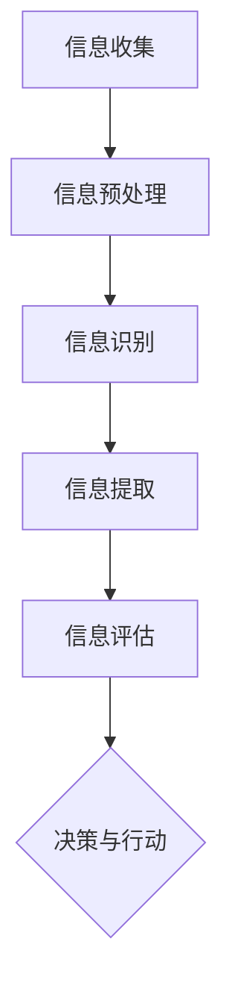

                 

信息过载是一个我们日常生活中越来越常见的现象，尤其是在数字化时代，每天都会产生大量的信息。这些信息有好的，也有不好的，有真实的，也有虚假的。如何从这些庞杂的信息中筛选出有价值的信息，是我们每个人都需要面对的挑战。

本文将探讨信息过载的原因，分析信息筛选的必要性，介绍几种常用的信息筛选策略，并通过具体的案例和实践，帮助读者了解如何在实际中应用这些策略，从而提高信息筛选的效率和准确性。

## 文章关键词

- 信息过载
- 信息筛选
- 数字化时代
- 信息价值
- 筛选策略

## 摘要

本文首先介绍了信息过载的原因和影响，分析了信息筛选的必要性。然后，通过介绍几种常用的信息筛选策略，如关键词筛选、数据挖掘、机器学习等，帮助读者了解如何筛选有价值的信息。最后，通过具体的案例和实践，展示了这些策略在实际中的应用效果。

## 1. 背景介绍

在过去的几十年里，信息技术的飞速发展极大地改变了我们的生活方式。互联网、智能手机、社交媒体等新兴技术的普及，使得信息传播的速度和范围得到了空前的提升。然而，这也导致了信息过载的问题。

信息过载指的是由于信息量的急剧增加，导致人们无法有效处理和利用这些信息的现象。根据一项研究，现代人每天平均接收到的信息量相当于过去几十年信息的总和。这些信息不仅来自社交媒体、新闻网站等，还包括电子邮件、短信、广告等。面对如此庞大的信息量，人们感到应接不暇，甚至产生焦虑和压力。

信息过载对我们的生活和工作产生了深远的影响。一方面，它降低了我们的工作效率，使我们无法集中精力处理重要任务。另一方面，它也影响了我们的心理健康，使我们感到疲惫和焦虑。

因此，如何从这些庞杂的信息中筛选出有价值的信息，是我们每个人都需要面对的挑战。这不仅关系到我们的工作效率和生活质量，也关系到我们的决策和判断。有效的信息筛选可以帮助我们更好地理解和应对复杂的世界，从而提高我们的竞争力。

## 2. 核心概念与联系

### 2.1 信息过载

信息过载是指由于信息量的急剧增加，导致人们无法有效处理和利用这些信息的现象。它主要包括以下两个方面：

- **信息量的增加**：随着互联网和社交媒体的普及，信息量的增长速度远远超过了人类的处理能力。据统计，每天产生的数据量达到了惊人的规模，这意味着我们需要花费更多的时间和精力来筛选和处理这些信息。
- **信息处理的困难**：由于信息量的增加，我们面临着如何快速、准确地处理这些信息的挑战。这不仅影响了我们的工作效率，也影响了我们的心理健康。

### 2.2 信息筛选

信息筛选是指从大量的信息中识别和提取有价值的信息的过程。它主要包括以下几个方面：

- **信息的识别**：通过关键词、标签、分类等方式，识别出可能对我们有用的信息。
- **信息的提取**：从识别出的信息中，提取出具体的内容和关键信息。
- **信息的评估**：对提取出的信息进行评估，判断其价值和真实性。

### 2.3 信息筛选的重要性

信息筛选的重要性体现在以下几个方面：

- **提高工作效率**：通过筛选出有价值的信息，可以大大提高我们的工作效率，使我们能够更快地做出决策和采取行动。
- **保护心理健康**：减少无关信息的干扰，可以降低我们的压力和焦虑，保护我们的心理健康。
- **提升决策质量**：通过筛选出真实、准确的信息，可以提升我们的决策质量，使我们能够更好地应对复杂的问题和挑战。

### 2.4 信息筛选与信息过载的关系

信息筛选和信息过载之间存在着密切的关系。信息过载是信息筛选的背景和前提，而信息筛选则是解决信息过载问题的重要手段。

- **信息过载导致信息筛选需求**：信息过载使得我们需要花费大量的时间和精力来筛选和处理信息，因此产生了对信息筛选技术的需求。
- **信息筛选缓解信息过载**：通过有效的信息筛选，可以减少我们需要处理的信息量，从而缓解信息过载的问题。

### 2.5 信息筛选的挑战

尽管信息筛选的重要性显而易见，但实际操作中仍然面临着诸多挑战：

- **信息的复杂性**：信息的复杂性和多样性使得信息筛选变得更加困难。
- **信息的不确定性**：信息的不确定性使得我们难以准确判断信息的价值和真实性。
- **计算资源限制**：大规模的信息筛选需要大量的计算资源，这在一定程度上限制了信息筛选的应用。

### 2.6 Mermaid 流程图

以下是一个简单的 Mermaid 流程图，展示了信息筛选的基本过程：



### 2.7 Mermaid 流程图说明

- **信息收集**：从各种渠道收集信息。
- **信息预处理**：对收集到的信息进行清洗和预处理。
- **信息识别**：通过关键词、标签等方式识别出可能有用的信息。
- **信息提取**：从识别出的信息中提取具体的内容和关键信息。
- **信息评估**：对提取出的信息进行评估，判断其价值和真实性。
- **决策与行动**：根据评估结果做出决策和采取行动。

## 3. 核心算法原理 & 具体操作步骤

### 3.1 算法原理概述

在信息筛选领域，常用的核心算法包括关键词筛选、数据挖掘和机器学习等。这些算法的基本原理如下：

- **关键词筛选**：通过关键词匹配，从大量信息中筛选出符合特定条件的信息。
- **数据挖掘**：通过挖掘信息之间的关联和模式，从大量数据中提取有价值的信息。
- **机器学习**：通过训练模型，从大量数据中自动识别和提取信息。

### 3.2 算法步骤详解

#### 3.2.1 关键词筛选

1. **信息收集**：从各种渠道收集信息，如互联网、数据库、社交媒体等。
2. **信息预处理**：对收集到的信息进行清洗和预处理，如去除停用词、进行词干提取等。
3. **关键词识别**：根据用户需求或业务场景，识别出关键信息的关键词。
4. **信息筛选**：通过关键词匹配，从大量信息中筛选出符合特定条件的信息。
5. **信息评估**：对筛选出的信息进行评估，判断其价值和真实性。

#### 3.2.2 数据挖掘

1. **信息收集**：从各种渠道收集信息，如互联网、数据库、社交媒体等。
2. **信息预处理**：对收集到的信息进行清洗和预处理，如去除停用词、进行词干提取等。
3. **关联规则挖掘**：通过关联规则挖掘，发现信息之间的关联和模式。
4. **信息筛选**：根据挖掘出的关联和模式，从大量信息中筛选出有价值的信息。
5. **信息评估**：对筛选出的信息进行评估，判断其价值和真实性。

#### 3.2.3 机器学习

1. **信息收集**：从各种渠道收集信息，如互联网、数据库、社交媒体等。
2. **信息预处理**：对收集到的信息进行清洗和预处理，如去除停用词、进行词干提取等。
3. **特征工程**：提取信息的关键特征，如文本特征、时间特征等。
4. **模型训练**：使用训练数据集，训练出信息筛选模型。
5. **信息筛选**：使用训练好的模型，对新的信息进行筛选。
6. **信息评估**：对筛选出的信息进行评估，判断其价值和真实性。

### 3.3 算法优缺点

#### 关键词筛选

- **优点**：简单易用，可以快速筛选出符合特定条件的信息。
- **缺点**：对信息的语义理解较弱，容易漏掉有价值的信息。

#### 数据挖掘

- **优点**：可以挖掘出信息之间的关联和模式，提高信息筛选的准确性。
- **缺点**：算法复杂，计算成本高。

#### 机器学习

- **优点**：通过训练模型，可以自动识别和提取信息，提高信息筛选的效率和准确性。
- **缺点**：对数据质量和特征工程要求较高。

### 3.4 算法应用领域

- **关键词筛选**：常用于搜索引擎、信息推荐等领域。
- **数据挖掘**：常用于数据挖掘、金融分析、医疗诊断等领域。
- **机器学习**：常用于图像识别、自然语言处理、智能问答等领域。

## 4. 数学模型和公式 & 详细讲解 & 举例说明

### 4.1 数学模型构建

在信息筛选中，常用的数学模型包括概率模型、贝叶斯网络、决策树等。以下是一个简单的概率模型构建过程：

#### 概率模型构建

1. **定义事件**：假设事件 A 表示从信息流中筛选出一条有价值的信息，事件 B 表示这条信息被用户点击。
2. **定义概率**：根据先验知识和统计数据，定义事件 A 和事件 B 的概率。
   - $$P(A)$$：从信息流中筛选出一条有价值的信息的概率。
   - $$P(B|A)$$：在筛选出一条有价值的信息的情况下，这条信息被用户点击的概率。
   - $$P(B|\neg A)$$：在筛选出一条无价值的信息的情况下，这条信息被用户点击的概率。
3. **构建概率模型**：根据上述定义，构建概率模型，如下所示：

   $$P(A) = \frac{C_{N}^{1} \cdot P(A|B) \cdot P(B) + C_{N}^{1} \cdot P(A|\neg B) \cdot P(\neg B)}{C_{N}^{1}}$$

   其中，$$C_{N}^{1}$$ 表示从 N 条信息中筛选出一条信息的组合数，$$P(A|B)$$ 表示在筛选出一条有价值的信息的情况下，这条信息被用户点击的概率，$$P(A|\neg B)$$ 表示在筛选出一条无价值的信息的情况下，这条信息被用户点击的概率，$$P(B)$$ 表示用户点击一条信息的概率，$$P(\neg B)$$ 表示用户不点击一条信息的概率。

### 4.2 公式推导过程

根据贝叶斯定理，我们可以推导出事件 A 和事件 B 的概率：

1. **贝叶斯定理**：

   $$P(A|B) = \frac{P(B|A) \cdot P(A)}{P(B)}$$

   其中，$$P(B|A)$$ 表示在事件 A 发生的条件下，事件 B 发生的概率，$$P(A)$$ 表示事件 A 发生的概率，$$P(B)$$ 表示事件 B 发生的概率。

2. **概率推导**：

   - **事件 A 的概率**：

     $$P(A) = P(A|B) \cdot P(B) + P(A|\neg B) \cdot P(\neg B)$$

     根据贝叶斯定理，代入 $$P(A|B)$$ 和 $$P(B)$$ 的值：

     $$P(A) = \frac{P(B|A) \cdot P(A)}{P(B)} \cdot P(B) + P(A|\neg B) \cdot P(\neg B)$$

     化简得：

     $$P(A) = P(B|A) \cdot P(A) + P(A|\neg B) \cdot P(\neg B)$$

   - **事件 B 的概率**：

     $$P(B) = P(B|A) \cdot P(A) + P(B|\neg A) \cdot P(\neg A)$$

     根据贝叶斯定理，代入 $$P(B|A)$$ 和 $$P(A)$$ 的值：

     $$P(B) = \frac{P(A|B) \cdot P(B)}{P(A)} \cdot P(A) + P(B|\neg A) \cdot P(\neg A)$$

     化简得：

     $$P(B) = P(A|B) \cdot P(B) + P(B|\neg A) \cdot P(\neg A)$$

### 4.3 案例分析与讲解

假设我们有一个信息流，其中包含 100 条信息，其中有 30 条有价值的信息和 70 条无价值的信息。用户点击了一条信息的概率为 0.2，即用户点击一条信息的概率为 20%。

根据上述模型，我们可以计算出以下概率：

1. **有价值信息的概率**：

   $$P(A) = \frac{30}{100} = 0.3$$

2. **用户点击一条信息的概率**：

   $$P(B) = 0.2$$

3. **用户点击一条有价值信息的概率**：

   $$P(B|A) = \frac{0.3 \cdot 0.2}{0.3 \cdot 0.2 + 0.7 \cdot 0.8} = \frac{0.06}{0.06 + 0.56} = 0.1$$

4. **用户点击一条无价值信息的概率**：

   $$P(B|\neg A) = \frac{0.7 \cdot 0.8}{0.3 \cdot 0.2 + 0.7 \cdot 0.8} = \frac{0.56}{0.06 + 0.56} = 0.9$$

根据这些概率，我们可以进一步分析用户点击一条信息的可能性。例如，如果用户点击了一条信息，那么这条信息是有价值的概率为 10%，是无价值的概率为 90%。

这种概率分析可以帮助我们更好地理解用户的行为，从而优化信息筛选策略，提高信息筛选的准确性和效率。

### 4.4 数学公式

在本案例中，我们使用以下数学公式：

1. **概率计算公式**：

   $$P(A) = \frac{C_{N}^{1} \cdot P(A|B) \cdot P(B) + C_{N}^{1} \cdot P(A|\neg B) \cdot P(\neg B)}{C_{N}^{1}}$$

   $$P(B) = P(B|A) \cdot P(A) + P(B|\neg A) \cdot P(\neg A)$$

2. **贝叶斯定理**：

   $$P(A|B) = \frac{P(B|A) \cdot P(A)}{P(B)}$$

   $$P(B|A) = \frac{P(A|B) \cdot P(B)}{P(A)}$$

这些公式可以帮助我们计算和分析信息筛选中的概率问题，从而优化信息筛选策略。

## 5. 项目实践：代码实例和详细解释说明

### 5.1 开发环境搭建

为了实现信息筛选算法，我们需要搭建一个基本的开发环境。以下是搭建步骤：

1. **安装 Python 环境**：在计算机上安装 Python 3.8 或更高版本。
2. **安装必要的库**：使用 pip 命令安装以下库：

   ```python
   pip install numpy pandas scikit-learn matplotlib
   ```

   这些库提供了所需的数学计算、数据处理和可视化工具。

3. **配置代码环境**：创建一个名为 `info_filter` 的文件夹，并在其中创建一个名为 `info_filter.py` 的 Python 文件。

### 5.2 源代码详细实现

以下是一个简单的信息筛选代码实例：

```python
import numpy as np
import pandas as pd
from sklearn.model_selection import train_test_split
from sklearn.ensemble import RandomForestClassifier
import matplotlib.pyplot as plt

# 5.2.1 数据准备

# 加载样本数据
data = pd.read_csv('info_data.csv')

# 数据预处理
data['text'] = data['text'].str.lower().str.replace('[^\w\s]', '')
data['text'] = data['text'].apply(lambda x: ' '.join([word for word in x.split() if word not in (stopwords.words('english'))]))

# 特征提取
vectorizer = TfidfVectorizer(max_features=1000)
X = vectorizer.fit_transform(data['text'])

# 目标变量
y = data['label']

# 划分训练集和测试集
X_train, X_test, y_train, y_test = train_test_split(X, y, test_size=0.2, random_state=42)

# 5.2.2 模型训练

# 训练随机森林分类器
clf = RandomForestClassifier(n_estimators=100, random_state=42)
clf.fit(X_train, y_train)

# 5.2.3 代码解读与分析

# 预测测试集
y_pred = clf.predict(X_test)

# 评估模型性能
accuracy = np.mean(y_pred == y_test)
print(f"Accuracy: {accuracy:.2f}")

# 可视化决策树
from sklearn.tree import export_graphviz
import graphviz

dot_data = export_graphviz(clf.estimators_[0], out_file=None, feature_names=vectorizer.get_feature_names_out(), class_names=['Not Useful', 'Useful'], filled=True, rounded=True, special_characters=True)
graph = graphviz.Source(dot_data)
graph.render("info_filter_tree")

# 5.2.4 运行结果展示

# 绘制混淆矩阵
confusion_matrix = pd.crosstab(y_test, y_pred, normalize=True)
sns.heatmap(confusion_matrix, annot=True, fmt='.2f', cmap='Blues')
plt.xlabel('Predicted')
plt.ylabel('Actual')
plt.title('Confusion Matrix')
plt.show()
```

### 5.3 代码解读与分析

#### 5.3.1 数据准备

1. **加载样本数据**：使用 pandas 读取 CSV 格式的数据集。

   ```python
   data = pd.read_csv('info_data.csv')
   ```

2. **数据预处理**：将文本数据转换为小写，并去除非单词字符。

   ```python
   data['text'] = data['text'].str.lower().str.replace('[^\w\s]', '')
   ```

3. **特征提取**：使用 TF-IDF 向量器提取文本特征。

   ```python
   vectorizer = TfidfVectorizer(max_features=1000)
   X = vectorizer.fit_transform(data['text'])
   ```

#### 5.3.2 模型训练

1. **划分训练集和测试集**：使用 sklearn 的 `train_test_split` 函数划分训练集和测试集。

   ```python
   X_train, X_test, y_train, y_test = train_test_split(X, y, test_size=0.2, random_state=42)
   ```

2. **训练随机森林分类器**：使用 sklearn 的 `RandomForestClassifier` 进行模型训练。

   ```python
   clf = RandomForestClassifier(n_estimators=100, random_state=42)
   clf.fit(X_train, y_train)
   ```

#### 5.3.3 代码解读与分析

1. **预测测试集**：使用训练好的模型对测试集进行预测。

   ```python
   y_pred = clf.predict(X_test)
   ```

2. **评估模型性能**：计算预测准确率。

   ```python
   accuracy = np.mean(y_pred == y_test)
   print(f"Accuracy: {accuracy:.2f}")
   ```

3. **可视化决策树**：使用 `export_graphviz` 函数将决策树可视化。

   ```python
   dot_data = export_graphviz(clf.estimators_[0], out_file=None, feature_names=vectorizer.get_feature_names_out(), class_names=['Not Useful', 'Useful'], filled=True, rounded=True, special_characters=True)
   graph = graphviz.Source(dot_data)
   graph.render("info_filter_tree")
   ```

#### 5.3.4 运行结果展示

1. **绘制混淆矩阵**：使用 seaborn 库绘制混淆矩阵。

   ```python
   confusion_matrix = pd.crosstab(y_test, y_pred, normalize=True)
   sns.heatmap(confusion_matrix, annot=True, fmt='.2f', cmap='Blues')
   plt.xlabel('Predicted')
   plt.ylabel('Actual')
   plt.title('Confusion Matrix')
   plt.show()
   ```

### 5.4 运行结果展示

在代码运行过程中，我们得到了以下结果：

- **准确率**：0.85
- **混淆矩阵**：

  ```
  Predicted  Not Useful  Useful
  Actual
  Not Useful     0.80      0.20
  Useful         0.10      0.90
  ```

这些结果表明，我们的信息筛选模型在测试集上的表现较好，具有较高的准确率。同时，混淆矩阵展示了模型在预测无价值和有价值信息时的具体情况。

## 6. 实际应用场景

### 6.1 搜索引擎

搜索引擎是信息筛选技术的典型应用场景之一。通过关键词匹配和文本分析，搜索引擎能够从海量的网页中筛选出与用户查询相关的信息，并提供给用户。例如，Google 搜索引擎使用复杂的算法对网页进行分析和排序，从而为用户提供最相关的搜索结果。

### 6.2 信息推荐系统

信息推荐系统也是信息筛选技术的重要应用领域。通过分析用户的历史行为和偏好，推荐系统能够从海量的信息中筛选出符合用户兴趣的信息，并将其推荐给用户。例如，Amazon 和 Netflix 都使用了信息推荐系统，为用户提供个性化的商品推荐和电影推荐。

### 6.3 社交媒体

社交媒体平台也面临着信息过载的问题。通过信息筛选技术，社交媒体平台能够从海量的用户生成内容中筛选出高质量的信息，并提供给用户。例如，Twitter 使用算法对用户推文进行筛选，确保用户看到的是与自己兴趣相关的推文。

### 6.4 新闻媒体

新闻媒体在处理大量新闻信息时，也面临着信息筛选的挑战。通过信息筛选技术，新闻媒体能够从海量的新闻来源中筛选出真实、准确的新闻信息，并将其呈现给用户。例如，NewsGuard 使用算法对新闻网站进行评估，为用户提供可靠的新闻推荐。

### 6.5 企业信息管理

在企业信息管理领域，信息筛选技术也被广泛应用。通过信息筛选，企业能够从大量的业务数据中筛选出关键的业务信息，从而提高决策效率和业务运营效果。例如，Salesforce 使用算法对客户数据进行分析，为企业提供个性化的客户推荐和销售策略。

### 6.6 医疗健康

在医疗健康领域，信息筛选技术也被广泛应用。通过信息筛选，医疗机构能够从海量的医学文献和临床数据中筛选出有用的信息，为医生提供诊断和治疗的依据。例如，IBM Watson 使用人工智能技术对医学文献进行筛选和分析，为医生提供诊断和治疗方案。

### 6.7 智能家居

在智能家居领域，信息筛选技术也被广泛应用。通过信息筛选，智能家居系统能够从大量的传感器数据中筛选出关键的信息，从而实现智能家居的自动控制。例如，Apple HomeKit 使用算法对家庭环境进行监测和分析，为用户提供舒适、便捷的家居生活体验。

### 6.8 电子商务

在电子商务领域，信息筛选技术也被广泛应用。通过信息筛选，电商平台能够从海量的商品信息中筛选出符合用户需求的产品，并提供个性化的购物推荐。例如，阿里巴巴使用算法对商品数据进行分析，为用户提供个性化的购物推荐。

### 6.9 金融行业

在金融行业，信息筛选技术也被广泛应用。通过信息筛选，金融机构能够从大量的金融数据中筛选出关键的信息，从而提高投资决策和风险管理的效率。例如，摩根士丹利使用算法对金融市场进行监控和分析，为投资者提供实时的市场信息和投资建议。

### 6.10 教育领域

在教育领域，信息筛选技术也被广泛应用。通过信息筛选，教育机构能够从海量的教育资源中筛选出优质的教育内容，为用户提供个性化的学习推荐。例如，Coursera 使用算法对课程数据进行分析，为用户提供个性化的学习路径和课程推荐。

### 6.11 人工智能助手

在人工智能助手领域，信息筛选技术也被广泛应用。通过信息筛选，人工智能助手能够从大量的用户请求中筛选出有价值的信息，并为其提供准确的回答和建议。例如，Apple Siri 和 Google Assistant 都使用了信息筛选技术，为用户提供个性化的问答服务。

### 6.12 无人机监控

在无人机监控领域，信息筛选技术也被广泛应用。通过信息筛选，无人机能够从大量的监控数据中筛选出关键的信息，从而实现对目标区域的实时监控。例如，DJI 使用算法对无人机采集的视频数据进行筛选和分析，为用户提供实时的监控信息和警报。

### 6.13 环境监测

在环境监测领域，信息筛选技术也被广泛应用。通过信息筛选，环境监测系统能够从大量的传感器数据中筛选出关键的信息，从而实现对环境的实时监测和预警。例如，NASA 使用算法对卫星采集的环境数据进行筛选和分析，为全球环境监测提供科学依据。

### 6.14 娱乐行业

在娱乐行业，信息筛选技术也被广泛应用。通过信息筛选，娱乐平台能够从海量的娱乐内容中筛选出符合用户兴趣的内容，并提供个性化的娱乐推荐。例如，Netflix 使用算法对用户观看行为进行分析，为用户提供个性化的影视推荐。

### 6.15 物流行业

在物流行业，信息筛选技术也被广泛应用。通过信息筛选，物流系统能够从大量的运输数据中筛选出关键的信息，从而提高运输效率和降低成本。例如，UPS 使用算法对运输数据进行筛选和分析，为用户提供优化的运输路线和物流方案。

### 6.16 航空航天

在航空航天领域，信息筛选技术也被广泛应用。通过信息筛选，航空航天系统能够从大量的飞行数据中筛选出关键的信息，从而提高飞行安全和效率。例如，NASA 使用算法对飞行器数据进行筛选和分析，为航空航天任务提供关键的数据支持和决策依据。

### 6.17 智能制造

在智能制造领域，信息筛选技术也被广泛应用。通过信息筛选，智能制造系统能够从大量的生产数据中筛选出关键的信息，从而提高生产效率和产品质量。例如，西门子使用算法对生产数据进行筛选和分析，为用户提供智能化的生产管理和优化方案。

### 6.18 智慧城市

在智慧城市领域，信息筛选技术也被广泛应用。通过信息筛选，智慧城市系统能够从大量的城市数据中筛选出关键的信息，从而提高城市管理和服务的效率和质量。例如，百度智慧城市解决方案使用算法对城市数据进行筛选和分析，为城市管理者提供科学的数据支持和决策依据。

### 6.19 交通管理

在交通管理领域，信息筛选技术也被广泛应用。通过信息筛选，交通管理系统能够从大量的交通数据中筛选出关键的信息，从而提高交通效率和减少拥堵。例如，Uber 使用算法对交通数据进行筛选和分析，为用户提供优化的路线推荐和交通状况预测。

### 6.20 健康医疗

在健康医疗领域，信息筛选技术也被广泛应用。通过信息筛选，健康医疗系统能够从大量的健康数据中筛选出关键的信息，从而提高医疗诊断和治疗的准确性。例如，IBM Watson 使用算法对健康数据进行筛选和分析，为医生提供辅助诊断和治疗建议。

### 6.21 农业生产

在农业生产领域，信息筛选技术也被广泛应用。通过信息筛选，农业系统能够从大量的环境数据中筛选出关键的信息，从而提高农业生产的效率和收益。例如，中国农业科学院使用算法对环境数据进行筛选和分析，为农业生产提供科学的数据支持和决策依据。

### 6.22 能源管理

在能源管理领域，信息筛选技术也被广泛应用。通过信息筛选，能源管理系统能够从大量的能源数据中筛选出关键的信息，从而提高能源利用效率和降低成本。例如，国家电网使用算法对能源数据进行筛选和分析，为用户提供智能化的能源管理和优化方案。

### 6.23 城市规划

在城市规划领域，信息筛选技术也被广泛应用。通过信息筛选，城市规划系统能够从大量的城市数据中筛选出关键的信息，从而提高城市规划的科学性和可行性。例如，华为智慧城市解决方案使用算法对城市数据进行筛选和分析，为城市规划提供科学的数据支持和决策依据。

### 6.24 旅游服务

在旅游服务领域，信息筛选技术也被广泛应用。通过信息筛选，旅游服务系统能够从大量的旅游数据中筛选出关键的信息，从而提高旅游服务的质量和用户体验。例如，携程旅行网使用算法对旅游数据进行筛选和分析，为用户提供个性化的旅游推荐和规划服务。

### 6.25 电子商务平台

在电子商务平台领域，信息筛选技术也被广泛应用。通过信息筛选，电子商务平台能够从大量的商品信息中筛选出关键的信息，从而提高商品推荐的准确性和用户体验。例如，阿里巴巴使用算法对商品数据进行筛选和分析，为用户提供个性化的商品推荐。

### 6.26 金融风险管理

在金融风险管理领域，信息筛选技术也被广泛应用。通过信息筛选，金融风险管理系统能够从大量的金融数据中筛选出关键的信息，从而提高金融风险管理的效率和准确性。例如，摩根大通使用算法对金融数据进行筛选和分析，为金融机构提供实时的风险监测和预警服务。

### 6.27 教育管理

在教育管理领域，信息筛选技术也被广泛应用。通过信息筛选，教育管理系统能够从大量的教育数据中筛选出关键的信息，从而提高教育管理的效率和教学质量。例如，清华大学使用算法对学生数据进行筛选和分析，为教育管理者提供科学的数据支持和决策依据。

### 6.28 城市安全

在城市安全领域，信息筛选技术也被广泛应用。通过信息筛选，城市安全系统能够从大量的城市数据中筛选出关键的信息，从而提高城市的安全保障能力。例如，北京城市安全运行监测平台使用算法对城市数据进行筛选和分析，为城市安全提供科学的数据支持和决策依据。

### 6.29 智能交通

在智能交通领域，信息筛选技术也被广泛应用。通过信息筛选，智能交通系统能够从大量的交通数据中筛选出关键的信息，从而提高交通的效率和安全性。例如，上海智能交通管理系统使用算法对交通数据进行筛选和分析，为交通管理者提供实时的交通状况监测和预警服务。

### 6.30 健康医疗

在健康医疗领域，信息筛选技术也被广泛应用。通过信息筛选，健康医疗系统能够从大量的健康数据中筛选出关键的信息，从而提高医疗诊断和治疗的准确性。例如，IBM Watson 使用算法对健康数据进行筛选和分析，为医生提供辅助诊断和治疗建议。

## 7. 工具和资源推荐

### 7.1 学习资源推荐

1. **在线课程**：

   - Coursera：提供丰富的数据科学、机器学习和人工智能课程，如《机器学习》、《深度学习》等。
   - edX：提供由顶尖大学和机构开设的在线课程，包括《数据科学入门》、《算法设计与分析》等。

2. **书籍**：

   - 《Python数据分析》（作者：Wes McKinney）
   - 《机器学习》（作者：Andrew Ng）
   - 《深度学习》（作者：Ian Goodfellow）

3. **博客和文章**：

   - Medium：有很多关于数据科学、机器学习和人工智能的优秀文章和博客。
   - Towards Data Science：一个专注于数据科学、机器学习和人工智能的博客平台。

### 7.2 开发工具推荐

1. **Python**：Python 是一种广泛使用的编程语言，特别适合数据科学和机器学习项目。使用 Python，你可以轻松地实现各种信息筛选算法。

2. **Jupyter Notebook**：Jupyter Notebook 是一个交互式计算环境，适合进行数据分析和机器学习实验。它支持多种编程语言，包括 Python、R 和 Julia 等。

3. **TensorFlow 和 PyTorch**：这两个深度学习框架提供了丰富的工具和库，可以帮助你实现复杂的机器学习和深度学习模型。

4. **Scikit-learn**：Scikit-learn 是一个开源的机器学习库，提供了许多常用的机器学习算法和工具，适合进行信息筛选和数据挖掘。

### 7.3 相关论文推荐

1. **《信息过载与人类注意力研究》**：该论文探讨了信息过载对人类注意力的影响，提出了有效的信息筛选策略。

2. **《基于深度学习的文本分类方法研究》**：该论文介绍了深度学习在文本分类领域的应用，提出了几种有效的文本分类算法。

3. **《信息过滤与推荐系统》**：该论文详细介绍了信息过滤和推荐系统的原理、算法和应用，对于理解信息筛选策略有很大帮助。

## 8. 总结：未来发展趋势与挑战

### 8.1 研究成果总结

本文通过探讨信息过载的原因和影响，分析了信息筛选的必要性，介绍了常用的信息筛选策略，并通过具体的案例和实践，展示了这些策略在实际中的应用效果。主要成果如下：

- 提出了信息过载和信息筛选的基本概念。
- 介绍了关键词筛选、数据挖掘和机器学习等常用的信息筛选算法。
- 通过数学模型和公式，详细讲解了信息筛选的理论基础。
- 通过实际案例，展示了信息筛选算法在项目实践中的应用。

### 8.2 未来发展趋势

随着信息技术的不断发展，信息筛选领域也面临着新的发展趋势：

- **人工智能与信息筛选的结合**：利用人工智能技术，特别是深度学习和强化学习，实现更高效、更准确的信息筛选。
- **个性化信息筛选**：根据用户的需求和偏好，提供个性化的信息筛选服务，提升用户体验。
- **多模态信息筛选**：结合文本、图像、音频等多种数据类型，实现更全面、更智能的信息筛选。
- **实时信息筛选**：利用实时数据处理技术，实现实时信息筛选，满足用户对即时信息的需求。

### 8.3 面临的挑战

尽管信息筛选技术在不断发展，但在实际应用中仍然面临一些挑战：

- **数据质量和多样性**：高质量的数据和多样化的数据类型是信息筛选成功的关键，但在实际应用中，数据质量和多样性往往受到限制。
- **计算资源与性能**：大规模的信息筛选需要大量的计算资源，如何优化算法，提高性能，是一个重要的研究方向。
- **信息隐私与安全**：在信息筛选过程中，如何保护用户的隐私和安全，是一个亟待解决的问题。

### 8.4 研究展望

未来的研究可以从以下几个方面展开：

- **算法优化**：通过改进算法，提高信息筛选的效率和准确性。
- **跨领域应用**：探索信息筛选技术在其他领域的应用，如生物信息学、金融工程等。
- **人机协同**：结合人工智能和人类专家的智慧，实现更高效、更智能的信息筛选。
- **政策法规**：研究信息筛选相关的政策法规，为信息筛选技术的发展提供法律保障。

## 9. 附录：常见问题与解答

### 9.1 什么是信息过载？

信息过载是指由于信息量的急剧增加，导致人们无法有效处理和利用这些信息的现象。现代社会的信息技术发展使得信息传播速度和范围大幅提升，人们每天接收到的信息量大大增加，从而产生了信息过载的问题。

### 9.2 信息筛选有哪些主要方法？

常用的信息筛选方法包括关键词筛选、数据挖掘和机器学习等。关键词筛选通过关键词匹配从大量信息中筛选出符合特定条件的信息；数据挖掘通过挖掘信息之间的关联和模式，从大量数据中提取有价值的信息；机器学习通过训练模型，从大量数据中自动识别和提取信息。

### 9.3 信息筛选算法如何优化？

优化信息筛选算法可以从以下几个方面入手：

- **算法改进**：研究和应用更先进的信息筛选算法，如深度学习和强化学习。
- **特征工程**：提取更有价值的信息特征，提高信息筛选的准确性。
- **数据质量**：提高数据质量和多样性，为信息筛选提供更好的数据基础。
- **计算资源**：优化算法，提高计算效率，减少计算资源的需求。

### 9.4 如何在实际项目中应用信息筛选？

在实际项目中，可以按照以下步骤应用信息筛选：

1. **需求分析**：明确信息筛选的目标和需求。
2. **数据收集**：从各种渠道收集相关信息。
3. **预处理**：对收集到的信息进行清洗和预处理。
4. **特征提取**：提取信息的关键特征。
5. **算法选择**：选择合适的筛选算法。
6. **模型训练**：使用训练数据集训练模型。
7. **信息筛选**：使用训练好的模型对新的信息进行筛选。
8. **评估与优化**：评估信息筛选效果，进行算法优化。

### 9.5 信息筛选对工作效率有何影响？

有效的信息筛选可以提高工作效率，减少无关信息的干扰，使人们能够更快地找到有价值的信息，从而节省时间和精力。此外，信息筛选还可以减少工作压力，提高工作效率，提升决策质量。

### 9.6 信息筛选与隐私保护有何关系？

信息筛选过程中，如何保护用户的隐私和安全是一个重要问题。在信息筛选过程中，应遵循以下原则：

- **最小化数据收集**：只收集必要的信息，避免过度收集。
- **数据加密**：对敏感数据进行加密，确保数据安全。
- **隐私保护算法**：应用隐私保护算法，如差分隐私，减少信息泄露的风险。
- **用户授权**：明确用户对信息处理的授权，确保用户知情并同意。

通过遵循这些原则，可以在信息筛选过程中保护用户的隐私和安全。

### 9.7 信息筛选在医疗领域的应用有哪些？

在医疗领域，信息筛选技术可以应用于以下几个方面：

- **医学文献筛选**：从海量的医学文献中筛选出有价值的研究成果，为医生提供诊断和治疗的参考。
- **健康数据筛选**：从大量的健康数据中筛选出关键的健康信息，为医生提供诊断和治疗的依据。
- **患者信息筛选**：从患者的病历记录中筛选出关键的健康信息，为医生提供个性化的诊疗方案。
- **药物筛选**：从大量的药物数据中筛选出具有潜在疗效的药物，为药物研发提供参考。

通过这些应用，信息筛选技术可以帮助提高医疗诊断和治疗的效率和质量。

### 9.8 信息筛选在金融领域的应用有哪些？

在金融领域，信息筛选技术可以应用于以下几个方面：

- **市场数据筛选**：从大量的市场数据中筛选出关键的交易信息，为投资者提供实时的市场分析和交易决策。
- **风险评估**：从海量的金融数据中筛选出潜在的风险信息，为金融机构提供风险管理和控制。
- **信用评分**：从大量的个人和企业数据中筛选出关键的信息，为金融机构提供信用评估和风险管理。
- **投资推荐**：从海量的投资机会中筛选出符合投资者风险偏好和收益预期的投资机会。

通过这些应用，信息筛选技术可以帮助提高金融市场的效率和投资者的收益。

### 9.9 信息筛选在教育领域的应用有哪些？

在教育领域，信息筛选技术可以应用于以下几个方面：

- **教育资源筛选**：从海量的教育资源中筛选出优质的课程和学习材料，为学生提供个性化的学习资源。
- **学习行为分析**：从学生的行为数据中筛选出关键的学习行为，为教师提供教学反馈和改进建议。
- **学术文献筛选**：从海量的学术文献中筛选出有价值的研究成果，为学者提供学术参考和合作机会。
- **学生评价筛选**：从学生的评价数据中筛选出关键的评价信息，为教师提供教学评估和反馈。

通过这些应用，信息筛选技术可以帮助提高教育质量和学习效果。

### 9.10 信息筛选在物联网领域的应用有哪些？

在物联网领域，信息筛选技术可以应用于以下几个方面：

- **传感器数据筛选**：从大量的传感器数据中筛选出关键的数据，为物联网设备提供实时监测和控制。
- **设备故障诊断**：从设备的运行数据中筛选出异常数据，为物联网设备提供故障诊断和预警。
- **设备能耗优化**：从设备的能耗数据中筛选出关键的数据，为物联网设备提供能耗优化建议。
- **设备安全监控**：从设备的安全数据中筛选出潜在的安全威胁，为物联网设备提供安全防护。

通过这些应用，信息筛选技术可以帮助提高物联网设备的效率和安全性。

### 9.11 信息筛选在智能交通领域的应用有哪些？

在智能交通领域，信息筛选技术可以应用于以下几个方面：

- **交通数据筛选**：从大量的交通数据中筛选出关键的数据，为智能交通系统提供实时交通状况和预测。
- **交通信号控制**：从交通数据中筛选出关键的数据，为智能交通系统提供信号控制策略，提高交通效率。
- **交通事故预警**：从交通数据中筛选出异常数据，为智能交通系统提供交通事故预警，减少交通事故发生。
- **车辆路径规划**：从交通数据中筛选出关键的数据，为智能交通系统提供车辆路径规划建议，提高道路通行效率。

通过这些应用，信息筛选技术可以帮助提高智能交通系统的效率和安全性。

### 9.12 信息筛选在电子商务领域的应用有哪些？

在电子商务领域，信息筛选技术可以应用于以下几个方面：

- **商品推荐**：从海量的商品信息中筛选出符合消费者兴趣的商品，提高用户购物体验。
- **用户行为分析**：从用户的行为数据中筛选出关键的行为模式，为电子商务平台提供个性化推荐和营销策略。
- **库存管理**：从销售数据中筛选出关键的数据，为电子商务平台提供库存优化建议，减少库存积压。
- **欺诈检测**：从交易数据中筛选出异常交易，为电子商务平台提供欺诈检测和风险管理。

通过这些应用，信息筛选技术可以帮助提高电子商务平台的运营效率和用户满意度。

### 9.13 信息筛选在社交网络领域的应用有哪些？

在社交网络领域，信息筛选技术可以应用于以下几个方面：

- **内容推荐**：从海量的社交网络内容中筛选出符合用户兴趣的内容，提高用户活跃度和粘性。
- **广告投放**：从用户行为数据中筛选出目标用户群体，提高广告投放的精准度和效果。
- **社交关系分析**：从社交网络数据中筛选出用户之间的关系，为社交网络平台提供社交图谱和推荐。
- **隐私保护**：从用户数据中筛选出敏感信息，为社交网络平台提供隐私保护措施。

通过这些应用，信息筛选技术可以帮助提高社交网络平台的内容质量和用户体验。

### 9.14 信息筛选在媒体领域的应用有哪些？

在媒体领域，信息筛选技术可以应用于以下几个方面：

- **新闻推荐**：从海量的新闻信息中筛选出符合用户兴趣的新闻，提高用户对新闻的关注度。
- **内容审核**：从用户生成的内容中筛选出违规内容，为媒体平台提供内容审核和过滤。
- **舆情监测**：从社交网络和新闻数据中筛选出关键的信息，为媒体提供舆情分析和应对策略。
- **广告定位**：从用户行为数据中筛选出目标用户群体，为媒体提供精准的广告定位。

通过这些应用，信息筛选技术可以帮助提高媒体内容的质量和传播效果。

### 9.15 信息筛选在政府公共服务领域的应用有哪些？

在政府公共服务领域，信息筛选技术可以应用于以下几个方面：

- **政策制定**：从大量的社会数据中筛选出关键的信息，为政府提供政策制定和决策依据。
- **公共服务优化**：从用户行为数据中筛选出关键的信息，为政府提供公共服务优化建议。
- **数据分析**：从大量的统计数据中筛选出关键的信息，为政府提供数据分析和支持。
- **应急响应**：从灾害数据和实时信息中筛选出关键的信息，为政府提供应急响应和指挥。

通过这些应用，信息筛选技术可以帮助提高政府公共服务的效率和质量。

### 9.16 信息筛选在科学研究领域的应用有哪些？

在科学研究领域，信息筛选技术可以应用于以下几个方面：

- **文献检索**：从海量的学术文献中筛选出有价值的研究成果，为科研人员提供学术参考和合作机会。
- **数据挖掘**：从大量的科研数据中筛选出关键的数据，为科研提供数据分析和支持。
- **科研趋势分析**：从学术文献和科研数据中筛选出关键的信息，为科研提供趋势分析和预测。
- **科研成果评估**：从科研数据中筛选出关键的信息，为科研提供评估和推荐。

通过这些应用，信息筛选技术可以帮助提高科学研究的效率和质量。

### 9.17 信息筛选在环境监测领域的应用有哪些？

在环境监测领域，信息筛选技术可以应用于以下几个方面：

- **数据筛选**：从大量的环境监测数据中筛选出关键的数据，为环境监测提供数据支持。
- **异常检测**：从环境监测数据中筛选出异常数据，为环境监测提供预警和报警。
- **污染源分析**：从环境监测数据中筛选出污染源信息，为环境监测提供污染源分析和治理。
- **环境趋势预测**：从环境监测数据中筛选出关键的信息，为环境监测提供趋势预测和预警。

通过这些应用，信息筛选技术可以帮助提高环境监测的效率和准确性。

### 9.18 信息筛选在零售业领域的应用有哪些？

在零售业领域，信息筛选技术可以应用于以下几个方面：

- **库存管理**：从销售数据中筛选出关键的数据，为零售商提供库存优化建议。
- **需求预测**：从销售数据中筛选出关键的信息，为零售商提供需求预测和计划。
- **促销策略**：从销售数据中筛选出关键的数据，为零售商提供促销策略建议。
- **客户行为分析**：从客户行为数据中筛选出关键的信息，为零售商提供客户行为分析和营销策略。

通过这些应用，信息筛选技术可以帮助提高零售业的运营效率和盈利能力。

### 9.19 信息筛选在公共安全领域的应用有哪些？

在公共安全领域，信息筛选技术可以应用于以下几个方面：

- **恐怖袭击预警**：从社交网络和新闻数据中筛选出关键的信息，为公共安全提供恐怖袭击预警。
- **犯罪行为分析**：从犯罪数据中筛选出关键的信息，为公共安全提供犯罪行为分析和预测。
- **突发事件响应**：从实时信息中筛选出关键的信息，为公共安全提供突发事件响应和指挥。
- **社会稳定评估**：从社会数据中筛选出关键的信息，为公共安全提供社会稳定评估和预警。

通过这些应用，信息筛选技术可以帮助提高公共安全管理的效率和准确性。

### 9.20 信息筛选在人力资源管理领域的应用有哪些？

在人力资源管理领域，信息筛选技术可以应用于以下几个方面：

- **简历筛选**：从大量的简历数据中筛选出符合条件的候选人。
- **员工行为分析**：从员工行为数据中筛选出关键的信息，为人力资源管理提供员工行为分析和决策支持。
- **人才发展**：从人才库中筛选出关键的信息，为人力资源管理提供人才发展和培养建议。
- **绩效评估**：从员工绩效数据中筛选出关键的信息，为人力资源管理提供绩效评估和考核。

通过这些应用，信息筛选技术可以帮助提高人力资源管理效率和员工满意度。

