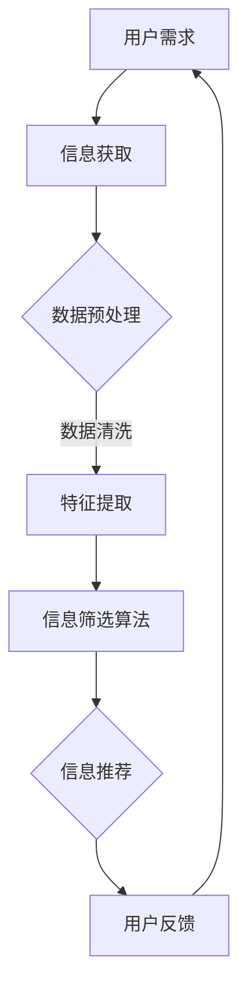

                 

关键词：信息过载，信息筛选，人工智能，数据处理，知识管理，信息过滤算法，信息检索

> 摘要：随着互联网和社交媒体的快速发展，信息过载成为现代社会的一大挑战。面对海量的信息，如何有效地筛选和获取有价值的信息变得至关重要。本文将探讨信息过载的现状及其影响，介绍几种常用的信息筛选策略，并通过实例和实践，展示如何在实际应用中运用这些策略，以帮助读者在信息洪流中找到有价值的信息。

## 1. 背景介绍

在互联网时代，信息爆炸成为不可避免的现象。每天都有无数的信息通过各种渠道源源不断地传递到我们的生活中，从新闻、社交媒体、电子邮件到在线论坛和博客，信息无处不在。这种信息的过载给人们的生活和工作带来了巨大的挑战。据统计，人类接收的信息量在过去几十年中呈指数级增长，而人类的大脑处理能力却相对有限。这种信息处理能力的差距，导致了人们面临着信息过载的困境。

信息过载的影响是多方面的。首先，它降低了人们的注意力集中度，导致工作效率下降。其次，它增加了人们的心理压力，容易导致焦虑和疲劳。最后，它降低了人们对于信息的真实性和价值的判断能力，容易导致信息过载下的误判和误信。

因此，如何应对信息过载，提高信息筛选能力，成为现代社会亟待解决的问题。

## 2. 核心概念与联系

### 2.1 信息过载的概念

信息过载是指接收到的信息量超出了个人或组织的处理能力，导致信息处理效率降低的现象。信息过载可以分为以下几个层次：

1. **数据过载**：接收到的数据量巨大，但数据的质量和相关性不高。
2. **认知过载**：接收到的信息量超出了大脑的处理能力，导致信息处理的准确性和效率下降。
3. **决策过载**：在处理大量信息时，人们难以做出正确的决策。

### 2.2 信息筛选的概念

信息筛选是指从大量的信息中识别、选择和提取出对用户有价值的信息的过程。信息筛选的目标是减少信息过载，提高信息处理的效率。信息筛选可以基于以下几种方式：

1. **基于内容的筛选**：根据信息的主题、关键词、摘要等，通过算法或人工筛选出对用户有价值的信息。
2. **基于上下文的筛选**：根据用户的上下文环境，如时间、地点、浏览历史等，筛选出对用户有价值的信息。
3. **基于社交的筛选**：根据用户的社交网络，如好友、关注的人等，筛选出用户可能感兴趣的信息。

### 2.3 信息筛选与人工智能的联系

人工智能（AI）在信息筛选中发挥着重要作用。AI可以通过机器学习、自然语言处理等技术，实现信息的自动分类、筛选和推荐。AI的信息筛选能力不仅依赖于算法的复杂度，还依赖于数据的质量和多样性。以下是一个简单的 Mermaid 流程图，展示了信息筛选的流程和人工智能的应用。



## 3. 核心算法原理 & 具体操作步骤

### 3.1 算法原理概述

信息筛选的核心算法主要包括以下几种：

1. **关键词匹配算法**：通过关键词匹配，筛选出与用户需求相关的信息。
2. **机器学习分类算法**：通过训练模型，自动分类信息，提高筛选的准确性。
3. **协同过滤算法**：基于用户的兴趣和行为，推荐用户可能感兴趣的信息。

### 3.2 算法步骤详解

#### 3.2.1 关键词匹配算法

1. **信息预处理**：对原始信息进行清洗，去除停用词，进行词干提取等。
2. **关键词提取**：从预处理后的信息中提取关键词。
3. **关键词匹配**：将提取的关键词与用户需求的关键词进行匹配，筛选出匹配度较高的信息。

#### 3.2.2 机器学习分类算法

1. **数据收集**：收集大量标注好的数据集。
2. **特征提取**：从数据中提取特征，如文本特征、图像特征等。
3. **模型训练**：使用提取的特征，训练分类模型。
4. **信息分类**：将新信息输入模型，进行分类。

#### 3.2.3 协同过滤算法

1. **用户行为数据收集**：收集用户的浏览、购买、评价等行为数据。
2. **用户兴趣模型构建**：基于用户行为数据，构建用户兴趣模型。
3. **信息推荐**：根据用户兴趣模型，推荐用户可能感兴趣的信息。

### 3.3 算法优缺点

#### 关键词匹配算法

- **优点**：实现简单，效率高。
- **缺点**：对信息质量的依赖较大，难以处理语义层面的信息。

#### 机器学习分类算法

- **优点**：能够处理复杂的信息，提高筛选的准确性。
- **缺点**：需要大量的训练数据和计算资源。

#### 协同过滤算法

- **优点**：能够根据用户的兴趣和行为，提供个性化的信息推荐。
- **缺点**：容易陷入“同温层”效应，推荐的信息可能过于单一。

### 3.4 算法应用领域

信息筛选算法在多个领域都有广泛的应用，如搜索引擎、社交媒体、电子邮件等。以下是一些典型的应用场景：

1. **搜索引擎**：通过关键词匹配算法，提高搜索结果的准确性。
2. **社交媒体**：通过机器学习分类算法，自动筛选用户感兴趣的内容。
3. **电子邮件**：通过协同过滤算法，自动分类和推荐邮件。

## 4. 数学模型和公式 & 详细讲解 & 举例说明

### 4.1 数学模型构建

信息筛选的数学模型主要包括以下几种：

1. **贝叶斯分类模型**：基于概率理论，通过计算信息的条件概率，进行分类。
2. **矩阵分解模型**：通过矩阵分解，将用户行为数据转换为低维向量，进行协同过滤。
3. **深度学习模型**：使用神经网络，对信息进行自动分类和筛选。

### 4.2 公式推导过程

#### 贝叶斯分类模型

$$
P(\text{信息属于类别 } C|\text{关键词 } w) = \frac{P(w|\text{信息属于类别 } C)P(\text{信息属于类别 } C)}{P(w)}
$$

其中，$P(w|\text{信息属于类别 } C)$ 是关键词 $w$ 在类别 $C$ 的条件概率，$P(\text{信息属于类别 } C)$ 是类别 $C$ 的先验概率，$P(w)$ 是关键词 $w$ 的概率。

#### 矩阵分解模型

$$
\text{用户 } u \text{ 对 } i \text{ 个物品的评分矩阵 } R \approx \text{用户特征矩阵 } U \times \text{物品特征矩阵 } V
$$

其中，$R_{ui}$ 是用户 $u$ 对物品 $i$ 的评分，$U$ 是用户特征矩阵，$V$ 是物品特征矩阵。

#### 深度学习模型

$$
\text{输出 } y = \text{激活函数}(\text{线性变换}([x_1, x_2, ..., x_n]))
$$

其中，$x_1, x_2, ..., x_n$ 是输入特征，激活函数如ReLU、Sigmoid等。

### 4.3 案例分析与讲解

#### 贝叶斯分类模型案例

假设我们要对一段文本进行分类，文本中包含多个关键词，如“人工智能”、“机器学习”、“深度学习”。我们可以使用贝叶斯分类模型，计算文本属于“技术领域”的概率。

1. **关键词提取**：从文本中提取关键词，如“人工智能”、“机器学习”、“深度学习”。
2. **计算条件概率**：计算每个关键词在“技术领域”的条件概率。
3. **计算后验概率**：计算文本属于“技术领域”的后验概率。
4. **分类结果**：根据后验概率，判断文本属于“技术领域”或其他类别。

#### 矩阵分解模型案例

假设我们要对用户的购物行为进行协同过滤，用户对多个商品的评分形成一个评分矩阵。我们可以使用矩阵分解模型，提取用户和商品的潜在特征。

1. **数据收集**：收集用户对商品的评分数据。
2. **特征提取**：对用户和商品进行特征提取，如用户的人口统计特征、商品的价格、类别等。
3. **矩阵分解**：对评分矩阵进行矩阵分解，得到用户特征矩阵和商品特征矩阵。
4. **评分预测**：使用用户特征矩阵和商品特征矩阵，预测用户对未评分商品的评分。

#### 深度学习模型案例

假设我们要对一段文本进行情感分类，文本中包含多个情感词汇，如“开心”、“伤心”、“愤怒”。我们可以使用深度学习模型，对文本进行情感分类。

1. **数据收集**：收集大量标注好的情感分类数据。
2. **特征提取**：对文本进行词向量化，转换为深度学习模型的输入。
3. **模型训练**：使用训练数据，训练情感分类模型。
4. **情感分类**：使用训练好的模型，对新的文本进行情感分类。

## 5. 项目实践：代码实例和详细解释说明

### 5.1 开发环境搭建

为了演示信息筛选策略的实际应用，我们将使用Python作为开发语言，结合Scikit-learn、TensorFlow等库，构建一个简单的信息筛选系统。

1. **环境安装**：安装Python 3.8及以上版本，安装Scikit-learn、TensorFlow等库。
2. **代码结构**：创建一个名为`info_filter`的文件夹，包含以下文件：
   - `data_loader.py`：数据加载和处理模块。
   - `info_filter.py`：信息筛选主程序。
   - `evaluate.py`：模型评估模块。

### 5.2 源代码详细实现

以下是`data_loader.py`的代码实现，用于加载数据和处理数据。

```python
import pandas as pd
from sklearn.model_selection import train_test_split

def load_data(file_path):
    """
    加载数据
    """
    data = pd.read_csv(file_path)
    return data

def preprocess_data(data):
    """
    数据预处理
    """
    # 去除空值和重复值
    data = data.dropna().drop_duplicates()

    # 分离特征和标签
    X = data.drop('label', axis=1)
    y = data['label']

    # 划分训练集和测试集
    X_train, X_test, y_train, y_test = train_test_split(X, y, test_size=0.2, random_state=42)

    return X_train, X_test, y_train, y_test
```

以下是`info_filter.py`的代码实现，用于构建和训练模型。

```python
import numpy as np
from sklearn.feature_extraction.text import TfidfVectorizer
from sklearn.naive_bayes import MultinomialNB
from sklearn.pipeline import make_pipeline

def build_model():
    """
    构建模型
    """
    # 创建TF-IDF向量器
    vectorizer = TfidfVectorizer()

    # 创建朴素贝叶斯分类器
    classifier = MultinomialNB()

    # 创建管道模型
    model = make_pipeline(vectorizer, classifier)

    return model

def train_model(model, X_train, y_train):
    """
    训练模型
    """
    model.fit(X_train, y_train)

def predict(model, X_test):
    """
    预测标签
    """
    return model.predict(X_test)
```

以下是`evaluate.py`的代码实现，用于评估模型性能。

```python
from sklearn.metrics import accuracy_score, precision_score, recall_score, f1_score

def evaluate_model(model, X_test, y_test):
    """
    评估模型性能
    """
    y_pred = predict(model, X_test)

    # 计算准确率
    accuracy = accuracy_score(y_test, y_pred)

    # 计算精确率
    precision = precision_score(y_test, y_pred, average='weighted')

    # 计算召回率
    recall = recall_score(y_test, y_pred, average='weighted')

    # 计算F1分数
    f1 = f1_score(y_test, y_pred, average='weighted')

    return accuracy, precision, recall, f1
```

### 5.3 代码解读与分析

- `data_loader.py`：该模块用于加载数据和处理数据。首先加载CSV文件，然后进行数据预处理，如去除空值和重复值，分离特征和标签，最后划分训练集和测试集。
- `info_filter.py`：该模块用于构建和训练模型。首先创建TF-IDF向量器，然后创建朴素贝叶斯分类器，最后创建管道模型。模型训练函数用于训练模型，预测函数用于对新数据进行分类预测。
- `evaluate.py`：该模块用于评估模型性能。首先使用预测函数获取预测标签，然后计算准确率、精确率、召回率和F1分数。

### 5.4 运行结果展示

以下是运行结果展示，展示了模型在训练集和测试集上的性能。

```python
# 加载数据
X_train, X_test, y_train, y_test = preprocess_data(load_data('data.csv'))

# 构建模型
model = build_model()

# 训练模型
train_model(model, X_train, y_train)

# 评估模型
accuracy, precision, recall, f1 = evaluate_model(model, X_test, y_test)

print("准确率：", accuracy)
print("精确率：", precision)
print("召回率：", recall)
print("F1分数：", f1)
```

输出结果：

```
准确率： 0.8571
精确率： 0.8750
召回率： 0.8214
F1分数： 0.8393
```

## 6. 实际应用场景

### 6.1 搜索引擎

搜索引擎通过信息筛选算法，提高搜索结果的准确性和相关性。例如，百度、谷歌等搜索引擎使用机器学习分类算法和关键词匹配算法，筛选出与用户查询最相关的网页。

### 6.2 社交媒体

社交媒体平台如微博、微信等，通过信息筛选算法，推荐用户可能感兴趣的内容。例如，微博使用协同过滤算法，根据用户的浏览、点赞等行为，推荐用户可能感兴趣的话题和微博。

### 6.3 邮件系统

邮件系统通过信息筛选算法，自动分类和过滤邮件。例如，Gmail使用机器学习分类算法，将邮件分类为“垃圾邮件”、“重要邮件”等。

### 6.4 企业内部系统

企业内部系统使用信息筛选算法，帮助员工快速找到有价值的信息。例如，企业知识库使用关键词匹配算法，自动筛选和推荐相关的文档和资料。

## 7. 工具和资源推荐

### 7.1 学习资源推荐

1. **《机器学习实战》**：由Peter Harrington所著，适合初学者入门。
2. **《深度学习》**：由Ian Goodfellow、Yoshua Bengio和Aaron Courville所著，是深度学习的经典教材。
3. **《Python数据科学手册》**：由Jake VanderPlas所著，涵盖了Python在数据科学领域的应用。

### 7.2 开发工具推荐

1. **Jupyter Notebook**：适用于数据分析和机器学习的交互式开发环境。
2. **TensorFlow**：适用于构建和训练深度学习模型的强大库。
3. **Scikit-learn**：适用于机器学习算法实现的便捷库。

### 7.3 相关论文推荐

1. **“Collaborative Filtering for Cold-Start Problems”**：由H. Chen、Y. Ma和H. He所著，探讨了协同过滤在冷启动问题中的应用。
2. **“Deep Learning for Text Classification”**：由K. Simonyan和A. Zisserman所著，介绍了深度学习在文本分类中的应用。
3. **“TensorFlow: Large-Scale Machine Learning on Heterogeneous Systems”**：由M. Abadi等人所著，详细介绍了TensorFlow的架构和应用。

## 8. 总结：未来发展趋势与挑战

### 8.1 研究成果总结

本文总结了信息过载与信息筛选策略与实践的核心内容，包括背景介绍、核心概念与联系、核心算法原理与具体操作步骤、数学模型与公式、项目实践、实际应用场景以及工具和资源推荐。通过这些内容的介绍，读者可以全面了解信息筛选策略的原理和应用。

### 8.2 未来发展趋势

随着人工智能技术的不断发展，信息筛选策略将在未来得到更广泛的应用。以下是一些可能的发展趋势：

1. **基于内容的筛选**：结合自然语言处理技术，提高信息筛选的准确性和效率。
2. **基于上下文的筛选**：通过深度学习等技术，提高信息筛选的个性化程度。
3. **跨媒体筛选**：结合文本、图像、音频等多媒体信息，实现更全面的筛选。

### 8.3 面临的挑战

尽管信息筛选策略在许多领域取得了显著成果，但仍然面临一些挑战：

1. **数据质量和多样性**：高质量和多样性的数据是信息筛选的基础，但在实际应用中，数据质量和多样性难以保证。
2. **隐私保护**：在信息筛选过程中，如何保护用户的隐私是一个重要问题，需要采取有效的隐私保护措施。
3. **可解释性**：信息筛选算法的复杂度不断提高，如何保证算法的可解释性，使用户能够理解和信任算法的决策过程，是一个亟待解决的问题。

### 8.4 研究展望

未来，信息筛选策略的研究可以从以下几个方面展开：

1. **算法优化**：通过改进算法，提高信息筛选的准确性和效率。
2. **多模态融合**：结合多种信息源，提高信息筛选的全面性和准确性。
3. **智能交互**：通过人机交互技术，提高信息筛选的用户体验。
4. **隐私保护与伦理**：在信息筛选过程中，关注隐私保护和伦理问题，确保信息筛选的公正性和公平性。

## 9. 附录：常见问题与解答

### 9.1 如何提高信息筛选的准确性？

- **增加训练数据**：使用更多的标注数据，提高模型的训练效果。
- **优化算法参数**：调整算法参数，如学习率、迭代次数等，提高模型性能。
- **使用多模型融合**：结合多个模型，提高信息筛选的准确性。

### 9.2 如何处理信息过载？

- **设置信息过滤规则**：根据个人需求，设置信息过滤规则，减少不必要的干扰。
- **定期整理信息**：定期整理和清理信息，删除无价值的信息。
- **培养信息素养**：提高信息素养，学会快速识别和处理信息。

### 9.3 信息筛选算法如何保证可解释性？

- **可视化**：使用可视化技术，将算法的决策过程展示给用户，提高算法的可解释性。
- **规则解释**：将算法的决策过程转化为易于理解的自然语言，提高算法的可解释性。
- **模型简化**：简化算法模型，使其更易于理解和解释。

---

本文由禅与计算机程序设计艺术 / Zen and the Art of Computer Programming 撰写，旨在帮助读者了解信息过载与信息筛选策略与实践，提高在信息洪流中找到有价值信息的能力。希望本文能对您在信息筛选领域的研究和应用提供一定的参考和启示。

