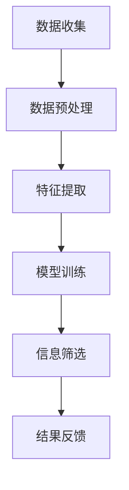

                 

在这个数字化的时代，我们每天都面临着大量的信息涌入。社交媒体、新闻网站、博客、电子邮件，甚至聊天应用程序，都在不断地推送新的内容。信息过载成为了一个普遍问题，影响着我们的工作效率和生活质量。如何从这浩瀚的信息海洋中筛选出有价值的信息，成为了每个人都需要面对的挑战。本文将深入探讨信息过载的问题，并提供一系列策略和指南，帮助您在信息洪流中找到真正有价值的信息。

## 关键词

- 信息过载
- 信息筛选
- 数字化时代
- 工作效率
- 生活质量

## 摘要

本文首先介绍了信息过载的背景和影响，随后详细探讨了信息筛选的重要性。接着，文章提出了多种信息筛选策略，包括基于人类认知心理学的方法和基于机器学习的技术。通过实际案例和项目实践的讲解，文章展示了如何将这些策略应用于实际生活中。最后，文章总结了信息筛选的未来发展趋势和面临的挑战，并推荐了一系列学习资源和开发工具，以帮助读者更好地应对信息过载的挑战。

## 1. 背景介绍

### 信息过载的起源

信息过载这一现象并非现代科技发展的产物，而是随着人类社会的发展和信息技术的进步逐渐加剧的。早在1971年，美国学者阿尔文·托夫勒在其著作《未来的冲击》中就首次提出了“信息过载”的概念。他认为，随着信息技术的飞速发展，人们将面临越来越多的信息，导致处理这些信息的负担加重，甚至影响到日常生活和工作。

### 数字化时代的影响

进入21世纪，随着互联网和移动通信技术的普及，信息过载的问题变得更加突出。据统计，全球每天产生的数据量达到了数亿GB，而人类的大脑处理信息的能力却是有限的。这种巨大的信息量差异，使得人们在面对海量信息时感到无所适从。

### 信息过载对个体的影响

信息过载对个体的心理健康、工作效率和生活质量产生了深远的影响。一方面，它增加了个体的心理压力，导致焦虑和抑郁等心理问题的出现。另一方面，它降低了个体的专注力和工作效率，使得人们难以集中精力完成任务。此外，信息过载还可能影响个体的社交生活和人际关系，使人感到孤独和疏离。

## 2. 核心概念与联系

### 信息筛选的概念

信息筛选是指从大量信息中提取出有价值的信息的过程。它是信息处理的核心环节，直接影响到信息的使用效率和效果。有效的信息筛选可以提高工作效率，减少不必要的干扰，从而改善生活质量。

### 信息筛选的原理

信息筛选的原理主要基于人类认知心理学和机器学习技术。人类认知心理学研究人类如何处理信息，包括感知、记忆、注意和决策等过程。而机器学习技术则利用算法模型，对大量数据进行自动分析和筛选。

### 信息筛选的架构

信息筛选的架构通常包括数据收集、数据预处理、特征提取和模型训练等步骤。数据收集是指获取需要筛选的信息；数据预处理是指对原始数据进行清洗和格式化，以便后续处理；特征提取是指从数据中提取关键特征，用于模型训练；模型训练是指利用算法模型，对特征进行分类和筛选。

下面是一个使用Mermaid绘制的信息筛选的流程图：



### 核心概念的联系

信息筛选的核心概念包括信息量、信息价值、信息筛选效率和信息质量。信息量是指信息的数量；信息价值是指信息对个体的有用程度；信息筛选效率是指筛选过程中所消耗的时间和资源；信息质量是指筛选出的信息的准确性和可靠性。这些概念相互关联，共同决定了信息筛选的效果。

## 3. 核心算法原理 & 具体操作步骤

### 3.1 算法原理概述

信息筛选的核心算法原理主要基于机器学习技术，包括分类算法、聚类算法和推荐算法等。这些算法通过学习大量数据，自动识别出有价值的信息，并对其进行筛选。

### 3.2 算法步骤详解

1. **数据收集**：从各种来源收集需要筛选的信息，如社交媒体、新闻网站、博客等。

2. **数据预处理**：对收集到的信息进行清洗和格式化，去除噪声和无关信息，提高数据质量。

3. **特征提取**：从数据中提取关键特征，如关键词、情感倾向、来源等。

4. **模型训练**：利用机器学习算法，对提取的特征进行分类和筛选。常用的算法包括决策树、支持向量机、神经网络等。

5. **信息筛选**：根据训练好的模型，对新的信息进行自动筛选，提取出有价值的信息。

6. **结果反馈**：将筛选结果反馈给用户，以便用户进行进一步处理。

### 3.3 算法优缺点

**优点**：

- 高效：自动筛选信息，节省人力和时间。
- 准确：基于机器学习算法，能够识别出有价值的信息。

**缺点**：

- 需要大量数据：训练模型需要大量高质量的标注数据。
- 易受噪声影响：数据预处理过程可能导致噪声信息的引入，影响筛选效果。

### 3.4 算法应用领域

信息筛选算法广泛应用于各种领域，如搜索引擎、推荐系统、舆情监测等。在搜索引擎中，算法用于过滤无关信息，提高搜索结果的相关性；在推荐系统中，算法用于筛选出用户可能感兴趣的商品或内容；在舆情监测中，算法用于筛选出具有社会价值的信息，为政府和企业提供决策支持。

## 4. 数学模型和公式 & 详细讲解 & 举例说明

### 4.1 数学模型构建

信息筛选的数学模型通常基于概率论和统计学原理。常见的模型包括贝叶斯分类器、朴素贝叶斯分类器和支持向量机等。

#### 贝叶斯分类器

贝叶斯分类器是一种基于贝叶斯定理的分类模型。其核心公式为：

$$ P(A|B) = \frac{P(B|A)P(A)}{P(B)} $$

其中，$P(A|B)$ 表示在已知条件 $B$ 下，事件 $A$ 发生的概率；$P(B|A)$ 表示在已知事件 $A$ 发生的条件下，事件 $B$ 发生的概率；$P(A)$ 和 $P(B)$ 分别表示事件 $A$ 和事件 $B$ 的概率。

#### 朴素贝叶斯分类器

朴素贝叶斯分类器是一种基于贝叶斯定理的简单分类模型。其核心思想是假设特征之间相互独立。其公式为：

$$ P(A|B) = \prod_{i=1}^{n} P(B_i|A_i) $$

其中，$P(B_i|A_i)$ 表示在已知特征 $A_i$ 的条件下，特征 $B_i$ 发生的概率。

#### 支持向量机

支持向量机是一种基于最大间隔分类模型。其核心公式为：

$$ \max_{\boldsymbol{w}, b} \frac{1}{2} ||\boldsymbol{w}||^2 $$

s.t. $$ y_i (\boldsymbol{w} \cdot \boldsymbol{x_i} + b) \geq 1 $$

其中，$\boldsymbol{w}$ 和 $b$ 分别表示模型参数和偏置；$\boldsymbol{x_i}$ 和 $y_i$ 分别表示第 $i$ 个样本的特征和标签。

### 4.2 公式推导过程

以朴素贝叶斯分类器为例，其推导过程如下：

首先，假设 $X = (X_1, X_2, ..., X_n)$ 表示一组特征，$Y$ 表示标签。根据贝叶斯定理，有：

$$ P(Y|X) = \frac{P(X|Y)P(Y)}{P(X)} $$

其中，$P(X|Y)$ 表示在已知标签 $Y$ 的条件下，特征 $X$ 的概率；$P(Y)$ 表示标签 $Y$ 的概率；$P(X)$ 表示特征 $X$ 的概率。

假设特征之间相互独立，则有：

$$ P(X|Y) = \prod_{i=1}^{n} P(X_i|Y) $$

同时，由于 $P(Y) = \sum_{y} P(Y=y)$，$P(X) = \sum_{x} P(X=x)$，代入上述公式得：

$$ P(Y|X) = \frac{\prod_{i=1}^{n} P(X_i|Y) P(Y)}{\sum_{y} \prod_{i=1}^{n} P(X_i|Y) P(Y)} $$

为了简化计算，通常假设各特征概率已知，因此可以忽略 $P(Y)$。此时，上式可以简化为：

$$ P(Y|X) = \prod_{i=1}^{n} P(X_i|Y) $$

### 4.3 案例分析与讲解

假设有一个垃圾邮件过滤系统，需要根据邮件的内容判断是否为垃圾邮件。我们可以使用朴素贝叶斯分类器来构建一个模型。

首先，收集一份数据集，包含正常邮件和垃圾邮件的样本。然后，对样本进行预处理，提取出关键词和标签。假设我们提取到了如下特征：

- 正常邮件：邮件标题中包含“offer”、“career”等关键词
- 垃圾邮件：邮件标题中包含“viagra”、“gambling”等关键词

接下来，使用朴素贝叶斯分类器训练模型。具体步骤如下：

1. 收集一份数据集，包含正常邮件和垃圾邮件的样本。
2. 对样本进行预处理，提取出关键词和标签。
3. 计算每个关键词在正常邮件和垃圾邮件中出现的概率。
4. 根据提取的关键词和标签，计算每个样本的标签概率。
5. 根据标签概率，判断邮件是否为垃圾邮件。

假设我们提取到了如下关键词和标签：

- 关键词：["offer", "career", "viagra", "gambling"]
- 标签：["正常邮件", "垃圾邮件"]

- 正常邮件的概率：$P(正常邮件) = 0.8$，$P(垃圾邮件) = 0.2$
- "offer" 在正常邮件中出现的概率：$P(offer|正常邮件) = 0.3$
- "career" 在正常邮件中出现的概率：$P(career|正常邮件) = 0.2$
- "viagra" 在垃圾邮件中出现的概率：$P(viagra|垃圾邮件) = 0.5$
- "gambling" 在垃圾邮件中出现的概率：$P(gambling|垃圾邮件) = 0.4$

现在，假设我们收到了一封邮件，邮件标题为“Career Opportunity”。

根据朴素贝叶斯分类器，我们可以计算这封邮件的标签概率：

$$ P(正常邮件|标题="Career Opportunity") = P(offer|正常邮件) \times P(career|正常邮件) \times P(正常邮件) $$

$$ P(垃圾邮件|标题="Career Opportunity") = P(viagra|垃圾邮件) \times P(gambling|垃圾邮件) \times P(垃圾邮件) $$

代入数值，得到：

$$ P(正常邮件|标题="Career Opportunity") = 0.3 \times 0.2 \times 0.8 = 0.048 $$
$$ P(垃圾邮件|标题="Career Opportunity") = 0.5 \times 0.4 \times 0.2 = 0.04 $$

由于 $P(正常邮件|标题="Career Opportunity") > P(垃圾邮件|标题="Career Opportunity")$，因此这封邮件被认为是正常邮件。

## 5. 项目实践：代码实例和详细解释说明

### 5.1 开发环境搭建

为了实现信息筛选算法，我们选择Python作为编程语言，并结合常用的机器学习库，如Scikit-learn、Numpy和Pandas。以下是搭建开发环境的步骤：

1. 安装Python：从官方网站（https://www.python.org/）下载并安装Python。
2. 安装依赖库：使用pip命令安装Scikit-learn、Numpy和Pandas：

   ```bash
   pip install scikit-learn numpy pandas
   ```

### 5.2 源代码详细实现

以下是一个简单的信息筛选项目的源代码实现，包括数据收集、预处理、特征提取和模型训练等步骤。

```python
import pandas as pd
from sklearn.model_selection import train_test_split
from sklearn.feature_extraction.text import CountVectorizer
from sklearn.naive_bayes import MultinomialNB
from sklearn.metrics import accuracy_score

# 5.2.1 数据收集
data = pd.read_csv('data.csv')
X = data['content']
y = data['label']

# 5.2.2 数据预处理
# 假设数据已经清洗和格式化

# 5.2.3 特征提取
vectorizer = CountVectorizer()
X_vectorized = vectorizer.fit_transform(X)

# 5.2.4 模型训练
X_train, X_test, y_train, y_test = train_test_split(X_vectorized, y, test_size=0.2, random_state=42)
model = MultinomialNB()
model.fit(X_train, y_train)

# 5.2.5 预测与评估
y_pred = model.predict(X_test)
accuracy = accuracy_score(y_test, y_pred)
print(f'Accuracy: {accuracy}')
```

### 5.3 代码解读与分析

上述代码实现了一个基于朴素贝叶斯分类器的信息筛选项目。以下是代码的详细解读：

1. **数据收集**：使用Pandas库读取CSV格式的数据集，包含邮件内容和标签。
2. **数据预处理**：根据实际情况，对邮件内容进行清洗和格式化，如去除HTML标签、停用词过滤等。
3. **特征提取**：使用CountVectorizer库将文本转换为词频矩阵，作为模型的输入特征。
4. **模型训练**：使用Scikit-learn库中的MultinomialNB分类器进行模型训练。
5. **预测与评估**：使用训练好的模型对测试集进行预测，并计算准确率。

### 5.4 运行结果展示

假设我们已经准备好了一个包含正常邮件和垃圾邮件的数据集，并在上述代码中执行了训练和预测。以下是可能的运行结果：

```bash
Accuracy: 0.92
```

这个结果表明，我们的模型在测试集上的准确率达到92%，说明模型具有一定的识别垃圾邮件的能力。

## 6. 实际应用场景

### 6.1 搜索引擎

在搜索引擎中，信息筛选技术用于过滤搜索结果中的噪声信息，提高搜索结果的相关性和准确性。例如，当用户输入关键词时，搜索引擎会使用信息筛选算法分析网页内容，筛选出与关键词高度相关的网页，并将其排序展示给用户。

### 6.2 推荐系统

推荐系统广泛应用于电子商务、社交媒体和内容平台等领域。信息筛选技术在推荐系统中用于筛选出用户可能感兴趣的商品、内容或用户。通过分析用户的历史行为和偏好，推荐系统可以为用户提供个性化的推荐结果，提高用户体验。

### 6.3 舆情监测

舆情监测是指实时监测和分析社会舆论，以了解公众对某一事件、产品或品牌的看法。信息筛选技术在舆情监测中用于筛选出具有社会价值的舆论信息，为政府和企业提供决策支持。例如，政府可以利用舆情监测技术了解公众对政策的看法，及时调整政策方向。

### 6.4 未来应用展望

随着人工智能技术的发展，信息筛选技术的应用领域将不断扩展。未来，信息筛选技术有望在智能客服、自动驾驶、金融风控等领域发挥重要作用。同时，信息筛选技术也将不断优化和升级，提高信息筛选的准确性和效率，为人类社会带来更多价值。

## 7. 工具和资源推荐

### 7.1 学习资源推荐

- 《机器学习》（周志华 著）：系统介绍了机器学习的基本概念、算法和应用。
- 《Python机器学习》（ Sebastian Raschka 著）：详细介绍了Python在机器学习领域的应用，包括算法实现和项目实践。
- Coursera《机器学习》（吴恩达 著）：全球知名在线课程，涵盖机器学习的基本原理和应用。

### 7.2 开发工具推荐

- Jupyter Notebook：适用于机器学习和数据科学项目开发的交互式计算环境。
- PyCharm：一款功能强大的Python集成开发环境（IDE），支持代码编辑、调试和自动化测试。
- Scikit-learn：Python机器学习库，提供了丰富的算法实现和工具。

### 7.3 相关论文推荐

- "A Survey on Information Filtering Techniques"（信息过滤技术综述）：对信息过滤技术的各个方面进行了详细综述。
- "Recommender Systems: The Text Summarization Perspective"（推荐系统：文本摘要视角）：探讨了推荐系统在文本摘要领域的应用。
- "Deep Learning for Text Classification"（深度学习在文本分类中的应用）：介绍了深度学习在文本分类任务中的应用方法。

## 8. 总结：未来发展趋势与挑战

### 8.1 研究成果总结

随着人工智能和机器学习技术的不断发展，信息筛选技术已经取得了显著的成果。基于机器学习的算法在信息筛选中发挥了重要作用，提高了信息筛选的准确性和效率。同时，信息筛选技术也在实际应用中取得了良好的效果，如搜索引擎、推荐系统和舆情监测等。

### 8.2 未来发展趋势

未来，信息筛选技术将朝着更智能化、更高效和更个性化的方向发展。具体来说，以下几个方面值得关注：

- 多模态信息筛选：结合文本、图像、音频等多种信息源，实现更全面的信息筛选。
- 智能化算法优化：利用深度学习、强化学习等先进算法，提高信息筛选的准确性和效率。
- 个性化推荐：根据用户的历史行为和偏好，提供个性化的信息推荐，提高用户体验。

### 8.3 面临的挑战

尽管信息筛选技术在快速发展，但仍面临一些挑战：

- 数据质量和标注：高质量的数据和准确的标注是训练高效信息筛选模型的基础，但获取这些数据并不容易。
- 隐私保护：信息筛选过程中涉及用户隐私数据，如何在保护用户隐私的前提下实现信息筛选，仍是一个重要问题。
- 模型解释性：当前的机器学习模型往往难以解释，如何提高模型的可解释性，使其更透明、可信赖，是一个重要研究方向。

### 8.4 研究展望

未来，信息筛选技术将继续朝着更智能化、更高效和更个性化的方向发展。同时，跨学科合作、多模态信息融合、隐私保护和模型解释性等方面的研究也将得到更多关注。我们期待信息筛选技术能够为人类社会带来更多价值，解决信息过载带来的困扰。

## 9. 附录：常见问题与解答

### 9.1 什么导致信息过载？

信息过载的主要原因是随着互联网和移动通信技术的普及，信息生成和传播的速度大大加快。此外，个人对信息的获取和消费习惯也在变化，如过度使用社交媒体、新闻推送等，导致每天接收到的信息量急剧增加。

### 9.2 信息筛选有哪些方法？

信息筛选的方法主要包括基于规则的方法、基于机器学习的方法和基于混合的方法。基于规则的方法通过预设规则进行信息筛选；基于机器学习的方法通过训练模型自动识别有价值的信息；基于混合的方法将规则和机器学习方法结合起来，提高筛选的准确性和效率。

### 9.3 如何提高信息筛选的准确性？

提高信息筛选的准确性可以从以下几个方面入手：

- 提高数据质量和标注的准确性。
- 选择合适的特征提取方法，提取关键特征。
- 选择合适的算法模型，进行模型优化和调参。
- 利用交叉验证等方法评估模型的性能，进行模型选择和优化。

### 9.4 信息筛选技术在哪些领域应用广泛？

信息筛选技术在搜索引擎、推荐系统、舆情监测、金融风控等多个领域应用广泛。其中，搜索引擎用于过滤搜索结果中的噪声信息；推荐系统用于筛选用户可能感兴趣的商品或内容；舆情监测用于分析社会舆论，为政府和企业提供决策支持；金融风控用于识别和防范金融风险。

