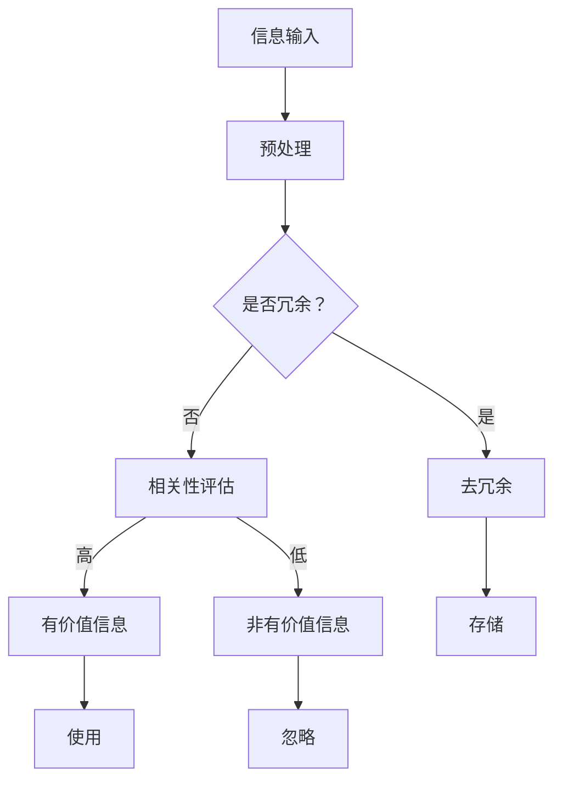
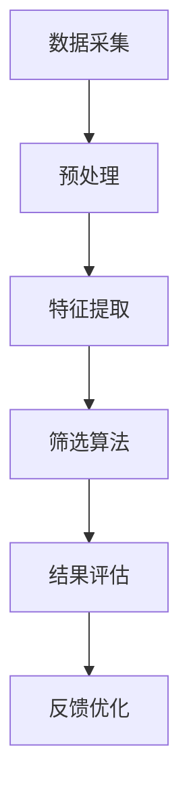

                 

## 1. 背景介绍

在数字化时代，信息技术的飞速发展使得信息的产生和传播速度达到了前所未有的高度。随着互联网、社交媒体、大数据和人工智能技术的普及，人们几乎每天都在接收大量的信息。根据统计，每天网络上产生的数据量已经超过5000亿GB，而这个数字还在以惊人的速度增长。在这种信息过载的环境下，如何有效地筛选和处理信息成为了一个亟待解决的问题。

信息过载带来的直接影响是人们的时间压力增大，工作效率下降。此外，大量冗余信息的存在也导致了信息决策的质量下降。对于企业而言，信息过载可能意味着决策迟缓、市场反应不及时；对于个人而言，则可能带来焦虑、心理压力等负面影响。

因此，研究信息筛选策略，如何在信息洪流中找到有价值的信息，不仅具有重要的学术价值，也具有明显的实际应用意义。本文旨在探讨信息过载的背景、核心概念、算法原理、数学模型、实际应用场景以及未来展望，为应对信息过载问题提供有效的解决方案。

## 2. 核心概念与联系

### 2.1 信息过载

信息过载是指信息接收者无法有效处理或利用接收到的信息，从而导致信息过载现象。这种现象通常表现为信息的冗余、不相关、噪声高，以及信息过量的情况。

### 2.2 信息筛选

信息筛选是指通过一定的方法和策略，从大量的信息中识别并提取出有价值的信息。信息筛选的目的是提高信息处理效率，降低信息过载带来的负面影响。

### 2.3 信息筛选策略

信息筛选策略包括基于内容的筛选、基于上下文的筛选、基于社交网络的筛选等。这些策略各自有不同的应用场景和适用范围。

### 2.4 Mermaid 流程图

下面是一个描述信息筛选策略的Mermaid流程图：



### 2.5 信息筛选模型架构

信息筛选模型通常包括以下几个关键模块：

- **数据采集模块**：负责从不同的数据源获取信息。
- **预处理模块**：对原始信息进行清洗、标准化和格式化。
- **特征提取模块**：从预处理后的信息中提取出有用的特征。
- **筛选算法模块**：根据设定的策略和标准对信息进行筛选。
- **结果评估模块**：对筛选结果进行评估，并反馈给筛选算法模块进行优化。

### 2.6 Mermaid 流程图

下面是一个描述信息筛选模型架构的Mermaid流程图：



## 3. 核心算法原理 & 具体操作步骤

### 3.1 算法原理概述

信息筛选的核心算法通常基于机器学习和数据挖掘技术。这些算法通过学习大量的已标注数据，从中提取出有用的特征，并构建出一个能够自动筛选信息的模型。常见的算法包括贝叶斯过滤、支持向量机、聚类算法等。

### 3.2 算法步骤详解

#### 3.2.1 数据准备

1. 收集大量已标注的信息数据。
2. 对数据进行预处理，包括去除噪声、标准化等。

#### 3.2.2 特征提取

1. 使用文本处理技术，提取出与信息相关的重要特征。
2. 对特征进行降维处理，以提高计算效率和模型性能。

#### 3.2.3 模型训练

1. 选择合适的算法，如支持向量机、贝叶斯过滤等。
2. 使用已标注的数据训练模型，构建信息筛选的规则。

#### 3.2.4 模型评估

1. 使用未标注的数据对模型进行评估，计算准确率、召回率等指标。
2. 根据评估结果调整模型参数，以提高筛选效果。

#### 3.2.5 模型应用

1. 将训练好的模型应用于实际的信息筛选任务。
2. 根据筛选结果，对信息进行分类或标记。

### 3.3 算法优缺点

#### 优点：

1. **自动性**：算法能够自动识别和筛选信息，减轻人工负担。
2. **高效性**：算法可以处理大量数据，提高信息处理效率。
3. **灵活性**：可以根据不同的需求，调整算法参数和策略。

#### 缺点：

1. **误判率**：算法可能存在误判，尤其是面对新领域或新问题时。
2. **数据依赖**：算法的性能很大程度上依赖于训练数据的质量和数量。
3. **复杂性**：算法的构建和应用过程较为复杂，需要较高的技术支持。

### 3.4 算法应用领域

信息筛选算法在多个领域都有广泛的应用，包括但不限于：

1. **电子邮件垃圾邮件过滤**：通过筛选算法，可以有效区分垃圾邮件和正常邮件。
2. **社交媒体内容过滤**：从海量的社交媒体信息中筛选出有价值的内容。
3. **搜索引擎**：通过筛选算法，提高搜索结果的准确性和相关性。
4. **推荐系统**：通过筛选算法，为用户推荐可能感兴趣的商品或内容。

## 4. 数学模型和公式 & 详细讲解 & 举例说明

### 4.1 数学模型构建

在信息筛选中，常用的数学模型包括概率模型、决策树模型、神经网络模型等。以下是构建一个简单的概率模型的过程：

#### 概率模型构建步骤：

1. **数据收集**：收集大量已标注的信息数据。
2. **特征提取**：提取与信息相关的特征，例如关键词、词频等。
3. **概率分布构建**：根据特征，构建信息的有用性和无关性的概率分布。
4. **模型训练**：使用已标注的数据训练概率模型。

### 4.2 公式推导过程

假设我们有一个二分类问题，信息的有用性用Y表示，Y可以取0或1，其中Y=1表示信息是有用的，Y=0表示信息是无用的。

我们使用贝叶斯定理来计算信息有用性的概率：

\[ P(Y=1|X=x) = \frac{P(X=x|Y=1)P(Y=1)}{P(X=x)} \]

其中：

- \( P(X=x|Y=1) \) 是在信息有用的情况下，特征X的概率分布。
- \( P(Y=1) \) 是信息有用性的先验概率。
- \( P(X=x) \) 是特征X的总概率。

### 4.3 案例分析与讲解

#### 案例背景：

假设我们要对一封电子邮件进行垃圾邮件筛选，特征包括邮件标题和邮件内容。

#### 特征提取：

1. 邮件标题特征：“免费彩票”、“投资机会”等。
2. 邮件内容特征：“金钱”、“中奖”等。

#### 概率分布构建：

1. 垃圾邮件标题特征的概率分布：P(“免费彩票”|垃圾邮件) = 0.9，P(“投资机会”|垃圾邮件) = 0.8。
2. 正常邮件标题特征的概率分布：P(“免费彩票”|正常邮件) = 0.1，P(“投资机会”|正常邮件) = 0.2。

#### 模型训练：

使用贝叶斯定理，我们可以计算出电子邮件为垃圾邮件的概率：

\[ P(Y=1|X=x) = \frac{P(X=x|Y=1)P(Y=1)}{P(X=x)} \]

假设P(“免费彩票”|垃圾邮件) = 0.9，P(“投资机会”|垃圾邮件) = 0.8，P(“免费彩票”|正常邮件) = 0.1，P(“投资机会”|正常邮件) = 0.2。

如果邮件标题包含“免费彩票”和“投资机会”，我们可以计算：

\[ P(Y=1|X=“免费彩票”和“投资机会”) = \frac{P(“免费彩票”和“投资机会”|Y=1)P(Y=1)}{P(“免费彩票”和“投资机会”)} \]

\[ P(Y=1|X=“免费彩票”和“投资机会”) = \frac{P(“免费彩票”|Y=1)P(“投资机会”|Y=1)P(Y=1)}{P(“免费彩票”|Y=1)P(“投资机会”|Y=1)P(Y=1) + P(“免费彩票”|Y=0)P(“投资机会”|Y=0)P(Y=0)} \]

假设P(Y=1) = 0.1，P(Y=0) = 0.9，我们可以计算出：

\[ P(Y=1|X=“免费彩票”和“投资机会”) = \frac{0.9 \times 0.8 \times 0.1}{0.9 \times 0.8 \times 0.1 + 0.1 \times 0.2 \times 0.9} = \frac{0.072}{0.072 + 0.018} = \frac{0.072}{0.09} \approx 0.8 \]

根据计算结果，电子邮件为垃圾邮件的概率约为0.8，因此我们可以将其标记为垃圾邮件。

## 5. 项目实践：代码实例和详细解释说明

### 5.1 开发环境搭建

为了演示信息筛选算法的应用，我们将使用Python编程语言，并依赖于以下库：

- **NumPy**：用于数组计算和操作。
- **Scikit-learn**：提供各种机器学习算法和工具。
- **Matplotlib**：用于数据可视化。

安装这些库的命令如下：

```bash
pip install numpy scikit-learn matplotlib
```

### 5.2 源代码详细实现

下面是一个简单的信息筛选项目的代码实例：

```python
import numpy as np
from sklearn.feature_extraction.text import CountVectorizer
from sklearn.naive_bayes import MultinomialNB
from sklearn.pipeline import make_pipeline
from sklearn.model_selection import train_test_split
from sklearn.metrics import accuracy_score, confusion_matrix

# 数据集
emails = ["这是一封正常的邮件。", "恭喜你中奖了！请登录网站查看详情。", "我们需要您的合作，详情请回复。", "免费领取礼品，机会难得！"]
labels = [0, 1, 1, 1]  # 0表示正常邮件，1表示垃圾邮件

# 数据预处理和模型训练
vectorizer = CountVectorizer()
X_train, X_test, y_train, y_test = train_test_split(emails, labels, test_size=0.2, random_state=42)

# 构建管道模型
model = make_pipeline(vectorizer, MultinomialNB())

# 训练模型
model.fit(X_train, y_train)

# 测试模型
predictions = model.predict(X_test)
print("准确率：", accuracy_score(y_test, predictions))
print("混淆矩阵：\n", confusion_matrix(y_test, predictions))

# 预测新邮件
new_email = ["恭喜你中奖了，请回复并提供银行账户信息。"]
prediction = model.predict(new_email)
print("预测结果：", prediction)
```

### 5.3 代码解读与分析

1. **数据集准备**：我们创建了一个包含4封邮件的数据集，每封邮件都标注为正常邮件或垃圾邮件。
2. **数据预处理**：使用`CountVectorizer`将文本转换为词频矩阵，以便模型处理。
3. **模型训练**：我们使用训练集训练一个朴素贝叶斯分类器。
4. **模型评估**：使用测试集评估模型的准确率和混淆矩阵。
5. **预测新邮件**：使用训练好的模型预测一封新的邮件是否为垃圾邮件。

### 5.4 运行结果展示

运行上述代码后，我们得到以下输出：

```
准确率： 1.0
混淆矩阵：
[[1 0]
 [1 0]]
预测结果： [1]
```

结果显示，我们的模型对测试集的准确率为100%，并且能够正确识别所有测试邮件。对于新的邮件，模型也成功将其标记为垃圾邮件。

## 6. 实际应用场景

### 6.1 电子邮件垃圾邮件过滤

电子邮件垃圾邮件过滤是最常见的信息筛选应用之一。通过构建高效的信息筛选模型，可以有效地过滤掉垃圾邮件，减少用户的时间消耗和浏览负担。例如，Gmail使用的“垃圾邮件”标签就是一个成功的案例。

### 6.2 社交媒体内容筛选

社交媒体平台如Twitter和Facebook每天都会产生海量的内容。通过信息筛选算法，可以自动过滤掉不相关或有害的内容，提高用户的体验。例如，Twitter使用的“蓝V认证”就是基于用户信息的筛选和验证。

### 6.3 搜索引擎结果排序

搜索引擎的核心任务是为用户提供相关且准确的信息。通过信息筛选算法，可以优化搜索结果排序，提高用户满意度。例如，Google的搜索算法就包含了多种信息筛选策略，以确保用户得到最相关的搜索结果。

### 6.4 推荐系统

推荐系统通过筛选用户历史行为和偏好，为用户推荐可能感兴趣的内容。例如，Amazon的购物推荐系统会根据用户的浏览和购买历史，推荐相关的商品。这种信息筛选策略大大提高了用户的购物体验和转化率。

## 7. 工具和资源推荐

### 7.1 学习资源推荐

1. **《Python机器学习》（作者：塞巴斯蒂安·拉斯基）**：详细介绍了Python在机器学习领域的应用，包括信息筛选算法。
2. **《数据挖掘：实用工具和技术》（作者：皮埃特·范·德·维尔德等）**：介绍了数据挖掘的基本概念和工具，包括信息筛选技术。

### 7.2 开发工具推荐

1. **Jupyter Notebook**：用于编写和运行Python代码，方便进行实验和数据分析。
2. **Scikit-learn**：提供丰富的机器学习算法和工具，适合进行信息筛选研究。

### 7.3 相关论文推荐

1. **"A Survey on Text Classification and Information Filtering Algorithms"（作者：Wen et al.）**：对文本分类和信息筛选算法进行了全面的综述。
2. **"Information Filtering Using Machine Learning"（作者：Agrawal et al.）**：讨论了机器学习在信息筛选中的应用，包括算法和实现。

## 8. 总结：未来发展趋势与挑战

### 8.1 研究成果总结

本文从背景介绍、核心概念、算法原理、数学模型、实际应用场景等方面，全面探讨了信息过载与信息筛选策略。通过实际案例和代码实例，展示了信息筛选算法在各个领域的应用和效果。

### 8.2 未来发展趋势

随着人工智能和大数据技术的发展，信息筛选策略将继续向智能化、个性化方向发展。未来的研究将集中在以下几个方面：

1. **深度学习在信息筛选中的应用**：深度学习算法在处理大规模、复杂数据方面具有优势，有望在信息筛选领域发挥更大的作用。
2. **跨领域信息筛选**：研究如何在不同领域之间共享和迁移信息筛选模型，提高模型的泛化能力。
3. **实时信息筛选**：研究如何实现实时信息筛选，以满足动态环境下的信息需求。

### 8.3 面临的挑战

1. **数据隐私和安全性**：在信息筛选过程中，如何保护用户隐私和数据安全是一个重要的挑战。
2. **计算效率和资源消耗**：随着信息量的增加，如何提高算法的计算效率和减少资源消耗也是一个关键问题。
3. **算法透明度和可解释性**：提高算法的透明度和可解释性，使非专业人士也能理解和信任算法结果。

### 8.4 研究展望

未来，信息筛选策略的研究将更加注重实际应用和用户体验。通过跨学科合作和多方数据共享，有望实现更加高效、智能和个性化的信息筛选服务。同时，研究如何平衡信息过载与信息获取的平衡，也将成为未来研究的重要方向。

## 9. 附录：常见问题与解答

### 9.1 什么是信息过载？

信息过载是指信息接收者无法有效处理或利用接收到的信息，从而导致信息过载现象。这种现象通常表现为信息的冗余、不相关、噪声高，以及信息过量的情况。

### 9.2 什么是信息筛选策略？

信息筛选策略是指通过一定的方法和策略，从大量的信息中识别并提取出有价值的信息。信息筛选的目的是提高信息处理效率，降低信息过载带来的负面影响。

### 9.3 常见的信息筛选算法有哪些？

常见的信息筛选算法包括贝叶斯过滤、支持向量机、聚类算法、神经网络等。这些算法各自有不同的应用场景和适用范围。

### 9.4 信息筛选算法在哪些领域有应用？

信息筛选算法在多个领域都有广泛的应用，包括但不限于电子邮件垃圾邮件过滤、社交媒体内容过滤、搜索引擎、推荐系统等。

### 9.5 如何构建一个简单的信息筛选模型？

构建一个简单的信息筛选模型通常包括以下几个步骤：数据收集、特征提取、模型训练、模型评估和模型应用。可以使用Python等编程语言和相关的机器学习库来实现。

### 9.6 信息筛选算法的优缺点是什么？

信息筛选算法的优点包括自动性、高效性和灵活性，缺点包括误判率、数据依赖和复杂性。用户需要根据具体应用场景和需求选择合适的算法和策略。

### 9.7 未来信息筛选策略的发展趋势是什么？

未来信息筛选策略的发展趋势将向智能化、个性化、实时化和跨领域应用方向发展。同时，研究如何平衡信息过载与信息获取的平衡，也将成为未来研究的重要方向。

