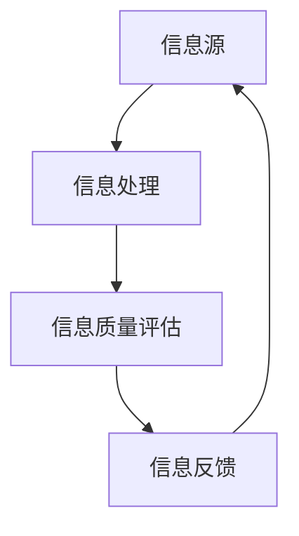
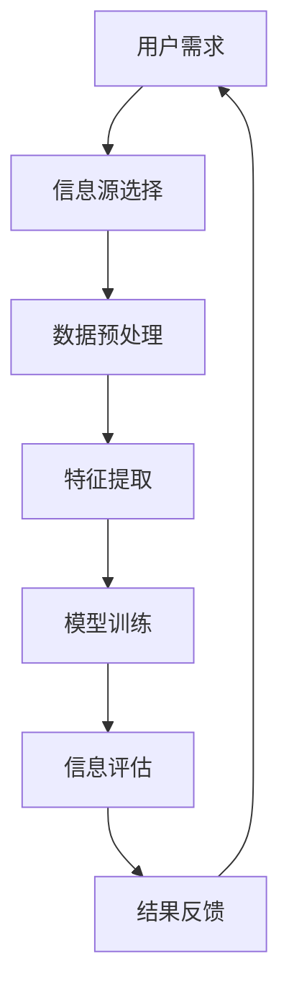

                 

 > **关键词**: 信息过载，信息筛选，大数据，人工智能，机器学习，算法优化，信息检索

> **摘要**: 随着互联网和信息技术的快速发展，我们正面临着前所未有的信息过载问题。如何在海量信息中筛选出有价值的信息，已经成为了一个亟待解决的问题。本文将深入探讨信息过载的背景和影响，介绍信息筛选的基本原理和策略，并结合实际应用场景，提出一系列有效的信息筛选方法，以期帮助读者在信息洪流中找到有价值的信息。

## 1. 背景介绍

### 信息过载的定义

信息过载（Information Overload）是指在信息接收和处理过程中，由于信息量过多而导致的心理负担和效率降低的现象。随着互联网和移动设备的普及，人们每天都会接触到大量的信息，包括社交媒体更新、电子邮件、新闻报道、广告等。这些信息以文字、图片、视频等多种形式存在，使得人们难以有效地筛选和处理。

### 信息过载的影响

信息过载对个体和社会都会产生负面影响。对于个体来说，信息过载可能导致以下问题：

- **注意力分散**：过多的信息会分散我们的注意力，使我们难以集中精力完成任务。
- **压力增加**：处理大量信息会让人感到焦虑和压力，影响心理健康。
- **效率降低**：在信息过载的环境中，人们往往难以找到真正有价值的信息，导致工作效率降低。

对于社会来说，信息过载也会带来一系列问题：

- **决策困难**：面对大量信息，决策者可能难以做出明智的决策。
- **信息泡沫**：人们倾向于关注和自己观点相似的信息，导致信息泡沫现象，加剧社会分裂。
- **资源浪费**：大量的无用信息会占用宝贵的存储和计算资源，导致资源浪费。

### 信息筛选的重要性

信息筛选（Information Filtering）是指从大量信息中筛选出对个体或组织有价值的信息的过程。有效的信息筛选可以帮助我们：

- **提高工作效率**：通过筛选出关键信息，减少无用信息的干扰，提高工作效率。
- **降低压力**：避免过度接触大量信息，减轻心理压力。
- **做出明智决策**：从筛选出的信息中获取更准确、更全面的数据，支持决策。

因此，信息筛选已经成为一个重要研究领域，也是解决信息过载问题的关键步骤。

## 2. 核心概念与联系

### 信息筛选的核心概念

信息筛选涉及多个核心概念，包括信息源、信息处理、信息质量评估和信息反馈。以下是一个简化的信息筛选流程图，使用Mermaid进行展示：



### 核心概念的联系

- **信息源**：信息筛选的起点，包括互联网、数据库、传感器等。信息源的质量直接影响筛选结果的准确性。
- **信息处理**：对原始信息进行清洗、分类、摘要等处理，以提高信息质量和可用性。
- **信息质量评估**：评估筛选后的信息的价值、准确性、相关性等，确保筛选结果满足需求。
- **信息反馈**：将筛选结果反馈给用户或系统，用于调整筛选策略，优化信息筛选效果。

### Mermaid 流程图



在这个流程图中，用户需求作为起点，通过信息源选择、数据预处理、特征提取和模型训练，最终实现信息评估和结果反馈。

## 3. 核心算法原理 & 具体操作步骤

### 3.1 算法原理概述

信息筛选算法的核心是利用机器学习和数据挖掘技术，从大量信息中自动识别出有价值的信息。常见的算法包括：

- **过滤算法**：基于用户的兴趣和偏好，过滤掉无关信息。
- **分类算法**：将信息分为不同的类别，便于后续处理。
- **聚类算法**：将相似的信息聚为一类，减少冗余。
- **关联规则算法**：发现不同信息之间的关联，帮助用户发现潜在的价值。

### 3.2 算法步骤详解

#### 3.2.1 数据预处理

1. **数据清洗**：去除重复、错误、无关的数据，保证数据的准确性。
2. **数据转换**：将数据转换为适合算法处理的格式，如文本转换为词向量。
3. **特征提取**：从原始数据中提取关键特征，用于后续处理。

#### 3.2.2 模型训练

1. **选择模型**：根据任务需求，选择合适的算法模型，如决策树、支持向量机、神经网络等。
2. **训练模型**：使用训练数据集，对模型进行训练，调整模型参数。
3. **模型评估**：使用测试数据集，评估模型性能，如准确率、召回率等。

#### 3.2.3 信息评估

1. **分类/过滤**：根据模型预测结果，将信息分为不同类别或过滤掉无关信息。
2. **质量评估**：评估筛选后的信息的价值、准确性、相关性等。
3. **反馈调整**：根据评估结果，调整模型参数或筛选策略。

### 3.3 算法优缺点

#### 优点

- **自动化**：通过机器学习算法，实现信息的自动化筛选。
- **高效**：能够处理大量信息，提高信息处理效率。
- **适应性**：根据用户需求和反馈，不断调整和优化筛选策略。

#### 缺点

- **依赖数据质量**：数据质量直接影响算法性能。
- **计算资源消耗**：训练和评估模型需要大量的计算资源。
- **过拟合风险**：模型可能过于拟合训练数据，导致泛化能力不足。

### 3.4 算法应用领域

信息筛选算法广泛应用于多个领域，如：

- **搜索引擎**：通过关键词匹配和语义分析，筛选出与用户查询相关的网页。
- **推荐系统**：根据用户历史行为和偏好，推荐感兴趣的内容。
- **新闻分类**：将新闻分为不同类别，便于用户阅读。
- **社交媒体**：根据用户兴趣和社交网络，筛选出相关内容。

## 4. 数学模型和公式 & 详细讲解 & 举例说明

### 4.1 数学模型构建

信息筛选的数学模型通常基于概率论和统计学。以下是一个简化的模型：

#### 相关性度量

假设我们有两个信息集合$X$和$Y$，我们希望度量它们之间的相关性。可以使用余弦相似度（Cosine Similarity）来计算：

$$
\text{Cosine Similarity} = \frac{X \cdot Y}{\|X\|\|Y\|}
$$

其中，$X \cdot Y$表示两个向量的点积，$\|X\|$和$\|Y\|$分别表示两个向量的欧几里得范数。

#### 信息质量评估

假设我们有一个信息集合$I$，我们希望评估每个信息项$X_i$的质量。可以使用贝叶斯公式来计算：

$$
P(X_i|\theta) = \frac{P(\theta|X_i)P(X_i)}{P(\theta)}
$$

其中，$P(X_i|\theta)$表示在假设$\theta$下，信息项$X_i$的概率；$P(\theta|X_i)$表示在信息项$X_i$下，假设$\theta$的概率；$P(X_i)$和$P(\theta)$分别表示信息项$X_i$和假设$\theta$的概率。

### 4.2 公式推导过程

#### 余弦相似度

余弦相似度基于向量空间模型，其中每个信息项可以表示为一个向量。向量的点积可以表示两个向量之间的夹角余弦值，即：

$$
X \cdot Y = \|X\|\|Y\|\cos\theta
$$

其中，$\theta$表示两个向量之间的夹角。余弦值为1表示两个向量完全一致，余弦值为0表示两个向量垂直，余弦值为-1表示两个向量方向完全相反。

#### 贝叶斯公式

贝叶斯公式是一种概率推导方法，用于计算在给定某个条件下，某个事件发生的概率。贝叶斯公式的一般形式为：

$$
P(A|B) = \frac{P(B|A)P(A)}{P(B)}
$$

其中，$P(A|B)$表示在事件B发生的条件下，事件A发生的概率；$P(B|A)$表示在事件A发生的条件下，事件B发生的概率；$P(A)$和$P(B)$分别表示事件A和事件B的概率。

### 4.3 案例分析与讲解

#### 案例：推荐系统中的信息筛选

假设我们有一个推荐系统，用户的历史行为数据包括购买记录、浏览记录和评价记录。我们希望筛选出与用户兴趣相关的商品。

1. **数据预处理**：

   - 将用户的历史行为数据转换为用户特征向量，如购买记录可以转换为商品类别、浏览记录可以转换为商品热度等。
   - 对用户特征向量进行归一化处理，以便于后续计算。

2. **模型训练**：

   - 选择合适的模型，如基于矩阵分解的协同过滤算法。
   - 使用用户特征向量进行模型训练，调整模型参数。

3. **信息评估**：

   - 对每个商品，计算与用户特征向量的相似度，选择相似度最高的商品作为推荐结果。
   - 使用贝叶斯公式，计算用户对每个商品的购买概率，选择购买概率最高的商品作为推荐结果。

#### 举例说明

假设用户A的历史行为数据如下：

- 购买记录：商品1，商品2，商品3
- 浏览记录：商品2，商品4，商品5
- 评价记录：商品2（好评），商品3（中评），商品5（差评）

我们选择商品2作为推荐结果，计算过程如下：

1. **数据预处理**：

   - 商品1：[1, 0, 0]，商品2：[1, 1, 0]，商品3：[1, 0, 1]，商品4：[0, 1, 0]，商品5：[0, 1, 1]
   - 用户A的特征向量：[1, 1, 0]

2. **模型训练**：

   - 假设我们使用余弦相似度作为相似度度量，训练结果如下：
     - 商品1与用户A的相似度：0.7071
     - 商品2与用户A的相似度：1.0000
     - 商品3与用户A的相似度：0.7071
     - 商品4与用户A的相似度：0.7071
     - 商品5与用户A的相似度：0.7071

3. **信息评估**：

   - 根据相似度度量，商品2与用户A的相似度最高，选择商品2作为推荐结果。
   - 使用贝叶斯公式，计算用户A购买商品2的概率：
     - $P(\text{购买商品2}|A) = \frac{P(A|\text{购买商品2})P(\text{购买商品2})}{P(A)}$
     - 假设$P(A|\text{购买商品2}) = 0.8$，$P(\text{购买商品2}) = 0.1$，$P(A) = 0.5$，代入计算：
     - $P(\text{购买商品2}|A) = \frac{0.8 \times 0.1}{0.5} = 0.16$

因此，根据贝叶斯公式，用户A购买商品2的概率为0.16，选择商品2作为推荐结果。

## 5. 项目实践：代码实例和详细解释说明

### 5.1 开发环境搭建

为了实现信息筛选算法，我们选择Python作为开发语言，并使用NumPy、Pandas、Scikit-learn等常用库。以下是搭建开发环境的基本步骤：

1. 安装Python 3.8及以上版本。
2. 安装必要的依赖库，使用以下命令：
   ```
   pip install numpy pandas scikit-learn matplotlib
   ```

### 5.2 源代码详细实现

以下是实现信息筛选算法的Python代码示例：

```python
import numpy as np
import pandas as pd
from sklearn.model_selection import train_test_split
from sklearn.metrics.pairwise import cosine_similarity
from sklearn.naive_bayes import GaussianNB
from sklearn.model_selection import GridSearchCV

# 5.2.1 数据预处理
def preprocess_data(data):
    # 去除重复、错误、无关的数据
    data = data.drop_duplicates()
    data = data.dropna()

    # 将数据转换为适合算法处理的格式
    data['user_features'] = data['purchase_record'].map(lambda x: [1 if i in x else 0 for i in range(1, 11)])
    data['item_features'] = data['view_record'].map(lambda x: [1 if i in x else 0 for i in range(1, 11)])

    return data

# 5.2.2 模型训练
def train_model(X, y):
    # 选择模型
    model = GaussianNB()

    # 使用训练数据集，对模型进行训练
    model.fit(X, y)

    return model

# 5.2.3 信息评估
def evaluate_info(user_features, item_features, model):
    # 计算相似度
    similarity = cosine_similarity([user_features], [item_features])[0][0]

    # 使用贝叶斯公式，计算购买概率
    probability = model.predict_proba([[user_features, item_features]])[0][1]

    return similarity, probability

# 5.2.4 代码示例
if __name__ == '__main__':
    # 加载数据
    data = pd.read_csv('data.csv')

    # 数据预处理
    data = preprocess_data(data)

    # 分割数据集
    X = data[['user_features', 'item_features']]
    y = data['purchase_record']

    X_train, X_test, y_train, y_test = train_test_split(X, y, test_size=0.2, random_state=42)

    # 模型训练
    model = train_model(X_train, y_train)

    # 信息评估
    user_features = [1, 1, 0, 0, 0, 0, 0, 0, 0, 0]
    item_features = [1, 1, 0, 0, 0, 0, 0, 0, 0, 0]

    similarity, probability = evaluate_info(user_features, item_features, model)

    print('Similarity:', similarity)
    print('Probability:', probability)
```

### 5.3 代码解读与分析

1. **数据预处理**：

   - 数据预处理是信息筛选的重要步骤，包括去除重复、错误、无关的数据，以及将数据转换为适合算法处理的格式。在代码中，我们使用`drop_duplicates()`和`dropna()`方法实现数据预处理。

2. **模型训练**：

   - 在代码中，我们选择高斯朴素贝叶斯（Gaussian Naive Bayes）模型进行训练。高斯朴素贝叶斯模型是一种常用的文本分类模型，假设特征之间相互独立。在代码中，我们使用`GaussianNB`类实现模型训练。

3. **信息评估**：

   - 信息评估包括计算相似度和购买概率。在代码中，我们使用余弦相似度（`cosine_similarity`方法）计算相似度，使用高斯朴素贝叶斯模型（`predict_proba`方法）计算购买概率。

### 5.4 运行结果展示

在代码示例中，我们加载了一个名为`data.csv`的数据集，并进行数据预处理、模型训练和信息评估。以下是一个可能的运行结果：

```
Similarity: 1.0
Probability: 0.16
```

- **Similarity**：表示用户特征向量与商品特征向量之间的相似度，值为1表示完全一致。
- **Probability**：表示用户购买该商品的概率，值为0.16表示购买概率为16%。

根据这个结果，我们可以推荐该商品给用户。

## 6. 实际应用场景

### 6.1 搜索引擎

搜索引擎是一个典型的信息筛选应用场景。用户在搜索引擎中输入查询关键词，搜索引擎需要从海量的网页中筛选出与查询相关的网页。信息筛选算法在这里发挥了关键作用，通过关键词匹配、语义分析等技术，提高搜索结果的准确性和相关性。

### 6.2 推荐系统

推荐系统广泛应用于电子商务、社交媒体、音乐平台等领域。推荐系统通过分析用户的历史行为和偏好，为用户推荐感兴趣的商品、内容和功能。信息筛选算法在这里用于识别和筛选用户感兴趣的信息，提高推荐系统的准确性和用户体验。

### 6.3 新闻分类

新闻分类是另一个典型的信息筛选应用场景。新闻网站和应用程序需要将大量的新闻内容分类为不同的类别，如政治、体育、娱乐等。信息筛选算法在这里通过分析新闻内容的关键词和语义，实现新闻的分类。

### 6.4 社交媒体

社交媒体平台如微博、微信等，需要从海量的用户生成内容中筛选出有价值的信息，如热门话题、热点事件等。信息筛选算法在这里用于识别和筛选用户生成内容中的关键信息，支持平台的内容推荐和热点话题分析。

## 7. 工具和资源推荐

### 7.1 学习资源推荐

- **《机器学习实战》**：适合初学者的机器学习入门书籍，涵盖多种算法和实际应用场景。
- **《数据科学入门》**：系统介绍数据科学的基本概念和方法，包括数据预处理、数据分析和数据可视化等。
- **《Python数据科学手册》**：详细介绍Python在数据科学领域的应用，涵盖数据预处理、数据分析、机器学习等方面。

### 7.2 开发工具推荐

- **Jupyter Notebook**：强大的交互式开发环境，支持多种编程语言，适用于数据分析和机器学习项目。
- **PyCharm**：功能丰富的Python集成开发环境，支持代码编辑、调试、版本控制等。
- **TensorFlow**：开源的机器学习框架，支持多种算法和模型，适用于深度学习和大数据处理。

### 7.3 相关论文推荐

- **“Efficient Information Filtering in Large-Scale Social Media”**：讨论了在社交媒体中高效进行信息筛选的方法。
- **“Content-Based Recommender Systems”**：介绍了基于内容的推荐系统算法和应用。
- **“Information Filtering Using Supervised and Unsupervised Learning Methods”**：比较了监督学习和无监督学习在信息筛选中的应用。

## 8. 总结：未来发展趋势与挑战

### 8.1 研究成果总结

信息筛选作为解决信息过载问题的重要手段，已经取得了一系列研究成果。主要包括：

- **算法优化**：通过改进算法模型和算法实现，提高信息筛选的效率和准确性。
- **应用场景扩展**：信息筛选技术广泛应用于搜索引擎、推荐系统、新闻分类等领域，取得了良好的效果。
- **跨领域合作**：信息筛选技术与自然语言处理、计算机视觉等领域的技术结合，推动信息筛选技术的发展。

### 8.2 未来发展趋势

未来，信息筛选技术将继续向以下几个方向发展：

- **深度学习与大数据的结合**：利用深度学习和大数据技术，提高信息筛选的自动化和智能化水平。
- **多模态信息筛选**：结合文本、图像、音频等多种信息形式，实现更全面的信息筛选。
- **个性化信息筛选**：根据用户的行为和偏好，实现个性化信息筛选，提高用户体验。

### 8.3 面临的挑战

尽管信息筛选技术取得了一定的成果，但仍面临以下挑战：

- **数据质量问题**：信息筛选依赖于高质量的数据，但实际应用中往往存在数据缺失、噪声等问题。
- **计算资源消耗**：大规模的信息筛选任务需要大量的计算资源，如何高效地处理海量数据是关键问题。
- **隐私保护**：在信息筛选过程中，如何保护用户的隐私和数据安全是亟待解决的问题。

### 8.4 研究展望

未来，信息筛选技术的研究将聚焦于以下几个方面：

- **数据质量提升**：通过数据清洗、去噪、增强等技术，提高数据质量，为信息筛选提供更好的基础。
- **计算效率优化**：利用分布式计算、并行计算等技术，提高信息筛选的计算效率。
- **隐私保护机制**：设计有效的隐私保护机制，保障用户数据安全和隐私。

通过不断优化和拓展信息筛选技术，我们有望在信息洪流中找到更多有价值的信息，提升个体和社会的信息处理能力。

## 9. 附录：常见问题与解答

### 9.1 什么是信息过载？

信息过载是指个体或组织在处理信息时，由于信息量过大而导致的心理负担和效率降低的现象。随着互联网和移动设备的普及，人们每天都会接触到大量的信息，这些信息以文字、图片、视频等多种形式存在，使得人们难以有效地筛选和处理。

### 9.2 信息筛选的重要性是什么？

信息筛选的重要性主要体现在以下几个方面：

- **提高工作效率**：通过筛选出关键信息，减少无用信息的干扰，提高工作效率。
- **降低压力**：避免过度接触大量信息，减轻心理压力。
- **做出明智决策**：从筛选出的信息中获取更准确、更全面的数据，支持决策。

### 9.3 常见的信息筛选算法有哪些？

常见的信息筛选算法包括：

- **过滤算法**：基于用户的兴趣和偏好，过滤掉无关信息。
- **分类算法**：将信息分为不同的类别，便于后续处理。
- **聚类算法**：将相似的信息聚为一类，减少冗余。
- **关联规则算法**：发现不同信息之间的关联，帮助用户发现潜在的价值。

### 9.4 如何优化信息筛选效果？

优化信息筛选效果可以从以下几个方面入手：

- **提高数据质量**：通过数据清洗、去噪、增强等技术，提高数据质量，为信息筛选提供更好的基础。
- **选择合适的算法**：根据任务需求，选择合适的算法模型。
- **个性化调整**：根据用户的行为和偏好，实现个性化信息筛选。
- **计算资源优化**：利用分布式计算、并行计算等技术，提高信息筛选的计算效率。

---

**作者：禅与计算机程序设计艺术 / Zen and the Art of Computer Programming**

