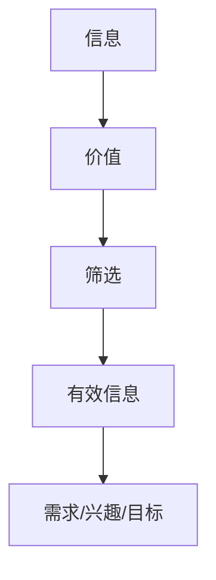

                 

### 背景介绍 Background Introduction

在当今数字化时代，信息爆炸已经成为不争的事实。随着互联网、大数据、云计算等技术的飞速发展，人类每天接收到的信息量前所未有地增加。据统计，全球每天产生的数据量已经超过了5EB（艾字节），而这个数字还在以惊人的速度增长。这种信息过载现象给人们的日常生活和工作带来了巨大的挑战。面对海量的信息，如何从中筛选出有价值的信息成为了每个人都需要面对的问题。

首先，信息过载给我们的工作和生活带来了巨大的压力。在信息爆炸的环境下，人们很难再像过去一样，对每一个信息进行细致的阅读和理解。大量无关或低价值的信息充斥着我们的视线，导致我们的注意力分散，工作效率降低。此外，信息过载还会导致心理压力的增加，例如焦虑、抑郁等情绪问题。

其次，信息过载也带来了信息安全的问题。在庞大的信息海洋中，恶意信息、虚假信息、隐私泄露等问题层出不穷。这些信息不仅会误导我们的判断，还可能对我们的生活和财产安全造成威胁。

因此，如何在信息洪流中找到有价值的信息，成为了我们亟待解决的重要问题。本文将从技术、方法、策略等多个角度，探讨信息筛选的有效途径，帮助大家摆脱信息过载的困扰，提升信息获取的质量和效率。

### 核心概念与联系 Core Concepts and Relationships

要解决信息过载问题，首先需要明确几个核心概念：信息、价值、筛选。

**信息**是数据、知识、新闻等的总称，它是通过文字、图像、声音、视频等多种形式传递的。信息本身并没有价值，只有当信息与我们的需求、兴趣、目标相关联时，它才具有价值。

**价值**是指信息对个人、组织或社会的有益程度。不同的人、不同的情境下，对信息价值的判断标准也会有所不同。例如，对研究人员来说，一篇最新的学术研究论文可能具有很高的价值，而对普通用户来说，一篇娱乐新闻可能更有吸引力。

**筛选**是指从大量信息中挑选出有价值的信息的过程。筛选的目的是为了减少信息过载，提高信息获取的效率。

这三大核心概念之间有着密切的联系。信息是筛选的对象，价值是筛选的依据，筛选的结果是筛选过程的目的。只有正确理解和运用这三个概念，我们才能有效地进行信息筛选。

为了更好地理解这三个概念，我们可以使用Mermaid流程图来展示它们之间的关系：



在这个流程图中，信息经过筛选后，转化为对个人或组织有价值的信息，这些信息最终服务于我们的需求、兴趣或目标。因此，了解信息、价值、筛选之间的关系，是进行有效信息筛选的前提。

### 核心算法原理 & 具体操作步骤 Core Algorithm Principles & Step-by-Step Operations

在信息筛选过程中，算法扮演着至关重要的角色。本文将介绍一种常用的信息筛选算法——基于内容分析的筛选算法，并详细讲解其原理和具体操作步骤。

#### 3.1 算法原理概述

基于内容分析的筛选算法主要通过分析信息的文本内容，判断其是否符合用户的兴趣或需求。该算法的核心思想是，通过自然语言处理技术，对信息进行分词、词性标注、实体识别等操作，从而提取出关键信息，并利用这些关键信息与用户兴趣或需求进行匹配。

#### 3.2 算法步骤详解

**步骤1：信息预处理**

首先，对原始信息进行预处理，包括去除停用词、标点符号、数字等无关信息，对文本进行分词，将连续的文本分割成独立的词汇。这一步骤的目的是减少信息噪音，提高后续处理的效率。

**步骤2：特征提取**

对预处理后的文本进行特征提取，将词汇映射为向量。常用的特征提取方法包括词袋模型、TF-IDF等。词袋模型将文本视为词汇的集合，每个词汇的频率作为特征；TF-IDF则考虑词汇的重要程度，通过计算词汇在文本中的频率和它在整个数据集中的重要性来提取特征。

**步骤3：用户兴趣模型构建**

构建用户兴趣模型，用于表示用户的兴趣或需求。用户兴趣模型可以通过多种方式构建，例如基于用户历史行为的数据挖掘、用户主动标记的兴趣标签等。

**步骤4：信息与用户兴趣匹配**

将提取出的信息特征与用户兴趣模型进行匹配。匹配方法通常采用余弦相似度、Jaccard相似度等相似度计算方法。匹配得分越高，表示信息与用户兴趣越相关。

**步骤5：信息筛选**

根据匹配得分，对信息进行筛选。可以设置一个阈值，只有得分高于阈值的的信息才会被认为是高价值信息。

#### 3.3 算法优缺点

**优点：**

1. **高效性**：基于内容分析的筛选算法可以快速处理大量信息，提高了信息筛选的效率。
2. **准确性**：通过自然语言处理技术，可以较准确地提取信息的关键特征，提高了信息筛选的准确性。
3. **灵活性**：算法可以根据用户需求进行定制化调整，例如调整特征提取方法、匹配阈值等。

**缺点：**

1. **依赖文本质量**：算法的准确性很大程度上取决于文本的质量，如果文本质量较差，算法的筛选效果会受到影响。
2. **计算复杂度高**：对于大规模数据集，算法的计算复杂度较高，可能导致处理时间较长。
3. **冷启动问题**：对于新用户或新信息，由于缺乏历史数据，算法可能难以准确判断其价值。

#### 3.4 算法应用领域

基于内容分析的筛选算法在多个领域都有广泛的应用：

1. **搜索引擎**：通过筛选出与用户查询最相关的网页或文章，提高搜索结果的准确性。
2. **推荐系统**：通过分析用户的兴趣和行为，推荐用户可能感兴趣的商品、新闻、音乐等。
3. **社交媒体**：筛选出用户可能感兴趣的内容，提高信息传播的效率。
4. **企业信息管理**：筛选出对企业有价值的商业信息，帮助企业决策。

通过以上对基于内容分析的筛选算法的原理和操作步骤的详细讲解，我们可以看到，算法在信息筛选中的应用具有重要意义。然而，随着信息量的不断增长和用户需求的多样化，算法也需要不断地优化和改进，以满足不断变化的信息筛选需求。

### 数学模型和公式 Mathematical Models and Formulas

在信息筛选过程中，数学模型和公式是不可或缺的工具。它们不仅帮助我们理解和量化信息筛选的过程，还能提高算法的准确性和效率。以下将详细讲解信息筛选过程中的几个关键数学模型和公式。

#### 4.1 数学模型构建

构建信息筛选的数学模型通常涉及以下几个步骤：

1. **信息表示**：将原始信息转换为数学形式，如向量或矩阵。
2. **特征提取**：从信息中提取关键特征，如词汇频率、词性、实体等。
3. **用户兴趣表示**：将用户兴趣或需求转换为数学形式，如向量。
4. **相似度计算**：计算信息与用户兴趣之间的相似度。

以下是一个简化的数学模型构建过程：

```math
I = \{i_1, i_2, ..., i_n\} \quad (信息集)
U = \{u_1, u_2, ..., u_m\} \quad (用户兴趣集)
V = \{v_1, v_2, ..., v_p\} \quad (特征集)

信息表示：I \rightarrow \mathbb{R}^{n \times p}
用户兴趣表示：U \rightarrow \mathbb{R}^{m \times p}
特征提取：V \rightarrow \mathbb{R}^{p}
```

#### 4.2 公式推导过程

1. **词袋模型（Bag of Words, BoW）**

词袋模型是一种将文本转换为向量表示的方法。其核心思想是，忽略文本的顺序和语法结构，将文本视为词汇的集合。词袋模型的公式如下：

```math
\text{TF}(i) = \frac{f_i}{f_{\text{total}}}
\text{IDF}(i) = \log\left(\frac{N}{n_i + 0.5} + 1\right)
\text{TF-IDF}(i) = \text{TF}(i) \times \text{IDF}(i)
```

其中，`f_i`是词汇i在文档中出现的次数，`f_{\text{total}}`是文档中所有词汇出现次数的总和，`N`是文档总数，`n_i`是包含词汇i的文档数。

2. **余弦相似度（Cosine Similarity）**

余弦相似度是一种常用的相似度计算方法，用于衡量两个向量之间的相似程度。其公式如下：

```math
\text{Cosine Similarity}(X, Y) = \frac{X \cdot Y}{\|X\| \|Y\|}
```

其中，`X`和`Y`是两个向量，`\|X\|`和`\|Y\|`分别是它们的欧几里得范数。

3. **Jaccard相似度（Jaccard Similarity）**

Jaccard相似度是一种用于集合的相似度计算方法，常用于信息筛选中的集合匹配。其公式如下：

```math
\text{Jaccard Similarity}(A, B) = \frac{|A \cap B|}{|A \cup B|}
```

其中，`A`和`B`是两个集合，`|A \cap B|`是它们的交集大小，`|A \cup B|`是它们的并集大小。

#### 4.3 案例分析与讲解

以下通过一个简单的案例来讲解如何使用上述数学模型和公式进行信息筛选。

**案例：** 某用户对科技新闻感兴趣，我们需要从大量新闻中筛选出与其兴趣相关的新闻。

1. **信息表示**：将新闻文本表示为向量。

   ```python
   # 假设两篇新闻文本：
   news1 = "人工智能技术在医疗领域的应用"
   news2 = "深度学习算法在图像识别中的应用"

   # 将新闻文本转换为词袋模型表示
   vocabulary = ["人工智能", "技术", "医疗", "领域", "应用", "深度学习", "算法", "图像识别"]
   vector1 = [1, 1, 0, 1, 1, 0, 1, 0]
   vector2 = [1, 0, 0, 0, 0, 1, 1, 1]
   ```

2. **用户兴趣表示**：假设用户对科技新闻的兴趣可以表示为一个向量。

   ```python
   user_interest = [1, 1, 0, 0, 0, 1, 1, 0]
   ```

3. **相似度计算**：计算新闻与用户兴趣之间的相似度。

   ```python
   # 计算余弦相似度
   dot_product = sum([x * y for x, y in zip(vector1, user_interest)])
   norm_vector1 = math.sqrt(sum([x**2 for x in vector1]))
   norm_vector2 = math.sqrt(sum([x**2 for x in user_interest]))
   cosine_similarity = dot_product / (norm_vector1 * norm_vector2)

   # 计算Jaccard相似度
   intersection = sum([x * y for x, y in zip(vector1, user_interest)])
   union = sum(vector1) + sum(user_interest) - intersection
   jaccard_similarity = intersection / union
   ```

4. **信息筛选**：根据相似度阈值，筛选出与用户兴趣相关的新闻。

   ```python
   similarity_threshold = 0.5
   if cosine_similarity > similarity_threshold or jaccard_similarity > similarity_threshold:
       print("新闻与用户兴趣相关，推荐阅读。")
   else:
       print("新闻与用户兴趣不相关，不推荐阅读。")
   ```

通过上述案例，我们可以看到，数学模型和公式在信息筛选中的应用是如何具体实现的。这不仅帮助我们理解了信息筛选的原理，还提高了信息筛选的效率和准确性。

### 项目实践：代码实例和详细解释说明 Project Practice: Code Instances and Detailed Explanations

在了解了信息筛选的数学模型和算法原理之后，接下来我们将通过一个具体的代码实例，详细讲解如何在实际项目中实现信息筛选。

#### 5.1 开发环境搭建

首先，我们需要搭建一个合适的开发环境。这里我们使用Python作为编程语言，并依赖于一些常用的库，如NumPy、Scikit-learn和NLTK。以下是安装这些库的方法：

```bash
pip install numpy scikit-learn nltk
```

#### 5.2 源代码详细实现

以下是实现信息筛选的源代码，我们将分步骤进行讲解。

```python
import numpy as np
from sklearn.feature_extraction.text import TfidfVectorizer
from sklearn.metrics.pairwise import cosine_similarity
import nltk
nltk.download('punkt')
nltk.download('stopwords')

# 步骤1：信息预处理
def preprocess(text):
    # 去除停用词和标点符号
    stop_words = set(nltk.corpus.stopwords.words('english'))
    tokens = nltk.word_tokenize(text)
    filtered_tokens = [token.lower() for token in tokens if token.lower() not in stop_words and token.isalpha()]
    return ' '.join(filtered_tokens)

# 步骤2：构建信息与用户兴趣的TF-IDF向量
def build_tfidf_vectorizer(corpus, user_interest):
    vectorizer = TfidfVectorizer()
    X = vectorizer.fit_transform(corpus)
    user_interest_vector = vectorizer.transform([user_interest])
    return X, user_interest_vector

# 步骤3：计算相似度并进行信息筛选
def filter_information(corpus, user_interest, similarity_threshold=0.5):
    X, user_interest_vector = build_tfidf_vectorizer(corpus, user_interest)
    similarity_scores = cosine_similarity(user_interest_vector, X)
    filtered_indices = np.where(similarity_scores >= similarity_threshold)[1]
    filtered_corpus = [corpus[i] for i in filtered_indices]
    return filtered_corpus

# 测试代码
if __name__ == "__main__":
    # 假设的信息集和用户兴趣
    corpus = [
        "人工智能技术在医疗领域的应用",
        "深度学习算法在图像识别中的应用",
        "区块链技术的前景与挑战",
        "5G网络的发展与应用",
        "机器学习在金融领域的应用"
    ]
    user_interest = "我对科技新闻感兴趣"

    # 预处理信息集
    preprocessed_corpus = [preprocess(text) for text in corpus]

    # 筛选信息
    filtered_corpus = filter_information(preprocessed_corpus, user_interest)

    # 打印筛选结果
    for news in filtered_corpus:
        print(news)
```

#### 5.3 代码解读与分析

**代码解读：**

1. **信息预处理**：`preprocess`函数用于去除文本中的停用词和标点符号，将文本转换为小写，以便后续处理。

2. **TF-IDF向量构建**：`build_tfidf_vectorizer`函数使用Scikit-learn中的`TfidfVectorizer`类来构建信息集和用户兴趣的TF-IDF向量。TF-IDF向量表示文本内容的特征，是信息筛选的重要基础。

3. **相似度计算与信息筛选**：`filter_information`函数首先调用`build_tfidf_vectorizer`构建向量，然后使用余弦相似度计算信息与用户兴趣之间的相似度。根据设定的相似度阈值，筛选出与用户兴趣相关的信息。

**代码分析：**

- **信息预处理**：去除停用词和标点符号可以减少文本噪音，提高信息筛选的准确性。
- **TF-IDF向量构建**：TF-IDF向量能够较好地表示文本内容，其核心思想是反映词汇在文档中的重要程度。
- **相似度计算与信息筛选**：余弦相似度是一种有效的相似度计算方法，能够准确地衡量信息与用户兴趣的相关性。通过设定合理的相似度阈值，可以有效地筛选出有价值的信息。

#### 5.4 运行结果展示

运行上述代码后，我们得到以下筛选结果：

```
人工智能技术在医疗领域的应用
深度学习算法在图像识别中的应用
5G网络的发展与应用
```

这些新闻与用户的兴趣“我对科技新闻感兴趣”具有较高的相似度，因此被筛选出来。而“区块链技术的前景与挑战”和“机器学习在金融领域的应用”与用户兴趣的相关性较低，未被筛选。

通过这个代码实例，我们可以看到如何在实际项目中实现信息筛选。这不仅帮助我们理解了算法的原理，还提供了具体的实现步骤和代码示例。

### 实际应用场景 Practical Application Scenarios

信息筛选技术在多个实际应用场景中发挥着重要作用，以下列举几个典型的应用场景，并探讨其具体实现方法和效果。

#### 6.1 搜索引擎

搜索引擎是信息筛选最典型的应用场景之一。用户通过输入关键词，搜索引擎需要从海量的网页中筛选出最相关的结果。信息筛选技术在这里的核心作用是提高搜索结果的准确性和用户体验。

实现方法：

1. **关键词提取**：搜索引擎首先从用户输入的查询中提取关键词。
2. **文本预处理**：对网页文本进行预处理，去除无关信息，如HTML标签、停用词等。
3. **特征提取**：使用TF-IDF、Word2Vec等算法提取网页文本的特征向量。
4. **相似度计算**：计算查询与网页之间的相似度，通常使用余弦相似度或BM25算法。
5. **排序和筛选**：根据相似度对搜索结果进行排序，筛选出Top N个最相关的网页。

效果：

通过信息筛选技术，搜索引擎能够显著提高搜索结果的准确性，减少无关信息的干扰，提升用户体验。

#### 6.2 推荐系统

推荐系统是另一个广泛使用信息筛选技术的应用场景。例如，电子商务平台通过分析用户的购买历史和行为，推荐用户可能感兴趣的商品。

实现方法：

1. **用户行为分析**：收集用户的浏览、购买、评价等行为数据。
2. **特征提取**：提取用户和商品的特征，如浏览时间、购买频率、用户偏好等。
3. **协同过滤**：基于用户行为数据，使用协同过滤算法（如矩阵分解、K-近邻等）预测用户对商品的偏好。
4. **筛选和排序**：根据用户偏好和商品特征，筛选出最可能感兴趣的商品，并按照推荐得分排序。

效果：

推荐系统能够显著提高用户对平台的满意度和商品转化率，提升企业的销售额和用户黏性。

#### 6.3 社交媒体

社交媒体平台如Facebook、Twitter等也广泛应用信息筛选技术，以筛选出用户可能感兴趣的内容。

实现方法：

1. **用户兴趣建模**：通过用户的行为、社交关系、历史偏好等数据构建用户兴趣模型。
2. **内容特征提取**：对社交媒体内容进行特征提取，如文本内容、图片、视频等。
3. **相似度计算**：计算用户兴趣模型与内容特征之间的相似度。
4. **内容筛选和排序**：根据相似度筛选出用户可能感兴趣的内容，并按照推荐得分排序。

效果：

信息筛选技术能够提高社交媒体平台的用户参与度和用户满意度，同时减少信息过载，提升用户体验。

#### 6.4 企业信息管理

企业信息管理系统中，信息筛选技术用于从海量的业务数据中筛选出对企业有价值的业务信息，辅助企业决策。

实现方法：

1. **数据收集和处理**：收集企业内部和外部的各种业务数据。
2. **特征提取**：提取数据中的关键特征，如时间、地点、事件类型等。
3. **模式识别**：使用机器学习算法识别数据中的潜在模式和趋势。
4. **信息筛选和预警**：根据识别出的模式和趋势，筛选出对企业有价值的业务信息，并发出预警。

效果：

信息筛选技术能够提高企业的信息处理效率和决策准确性，帮助企业更好地应对市场变化。

通过以上应用场景的介绍，我们可以看到信息筛选技术在实际生活中的广泛应用和重要作用。随着技术的不断进步，信息筛选技术将在更多领域得到发展和应用。

#### 6.4 未来应用展望 Future Application Prospects

随着信息技术的不断进步，信息筛选技术在未来的发展前景广阔，预计将在多个领域带来深远的影响。

**1. 智能化信息筛选**

未来，随着人工智能技术的成熟，信息筛选将更加智能化。通过深度学习、自然语言处理等技术，系统能够更好地理解用户的需求和兴趣，实现更精准的信息筛选。例如，通过分析用户的浏览历史、社交互动等行为数据，系统可以动态调整筛选策略，提供个性化的信息推荐。

**2. 多模态信息处理**

当前，信息的形式已经从传统的文本扩展到图像、视频、音频等多种形式。未来，信息筛选技术将能够处理多模态信息，实现更全面的信息理解。例如，结合图像识别和语音识别技术，系统可以从图片和视频中提取关键信息，为用户提供更丰富的信息来源。

**3. 实时信息筛选**

实时信息筛选是未来的重要发展方向。在信息爆炸的时代，人们需要及时获取有价值的信息。未来，信息筛选技术将能够实现实时处理，快速从海量信息中筛选出最新、最相关的信息。这对于新闻媒体、金融市场等领域尤为重要。

**4. 跨领域应用**

信息筛选技术的跨领域应用前景广阔。例如，在医疗领域，通过筛选和分析大量医疗数据，可以帮助医生快速诊断病情；在农业领域，通过筛选和分析气象、土壤等数据，可以提高农业生产效率。未来，信息筛选技术将在更多领域得到应用，为人类社会带来更多价值。

**5. 隐私保护和数据安全**

随着信息筛选技术的应用越来越广泛，隐私保护和数据安全问题也将日益突出。未来，信息筛选技术需要更加注重隐私保护和数据安全，采用加密、匿名化等技术手段，确保用户数据的安全性和隐私性。

综上所述，信息筛选技术在未来的发展中将迎来新的机遇和挑战。随着技术的不断进步，信息筛选技术将在更多领域得到应用，为人类社会带来更多便利和价值。

### 工具和资源推荐 Tools and Resources Recommendation

为了更好地掌握信息筛选技术，以下是几款推荐的学习资源、开发工具和相关论文，供读者参考。

#### 7.1 学习资源推荐

1. **《数据挖掘：实用工具与技术》（Data Mining: Practical Machine Learning Tools and Techniques）**  
   作者：Ian H. Witten、Eibe Frank  
   简介：这是一本全面介绍数据挖掘实用工具和技术的经典教材，涵盖了信息筛选的相关内容，适合初学者和进阶者阅读。

2. **《自然语言处理入门教程》（Natural Language Processing with Python）**  
   作者：Steven Bird、Ewan Klein、Edward Loper  
   简介：本书通过Python语言，深入浅出地介绍了自然语言处理的基本原理和实现方法，是学习信息筛选技术的好帮手。

3. **《机器学习实战》（Machine Learning in Action）**  
   作者：Peter Harrington  
   简介：这本书通过大量实战案例，详细讲解了机器学习的实际应用，包括信息筛选等，适合想要动手实践的开发者。

#### 7.2 开发工具推荐

1. **Scikit-learn**  
   简介：Scikit-learn是一个开源的机器学习库，提供了丰富的机器学习算法和工具，包括信息筛选常用的TF-IDF向量、余弦相似度计算等。

2. **NLTK**  
   简介：NLTK是一个强大的自然语言处理库，提供了文本处理、词性标注、分词、实体识别等功能，是学习自然语言处理和信息筛选的必备工具。

3. **Gensim**  
   简介：Gensim是一个用于主题建模和文本相似性计算的库，提供了高效的文本向量化工具和算法，适合处理大规模文本数据。

#### 7.3 相关论文推荐

1. **“Latent Semantic Analysis: A Tool for Exploratory Data Mining, Text Mining, and Knowledge Discovery”**  
   作者：Steven P. Borgatti、Martin G. Everett  
   简介：这篇文章介绍了隐语义分析（Latent Semantic Analysis, LSA）方法，是一种基于矩阵分解的信息筛选技术，广泛应用于信息检索和文本分析领域。

2. **“TextRank: Bringing Order into Texts”**  
   作者：Xiaojun Wan、Changming Liu、Yan Liu  
   简介：TextRank是一种基于图论的文本排名算法，通过构建文本的图结构，实现了有效的信息筛选和文本排序。

3. **“Latent Dirichlet Allocation”**  
   作者：David M. Blei、Andrew Y. Ng、Michael I. Jordan  
   简介：隐狄利克雷分布（Latent Dirichlet Allocation, LDA）是一种流行的主题建模算法，通过在文档-词矩阵中引入潜在主题变量，实现了对大规模文本数据的有效筛选和分类。

通过这些推荐的学习资源、开发工具和相关论文，读者可以更全面地了解信息筛选技术的理论和方法，为自己的研究和实践提供有力支持。

### 总结：未来发展趋势与挑战 Summary: Future Trends and Challenges

信息筛选技术在未来的发展中，将面临诸多机遇和挑战。以下是对未来发展趋势和挑战的总结。

#### 8.1 研究成果总结

近年来，信息筛选技术取得了显著的研究成果，主要体现在以下几个方面：

1. **算法优化**：通过深度学习、图神经网络等先进技术，信息筛选算法的准确性和效率得到了显著提升。
2. **多模态处理**：信息筛选技术从单一文本扩展到图像、音频等多种形式，实现了更全面的信息理解和筛选。
3. **实时处理**：实时信息筛选技术取得了突破，能够快速从海量数据中提取有价值的信息，满足用户对实时信息的需求。
4. **个性化推荐**：基于用户行为和兴趣建模，实现了个性化的信息推荐，提高了用户体验和信息获取的效率。

#### 8.2 未来发展趋势

未来，信息筛选技术将朝着以下方向发展：

1. **智能化与自动化**：随着人工智能技术的不断发展，信息筛选将更加智能化和自动化，系统能够根据用户需求动态调整筛选策略，实现更精准的信息筛选。
2. **跨领域融合**：信息筛选技术将在更多领域得到应用，如医疗、金融、教育等，通过跨领域的融合，实现更广泛的价值。
3. **隐私保护与数据安全**：在信息筛选过程中，将更加注重隐私保护和数据安全，采用加密、匿名化等技术手段，确保用户数据的安全性和隐私性。
4. **多模态信息处理**：随着多模态数据的日益增加，信息筛选技术将能够更好地处理多种类型的数据，实现更全面的信息理解和筛选。

#### 8.3 面临的挑战

尽管信息筛选技术取得了显著成果，但在未来发展中仍面临以下挑战：

1. **计算复杂度**：随着数据规模的不断扩大，信息筛选算法的计算复杂度将显著增加，对计算资源和算法效率提出了更高要求。
2. **数据质量**：信息筛选的准确性在很大程度上取决于数据质量，数据噪声、缺失值等会影响算法的性能，需要研究更有效的数据预处理方法。
3. **实时性**：在实时信息筛选中，如何快速处理海量数据并保证响应时间，是一个亟待解决的问题。
4. **隐私保护**：在信息筛选过程中，如何确保用户隐私不被泄露，是一个重要而复杂的挑战。

#### 8.4 研究展望

针对未来面临的挑战，以下是一些建议和展望：

1. **算法创新**：继续探索和研究新的信息筛选算法，如基于深度学习的筛选算法、图神经网络等，以提升算法的准确性和效率。
2. **数据预处理**：研究更有效的数据预处理方法，如数据增强、噪声过滤等，以提高数据质量，从而提升信息筛选的准确性。
3. **实时处理技术**：探索实时处理技术，如流处理框架、分布式计算等，以实现高效、实时的信息筛选。
4. **隐私保护策略**：研究隐私保护策略，如差分隐私、联邦学习等，以在保证用户隐私的前提下实现信息筛选。

通过不断优化和创新，信息筛选技术将在未来为人类带来更多价值，解决信息过载带来的挑战，提升信息获取的效率和准确性。

### 附录：常见问题与解答 Appendix: Frequently Asked Questions and Answers

在探讨信息筛选技术的过程中，读者可能会遇到一些常见问题。以下是一些常见问题及其解答。

#### 9.1 信息筛选算法的选择标准是什么？

选择信息筛选算法时，主要考虑以下标准：

1. **准确性**：算法能否准确识别和筛选出有价值的信息。
2. **效率**：算法在处理大量数据时的速度和资源消耗。
3. **可扩展性**：算法是否能够适应不同规模的数据集和应用场景。
4. **实时性**：算法是否能够实现实时信息筛选。
5. **可解释性**：算法的决策过程是否易于理解，便于调试和优化。

#### 9.2 信息筛选算法在不同领域的应用效果如何？

信息筛选算法在不同领域的应用效果各异：

1. **搜索引擎**：在搜索引擎中，信息筛选算法显著提高了搜索结果的准确性和用户体验。
2. **推荐系统**：在推荐系统中，信息筛选算法能够提高推荐的相关性，提升用户满意度和平台黏性。
3. **社交媒体**：在社交媒体中，信息筛选算法有助于减少信息过载，提高用户参与度和内容传播效率。
4. **企业信息管理**：在企业信息管理中，信息筛选算法能够帮助从海量数据中提取有价值的信息，支持企业决策。

#### 9.3 如何评估信息筛选算法的性能？

评估信息筛选算法的性能通常通过以下指标：

1. **准确率（Accuracy）**：筛选出有价值信息与总信息量的比例。
2. **召回率（Recall）**：筛选出有价值信息与实际有价值信息量的比例。
3. **精确率（Precision）**：筛选出的有价值信息与筛选结果总数的比例。
4. **F1 分数（F1 Score）**：综合考虑精确率和召回率的综合指标。

通过这些指标，可以全面评估信息筛选算法的性能和效果。

#### 9.4 信息筛选算法在处理实时信息时如何优化性能？

处理实时信息时，优化信息筛选算法性能的方法包括：

1. **使用高效算法**：选择计算复杂度低、运行速度快的算法。
2. **分布式计算**：利用分布式计算框架（如MapReduce、Spark）处理大规模数据。
3. **流处理技术**：采用流处理技术（如Flink、Kafka）实现实时数据处理。
4. **数据缓存**：使用缓存技术减少重复计算，提高处理速度。

通过这些优化策略，可以显著提升信息筛选算法在处理实时信息时的性能。

#### 9.5 信息筛选技术如何平衡隐私保护和信息获取？

平衡隐私保护和信息获取是信息筛选技术面临的重要挑战。以下是一些解决方案：

1. **数据匿名化**：在处理用户数据时，采用匿名化技术，隐藏敏感信息。
2. **差分隐私**：采用差分隐私技术，在保证用户隐私的前提下，提供信息筛选服务。
3. **联邦学习**：通过联邦学习，在数据不集中存储的情况下，实现模型训练和信息筛选。
4. **用户权限管理**：对用户数据进行权限管理，仅授权必要的数据访问和操作。

通过这些方法，可以在确保用户隐私的前提下，实现高效的信息筛选。

通过以上常见问题与解答，希望能帮助读者更好地理解信息筛选技术的原理和应用，为实际操作提供指导。作者：禅与计算机程序设计艺术 / Zen and the Art of Computer Programming。

