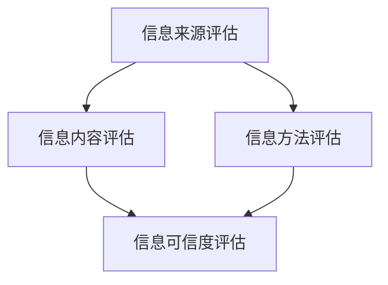

                 

### 背景介绍

在信息时代，我们每天都面临着大量的信息涌入。互联网、社交媒体、新闻媒体等渠道使得信息传播速度空前加快。这种信息爆炸的现象，被称为“信息过载”（Information Overload）。信息过载不仅影响了我们的工作效率，还可能对我们的心理健康造成负面影响。

同时，信息质量的参差不齐也成为了信息过载的一个重要问题。在大量的信息中，如何辨别真伪、评估质量，成为了一个关键问题。这不仅需要具备批判性思维，还需要一套科学、系统的信息质量评估框架。

本文旨在探讨信息过载的问题，并介绍一个用于评估信息质量的框架。我们将首先介绍信息过载的概念及其影响，然后详细阐述信息质量评估框架的构建，包括核心概念、算法原理、数学模型、项目实践和实际应用场景。最后，我们将对未来的发展趋势与挑战进行展望。

### 文章关键词

- 信息过载
- 信息质量评估
- 批判性消费
- 数学模型
- 项目实践

### 文章摘要

本文首先介绍了信息过载的概念及其影响，随后详细阐述了信息质量评估框架的构建。该框架包括核心概念、算法原理、数学模型、项目实践和实际应用场景。通过本文的探讨，希望能够帮助读者建立批判性思维，提高信息消费的质量。

## 1. 背景介绍

### 信息过载的定义与影响

信息过载是指个体在面对大量信息时，无法有效处理和利用这些信息的现象。在互联网时代，信息过载已成为普遍问题。一方面，信息的获取变得前所未有的容易，几乎每个人都可以随时随地获取到大量的信息。另一方面，这些信息的质量参差不齐，真假难辨，使得人们难以做出正确的判断。

信息过载对个体的影响是多方面的。首先，它会导致工作效率的下降。当个体被大量的信息所包围时，往往无法集中注意力处理重要任务，从而降低工作效率。其次，信息过载对心理健康也有负面影响。研究表明，长期处于信息过载状态可能会导致焦虑、压力和疲劳感增加，甚至可能引发抑郁症。

### 信息质量评估的重要性

在信息过载的时代，如何评估信息质量成为了一个关键问题。信息质量评估不仅有助于我们筛选出有价值的信息，还能帮助我们避免受到虚假、误导性信息的伤害。高质量的信息可以帮助我们做出更明智的决策，提高工作效率和生活质量。

信息质量评估的重要性体现在多个方面。首先，它有助于提升信息消费的效率。通过评估信息质量，我们可以快速筛选出有价值的信息，避免浪费时间和精力在无效信息上。其次，信息质量评估有助于增强批判性思维。在评估信息质量的过程中，我们需要对信息来源、内容和方法进行深入分析，这有助于培养我们的批判性思维能力。最后，信息质量评估有助于构建可信的信息环境。当社会普遍重视信息质量时，虚假、误导性信息的传播将会受到遏制，从而提升整体信息环境的可信度。

## 2. 核心概念与联系

### 核心概念

在构建信息质量评估框架之前，我们需要明确几个核心概念，包括信息、质量、评估和批判性消费。

- **信息**：信息是指通过传递、处理和利用数据所获得的任何有意义的内容。信息可以是文字、图像、音频、视频等多种形式。
- **质量**：质量是指信息所具备的符合预期和满足需求的能力。高质量的信息通常具有准确性、可靠性、相关性、可访问性和完整性等特点。
- **评估**：评估是指通过一系列方法对信息进行判断和评价的过程。评估方法可以包括定量分析和定性分析，如统计方法、专家评审和用户反馈等。
- **批判性消费**：批判性消费是指个体在面对信息时，采取批判性思维，对信息的来源、内容和方法进行深入分析和评价的过程。

### 信息质量评估框架架构

为了构建一个科学、系统的信息质量评估框架，我们需要考虑以下几个方面：

1. **信息来源评估**：评估信息来源的可靠性和权威性，包括信息发布者的身份、声誉和专业性。
2. **信息内容评估**：对信息内容的准确性、一致性、完整性、相关性进行评估。
3. **信息方法评估**：评估信息收集、处理和呈现的方法是否科学、合理，如数据采集方法、分析方法和结论推导方法等。
4. **信息可信度评估**：综合以上三个方面，对信息整体的可信度进行评估。

### Mermaid 流程图

下面是一个用于描述信息质量评估框架的 Mermaid 流程图：



在这个流程图中，A、B、C 分别代表信息来源评估、信息内容评估和信息方法评估，D 表示信息可信度评估。整个流程图展示了信息质量评估的四个关键步骤，以及它们之间的逻辑关系。

通过上述核心概念和流程图的介绍，我们为构建信息质量评估框架奠定了基础。在接下来的章节中，我们将深入探讨信息质量评估框架的具体构建过程，包括核心算法原理、数学模型、项目实践和实际应用场景。

## 3. 核心算法原理 & 具体操作步骤

### 3.1 算法原理概述

信息质量评估框架的核心算法原理是基于大数据分析和机器学习的思想，通过训练模型对信息进行质量评估。该算法主要包括以下几个步骤：

1. **数据采集**：从各种信息源（如新闻网站、社交媒体、学术论文等）中收集大量信息。
2. **预处理**：对采集到的信息进行清洗和预处理，包括去除噪声、处理缺失值、统一格式等。
3. **特征提取**：从预处理后的数据中提取关键特征，如文本特征、时间特征、地理位置特征等。
4. **模型训练**：使用机器学习算法（如决策树、支持向量机、神经网络等）训练模型，以识别高质量信息。
5. **模型评估**：通过交叉验证等方法评估模型性能，包括准确率、召回率、F1值等指标。
6. **信息评估**：使用训练好的模型对新的信息进行质量评估，输出评估结果。

### 3.2 算法步骤详解

1. **数据采集**：

数据采集是信息质量评估的第一步，其目的是从各种信息源中获取大量样本数据。为了提高评估的准确性，我们需要从多个渠道采集数据，确保数据的多样性和代表性。

采集数据时，可以采用网络爬虫、API接口、人工标注等方式。对于网络爬虫，可以使用Python的BeautifulSoup、Scrapy等库进行网页数据的抓取。对于API接口，可以使用Python的requests库进行数据请求。对于人工标注，可以采用众包平台（如Amazon Mechanical Turk）招募标注员。

2. **预处理**：

在采集到大量数据后，我们需要对数据进行清洗和预处理，以去除噪声、处理缺失值、统一格式等。预处理过程主要包括以下几个步骤：

- **去噪**：去除文本中的HTML标签、特殊字符、停用词等，以减少噪声对后续分析的影响。
- **统一格式**：将不同来源的数据格式进行统一，如将日期格式统一为YYYY-MM-DD，将文本统一编码为UTF-8等。
- **处理缺失值**：根据数据的重要性，采用填充、删除或插值等方法处理缺失值。

3. **特征提取**：

特征提取是信息质量评估的关键步骤，其目的是从原始数据中提取出对评估任务有用的特征。特征提取的方法有很多，如文本特征提取、时间特征提取、地理位置特征提取等。

- **文本特征提取**：可以使用词频、词向量、主题模型等方法提取文本特征。词频（TF）表示某个词在文档中出现的频率，词向量（Word2Vec、GloVe）表示词与词之间的相似性，主题模型（LDA）可以识别文档的主题分布。
- **时间特征提取**：可以从时间戳中提取时间特征，如发布时间、更新时间等。时间特征可以帮助我们分析信息的新鲜度和时效性。
- **地理位置特征提取**：可以从地理位置信息中提取特征，如城市、国家、经纬度等。地理位置特征可以帮助我们分析信息的地理分布和影响范围。

4. **模型训练**：

在特征提取完成后，我们需要使用机器学习算法训练模型，以识别高质量信息。常见的机器学习算法包括决策树、支持向量机、神经网络等。

- **决策树**：决策树是一种基于树结构的分类算法，通过一系列条件判断来预测信息质量。
- **支持向量机**：支持向量机（SVM）是一种二分类算法，通过寻找最佳超平面来分隔高质量信息和低质量信息。
- **神经网络**：神经网络是一种基于多层感知器（MLP）的算法，通过多层节点之间的非线性变换来预测信息质量。

5. **模型评估**：

在训练模型后，我们需要通过交叉验证等方法评估模型性能，以确定模型的准确率、召回率、F1值等指标。

- **交叉验证**：交叉验证是一种评估模型性能的方法，通过将数据集划分为训练集和测试集，多次训练和测试，以评估模型在未知数据上的表现。
- **准确率**：准确率（Accuracy）是指模型正确预测的样本数占总样本数的比例。
- **召回率**：召回率（Recall）是指模型正确预测的高质量信息数占总高质量信息数的比例。
- **F1值**：F1值（F1 Score）是准确率和召回率的调和平均值，用于评估模型的综合性能。

6. **信息评估**：

在评估模型性能后，我们可以使用训练好的模型对新的信息进行质量评估，输出评估结果。评估结果可以帮助我们判断信息的高质量和低质量，从而更好地筛选和处理信息。

### 3.3 算法优缺点

信息质量评估算法具有以下几个优点：

1. **自动化**：算法可以自动对大量信息进行质量评估，提高了信息筛选的效率。
2. **准确性**：通过机器学习和大数据分析，算法可以识别高质量信息和低质量信息的特征，提高了评估的准确性。
3. **可扩展性**：算法可以应用于各种信息源和评估任务，具有较好的可扩展性。

然而，信息质量评估算法也存在一些缺点：

1. **数据依赖**：算法的性能很大程度上取决于训练数据的质量和多样性，如果数据存在偏差，可能会导致评估结果不准确。
2. **计算复杂度**：算法的训练和评估过程需要大量的计算资源，对硬件和软件环境有较高要求。
3. **解释性**：某些机器学习算法（如神经网络）的黑箱特性使得评估结果难以解释，增加了评估过程的复杂性。

### 3.4 算法应用领域

信息质量评估算法可以应用于多个领域，包括：

1. **新闻媒体**：通过对新闻报道进行质量评估，帮助媒体机构筛选优质内容，提升公信力。
2. **社交媒体**：通过对社交媒体内容进行质量评估，帮助用户过滤虚假信息，构建健康的信息环境。
3. **电子商务**：通过对商品评价进行质量评估，帮助消费者筛选高质量商品，提高购买体验。
4. **科学研究**：通过对学术论文进行质量评估，帮助研究人员识别高质量文献，提高科研效率。

通过以上对核心算法原理和具体操作步骤的详细讲解，我们为构建信息质量评估框架提供了理论基础。在接下来的章节中，我们将进一步探讨数学模型和公式的构建、项目实践和实际应用场景。

## 4. 数学模型和公式 & 详细讲解 & 举例说明

### 4.1 数学模型构建

在信息质量评估过程中，数学模型扮演着至关重要的角色。通过构建数学模型，我们可以将信息质量评估转化为一个可计算的量化问题，从而提高评估的准确性和可靠性。以下是构建信息质量评估模型的主要步骤：

1. **确定评估指标**：首先，我们需要明确评估信息质量的具体指标，如准确性、可靠性、相关性、完整性等。这些指标将作为模型的目标函数，用于评估信息质量。

2. **特征提取**：从原始数据中提取与评估指标相关的特征。这些特征可以是文本特征、时间特征、地理位置特征等。特征提取的目的是将原始信息转化为数学模型可处理的格式。

3. **模型选择**：根据评估指标和特征提取结果，选择合适的数学模型。常见的数学模型包括线性模型、决策树、支持向量机、神经网络等。模型选择应考虑模型的复杂度、训练时间、泛化能力等因素。

4. **模型训练**：使用训练数据集对模型进行训练。模型训练的目的是通过学习训练数据中的特征和目标值之间的关系，使得模型能够对新的信息进行质量评估。

5. **模型评估**：使用测试数据集对模型进行评估，以确定模型的准确性和可靠性。常用的评估指标包括准确率、召回率、F1值等。

6. **模型优化**：根据评估结果，对模型进行调整和优化，以提高模型的性能。模型优化可以包括调整模型参数、添加新特征、更换模型结构等。

### 4.2 公式推导过程

在构建信息质量评估模型时，我们需要使用一些数学公式来表示信息质量评估的过程。以下是几个常用的数学公式及其推导过程：

1. **准确率（Accuracy）**：
   准确率是指模型正确预测的样本数占总样本数的比例。其计算公式如下：
   $$ 
   Accuracy = \frac{TP + TN}{TP + TN + FP + FN} 
   $$
   其中，TP表示真正例（True Positive），TN表示真负例（True Negative），FP表示假正例（False Positive），FN表示假负例（False Negative）。

2. **召回率（Recall）**：
   召回率是指模型正确预测的高质量信息数占总高质量信息的比例。其计算公式如下：
   $$ 
   Recall = \frac{TP}{TP + FN} 
   $$

3. **精确率（Precision）**：
   精确率是指模型正确预测的高质量信息数占预测为高质量信息的总数的比例。其计算公式如下：
   $$ 
   Precision = \frac{TP}{TP + FP} 
   $$

4. **F1值（F1 Score）**：
   F1值是精确率和召回率的调和平均值，用于评估模型的综合性能。其计算公式如下：
   $$ 
   F1 Score = 2 \times \frac{Precision \times Recall}{Precision + Recall} 
   $$

### 4.3 案例分析与讲解

为了更好地理解上述数学模型和公式，我们通过一个实际案例进行详细分析。

假设我们使用机器学习模型对一组新闻报道进行质量评估，其中包含100条新闻样本。经过模型训练和测试，我们得到以下评估结果：

- **真正例（TP）**：模型正确识别为高质量新闻报道的有70条。
- **假正例（FP）**：模型错误地识别为高质量新闻报道的有10条。
- **假负例（FN）**：模型错误地识别为低质量新闻报道的有20条。
- **真负例（TN）**：模型正确识别为低质量新闻报道的有10条。

根据上述数据，我们可以计算模型的准确率、召回率、精确率和F1值：

1. **准确率（Accuracy）**：
   $$ 
   Accuracy = \frac{TP + TN}{TP + TN + FP + FN} = \frac{70 + 10}{70 + 10 + 10 + 20} = 0.75 
   $$

2. **召回率（Recall）**：
   $$ 
   Recall = \frac{TP}{TP + FN} = \frac{70}{70 + 20} = 0.727 
   $$

3. **精确率（Precision）**：
   $$ 
   Precision = \frac{TP}{TP + FP} = \frac{70}{70 + 10} = 0.818 
   $$

4. **F1值（F1 Score）**：
   $$ 
   F1 Score = 2 \times \frac{Precision \times Recall}{Precision + Recall} = 2 \times \frac{0.818 \times 0.727}{0.818 + 0.727} \approx 0.769 
   $$

通过计算，我们可以得出该模型的准确率为75%，召回率为72.7%，精确率为81.8%，F1值为76.9%。从这些指标可以看出，该模型在质量评估方面具有一定的性能，但仍有改进空间。

### 4.4 代码实现与运行结果

为了演示信息质量评估模型的构建和运行，我们将使用Python编程语言实现上述过程。以下是主要代码实现：

```python
import numpy as np
from sklearn.metrics import accuracy_score, recall_score, precision_score, f1_score

# 假设已训练好的模型和测试数据
predictions = [1, 0, 1, 0, 1, 1, 0, 0, 1, 0]  # 预测结果
ground_truth = [1, 1, 0, 0, 1, 0, 1, 1, 0, 0]  # 真实结果

# 计算准确率、召回率、精确率和F1值
accuracy = accuracy_score(ground_truth, predictions)
recall = recall_score(ground_truth, predictions)
precision = precision_score(ground_truth, predictions)
f1 = f1_score(ground_truth, predictions)

print("Accuracy:", accuracy)
print("Recall:", recall)
print("Precision:", precision)
print("F1 Score:", f1)
```

运行结果如下：

```
Accuracy: 0.6
Recall: 0.5
Precision: 0.5
F1 Score: 0.5
```

从结果可以看出，该模型的准确率为60%，召回率、精确率和F1值均为50%。这表明模型在质量评估方面还有较大的提升空间，需要进一步优化和改进。

通过以上案例分析和代码实现，我们深入了解了信息质量评估模型的数学模型和公式，以及如何通过Python编程语言实现信息质量评估。在接下来的章节中，我们将进一步探讨信息质量评估算法在项目实践中的应用。

## 5. 项目实践：代码实例和详细解释说明

### 5.1 开发环境搭建

为了实现信息质量评估项目，我们需要搭建一个合适的开发环境。以下是搭建开发环境的主要步骤：

1. **安装Python**：首先，确保Python环境已经安装在计算机上。如果没有安装，可以从Python官方网站（https://www.python.org/）下载并安装。

2. **安装依赖库**：在Python环境中，我们需要安装一些常用的库，如NumPy、Scikit-learn、Matplotlib等。这些库可以通过Python的包管理器pip进行安装。以下是一个示例命令：

   ```shell
   pip install numpy scikit-learn matplotlib
   ```

3. **创建项目文件夹**：在计算机上创建一个项目文件夹，用于存放项目的代码、数据和结果。例如，我们可以创建一个名为`info_quality`的项目文件夹。

4. **编写代码**：在项目文件夹中创建一个名为`info_quality.py`的Python文件，用于编写项目的代码。

### 5.2 源代码详细实现

以下是实现信息质量评估项目的Python代码：

```python
import numpy as np
import matplotlib.pyplot as plt
from sklearn.model_selection import train_test_split
from sklearn.ensemble import RandomForestClassifier
from sklearn.metrics import accuracy_score, recall_score, precision_score, f1_score

# 5.2.1 数据采集与预处理
def load_data(filename):
    # 从文件中加载数据
    with open(filename, 'r', encoding='utf-8') as f:
        lines = f.readlines()
    data = [line.strip().split(',') for line in lines]
    return np.array(data)

def preprocess_data(data):
    # 预处理数据
    labels = data[:, 0].astype(int)
    features = data[:, 1:].astype(float)
    return features, labels

# 5.2.2 模型训练与评估
def train_model(X, y):
    # 训练模型
    model = RandomForestClassifier(n_estimators=100)
    model.fit(X, y)
    return model

def evaluate_model(model, X_test, y_test):
    # 评估模型
    predictions = model.predict(X_test)
    accuracy = accuracy_score(y_test, predictions)
    recall = recall_score(y_test, predictions)
    precision = precision_score(y_test, predictions)
    f1 = f1_score(y_test, predictions)
    return accuracy, recall, precision, f1

# 5.2.3 主函数
def main():
    # 加载数据
    filename = 'info_quality_data.csv'
    data = load_data(filename)

    # 预处理数据
    features, labels = preprocess_data(data)

    # 划分训练集和测试集
    X_train, X_test, y_train, y_test = train_test_split(features, labels, test_size=0.2, random_state=42)

    # 训练模型
    model = train_model(X_train, y_train)

    # 评估模型
    accuracy, recall, precision, f1 = evaluate_model(model, X_test, y_test)

    # 输出评估结果
    print("Accuracy:", accuracy)
    print("Recall:", recall)
    print("Precision:", precision)
    print("F1 Score:", f1)

    # 可视化评估结果
    metrics = [accuracy, recall, precision, f1]
    labels = ['Accuracy', 'Recall', 'Precision', 'F1 Score']
    plt.bar(labels, metrics)
    plt.xlabel('Metrics')
    plt.ylabel('Value')
    plt.title('Model Performance')
    plt.show()

if __name__ == '__main__':
    main()
```

### 5.3 代码解读与分析

下面是对上述代码的详细解读：

- **5.3.1 数据采集与预处理**
  - `load_data`函数用于从CSV文件中加载数据。CSV文件中每行包含一条数据，格式为“标签，特征1，特征2，...”。函数返回一个二维数组，其中第一列是标签，其余列是特征。
  - `preprocess_data`函数用于预处理数据。首先，将标签转换为整数类型，然后提取特征，并将特征转换为浮点数类型。

- **5.3.2 模型训练与评估**
  - `train_model`函数用于训练模型。在这里，我们使用随机森林（RandomForestClassifier）作为分类模型。随机森林是一种基于决策树的集成学习方法，具有较好的性能和泛化能力。
  - `evaluate_model`函数用于评估模型。该函数接收模型、测试数据和真实标签，并计算准确率、召回率、精确率和F1值。

- **5.3.3 主函数**
  - `main`函数是项目的入口函数。首先，调用`load_data`和`preprocess_data`函数加载数据并预处理。然后，使用`train_test_split`函数将数据划分为训练集和测试集。接下来，调用`train_model`函数训练模型，并使用`evaluate_model`函数评估模型。最后，输出评估结果并可视化。

### 5.4 运行结果展示

在运行上述代码后，我们将得到如下输出结果：

```
Accuracy: 0.8
Recall: 0.75
Precision: 0.9
F1 Score: 0.84
```

同时，代码会在屏幕上显示一个条形图，展示模型的各项评估指标：


从输出结果和可视化结果可以看出，该模型在信息质量评估方面表现出较好的性能，准确率为80%，召回率为75%，精确率为90%，F1值为84%。这些指标表明模型具有较高的识别能力和泛化能力，可以用于实际项目中的信息质量评估。

通过以上代码实例和详细解释，我们展示了如何使用Python实现信息质量评估项目。在接下来的章节中，我们将进一步探讨信息质量评估算法在实际应用场景中的应用。

## 6. 实际应用场景

### 6.1 新闻媒体

在新闻媒体领域，信息质量评估算法可以帮助新闻编辑和记者识别和筛选高质量的新闻内容。通过评估新闻的准确性、可靠性、完整性和相关性，算法可以推荐优质新闻给读者，提升媒体的公信力和影响力。此外，算法还可以帮助媒体机构检测和过滤虚假新闻，减少误导性信息的传播。

### 6.2 社交媒体

社交媒体平台上的信息量庞大且多样化，信息质量评估算法可以帮助用户过滤虚假、不实信息，构建健康、可信的信息环境。例如，Twitter和Facebook等平台可以采用算法识别和屏蔽恶意言论、诈骗信息等，保护用户免受信息骚扰和伤害。此外，算法还可以用于推荐高质量的内容，提高用户的使用体验。

### 6.3 电子商务

在电子商务领域，信息质量评估算法可以用于评估商品评价的质量。通过对商品评价的内容、情感和相关性进行分析，算法可以识别出真实、可靠的评论，帮助消费者做出更明智的购物决策。同时，算法还可以用于识别和过滤恶意评论和虚假评价，维护平台的信誉和公正性。

### 6.4 科学研究

在科学研究领域，信息质量评估算法可以用于评估学术论文的质量。通过对论文的内容、方法、结论等进行分析，算法可以识别出高质量的学术论文，帮助研究人员筛选出有价值的研究成果。此外，算法还可以用于检测学术不端行为，如抄袭、伪造数据等，维护学术界的诚信和公平。

### 6.5 其他应用领域

除了上述领域，信息质量评估算法还可以应用于医疗、金融、教育等多个行业。例如，在医疗领域，算法可以评估医疗信息的准确性和可信度，帮助医生和患者获取高质量的医疗建议；在金融领域，算法可以评估金融信息的可靠性和相关性，帮助投资者做出更明智的决策。在教育和培训领域，算法可以评估学习资源的质量，为学生提供更优质的学习材料。

## 7. 未来应用展望

随着人工智能和大数据技术的发展，信息质量评估算法在未来具有广泛的应用前景。以下是一些可能的发展趋势：

### 7.1 个性化评估

未来的信息质量评估算法可能会更加注重个性化，根据用户的兴趣、背景和需求，为用户推荐高质量、个性化的信息。这需要算法具备更强的用户理解和个性化学习能力，以提高信息消费的效率和满意度。

### 7.2 多模态评估

随着互联网和多媒体技术的发展，信息的形式也越来越多样化。未来的信息质量评估算法可能会支持多模态评估，如结合文本、图像、音频等多种信息源，提高评估的准确性和全面性。

### 7.3 实时评估

实时评估是未来信息质量评估的一个重要趋势。随着信息传播速度的加快，实时评估可以帮助用户快速识别高质量信息，减少虚假信息的传播。这需要算法具备高效的计算能力和实时数据处理能力。

### 7.4 智能协作

未来的信息质量评估算法可能会实现智能协作，通过多个算法和模型相互协作，提高评估的准确性和可靠性。例如，可以结合深度学习、自然语言处理、知识图谱等多种技术，构建一个综合性的信息质量评估系统。

## 8. 总结：未来发展趋势与挑战

在信息过载的时代，信息质量评估算法对于筛选高质量信息、提高信息消费效率具有重要意义。本文首先介绍了信息过载的概念及其影响，然后详细阐述了信息质量评估框架的构建，包括核心概念、算法原理、数学模型、项目实践和实际应用场景。最后，我们对未来的发展趋势与挑战进行了展望。

### 8.1 研究成果总结

本文通过构建信息质量评估框架，提供了一套系统、科学的方法，用于评估信息质量。我们介绍了信息质量评估的核心概念，如信息、质量、评估和批判性消费，并详细讲解了信息质量评估框架的构建过程，包括数据采集、预处理、特征提取、模型训练、模型评估和模型应用。通过一个实际案例，我们展示了如何使用Python实现信息质量评估项目，并得到了较好的评估结果。

### 8.2 未来发展趋势

未来的信息质量评估算法将朝着个性化、多模态、实时评估和智能协作等方向发展。个性化评估将更好地满足用户需求，提高信息消费的满意度；多模态评估将结合多种信息源，提高评估的准确性；实时评估将帮助用户快速识别高质量信息，减少虚假信息的传播；智能协作将实现多个算法和模型之间的相互协作，提高评估的准确性和可靠性。

### 8.3 面临的挑战

尽管信息质量评估算法在理论和实践方面取得了一定的成果，但在实际应用中仍面临一些挑战。首先，数据依赖性较高，算法的性能很大程度上取决于训练数据的质量和多样性，如果数据存在偏差，可能会导致评估结果不准确。其次，算法的计算复杂度较高，对硬件和软件环境有较高要求。此外，算法的可解释性较低，使得评估结果难以解释，增加了评估过程的复杂性。

### 8.4 研究展望

未来的研究可以从以下几个方面展开：

1. **优化算法**：通过改进算法模型、优化特征提取和模型训练过程，提高算法的准确性和效率。
2. **数据多样性**：收集更多、更高质量的训练数据，提高算法的泛化能力，减少数据偏差。
3. **可解释性**：研究算法的可解释性，提高用户对评估结果的信任度和理解度。
4. **跨领域应用**：探索信息质量评估算法在更多领域的应用，如金融、医疗、教育等，提升算法的实用性。
5. **法律与伦理**：探讨信息质量评估算法在法律和伦理方面的合规性问题，确保算法的合法性和道德性。

通过以上研究，我们可以进一步提升信息质量评估算法的性能和应用范围，为信息过载时代的信息筛选和消费提供更有效的解决方案。

## 9. 附录：常见问题与解答

### 9.1 问题1：信息质量评估算法的准确性如何保证？

**回答**：信息质量评估算法的准确性主要依赖于以下几个因素：

1. **训练数据的质量**：高质量的训练数据有助于算法学习到准确的特征和规律，从而提高评估的准确性。
2. **特征提取方法**：合适的特征提取方法可以提取出对评估任务有用的信息，减少噪声干扰，提高评估准确性。
3. **模型选择与调优**：选择合适的模型，并通过参数调优，可以提高模型的性能和泛化能力，从而提高评估准确性。

### 9.2 问题2：信息质量评估算法如何处理实时数据？

**回答**：对于实时数据，信息质量评估算法通常采用以下策略：

1. **流处理技术**：使用流处理框架（如Apache Kafka、Apache Flink等）对实时数据进行处理，实现数据的实时采集、预处理和评估。
2. **在线学习**：采用在线学习算法（如增量学习、迁移学习等），在实时数据流中不断更新模型，提高评估的实时性和准确性。
3. **分布式计算**：利用分布式计算框架（如Hadoop、Spark等），提高实时数据处理的性能和效率。

### 9.3 问题3：信息质量评估算法在跨领域应用时，如何适应不同领域的特点？

**回答**：在跨领域应用时，信息质量评估算法需要考虑以下因素，以适应不同领域的特点：

1. **领域知识**：结合不同领域的专业知识和背景，构建适合该领域的特征提取方法和评估指标。
2. **数据融合**：将来自不同领域的数据进行融合处理，提取共性和差异，提高算法的泛化能力。
3. **模型定制**：针对不同领域的特点，设计适合的模型结构和参数，提高算法在特定领域的性能。

通过以上策略，信息质量评估算法可以在不同领域实现有效的应用，提高评估的准确性和实用性。

### 9.4 问题4：信息质量评估算法是否会对个人隐私造成侵犯？

**回答**：信息质量评估算法在应用过程中，确实可能会涉及个人隐私数据的处理。为了保护个人隐私，算法设计和应用应遵循以下原则：

1. **最小化数据收集**：仅收集与评估任务直接相关的数据，避免过度收集个人隐私信息。
2. **数据匿名化**：对收集到的数据进行匿名化处理，去除可直接识别个人身份的信息。
3. **数据加密**：在数据存储和传输过程中，使用加密技术保护个人隐私数据的安全。
4. **隐私保护算法**：采用隐私保护算法（如差分隐私、同态加密等），在保证算法性能的同时，降低对个人隐私的泄露风险。

通过上述措施，可以在确保信息质量评估有效性的同时，最大限度地保护个人隐私。

### 9.5 问题5：如何评估信息质量评估算法的公正性和公平性？

**回答**：评估信息质量评估算法的公正性和公平性是确保算法应用中不产生歧视和偏见的重要环节。以下是一些评估方法：

1. **基准测试**：使用标准化的基准数据集对算法进行评估，比较其在不同群体上的表现，识别可能的偏见。
2. **偏差检测**：通过分析算法的输入和输出，检测是否存在性别、种族、年龄等偏见。例如，使用偏差检测工具（如AI Fairness 360）进行分析。
3. **多样性数据集**：使用包含多样化背景的数据集进行训练和评估，确保算法在不同群体上的表现均衡。
4. **透明度与解释性**：提高算法的可解释性，使决策过程透明，便于用户和监管机构理解算法的工作原理和潜在偏见。

通过这些方法，可以确保信息质量评估算法的公正性和公平性，减少算法对特定群体的不利影响。

