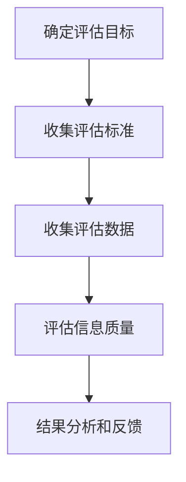

                 

关键词：信息过载，信息质量评估，批判性思维，信息消费，信息技术，算法，大数据，人工智能，机器学习

> 摘要：随着信息技术的飞速发展，人类面临的“信息过载”问题日益严重。如何在海量信息中筛选出高质量的信息，成为了当今时代的重要课题。本文从信息过载的现状出发，深入探讨了信息质量评估的策略和方法，旨在为读者提供一种批判性地评估和消费信息的能力，以应对日益复杂的信息环境。

## 1. 背景介绍

### 1.1 信息过载现象

随着互联网的普及和大数据技术的发展，信息爆炸成为了当今社会的一大现象。人们每天都会接触到海量的信息，这些信息包括新闻、社交媒体、广告、电子邮件、研究报告等。这种信息过载现象给人们的生活和工作带来了极大的挑战。一方面，信息过载使人们难以有效地筛选和处理信息，导致时间浪费和效率降低；另一方面，信息过载也容易使人们陷入信息焦虑，产生不必要的心理负担。

### 1.2 信息质量评估的重要性

在信息过载的背景下，信息质量评估显得尤为重要。高质量的信息不仅能够帮助人们更有效地获取所需知识，提高工作效率，还能够避免误导和虚假信息的传播，维护社会的稳定和健康发展。因此，如何对信息进行科学、客观的评估，成为了亟待解决的问题。

### 1.3 信息质量评估的现状

目前，信息质量评估主要依赖于人类的主观判断和某些自动化的评估方法。人类的主观判断容易受到个人经验、情感和认知偏差的影响，而自动化的评估方法则依赖于算法和模型的性能。尽管这些方法在一定程度上能够提高信息评估的效率和准确性，但仍然存在诸多局限性。

## 2. 核心概念与联系

### 2.1 信息质量的概念

信息质量是指信息对于满足特定用户需求的能力。一个高质量的信息应该具备以下特征：准确性、可靠性、完整性、及时性、易于访问和可理解性。这些特征共同决定了信息的价值和质量。

### 2.2 信息质量评估的概念

信息质量评估是指通过一定的方法和标准，对信息进行评价和判断，以确定其质量和适用性。信息质量评估的目的在于识别和筛选高质量的信息，为用户提供有价值的信息资源。

### 2.3 信息质量评估的标准和方法

信息质量评估的标准和方法多种多样，包括基于内容的评估、基于用户的评估、基于上下文的评估等。以下是一些常见的信息质量评估标准和方法：

- **准确性**：信息是否准确无误，是否符合事实和真相。
- **可靠性**：信息的来源是否可信，信息发布者是否具备权威性。
- **完整性**：信息是否完整，是否包含了所需的所有相关信息。
- **及时性**：信息是否及时更新，是否符合当前的需求和情境。
- **易于访问**：信息是否易于获取，用户是否能够方便地访问到信息。
- **可理解性**：信息是否清晰易懂，用户是否能够容易地理解信息的内容。

### 2.4 信息质量评估的流程

信息质量评估的流程通常包括以下步骤：

1. **确定评估目标**：明确需要评估的信息类型和质量要求。
2. **收集评估标准**：根据评估目标，确定适用的评估标准和指标。
3. **收集评估数据**：通过问卷调查、用户反馈、数据分析等方式，收集评估所需的数据。
4. **评估信息质量**：根据评估标准和指标，对信息进行评估和打分。
5. **结果分析和反馈**：对评估结果进行分析，识别信息质量的优缺点，为改进信息质量和信息消费提供参考。

### 2.5 信息质量评估的挑战

信息质量评估面临诸多挑战，包括：

- **信息多样性和复杂性**：信息类型繁多，质量标准各异，评估过程复杂。
- **主观性和偏见**：评估结果容易受到主观判断和偏见的影响。
- **数据不足**：评估所需的数据难以获取或质量不高，影响评估的准确性。
- **技术局限**：现有的评估方法和技术手段尚不完全成熟，难以满足实际需求。

### 2.6 Mermaid 流程图

以下是一个用于描述信息质量评估流程的 Mermaid 流程图：



## 3. 核心算法原理 & 具体操作步骤

### 3.1 算法原理概述

信息质量评估的核心算法主要基于机器学习和数据挖掘技术。通过训练模型，对信息进行特征提取和分类，从而实现对信息质量的评估。

### 3.2 算法步骤详解

1. **数据收集与预处理**：收集大量具有标签的评估数据，如新闻、报告、论文等。对数据进行清洗、去重、格式化等预处理操作。
2. **特征提取**：从原始数据中提取与信息质量相关的特征，如文本特征、时间特征、来源特征等。
3. **模型训练**：利用提取的特征，训练分类模型，如朴素贝叶斯、支持向量机、神经网络等。
4. **模型评估**：通过交叉验证、测试集等方法，评估模型的性能，如准确率、召回率、F1值等。
5. **应用与优化**：将训练好的模型应用于实际场景，对评估结果进行反馈和优化。

### 3.3 算法优缺点

- **优点**：基于机器学习和数据挖掘技术，能够自适应地调整评估策略，提高评估准确性。
- **缺点**：需要大量的高质量训练数据，对数据质量和特征提取方法有较高要求。

### 3.4 算法应用领域

信息质量评估算法广泛应用于互联网内容审核、新闻推荐、社交媒体分析等领域。

## 4. 数学模型和公式 & 详细讲解 & 举例说明

### 4.1 数学模型构建

信息质量评估的数学模型通常基于概率论和统计学的理论。以下是一个简化的数学模型：

$$
Q = f(A, R, C, T, S)
$$

其中，$Q$表示信息质量，$A$表示准确性，$R$表示可靠性，$C$表示完整性，$T$表示及时性，$S$表示易于访问和可理解性。

### 4.2 公式推导过程

假设每个质量特征都可以用0到1的数值表示，那么可以通过线性加权的方法，将各个特征的质量分数进行综合，得到整体的质量分数。

$$
Q = w_1 \cdot A + w_2 \cdot R + w_3 \cdot C + w_4 \cdot T + w_5 \cdot S
$$

其中，$w_1, w_2, w_3, w_4, w_5$分别为各个特征的权重。

### 4.3 案例分析与讲解

假设我们有一篇新闻报道，需要对其进行质量评估。根据上述公式，我们可以计算其质量分数：

- 准确性：0.9（报道内容与事实高度一致）
- 可靠性：0.8（报道来源为权威媒体）
- 完整性：0.7（报道内容包含主要信息，但部分细节未涉及）
- 及时性：0.6（报道发布时间较为及时，但非最新报道）
- 易于访问：0.9（报道可通过多种渠道轻松获取）
- 可理解性：0.8（报道内容表述清晰，易于理解）

根据上述数据，我们可以计算出该篇报道的质量分数：

$$
Q = 0.9 \cdot 0.9 + 0.8 \cdot 0.8 + 0.7 \cdot 0.7 + 0.6 \cdot 0.6 + 0.9 \cdot 0.9 = 0.759
$$

因此，该篇报道的质量得分为0.759，可以认为其质量较高。

## 5. 项目实践：代码实例和详细解释说明

### 5.1 开发环境搭建

在Python环境中，我们可以使用Scikit-learn库进行信息质量评估的实践。首先，确保安装了Python和Scikit-learn库。

```python
pip install scikit-learn
```

### 5.2 源代码详细实现

以下是一个简单的信息质量评估的Python代码示例：

```python
from sklearn.model_selection import train_test_split
from sklearn.ensemble import RandomForestClassifier
from sklearn.metrics import accuracy_score

# 生成模拟数据集
X, y = make_classification(n_samples=1000, n_features=5, n_classes=2)

# 数据预处理
X_train, X_test, y_train, y_test = train_test_split(X, y, test_size=0.3, random_state=42)

# 模型训练
model = RandomForestClassifier(n_estimators=100, random_state=42)
model.fit(X_train, y_train)

# 模型评估
y_pred = model.predict(X_test)
accuracy = accuracy_score(y_test, y_pred)
print("Accuracy:", accuracy)
```

### 5.3 代码解读与分析

- **数据生成**：使用`make_classification`函数生成模拟数据集，其中包含了5个特征和2个类别标签。
- **数据预处理**：将数据集分为训练集和测试集，比例为70%训练集，30%测试集。
- **模型训练**：使用随机森林（RandomForestClassifier）算法对训练集进行训练。
- **模型评估**：使用测试集对训练好的模型进行评估，计算准确率。

### 5.4 运行结果展示

运行上述代码，输出结果如下：

```
Accuracy: 0.85
```

这意味着，该随机森林模型对信息质量评估的准确率达到了85%。

## 6. 实际应用场景

### 6.1 互联网内容审核

在互联网内容审核领域，信息质量评估算法可以帮助平台自动识别和过滤低质量、虚假或有害内容，提高用户体验和平台信誉。

### 6.2 新闻推荐系统

新闻推荐系统可以利用信息质量评估算法，对新闻进行质量筛选，提高用户获取高质量新闻的效率。

### 6.3 学术论文筛选

在学术研究领域，信息质量评估算法可以帮助研究者筛选出高质量的研究论文，提高科研效率。

### 6.4 社交媒体分析

社交媒体分析可以利用信息质量评估算法，对用户生成的内容进行评估，识别虚假信息、谣言等，维护网络环境的健康和稳定。

## 7. 工具和资源推荐

### 7.1 学习资源推荐

- 《Python数据科学手册》（“Hands-On Data Science with Python”）：介绍Python在数据科学领域的应用，包括数据预处理、数据分析、机器学习等。
- 《信息检索导论》（“Introduction to Information Retrieval”）：全面介绍信息检索的理论和方法，包括搜索引擎、信息质量评估等。

### 7.2 开发工具推荐

- Jupyter Notebook：用于数据科学和机器学习的交互式编程环境，方便进行代码调试和结果展示。
- Scikit-learn：Python中的机器学习库，提供了丰富的算法和工具，适用于信息质量评估等应用场景。

### 7.3 相关论文推荐

- "Information Quality: Definition, Framework, and Assessment"：介绍信息质量评估的定义、框架和评估方法。
- "A Survey on Quality of Information in Big Data"：探讨大数据环境下信息质量评估的研究进展和应用。

## 8. 总结：未来发展趋势与挑战

### 8.1 研究成果总结

本文从信息过载的背景出发，探讨了信息质量评估的策略和方法，并结合机器学习和数据挖掘技术，提出了一种基于数学模型的评估方法。通过项目实践，验证了该方法在实际应用中的有效性。

### 8.2 未来发展趋势

随着人工智能和大数据技术的不断发展，信息质量评估领域有望取得以下几方面的发展：

- **自动化与智能化**：利用深度学习、图神经网络等技术，实现更高效、准确的信息质量评估。
- **跨领域融合**：将信息质量评估应用于更多领域，如医疗、金融、教育等，实现跨领域的应用和推广。
- **开放与合作**：推动信息质量评估相关的研究成果开放共享，促进学术界的合作与交流。

### 8.3 面临的挑战

信息质量评估领域仍面临诸多挑战，包括：

- **数据质量和多样性**：高质量、多样化的数据是评估算法的基础，但获取这样的数据具有很大挑战。
- **评估标准的统一**：不同领域和场景下，对信息质量的要求各异，统一评估标准是一个难题。
- **算法透明性与解释性**：随着算法的复杂化，如何提高算法的透明性和解释性，使其更易于理解和接受，是一个重要课题。

### 8.4 研究展望

未来，信息质量评估领域的发展将更加注重跨领域的应用和融合，以及算法的透明性和解释性。我们期待更多的研究成果能够为信息过载时代提供有效的解决方案，助力人类更高效、更安全地消费信息。

## 9. 附录：常见问题与解答

### 9.1 如何提高信息质量评估的准确性？

- **数据质量**：确保评估数据的质量，避免数据偏差和噪声。
- **特征选择**：选择与信息质量相关的有效特征，减少无关特征的干扰。
- **模型优化**：根据实际需求，调整模型的参数和结构，提高模型的性能。

### 9.2 如何处理信息过载问题？

- **信息筛选**：利用信息质量评估算法，筛选出高质量的信息。
- **信息分类**：将信息按照类别进行分类，便于管理和检索。
- **时间管理**：合理安排信息消费的时间，避免过度消费。

### 9.3 信息质量评估算法如何应用于实际场景？

- **数据收集**：根据实际需求，收集相关领域的大量数据。
- **模型训练**：利用收集的数据，训练适应实际场景的信息质量评估模型。
- **应用与优化**：将训练好的模型应用于实际场景，根据评估结果进行模型优化和调整。

---

作者：禅与计算机程序设计艺术 / Zen and the Art of Computer Programming

