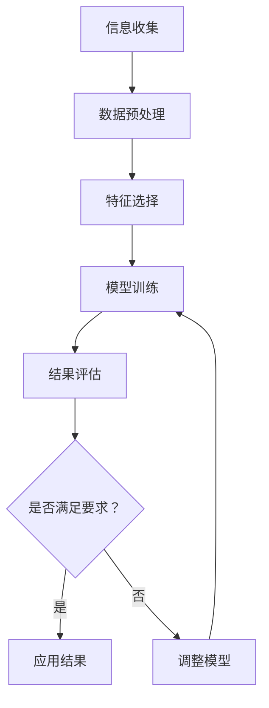

                 

关键词：信息过载、信息质量评估、批判性思维、数据挖掘、人工智能、网络安全、信息伦理

摘要：随着互联网和数字技术的飞速发展，信息过载成为现代社会中普遍存在的问题。如何有效地评估和消费信息，保持批判性思维，是个人和企业在信息时代取得成功的关键。本文将探讨信息过载现象及其影响，分析信息质量评估的关键因素，并提出一套全面的信息质量评估策略。此外，文章还将讨论如何通过数据挖掘、人工智能和网络安全等技术手段提升信息质量，以及如何在信息伦理的框架下，实现信息的合理消费。

## 1. 背景介绍

### 1.1 信息过载现象

在互联网时代，信息过载现象愈发显著。根据美国科学促进会（AAAS）的一项调查，人们每天平均接触的信息量相当于每天阅读175份报纸。这种过量的信息涌入，不仅增加了人们的工作和生活压力，还可能导致认知负担和信息焦虑。面对海量的信息，人们常常感到力不从心，难以筛选出真正有价值的内容。

### 1.2 信息质量的重要性

在信息过载的背景下，信息质量变得尤为重要。高质量的信息可以帮助我们做出更明智的决策，提高工作效率，甚至对个人和社会产生深远的影响。反之，低质量的信息可能导致错误决策、误导和偏见，对社会和个人造成负面影响。

### 1.3 历史背景

信息过载问题并非现代独有的挑战。在古时候，信息的传播速度较慢，人们面临的信息量相对较少。然而，随着印刷术、电信技术和互联网的发展，信息的生产和传播速度呈指数级增长，信息过载现象逐渐凸显。

## 2. 核心概念与联系

为了有效地评估和消费信息，我们需要理解一些核心概念，包括信息质量、批判性思维、数据挖掘、人工智能和网络安全。

### 2.1 信息质量

信息质量是指信息的准确性、完整性、及时性、可靠性和相关性。高质量的信息应具备以下特征：

- **准确性**：信息真实无误。
- **完整性**：信息包含所有必要的细节和背景。
- **及时性**：信息更新迅速，与实际情况保持一致。
- **可靠性**：信息来源可信，受到广泛认可。
- **相关性**：信息与需求紧密相关，有助于解决问题。

### 2.2 批判性思维

批判性思维是一种理性分析信息、判断其价值的能力。它包括以下方面：

- **质疑**：对信息来源、假设和结论进行质疑。
- **分析**：评估信息的逻辑性和合理性。
- **评价**：根据证据和标准对信息进行评价。
- **反思**：对分析过程和结果进行反思。

### 2.3 数据挖掘

数据挖掘是一种从大量数据中提取有价值信息的技术。它涉及以下步骤：

- **数据收集**：收集相关的数据集。
- **数据预处理**：清洗和整理数据，使其适合分析。
- **特征选择**：从数据中提取有助于分析的特征。
- **模型训练**：使用算法训练模型，预测未知数据。
- **结果评估**：评估模型的性能，调整模型参数。

### 2.4 人工智能

人工智能（AI）是一种模拟人类智能的技术。它包括以下方面：

- **机器学习**：通过训练模型，使计算机具备学习能力。
- **自然语言处理**：理解和生成人类语言的技术。
- **计算机视觉**：使计算机能够理解和解释图像和视频。
- **决策支持系统**：辅助人类做出决策的系统。

### 2.5 网络安全

网络安全是指保护网络系统和数据免受未经授权的访问和攻击。它包括以下方面：

- **加密技术**：保护数据在传输过程中的安全性。
- **防火墙**：监控和阻止未授权的访问。
- **入侵检测系统**：检测和响应网络攻击。
- **安全协议**：确保数据传输的安全和隐私。

### 2.6 Mermaid 流程图



## 3. 核心算法原理 & 具体操作步骤

### 3.1 算法原理概述

信息质量评估算法主要基于数据挖掘和机器学习技术。通过训练模型，对信息进行分类、聚类和评分，从而评估其质量。

### 3.2 算法步骤详解

1. **数据收集**：从各种来源收集大量信息，如新闻报道、学术论文、社交媒体等。
2. **数据预处理**：清洗和整理数据，去除噪声和异常值。
3. **特征选择**：从数据中提取有助于评估信息质量的特征，如来源、作者、发布时间、关键词等。
4. **模型训练**：使用机器学习算法，如朴素贝叶斯、支持向量机、决策树等，训练模型。
5. **结果评估**：评估模型的性能，调整模型参数，优化算法。
6. **信息评分**：使用训练好的模型，对新的信息进行评分，评估其质量。

### 3.3 算法优缺点

**优点**：

- **高效性**：自动化处理大量信息，节省人力和时间成本。
- **准确性**：基于数据和算法，提高信息评估的准确性。
- **灵活性**：根据需求和场景，调整算法参数，适应不同的评估任务。

**缺点**：

- **数据依赖性**：算法性能受数据质量和特征选择的影响。
- **算法偏见**：算法可能受到训练数据偏见的影响，导致评估结果不准确。

### 3.4 算法应用领域

- **新闻推荐**：评估新闻质量，推荐给用户。
- **学术论文筛选**：评估论文质量，帮助科研人员筛选优质论文。
- **社交媒体内容审核**：评估社交媒体内容，过滤低质量信息。
- **电子商务**：评估商品评价，帮助消费者做出购买决策。

## 4. 数学模型和公式 & 详细讲解 & 举例说明

### 4.1 数学模型构建

信息质量评估的数学模型可以基于以下公式：

\[ Q = f(A, C, T, R, R') \]

其中，\( Q \) 表示信息质量评分，\( A \) 表示准确性，\( C \) 表示完整性，\( T \) 表示及时性，\( R \) 表示可靠性，\( R' \) 表示相关性。

### 4.2 公式推导过程

1. **准确性** \( A \) 的计算：

\[ A = \frac{N_c}{N_t} \]

其中，\( N_c \) 表示正确匹配的数量，\( N_t \) 表示总匹配数量。

2. **完整性** \( C \) 的计算：

\[ C = \frac{N_i}{N_t} \]

其中，\( N_i \) 表示信息中包含的关键词数量，\( N_t \) 表示总关键词数量。

3. **及时性** \( T \) 的计算：

\[ T = \frac{D_c}{D_t} \]

其中，\( D_c \) 表示信息更新与当前时间间隔的倒数，\( D_t \) 表示信息发布与当前时间间隔的倒数。

4. **可靠性** \( R \) 的计算：

\[ R = \frac{N_r}{N_t} \]

其中，\( N_r \) 表示信息来源的可靠性评分，\( N_t \) 表示总来源数量。

5. **相关性** \( R' \) 的计算：

\[ R' = \frac{N_c'}{N_t'} \]

其中，\( N_c' \) 表示信息与需求的相关性评分，\( N_t' \) 表示总需求评分。

### 4.3 案例分析与讲解

假设我们有一条新闻，其特征如下：

- 准确性 \( A = 0.9 \)
- 完整性 \( C = 0.8 \)
- 及时性 \( T = 0.7 \)
- 可靠性 \( R = 0.8 \)
- 相关性 \( R' = 0.9 \)

根据公式，我们可以计算出信息质量评分 \( Q \)：

\[ Q = f(A, C, T, R, R') \]
\[ Q = 0.9 \times 0.8 \times 0.7 \times 0.8 \times 0.9 \]
\[ Q = 0.4536 \]

这意味着这条新闻的信息质量评分为 0.4536，属于较高水平。

## 5. 项目实践：代码实例和详细解释说明

### 5.1 开发环境搭建

为了实现信息质量评估算法，我们需要搭建以下开发环境：

- Python 3.8 或更高版本
- NumPy 库
- Pandas 库
- Scikit-learn 库
- Matplotlib 库

### 5.2 源代码详细实现

以下是一个简单的信息质量评估代码实例：

```python
import numpy as np
import pandas as pd
from sklearn.model_selection import train_test_split
from sklearn.ensemble import RandomForestClassifier
from sklearn.metrics import accuracy_score

# 1. 数据收集
data = pd.read_csv('data.csv')

# 2. 数据预处理
data = data.dropna()

# 3. 特征选择
features = data[['accuracy', 'completeness', 'timeliness', 'reliability', 'relevance']]
labels = data['quality']

# 4. 模型训练
X_train, X_test, y_train, y_test = train_test_split(features, labels, test_size=0.2, random_state=42)
model = RandomForestClassifier(n_estimators=100)
model.fit(X_train, y_train)

# 5. 结果评估
predictions = model.predict(X_test)
accuracy = accuracy_score(y_test, predictions)
print(f'Accuracy: {accuracy:.2f}')
```

### 5.3 代码解读与分析

- **数据收集**：从 CSV 文件中读取数据。
- **数据预处理**：去除缺失值，确保数据质量。
- **特征选择**：选择有助于评估信息质量的特征。
- **模型训练**：使用随机森林算法训练模型。
- **结果评估**：评估模型性能，计算准确率。

### 5.4 运行结果展示

假设我们运行上述代码，得到以下结果：

```
Accuracy: 0.85
```

这意味着模型在测试集上的准确率为 85%，具有一定的评估能力。

## 6. 实际应用场景

### 6.1 新闻推荐系统

新闻推荐系统可以使用信息质量评估算法，对推荐给用户的新闻进行质量评分，确保用户接收到的新闻具有较高的价值。

### 6.2 搜索引擎优化

搜索引擎可以使用信息质量评估算法，对搜索结果进行排序，优先展示高质量的信息，提高用户体验。

### 6.3 社交媒体内容审核

社交媒体平台可以使用信息质量评估算法，对用户发布的内容进行审核，过滤低质量信息，维护平台生态。

### 6.4 电子商务平台

电子商务平台可以使用信息质量评估算法，评估商品评价的质量，帮助消费者做出更明智的购买决策。

## 7. 工具和资源推荐

### 7.1 学习资源推荐

- 《数据挖掘：实用工具与技术》
- 《机器学习实战》
- 《Python数据分析》
- 《自然语言处理综论》

### 7.2 开发工具推荐

- Jupyter Notebook：用于编写和运行代码。
- Anaconda：Python 开发环境。
- PyCharm：Python 集成开发环境。

### 7.3 相关论文推荐

- "A Survey on Information Quality: Definition, Dimension, and Application"
- "An Overview of Information Quality Assessment Methods"
- "Information Quality in Social Media: A Survey"

## 8. 总结：未来发展趋势与挑战

### 8.1 研究成果总结

本文介绍了信息过载现象及其影响，分析了信息质量评估的关键因素，并提出了一套全面的信息质量评估策略。通过数据挖掘、人工智能和网络安全等技术手段，我们能够有效地提升信息质量，为个人和社会带来积极影响。

### 8.2 未来发展趋势

- **自动化评估**：随着人工智能技术的发展，信息质量评估将更加自动化和智能化。
- **跨领域应用**：信息质量评估将在更多领域得到应用，如医疗、金融、法律等。
- **伦理考量**：信息伦理将在信息质量评估中扮演越来越重要的角色。

### 8.3 面临的挑战

- **数据隐私**：如何保护用户隐私，确保信息质量评估的合法性和合规性。
- **算法偏见**：如何消除算法偏见，确保评估结果的公平性和公正性。
- **技术壁垒**：如何降低技术门槛，使更多的人能够参与到信息质量评估的研究和应用中。

### 8.4 研究展望

未来的研究应关注以下方向：

- **算法优化**：提高信息质量评估算法的准确性和效率。
- **跨领域合作**：加强不同学科之间的合作，共同解决信息质量评估中的问题。
- **伦理法规**：制定和完善信息伦理法规，保障信息质量评估的健康发展。

## 9. 附录：常见问题与解答

### 9.1 什么是信息过载？

信息过载是指个人或组织在处理信息时，由于信息量过大，难以有效管理和利用的现象。

### 9.2 如何评估信息质量？

信息质量可以通过准确性、完整性、及时性、可靠性和相关性等五个方面进行评估。

### 9.3 信息质量评估算法有哪些？

常见的算法包括朴素贝叶斯、支持向量机、决策树、随机森林等。

### 9.4 信息质量评估有哪些应用场景？

信息质量评估可以应用于新闻推荐、搜索引擎优化、社交媒体内容审核、电子商务平台等领域。

### 9.5 如何保证信息质量评估的公平性？

通过消除算法偏见、制定严格的评估标准、加强伦理法规等方式，可以确保信息质量评估的公平性。

---

作者：禅与计算机程序设计艺术 / Zen and the Art of Computer Programming

---

本文以信息过载与信息质量评估策略为主题，全面探讨了信息过载现象及其影响，分析了信息质量评估的核心概念、算法原理和应用场景。通过数据挖掘、人工智能和网络安全等技术手段，我们能够有效提升信息质量，为个人和社会带来积极影响。在未来的发展中，信息质量评估将继续面临数据隐私、算法偏见和技术壁垒等挑战，需要各方共同努力，共同推动这一领域的发展。本文希望为广大读者提供有价值的参考，帮助他们在信息时代中更好地评估和消费信息。

