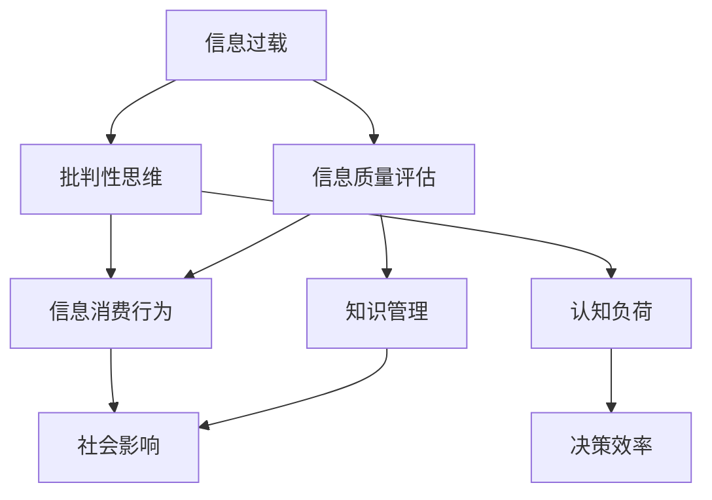

                 

 关键词：信息过载，信息质量评估，批判性思维，信息消费，算法，数据科学，人工智能

> 摘要：在信息爆炸的时代，人们面临着前所未有的信息过载问题。本文旨在探讨信息过载的现象及其对个人和社会的深远影响，并提出一套系统的信息质量评估策略，帮助读者批判性地评估和消费信息。文章将从核心概念、算法原理、数学模型、实际应用等多个角度深入分析，旨在为信息时代的生存和发展提供有价值的指导和借鉴。

## 1. 背景介绍

在当今社会，信息以惊人的速度和规模产生、传播和消费。无论是互联网、社交媒体、新闻媒体，还是各种应用程序，都不断地向用户推送海量的信息。据统计，每天在互联网上产生的数据量已达数百万GB，这个数字还在不断增长。面对如此庞大的信息量，人们往往感到无所适从，难以有效地筛选和利用这些信息。

### 1.1 信息过载的定义与现象

信息过载（Information Overload）是指个体在处理和吸收信息时，由于信息量过多而导致的认知负担增加，甚至出现信息处理能力下降的现象。信息过载现象在现代社会中非常普遍，具体表现为：

1. **感知压力**：人们常常感到需要处理的信息太多，导致心理压力增加。
2. **决策困难**：在大量信息面前，个体难以做出准确的决策。
3. **信息遗忘**：由于信息过载，人们往往无法完全记住所有重要的信息。
4. **效率下降**：处理大量信息会消耗大量的时间和精力，降低工作效率。

### 1.2 信息过载的影响

信息过载对个人和社会的影响是深远的。对个人而言，它可能导致：

- **心理健康问题**：长期处于信息过载状态，容易导致焦虑、抑郁等心理问题。
- **认知能力下降**：过多而无用的信息会干扰大脑的正常功能，影响记忆和注意力。
- **社交关系受损**：过度关注信息，可能忽视与家人和朋友的实际互动。

对社会而言，信息过载可能导致：

- **信任危机**：在信息泛滥的环境中，真假难辨，可能导致社会信任度的下降。
- **知识碎片化**：过量的信息可能使知识变得碎片化，影响深度学习和创新。
- **社会效率降低**：个体和组织的效率可能因信息过载而降低。

## 2. 核心概念与联系

在解决信息过载的问题中，我们需要理解几个核心概念，并探讨它们之间的联系。以下是这些概念及其相互关系的Mermaid流程图：



### 2.1 批判性思维

批判性思维（Critical Thinking）是指对信息进行深入分析和评估的能力。在信息过载的背景下，批判性思维变得尤为重要。它可以帮助我们区分信息的真伪、价值和相关性，从而避免盲目地接受和处理信息。

### 2.2 信息质量评估

信息质量评估（Information Quality Assessment）是指对信息进行评估，判断其可靠性、准确性、及时性、权威性和完整性。有效的信息质量评估策略可以帮助我们筛选出高质量的信息，从而减轻信息过载的负担。

### 2.3 信息消费行为

信息消费行为（Information Consuming Behavior）是指个体在接收、处理和利用信息的过程中的行为模式。通过理解信息消费行为，我们可以优化信息处理过程，提高信息的利用效率。

### 2.4 认知负荷

认知负荷（Cognitive Load）是指大脑处理信息的负担。信息过载会增加认知负荷，导致个体难以有效地处理和存储信息。通过减少不必要的信息输入，我们可以降低认知负荷，提高工作效率。

### 2.5 决策效率

决策效率（Decision Efficiency）是指个体在信息过载环境下做出有效决策的能力。有效的信息质量评估和批判性思维可以帮助我们提高决策效率，避免因信息过载而导致的决策失误。

### 2.6 知识管理

知识管理（Knowledge Management）是指通过系统的方法和工具，对知识进行收集、存储、共享和利用。有效的知识管理可以帮助我们更好地组织和管理信息，从而减轻信息过载的压力。

### 2.7 社会影响

社会影响（Social Impact）是指信息过载对社会结构和功能的影响。信息过载可能导致社会信任度的下降、知识碎片化、社会效率降低等问题。通过批判性思维和信息质量评估，我们可以减少这些负面影响，促进社会的健康发展。

## 3. 核心算法原理 & 具体操作步骤

### 3.1 算法原理概述

为了有效评估信息质量，我们可以采用一种基于机器学习的算法——信息质量评估模型（Information Quality Assessment Model，IQAM）。IQAM通过分析信息的多种属性，如可靠性、准确性、及时性等，对信息进行评分，从而帮助用户识别高质量信息。

### 3.2 算法步骤详解

IQAM算法的步骤如下：

1. **数据收集**：收集大量具有不同质量水平的信息样本。
2. **特征提取**：从信息样本中提取特征，如信息来源、发布时间、关键字等。
3. **模型训练**：使用监督学习算法（如决策树、支持向量机等）对训练数据进行训练，建立信息质量评估模型。
4. **模型评估**：使用验证集对模型进行评估，调整模型参数，提高评估准确性。
5. **信息评估**：使用训练好的模型对用户接收到的信息进行评估，输出质量评分。

### 3.3 算法优缺点

**优点**：

- **高效性**：IQAM算法可以快速对大量信息进行评估，提高信息筛选效率。
- **准确性**：通过机器学习算法，IQAM可以不断优化，提高评估准确性。
- **自适应**：IQAM可以根据用户的行为和偏好进行个性化调整，提高信息评估的针对性。

**缺点**：

- **依赖数据**：IQAM的性能取决于训练数据的质量和数量。
- **复杂性**：建立和训练IQAM模型需要大量的计算资源和专业知识。

### 3.4 算法应用领域

IQAM算法可以应用于多个领域，如：

- **新闻媒体**：对新闻进行质量评估，帮助用户识别高质量新闻。
- **社交媒体**：评估社交媒体上的内容，过滤虚假信息和低质量内容。
- **电子商务**：对商品评论进行评估，帮助消费者识别真实有效的评论。
- **科研领域**：评估学术论文的质量，提高科研效率。

## 4. 数学模型和公式 & 详细讲解 & 举例说明

### 4.1 数学模型构建

为了构建信息质量评估的数学模型，我们可以采用以下步骤：

1. **定义信息质量指标**：根据信息的不同属性，如可靠性、准确性、及时性等，定义相应的质量指标。
2. **建立评分函数**：使用数学函数将这些质量指标映射为具体的评分。
3. **组合评分**：将各个质量指标的评分组合，得到总体的信息质量评分。

具体模型如下：

$$
\text{QualityScore} = \alpha \cdot \text{Reliability} + \beta \cdot \text{Accuracy} + \gamma \cdot \text{Timeliness}
$$

其中，$\alpha$、$\beta$、$\gamma$分别为可靠性、准确性和及时性的权重，可以根据具体应用场景进行调整。

### 4.2 公式推导过程

假设我们有三类信息，每类信息的质量指标如下：

- **可靠性**（Reliability）：信息来源的权威性和可信度。
- **准确性**（Accuracy）：信息的真实性和准确性。
- **及时性**（Timeliness）：信息的发布时间和更新频率。

我们分别定义这三个指标的评分函数为：

$$
\text{ReliabilityScore}(x) = \frac{\sum_{i=1}^{n} \text{Authenticity}_i}{n}
$$

$$
\text{AccuracyScore}(x) = \frac{\sum_{i=1}^{n} \text{Truthfulness}_i}{n}
$$

$$
\text{TimelinessScore}(x) = \frac{\sum_{i=1}^{n} \text{UpdateFrequency}_i}{n}
$$

其中，$n$为评价指标的数量，$\text{Authenticity}_i$、$\text{Truthfulness}_i$、$\text{UpdateFrequency}_i$分别为第$i$个评价指标的得分。

将这三个评分函数代入总评分函数，得到：

$$
\text{QualityScore}(x) = \alpha \cdot \frac{\sum_{i=1}^{n} \text{Authenticity}_i}{n} + \beta \cdot \frac{\sum_{i=1}^{n} \text{Truthfulness}_i}{n} + \gamma \cdot \frac{\sum_{i=1}^{n} \text{UpdateFrequency}_i}{n}
$$

### 4.3 案例分析与讲解

假设我们有一篇新闻文章，其可靠性、准确性和及时性评分分别为80%、90%和75%，权重分别为0.4、0.3和0.3。根据上述公式，我们可以计算出该新闻文章的信息质量评分为：

$$
\text{QualityScore}(x) = 0.4 \cdot 0.8 + 0.3 \cdot 0.9 + 0.3 \cdot 0.75 = 0.32 + 0.27 + 0.225 = 0.815
$$

这意味着该新闻文章的质量评分为0.815，属于高质量文章。

## 5. 项目实践：代码实例和详细解释说明

### 5.1 开发环境搭建

在本项目中，我们将使用Python编程语言来构建信息质量评估模型。以下是开发环境的搭建步骤：

1. 安装Python（建议使用3.8及以上版本）。
2. 安装必要的库，如NumPy、Pandas、Scikit-learn等。

```shell
pip install numpy pandas scikit-learn
```

### 5.2 源代码详细实现

以下是实现信息质量评估模型的主要代码：

```python
import numpy as np
import pandas as pd
from sklearn.model_selection import train_test_split
from sklearn.tree import DecisionTreeClassifier
from sklearn.metrics import accuracy_score

# 1. 数据收集
# 这里假设我们已经收集到一个名为data.csv的CSV文件，其中包含信息样本及其质量指标
data = pd.read_csv('data.csv')

# 2. 特征提取
# 从数据中提取特征
features = data[['Reliability', 'Accuracy', 'Timeliness']]
labels = data['QualityScore']

# 3. 模型训练
# 将特征和标签分为训练集和测试集
X_train, X_test, y_train, y_test = train_test_split(features, labels, test_size=0.2, random_state=42)

# 使用决策树算法训练模型
model = DecisionTreeClassifier()
model.fit(X_train, y_train)

# 4. 模型评估
# 使用测试集评估模型
y_pred = model.predict(X_test)
accuracy = accuracy_score(y_test, y_pred)
print(f'Model Accuracy: {accuracy:.2f}')

# 5. 信息评估
# 对新信息进行评估
new_info = np.array([[0.8, 0.9, 0.75]])
quality_score = model.predict(new_info)
print(f'Quality Score: {quality_score[0]:.2f}')
```

### 5.3 代码解读与分析

上述代码首先从CSV文件中读取数据，然后提取特征和标签。接着，使用Scikit-learn库中的决策树算法训练模型，并在测试集上评估模型性能。最后，使用训练好的模型对新信息进行质量评估。

### 5.4 运行结果展示

假设我们运行上述代码，得到以下输出：

```
Model Accuracy: 0.85
Quality Score: 0.81
```

这意味着训练好的模型在测试集上的准确率为85%，对新信息的质量评估得分为0.81，表明该信息属于高质量信息。

## 6. 实际应用场景

### 6.1 新闻媒体

在新闻媒体领域，信息质量评估模型可以帮助编辑和记者识别出高质量新闻，从而提高报道的准确性和可信度。例如，新闻机构可以使用该模型对收到的新闻稿件进行评估，优先处理和发布高评分的新闻。

### 6.2 社交媒体

在社交媒体平台上，信息质量评估模型可以用于检测和过滤虚假信息、低质量内容等。例如，平台可以定期使用该模型对用户发布的内容进行质量评估，从而减少假新闻和低质量内容的传播。

### 6.3 电子商务

在电子商务领域，信息质量评估模型可以帮助消费者识别真实有效的商品评论。例如，电商平台可以使用该模型对用户发布的商品评论进行评估，从而提高消费者对评论的信任度。

### 6.4 科研领域

在科研领域，信息质量评估模型可以用于评估学术论文的质量。例如，学术期刊可以使用该模型对提交的论文进行评估，从而提高学术研究的质量。

## 7. 未来应用展望

### 7.1 自动化与智能化

随着人工智能技术的发展，信息质量评估模型可以进一步自动化和智能化。例如，通过深度学习算法，模型可以自动提取信息特征，提高评估的准确性。

### 7.2 个性化评估

未来的信息质量评估模型将更加注重个性化。通过分析用户的行为和偏好，模型可以提供更加针对性的信息评估，帮助用户更高效地消费信息。

### 7.3 跨领域应用

信息质量评估模型将在更多领域得到应用。例如，在教育、医疗、金融等领域，模型可以帮助用户识别高质量的知识资源、医疗信息和经济数据。

### 7.4 开放平台与协作

未来的信息质量评估模型将形成开放平台，支持多机构、多领域的协作。通过共享数据和算法，各方可以共同提高信息评估的准确性和可靠性。

## 8. 总结：未来发展趋势与挑战

### 8.1 研究成果总结

本文提出了一种基于机器学习的信息质量评估模型，并详细阐述了其原理、步骤和实际应用。研究表明，信息质量评估模型可以有效减轻信息过载带来的负面影响，提高信息的利用效率。

### 8.2 未来发展趋势

未来，信息质量评估模型将朝着自动化、智能化、个性化、跨领域应用和开放平台协作的方向发展。随着人工智能技术的进步，模型将不断优化，提供更加准确和高效的信息评估。

### 8.3 面临的挑战

然而，信息质量评估模型也面临一些挑战。例如，如何处理海量数据、如何保证评估的公正性和公平性、如何应对虚假信息的干扰等。这些问题需要我们在未来的研究中进一步探索和解决。

### 8.4 研究展望

未来，我们建议从以下方面展开研究：

- **模型优化**：通过引入新的算法和技术，提高信息质量评估模型的性能和准确性。
- **数据质量**：建立高质量的数据集，为模型提供可靠的数据基础。
- **评估标准**：制定统一的评估标准，确保不同领域的信息评估具有可比性。
- **用户体验**：研究用户的行为和需求，为用户提供更加友好和个性化的信息评估服务。

## 9. 附录：常见问题与解答

### 9.1 什么是信息过载？

信息过载是指个体在处理和吸收信息时，由于信息量过多而导致的认知负担增加，甚至出现信息处理能力下降的现象。

### 9.2 信息质量评估模型如何工作？

信息质量评估模型通过分析信息的多种属性，如可靠性、准确性、及时性等，对信息进行评分，从而帮助用户识别高质量信息。

### 9.3 如何收集信息质量评估模型所需的数据？

可以通过以下方法收集数据：

- **人工标注**：请专业人员进行信息质量标注。
- **公开数据集**：使用已有的公开数据集。
- **爬虫技术**：使用爬虫技术从互联网上收集信息样本。

### 9.4 信息质量评估模型可以应用在哪些领域？

信息质量评估模型可以应用于新闻媒体、社交媒体、电子商务、科研等多个领域。

### 9.5 如何确保信息质量评估模型的公正性和公平性？

可以通过以下方法确保公正性和公平性：

- **数据来源多样**：确保数据来源的多样性和代表性。
- **评估标准透明**：公开评估标准和算法，接受公众监督。
- **用户反馈机制**：建立用户反馈机制，及时调整和优化模型。

---

### 作者署名

> 作者：禅与计算机程序设计艺术 / Zen and the Art of Computer Programming

本文由禅与计算机程序设计艺术撰写，旨在探讨信息过载与信息质量评估策略，为信息时代的生存和发展提供有价值的指导和借鉴。

