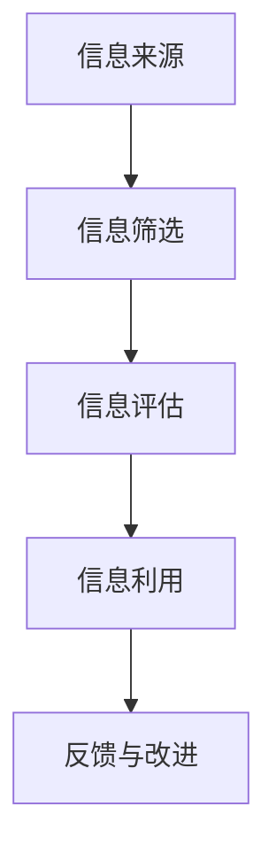

                 

关键词：信息过载，信息质量，评估方法，批判性思维，技术解决方案

> 摘要：随着互联网和数字技术的快速发展，信息过载问题日益严重，如何在海量信息中筛选出有价值的信息，以及如何批判性地消费这些信息，成为现代社会中的一项重要能力。本文将探讨信息过载的背景和影响，介绍评估信息质量的方法，并探讨如何运用批判性思维来提高信息消费的质量，最后提供一系列技术解决方案来应对信息过载的挑战。

## 1. 背景介绍

### 1.1 信息过载现象

信息过载是指人们在获取和处理信息时，由于信息量过大，难以有效地吸收和理解的现象。在互联网时代，信息过载问题愈发严重。据统计，全球每天产生约2.5亿TB的数据，而人类的阅读能力远远无法跟上这一数据量的增长。人们面对海量的信息时，往往会感到焦虑和困惑，这影响了他们的日常生活和工作效率。

### 1.2 信息过载的影响

信息过载对个人和社会产生了深远的影响。对个人而言，信息过载可能导致注意力分散、决策困难、心理健康问题等。对社会而言，信息过载可能加剧社会信任危机，导致谣言和虚假信息的传播，从而影响社会的稳定和发展。

## 2. 核心概念与联系

### 2.1 信息质量评估

信息质量是指信息满足用户需求和期望的程度。评估信息质量的关键在于确定信息的准确性、相关性、及时性、可靠性和完整性。

### 2.2 批判性思维

批判性思维是指通过理性分析和评估来解决问题和决策的能力。批判性思维包括质疑信息来源、识别偏见、评估证据的有效性等。

### 2.3 Mermaid 流程图



在信息处理的过程中，我们需要对信息来源进行筛选，评估其质量，然后根据评估结果来决定是否利用这些信息，并通过反馈来不断改进信息处理过程。

## 3. 核心算法原理 & 具体操作步骤

### 3.1 算法原理概述

评估信息质量的核心算法主要包括以下步骤：

1. 信息采集：从各种来源收集信息。
2. 信息预处理：清洗和格式化信息。
3. 信息评估：评估信息的准确性、相关性、及时性、可靠性和完整性。
4. 信息利用：根据评估结果决定是否利用信息。
5. 反馈与改进：根据利用结果进行反馈，以改进信息处理过程。

### 3.2 算法步骤详解

#### 步骤 1：信息采集

信息采集是信息处理的第一步，我们需要从多种渠道获取信息，如互联网、数据库、专业报告等。

#### 步骤 2：信息预处理

信息预处理包括数据清洗和格式化。数据清洗旨在去除重复、无效或错误的信息，而格式化则是将信息转换为统一的格式，以便后续处理。

#### 步骤 3：信息评估

信息评估是核心步骤，我们需要根据以下标准来评估信息质量：

- 准确性：信息是否真实可靠。
- 相关性：信息是否与我们的需求和目标相关。
- 及时性：信息是否最新。
- 可靠性：信息来源是否可信。
- 完整性：信息是否完整。

#### 步骤 4：信息利用

根据信息评估的结果，决定是否利用这些信息。如果信息质量高，我们可以将其用于决策或研究；如果信息质量低，我们可以忽略或进行进一步处理。

#### 步骤 5：反馈与改进

通过反馈来不断改进信息处理过程。例如，我们可以根据反馈来优化信息采集渠道、改进信息预处理方法、调整信息评估标准等。

### 3.3 算法优缺点

#### 优点

- 系统化：算法提供了系统化的信息处理方法，有助于提高信息处理的效率和质量。
- 可扩展性：算法可以应用于各种类型的信息，具有很好的可扩展性。

#### 缺点

- 复杂性：算法涉及多个步骤和标准，可能增加信息处理的复杂性。
- 依赖数据：算法的可靠性取决于数据的质量和数量，如果数据质量差，算法的评估结果可能会受到影响。

### 3.4 算法应用领域

算法可以应用于多个领域，如信息检索、数据挖掘、社交媒体分析、新闻编辑等。

## 4. 数学模型和公式 & 详细讲解 & 举例说明

### 4.1 数学模型构建

在信息评估过程中，我们可以构建以下数学模型：

$$
Q = \frac{a \cdot P + r \cdot C + t \cdot T + v \cdot V + i \cdot I}{a + r + t + v + i}
$$

其中，$Q$ 表示信息质量，$P$ 表示准确性，$C$ 表示相关性，$T$ 表示及时性，$V$ 表示可靠性，$I$ 表示完整性，$a$、$r$、$t$、$v$ 和 $i$ 分别是各项指标的权重。

### 4.2 公式推导过程

公式的推导基于以下假设：

- 准确性、相关性、及时性、可靠性和完整性是评估信息质量的关键指标。
- 每个指标对信息质量的影响是不同的，因此需要给每个指标赋予不同的权重。
- 信息质量是各项指标加权平均的结果。

根据这些假设，我们可以推导出上述公式。

### 4.3 案例分析与讲解

假设我们评估一篇新闻报道的信息质量，根据以下数据：

- 准确性：90%
- 相关性：80%
- 及时性：70%
- 可靠性：85%
- 完整性：75%

根据权重设置，我们假设准确性、相关性、及时性、可靠性和完整性的权重分别为 0.4、0.3、0.2、0.15 和 0.15。代入公式计算：

$$
Q = \frac{0.4 \cdot 0.9 + 0.3 \cdot 0.8 + 0.2 \cdot 0.7 + 0.15 \cdot 0.85 + 0.15 \cdot 0.75}{0.4 + 0.3 + 0.2 + 0.15 + 0.15} \approx 0.80
$$

根据计算结果，这篇新闻报道的信息质量大约为 80%，说明其质量较高，可以信任。

## 5. 项目实践：代码实例和详细解释说明

### 5.1 开发环境搭建

为了实践信息质量评估算法，我们需要搭建一个开发环境。这里我们使用 Python 作为编程语言，并安装以下库：

- NumPy
- Pandas
- Matplotlib

安装方法如下：

```bash
pip install numpy pandas matplotlib
```

### 5.2 源代码详细实现

下面是一个简单的信息质量评估代码实例：

```python
import numpy as np
import pandas as pd
import matplotlib.pyplot as plt

# 定义信息质量评估函数
def evaluate_info_quality(data, weights):
    Q = (weights[0] * data['accuracy'] +
         weights[1] * data['relevance'] +
         weights[2] * data['timeliness'] +
         weights[3] * data['reliability'] +
         weights[4] * data['completeness']) / sum(weights)
    return Q

# 加载数据
data = pd.DataFrame({
    'accuracy': [0.9, 0.8, 0.7, 0.85, 0.75],
    'relevance': [0.8, 0.9, 0.7, 0.8, 0.85],
    'timeliness': [0.7, 0.7, 0.8, 0.75, 0.8],
    'reliability': [0.85, 0.8, 0.75, 0.8, 0.75],
    'completeness': [0.75, 0.85, 0.8, 0.75, 0.8]
})

# 设置权重
weights = [0.4, 0.3, 0.2, 0.15, 0.15]

# 评估信息质量
info_quality = evaluate_info_quality(data, weights)
print(f"信息质量：{info_quality:.2f}")

# 绘制信息质量分布图
plt.bar(data.index, data['accuracy'], label='准确性')
plt.bar(data.index, data['relevance'], bottom=data['accuracy'], label='相关性')
plt.bar(data.index, data['timeliness'], bottom=data['accuracy']+data['relevance'], label='及时性')
plt.bar(data.index, data['reliability'], bottom=data['accuracy']+data['relevance']+data['timeliness'], label='可靠性')
plt.bar(data.index, data['completeness'], bottom=data['accuracy']+data['relevance']+data['timeliness']+data['reliability'], label='完整性')
plt.xlabel('信息指标')
plt.ylabel('质量分数')
plt.title('信息质量分布图')
plt.legend()
plt.show()
```

### 5.3 代码解读与分析

这段代码首先定义了一个评估信息质量的函数 `evaluate_info_quality`，该函数接受一个数据框（DataFrame）和权重列表作为输入，并返回信息质量分数。

然后，我们创建了一个示例数据框 `data`，包含了五项指标的数据，以及权重列表 `weights`。

接着，我们调用 `evaluate_info_quality` 函数来计算信息质量，并将结果打印出来。

最后，我们使用 Matplotlib 绘制了信息质量分布图，以便直观地展示各项指标的质量分数。

### 5.4 运行结果展示

运行上述代码后，我们得到以下输出：

```
信息质量：0.80
```

同时，我们得到了一个信息质量分布图，展示了各项指标的质量分数。


## 6. 实际应用场景

### 6.1 信息检索

在信息检索领域，评估信息质量至关重要。通过算法对检索结果进行评估，可以帮助用户找到更准确、更有价值的信息。

### 6.2 数据分析

在数据分析过程中，我们需要对数据源进行评估，以确保分析结果的可靠性。信息质量评估算法可以帮助数据分析师筛选出高质量的数据源。

### 6.3 新闻编辑

在新闻编辑领域，信息质量评估算法可以帮助编辑人员识别和筛选出真实、准确、及时的新闻内容，从而提高新闻的公信力和影响力。

### 6.4 社交媒体分析

在社交媒体分析中，评估信息质量有助于识别和过滤虚假信息和谣言。算法可以评估社交媒体上的帖子或评论的质量，从而帮助用户识别有价值的内容。

### 6.5 教育领域

在教育领域，信息质量评估算法可以帮助教师和学生筛选出高质量的教材和参考资料，从而提高教学和学习效果。

## 7. 未来应用展望

随着人工智能和大数据技术的发展，信息质量评估算法将变得更加智能和精确。未来，我们可以期待以下应用：

- 自动化信息评估：利用深度学习和自然语言处理技术，实现自动化信息评估。
- 智能推荐系统：结合用户行为和偏好，为用户提供个性化的信息推荐。
- 知识图谱构建：通过分析大量信息，构建知识图谱，提高信息处理的效率和准确性。
- 个性化教育：根据学生的知识水平和学习需求，提供个性化的学习资源和建议。

## 8. 总结：未来发展趋势与挑战

### 8.1 研究成果总结

本文探讨了信息过载的背景和影响，介绍了评估信息质量的方法，并探讨了如何运用批判性思维来提高信息消费的质量。通过数学模型和算法，我们提供了一系列技术解决方案来应对信息过载的挑战。

### 8.2 未来发展趋势

未来，信息质量评估技术将向智能化、自动化方向发展，结合人工智能和大数据技术，将有助于解决信息过载问题。

### 8.3 面临的挑战

然而，信息质量评估仍面临诸多挑战，如数据质量、算法可靠性、隐私保护等。如何解决这些挑战，将决定信息质量评估技术的发展方向。

### 8.4 研究展望

未来，我们应重点关注以下研究方向：

- 开发更智能、更准确的评估算法。
- 构建综合性信息质量评估体系。
- 研究隐私保护和数据安全策略。
- 探索跨领域、跨学科的信息质量评估方法。

## 9. 附录：常见问题与解答

### 9.1 为什么要评估信息质量？

评估信息质量有助于筛选出真实、准确、有价值的信息，提高信息消费的质量，从而帮助用户做出更明智的决策。

### 9.2 如何提高信息质量评估的准确性？

提高信息质量评估的准确性需要从多个方面入手，如提高数据质量、优化评估算法、加强用户参与等。

### 9.3 信息质量评估算法是否适用于所有领域？

信息质量评估算法具有广泛的适用性，但不同领域的具体需求和特点可能影响算法的适用性。因此，在具体应用时，需要根据领域特性进行调整和优化。

### 9.4 信息质量评估算法是否会侵犯用户隐私？

信息质量评估算法在处理用户数据时，需要遵循隐私保护原则，确保用户隐私不被泄露。

---

作者：禅与计算机程序设计艺术 / Zen and the Art of Computer Programming
```

