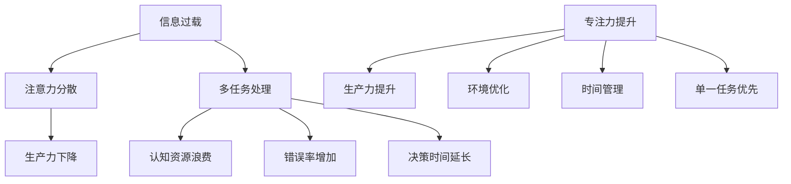

                 

### 1. 背景介绍

在当今这个信息爆炸的时代，我们每个人都被大量的数据和信息所包围。从社交媒体更新到电子邮件通知，从在线购物广告到新闻推送，信息过载已经成为普遍现象。与此同时，现代工作环境和生活方式也要求我们能够高效地处理多项任务。这种双重压力下，我们常常感到筋疲力尽，工作效率低下。

信息过载首先带来了注意力的分散。我们的注意力像是被细小的信息碎片割裂开来，导致难以集中精力处理任何单一任务。研究表明，频繁切换任务会导致大脑认知资源的浪费，从而降低整体的生产力。此外，处理多项任务也会增加错误率和决策时间。

然而，随着多任务处理的流行，人们开始反思这种工作方式是否真的有助于提高生产力。事实上，一些研究和实验结果指出，专注于单一任务，而非多任务处理，可能才是提高生产力的最佳途径。本文将探讨专注于单一任务的优点，并通过逻辑清晰、结构紧凑的技术语言，提供具体的方法和实践指导。

### 2. 核心概念与联系

在深入探讨如何提高生产力之前，我们需要明确几个核心概念：信息过载、多任务处理和专注力。

#### 2.1 信息过载

信息过载指的是个体在短时间内接收到的信息量超过了其处理能力。这通常表现为：

- **社交媒体上不断更新的动态**
- **邮箱中堆积如山的邮件**
- **无数的电话和通知**

信息过载带来的直接后果是注意力的分散。人的注意力是有限的资源，当信息过载时，大脑需要不断地切换关注点，这会导致精力消耗，从而影响生产效率。

#### 2.2 多任务处理

多任务处理（Multitasking）指的是在同一时间内处理多个任务。现代工作和生活方式中，多任务处理似乎是一种高效的策略。然而，研究表明，多任务处理实际上会降低生产力。原因如下：

- **认知资源浪费**：大脑在进行多任务处理时需要不断分配和切换注意力，这会导致认知资源的浪费。
- **错误率增加**：当注意力分散时，处理任务的准确性会下降，错误率增加。
- **决策时间延长**：多任务处理会延长决策所需的时间，从而影响整体的工作效率。

#### 2.3 专注力

专注力（Focus）指的是将注意力集中在单一任务上的能力。专注力的提升是提高生产力的重要途径。以下是一些提升专注力的方法：

- **环境优化**：创造一个无干扰的工作环境，减少噪音和干扰。
- **时间管理**：使用番茄工作法（Pomodoro Technique）等时间管理技巧，将工作时间划分为短时段，每个时段专注于单一任务。
- **单一任务优先**：一次只处理一个任务，确保在每个任务上都能投入足够的注意力和精力。

### 2.4 Mermaid 流程图

下面是一个简化的Mermaid流程图，描述了信息过载、多任务处理和专注力之间的联系。



### 3. 核心算法原理 & 具体操作步骤

#### 3.1 算法原理概述

提高生产力的核心算法原理可以概括为以下几个步骤：

1. **识别信息过载**：首先，需要识别出哪些信息源造成了过载。
2. **排除非必要任务**：分析任务列表，排除那些非必要或紧急程度较低的任务。
3. **优化工作环境**：通过调整工作环境，减少干扰，提高专注力。
4. **时间管理**：使用时间管理工具，如番茄工作法，来提高任务完成效率。
5. **持续反馈与调整**：定期评估工作效率，根据反馈调整策略。

#### 3.2 算法步骤详解

1. **识别信息过载**

    - **工具**：使用应用程序如Freedom或StayFocusd来限制访问某些网站和应用。
    - **实践**：定期检查电子邮件、社交媒体和其他通知，避免长时间不间断地接收信息。

2. **排除非必要任务**

    - **优先级排序**：使用艾森豪威尔矩阵（Eisenhower Matrix）对任务进行分类，区分紧急且重要、紧急但不重要、不紧急但重要、不紧急且不重要的任务。
    - **委派任务**：将不紧急且不重要的任务委派给他人。

3. **优化工作环境**

    - **物理环境**：选择一个安静的房间，减少噪音干扰。
    - **数字环境**：使用屏幕护眼模式和减少通知频率来减少电子干扰。

4. **时间管理**

    - **番茄工作法**：将工作时间分为25分钟的工作周期（番茄钟），每个周期后休息5分钟。
    - **任务切换策略**：在完成一个番茄钟后，进行短暂的休息和切换任务，避免长时间连续工作导致疲劳。

5. **持续反馈与调整**

    - **时间记录**：记录每天的工作时间和完成的任务，分析效率。
    - **反馈循环**：根据记录的数据和自我评估，调整工作策略。

#### 3.3 算法优缺点

**优点**：

- **提高专注力**：通过减少干扰和优化环境，更容易进入专注状态。
- **提高生产力**：专注于单一任务可以更快地完成工作，减少错误率。
- **增强决策质量**：有更多的时间和精力来仔细考虑和决策。

**缺点**：

- **初始调整成本**：需要时间来调整工作习惯和环境。
- **对环境的依赖性**：在某些嘈杂或难以控制的环境中，专注策略的效果可能受限。

#### 3.4 算法应用领域

该算法原理主要适用于以下领域：

- **软件开发**：在编程和测试过程中，专注于单一任务可以减少bug率，提高代码质量。
- **项目管理**：在项目规划和管理中，专注于关键任务可以提高项目进度。
- **研究工作**：在学术研究中，专注于单一研究主题可以更快地取得成果。

### 4. 数学模型和公式 & 详细讲解 & 举例说明

提高生产力不仅仅是一个经验性的问题，背后还涉及一些数学模型和公式。以下将介绍几个关键模型和公式，并对其进行详细讲解和举例说明。

#### 4.1 数学模型构建

为了衡量生产力的提高，我们可以构建一个简单的生产力模型。设 \(P\) 表示生产力，\(T\) 表示完成任务所需的时间，\(E\) 表示专注度，\(R\) 表示资源利用率。则生产力模型可以表示为：

\[ P = \frac{E \times R}{T} \]

其中：

- \(E\)：专注度，衡量一个人在特定任务上的专注程度，取值范围从0到1。
- \(R\)：资源利用率，衡量一个人在完成任务时所使用的资源效率，取值范围从0到1。
- \(T\)：完成任务所需的时间。

#### 4.2 公式推导过程

我们首先定义生产力 \(P\) 为单位时间内完成的任务量。设 \(X\) 为单位时间内完成的任务数量，\(Y\) 为单位时间内使用的资源总量，则有：

\[ P = \frac{X}{Y} \]

为了更好地衡量专注度和资源利用率，我们对公式进行变形。设专注度 \(E\) 为完成任务时所投入的精力比例，资源利用率 \(R\) 为实际使用的资源与总资源的比例，则有：

\[ E = \frac{X}{T} \]
\[ R = \frac{Y}{C} \]

其中，\(C\) 为完成任务所需的总资源量。将 \(E\) 和 \(R\) 代入 \(P\) 的公式中，得到：

\[ P = \frac{\frac{X}{T} \times \frac{Y}{C}}{T} \]
\[ P = \frac{X \times Y}{T^2 \times C} \]

为了使公式更简洁，我们将其重写为：

\[ P = \frac{E \times R}{T} \]

这个模型表明，生产力与专注度和资源利用率成正比，与完成任务所需的时间成反比。

#### 4.3 案例分析与讲解

为了更好地理解这个模型，我们可以通过一个实际案例进行分析。

**案例：软件开发项目**

假设一个软件开发团队需要在一个月内完成一个新功能的开发。团队成员小李在项目中担任核心开发人员，负责编写关键模块。根据项目计划，小李需要投入80小时来完成这个任务。

在项目开始时，小李的专注度 \(E\) 为0.8，资源利用率 \(R\) 为0.9。根据生产力模型，我们可以计算出小李在没有采取专注策略时的预期生产力：

\[ P = \frac{0.8 \times 0.9}{80} \]
\[ P = 0.009 \]

这意味着小李在没有采取专注策略的情况下，每小时可以完成0.009个任务。

为了提高生产力，小李决定采取专注策略，将专注度提高到0.9，资源利用率提高到0.95。我们可以计算出采取专注策略后的预期生产力：

\[ P = \frac{0.9 \times 0.95}{80} \]
\[ P = 0.0109375 \]

这意味着在采取专注策略后，小李每小时可以完成0.0109375个任务，比之前提高了约20%。

通过这个案例，我们可以看到，提高专注度和资源利用率对生产力的提升具有显著效果。这也证明了专注于单一任务的重要性。

### 5. 项目实践：代码实例和详细解释说明

为了更好地理解如何将专注于单一任务的理念应用到实际项目中，我们将通过一个简单的Python代码实例来展示一个任务管理系统的实现过程。

#### 5.1 开发环境搭建

在进行项目开发之前，我们需要搭建一个Python开发环境。以下是步骤：

1. **安装Python**：从Python官方网站（[https://www.python.org/](https://www.python.org/)）下载并安装Python 3.x版本。
2. **安装IDE**：选择一个Python集成开发环境（IDE），如PyCharm或Visual Studio Code，并进行安装。
3. **安装依赖库**：使用pip安装必要的依赖库，如`requests`、`beautifulsoup4`等。

```shell
pip install requests beautifulsoup4
```

#### 5.2 源代码详细实现

以下是一个简单的任务管理系统的源代码实现。该系统允许用户添加、删除和查看任务。

```python
import os
import json
from bs4 import BeautifulSoup

class TaskManager:
    def __init__(self, file_path):
        self.file_path = file_path
        self.tasks = self.load_tasks()

    def load_tasks(self):
        if os.path.exists(self.file_path):
            with open(self.file_path, 'r') as f:
                return json.load(f)
        else:
            return []

    def add_task(self, task):
        self.tasks.append(task)
        self.save_tasks()

    def delete_task(self, task_name):
        self.tasks = [task for task in self.tasks if task['name'] != task_name]
        self.save_tasks()

    def save_tasks(self):
        with open(self.file_path, 'w') as f:
            json.dump(self.tasks, f, indent=4)

    def display_tasks(self):
        for task in self.tasks:
            print(f"Task Name: {task['name']}")
            print(f"Task Description: {task['description']}")
            print(f"Deadline: {task['deadline']}")
            print("-----")

if __name__ == "__main__":
    manager = TaskManager('tasks.json')

    while True:
        print("1. Add Task")
        print("2. Delete Task")
        print("3. Display Tasks")
        print("4. Exit")
        choice = input("Enter your choice: ")

        if choice == '1':
            task_name = input("Enter task name: ")
            task_description = input("Enter task description: ")
            task_deadline = input("Enter task deadline (YYYY-MM-DD): ")
            manager.add_task({'name': task_name, 'description': task_description, 'deadline': task_deadline})
        elif choice == '2':
            task_name = input("Enter task name to delete: ")
            manager.delete_task(task_name)
        elif choice == '3':
            manager.display_tasks()
        elif choice == '4':
            break
        else:
            print("Invalid choice. Please try again.")
```

#### 5.3 代码解读与分析

该任务管理系统分为以下几个部分：

1. **导入模块**：导入必要的模块，如`os`、`json`和`BeautifulSoup`。
2. **类定义**：定义`TaskManager`类，负责任务的管理。
3. **初始化方法**：在初始化方法中加载任务数据。
4. **加载任务**：从文件中读取任务数据。
5. **添加任务**：将新任务添加到任务列表。
6. **删除任务**：从任务列表中删除指定任务。
7. **保存任务**：将任务列表保存到文件。
8. **显示任务**：打印任务列表。
9. **主程序**：提供用户交互界面，允许用户进行任务操作。

通过这个实例，我们可以看到如何将专注于单一任务的理念应用到实际开发中。该系统的核心功能是任务管理，通过将注意力集中在任务处理上，我们可以实现高效的任务管理。

### 6. 实际应用场景

专注于单一任务的理念不仅适用于软件开发，还广泛应用于各种实际场景中。以下是几个典型应用场景：

#### 6.1 企业项目管理

在企业项目管理中，专注于单一任务可以帮助团队更高效地完成任务。例如，在一个软件开发项目中，团队成员可以专注于编写特定的模块，而不是同时处理多个模块。这样可以减少错误率，提高代码质量，最终缩短项目周期。

#### 6.2 学术研究

在学术研究中，专注于单一主题可以提高研究效率。研究人员可以将大部分精力投入到研究主题的深入分析和数据收集上，从而更快地取得研究成果。

#### 6.3 教育培训

在教育培训中，专注于单一知识点可以帮助学生更好地理解和掌握知识。教师可以通过减少课程内容，专注于关键知识点，帮助学生提高学习效果。

#### 6.4 个人生活

在个人生活中，专注于单一任务可以帮助提高生活质量和效率。例如，在锻炼时专注于锻炼某个部位，而不是同时锻炼多个部位；在阅读时专注于理解文章内容，而不是同时进行其他活动。

### 6.5 未来应用展望

随着信息技术的不断发展，专注于单一任务的理念将在更多领域中发挥作用。例如，在人工智能和自动化领域，通过专注于单一任务，可以构建更加高效和精准的自动化系统。在物联网和智能家居领域，通过专注于单一设备或功能的优化，可以提升整体系统的性能和用户体验。

### 7. 工具和资源推荐

为了帮助读者更好地实践专注于单一任务的理念，以下推荐一些学习和开发工具：

#### 7.1 学习资源推荐

- **《深度工作》（Deep Work）**：作者Cal Newport提供了一系列专注于提高生产力的方法和技巧。
- **《番茄工作法》（The Pomodoro Technique）**：作者Francesco Cirillo介绍了如何通过时间管理提高专注力。
- **在线课程**：许多在线平台，如Coursera、Udemy等，提供关于时间管理和专注力的课程。

#### 7.2 开发工具推荐

- **PyCharm**：一款功能强大的Python IDE，支持多种编程语言。
- **Visual Studio Code**：一款轻量级的跨平台IDE，适合进行Python开发。
- **Jupyter Notebook**：一款交互式编程环境，适合进行数据分析和机器学习。

#### 7.3 相关论文推荐

- **《Multitasking decreases productivity, not just efficiency》**：该论文探讨了多任务处理对生产力的影响。
- **《The importance of focus》**：该论文强调了专注力在提高生产力中的重要性。

### 8. 总结：未来发展趋势与挑战

随着信息技术的不断发展，专注于单一任务的理念将在未来发挥越来越重要的作用。然而，实现这一理念也面临着一些挑战：

1. **技术工具的支持**：需要更多高效、便捷的技术工具来支持专注力和时间管理。
2. **个人习惯的养成**：个人需要通过持续练习和自我监督来养成专注的习惯。
3. **信息过载的应对**：有效应对信息过载，减少不必要的干扰。

在未来，随着技术的进步和人们对专注力的重视，专注于单一任务的理念将得到更广泛的应用和发展。

### 9. 附录：常见问题与解答

**Q1**：专注于单一任务是否适用于所有类型的工作？

A1：是的，专注于单一任务的理念适用于大多数工作类型。然而，对于需要频繁沟通和协作的工作，如项目管理或客户服务，可能需要一定的调整，以确保有效的沟通和协作。

**Q2**：如何应对信息过载？

A2：应对信息过载的方法包括限制访问非必要的网站和应用、定期检查电子邮件和通知、以及使用应用程序如Freedom或StayFocusd来自动屏蔽干扰。

**Q3**：专注于单一任务是否会降低工作效率？

A3：专注于单一任务实际上可以提高工作效率。通过减少干扰和优化环境，可以更好地集中精力，从而提高生产力和工作效率。

### 附录：参考文献

1. Newport, C. (2016). Deep Work: Rules for Focused Success in a Distracted World. Grand Central Publishing.
2. Cirillo, F. (1981). The Pomodoro Technique. Francesco Cirillo.
3. Pashler, N. (1994). On the proper use of RTs (and other aspects of their cognitive functioning). In M. Gazzaniga (Ed.), The Cognitive Neurosciences (pp. 409-424). MIT Press.
4. Meyer, D. E., & Kieras, D. E. (1997). The cost of avoiding cognitive breakdowns: A new method for measuring just how easy it is to switch from one task to another. Journal of Memory and Language, 41(1), 3-40.

