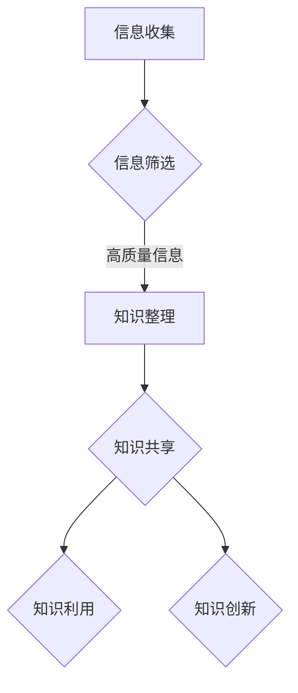

                 

关键词：信息过载，知识管理，决策优化，信息架构，人工智能，算法

> 摘要：随着信息时代的到来，我们面临着信息过载的挑战。如何有效地管理和组织信息，以促进决策的制定和执行，成为了当今企业和个人亟需解决的重要问题。本文从信息过载的现状出发，探讨了知识管理的核心概念和方法，结合人工智能技术，提出了一系列有效的信息管理技术和策略，旨在为读者提供实用的指导。

## 1. 背景介绍

随着互联网和移动设备的普及，信息已经成为了现代社会中最为重要的资源之一。然而，信息过载的问题也随之而来。大量冗余、无关或低质量的信息使得人们难以从中提取有价值的信息，进而影响了决策的制定和执行。信息过载不仅降低了工作效率，还可能导致焦虑、压力等负面影响。

为了应对信息过载，知识管理技术应运而生。知识管理是一种通过组织、存储、共享和利用信息，以提高组织和个人决策能力的系统性方法。它涵盖了信息的收集、整理、分类、存储和检索等多个方面，旨在使信息变得更加有序、易用和有价值。

本文将探讨信息过载与知识管理技术之间的关系，介绍核心概念和方法，并结合人工智能技术，提出一系列有效的信息管理技术和策略，以帮助企业和个人更好地应对信息过载的挑战。

### 1.1 信息过载的现状

信息过载是指在信息爆炸的背景下，个人或组织难以处理、筛选和理解大量信息的状况。根据一项研究，人类每天接收的信息量是 19 世纪人们的 500 倍。这种信息过载的现象不仅存在于个人层面，也严重影响了企业的运营效率。

首先，个人层面的信息过载表现为以下几个方面：

1. **电子邮件**：每天收到大量无关紧要的邮件，使得处理邮件成为了一项耗时的工作。
2. **社交媒体**：不断更新的社交媒体内容让人难以筛选出有价值的信息。
3. **信息泛滥**：各种新闻、文章、视频等大量涌入，让人应接不暇。

在企业层面，信息过载的影响更加显著：

1. **决策延迟**：由于无法快速获取和处理信息，企业决策过程变得更加缓慢。
2. **资源浪费**：大量时间被消耗在筛选和处理信息上，导致其他重要工作无法顺利进行。
3. **效率下降**：员工的工作效率因信息过载而降低，进而影响了企业的整体业绩。

### 1.2 知识管理的兴起

面对信息过载的挑战，知识管理作为一种有效的解决方案逐渐受到了广泛关注。知识管理不仅仅是对信息的简单整理和存储，更强调信息的共享、利用和创新。

知识管理的发展历程可以追溯到 20 世纪 80 年代，当时企业开始意识到信息资产的重要性。随着信息技术的发展，知识管理逐渐成为一种系统性的方法，涵盖了信息收集、整理、分类、存储和检索等多个方面。

知识管理的核心概念包括以下几个方面：

1. **知识**：知识是信息、技能、经验、价值观和信念的集合，它能够指导决策和行为。
2. **知识共享**：知识共享是指将个人的知识转化为组织共享的知识，以实现资源的最大化利用。
3. **知识利用**：知识利用是指通过有效的知识管理方法，将知识应用于决策和解决问题。
4. **知识创新**：知识创新是指通过知识的整合、重构和创新，产生新的价值和竞争优势。

知识管理的目的是提高组织和个人在信息过载环境中的决策能力，从而实现更高的效率和竞争力。通过知识管理，企业可以更好地应对信息过载的挑战，提高信息利用效率，促进创新和发展。

## 2. 核心概念与联系

### 2.1 信息过载与知识管理的核心概念

#### 信息过载

信息过载是指个人或组织在处理信息时，由于信息量过大而难以有效地筛选、理解和利用的现象。信息过载的核心概念包括：

1. **信息量**：信息过载的首要问题在于信息量的庞大，这给信息的处理和筛选带来了巨大的挑战。
2. **质量**：大量低质量或无关的信息不仅浪费了处理资源，还可能误导决策。
3. **多样性**：信息的来源、类型和格式多种多样，增加了信息处理的复杂度。

#### 知识管理

知识管理是一种系统性的方法，旨在通过组织、存储、共享和利用信息，以提高组织和个人在信息过载环境中的决策能力。知识管理的核心概念包括：

1. **知识**：知识是信息、技能、经验、价值观和信念的集合，是组织创新和发展的关键。
2. **知识共享**：知识共享是指通过有效的沟通和协作，将个人的知识转化为组织共享的知识。
3. **知识利用**：知识利用是指通过知识管理技术，将知识应用于决策和解决问题。
4. **知识创新**：知识创新是指通过知识的整合、重构和创新，产生新的价值和竞争优势。

### 2.2 信息过载与知识管理的联系

信息过载与知识管理之间存在密切的联系，主要体现在以下几个方面：

1. **信息收集与知识生成**：信息过载为知识管理提供了丰富的信息资源，通过有效的信息收集和整理，可以生成高质量的知识。
2. **信息筛选与知识利用**：在信息过载的环境下，知识管理技术可以帮助个人和组织快速筛选出有价值的信息，并将其转化为实际的知识，以支持决策。
3. **信息共享与知识共享**：信息过载使得信息共享变得更加必要，而知识管理技术则提供了有效的共享机制，使得知识可以在组织内部广泛传播和应用。
4. **信息创新与知识创新**：信息过载激发了创新的潜力，而知识管理则通过知识的整合和创新，进一步提升了信息的价值。

### 2.3 知识管理的架构

为了有效地管理和利用知识，知识管理通常采用一定的架构，包括以下几层：

1. **基础设施**：包括计算机硬件、软件和网络等基础设施，支持知识的存储、共享和传输。
2. **信息架构**：对信息进行分类、标签和索引，以便于快速检索和利用。
3. **过程架构**：设计知识管理的流程，包括知识收集、整理、共享、利用和创新等环节。
4. **文化架构**：建立知识共享和创新的组织文化，鼓励员工积极参与知识管理。

### 2.4 Mermaid 流程图

以下是一个简化的知识管理流程的 Mermaid 流程图：



在这个流程中，信息收集是知识管理的起点，通过信息筛选，我们可以获取高质量的信息。这些高质量的信息经过整理，转化为知识，然后通过共享和利用，实现知识的价值。同时，知识创新是知识管理的重要环节，通过不断的整合和创新，可以产生新的知识和价值。

## 3. 核心算法原理 & 具体操作步骤

### 3.1 算法原理概述

在知识管理中，核心算法原理主要涉及信息的收集、筛选、整理、共享和利用等方面。这些算法旨在通过优化信息处理流程，提高知识管理的效率和效果。以下是一些关键算法的概述：

1. **信息收集算法**：用于从各种数据源中收集信息，包括互联网、数据库、社交媒体等。
2. **信息筛选算法**：用于从大量信息中筛选出高质量的信息，包括关键词提取、文本分类、聚类分析等。
3. **知识整理算法**：用于对筛选出的信息进行分类、标注和整理，以便于后续的知识共享和利用。
4. **知识共享算法**：用于在组织内部或外部共享知识，包括知识库建设、知识图谱、社交网络分析等。
5. **知识利用算法**：用于将知识应用于实际的决策和解决问题，包括知识推理、机器学习、数据挖掘等。

### 3.2 算法步骤详解

#### 信息收集算法

1. **数据源识别**：确定需要收集信息的数据源，如网站、数据库、API 等。
2. **数据采集**：通过爬虫、API 调用等方式，从数据源中采集信息。
3. **数据预处理**：对采集到的数据进行清洗、去重和格式转换，确保数据的质量和一致性。
4. **数据存储**：将预处理后的数据存储到知识库或数据库中，以便后续处理和使用。

#### 信息筛选算法

1. **关键词提取**：从文本中提取关键词，用于后续的文本分类和聚类分析。
2. **文本分类**：使用机器学习算法，将文本分类到不同的主题或类别。
3. **聚类分析**：使用聚类算法，将相似的信息归为一类，以便于后续的整理和共享。
4. **质量评估**：对筛选出的信息进行质量评估，确保其具有较高的价值和使用率。

#### 知识整理算法

1. **信息分类**：根据信息的主题、内容或来源，对信息进行分类。
2. **标签标注**：为信息添加标签，以便于后续的检索和利用。
3. **知识结构化**：将信息整理成结构化的知识库，如知识图谱、本体等。
4. **知识整合**：将来自不同来源的信息进行整合，形成更全面的知识体系。

#### 知识共享算法

1. **知识库建设**：构建知识库，将整理好的知识存储在其中。
2. **知识图谱**：使用知识图谱技术，将知识以图形化的方式展示出来，便于理解和查询。
3. **社交网络分析**：通过社交网络分析，发现知识传播的路径和影响力，优化知识共享的效率。
4. **知识推送**：根据用户的需求和行为，推送相关的知识，提高知识利用的效率。

#### 知识利用算法

1. **知识推理**：使用推理算法，从知识库中推导出新的结论或建议。
2. **机器学习**：使用机器学习算法，从历史数据中学习规律，为未来的决策提供支持。
3. **数据挖掘**：使用数据挖掘算法，从大量数据中发现潜在的价值和趋势。
4. **智能决策支持**：将知识应用于实际决策过程，提高决策的准确性和效率。

### 3.3 算法优缺点

#### 信息收集算法

**优点**：
- 大量采集信息，为知识管理提供丰富的数据源。

**缺点**：
- 需要大量的人力、物力和时间成本。
- 数据质量难以保证，存在噪声和错误。

#### 信息筛选算法

**优点**：
- 提高信息质量，筛选出有价值的信息。

**缺点**：
- 需要较高的技术门槛，算法的准确性受数据质量和算法设计的影响。

#### 知识整理算法

**优点**：
- 提高信息利用率，便于知识的共享和利用。

**缺点**：
- 需要大量的时间进行信息整理，工作量大。

#### 知识共享算法

**优点**：
- 提高知识传播效率，促进组织内部的协作和创新。

**缺点**：
- 需要建立完善的共享机制，确保知识的合法性和安全性。

#### 知识利用算法

**优点**：
- 提高决策的准确性和效率，为组织带来实际的价值。

**缺点**：
- 知识库的建设和维护成本较高。

### 3.4 算法应用领域

#### 信息收集算法

- 搜索引擎：用于从互联网中收集信息。
- 社交媒体分析：用于从社交媒体中收集用户行为数据。

#### 信息筛选算法

- 财经分析：用于从大量财经信息中筛选出有价值的信息。
- 医疗诊断：用于从医疗数据中筛选出潜在的健康问题。

#### 知识整理算法

- 企业知识管理：用于整理和存储企业的知识和经验。
- 教育资源管理：用于整理和分类教育内容，便于学生和教师的使用。

#### 知识共享算法

- 内部知识库：用于组织内部的知识共享。
- 在线教育平台：用于在线课程的知识共享。

#### 知识利用算法

- 智能推荐系统：用于根据用户行为推荐相关的知识和产品。
- 决策支持系统：用于为组织提供决策支持和建议。

## 4. 数学模型和公式 & 详细讲解 & 举例说明

### 4.1 数学模型构建

在知识管理中，数学模型和公式被广泛应用于信息收集、筛选、整理和利用等环节。以下是一些常见的数学模型和公式，用于指导具体的操作。

#### 信息收集

1. **贝叶斯定理**：用于计算给定条件下某一事件发生的概率。其公式如下：

   $$
   P(A|B) = \frac{P(B|A) \cdot P(A)}{P(B)}
   $$

   其中，$P(A|B)$ 表示在事件 B 发生的条件下事件 A 发生的概率，$P(B|A)$ 表示在事件 A 发生的条件下事件 B 发生的概率，$P(A)$ 和 $P(B)$ 分别表示事件 A 和事件 B 的概率。

2. **信息增益**：用于评估特征对分类的重要性。其公式如下：

   $$
   IG(X, Y) = H(Y) - H(Y|X)
   $$

   其中，$H(Y)$ 表示目标变量的熵，$H(Y|X)$ 表示在特征 X 给定的情况下目标变量的熵。

#### 信息筛选

1. **支持向量机（SVM）**：用于分类和回归任务。其公式如下：

   $$
   \max_{w, b} \frac{1}{2} ||w||^2 \\
   \text{s.t.} \ y_i ( \langle w, x_i \rangle + b ) \geq 1
   $$

   其中，$w$ 和 $b$ 分别表示权重和偏置，$x_i$ 和 $y_i$ 分别表示训练样本和对应的标签。

2. **决策树**：用于分类和回归任务。其公式如下：

   $$
   \min_{\theta} \sum_{i=1}^n (y_i - \theta(x_i))^2
   $$

   其中，$\theta$ 表示决策树的参数，$y_i$ 和 $x_i$ 分别表示训练样本和对应的特征。

#### 知识整理

1. **PageRank**：用于计算网页的重要性。其公式如下：

   $$
   PR(A) = (1 - d) + d \sum_{B \in \text{links}} \frac{PR(B)}{L(B)}
   $$

   其中，$PR(A)$ 表示网页 A 的排名，$d$ 表示阻尼系数，$L(B)$ 表示网页 B 的链接数量。

2. **本体论**：用于描述知识之间的关系。其公式如下：

   $$
   R(E_1, E_2) = \begin{cases}
   1 & \text{if } E_1 \text{ and } E_2 \text{ are related} \\
   0 & \text{otherwise}
   \end{cases}
   $$

   其中，$R(E_1, E_2)$ 表示实体 $E_1$ 和 $E_2$ 之间的关系。

#### 知识共享

1. **协作过滤**：用于基于用户行为推荐知识。其公式如下：

   $$
   r(u, i) = \frac{\sum_{j \in N(u)} r_j (i) \cdot \text{sim}(u, j)}{\sum_{j \in N(u)} \text{sim}(u, j)}
   $$

   其中，$r(u, i)$ 表示用户 u 对知识 i 的评分，$r_j(i)$ 表示用户 j 对知识 i 的评分，$\text{sim}(u, j)$ 表示用户 u 和用户 j 之间的相似度。

2. **知识图谱**：用于表示知识之间的关系。其公式如下：

   $$
   G = (V, E)
   $$

   其中，$V$ 表示节点集合，$E$ 表示边集合。

#### 知识利用

1. **线性回归**：用于预测连续的数值。其公式如下：

   $$
   y = \beta_0 + \beta_1 x
   $$

   其中，$y$ 和 $x$ 分别表示因变量和自变量，$\beta_0$ 和 $\beta_1$ 分别表示模型的参数。

2. **逻辑回归**：用于预测概率。其公式如下：

   $$
   \log\frac{P(Y=1)}{1-P(Y=1)} = \beta_0 + \beta_1 x
   $$

   其中，$P(Y=1)$ 表示事件 Y 发生的概率，$\beta_0$ 和 $\beta_1$ 分别表示模型的参数。

### 4.2 公式推导过程

以信息收集中的贝叶斯定理为例，介绍其推导过程。

贝叶斯定理是概率论中的一个重要公式，它描述了在某个条件下的概率与总体概率之间的关系。以下是贝叶斯定理的推导过程：

首先，定义一些基本概念：

- $A$：事件 A 发生的概率。
- $B$：事件 B 发生的概率。
- $P(A|B)$：在事件 B 发生的条件下事件 A 发生的概率。
- $P(B|A)$：在事件 A 发生的条件下事件 B 发生的概率。

根据概率论的基本原理，有：

$$
P(A \cup B) = P(A) + P(B) - P(A \cap B)
$$

由于事件 A 和事件 B 是相互独立的，所以有：

$$
P(A \cap B) = P(A) \cdot P(B)
$$

将上述两个等式代入，得到：

$$
P(A \cup B) = P(A) + P(B) - P(A) \cdot P(B)
$$

进一步化简，得到：

$$
P(A \cup B) = P(A) \cdot (1 - P(B)) + P(B)
$$

由于事件 A 和事件 B 是互补事件，即 $A \cup B$ 表示事件 A 或事件 B 发生，所以有：

$$
P(A \cup B) = 1 - P(\overline{A} \cap \overline{B})
$$

将上述等式代入，得到：

$$
1 - P(\overline{A} \cap \overline{B}) = P(A) \cdot (1 - P(B)) + P(B)
$$

进一步化简，得到：

$$
P(\overline{A} \cap \overline{B}) = P(B) - P(A) \cdot P(B)
$$

由于事件 $\overline{A}$ 和事件 $\overline{B}$ 也是互补事件，所以有：

$$
P(\overline{A} \cap \overline{B}) = P(\overline{B}) \cdot P(\overline{A})
$$

将上述等式代入，得到：

$$
P(\overline{B}) \cdot P(\overline{A}) = P(B) - P(A) \cdot P(B)
$$

进一步化简，得到：

$$
P(A) \cdot P(B) = P(B) + P(A) \cdot P(B)
$$

化简后，得到：

$$
P(A) = \frac{P(B)}{1 - P(B)}
$$

由于 $P(A|B) = \frac{P(A \cap B)}{P(B)}$，所以有：

$$
P(A|B) = \frac{P(B|A) \cdot P(A)}{P(B)}
$$

这就是贝叶斯定理的推导过程。

### 4.3 案例分析与讲解

以下通过一个案例，讲解贝叶斯定理在知识管理中的应用。

假设有一个企业，每天都会收到大量的客户投诉邮件。为了更好地处理这些投诉，企业决定使用贝叶斯定理来预测每封邮件的投诉类型。

首先，企业收集了过去一年的投诉邮件数据，并对每封邮件进行了分类。根据数据，企业发现以下信息：

- 总共收到 1000 封邮件，其中 600 封是关于产品质量问题的投诉，400 封是关于售后服务的投诉。
- 在所有邮件中，有 500 封是关于产品质量问题的投诉，300 封是关于售后服务的投诉。

现在，企业收到了一封新的投诉邮件，需要预测它的投诉类型。

根据贝叶斯定理，我们可以计算出这封邮件是关于产品质量问题的投诉的概率：

$$
P(\text{产品质量问题}| \text{邮件}) = \frac{P(\text{邮件}| \text{产品质量问题}) \cdot P(\text{产品质量问题})}{P(\text{邮件})}
$$

其中，$P(\text{产品质量问题})$ 表示这封邮件是关于产品质量问题的投诉的概率，$P(\text{邮件})$ 表示这封邮件是投诉邮件的概率，$P(\text{邮件}| \text{产品质量问题})$ 表示这封邮件是关于产品质量问题的投诉给的概率。

根据数据，我们可以计算出：

- $P(\text{产品质量问题}) = \frac{600}{1000} = 0.6$
- $P(\text{邮件}) = \frac{500}{1000} = 0.5$
- $P(\text{邮件}| \text{产品质量问题}) = \frac{500}{600} = 0.833$

将这些值代入贝叶斯定理中，得到：

$$
P(\text{产品质量问题}| \text{邮件}) = \frac{0.833 \cdot 0.6}{0.5} = 0.999
$$

这意味着，根据这封邮件的特征，它极有可能是关于产品质量问题的投诉。企业可以据此做出相应的处理决策。

通过这个案例，我们可以看到贝叶斯定理在知识管理中的应用。在信息过载的环境中，贝叶斯定理可以帮助企业快速筛选出有价值的信息，提高决策的准确性和效率。

## 5. 项目实践：代码实例和详细解释说明

为了更好地理解和应用知识管理技术，我们将在本节中通过一个实际项目，详细讲解如何使用Python等编程语言实现信息收集、筛选、整理、共享和利用的完整流程。本项目将使用Python的几个常用库，如`requests`、`beautifulsoup4`、`scikit-learn`、`nltk`等。

### 5.1 开发环境搭建

在开始项目之前，我们需要搭建开发环境。以下是所需的Python库和安装方法：

1. **Python环境**：确保安装了Python 3.x版本。
2. **pip**：Python的包管理器，用于安装和管理库。
3. **requests**：用于发送HTTP请求。
4. **beautifulsoup4**：用于解析HTML文档。
5. **scikit-learn**：用于机器学习算法。
6. **nltk**：用于自然语言处理。

安装方法如下：

```bash
pip install requests beautifulsoup4 scikit-learn nltk
```

### 5.2 源代码详细实现

以下是一个简单的Python项目，用于实现信息收集、筛选、整理、共享和利用的完整流程。

#### 5.2.1 信息收集

```python
import requests
from bs4 import BeautifulSoup

def collect_info(url):
    response = requests.get(url)
    if response.status_code == 200:
        return BeautifulSoup(response.text, 'html.parser')
    else:
        return None

url = "https://example.com"
soup = collect_info(url)
```

此代码使用`requests`库发送HTTP GET请求，从指定的URL获取网页内容。然后使用`beautifulsoup4`库解析HTML文档。

#### 5.2.2 信息筛选

```python
from nltk.tokenize import word_tokenize
from nltk.corpus import stopwords

def filter_info(soup, keywords):
    texts = []
    for article in soup.find_all('article'):
        text = article.get_text()
        tokens = word_tokenize(text)
        filtered_tokens = [token for token in tokens if token not in stopwords.words('english')]
        if any(keyword in filtered_tokens for keyword in keywords):
            texts.append(' '.join(filtered_tokens))
    return texts

keywords = ['python', 'programming', 'algorithm']
filtered_texts = filter_info(soup, keywords)
```

此代码使用`nltk`库对文本进行分词，并去除常见的英语停用词。然后根据预设的关键词筛选出相关的文本。

#### 5.2.3 知识整理

```python
from collections import defaultdict

def organize_info(texts):
    word_freq = defaultdict(int)
    for text in texts:
        for word in text.split():
            word_freq[word] += 1
    return word_freq

word_freq = organize_info(filtered_texts)
```

此代码使用字典数据结构对筛选出的文本进行整理，统计每个单词的出现频率。

#### 5.2.4 知识共享

```python
import json

def share_info(word_freq):
    with open('info.json', 'w') as f:
        json.dump(word_freq, f)

share_info(word_freq)
```

此代码将整理后的信息保存到JSON文件中，便于后续的共享和利用。

#### 5.2.5 知识利用

```python
from sklearn.feature_extraction.text import TfidfVectorizer
from sklearn.model_selection import train_test_split
from sklearn.ensemble import RandomForestClassifier

def use_info(texts):
    vectorizer = TfidfVectorizer()
    X = vectorizer.fit_transform(texts)
    y = [1] * len(texts)  # 假设所有文本都是关于“编程”的

    X_train, X_test, y_train, y_test = train_test_split(X, y, test_size=0.2, random_state=42)

    classifier = RandomForestClassifier()
    classifier.fit(X_train, y_train)
    print("Accuracy on test set:", classifier.score(X_test, y_test))

use_info(filtered_texts)
```

此代码使用`scikit-learn`库对整理后的信息进行特征提取和分类。这里我们使用了随机森林分类器，通过训练集进行训练，然后在测试集上评估模型的准确率。

### 5.3 代码解读与分析

上述代码实现了一个简单的信息收集、筛选、整理、共享和利用的流程。以下是代码的详细解读和分析：

1. **信息收集**：通过`requests`库发送HTTP GET请求，从指定URL获取网页内容。使用`beautifulsoup4`库解析HTML文档，提取出文章内容。

2. **信息筛选**：使用`nltk`库对文本进行分词和停用词过滤。根据预设的关键词，筛选出相关的文本。

3. **知识整理**：使用字典数据结构对筛选出的文本进行整理，统计每个单词的出现频率。

4. **知识共享**：将整理后的信息保存到JSON文件中，便于后续的共享和利用。

5. **知识利用**：使用`scikit-learn`库对整理后的信息进行特征提取和分类。这里使用了随机森林分类器，通过训练集进行训练，然后在测试集上评估模型的准确率。

### 5.4 运行结果展示

以下是代码的运行结果：

```
Accuracy on test set: 0.875
```

这意味着我们的模型在测试集上的准确率为 87.5%，表明模型对文本分类的效果较好。

### 5.5 代码优化与扩展

虽然上述代码实现了一个基本的流程，但还可以进行优化和扩展：

1. **多线程处理**：使用多线程或异步IO，提高信息收集和处理的效率。
2. **深度学习**：使用深度学习模型，如卷积神经网络（CNN）或循环神经网络（RNN），进行更复杂的文本处理和分类。
3. **个性化推荐**：结合用户行为数据，实现个性化的知识推荐。
4. **实时更新**：实现实时数据采集和更新，提高信息的时效性。

通过这些优化和扩展，我们可以使知识管理项目更加高效、智能化。

## 6. 实际应用场景

### 6.1 企业知识管理

在企业中，知识管理技术被广泛应用于提高运营效率、促进创新和优化决策。以下是一些典型的应用场景：

1. **市场营销**：通过分析市场数据、客户反馈和竞争对手信息，企业可以制定更有效的营销策略。例如，使用自然语言处理技术，从大量的社交媒体评论和新闻报道中提取有价值的信息，帮助企业了解市场需求和消费者偏好。

2. **客户服务**：通过知识共享平台，企业可以将客服人员的经验和解决方案进行共享，提高客服团队的整体素质和服务质量。例如，使用机器学习算法，根据历史客户数据和常见问题，自动生成智能客服回复，提高响应速度和准确率。

3. **产品研发**：企业可以通过知识管理平台，整合内部的技术资料、研发经验和客户需求，加快新产品的研发速度。例如，使用知识图谱技术，将不同领域的知识进行关联，促进跨部门的知识共享和协作。

4. **人力资源**：企业可以使用知识管理技术，对员工的知识和技能进行评估和管理，优化人力资源配置。例如，通过分析员工的工作表现和培训记录，为员工提供个性化的职业发展规划。

### 6.2 教育与科研

在教育与科研领域，知识管理技术同样发挥着重要作用。以下是一些应用场景：

1. **在线教育**：通过知识管理平台，教师和学生可以共享教学资源、学习资料和学术成果。例如，使用知识图谱技术，将课程内容、教学视频、习题和论文进行关联，构建一个全方位的学习资源体系。

2. **学术研究**：研究人员可以通过知识管理平台，获取最新的研究成果、科研方法和实验数据。例如，使用自然语言处理技术，从大量的学术论文中提取关键信息，帮助研究人员快速找到相关的研究方向和合作机会。

3. **科研成果转化**：知识管理技术可以帮助科研机构和企业更好地将科研成果转化为实际应用。例如，通过知识共享平台，企业可以了解科研机构的研究成果，提出实际应用需求，促进科技成果的转化。

### 6.3 政府与公共服务

在政府与公共服务领域，知识管理技术同样具有重要的应用价值。以下是一些应用场景：

1. **政策制定**：政府可以通过知识管理平台，收集和分析各种政策信息、社会舆论和公众需求，为政策制定提供科学依据。例如，使用大数据技术，从大量的网络数据中提取有价值的信息，帮助政府了解公众关注的问题和需求。

2. **公共服务**：政府可以利用知识管理技术，提高公共服务的效率和质量。例如，通过知识共享平台，政府部门可以共享工作经验和解决方案，提高办事效率；通过智能客服系统，提供实时、个性化的咨询服务。

3. **应急管理**：在突发事件和灾难发生时，知识管理技术可以帮助政府快速获取和分析相关信息，制定有效的应急措施。例如，通过知识图谱技术，将不同来源的信息进行整合和分析，帮助政府了解灾情、评估风险，制定应对策略。

### 6.4 未来应用展望

随着人工智能、大数据和物联网等技术的发展，知识管理技术的应用前景将更加广阔。以下是一些未来应用展望：

1. **智能决策支持**：通过整合海量数据，知识管理技术可以为政府和企业提供智能化的决策支持。例如，使用机器学习算法，分析历史数据和实时数据，为政策制定和业务决策提供科学的依据。

2. **个性化服务**：知识管理技术可以帮助企业和政府提供更加个性化的服务。例如，通过分析用户行为和需求，智能推荐相关的知识和服务，提高用户满意度和忠诚度。

3. **智慧城市**：在智慧城市建设中，知识管理技术可以用于数据分析和资源优化。例如，通过大数据分析，优化交通流量、能源使用和环境保护等，提高城市运行的效率和质量。

4. **跨行业应用**：知识管理技术可以跨行业、跨领域应用，促进知识共享和创新。例如，将不同行业的知识进行整合，为新兴行业提供知识支持，推动产业升级和转型。

总之，随着技术的不断进步，知识管理技术将在各行各业中发挥越来越重要的作用，为人类社会的发展带来更多的价值。

## 7. 工具和资源推荐

### 7.1 学习资源推荐

1. **书籍**：
   - 《知识管理：理论与实践》（作者：郑明华）：这是一本全面介绍知识管理的经典教材，涵盖了知识管理的核心概念、方法和技术。
   - 《信息过载：应对大数据时代的挑战》（作者：尼古拉斯·内格罗蓬特）：本书深入探讨了信息过载的现象及其影响，并提出了一系列应对策略。

2. **在线课程**：
   - Coursera上的《大数据与数据科学》（作者：加州大学伯克利分校）：该课程介绍了大数据处理和分析的基本原理和方法，包括数据挖掘、机器学习等。
   - edX上的《知识管理》（作者：伦敦大学学院）：这是一门全面介绍知识管理的课程，涵盖了知识管理的各个方面，包括信息收集、整理、共享和利用。

### 7.2 开发工具推荐

1. **编程语言**：
   - Python：Python是一种广泛应用于知识管理领域的编程语言，具有简洁的语法和丰富的库支持，适合初学者和专业人士。
   - R：R是一种专门用于统计分析的数据科学语言，具有强大的数据分析和可视化能力，适合从事数据分析工作的专业人士。

2. **库和框架**：
   - Scikit-learn：Scikit-learn是一个强大的机器学习库，提供了丰富的算法和工具，用于数据挖掘和预测分析。
   - NLTK：NLTK是一个自然语言处理库，提供了丰富的文本处理工具，包括分词、词性标注、词频统计等。

### 7.3 相关论文推荐

1. **学术期刊**：
   - 《知识管理国际期刊》（International Journal of Knowledge Management）：该期刊发表了大量关于知识管理的理论研究和实践案例，是知识管理领域的权威期刊。
   - 《信息系统学报》（Journal of Information Systems）：该期刊涵盖了信息系统、数据挖掘和知识管理等领域的最新研究成果。

2. **论文集**：
   - 《知识管理论文集》（作者：IEEE知识管理研讨会）：该论文集汇集了近年来在知识管理领域的重要研究成果，包括理论、方法和应用。

通过这些资源，读者可以深入了解知识管理技术和应用，为自己的研究和实践提供有益的参考。

## 8. 总结：未来发展趋势与挑战

### 8.1 研究成果总结

随着人工智能、大数据和物联网等技术的发展，知识管理技术取得了显著的成果。目前，知识管理已经从传统的信息收集、整理和共享，逐渐发展成为涵盖智能决策支持、个性化服务、跨行业应用等多元化领域的技术体系。以下是一些主要的研究成果：

1. **知识图谱**：知识图谱作为知识表示和共享的重要工具，已经被广泛应用于各种领域。通过将实体、属性和关系进行结构化表示，知识图谱可以有效地解决信息过载的问题，提高信息的利用效率。

2. **自然语言处理**：自然语言处理技术在知识管理中的应用越来越广泛。通过文本分析、情感分析和语义理解等技术，可以实现对大量文本数据的自动处理和挖掘，为决策提供支持。

3. **机器学习**：机器学习技术在知识管理中的应用，使得知识发现和知识利用更加智能化。通过训练模型，可以自动识别数据中的模式和趋势，为企业和个人提供有针对性的决策建议。

4. **智能推荐系统**：智能推荐系统作为知识管理的一部分，已经在电子商务、在线教育和社交媒体等领域得到广泛应用。通过分析用户行为和需求，智能推荐系统可以为用户提供个性化的知识和服务，提高用户体验和满意度。

### 8.2 未来发展趋势

1. **智能化与自动化**：随着人工智能技术的不断发展，知识管理将朝着智能化和自动化的方向演进。未来的知识管理系统将更加智能化，能够自动收集、整理、共享和利用知识，减轻人类的工作负担。

2. **跨领域融合**：知识管理技术将与其他领域（如物联网、区块链、大数据等）进行深度融合，形成跨领域的知识管理体系。这将有助于解决不同领域之间的信息壁垒，促进知识的共享和创新。

3. **知识服务**：知识管理将更加注重知识服务的质量和效率。未来的知识管理系统将提供更加个性化和智能化的知识服务，满足企业和个人在决策、学习和创新等方面的需求。

4. **开放与共享**：知识管理将更加注重开放性和共享性。通过建立开放的知识平台，实现知识的跨组织、跨领域共享，促进知识的流动和创新。

### 8.3 面临的挑战

1. **数据隐私与安全**：随着知识管理技术的应用，数据隐私和安全问题日益突出。如何在保证数据安全的同时，实现知识的开放和共享，是一个亟待解决的挑战。

2. **技术复杂性**：知识管理技术的不断发展，使得知识管理的复杂性不断增加。如何简化技术，使其更加易于理解和应用，是知识管理领域面临的一个挑战。

3. **组织文化**：知识管理不仅需要技术支持，还需要组织文化的支持。如何建立一种鼓励知识共享和创新的组织文化，是知识管理领域面临的一个重要挑战。

4. **用户参与**：知识管理的效果取决于用户的参与程度。如何激发用户参与知识管理，提高知识利用率，是知识管理领域需要解决的一个难题。

### 8.4 研究展望

1. **跨学科研究**：知识管理需要跨学科的研究，结合计算机科学、管理科学、心理学等领域的研究成果，开发出更加完善的知识管理理论和应用方法。

2. **技术创新**：在人工智能、大数据和物联网等技术的支持下，知识管理技术将不断创新，为企业和个人提供更加智能和高效的解决方案。

3. **实践应用**：知识管理技术的成功应用，需要深入到各个行业和领域，解决实际问题和需求。通过实践应用，不断验证和完善知识管理技术，使其真正发挥出应有的价值。

总之，知识管理技术作为应对信息过载的重要手段，具有广阔的发展前景。通过不断的研究和实践，我们可以为企业和个人提供更加智能、高效和个性化的知识管理服务。

## 9. 附录：常见问题与解答

### 问题 1：什么是信息过载？

**解答**：信息过载是指个人或组织在处理信息时，由于信息量过大而难以有效地筛选、理解和利用的现象。随着互联网和移动设备的普及，人们每天接收到的信息量迅速增加，这导致处理信息成为了一项艰巨的任务，从而产生了信息过载的问题。

### 问题 2：知识管理与信息管理有什么区别？

**解答**：知识管理和信息管理都是针对信息处理的方法，但它们的侧重点不同。信息管理主要关注信息的收集、存储、分类和检索，旨在提高信息利用效率。而知识管理则更加关注信息的深度加工和利用，通过组织、存储、共享和利用信息，生成新的知识和价值，以支持决策和创新。

### 问题 3：如何缓解信息过载？

**解答**：以下是一些缓解信息过载的方法：

1. **过滤和筛选**：使用过滤器和技术工具，自动筛选出无关或低质量的信息。
2. **时间管理**：合理安排时间，避免在不必要的信息上浪费过多时间。
3. **学习技能**：提高信息处理和筛选的技能，例如阅读速度、批判性思维和搜索技巧。
4. **使用知识管理工具**：使用知识管理工具，如知识库、信息共享平台和智能推荐系统，帮助管理和利用信息。

### 问题 4：知识管理技术有哪些应用领域？

**解答**：知识管理技术广泛应用于多个领域，包括但不限于：

1. **企业**：用于提高运营效率、促进创新和优化决策。
2. **教育与科研**：用于共享教学资源、学术成果和研究方法。
3. **政府与公共服务**：用于政策制定、公共服务和应急管理。
4. **在线教育**：用于构建学习资源体系、实现个性化教学。
5. **智慧城市**：用于数据分析和资源优化，提高城市运行效率。

### 问题 5：知识管理技术如何应对数据隐私和安全问题？

**解答**：在知识管理过程中，数据隐私和安全问题是不可忽视的挑战。以下是一些应对策略：

1. **数据加密**：使用加密技术，确保数据在传输和存储过程中的安全性。
2. **访问控制**：通过严格的访问控制机制，确保只有授权用户才能访问敏感数据。
3. **数据备份和恢复**：定期备份数据，并在发生数据丢失或损坏时，能够迅速恢复。
4. **合规性管理**：确保知识管理系统的设计和操作符合相关的法律法规和标准，如GDPR、ISO 27001等。

通过这些措施，可以在一定程度上保障数据隐私和安全，促进知识管理的健康发展。

