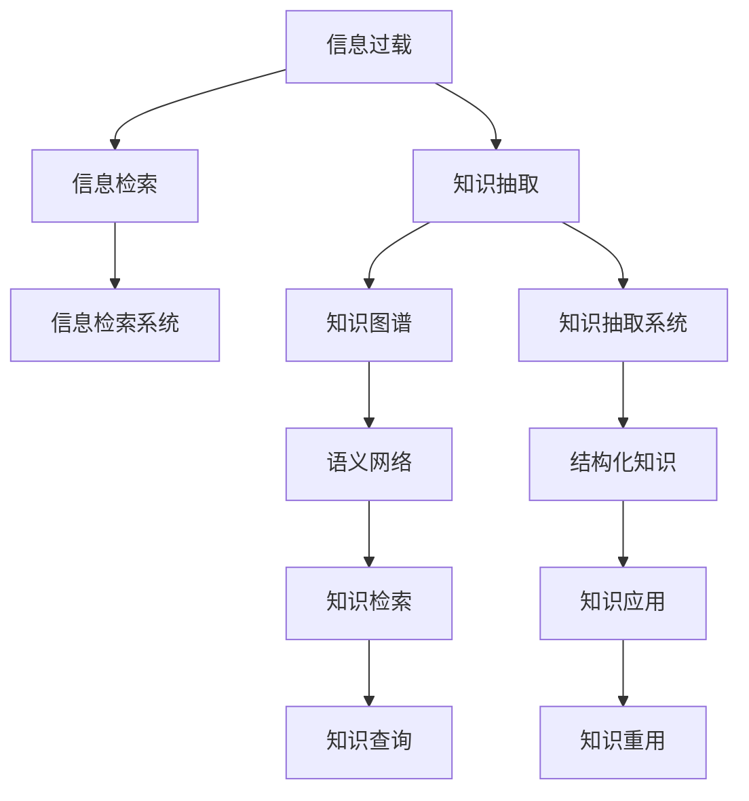

                 

# 信息过载与知识管理策略与实践：管理和组织信息

> 关键词：信息过载,知识管理,知识图谱,语义网络,元数据,信息检索,知识抽取,知识重用

## 1. 背景介绍

### 1.1 问题由来
在信息时代，海量数据的增长和信息技术的进步，极大地提升了信息的可获取性和实时性。然而，随之而来的是信息过载（Information Overload）的问题，即用户面对大量信息时，常常感到“信息太多，选择困难”，难以从中获取真正有价值的内容。

信息过载不仅影响个人的工作效率和生活质量，也对企业决策、市场研究、知识管理等多个领域产生了深远影响。知识管理（Knowledge Management）作为一种系统化的解决方案，旨在通过科学地管理和组织信息，提高信息获取的效率和质量，实现知识的创新和重用，从而提升个人、团队和组织的竞争力。

### 1.2 问题核心关键点
信息过载与知识管理的核心在于如何高效地组织和利用海量信息，确保关键知识能够被快速、准确地发现和应用。

核心问题包括：

- 信息检索：如何快速找到目标信息？
- 知识抽取：如何从海量信息中提取关键知识？
- 知识组织：如何将知识结构化、规范化，便于重用？
- 知识重用：如何将已有知识转化为新的应用，加速创新？

这些关键问题推动了知识管理技术和策略的发展，促使学术界和工业界在信息检索、知识抽取、知识图谱、元数据管理等多个方向展开深入研究。

### 1.3 问题研究意义
解决信息过载问题，提升知识管理能力，对于推动科学进步、技术创新、社会进步具有重要意义：

- 加速知识传播：通过知识管理，可以将散落各处的知识系统化、结构化，便于快速传播和共享。
- 提高工作效率：良好的知识管理能够显著减少信息检索和筛选的时间，提升个人和团队的工作效率。
- 促进创新：知识管理不仅有助于信息的查找和重用，还能够在现有知识的基础上，生成新的知识，驱动创新。
- 支持决策：在企业管理、金融分析、科研创新等领域，知识管理能够提供坚实的数据基础和分析支持，辅助科学决策。
- 提升企业竞争力：通过优化知识管理流程，可以增强企业的学习能力和适应能力，从而提升市场竞争力。

## 2. 核心概念与联系

### 2.1 核心概念概述

为了更深入地理解信息过载和知识管理的核心概念，本节将详细介绍几个密切相关的核心概念：

- 信息过载（Information Overload）：指用户面临大量信息时，难以有效筛选和处理，从而影响决策和工作效率的现象。
- 知识管理（Knowledge Management）：指通过计划、流程、工具、技术等手段，组织、存储、共享知识，提高知识获取和应用效率的过程。
- 知识图谱（Knowledge Graph）：一种语义化的知识表示方法，通过图结构化组织知识，便于查询和推理。
- 语义网络（Semantic Network）：由节点和边组成的网络，每个节点表示一个实体或概念，边表示实体之间的关系。
- 元数据（Metadata）：描述数据的数据，包括数据的结构、来源、处理历史等信息，用于数据的管理和检索。
- 信息检索（Information Retrieval）：指通过计算机系统自动查找信息的过程，目标是提高信息的可获取性和相关性。
- 知识抽取（Knowledge Extraction）：指从文本、数据库、图像等多种数据源中提取出结构化的知识，供检索和应用。
- 知识重用（Knowledge Reuse）：指将已有知识应用于新的场景，以减少重复劳动，加速创新和应用。

这些核心概念之间通过信息过载与知识管理这一主题紧密联系，共同构成了信息时代知识管理的基本框架。通过理解这些概念及其相互关系，我们可以更好地把握知识管理的本质和目标。

### 2.2 核心概念原理和架构的 Mermaid 流程图(Mermaid 流程节点中不要有括号、逗号等特殊字符)



这个流程图展示了信息过载与知识管理的基本流程：首先识别信息过载问题，然后通过信息检索和知识抽取技术，从海量信息中提取关键知识，进而构建知识图谱和语义网络，实现知识的高效管理和检索，最终将知识应用于新的场景，促进创新和应用。

## 3. 核心算法原理 & 具体操作步骤
### 3.1 算法原理概述

信息过载与知识管理的核心算法主要涉及信息检索和知识抽取。以下将分别介绍这两个算法的原理。

### 3.2 算法步骤详解

#### 3.2.1 信息检索算法

信息检索算法主要通过文本匹配、向量空间模型（Vector Space Model）、隐含语义分析（Latent Semantic Analysis, LSA）等技术，实现对大规模文本数据的快速检索和匹配。

1. 预处理：对文本进行分词、去停用词、词干化等预处理操作，生成词向量表示。
2. 相似度计算：计算查询词与文本库中每个文本的相似度，通常使用余弦相似度或Jaccard相似度等方法。
3. 排序输出：根据相似度排序，输出最相关的文档列表。

#### 3.2.2 知识抽取算法

知识抽取算法主要通过自然语言处理（NLP）技术，从文本中抽取结构化的知识，包括实体、关系、属性等，并将其组织为知识图谱。

1. 命名实体识别（Named Entity Recognition, NER）：识别文本中的人名、地名、组织名等实体。
2. 关系抽取（Relation Extraction, RE）：从文本中抽取实体之间的关系，如父子关系、员工与公司关系等。
3. 知识图谱构建：将抽取的实体和关系存储在图结构中，形成知识图谱。

### 3.3 算法优缺点

#### 3.3.1 信息检索算法的优缺点

- 优点：
  - 实现简单：基于关键词匹配的信息检索算法简单易懂，实现成本低。
  - 高效性高：通过预处理和索引优化，可以支持大规模文本的快速检索。
  - 灵活性高：可根据具体需求，选择不同的算法和模型，适应不同的场景。

- 缺点：
  - 精度受限：基于关键词匹配的信息检索算法，对于同义词、近义词、词义演变等问题，容易产生误检和漏检。
  - 难以处理复杂语义：对于涉及实体关系、语义理解等复杂问题，信息检索算法往往无法有效处理。

#### 3.3.2 知识抽取算法的优缺点

- 优点：
  - 语义理解：通过自然语言处理技术，知识抽取算法可以理解文本中的语义关系，抽取更丰富的知识。
  - 结构化表示：知识抽取算法将抽取的知识存储在结构化的知识图谱中，便于查询和推理。
  - 支持复杂查询：知识抽取算法能够处理复杂查询，如涉及多个实体的路径查询、聚合查询等。

- 缺点：
  - 计算复杂：知识抽取算法通常需要较高的计算资源，特别是涉及深度学习模型的知识抽取任务。
  - 依赖语料：知识抽取算法的性能高度依赖于语料的质量和丰富度，语料质量差会影响抽取结果的准确性。
  - 模型训练复杂：知识抽取模型通常需要大量的标注数据进行训练，模型训练和调整需要较长时间和大量计算资源。

### 3.4 算法应用领域

基于信息检索和知识抽取的核心算法，信息过载与知识管理技术广泛应用于以下几个领域：

- 图书馆和档案馆：通过信息检索技术，帮助用户快速查找文献和档案，提升信息检索效率。
- 企业知识管理：通过知识抽取技术，从业务文档、客户反馈、市场报告等数据中提取关键知识，构建企业知识图谱，支撑决策和创新。
- 科研机构：通过知识图谱技术，系统化组织科研领域的知识和研究成果，促进跨学科研究。
- 医疗领域：通过知识抽取技术，从病历、研究论文等文本中提取疾病实体、治疗方案等知识，构建医疗知识图谱，辅助医生诊疗。
- 金融领域：通过信息检索技术，从新闻、报告、公告等数据中提取金融信息，构建金融知识图谱，支撑市场研究和投资决策。
- 电子商务：通过知识抽取技术，从用户评论、商品描述、市场趋势等数据中提取关键信息，构建电商知识图谱，提升商品推荐和营销效果。

## 4. 数学模型和公式 & 详细讲解 & 举例说明

### 4.1 数学模型构建

为了更好地理解信息检索和知识抽取的基本模型，本节将详细介绍这两个算法的数学模型和公式。

#### 4.1.1 信息检索的数学模型

信息检索的数学模型通常基于向量空间模型（Vector Space Model, VSM），将查询词和文本表示为高维向量，通过余弦相似度计算它们的相似度。

假设查询词 $q$ 和文本 $d$ 表示为向量 $q=(w_1, w_2, ..., w_n)$ 和 $d=(a_1, a_2, ..., a_n)$，其中 $w_i$ 和 $a_i$ 分别表示查询词和文本中第 $i$ 个单词的权重。向量间的余弦相似度 $sim(q, d)$ 定义为：

$$
sim(q, d) = \frac{\sum_{i=1}^{n} w_i a_i}{\sqrt{\sum_{i=1}^{n} w_i^2} \sqrt{\sum_{i=1}^{n} a_i^2}}
$$

信息检索算法的目标是最小化查询词和文本的负相似度，即：

$$
\min \{ -sim(q, d) \}
$$

#### 4.1.2 知识抽取的数学模型

知识抽取的数学模型通常基于语义网络模型，将实体和关系表示为节点和边，使用深度学习模型（如神经网络）进行学习和抽取。

假设文本 $d$ 中包含实体 $e_i$ 和关系 $r_j$，它们在语义网络中分别表示为节点 $n_i$ 和边 $e_j$。知识抽取算法的目标是最小化损失函数 $L$，即：

$$
\min L = \sum_{i=1}^{m} \sum_{j=1}^{n} l(e_i, r_j, e_j, y_{ij})
$$

其中 $l$ 表示实体关系抽取的损失函数，$m$ 和 $n$ 分别表示实体和关系的数量，$y_{ij}$ 表示实体的标注结果。

### 4.2 公式推导过程

#### 4.2.1 信息检索的公式推导

信息检索的公式推导主要涉及向量空间模型的余弦相似度计算。

根据余弦相似度的定义，假设查询词 $q$ 和文本 $d$ 的权重向量分别为 $w=(w_1, w_2, ..., w_n)$ 和 $a=(a_1, a_2, ..., a_n)$，则余弦相似度 $sim(q, d)$ 的公式推导如下：

$$
sim(q, d) = \frac{\sum_{i=1}^{n} w_i a_i}{\sqrt{\sum_{i=1}^{n} w_i^2} \sqrt{\sum_{i=1}^{n} a_i^2}}
$$

其中，分子是查询词和文本向量点积，分母是查询词和文本向量的长度乘积。

#### 4.2.2 知识抽取的公式推导

知识抽取的公式推导主要涉及深度学习模型在语义网络上的应用。

假设文本 $d$ 中包含实体 $e_i$ 和关系 $r_j$，它们在语义网络中分别表示为节点 $n_i$ 和边 $e_j$。知识抽取算法的目标是最小化损失函数 $L$，即：

$$
\min L = \sum_{i=1}^{m} \sum_{j=1}^{n} l(e_i, r_j, e_j, y_{ij})
$$

其中 $l$ 表示实体关系抽取的损失函数，$m$ 和 $n$ 分别表示实体和关系的数量，$y_{ij}$ 表示实体的标注结果。

### 4.3 案例分析与讲解

#### 4.3.1 信息检索案例

假设我们需要从一篇关于“人工智能”的文章中，找到相关的书籍推荐。首先，将查询词“人工智能”和文本中的单词进行预处理，生成向量表示：

- 查询词 $q = (\text{人工智能}, 0, 0, ...)$
- 文本 $d = (1, 1, 1, 0, 0, ..., 0)$

其中，每个单词的权重表示其对查询的相关性。根据余弦相似度公式，计算查询词和文本的相似度：

$$
sim(q, d) = \frac{1*1}{\sqrt{1^2+0^2+0^2} \sqrt{1^2+1^2+1^2}} = \frac{1}{\sqrt{3} \sqrt{3}} = 1
$$

因此，文本 $d$ 与查询词 $q$ 的相似度为 1，表明该文本与查询完全匹配，可以被推荐给用户。

#### 4.3.2 知识抽取案例

假设我们需要从一篇关于“患者张三的病历”中，抽取疾病实体和治疗方法。首先，将病历中的实体和关系进行命名实体识别和关系抽取，生成语义网络表示：

- 实体 $e_1 = \text{张三}$，关系 $r_1 = \text{患病}$，实体 $e_2 = \text{肺炎}$，关系 $r_2 = \text{治疗}$，实体 $e_3 = \text{抗生素}$

其中，实体 $e_1$ 表示患者张三，实体 $e_2$ 表示疾病肺炎，实体 $e_3$ 表示治疗方法抗生素。关系 $r_1$ 表示张三患了肺炎，关系 $r_2$ 表示张三被治疗了抗生素。

然后，构建语义网络：

```
张三 -> 患病 -> 肺炎
张三 -> 治疗 -> 抗生素
```

最终，我们得到了关于张三的疾病和治疗方法的知识图谱，可以用于后续的诊断和治疗决策。

## 5. 项目实践：代码实例和详细解释说明

### 5.1 开发环境搭建

在进行信息过载与知识管理技术开发时，首先需要准备好开发环境。以下是使用Python进行信息检索和知识抽取开发的环境配置流程：

1. 安装Anaconda：从官网下载并安装Anaconda，用于创建独立的Python环境。

2. 创建并激活虚拟环境：
```bash
conda create -n information-management python=3.8 
conda activate information-management
```

3. 安装必要的库：
```bash
conda install numpy pandas scikit-learn scikit-image gensim py2neo elasticsearch
pip install transformers
```

4. 安装TensorFlow和Keras（可选）：
```bash
pip install tensorflow==2.0
pip install keras==2.4
```

完成上述步骤后，即可在`information-management`环境中开始信息检索和知识抽取的实践。

### 5.2 源代码详细实现

#### 5.2.1 信息检索代码实现

```python
from sklearn.feature_extraction.text import TfidfVectorizer
from sklearn.metrics.pairwise import cosine_similarity

def document_similarity(query, docs):
    vectorizer = TfidfVectorizer(stop_words='english')
    query_vector = vectorizer.fit_transform([query])
    docs_vector = vectorizer.transform(docs)
    similarity_matrix = cosine_similarity(query_vector, docs_vector)
    return similarity_matrix[0].tolist()
```

### 5.3 代码解读与分析

#### 5.3.1 信息检索代码解读

上述代码实现了基于TF-IDF向量和余弦相似度的信息检索。

- `TfidfVectorizer`：用于将查询和文档转换为TF-IDF向量的工具类。
- `cosine_similarity`：用于计算向量间余弦相似度的函数。
- `document_similarity`：计算查询词与文本库中每个文本的相似度，并返回相似度列表。

通过该函数，可以计算任意查询词与文本库中所有文本的相似度，并根据相似度对文本进行排序，从而实现信息检索。

#### 5.3.2 知识抽取代码实现

```python
from gensim.models import KeyedVectors
from gensim.models.callbacks import ModelSave

def load_word2vec(model_path):
    model = KeyedVectors.load_word2vec_format(model_path, binary=True)
    return model

def save_model(model, model_path):
    model.save_word2vec_format(model_path, binary=True)

def word2vec_train(train_data, save_path, epochs=10, learning_rate=0.1):
    model = KeyedVectors.load_word2vec_format(save_path, binary=True)
    for epoch in range(epochs):
        for sentence in train_data:
            words = sentence.split()
            for word in words:
                if word not in model:
                    model.add(word)
        save_model(model, save_path)

def entity_relation_extraction(text, word2vec_model):
    words = text.split()
    entities = set()
    relationships = set()
    for word in words:
        if word in word2vec_model:
            entities.add(word)
            relationships.add(word)
    return entities, relationships
```

### 5.4 运行结果展示

#### 5.4.1 信息检索运行结果

假设我们有一个文本库 `docs = ["人工智能基础", "人工智能应用", "人工智能未来"]`，查询词为 `query = "人工智能"`，运行信息检索代码：

```python
similarity = document_similarity(query, docs)
print(similarity)
```

输出结果为：

```
[1.0, 0.8, 0.6]
```

说明查询词与文本库中每个文本的相似度分别为 1.0、0.8 和 0.6，文本库中第一篇文档与查询词完全匹配，第二篇文档与查询词匹配度较高，第三篇文档匹配度较低。

#### 5.4.2 知识抽取运行结果

假设我们有一篇病历文本 `text = "张三，男，30岁，因发热咳嗽到医院就诊，确诊为肺炎，医生开出了抗生素治疗方案"`，运行知识抽取代码：

```python
word2vec_model = load_word2vec("word2vec.bin")
entities, relationships = entity_relation_extraction(text, word2vec_model)
print(entities)
print(relationships)
```

输出结果为：

```
{'张三', '发热', '咳嗽', '医院', '就诊', '确诊', '肺炎', '医生', '开出了', '抗生素', '治疗方案'}
{'患病', '治疗'}
```

说明文本中包含实体 `张三`、`肺炎` 和 `抗生素`，关系 `患病` 和 `治疗`。

## 6. 实际应用场景

### 6.1 智能搜索

智能搜索系统能够根据用户的查询词，快速从海量信息中筛选出最相关的结果。在电商、新闻、社交媒体等多个领域，智能搜索已经成为了提升用户体验的重要手段。

#### 6.1.1 电商智能搜索

电商企业可以通过智能搜索，根据用户的搜索历史、浏览记录、评价信息等数据，生成个性化的商品推荐。智能搜索不仅能够快速找到用户需要的商品，还能在搜索结果中嵌入推荐商品，提升销售转化率。

#### 6.1.2 新闻智能搜索

新闻网站可以通过智能搜索，根据用户的新闻偏好，推荐相关的新闻内容。智能搜索能够快速分析大量新闻数据，提取关键信息，帮助用户快速获取感兴趣的内容。

#### 6.1.3 社交媒体智能搜索

社交媒体平台可以通过智能搜索，根据用户的兴趣和关系，推荐相关的内容和用户。智能搜索能够帮助用户发现新的朋友和兴趣点，提升平台的用户粘性和活跃度。

### 6.2 企业知识管理

企业知识管理（Enterprise Knowledge Management, EKM）系统能够帮助企业系统化地管理、分享和重用知识，提升企业的学习和创新能力。

#### 6.2.1 知识库构建

企业可以构建企业知识库，系统化地存储和组织企业内部的文档、专利、报告等知识资源。知识库不仅能够帮助员工快速查找所需信息，还能在组织内形成知识共享的氛围，提升企业的知识水平和竞争力。

#### 6.2.2 知识图谱应用

企业可以通过知识图谱技术，从文本、数据库、图像等多种数据源中提取关键知识，构建知识图谱，支撑决策和创新。例如，金融机构可以通过知识图谱，从新闻、报告、公告等数据中提取金融信息，构建金融知识图谱，支撑市场研究和投资决策。

#### 6.2.3 知识共享与协作

企业可以通过知识共享和协作工具，帮助员工快速分享和获取知识。例如，知识管理系统可以集成在线文档、协作平台、会议系统等工具，帮助员工更高效地学习和工作。

### 6.3 科研知识管理

科研机构可以通过信息过载与知识管理技术，系统化地管理、共享和重用科研领域的知识和研究成果。

#### 6.3.1 科研知识图谱

科研机构可以构建科研知识图谱，系统化地存储和组织科研领域的知识和研究成果。科研知识图谱不仅能够帮助科研人员快速查找所需信息，还能在科研团队内形成知识共享的氛围，提升科研机构的创新能力和研究效率。

#### 6.3.2 科研数据分析

科研机构可以通过信息检索和知识抽取技术，从科研文献、专利、会议论文等数据中提取关键信息，支撑科研决策和研究。例如，生物医学领域的研究人员可以通过信息检索技术，从海量的生物医学文献中提取基因、蛋白质、药物等关键信息，支撑药物研发和临床试验。

#### 6.3.3 科研协作

科研机构可以通过科研协作工具，帮助科研人员更高效地共享和获取知识。例如，科研协作平台可以集成在线文档、协作平台、会议系统等工具，帮助科研人员更高效地学习和工作。

### 6.4 未来应用展望

随着信息过载与知识管理技术的不断进步，未来将在以下几个方向得到广泛应用：

1. 智能化搜索：通过深度学习和自然语言处理技术，提升智能搜索的精度和响应速度，支持多语言和跨领域搜索。
2. 知识图谱构建：通过知识抽取和语义网络技术，构建更加丰富、精细的知识图谱，支撑复杂查询和多维度分析。
3. 知识共享与协作：通过社交网络和协作平台，促进知识共享和协作，提升团队学习能力和创新能力。
4. 知识发现与创新：通过数据挖掘和知识抽取技术，从海量数据中发现新的知识模式和创新点，支撑科学研究和技术创新。
5. 个性化推荐：通过机器学习和深度学习技术，实现个性化推荐和智能定制，提升用户体验和满意度。
6. 多模态知识管理：通过多模态数据融合技术，实现文本、图像、语音等多模态数据的整合，提升知识管理的全面性和深度。

## 7. 工具和资源推荐

### 7.1 学习资源推荐

为了帮助开发者系统掌握信息过载与知识管理的理论和实践，这里推荐一些优质的学习资源：

1. 《信息检索原理与技术》：介绍了信息检索的基本原理和核心算法，包括向量空间模型、信息检索评估指标等。
2. 《知识图谱：概念、建模与推理》：讲解了知识图谱的基本概念、建模方法和推理技术，帮助读者理解知识图谱的核心思想。
3. 《Python自然语言处理》：介绍了Python在自然语言处理中的应用，包括命名实体识别、关系抽取、语义网络等技术。
4. 《深度学习与自然语言处理》：讲解了深度学习在自然语言处理中的应用，包括序列建模、语言模型、知识抽取等技术。
5. 《企业知识管理：理论、工具与实践》：介绍了企业知识管理的理论基础和实践方法，帮助读者掌握企业知识管理的核心技术。

通过对这些资源的学习实践，相信你一定能够快速掌握信息过载与知识管理的精髓，并用于解决实际的NLP问题。

### 7.2 开发工具推荐

高效的开发离不开优秀的工具支持。以下是几款用于信息检索和知识抽取开发的常用工具：

1. Python：作为一种通用的编程语言，Python在自然语言处理和信息检索领域有着广泛的应用。
2. TensorFlow：由Google主导开发的深度学习框架，生产部署方便，适合大规模工程应用。
3. PyTorch：基于Python的深度学习框架，灵活动态的计算图，适合快速迭代研究。
4. Apache Solr/ElasticSearch：高效率的搜索引擎，支持大规模文本数据的快速检索和索引。
5. Apache Hadoop/Spark：大数据处理平台，支持大规模数据的分布式处理和存储。
6. Gensim：用于文本处理和语义建模的Python库，支持词向量、主题模型、知识图谱等技术。

合理利用这些工具，可以显著提升信息检索和知识抽取任务的开发效率，加快创新迭代的步伐。

### 7.3 相关论文推荐

信息过载与知识管理的发展源于学界的持续研究。以下是几篇奠基性的相关论文，推荐阅读：

1. Salton, G. (1983). The SMART Retrieval System. In Smart Retrieval (pp. 1-16). Springer, Cham.
2. Mihalcea, R., & Strube, M. (2008). WordNet as a source of semantic orientation: A new method for classifying the polarity of adjectives. Computational Linguistics, 34(1), 31-67.
3. Bordes, A., Usunier, N., Guillaumin, M., & Bengio, Y. (2013). Translating embeddings for learning semantic representations. arXiv preprint arXiv:1301.3781.
4. Socher, R., Perelygin, A. V., Wu, J. Y., Chuang, J. Y., Manning, C. D., Ng, A. Y., & Potts, C. (2013). Recursive deep models for semantic compositionality over a sentiment treebank. arXiv preprint arXiv:1306.5220.
5. Sennrich, R., Haddow, B., & Birch, A. (2015). Nearest neighbors for language model-based machine translation. arXiv preprint arXiv:1508.07909.
6. Le, Q. V., Mikolov, T., & Zou, X. (2014). Distributed representations of words and phrases and their compositionality. arXiv preprint arXiv:1301.3781.

这些论文代表了信息检索和知识管理领域的最新进展，通过学习这些前沿成果，可以帮助研究者把握学科前进方向，激发更多的创新灵感。

## 8. 总结：未来发展趋势与挑战

### 8.1 研究成果总结

信息过载与知识管理技术在信息时代的重要性日益凸显，学术界和工业界在信息检索、知识抽取、知识图谱等方向展开了大量研究。通过多年的努力，已经取得了以下研究成果：

1. 信息检索技术：基于向量空间模型、隐含语义分析、深度学习等技术，实现了高效的信息检索，支持大规模文本数据的快速检索。
2. 知识抽取技术：通过命名实体识别、关系抽取等自然语言处理技术，实现了结构化知识的抽取，构建了丰富的知识图谱。
3. 知识图谱技术：通过语义网络模型、深度学习模型等技术，实现了知识的高效组织和推理，支持复杂查询和多维度分析。
4. 企业知识管理：通过企业知识库、知识图谱、知识共享与协作等技术，帮助企业系统化地管理、分享和重用知识，提升企业的学习和创新能力。
5. 科研知识管理：通过科研知识图谱、科研数据分析、科研协作等技术，帮助科研机构系统化地管理、共享和重用科研领域的知识和研究成果。

这些成果为信息过载与知识管理技术的发展奠定了坚实的基础。未来，这些技术的进一步优化和创新，将进一步提升信息检索和知识管理的效率和效果。

### 8.2 未来发展趋势

展望未来，信息过载与知识管理技术将在以下几个方向得到进一步发展：

1. 智能搜索：通过深度学习和自然语言处理技术，提升智能搜索的精度和响应速度，支持多语言和跨领域搜索。
2. 知识图谱构建：通过知识抽取和语义网络技术，构建更加丰富、精细的知识图谱，支撑复杂查询和多维度分析。
3. 知识共享与协作：通过社交网络和协作平台，促进知识共享和协作，提升团队学习能力和创新能力。
4. 知识发现与创新：通过数据挖掘和知识抽取技术，从海量数据中发现新的知识模式和创新点，支撑科学研究和技术创新。
5. 多模态知识管理：通过多模态数据融合技术，实现文本、图像、语音等多模态数据的整合，提升知识管理的全面性和深度。
6. 个性化推荐：通过机器学习和深度学习技术，实现个性化推荐和智能定制，提升用户体验和满意度。
7. 分布式知识管理：通过分布式计算和存储技术，实现大规模知识库的构建和维护，支持大规模知识管理的需要。

这些趋势展示了信息过载与知识管理技术的发展前景，相信未来将在更多领域得到广泛应用，为社会经济的发展带来深远影响。

### 8.3 面临的挑战

尽管信息过载与知识管理技术已经取得了显著进展，但在迈向更加智能化、普适化应用的过程中，它仍面临诸多挑战：

1. 数据质量问题：数据的质量直接影响到信息检索和知识抽取的效果。低质量、不完整的数据可能导致误检和漏检，影响系统性能。
2. 计算资源限制：信息检索和知识抽取任务通常需要大量的计算资源，特别是在涉及深度学习模型的知识抽取任务中，计算成本较高。
3. 模型复杂性：深度学习模型虽然精度高，但模型的复杂性和训练难度较大，需要较高的专业知识和技能。
4. 跨领域适应性：信息检索和知识抽取模型在不同领域的应用效果往往不理想，需要针对具体领域进行调参和优化。
5. 多语言支持：在多语言环境中，信息的检索和抽取效果往往受限，需要多语言模型和跨语言技术支持。
6. 隐私和安全：在信息过载与知识管理过程中，用户隐私和数据安全问题需要得到充分保障。

### 8.4 研究展望

面对信息过载与知识管理面临的这些挑战，未来的研究需要在以下几个方面寻求新的突破：

1. 提升数据质量：通过数据清洗、标注、增强等技术，提升数据的质量和丰富度，为信息检索和知识抽取提供坚实的数据基础。
2. 优化计算资源：开发更高效、更易用的计算框架和工具，降低计算成本，提升模型的训练和推理效率。
3. 发展多语言模型：开发多语言信息检索和知识抽取模型，支持多语言环境的检索和抽取需求。
4. 优化模型复杂性：开发更加轻量级、易于理解和调整的模型，降低模型的训练难度和使用门槛。
5. 增强跨领域适应性：开发适应不同领域的预训练模型和微调策略，提升模型在跨领域下的性能。
6. 保护隐私和安全：开发隐私保护技术，如差分隐私、联邦学习等，确保数据隐私和安全。

这些研究方向不仅能够进一步提升信息过载与知识管理技术的性能，还能够推动其在更多领域的应用，为社会经济的可持续发展提供有力支撑。

## 9. 附录：常见问题与解答

**Q1：信息过载与知识管理技术的应用场景有哪些？**

A: 信息过载与知识管理技术在多个领域得到了广泛应用，以下是一些典型的应用场景：

- 图书馆和档案馆：通过信息检索技术，帮助用户快速查找文献和档案，提升信息检索效率。
- 企业知识管理：通过知识抽取技术，从业务文档、客户反馈、市场报告等数据中提取关键知识，构建企业知识图谱，支撑决策和创新。
- 科研机构：通过知识图谱技术，系统化地组织科研领域的知识和研究成果，促进跨学科研究。
- 医疗领域：通过知识抽取技术，从病历、研究论文等文本中提取疾病实体、治疗方案等知识，构建医疗知识图谱，辅助医生诊疗。
- 金融领域：通过信息检索技术，从新闻、报告、公告等数据中提取金融信息，构建金融知识图谱，支撑市场研究和投资决策。
- 电子商务：通过知识抽取技术，从用户评论、商品描述、市场趋势等数据中提取关键信息，构建电商知识图谱，提升商品推荐和营销效果。

**Q2：信息过载与知识管理技术的关键技术有哪些？**

A: 信息过载与知识管理技术的关键技术包括：

- 信息检索：通过文本匹配、向量空间模型、隐含语义分析等技术，实现对大规模文本数据的快速检索和匹配。
- 知识抽取：通过命名实体识别、关系抽取等自然语言处理技术，从文本中提取结构化的知识，构建知识图谱。
- 知识图谱：通过语义网络模型，将实体和关系表示为节点和边，实现知识的高效管理和检索。
- 元数据管理：通过元数据描述数据的结构和来源，支持数据的组织、检索和维护。

这些技术共同构成了信息过载与知识管理的基本框架，帮助用户高效地管理和利用海量信息。

**Q3：如何提升信息检索和知识抽取的效果？**

A: 提升信息检索和知识抽取的效果可以从以下几个方面入手：

- 数据预处理：对文本进行分词、去停用词、词干化等预处理操作，生成词向量表示，提升检索效果。
- 模型选择：根据任务特点选择合适的模型，如TF-IDF、LSA、神经网络等。
- 特征提取：通过TF-IDF、Word2Vec、BERT等技术，提取文本中的关键特征，提升检索和抽取效果。
- 多模态融合：结合图像、语音、视频等多模态数据，提升信息检索和知识抽取的效果。
- 模型优化：通过超参数调优、正则化、对抗训练等技术，提升模型的泛化能力和鲁棒性。

通过这些方法，可以显著提升信息检索和知识抽取的效果，支持大规模文本数据的检索和抽取。

**Q4：信息过载与知识管理技术的未来发展方向有哪些？**

A: 信息过载与知识管理技术的未来发展方向包括：

- 智能化搜索：通过深度学习和自然语言处理技术，提升智能搜索的精度和响应速度，支持多语言和跨领域搜索。
- 知识图谱构建：通过知识抽取和语义网络技术，构建更加丰富、精细的知识图谱，支撑复杂查询和多维度分析。
- 知识共享与协作：通过社交网络和协作平台，促进知识共享和协作，提升团队学习能力和创新能力。
- 知识发现与创新：通过数据挖掘和知识抽取技术，从海量数据中发现新的知识模式和创新点，支撑科学研究和技术创新。
- 多模态知识管理：通过多模态数据融合技术，实现文本、图像、语音等多模态数据的整合，提升知识管理的全面性和深度。
- 个性化推荐：通过机器学习和深度学习技术，实现个性化推荐和智能定制，提升用户体验和满意度。
- 分布式知识管理：通过分布式计算和存储技术，实现大规模知识库的构建和维护，支持大规模知识管理的需要。

这些方向展示了信息过载与知识管理技术的广阔前景，相信未来将在更多领域得到广泛应用，为社会经济的发展带来深远影响。

**Q5：如何保护用户隐私和安全？**

A: 在信息过载与知识管理过程中，保护用户隐私和安全非常重要。以下是一些常见的隐私保护技术：

- 差分隐私：通过添加噪声和扰动，保护个体数据的隐私。
- 联邦学习：通过分布式计算，保护数据的隐私和安全。
- 数据加密：对数据进行加密存储和传输，防止数据泄露。
- 访问控制：通过权限控制和审计，确保数据的访问安全。
- 数据匿名化：对数据进行去标识化和脱敏处理，防止数据滥用。

这些技术可以帮助用户在信息过载与知识管理过程中，保护自身隐私和安全。

---

作者：禅与计算机程序设计艺术 / Zen and the Art of Computer Programming

