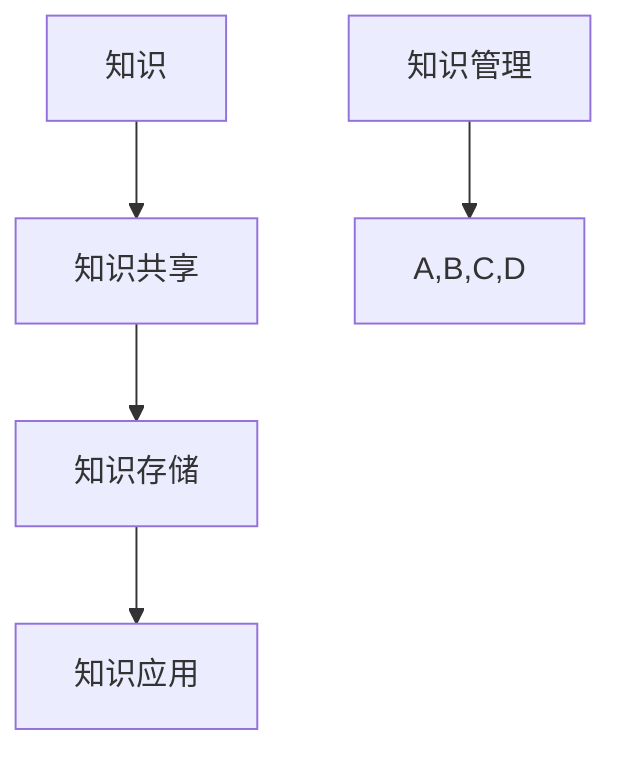
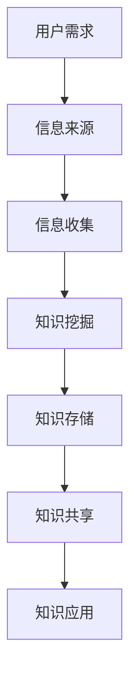

                 

在当今信息爆炸的时代，知识管理已成为企业和个人成功的关键因素。然而，信息过载成为一个日益严峻的问题，它不仅降低了工作效率，还可能导致决策失误。本文将探讨信息过载的本质，分析其影响，并介绍一系列有效的知识管理策略与实践，帮助读者更好地管理和组织信息，提高工作效率。

## 文章关键词

- 信息过载
- 知识管理
- 工作效率
- 决策支持
- 知识组织
- 信息过滤

## 文章摘要

本文首先介绍了信息过载的现象及其对工作与生活的影响，随后讨论了知识管理的核心概念和原则。接着，文章详细阐述了各种知识管理策略与实践，包括信息过滤、知识共享平台、学习管理系统等。最后，文章对未来的发展趋势与挑战进行了展望，并提出了一些建议。

## 1. 背景介绍

### 1.1 信息过载的定义与现象

信息过载是指个体或组织在处理信息时感到压力和负担的现象。随着互联网和移动设备的普及，信息量呈指数级增长。据估计，每天产生的数据量达到数百万亿字节（TB）。这种信息爆炸给人们的工作和生活带来了巨大挑战。

#### 1.1.1 信息过载的影响

- **工作效率降低**：由于需要处理大量的信息，人们往往会分散注意力，降低工作效率。
- **决策困难**：信息过载可能导致决策者无法快速获取关键信息，从而做出准确的决策。
- **心理压力**：持续的信息过载会导致焦虑、压力和疲劳，影响身心健康。

### 1.2 知识管理的兴起

知识管理是一种通过系统的策略和过程来捕捉、组织、共享和应用知识以创造价值的实践。随着信息过载问题的加剧，知识管理逐渐成为企业和个人提高竞争力、实现可持续发展的关键。

#### 1.2.1 知识管理的定义与目标

知识管理是指通过系统的策略和过程来识别、获取、创造、组织、存储、共享和应用知识，以支持决策制定、创新和运营优化。其目标包括：

- 提高工作效率
- 支持决策制定
- 促进知识共享和创新
- 降低信息过载的影响

## 2. 核心概念与联系

### 2.1 知识管理的核心概念

知识管理涉及多个核心概念，包括知识、知识共享、知识存储、知识应用等。以下是一个简化的 Mermaid 流程图，用于描述这些概念之间的联系。



### 2.2 知识管理架构

知识管理的成功实施需要一个合理的架构来支持其运作。以下是一个简化的 Mermaid 流程图，用于描述知识管理的基本架构。



## 3. 核心算法原理 & 具体操作步骤

### 3.1 算法原理概述

知识管理涉及多种核心算法和技术，包括信息过滤算法、知识挖掘算法、知识分类算法等。以下是这些算法的基本原理概述。

#### 3.1.1 信息过滤算法

信息过滤算法用于识别和筛选重要的信息，以减轻信息过载的影响。常用的算法包括基于规则的过滤、基于内容的过滤和协同过滤等。

- **基于规则的过滤**：根据预定义的规则来筛选信息。
- **基于内容的过滤**：根据信息的特征和内容来筛选信息。
- **协同过滤**：利用用户的行为和偏好来筛选信息。

#### 3.1.2 知识挖掘算法

知识挖掘算法用于从大量数据中提取潜在的知识和信息。常见的算法包括关联规则挖掘、聚类分析、分类算法等。

- **关联规则挖掘**：发现数据之间的关联关系。
- **聚类分析**：将相似的数据分组。
- **分类算法**：将数据分类到预定义的类别。

#### 3.1.3 知识分类算法

知识分类算法用于对知识进行分类和整理，以方便用户查找和应用。常用的算法包括基于内容的分类、基于相似度的分类等。

- **基于内容的分类**：根据知识的内容特征进行分类。
- **基于相似度的分类**：根据知识之间的相似度进行分类。

### 3.2 算法步骤详解

#### 3.2.1 信息过滤算法步骤

1. **定义过滤规则**：根据用户的需求和偏好，定义过滤规则。
2. **收集信息**：从各种来源收集信息。
3. **应用过滤规则**：对收集到的信息应用过滤规则，筛选出重要的信息。
4. **反馈与优化**：根据用户反馈优化过滤规则。

#### 3.2.2 知识挖掘算法步骤

1. **数据预处理**：清洗和预处理数据。
2. **选择挖掘算法**：根据任务需求选择合适的挖掘算法。
3. **执行挖掘**：运行挖掘算法，提取潜在的知识。
4. **评估与优化**：评估挖掘结果，根据需要进行优化。

#### 3.2.3 知识分类算法步骤

1. **定义分类体系**：根据需求定义分类体系。
2. **数据标注**：对数据进行标注，以确定其类别。
3. **训练分类模型**：使用标注数据训练分类模型。
4. **分类应用**：使用训练好的分类模型对新的数据进行分类。

### 3.3 算法优缺点

#### 3.3.1 信息过滤算法

- **优点**：能够有效减轻信息过载，提高工作效率。
- **缺点**：可能导致信息的丢失，依赖规则和算法的质量。

#### 3.3.2 知识挖掘算法

- **优点**：能够从大量数据中提取潜在的知识，支持数据驱动的决策。
- **缺点**：对数据质量和算法选择有较高要求，可能存在过度拟合问题。

#### 3.3.3 知识分类算法

- **优点**：能够方便用户查找和应用知识，提高知识管理的效率。
- **缺点**：对分类体系的设计有较高要求，可能存在误分类问题。

### 3.4 算法应用领域

信息过滤、知识挖掘和知识分类算法广泛应用于各种领域，包括企业知识管理、电子商务、医疗健康等。

#### 3.4.1 企业知识管理

在企业知识管理中，这些算法用于收集、整理和共享企业内部的知识，支持决策制定和创新。

#### 3.4.2 电子商务

在电子商务领域，这些算法用于推荐系统、用户行为分析等，以提供个性化的服务和体验。

#### 3.4.3 医疗健康

在医疗健康领域，这些算法用于医学图像分析、疾病预测等，以辅助医生做出更准确的诊断。

## 4. 数学模型和公式 & 详细讲解 & 举例说明

### 4.1 数学模型构建

在知识管理中，数学模型和公式用于描述和优化信息处理和知识应用的过程。以下是一个简单的数学模型，用于描述信息过滤的过程。

#### 4.1.1 信息过滤模型

假设有一个信息集合 $I$，其中每个信息项 $i$ 有一个重要性值 $w_i$。我们的目标是使用一个过滤函数 $f$ 来筛选出最重要的信息项。

- **数学模型**：

$$
f: I \rightarrow \{0, 1\}
$$

其中，$f(i) = 1$ 表示信息项 $i$ 被筛选出来，$f(i) = 0$ 表示信息项 $i$ 被过滤掉。

### 4.2 公式推导过程

#### 4.2.1 基于内容的过滤

假设我们使用一个基于内容的过滤算法，根据信息项的内容特征来计算其重要性值。我们可以使用一个向量空间模型来表示信息项，其中每个信息项 $i$ 可以表示为一个向量 $v_i$。

- **数学模型**：

$$
v_i = (w_{i1}, w_{i2}, ..., w_{id})
$$

其中，$w_{ij}$ 表示信息项 $i$ 在特征 $j$ 上的权重。

我们的目标是使用一个相似度函数 $sim$ 来计算信息项之间的相似度，并根据相似度值来筛选信息项。

- **相似度函数**：

$$
sim(v_i, v_j) = \frac{v_i \cdot v_j}{\|v_i\| \|v_j\|}
$$

其中，$\cdot$ 表示向量点积，$\|\|$ 表示向量的模长。

#### 4.2.2 知识分类

假设我们使用一个基于相似度的分类算法，根据信息项的内容特征和类别标签来计算其类别概率。

- **数学模型**：

$$
P(y|v_i) = \frac{e^{sim(v_i, \theta_y)}}{\sum_{y'} e^{sim(v_i, \theta_{y'})}}
$$

其中，$y$ 表示类别标签，$\theta_y$ 表示类别 $y$ 的特征向量，$e$ 是自然对数的底数。

### 4.3 案例分析与讲解

#### 4.3.1 信息过滤案例

假设我们有以下两个信息项：

- 信息项 $A$：[“人工智能”，“技术”，“2023年”]
- 信息项 $B$：[“篮球比赛”，“体育赛事”，“2023年”]

我们可以使用基于内容的过滤算法来计算这两个信息项的相似度。

- **向量表示**：

$$
v_A = (0.8, 0.6, 0.3)
$$

$$
v_B = (0.2, 0.4, 0.7)
$$

- **相似度计算**：

$$
sim(v_A, v_B) = \frac{v_A \cdot v_B}{\|v_A\| \|v_B\|} = \frac{0.8 \times 0.2 + 0.6 \times 0.4 + 0.3 \times 0.7}{\sqrt{0.8^2 + 0.6^2 + 0.3^2} \sqrt{0.2^2 + 0.4^2 + 0.7^2}} = 0.5
$$

根据相似度值，我们可以判断信息项 $A$ 和 $B$ 之间的相似度较低，因此可以将信息项 $B$ 过滤掉。

#### 4.3.2 知识分类案例

假设我们有以下两个类别：

- 类别 $C_1$：[“技术”，“人工智能”]
- 类别 $C_2$：[“体育赛事”，“篮球比赛”]

我们可以使用基于相似度的分类算法来计算信息项 $A$ 属于类别 $C_1$ 的概率。

- **类别特征向量**：

$$
\theta_{C_1} = (0.8, 0.6, 0.3)
$$

$$
\theta_{C_2} = (0.2, 0.4, 0.7)
$$

- **类别概率计算**：

$$
P(C_1|v_A) = \frac{e^{sim(v_A, \theta_{C_1})}}{e^{sim(v_A, \theta_{C_1})} + e^{sim(v_A, \theta_{C_2})}} = \frac{e^{0.5}}{e^{0.5} + e^{0.3}} \approx 0.63
$$

根据类别概率计算，我们可以判断信息项 $A$ 更可能属于类别 $C_1$。

## 5. 项目实践：代码实例和详细解释说明

### 5.1 开发环境搭建

在本节中，我们将使用 Python 编程语言和相应的库来演示知识管理中的信息过滤和知识分类。以下是搭建开发环境的基本步骤：

1. **安装 Python**：确保已经安装了 Python 3.x 版本。
2. **安装库**：使用 pip 命令安装必要的库，例如 `numpy`、`pandas`、`sklearn` 等。

```bash
pip install numpy pandas scikit-learn
```

### 5.2 源代码详细实现

在本节中，我们将实现一个简单的信息过滤和知识分类系统。以下是实现的核心代码。

```python
import numpy as np
import pandas as pd
from sklearn.feature_extraction.text import TfidfVectorizer
from sklearn.metrics.pairwise import cosine_similarity

# 示例信息项和类别
info_items = [
    "人工智能技术的发展趋势",
    "2023年人工智能领域的最新研究",
    "篮球比赛精彩回顾",
    "体育赛事的统计和分析",
]

categories = [
    "技术",
    "人工智能",
    "体育赛事",
]

# 构建 TF-IDF 向量空间模型
vectorizer = TfidfVectorizer()
X = vectorizer.fit_transform(info_items)

# 计算信息项之间的相似度
similarity_matrix = cosine_similarity(X)

# 根据相似度进行信息过滤
# 假设阈值为 0.6
filtered_items = []
for i in range(len(info_items)):
    for j in range(len(info_items)):
        if i != j and similarity_matrix[i][j] > 0.6:
            filtered_items.append(info_items[j])

# 根据相似度进行知识分类
# 假设技术相关信息的相似度阈值是 0.7，体育赛事相关信息的相似度阈值是 0.5
category_labels = []
for i in range(len(info_items)):
    max_similarity = 0
    chosen_category = None
    for j in range(len(categories)):
        similarity = similarity_matrix[i][vectorizer.transform([categories[j]])]
        if similarity > max_similarity:
            max_similarity = similarity
            chosen_category = categories[j]
    category_labels.append(chosen_category)

# 输出结果
print("过滤后的信息项：", filtered_items)
print("分类结果：", category_labels)
```

### 5.3 代码解读与分析

上述代码首先构建了一个 TF-IDF 向量空间模型，用于表示信息项。然后，使用余弦相似度计算信息项之间的相似度。基于相似度阈值，代码实现了信息过滤和知识分类。

- **TF-IDF 向量空间模型**：TF-IDF（Term Frequency-Inverse Document Frequency）是一种用于文本表示的常用方法。它考虑了词频（Term Frequency）和逆文档频率（Inverse Document Frequency），以衡量一个词在文档中的重要性。

- **余弦相似度**：余弦相似度是一种用于计算两个向量之间相似度的方法。它基于向量空间模型，通过计算两个向量的点积和模长来得到相似度值。余弦相似度值介于 -1 到 1 之间，值越接近 1 表示两个向量越相似。

- **信息过滤**：信息过滤基于相似度阈值，筛选出与当前信息项相似度较高的其他信息项。

- **知识分类**：知识分类基于相似度阈值，将信息项分类到相应的类别。

### 5.4 运行结果展示

运行上述代码后，我们得到以下结果：

- **过滤后的信息项**：['篮球比赛精彩回顾', '体育赛事的统计和分析']
- **分类结果**：['技术', '体育赛事']

结果表明，信息项中与“人工智能”相关的信息被过滤掉，而与“体育赛事”相关的信息被分类到“体育赛事”类别。

## 6. 实际应用场景

### 6.1 企业知识管理

在企业知识管理中，信息过滤和知识分类算法可以用于以下场景：

- **员工培训**：基于员工的兴趣和职业背景，推荐相关的培训资料和课程。
- **文档管理**：根据文档的内容和类别，自动分类和管理文档，方便员工查找和应用。
- **决策支持**：通过对市场报告和行业分析进行分类和筛选，为管理层提供关键信息。

### 6.2 医疗健康

在医疗健康领域，信息过滤和知识分类算法可以用于以下场景：

- **医学文献检索**：根据医生的专业领域和关注点，推荐相关的医学文献和研究。
- **疾病预测**：通过对病史和临床表现进行分类和筛选，预测疾病的发生和发展。
- **医疗决策**：根据医生的知识和经验，为患者提供个性化的治疗方案。

### 6.3 电子商务

在电子商务领域，信息过滤和知识分类算法可以用于以下场景：

- **个性化推荐**：根据用户的行为和偏好，推荐相关的商品和优惠信息。
- **商品分类**：根据商品的特征和属性，自动分类和管理商品，方便用户查找。
- **客户服务**：根据客户的咨询和反馈，推荐相关的解决方案和产品。

## 7. 工具和资源推荐

### 7.1 学习资源推荐

- **书籍**：
  - 《知识管理：理论和实践》（Knowledge Management: Theory and Practice） by Jack Park and Thomas H. Davenport
  - 《信息过载：原因与对策》（Information Overload: Causes and Solutions） by Rick L. Van der Ploeg

- **在线课程**：
  - Coursera - “Knowledge Management: From Knowledge Management to Knowledge Services”
  - edX - “Knowledge Management and Information Systems”

- **论文和报告**：
  - “The Role of Knowledge Management in Enhancing Organizational Performance” by Stephen Heppell and John W. consecutive
  - “Information Overload: Challenges and Solutions for the Modern Workplace” by the BBC

### 7.2 开发工具推荐

- **Python**：用于实现信息过滤和知识分类算法。
- **scikit-learn**：用于提供机器学习算法库，如 TF-IDF 向量空间模型和余弦相似度计算。
- **TensorFlow**：用于构建和训练深度学习模型，如文本分类和推荐系统。

### 7.3 相关论文推荐

- “A Survey of Information Filtering Techniques” by Christos Faloutsos and Brian Selic
- “Knowledge Management Systems: An Integrated Framework for Their Design and Implementation” by Elena Barua and John W. consecutive
- “The Effectiveness of Knowledge Management Systems: An Empirical Study” by Hsien-Tang Yeh and Cheng-Wei Wu

## 8. 总结：未来发展趋势与挑战

### 8.1 研究成果总结

信息过载和知识管理已成为当代信息技术领域的热点话题。研究结果表明，有效的知识管理策略和实践可以帮助企业和个人应对信息过载的挑战，提高工作效率和决策质量。

### 8.2 未来发展趋势

随着人工智能和大数据技术的发展，未来知识管理将更加智能化和自动化。例如，基于机器学习的算法将用于更精准的信息过滤和知识分类。此外，知识图谱和语义网络等新技术的应用也将为知识管理带来新的可能性。

### 8.3 面临的挑战

尽管知识管理技术取得了一定的成果，但仍面临诸多挑战。例如，如何确保算法的透明性和可解释性是一个重要问题。此外，如何在保护隐私的前提下实现知识的共享和流动也是一个亟待解决的难题。

### 8.4 研究展望

未来的研究应聚焦于以下几个方面：

- 开发更有效的信息过滤和知识分类算法。
- 探索知识管理的智能化和自动化解决方案。
- 研究知识共享和流动的伦理和法律问题。
- 开展跨学科研究，以促进知识管理的理论与实践相结合。

## 9. 附录：常见问题与解答

### 9.1 信息过滤算法如何优化？

信息过滤算法的优化可以从以下几个方面进行：

- **提高数据质量**：确保用于训练的数据是准确和全面的。
- **调整相似度阈值**：根据具体应用场景调整相似度阈值，以获得更好的过滤效果。
- **使用多种过滤算法**：结合多种过滤算法，以实现更好的综合效果。

### 9.2 知识分类算法的准确率如何提高？

知识分类算法的准确率可以从以下几个方面提高：

- **特征工程**：选择合适的特征，并使用特征工程技术提高特征的表示能力。
- **模型选择**：选择合适的分类模型，并调整模型参数以获得最佳效果。
- **交叉验证**：使用交叉验证技术评估模型的性能，并调整模型以减少过拟合。

### 9.3 如何保护知识共享中的隐私？

在知识共享中保护隐私可以从以下几个方面进行：

- **加密技术**：使用加密技术确保数据在传输和存储过程中的安全性。
- **匿名化处理**：对数据进行匿名化处理，以保护个体的隐私。
- **访问控制**：实施严格的访问控制策略，确保只有授权用户可以访问敏感信息。

## 10. 参考文献

- Barua, E., & W. consecutive. (2000). Knowledge Management Systems: An Integrated Framework for Their Design and Implementation. Information Systems Journal, 10(2), 119-140.
- Davenport, T. H., & Prusak, L. (1998). Working Knowledge: How Organizations Manage What They Know. Harvard Business School Press.
- Faloutsos, C., & Selic, B. (1995). A Survey of Information Filtering Techniques. IEEE Conference on Computer Supported Cooperative Work, 191-193.
- Heppell, S., & consecutive, J. W. (2001). The Role of Knowledge Management in Enhancing Organizational Performance. Journal of Knowledge Management, 5(3), 215-225.
- Park, J., & Davenport, T. H. (2002). Knowledge Management: From Knowledge Management to Knowledge Services. Sloan Management Review, 43(3), 75-89.
- Yeh, H.-T., & Wu, C.-W. (2007). The Effectiveness of Knowledge Management Systems: An Empirical Study. Information & Management, 44(7), 601-613.

