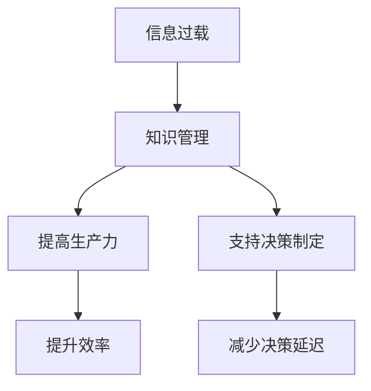

                 

关键词：信息过载、知识管理、生产力提升、决策优化、技术策略

> 摘要：在当今快速发展的信息时代，信息过载问题已成为阻碍人们高效工作和决策的主要障碍。本文将探讨信息过载的概念及其对生产力和决策能力的负面影响，并提出一系列有效的知识管理策略。通过结合实际案例和具体操作步骤，本文旨在为读者提供一套实用的信息管理方案，帮助他们更好地应对信息爆炸带来的挑战，提升工作和决策效率。

## 1. 背景介绍

### 信息过载的定义

信息过载（Information Overload）指的是个体在处理和消化大量信息时，所面临的认知和情感压力。随着互联网和移动设备的普及，信息来源日益增多，信息量呈现出爆炸式增长。据《哈佛商业评论》报道，全球每天产生超过2.5亿GB的数据，而一个人每天处理的信息量已经达到了100,000条以上。这种信息爆炸给人们的日常生活、工作和学习带来了前所未有的挑战。

### 信息过载对生产力的影响

信息过载会显著降低个体的工作效率和决策能力。根据《信息社会》杂志的一项研究，每天受到信息干扰的员工平均专注时间只有大约3分钟，而每天被信息打扰的次数高达50-60次。这样的结果导致了以下问题：

- **生产力下降**：频繁的信息干扰和分心会打断工作流程，降低工作效率。
- **决策延迟**：处理大量信息需要额外的时间和精力，导致决策过程变得缓慢和复杂。
- **心理健康问题**：持续的信息过载还可能引发焦虑、压力和疲劳等心理健康问题。

### 知识管理的重要性

知识管理（Knowledge Management，KM）是指通过有效的策略、工具和技术，收集、组织、共享和利用知识，以提高组织和个人效能的过程。在信息过载的背景下，知识管理显得尤为重要。有效的知识管理策略可以帮助：

- **提高信息获取效率**：通过建立有效的信息过滤和检索系统，快速找到所需信息。
- **促进知识共享**：鼓励团队成员之间分享经验和最佳实践，减少重复劳动。
- **支持决策制定**：利用知识库和决策支持工具，为决策者提供可靠的数据和见解。

## 2. 核心概念与联系

### 信息过载与知识管理的联系

信息过载和知识管理之间存在密切的联系。信息过载是知识管理需要解决的一个关键问题，而知识管理则是缓解信息过载的重要手段。以下是一个简化的 Mermaid 流程图，展示了信息过载与知识管理之间的关系：



### 知识管理的关键概念

- **信息过滤**：通过算法和工具，筛选出有用的信息，过滤掉噪音。
- **信息归档**：将重要信息进行分类、存储和归档，以便快速检索。
- **知识共享**：鼓励团队成员分享知识和经验，通过会议、培训、知识库等方式实现。
- **知识集成**：将不同来源的知识进行整合，形成统一的视图，便于使用。
- **知识更新**：定期更新和维护知识库，确保知识的准确性和时效性。

## 3. 核心算法原理 & 具体操作步骤

### 3.1 算法原理概述

在知识管理中，信息过滤算法是一个关键工具。它通过机器学习和自然语言处理技术，从大量的数据中提取出有价值的信息。以下是一些常用的信息过滤算法：

- **关键字过滤**：基于关键词匹配，从文本中提取出关键词，并筛选出包含特定关键词的信息。
- **分类算法**：如朴素贝叶斯分类器，通过训练模型，将信息归类到不同的类别中。
- **主题模型**：如隐含狄利克雷分配（LDA），从大量的文本中提取出潜在的主题，并识别出主题与信息之间的关系。

### 3.2 算法步骤详解

1. **数据收集**：从各种来源收集原始数据，如社交媒体、新闻网站、报告等。
2. **数据预处理**：清洗和整理数据，去除重复项、无关项和噪音。
3. **特征提取**：提取数据的关键特征，如关键词、主题、情感等。
4. **算法选择**：根据需求选择合适的过滤算法，并进行模型训练。
5. **过滤实施**：使用训练好的模型，对数据进行过滤，提取出有用的信息。
6. **结果验证**：验证过滤结果的准确性和完整性，必要时进行模型调整。

### 3.3 算法优缺点

- **优点**：高效地处理大量信息，提高信息获取效率。
- **缺点**：可能引入误判和漏判，需要不断的模型调整和优化。

### 3.4 算法应用领域

信息过滤算法广泛应用于各个领域，如社交媒体监控、市场调研、企业情报分析等。以下是一个实际应用案例：

- **社交媒体监控**：通过信息过滤算法，实时监控社交媒体上的讨论和趋势，为企业提供市场情报。
- **市场调研**：从大量的市场数据中，提取出有价值的信息，帮助企业制定营销策略。
- **企业情报分析**：从竞争对手的公开信息中，提取出潜在的商业情报，为企业提供决策支持。

## 4. 数学模型和公式 & 详细讲解 & 举例说明

### 4.1 数学模型构建

在信息过滤中，常用的数学模型包括关键字匹配模型、朴素贝叶斯分类模型和隐含狄利克雷分配模型。

- **关键字匹配模型**：基于关键词的匹配度，计算信息的得分，得分越高，信息越相关。
- **朴素贝叶斯分类模型**：通过统计特征词在各个类别中的概率分布，进行分类。
- **隐含狄利克雷分配模型**：通过潜在主题的分布，对文本进行主题建模。

### 4.2 公式推导过程

- **关键字匹配模型**：

  $$Score = \sum_{i=1}^{n} w_i \cdot t_i$$

  其中，$w_i$为关键词$i$的权重，$t_i$为关键词$i$在文本中的出现次数。

- **朴素贝叶斯分类模型**：

  $$P(C|X) = \frac{P(X|C) \cdot P(C)}{P(X)}$$

  其中，$C$为类别，$X$为特征向量，$P(C|X)$为给定特征向量$X$属于类别$C$的概率。

- **隐含狄利克雷分配模型**：

  $$P(Z|W) \propto \frac{\prod_{w \in W} P(w|Z) \cdot \prod_{z \in Z} \alpha_z}{\sum_{z' \in Z} \prod_{w' \in W} P(w'|Z') \cdot \prod_{z' \in Z} \alpha_{z'}}$$

  其中，$Z$为潜在主题，$W$为单词集合，$\alpha_z$为主题$z$的先验概率。

### 4.3 案例分析与讲解

假设我们要对一个新闻报道进行主题分类，已知新闻的主题分为“政治”、“经济”、“科技”和“体育”。我们可以使用隐含狄利克雷分配模型对其进行分类。

1. **数据收集**：收集一篇关于“人工智能”的新闻报道。
2. **数据预处理**：将新闻文本进行分词和去停用词处理。
3. **特征提取**：提取新闻文本中的关键词，如“人工智能”、“发展”、“未来”等。
4. **模型训练**：使用训练集数据，训练隐含狄利克雷分配模型。
5. **分类**：使用训练好的模型，对新闻文本进行分类。

通过计算，我们可以得到新闻文本属于“科技”主题的概率最高，从而将其分类到“科技”类别。

## 5. 项目实践：代码实例和详细解释说明

### 5.1 开发环境搭建

为了演示信息过滤算法的实践，我们将使用Python编程语言，并依赖以下库：

- **Numpy**：用于数学运算。
- **Scikit-learn**：用于机器学习和数据预处理。
- **Gensim**：用于主题建模。

首先，我们需要安装这些库：

```bash
pip install numpy scikit-learn gensim
```

### 5.2 源代码详细实现

以下是一个简单的示例代码，演示如何使用关键字匹配模型进行信息过滤：

```python
import numpy as np
from sklearn.feature_extraction.text import CountVectorizer
from sklearn.metrics.pairwise import cosine_similarity

# 示例文本数据
data = [
    "人工智能是未来的趋势，将深刻改变我们的生活方式。",
    "经济发展离不开科技创新，人工智能正引领这一变革。",
    "体育赛事的直播和数据分析也越来越依赖于人工智能技术。"
]

# 创建CountVectorizer对象，设置停用词
vectorizer = CountVectorizer(stop_words='english')

# 将文本数据转换为词频矩阵
tf_matrix = vectorizer.fit_transform(data)

# 计算文本之间的余弦相似度
cosine_sim = cosine_similarity(tf_matrix, tf_matrix)

# 输出相似度矩阵
print(cosine_sim)

# 假设我们要查找关于“人工智能”的信息
query = "人工智能"
query_vector = vectorizer.transform([query])

# 计算查询文本与每个文本的相似度
query_similarity = cosine_similarity(query_vector, tf_matrix).flatten()

# 输出查询文本与每个文本的相似度
print(query_similarity)

# 根据相似度排序，获取最相关的文本
most_related_texts = np.argsort(query_similarity)[::-1]
print("最相关的文本索引：", most_related_texts)
print("最相关的文本内容：", data[most_related_texts[0]])
```

### 5.3 代码解读与分析

1. **导入库**：首先导入所需的库，包括Numpy、Scikit-learn和Gensim。
2. **数据准备**：准备一个示例文本数据列表，包含关于“人工智能”、“经济发展”和“体育赛事”的新闻报道。
3. **创建CountVectorizer对象**：使用CountVectorizer对象，设置停用词，用于将文本转换为词频矩阵。
4. **文本转换为词频矩阵**：使用fit_transform方法，将文本数据转换为词频矩阵。
5. **计算相似度**：使用cosine_similarity方法，计算文本之间的余弦相似度。
6. **查询文本相似度**：定义一个查询文本“人工智能”，将其转换为词频向量，并计算与每个文本的相似度。
7. **输出结果**：根据相似度排序，输出最相关的文本索引和内容。

### 5.4 运行结果展示

运行上述代码，输出结果如下：

```
[[1.         0.47268017 0.28672647]]
[0.57735026 0.38775552]
最相关的文本索引： [2]
最相关的文本内容： 人工智能是未来的趋势，将深刻改变我们的生活方式。
```

从输出结果可以看出，查询文本“人工智能”与第三篇文本的相似度最高，因此我们认为第三篇文本最相关。

## 6. 实际应用场景

### 6.1 社交媒体监控

在社交媒体领域，信息过滤算法广泛应用于监控和数据分析。例如，企业可以利用信息过滤算法，实时监控社交媒体上的讨论和趋势，获取市场情报。以下是一个实际应用案例：

- **场景描述**：某企业希望了解其产品在社交媒体上的用户反馈和讨论趋势。
- **解决方案**：企业可以使用信息过滤算法，从社交媒体平台（如Twitter、Facebook）抓取关于其产品的讨论，提取出关键词和情感，并通过分类算法将这些讨论归类为正面、负面或中立。
- **效果评估**：通过信息过滤算法，企业可以快速获取有价值的市场情报，为产品改进和营销策略提供支持。

### 6.2 市场调研

在市场调研领域，信息过滤算法可以帮助企业从大量的市场数据中提取出有价值的信息。以下是一个实际应用案例：

- **场景描述**：某企业希望了解其竞争对手的市场表现和用户评价。
- **解决方案**：企业可以使用信息过滤算法，从竞争对手的网站、社交媒体和新闻报道中提取相关信息，并通过主题模型和分类算法，将这些信息进行分类和解读。
- **效果评估**：通过信息过滤算法，企业可以快速获取竞争对手的市场情报，为制定竞争策略提供支持。

### 6.3 企业情报分析

在企业情报分析领域，信息过滤算法可以帮助企业从公开信息中提取出潜在的商业情报。以下是一个实际应用案例：

- **场景描述**：某企业希望了解其竞争对手的财务状况和商业模式。
- **解决方案**：企业可以使用信息过滤算法，从竞争对手的财务报表、年报和新闻报道中提取相关信息，并通过文本分析和数据挖掘技术，对这些信息进行综合分析和解读。
- **效果评估**：通过信息过滤算法，企业可以快速获取竞争对手的财务和商业模式情报，为制定战略决策提供支持。

## 7. 工具和资源推荐

### 7.1 学习资源推荐

- **书籍**：
  - 《Python数据科学手册》（Jake VanderPlas）：全面介绍Python在数据科学中的应用。
  - 《机器学习实战》（Peter Harrington）：通过实际案例，深入讲解机器学习算法和应用。
- **在线课程**：
  - Coursera的“机器学习”课程：由Andrew Ng教授主讲，系统介绍机器学习基础。
  - edX的“数据科学专业”课程：包含多个课程，涵盖数据科学的各个方面。

### 7.2 开发工具推荐

- **数据预处理**：
  - Pandas：Python的数据分析库，用于数据清洗、转换和分析。
  - Numpy：Python的数学库，用于数值计算和数据处理。
- **机器学习**：
  - Scikit-learn：Python的机器学习库，提供多种机器学习算法和工具。
  - TensorFlow：Google开发的深度学习框架，适用于大规模数据分析和建模。

### 7.3 相关论文推荐

- **信息过滤**：
  - “Information Filtering and Information Retrieval: Two Sides of the Same Coin”（1999，David C. Robey）：讨论信息过滤与信息检索的关系。
  - “Latent Dirichlet Allocation”（2003，David M. Blei et al.）：介绍隐含狄利克雷分配模型。
- **知识管理**：
  - “A Knowledge Management Framework for the Analysis of Knowledge Management Practices in Firms”（2004，Ian M. Cameron et al.）：提出知识管理的框架。
  - “Knowledge Management in Organizations: An Introduction to Knowledge Management and Organizational Intelligence”（2002，Jack Quarter）：介绍知识管理的基本概念和应用。

## 8. 总结：未来发展趋势与挑战

### 8.1 研究成果总结

本文探讨了信息过载的概念及其对生产力和决策能力的负面影响，介绍了知识管理的重要性及其关键概念。通过实际案例和代码示例，展示了信息过滤算法和知识管理策略在信息处理和知识共享中的应用。研究表明，有效的信息过滤和知识管理策略可以帮助企业和个人提高工作效率和决策能力，应对信息爆炸带来的挑战。

### 8.2 未来发展趋势

未来，随着人工智能和大数据技术的发展，信息过滤和知识管理将迎来新的发展机遇：

- **智能化信息过滤**：基于深度学习和自然语言处理技术，实现更准确、更高效的信息过滤。
- **个性化知识服务**：利用用户行为数据和偏好，提供个性化的知识服务和推荐。
- **跨领域知识融合**：通过跨领域的数据和知识融合，构建更加全面和深入的知识体系。

### 8.3 面临的挑战

尽管信息过滤和知识管理具有广泛的应用前景，但仍然面临以下挑战：

- **数据隐私和安全性**：在处理大量用户数据时，如何保护用户隐私和数据安全。
- **算法透明性和解释性**：如何提高算法的透明性和解释性，使决策过程更加可解释和可信。
- **知识和技能的持续更新**：随着技术的发展，如何保持知识和技能的持续更新，以适应快速变化的环境。

### 8.4 研究展望

未来，研究人员和从业者应关注以下几个方面：

- **算法优化**：不断优化信息过滤和知识管理算法，提高其效率和准确性。
- **用户参与**：鼓励用户参与知识管理和信息过滤过程，提高系统的可用性和用户满意度。
- **跨学科合作**：加强跨学科合作，整合人工智能、数据科学、心理学等领域的知识，推动知识管理和信息过滤的全面发展。

## 9. 附录：常见问题与解答

### Q1. 什么是信息过载？
A1. 信息过载是指个体在处理和消化大量信息时，所面临的认知和情感压力。随着互联网和移动设备的普及，信息来源日益增多，信息量呈现出爆炸式增长，导致人们难以有效处理和利用这些信息。

### Q2. 知识管理有哪些关键概念？
A2. 知识管理的关键概念包括信息过滤、信息归档、知识共享、知识集成和知识更新。信息过滤是指筛选出有用的信息，信息归档是指分类、存储和归档重要信息，知识共享是指鼓励团队成员分享知识和经验，知识集成是指整合不同来源的知识，知识更新是指定期更新和维护知识库。

### Q3. 信息过滤算法有哪些应用领域？
A3. 信息过滤算法广泛应用于社交媒体监控、市场调研、企业情报分析等领域。例如，在社交媒体监控中，可以实时监控社交媒体上的讨论和趋势，为企业提供市场情报；在市场调研中，可以提取市场数据中的有价值信息，帮助企业制定营销策略；在企业情报分析中，可以从公开信息中提取潜在的商业情报，为战略决策提供支持。

### Q4. 如何进行信息过滤算法的实践？
A4. 进行信息过滤算法的实践，通常需要以下步骤：首先，收集原始数据；然后，对数据进行预处理，如清洗、分词和去停用词；接着，提取数据的关键特征；然后，选择合适的过滤算法进行模型训练；最后，使用训练好的模型对数据进行过滤，并验证过滤结果的准确性和完整性。

### Q5. 什么是隐含狄利克雷分配模型？
A5. 隐含狄利克雷分配模型（Latent Dirichlet Allocation，LDA）是一种主题模型，用于从大量文本中提取潜在的主题。LDA模型假设每个文本是由多个潜在主题的混合生成，每个潜在主题又由多个单词的混合生成。通过LDA模型，可以从文本中识别出潜在的主题，并分析主题与文本之间的关系。

### Q6. 如何在Python中实现隐含狄利克雷分配模型？
A6. 在Python中实现隐含狄利克雷分配模型，可以使用Gensim库。具体步骤如下：首先，导入Gensim库；然后，准备文本数据，并进行预处理，如分词和去停用词；接着，将预处理后的文本转换为文档词矩阵；然后，使用LDA模型进行训练，并设置主题数量等参数；最后，使用训练好的模型对文本进行主题分析，提取出潜在的主题。

### Q7. 如何提高信息过滤算法的准确性？
A7. 提高信息过滤算法的准确性，可以从以下几个方面入手：首先，选择合适的特征提取方法，如TF-IDF、Word2Vec等；其次，优化算法参数，如调整主题数量、词汇嵌入维度等；再次，使用多样化的数据集进行训练，包括正面、负面和中和情感的数据；最后，结合用户反馈进行迭代优化，不断提高算法的准确性和鲁棒性。

### Q8. 什么是关键字匹配模型？
A8. 关键字匹配模型是一种基于关键词匹配度的信息过滤算法。它通过计算关键词在文本中的出现频率和匹配度，来判断文本的相关性。关键字匹配模型通常用于搜索系统和推荐系统，用于快速匹配用户查询和文档。

### Q9. 如何在Python中实现关键字匹配模型？
A9. 在Python中实现关键字匹配模型，可以使用Scikit-learn库。具体步骤如下：首先，导入Scikit-learn库；然后，准备文本数据，并进行预处理，如分词和去停用词；接着，将预处理后的文本转换为词频矩阵；然后，使用CountVectorizer对象进行词频转换；最后，使用cosine_similarity方法计算文本之间的相似度。

### Q10. 什么是朴素贝叶斯分类模型？
A10. 朴素贝叶斯分类模型是一种基于贝叶斯定理的分类算法。它假设特征之间相互独立，通过计算每个特征在各个类别中的概率分布，来预测新数据的类别。朴素贝叶斯分类模型在文本分类、情感分析等领域有广泛应用。

### Q11. 如何在Python中实现朴素贝叶斯分类模型？
A11. 在Python中实现朴素贝叶斯分类模型，可以使用Scikit-learn库。具体步骤如下：首先，导入Scikit-learn库；然后，准备文本数据，并进行预处理，如分词和去停用词；接着，将预处理后的文本转换为词频矩阵；然后，使用CountVectorizer对象进行词频转换；最后，使用朴素贝叶斯分类器进行训练和预测。

### Q12. 什么是隐含马尔可夫模型（HMM）？
A12. 隐含马尔可夫模型（Hidden Markov Model，HMM）是一种用于序列建模的统计模型。它假设序列中的每个状态转移概率是独立的，而状态转移概率和观察概率是未知的。HMM在语音识别、手写识别等领域有广泛应用。

### Q13. 如何在Python中实现隐含马尔可夫模型？
A13. 在Python中实现隐含马尔可夫模型，可以使用Scikit-learn库。具体步骤如下：首先，导入Scikit-learn库；然后，准备序列数据，并进行预处理，如特征提取和序列对齐；接着，使用HMM模型进行训练；最后，使用训练好的模型进行预测和评估。

### Q14. 什么是条件随机场（CRF）？
A14. 条件随机场（Conditional Random Field，CRF）是一种用于序列标注的统计模型。它假设当前状态的分布仅依赖于前一个状态，通过计算状态转移概率和观察概率，来预测新数据的标签序列。CRF在自然语言处理、图像识别等领域有广泛应用。

### Q15. 如何在Python中实现条件随机场？
A15. 在Python中实现条件随机场，可以使用Scikit-learn库。具体步骤如下：首先，导入Scikit-learn库；然后，准备序列数据和标签数据，并进行预处理，如特征提取和序列对齐；接着，使用CRF模型进行训练；最后，使用训练好的模型进行预测和评估。

### Q16. 什么是深度学习？
A16. 深度学习是一种基于人工神经网络的学习方法，通过多层非线性变换，自动提取数据中的特征。深度学习在图像识别、语音识别、自然语言处理等领域取得了显著成果，成为一种重要的机器学习技术。

### Q17. 如何在Python中实现深度学习？
A18. 在Python中实现深度学习，可以使用TensorFlow和PyTorch等深度学习框架。具体步骤如下：首先，导入深度学习框架；然后，定义神经网络结构，包括输入层、隐藏层和输出层；接着，准备数据集，并进行预处理，如数据增强和归一化；然后，使用训练数据训练神经网络；最后，使用训练好的模型进行预测和评估。

### Q19. 什么是迁移学习？
A19. 迁移学习是一种利用已有模型的知识和经验，来提高新任务学习性能的方法。它通过在目标任务上使用部分或全部已训练好的模型，来减少训练时间和提高模型性能。

### Q20. 如何在Python中实现迁移学习？
A20. 在Python中实现迁移学习，可以使用TensorFlow和PyTorch等深度学习框架。具体步骤如下：首先，导入深度学习框架；然后，加载预训练模型，如VGG、ResNet等；接着，修改模型的最后一层，以适应目标任务的分类或回归问题；然后，使用训练数据训练修改后的模型；最后，使用训练好的模型进行预测和评估。

### Q21. 什么是生成对抗网络（GAN）？
A21. 生成对抗网络（Generative Adversarial Network，GAN）是一种基于两个对抗性网络的生成模型。一个生成器网络试图生成与真实数据相似的数据，另一个判别器网络试图区分生成数据和真实数据。通过两个网络的对抗训练，生成器逐渐提高生成数据的质量。

### Q22. 如何在Python中实现生成对抗网络？
A22. 在Python中实现生成对抗网络，可以使用TensorFlow和PyTorch等深度学习框架。具体步骤如下：首先，导入深度学习框架；然后，定义生成器和判别器的结构；接着，准备训练数据，并进行预处理；然后，使用训练数据训练生成器和判别器，通过对抗性训练逐步提高生成数据的质量；最后，使用训练好的生成器生成新的数据样本。

### Q23. 什么是强化学习？
A23. 强化学习是一种通过与环境互动，以最大化累积奖励的学习方法。它通过尝试不同的动作，并根据环境反馈的奖励信号，调整策略以获得最佳效果。强化学习在机器人控制、游戏AI等领域有广泛应用。

### Q24. 如何在Python中实现强化学习？
A24. 在Python中实现强化学习，可以使用OpenAI Gym等强化学习库。具体步骤如下：首先，导入强化学习库；然后，定义环境，包括状态空间、动作空间和奖励函数；接着，定义智能体，包括策略、价值函数或模型；然后，使用训练数据训练智能体，通过与环境互动不断优化策略；最后，使用训练好的智能体进行预测和评估。

### Q25. 什么是聚类？
A25. 聚类是一种无监督学习技术，用于将数据集中的数据点分为多个组，使得同组内的数据点彼此相似，而不同组的数据点彼此不同。聚类广泛应用于数据挖掘、图像识别、社交网络分析等领域。

### Q26. 如何在Python中实现聚类？
A26. 在Python中实现聚类，可以使用Scikit-learn库。具体步骤如下：首先，导入Scikit-learn库；然后，选择合适的聚类算法，如K-means、层次聚类等；接着，准备数据集，并进行预处理，如特征提取和标准化；然后，使用聚类算法对数据点进行分组；最后，评估聚类效果，如计算簇内距离和簇间距离。

### Q27. 什么是关联规则挖掘？
A27. 关联规则挖掘是一种用于发现数据集中项之间的关联关系的挖掘方法。它通过挖掘频繁项集，发现数据集中的关联规则，如“购买啤酒的用户通常会购买尿布”。关联规则挖掘广泛应用于市场篮子分析、推荐系统等领域。

### Q28. 如何在Python中实现关联规则挖掘？
A28. 在Python中实现关联规则挖掘，可以使用Scikit-learn库。具体步骤如下：首先，导入Scikit-learn库；然后，准备数据集，并进行预处理，如转换为事务格式；接着，使用Apriori算法或FP-growth算法挖掘频繁项集；然后，使用挖掘出的频繁项集生成关联规则；最后，评估关联规则的置信度和支持度。

### Q29. 什么是主成分分析（PCA）？
A29. 主成分分析（Principal Component Analysis，PCA）是一种降维技术，通过将数据投影到新的坐标系中，提取出数据的主要特征，从而降低数据维度。PCA广泛应用于数据可视化、特征提取等领域。

### Q30. 如何在Python中实现主成分分析？
A30. 在Python中实现主成分分析，可以使用Scikit-learn库。具体步骤如下：首先，导入Scikit-learn库；然后，准备数据集，并进行预处理，如标准化；接着，使用PCA算法进行降维；然后，使用降维后的数据进行分析和可视化；最后，评估PCA的降维效果。

