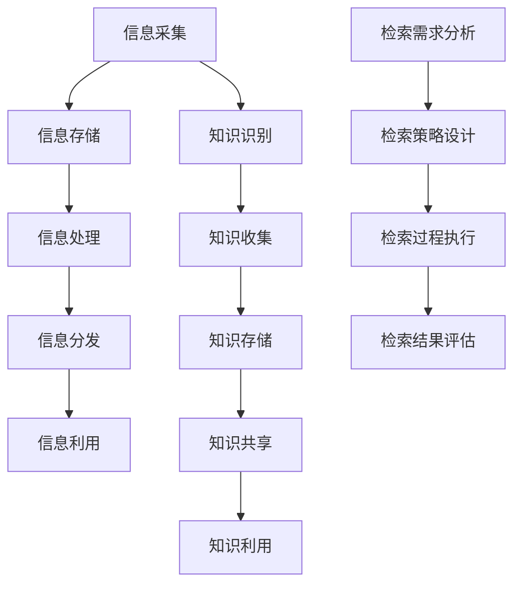

                 

关键词：信息过载、知识管理、信息检索、信息组织、算法、人工智能、技术策略、数据处理、知识图谱、推荐系统、未来展望

> 摘要：随着互联网和大数据技术的迅猛发展，信息过载成为现代生活中的一大难题。如何有效管理和检索信息，已成为企业和个人面临的重大挑战。本文旨在探讨信息过载的成因、影响以及有效的知识管理策略，包括算法原理、数学模型和项目实践，为读者提供一套全面的信息组织与检索指南。

## 1. 背景介绍

### 信息过载的起源与发展

随着互联网的普及和信息技术的飞速发展，信息的获取变得前所未有的便捷。然而，这种便捷性也带来了新的问题——信息过载。信息过载指的是接收和处理的信息量超出了人的处理能力，导致信息过量、冗余、混乱。信息过载的起源可以追溯到20世纪末，随着互联网的普及，人们开始体验到信息量的剧增。

### 信息过载的影响

信息过载对个人和企业都带来了深远的影响。对个人而言，过量的信息可能导致注意力分散、决策困难、压力增加，甚至心理健康问题。对企业而言，信息过载可能影响决策效率、降低员工工作效率、增加运营成本，甚至导致业务中断。因此，解决信息过载问题已成为当务之急。

## 2. 核心概念与联系

### 信息管理的基本概念

信息管理是指对信息的采集、存储、处理、分发和利用的全过程。信息管理的目标是通过有效的组织和处理，使信息更具可用性、可靠性和易访问性。信息管理包括以下几个方面：

- 信息采集：通过互联网、数据库、文件共享等渠道获取信息。
- 信息存储：将信息存储在数据库、文件系统或其他存储介质中。
- 信息处理：对信息进行清洗、转换、整合等处理，使其更符合需求。
- 信息分发：将处理后的信息通过适当的渠道分发到相关人员。
- 信息利用：利用信息进行决策、研究、学习等活动。

### 知识管理的核心原理

知识管理是指通过系统的方法和工具，对知识进行识别、收集、存储、共享和利用的过程。知识管理的目标是通过优化知识的流动，提高组织的学习能力和创新能力。知识管理包括以下几个方面：

- 知识识别：识别组织内部和外部的知识资源。
- 知识收集：通过各种渠道收集有用的知识。
- 知识存储：将知识存储在知识库、文档管理系统等工具中。
- 知识共享：通过内部网络、会议、培训等方式共享知识。
- 知识利用：利用知识进行创新、决策、问题解决等。

### 信息检索的机制

信息检索是指通过特定的方法和工具，从大量信息中查找和获取所需信息的过程。信息检索的基本机制包括：

- 检索需求分析：明确用户的信息需求。
- 检索策略设计：根据需求设计检索策略。
- 检索过程执行：执行检索过程，获取相关结果。
- 检索结果评估：评估检索结果的质量和相关性。

### Mermaid 流程图

下面是一个关于信息管理、知识管理和信息检索的 Mermaid 流程图：

## 3. 核心算法原理 & 具体操作步骤

### 3.1 算法原理概述

在信息管理和知识管理中，常用的算法包括信息过滤、信息检索、知识图谱构建、推荐系统等。这些算法的核心目标都是提高信息处理和知识利用的效率。

- 信息过滤算法：通过分析用户的兴趣和行为，过滤掉不相关的信息，提高信息的可用性。
- 信息检索算法：通过建立索引、关键词匹配等方法，快速查找所需信息。
- 知识图谱构建：通过节点和边的关系，构建知识网络，实现知识的关联和整合。
- 推荐系统：基于用户的兴趣和偏好，推荐相关的内容和资源。

### 3.2 算法步骤详解

#### 3.2.1 信息过滤算法

信息过滤算法的基本步骤如下：

1. 用户兴趣建模：收集用户的兴趣和行为数据，建立用户兴趣模型。
2. 信息评估：对获取的信息进行评估，判断其与用户兴趣的相关性。
3. 过滤策略：根据评估结果，设计过滤策略，过滤掉不相关的信息。
4. 结果输出：输出过滤后的信息，供用户使用。

#### 3.2.2 信息检索算法

信息检索算法的基本步骤如下：

1. 检索需求分析：明确用户的信息需求。
2. 索引构建：建立索引，以便快速查找信息。
3. 关键词匹配：根据用户输入的关键词，匹配索引中的信息。
4. 检索结果排序：根据匹配度对检索结果进行排序。
5. 结果输出：输出排序后的检索结果。

#### 3.2.3 知识图谱构建

知识图谱构建的基本步骤如下：

1. 数据收集：从各种渠道收集结构化或半结构化的数据。
2. 数据清洗：去除重复、错误和不完整的数据。
3. 数据建模：将数据转化为节点和边的关系模型。
4. 知识整合：将多个知识源整合为一个统一的视图。
5. 知识查询：提供知识查询接口，供用户查询和使用。

#### 3.2.4 推荐系统

推荐系统的基本步骤如下：

1. 用户画像：收集用户的兴趣、行为等数据，建立用户画像。
2. 项

