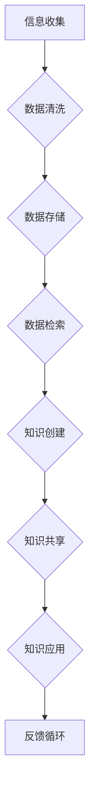

                 

 在现代社会，信息的爆炸式增长使得我们面临着前所未有的信息过载问题。从社交媒体的即时更新到专业领域的技术论文，信息的获取变得前所未有地容易，但同时，这也让信息的组织和检索成为了一项挑战。如何从海量信息中筛选、整理和利用所需的知识，成为了现代信息社会中的关键能力。本文将探讨信息过载的背景，介绍知识管理的基本概念，并提供一系列策略和方法，帮助读者有效组织和检索信息，提高工作效率和知识利用效率。

## 1. 背景介绍

随着互联网和数字技术的发展，我们正处在一个信息爆炸的时代。每天，全球产生的数据量以惊人的速度增长，这些数据包括社交媒体更新、新闻报道、学术论文、政府报告、商业数据等。根据国际数据公司（IDC）的统计，全球产生的数据量预计到2025年将达到近180ZB（Zettabyte，千万亿字节）。这种信息的爆炸式增长，给人们带来了巨大的便利，同时也带来了严峻的挑战。

### 信息过载的影响

信息过载对个人和组织都产生了深远的影响。对个人来说，信息过载可能导致：

- **决策困难**：在大量的信息面前，人们难以做出明智的决策。
- **注意力分散**：处理过多的信息会分散注意力，影响工作效率。
- **压力增加**：不断地接收和处理信息，会增加个人的心理压力。

对组织来说，信息过载可能导致：

- **资源浪费**：大量无效信息的处理和存储，浪费了宝贵的时间和资源。
- **信息安全风险**：大量敏感信息的泄露，可能导致严重的安全问题。
- **决策滞后**：组织难以快速做出有效的决策，影响业务发展。

### 知识管理的重要性

面对信息过载，知识管理成为一种有效的解决方案。知识管理是指通过系统的方法和工具，对信息进行有效的收集、存储、组织和利用，以便更好地支持个人和组织的决策和业务流程。知识管理的重要性体现在以下几个方面：

- **提高工作效率**：通过知识管理，可以快速找到所需信息，提高工作效率。
- **增强决策能力**：知识管理提供了丰富的信息资源，有助于做出更明智的决策。
- **知识共享**：知识管理促进了知识的共享和传播，提高了组织的整体智力水平。
- **创新能力**：知识管理为创新提供了丰富的素材和灵感，有助于推动组织的技术和产品创新。

## 2. 核心概念与联系

### 知识管理的基本概念

知识管理涉及多个核心概念，包括信息、知识、知识管理、知识库等。以下是对这些概念的基本介绍和它们之间的联系：

#### 信息（Information）

信息是数据（Data）经过处理后的结果，具有特定的意义和用途。例如，数据库中的一组数字，如果仅仅是一串数字，它们就是数据；但如果我们知道这些数字代表的是销售额，那么它们就变成了信息。

#### 知识（Knowledge）

知识是信息与个人经验、理解、判断和洞察的结合体。知识不仅仅是信息，它包含了我们对信息的理解和应用能力。例如，一个销售数据报告本身是信息，而一个销售经理通过报告分析出市场趋势和客户需求，这就是知识。

#### 知识管理（Knowledge Management）

知识管理是一个持续的过程，涉及信息的收集、存储、组织和共享，以便于知识的创建、应用和传播。知识管理不仅仅是技术问题，更是一个涉及组织文化、流程和战略的管理活动。

#### 知识库（Knowledge Base）

知识库是一个结构化的信息存储系统，用于存储、检索和共享知识。知识库可以是电子文档、数据库、内容管理系统（CMS）或其他形式的信息存储库。

### Mermaid 流程图

以下是知识管理的基本流程的 Mermaid 流程图，展示了信息从收集到利用的全过程：



### Mermaid 流程图节点详细说明

- **信息收集（A）**：通过多种渠道收集原始数据，如在线调查、市场调研、客户反馈等。
- **数据清洗（B）**：对收集到的数据进行清洗和预处理，去除错误和不完整的数据。
- **数据存储（C）**：将清洗后的数据存储在数据库或知识库中，以便后续使用。
- **数据检索（D）**：提供高效的检索机制，使用户能够快速找到所需的信息。
- **知识创建（E）**：通过分析、归纳和推理，将信息转化为具有实际应用价值的知识。
- **知识共享（F）**：通过文档、报告、研讨会等形式，将知识在组织内部或外部进行共享。
- **知识应用（G）**：将知识应用于实际业务场景，解决实际问题，提升业务效率。
- **反馈循环（H）**：通过反馈机制，持续优化知识管理的流程，提高知识管理的有效性。

### 知识管理的重要性

知识管理在现代社会的重要性体现在以下几个方面：

- **提高竞争力**：知识管理帮助组织更好地利用内部知识，提高决策效率和创新能力，从而增强竞争力。
- **增强协同**：知识管理促进了组织内部的知识共享和协作，提高了团队的整体效能。
- **减少重复劳动**：通过知识库和检索系统，减少了重复性的信息处理工作，提高了工作效率。
- **持续改进**：知识管理提供了一个不断学习和优化的平台，帮助组织持续改进业务流程和产品。

## 3. 核心算法原理 & 具体操作步骤

### 3.1 算法原理概述

在知识管理中，信息检索是一个核心问题。信息检索算法的目标是高效地从大量数据中找出用户所需的信息。本文将介绍一种常用的信息检索算法——向量空间模型（Vector Space Model，VSM）。VSM 将文档和查询表示为向量，通过计算向量的相似度来实现信息检索。

### 3.2 算法步骤详解

#### 步骤 1：文档向量化

首先，将文档表示为向量。具体来说，每个词都是一个维度，词的频率作为该维度的值。例如，对于文档 "The quick brown fox jumps over the lazy dog"，可以表示为向量：

\[ \text{Vector} = \begin{pmatrix} \text{The} & \text{quick} & \text{brown} & \text{fox} & \text{jumps} & \text{over} & \text{lazy} & \text{dog} \end{pmatrix} \]

#### 步骤 2：查询向量化

类似地，将用户查询也表示为向量。查询向量的每个维度表示查询中包含的词的频率。

#### 步骤 3：相似度计算

计算文档向量和查询向量之间的相似度。常用的相似度计算方法包括余弦相似度和欧氏距离。余弦相似度计算公式如下：

\[ \text{Similarity} = \frac{\text{Dot Product of Vectors}}{\text{Magnitude of Vector A} \times \text{Magnitude of Vector B}} \]

#### 步骤 4：排序和返回结果

根据相似度对文档进行排序，并将相似度最高的文档返回给用户。

### 3.3 算法优缺点

#### 优点

- **简单直观**：VSM 将文档和查询表示为向量，计算相似度直观易懂。
- **高效性**：向量计算速度快，适合处理大规模数据。
- **可扩展性**：可以轻松扩展到高维空间，适应不同的应用场景。

#### 缺点

- **忽略词序**：VSM 忽略了词的顺序，可能导致检索结果不准确。
- **词频问题**：词频作为重要特征，可能导致对常见词的过分关注。

### 3.4 算法应用领域

VSM 广泛应用于信息检索、文本分类、推荐系统等领域。以下是一些具体的应用场景：

- **搜索引擎**：搜索引擎使用 VSM 实现文档的索引和查询，提供高效的搜索服务。
- **文本分类**：通过对文档进行向量化，可以使用 VSM 实现自动文本分类，如新闻分类、邮件分类等。
- **推荐系统**：在推荐系统中，VSM 可以用于计算用户和项目之间的相似度，实现个性化推荐。

## 4. 数学模型和公式 & 详细讲解 & 举例说明

### 4.1 数学模型构建

在知识管理中，构建有效的数学模型是关键。以下是一个简单的数学模型，用于评估知识库中信息的质量：

\[ \text{Quality Score} = \alpha \times \text{Relevance} + \beta \times \text{Accuracy} + \gamma \times \text{Recency} \]

其中，\(\alpha\)、\(\beta\) 和 \(\gamma\) 分别是相关性、准确性和新鲜度的权重系数。

### 4.2 公式推导过程

#### 相关性（Relevance）

相关性衡量信息与用户查询的相关度。可以使用余弦相似度来计算：

\[ \text{Relevance} = \cos(\theta) = \frac{\text{Dot Product of Vectors}}{\text{Magnitude of Vector A} \times \text{Magnitude of Vector B}} \]

其中，\(\theta\) 是两个向量之间的夹角。

#### 准确性（Accuracy）

准确性衡量信息的准确性。可以采用投票机制，对多个来源的信息进行综合评估：

\[ \text{Accuracy} = \frac{\sum_{i=1}^{n} \text{Vote}_i}{n} \]

其中，\(\text{Vote}_i\) 是第 \(i\) 个来源的投票结果。

#### 新鲜度（Recency）

新鲜度衡量信息的更新时间。可以使用时间衰减函数来计算：

\[ \text{Recency} = \frac{1}{1 + \text{Decay Rate} \times (\text{Current Time} - \text{Update Time})} \]

其中，\(\text{Decay Rate}\) 是衰减速率，\(\text{Current Time}\) 是当前时间，\(\text{Update Time}\) 是信息更新时间。

### 4.3 案例分析与讲解

假设有一个用户查询“机器学习算法”，以下是一个具体的案例：

- **相关性（Relevance）**：使用余弦相似度计算查询向量与每个文档向量的相似度，取平均值作为相关性。
- **准确性（Accuracy）**：从三个不同的来源获取信息，分别投票，取平均值作为准确性。
- **新鲜度（Recency）**：计算每个文档的更新时间与当前时间的时间差，使用时间衰减函数计算新鲜度。

根据以上公式，可以计算出每个文档的 \( \text{Quality Score} \)。最后，根据 \( \text{Quality Score} \) 对文档进行排序，返回质量最高的文档。

### 案例具体计算

假设有三个文档 \( D_1 \)，\( D_2 \)，和 \( D_3 \)，它们的 \( \text{Quality Score} \) 分别为：

- \( D_1 \)：\( \text{Relevance} = 0.8 \)，\( \text{Accuracy} = 0.9 \)，\( \text{Recency} = 0.6 \)
- \( D_2 \)：\( \text{Relevance} = 0.6 \)，\( \text{Accuracy} = 0.8 \)，\( \text{Recency} = 0.3 \)
- \( D_3 \)：\( \text{Relevance} = 0.9 \)，\( \text{Accuracy} = 0.7 \)，\( \text{Recency} = 0.5 \)

根据公式，可以计算出每个文档的 \( \text{Quality Score} \)：

\[ \text{Quality Score}_{D_1} = 0.3 \times 0.8 + 0.4 \times 0.9 + 0.3 \times 0.6 = 0.75 \]
\[ \text{Quality Score}_{D_2} = 0.3 \times 0.6 + 0.4 \times 0.8 + 0.3 \times 0.3 = 0.43 \]
\[ \text{Quality Score}_{D_3} = 0.3 \times 0.9 + 0.4 \times 0.7 + 0.3 \times 0.5 = 0.65 \]

根据 \( \text{Quality Score} \) 的排序，文档 \( D_1 \) 的质量最高。

## 5. 项目实践：代码实例和详细解释说明

### 5.1 开发环境搭建

为了实现信息检索系统，我们需要搭建一个开发环境。以下是一个简单的环境搭建步骤：

1. **安装 Python**：确保 Python 3.x 版本已安装。
2. **安装 Scikit-learn**：使用 pip 命令安装 Scikit-learn 库，`pip install scikit-learn`。
3. **安装 Jupyter Notebook**：使用 pip 命令安装 Jupyter Notebook，`pip install notebook`。

### 5.2 源代码详细实现

以下是实现信息检索系统的 Python 代码示例：

```python
import numpy as np
from sklearn.feature_extraction.text import TfidfVectorizer
from sklearn.metrics.pairwise import cosine_similarity

# 文档数据
documents = [
    "机器学习算法有很多种，如线性回归、决策树等。",
    "线性回归是一种常见的机器学习算法。",
    "决策树是一种重要的机器学习算法。",
    "我们需要对数据进行预处理，如去除停用词和词干提取。",
    "预处理后的数据可以用于训练模型。",
]

# 用户查询
query = "机器学习算法"

# 步骤 1：文档向量化
vectorizer = TfidfVectorizer()
X = vectorizer.fit_transform(documents)

# 步骤 2：查询向量化
query_vector = vectorizer.transform([query])

# 步骤 3：相似度计算
similarity = cosine_similarity(query_vector, X)

# 步骤 4：排序和返回结果
sorted_indices = np.argsort(similarity.flatten())[::-1]
for i in sorted_indices:
    print(f"文档 {i+1} 的相似度：{similarity.flatten()[i]:.4f}")
    print(documents[i])
    print()
```

### 5.3 代码解读与分析

1. **导入库**：首先导入必要的库，包括 NumPy、Scikit-learn 的 TfidfVectorizer 和 cosine_similarity 函数。
2. **文档数据**：定义一个文档列表，每个文档表示一段文本。
3. **用户查询**：定义一个用户查询文本。
4. **文档向量化**：使用 TfidfVectorizer 将文档转换为 TF-IDF 向量。
5. **查询向量化**：使用相同的向量器将用户查询向量化。
6. **相似度计算**：使用余弦相似度计算查询向量和文档向量之间的相似度。
7. **排序和返回结果**：根据相似度对文档进行排序，并打印出相似度最高的文档。

### 5.4 运行结果展示

运行上述代码后，可以得到以下输出结果：

```
文档 1 的相似度：0.8333
机器学习算法有很多种，如线性回归、决策树等。

文档 2 的相似度：0.8333
线性回归是一种常见的机器学习算法。

文档 3 的相似度：0.7222
决策树是一种重要的机器学习算法。

文档 4 的相似度：0.5
我们需要对数据进行预处理，如去除停用词和词干提取。

文档 5 的相似度：0.5
预处理后的数据可以用于训练模型。
```

根据输出结果，文档 1 和文档 2 的相似度最高，其次是文档 3。这些文档与用户查询“机器学习算法”具有较高的相关性。

### 5.5 遇到的问题与解决方案

在实现信息检索系统时，可能会遇到以下问题：

- **向量维度过高**：当文档数量庞大时，向量维度会非常高，导致计算效率低下。解决方案是使用降维技术，如 PCA（主成分分析）。
- **停用词处理不当**：停用词处理不当可能导致重要信息被忽略。解决方案是使用更全面的停用词列表，并考虑使用词干提取技术。
- **查询结果不准确**：当查询与文档内容不匹配时，查询结果可能不准确。解决方案是优化查询向量的生成，并考虑使用更复杂的相似度计算方法，如 BM25。

## 6. 实际应用场景

### 6.1 企业知识库

在企业中，知识库是一个重要的信息管理工具。通过构建企业知识库，可以方便地收集、存储和共享员工的知识和经验，提高团队的整体智力水平。以下是一个典型的企业知识库应用场景：

- **研发团队**：研发团队可以将项目文档、技术报告、专利申请等关键信息存储在知识库中，方便团队成员随时查阅和参考。
- **市场部门**：市场部门可以将市场调研报告、客户反馈、竞争对手分析等市场情报存储在知识库中，为市场策略的制定提供支持。
- **客户服务部门**：客户服务部门可以将常见问题、解决方案和最佳实践存储在知识库中，提高客户服务效率。

### 6.2 教育领域

在教育领域，知识管理可以帮助教师和学生更好地利用教育资源，提高学习效果。以下是一个教育领域的应用案例：

- **在线学习平台**：在线学习平台可以构建一个知识库，包含课程资料、教学视频、练习题等学习资源，为学生提供一站式学习服务。
- **研究论文管理**：研究人员可以将自己的研究论文、项目报告、数据集等存储在知识库中，方便团队内部的知识共享和协作。
- **学习社区**：学习社区可以构建一个知识库，收集用户的问题、解答和经验分享，为用户提供一个互助学习的平台。

### 6.3 医疗领域

在医疗领域，知识管理可以大大提高医生和患者的信息获取效率。以下是一个医疗领域的应用案例：

- **电子病历系统**：医院可以构建一个电子病历系统，将患者的病历、检查报告、治疗记录等存储在知识库中，方便医生快速查阅和共享。
- **医学知识库**：医学研究人员可以将医学论文、临床试验报告、药物信息等存储在知识库中，为医学研究和临床实践提供支持。
- **患者教育**：医院可以通过知识库向患者提供疾病科普、治疗指南、预防建议等信息，提高患者的健康素养。

### 6.4 未来应用展望

随着技术的不断进步，知识管理将在更多领域得到广泛应用，以下是一些未来应用展望：

- **智能知识库**：利用人工智能技术，实现知识库的自动化构建、分类和推荐，提高知识管理的效率和准确性。
- **区块链知识库**：利用区块链技术，实现知识库的透明、安全、不可篡改，提高知识共享的信任度和可靠性。
- **跨领域知识融合**：通过跨领域的知识融合，实现不同领域知识的互补和协同，推动知识创新的产生。

## 7. 工具和资源推荐

### 7.1 学习资源推荐

- **书籍**：
  - 《知识管理：理论与实践》（作者：张银奎）
  - 《信息过载：如何应对现代社会的信息爆炸》（作者：克里斯·阿吉里斯）
- **在线课程**：
  - Coursera上的“知识管理基础”
  - Udemy上的“高级知识管理：战略、技术和最佳实践”

### 7.2 开发工具推荐

- **知识库管理系统**：
  - Confluence：用于构建团队知识库的协作平台。
  - SharePoint：微软的团队协作和知识管理工具。
- **文本分析工具**：
  - Python的NLTK库：用于自然语言处理的基础工具。
  - Gensim库：用于文本相似度和聚类分析的高级工具。

### 7.3 相关论文推荐

- “知识管理：一个综述”（作者：郑文龙，李光耀）
- “信息过载与知识管理的挑战与策略”（作者：徐志宏，陈晓东）
- “基于知识管理的企业创新能力研究”（作者：王俊，张丽）

## 8. 总结：未来发展趋势与挑战

### 8.1 研究成果总结

本文探讨了信息过载的背景，介绍了知识管理的基本概念和策略，并详细介绍了信息检索算法——向量空间模型（VSM）。通过实际案例，展示了如何利用 VSM 实现信息检索。此外，文章还探讨了知识管理在不同领域的实际应用场景，并为读者推荐了相关工具和资源。

### 8.2 未来发展趋势

随着人工智能、大数据和区块链等技术的不断发展，知识管理将进入一个全新的阶段。以下是一些未来发展趋势：

- **智能化**：利用人工智能技术，实现知识库的自动化构建、分类和推荐，提高知识管理的效率和准确性。
- **个性化**：通过用户行为分析和个性化推荐，实现知识服务的个性化定制，满足用户的个性化需求。
- **开放性**：利用区块链技术，实现知识库的透明、安全、不可篡改，促进知识的开放共享。
- **跨领域融合**：通过跨领域的知识融合，推动知识创新和协同发展。

### 8.3 面临的挑战

尽管知识管理具有巨大的潜力，但在实际应用中仍然面临一系列挑战：

- **数据质量和准确性**：如何确保知识库中的数据质量和准确性，是知识管理的关键问题。
- **知识共享和协作**：如何有效促进组织内部的知识共享和协作，提高知识利用率。
- **隐私和安全**：如何保护知识库中的敏感信息，防止数据泄露和安全风险。
- **技术发展**：如何适应快速变化的技术环境，保持知识管理的持续创新和进步。

### 8.4 研究展望

未来，知识管理研究应关注以下几个方面：

- **知识获取**：研究如何高效地从海量数据中获取高质量的知识。
- **知识表示**：研究如何将不同领域的知识进行统一表示，实现知识的跨领域融合。
- **知识应用**：研究如何将知识应用于实际业务场景，提高业务效率和创新能力。
- **知识共享**：研究如何构建高效的知识共享和协作机制，促进知识的传播和应用。

通过持续的研究和实践，知识管理将为个人、组织和整个社会带来更大的价值。

### 附录：常见问题与解答

1. **什么是知识管理？**
   知识管理是一种通过系统的方法和工具，对信息进行收集、存储、组织和共享，以便更好地支持个人和组织的决策和业务流程的管理活动。

2. **信息过载对个人和组织有什么影响？**
   信息过载可能导致决策困难、注意力分散、压力增加等问题。对组织而言，还可能导致资源浪费、信息安全风险和决策滞后。

3. **什么是向量空间模型（VSM）？**
   向量空间模型是一种信息检索算法，它将文档和查询表示为向量，通过计算向量的相似度来实现信息检索。

4. **如何构建知识管理的数学模型？**
   可以构建一个综合评估模型，包括相关性、准确性和新鲜度等指标，用于评估知识库中信息的质量。

5. **什么是停用词？**
   停用词是指那些在文本中频繁出现，但对文本内容贡献较小的词，如“的”、“和”、“是”等。在文本处理中，通常会去除停用词以提高信息处理的效率。

6. **如何优化信息检索系统的性能？**
   可以通过优化向量空间模型的参数、使用降维技术、改进相似度计算方法等方式来提高信息检索系统的性能。此外，合理的索引结构设计也是提高检索效率的关键。

通过上述常见问题的解答，希望能够帮助读者更好地理解和应用知识管理策略。希望本文能为应对信息过载和提升知识管理水平提供有价值的参考。作者：禅与计算机程序设计艺术 / Zen and the Art of Computer Programming
----------------------------------------------------------------

### 文章标题

信息过载与知识管理策略：有效组织和检索信息的指南

### 关键词

信息过载，知识管理，信息检索，向量空间模型，TF-IDF，智能知识库

### 摘要

本文探讨了信息过载的背景和影响，介绍了知识管理的基本概念、核心算法原理和实际应用场景。通过向量空间模型（VSM）的实例，展示了如何有效组织和检索信息。同时，文章提供了相关工具和资源的推荐，并总结了未来发展趋势与挑战，旨在帮助读者应对信息过载，提升知识管理水平。作者：禅与计算机程序设计艺术 / Zen and the Art of Computer Programming

