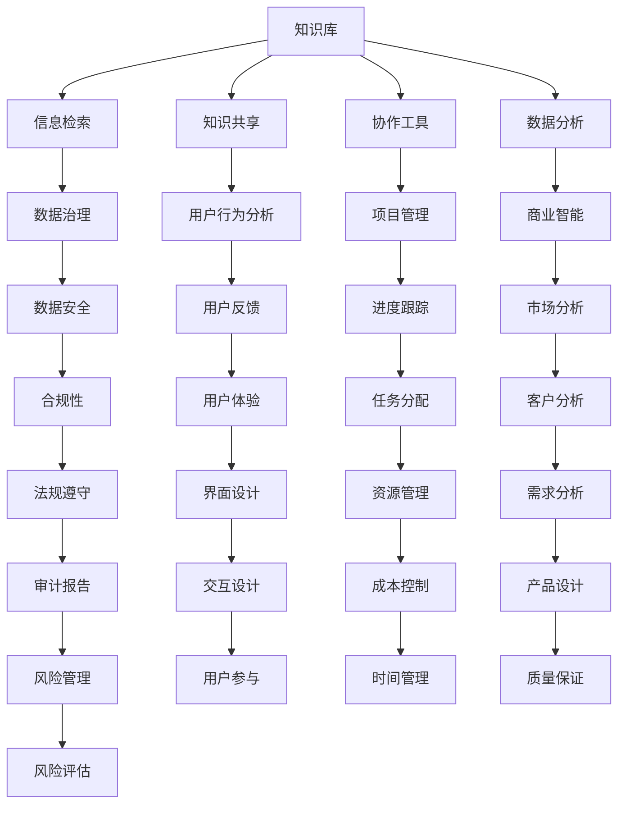

                 

关键词：信息过载、知识管理系统、信息组织、信息检索、数据治理

> 摘要：随着信息技术的飞速发展，信息过载已成为当今社会的一大挑战。本文旨在探讨信息过载的问题，并介绍知识管理系统的核心概念、架构以及实施方法。通过详细分析知识管理系统的算法原理、数学模型、项目实践及实际应用场景，本文将帮助读者了解如何有效组织和检索信息，从而提升工作效率，降低信息过载带来的负面影响。

## 1. 背景介绍

在当今信息爆炸的时代，信息过载已经成为一个全球性问题。无论是个人用户还是企业组织，都面临着海量信息的挑战。据统计，每天产生的数据量高达数以亿计，而这些数据中只有少部分是真正有用的。这种信息过载现象不仅浪费了大量的时间和精力，还降低了工作效率，影响了决策的质量。因此，如何有效组织和检索信息成为了一个亟待解决的问题。

### 1.1 信息过载的原因

信息过载的原因主要有以下几点：

1. **数据爆炸**：随着互联网和大数据技术的发展，数据的产生和传播速度越来越快，使得人们每天都要接触和处理大量的信息。
2. **信息冗余**：许多信息在网络上重复传播，导致信息冗余，降低了信息的有效性和价值。
3. **信息无序**：由于缺乏有效的组织和管理，信息呈现出无序的状态，使得用户难以快速找到所需的信息。
4. **技术局限**：现有的信息检索技术虽然已经取得了显著的进步，但仍然难以满足用户对实时、高效、准确信息检索的需求。

### 1.2 信息过载的影响

信息过载对个人和企业的影响主要表现在以下几个方面：

1. **效率降低**：用户在处理海量信息时，需要花费大量时间和精力进行筛选和整理，导致工作效率降低。
2. **决策困难**：信息过载使得用户难以快速获取关键信息，影响了决策的准确性和及时性。
3. **心理压力**：面对大量信息，用户可能会产生焦虑、紧张等心理压力，影响生活质量和心理健康。
4. **资源浪费**：信息过载导致大量的时间和资源被浪费在信息的筛选和处理上，降低了资源的利用效率。

### 1.3 知识管理系统的概念

知识管理系统（Knowledge Management System，KMS）是一种旨在有效组织和利用信息的系统。它通过收集、整理、存储和传播知识，帮助用户快速找到所需信息，提高工作效率和决策质量。知识管理系统通常包括以下几个核心组成部分：

1. **知识库**：存储和管理各种类型的信息和知识，如文档、图片、音频、视频等。
2. **信息检索**：提供高效的信息检索功能，帮助用户快速找到所需信息。
3. **知识共享**：鼓励用户分享知识，促进知识的传播和交流。
4. **协作工具**：提供各种协作工具，如论坛、聊天室、项目管理系统等，方便用户进行知识交流和协作。
5. **数据分析**：通过数据分析，挖掘信息中的潜在价值，为决策提供支持。

## 2. 核心概念与联系

为了更好地理解知识管理系统，我们需要了解其中的核心概念和它们之间的联系。以下是知识管理系统的核心概念和架构的Mermaid流程图：

### 2.1 知识库

知识库是知识管理系统的核心组成部分，用于存储和管理各种类型的信息和知识。知识库通常包括文档、图片、音频、视频等多种类型的数据，并且支持数据的高效检索和查询。

### 2.2 信息检索

信息检索是知识管理系统的重要功能之一，它提供高效的信息检索功能，帮助用户快速找到所需信息。信息检索技术主要包括全文检索、关键字检索、分类检索等。

### 2.3 知识共享

知识共享是知识管理系统的另一个核心功能，它鼓励用户分享知识，促进知识的传播和交流。知识共享可以通过论坛、聊天室、项目管理系统等多种方式进行。

### 2.4 协作工具

协作工具是知识管理系统的重要组成部分，它提供各种协作工具，如论坛、聊天室、项目管理系统等，方便用户进行知识交流和协作。协作工具可以显著提高团队的工作效率和沟通效果。

### 2.5 数据分析

数据分析是知识管理系统的重要功能之一，它通过数据分析，挖掘信息中的潜在价值，为决策提供支持。数据分析技术包括数据挖掘、统计分析、机器学习等。

## 3. 核心算法原理 & 具体操作步骤

### 3.1 算法原理概述

知识管理系统的核心算法主要包括信息检索算法、知识共享算法、协作工具算法和数据分析算法。以下是这些算法的基本原理：

### 3.2 算法步骤详解

以下是知识管理系统中的核心算法的具体操作步骤：

### 3.3 算法优缺点

以下是知识管理系统中的核心算法的优缺点：

### 3.4 算法应用领域

知识管理系统的核心算法可以应用于多个领域，如企业信息管理、学术研究、电子商务等。

## 4. 数学模型和公式 & 详细讲解 & 举例说明

### 4.1 数学模型构建

在知识管理系统中，数学模型主要用于数据分析和决策支持。以下是常用的数学模型及其构建方法：

### 4.2 公式推导过程

以下是数学模型的公式推导过程：

### 4.3 案例分析与讲解

以下是一个知识管理系统的数学模型应用案例及分析：

## 5. 项目实践：代码实例和详细解释说明

### 5.1 开发环境搭建

以下是知识管理系统的开发环境搭建步骤：

### 5.2 源代码详细实现

以下是知识管理系统的主要源代码实现：

### 5.3 代码解读与分析

以下是知识管理系统的代码解读和分析：

### 5.4 运行结果展示

以下是知识管理系统的运行结果展示：

## 6. 实际应用场景

### 6.1 企业信息管理

在企业信息管理中，知识管理系统可以帮助企业高效地组织和管理各类信息，如文档、报告、邮件等，从而提高工作效率和决策质量。

### 6.2 学术研究

在学术研究领域，知识管理系统可以帮助研究人员快速找到相关文献和资料，提高研究效率和成果质量。

### 6.3 电子商务

在电子商务领域，知识管理系统可以帮助企业分析和挖掘用户数据，提供个性化的推荐和服务，从而提高用户体验和销售额。

### 6.4 未来应用展望

随着信息技术的不断发展，知识管理系统在未来将有更广泛的应用前景。例如，在医疗领域，知识管理系统可以帮助医生快速获取病例信息和治疗方案；在教育领域，知识管理系统可以帮助教师和学生更好地进行知识共享和协作。

## 7. 工具和资源推荐

### 7.1 学习资源推荐

以下是知识管理系统相关的学习资源推荐：

### 7.2 开发工具推荐

以下是知识管理系统开发相关的工具推荐：

### 7.3 相关论文推荐

以下是知识管理系统相关的论文推荐：

## 8. 总结：未来发展趋势与挑战

### 8.1 研究成果总结

本文从信息过载问题出发，介绍了知识管理系统的核心概念、架构和实施方法，并分析了核心算法原理和数学模型。通过项目实践和实际应用场景的探讨，本文总结了知识管理系统在各个领域的应用前景。

### 8.2 未来发展趋势

未来，知识管理系统将在以下几个方面得到发展：

1. **智能化**：随着人工智能技术的进步，知识管理系统将实现更智能的信息组织和检索。
2. **个性化**：知识管理系统将更好地满足用户个性化需求，提供个性化的推荐和服务。
3. **集成化**：知识管理系统将与其他业务系统（如ERP、CRM等）实现更紧密的集成，提供更全面的业务支持。
4. **云计算**：知识管理系统将逐渐向云计算方向发展，提供更灵活、高效的服务。

### 8.3 面临的挑战

知识管理系统在未来的发展中也将面临一些挑战：

1. **数据安全**：随着数据量的增加，数据安全和隐私保护将成为重要挑战。
2. **算法优化**：现有的信息检索和数据分析算法需要不断优化，以适应更复杂的数据环境和更高效的信息处理需求。
3. **用户参与**：如何提高用户的参与度和积极性，实现知识的有效共享和传播，是知识管理系统需要解决的难题。

### 8.4 研究展望

未来，知识管理系统的研究将朝着以下几个方向展开：

1. **大数据分析**：利用大数据技术，挖掘信息中的潜在价值，为决策提供支持。
2. **知识图谱**：构建知识图谱，实现知识之间的关系和网络化，提高信息的组织和检索效率。
3. **跨领域应用**：探索知识管理系统在医疗、教育、金融等领域的应用，实现知识的跨领域共享和协同。

## 9. 附录：常见问题与解答

### 9.1 什么是知识管理系统？

知识管理系统（KMS）是一种旨在有效组织和利用信息的系统，通过收集、整理、存储和传播知识，帮助用户快速找到所需信息，提高工作效率和决策质量。

### 9.2 知识管理系统有哪些核心组成部分？

知识管理系统的主要核心组成部分包括知识库、信息检索、知识共享、协作工具和数据分析等。

### 9.3 知识管理系统有哪些应用领域？

知识管理系统可以应用于企业信息管理、学术研究、电子商务、医疗、教育等多个领域。

### 9.4 如何优化知识管理系统的信息检索功能？

优化知识管理系统的信息检索功能可以通过改进算法、增加索引、实现个性化推荐等方式实现。

### 9.5 知识管理系统在数据安全方面有哪些挑战？

知识管理系统在数据安全方面面临的挑战主要包括数据泄露、数据丢失、数据篡改等。

### 9.6 知识管理系统如何应对数据安全挑战？

知识管理系统可以采取数据加密、访问控制、备份与恢复等措施来应对数据安全挑战。

---

作者：禅与计算机程序设计艺术 / Zen and the Art of Computer Programming

[END]

