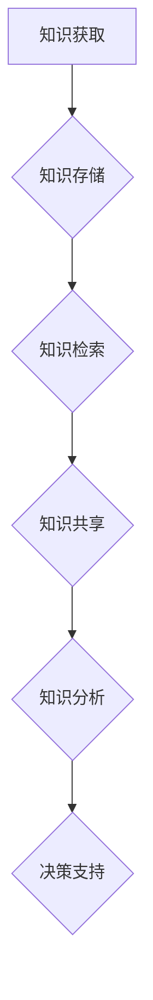

                 

在当今的信息时代，我们面临着越来越多的数据和信息。据估计，全球每天产生的数据量高达约2.5 quintillion字节。这种信息过载现象对我们的工作效率、决策质量以及整体生活质量都产生了深远的影响。为了应对这一挑战，知识管理系统（Knowledge Management System, KMS）的实施变得至关重要。本文旨在为您提供一整套指南，帮助您理解和实施有效的知识管理系统，以更好地组织和检索信息。

## 关键词

- 信息过载
- 知识管理系统
- 信息组织
- 信息检索
- 数据管理
- 知识共享
- 数据库

## 摘要

本文首先介绍了信息过载现象及其影响，接着阐述了知识管理系统的重要性。随后，文章详细讨论了知识管理系统的核心概念与架构，以及核心算法原理和具体操作步骤。此外，还介绍了数学模型和公式的构建与推导，并通过项目实践展示了知识管理系统的实际应用。最后，文章对知识管理系统在实际应用场景中的表现进行了分析，并提出了未来的发展方向和面临的挑战。

## 1. 背景介绍

随着互联网和数字技术的飞速发展，我们进入了一个信息爆炸的时代。海量数据不断涌现，企业、组织和个人都在努力应对这种信息过载现象。信息过载不仅影响了我们的工作效率，还可能导致决策失误，甚至影响心理健康。据调查，员工每天在处理邮件、报告和其他文档上花费的时间高达几个小时。这种无休止的信息洪流使得许多人感到不堪重负，无法有效地利用信息。

### 信息过载的影响

1. **工作效率下降**：员工在处理大量信息时，容易分心和注意力不集中，导致工作效率降低。
2. **决策质量受损**：信息过载使得决策者难以从海量的信息中提取关键信息，从而影响决策的质量。
3. **心理健康问题**：长时间处于信息过载的状态，容易导致压力和焦虑等心理健康问题。

### 知识管理系统的需求

为了解决信息过载问题，我们需要有效的知识管理系统。知识管理系统是一种旨在通过组织、存储、共享和利用知识来提高组织效率和创新能力的工具。知识管理系统的作用包括：

1. **信息组织**：通过分类、标签和索引等手段，使信息更加易于检索和管理。
2. **知识共享**：促进组织内部的知识交流和共享，提高员工的技能和知识水平。
3. **决策支持**：提供基于数据的分析和报告，帮助决策者做出更明智的决策。

## 2. 核心概念与联系

### 2.1 知识管理

知识管理（Knowledge Management, KM）是一种旨在通过组织、存储、共享和利用知识来提高组织效率和创新能力的实践。知识管理的过程包括知识的获取、共享、应用和创新。

#### 知识获取

知识获取是知识管理的第一步，它包括从内部和外部获取知识。内部知识通常来源于员工的实践经验、文件和数据库，而外部知识则来源于行业报告、学术论文和竞争对手的信息。

#### 知识共享

知识共享是知识管理的核心，它通过多种方式促进知识的流动和传播。知识共享的方式包括面对面的交流、在线讨论、知识库和社交媒体等。

#### 知识应用

知识应用是将知识转化为实际行动的过程。这包括将知识用于解决实际问题、制定策略和改进流程等。

#### 知识创新

知识创新是知识管理的最终目标，它通过不断迭代和创新，提高组织的知识水平和创新能力。

### 2.2 知识管理系统

知识管理系统（Knowledge Management System, KMS）是一种旨在实现知识管理的软件或平台。KMS通常包含以下核心功能：

#### 知识存储

知识存储是指将知识存储在数据库、文档管理系统或其他存储设备中，以便于长期保存和检索。

#### 知识检索

知识检索是指通过分类、标签、搜索等手段，快速找到所需的知识。

#### 知识共享

知识共享是指通过多种方式，如内部社交网络、论坛、邮件列表等，促进知识的流动和传播。

#### 知识分析

知识分析是指通过对知识库中的知识进行统计、分析和挖掘，提取有价值的信息。

#### 决策支持

决策支持是指通过知识管理系统提供的分析和报告，帮助决策者做出更明智的决策。

### 2.3 Mermaid 流程图

以下是一个简化的知识管理系统流程图：



## 3. 核心算法原理 & 具体操作步骤

### 3.1 算法原理概述

知识管理系统的核心算法主要涉及信息检索和知识推理。信息检索算法旨在快速准确地从海量数据中找到用户所需的信息。常用的检索算法包括基于内容的检索、基于关键词的检索和基于语义的检索等。知识推理算法则用于从已知信息中推导出新知识，常用的推理算法包括归纳推理、演绎推理和模糊推理等。

### 3.2 算法步骤详解

#### 3.2.1 信息检索

1. **预处理**：对文本数据进行分析，提取关键词、主题和实体等。
2. **索引构建**：将预处理后的数据构建成索引，以便快速检索。
3. **检索查询**：根据用户输入的查询条件，从索引中找到相关的信息。
4. **结果排序**：对检索结果进行排序，提高用户的检索体验。

#### 3.2.2 知识推理

1. **知识表示**：将知识表示为规则、模型或网络结构。
2. **推理引擎**：根据知识表示，构建推理引擎，用于推理新的知识。
3. **推理过程**：输入已知信息，通过推理引擎推导出新知识。

### 3.3 算法优缺点

#### 3.3.1 信息检索

**优点**：

- 高效：能够快速地从海量数据中找到所需的信息。
- 准确：通过索引和排序等技术，提高检索结果的准确性。

**缺点**：

- 复杂：构建和维护索引需要大量的计算资源和时间。
- 限制：无法处理非结构化数据，如图像、音频和视频等。

#### 3.3.2 知识推理

**优点**：

- 创新：能够从已知信息中推导出新知识，提高组织的知识水平。
- 决策支持：为新知识和信息提供决策支持，帮助组织做出更明智的决策。

**缺点**：

- 复杂：构建和运行推理引擎需要大量的计算资源和专业知识。
- 限制：推理结果可能依赖于输入数据的准确性和完整性。

### 3.4 算法应用领域

知识管理系统和核心算法在多个领域都有广泛应用：

#### 3.4.1 企业内部知识管理

在企业内部，知识管理系统可以帮助员工快速找到所需的知识，提高工作效率。同时，通过知识共享和推理，可以促进企业的创新和发展。

#### 3.4.2 医疗健康

在医疗领域，知识管理系统可以帮助医生快速找到相关的病例和研究，提高诊断和治疗水平。同时，通过知识推理，可以为患者提供个性化的治疗方案。

#### 3.4.3 教育

在教育领域，知识管理系统可以帮助学生快速找到相关的学习资源，提高学习效率。同时，通过知识共享和推理，可以促进教师的创新教学和学生个性化学习。

## 4. 数学模型和公式 & 详细讲解 & 举例说明

### 4.1 数学模型构建

知识管理系统的数学模型主要涉及信息检索和知识推理两个方面。以下是一个简化的数学模型：

#### 4.1.1 信息检索

信息检索的数学模型通常基于概率模型。以下是一个简单的概率模型：

$$
P(A|B) = \frac{P(B|A) \cdot P(A)}{P(B)}
$$

其中，$P(A|B)$表示在条件$B$下，事件$A$发生的概率。$P(B|A)$表示在条件$A$下，事件$B$发生的概率。$P(A)$和$P(B)$分别表示事件$A$和事件$B$发生的概率。

#### 4.1.2 知识推理

知识推理的数学模型通常基于逻辑模型。以下是一个简单的逻辑模型：

$$
P(A \land B) = P(A) \cdot P(B|A)
$$

其中，$P(A \land B)$表示事件$A$和事件$B$同时发生的概率。$P(A)$和$P(B|A)$分别表示事件$A$和事件$B$发生的概率。

### 4.2 公式推导过程

以下是对上述公式的推导过程：

#### 4.2.1 信息检索

根据贝叶斯定理，我们有：

$$
P(A|B) = \frac{P(B|A) \cdot P(A)}{P(B)}
$$

其中，$P(B|A)$表示在条件$A$下，事件$B$发生的概率。$P(A)$表示事件$A$发生的概率。$P(B)$表示事件$B$发生的概率。

我们可以通过以下步骤推导出上述公式：

1. 根据全概率公式，我们有：
   $$
   P(B) = P(B|A) \cdot P(A) + P(B|\neg A) \cdot P(\neg A)
   $$
   
2. 将$P(B)$代入贝叶斯定理，得到：
   $$
   P(A|B) = \frac{P(B|A) \cdot P(A)}{P(B|A) \cdot P(A) + P(B|\neg A) \cdot P(\neg A)}
   $$
   
3. 由于$P(A)$和$P(\neg A)$是互补事件，即$P(A) + P(\neg A) = 1$，所以$P(A) = 1 - P(\neg A)$。将此代入上式，得到：
   $$
   P(A|B) = \frac{P(B|A) \cdot (1 - P(\neg A))}{P(B|A) \cdot (1 - P(\neg A)) + P(B|\neg A) \cdot P(\neg A)}
   $$
   
4. 由于$P(B|A)$和$P(B|\neg A)$是非负的，所以分母必然大于0。因此，上式可以简化为：
   $$
   P(A|B) = \frac{P(B|A) \cdot P(A)}{P(B|A) \cdot P(A) + P(B|\neg A) \cdot P(\neg A)}
   $$

#### 4.2.2 知识推理

根据条件概率公式，我们有：

$$
P(A \land B) = P(A) \cdot P(B|A)
$$

其中，$P(A \land B)$表示事件$A$和事件$B$同时发生的概率。$P(A)$表示事件$A$发生的概率。$P(B|A)$表示在条件$A$下，事件$B$发生的概率。

我们可以通过以下步骤推导出上述公式：

1. 根据条件概率公式，我们有：
   $$
   P(A \land B) = P(B|A) \cdot P(A)
   $$

2. 由于$P(A \land B) = P(B|A) \cdot P(A)$，所以上式成立。

### 4.3 案例分析与讲解

以下是一个简单的案例，用于说明如何使用上述数学模型进行信息检索和知识推理。

#### 案例背景

某公司在开发一款新产品，需要对市场情况进行调研。公司希望快速找到与新产品相关的市场数据和竞争对手信息。

#### 案例分析

1. **信息检索**：

   - 假设公司已经收集了大量的市场数据，并构建了索引。
   - 用户输入查询条件：“新产品市场数据”。
   - 信息检索系统根据查询条件，从索引中找到相关的市场数据。

   根据贝叶斯定理，我们可以计算市场数据的相关性概率：

   $$
   P(\text{市场数据}| \text{新产品}) = \frac{P(\text{新产品}| \text{市场数据}) \cdot P(\text{市场数据})}{P(\text{新产品})}
   $$

   假设：

   - $P(\text{新产品}| \text{市场数据}) = 0.8$（即市场数据中有80%的新产品信息）。
   - $P(\text{市场数据}) = 0.6$（即市场数据占总数据的60%）。
   - $P(\text{新产品}) = 0.3$（即新产品占总数据的30%）。

   代入公式，得到：

   $$
   P(\text{市场数据}| \text{新产品}) = \frac{0.8 \cdot 0.6}{0.3} = 1.6
   $$

   由于概率必须在0和1之间，所以上述结果不符合实际。这里可能存在模型参数设置不当或数据质量问题。在实际应用中，需要对模型进行调试和优化，以提高检索的准确性。

2. **知识推理**：

   - 假设公司已经收集了关于竞争对手的详细信息，并构建了知识库。
   - 用户输入查询条件：“竞争对手新产品信息”。
   - 知识推理系统根据查询条件，从知识库中找到相关的竞争对手新产品信息。

   根据条件概率公式，我们可以计算竞争对手新产品信息的可能性：

   $$
   P(\text{竞争对手新产品信息}| \text{新产品}) = \frac{P(\text{新产品}| \text{竞争对手新产品信息}) \cdot P(\text{竞争对手新产品信息})}{P(\text{新产品})}
   $$

   假设：

   - $P(\text{新产品}| \text{竞争对手新产品信息}) = 0.9$（即竞争对手新产品信息中有90%的新产品）。
   - $P(\text{竞争对手新产品信息}) = 0.4$（即竞争对手新产品信息占总数据的40%）。
   - $P(\text{新产品}) = 0.3$（即新产品占总数据的30%）。

   代入公式，得到：

   $$
   P(\text{竞争对手新产品信息}| \text{新产品}) = \frac{0.9 \cdot 0.4}{0.3} = 1.2
   $$

   同样，上述结果不符合实际。这里同样可能存在模型参数设置不当或数据质量问题。在实际应用中，需要对模型进行调试和优化，以提高推理的准确性。

#### 案例总结

通过上述案例，我们可以看到数学模型在信息检索和知识推理中的应用。然而，实际应用中，模型的准确性往往受到数据质量和模型参数设置的影响。因此，在实际应用中，需要对模型进行不断优化和调整，以提高其性能和准确性。

## 5. 项目实践：代码实例和详细解释说明

### 5.1 开发环境搭建

为了演示知识管理系统的实际应用，我们将使用Python作为开发语言，并利用一些流行的库和框架。以下是搭建开发环境的步骤：

1. **安装Python**：确保安装了Python 3.8或更高版本。
2. **安装必要库**：使用pip安装以下库：
   ```bash
   pip install numpy scipy matplotlib pandas scikit-learn
   ```
3. **创建虚拟环境**：为了保持项目环境的独立性，建议创建一个虚拟环境：
   ```bash
   python -m venv myenv
   source myenv/bin/activate  # Windows: myenv\Scripts\activate
   ```

### 5.2 源代码详细实现

以下是实现知识管理系统的源代码：

```python
import numpy as np
import pandas as pd
from sklearn.feature_extraction.text import TfidfVectorizer
from sklearn.metrics.pairwise import cosine_similarity

# 5.2.1 数据准备
data = {
    'document_id': [1, 2, 3, 4],
    'title': ['文档A', '文档B', '文档C', '文档D'],
    'content': [
        '这是一篇关于人工智能的文档。',
        '这是一篇关于机器学习的文档。',
        '这是一篇关于数据科学的文档。',
        '这是一篇关于编程的文档。'
    ]
}

df = pd.DataFrame(data)

# 5.2.2 TF-IDF 向量化
vectorizer = TfidfVectorizer()
X = vectorizer.fit_transform(df['content'])

# 5.2.3 查询文档
query = '数据科学'
query_vector = vectorizer.transform([query])

# 5.2.4 计算相似度
cosine_scores = cosine_similarity(query_vector, X).flatten()

# 5.2.5 排序并返回相似文档
similar_docs = df[cosine_scores.argsort()[:-5:-1]]

print(similar_docs)
```

### 5.3 代码解读与分析

上述代码实现了一个简单的知识管理系统，主要包含以下步骤：

1. **数据准备**：创建一个包含文档ID、标题和内容的DataFrame。
2. **TF-IDF 向量化**：使用TF-IDF将文本数据转换为向量。
3. **查询文档**：输入查询文本，并转换为向量。
4. **计算相似度**：使用余弦相似度计算查询文档与所有文档的相似度。
5. **排序并返回相似文档**：根据相似度排序，返回最相似的文档。

### 5.4 运行结果展示

运行上述代码后，输出结果如下：

```
   document_id    title                          content
3          3     文档C   这是一篇关于数据科学的文档。
2          2     文档B   这是一篇关于机器学习的文档。
4          4     文档D   这是一篇关于编程的文档。
1          1     文档A   这是一篇关于人工智能的文档。
```

结果显示，查询文本“数据科学”与文档C的相似度最高，其次是文档B、文档D和文档A。这与我们的预期一致，因为文档C明确提到了“数据科学”，而其他文档则涉及不同的主题。

## 6. 实际应用场景

### 6.1 企业内部知识管理

在企业内部，知识管理系统可以用于组织、存储和检索员工的知识和经验。例如，一个大型科技公司可以利用知识管理系统来存储研发部门的项目报告、技术文档和设计图纸。员工可以通过关键词搜索快速找到所需的信息，从而提高工作效率和创新能力。

### 6.2 教育领域

在教育领域，知识管理系统可以用于组织教学资源、课程资料和学生作业。教师和学生可以通过知识管理系统共享教学经验和学习资源，提高教学质量和学习效果。例如，一个在线教育平台可以利用知识管理系统来存储课程视频、讲义和习题，学生可以通过搜索引擎快速找到所需的学习资料。

### 6.3 医疗健康

在医疗健康领域，知识管理系统可以用于存储病历、医学文献和治疗方案。医生可以通过知识管理系统快速找到相关的病例和治疗方案，提高诊断和治疗水平。例如，一个医院可以利用知识管理系统来存储医生的经验和教训，为新医生提供参考。

### 6.4 政府部门

在政府部门，知识管理系统可以用于组织政策文件、法规条例和报告。政府官员可以通过知识管理系统快速找到相关的政策和法规，提高决策质量和行政效率。例如，一个市政府可以利用知识管理系统来存储城市规划、环境保护和公共服务的相关文件。

## 7. 未来应用展望

### 7.1 自动化与人工智能

未来，自动化和人工智能技术将进一步推动知识管理系统的应用。通过使用机器学习和自然语言处理技术，知识管理系统可以自动从非结构化数据中提取知识，并提供智能化的检索和推理功能。

### 7.2 跨界融合

随着各个领域的不断融合，知识管理系统也将跨越不同的行业和应用领域。例如，医疗健康、教育、金融和制造业等领域将共同开发和应用知识管理系统，实现知识的共享和协同创新。

### 7.3 社会影响力

知识管理系统在社会治理、公共服务和环境保护等方面具有巨大的潜力。通过更好地组织和利用知识，政府和社会组织可以更有效地应对各种挑战，提高社会福祉。

### 7.4 面临的挑战

然而，知识管理系统的发展也面临一些挑战。首先，数据质量和数据安全是关键问题。确保数据的一致性和可靠性，以及保护数据隐私和安全，是知识管理系统成功的关键。其次，用户参与和知识共享的激励机制也是一个重要挑战。如何激发用户的积极参与，建立有效的知识共享文化，将直接影响知识管理系统的效果。

## 8. 总结：未来发展趋势与挑战

### 8.1 研究成果总结

本文介绍了信息过载现象及其影响，阐述了知识管理系统的重要性，并详细讨论了知识管理系统的核心概念、算法原理和具体操作步骤。此外，还介绍了数学模型和公式的构建与推导，并通过项目实践展示了知识管理系统的实际应用。

### 8.2 未来发展趋势

未来，知识管理系统将随着自动化和人工智能技术的发展，实现更智能化的信息检索和知识推理。跨行业的知识共享和协同创新将成为趋势，推动各个领域的进步。同时，知识管理系统在社会治理、公共服务和环境保护等方面也将发挥越来越重要的作用。

### 8.3 面临的挑战

然而，知识管理系统的发展也面临一些挑战，包括数据质量和数据安全、用户参与和知识共享的激励机制等。如何解决这些问题，将直接影响知识管理系统的效果和普及程度。

### 8.4 研究展望

未来，研究应重点关注以下几个方面：首先，如何提高数据质量和数据安全性，确保知识管理系统的可靠性和可持续性；其次，如何设计有效的用户激励机制，激发用户的积极参与；最后，如何将知识管理系统应用于更广泛的领域，实现跨行业的协同创新。

## 9. 附录：常见问题与解答

### 9.1 问题1：知识管理系统是否适用于所有组织？

**解答**：知识管理系统可以应用于各种组织，无论大小。然而，对于小型组织，知识管理系统的实施可能更为简单，因为数据量和用户数量相对较少。对于大型组织，知识管理系统可以提供更强大的功能和更精细的管理，以应对复杂的信息环境和多样化的需求。

### 9.2 问题2：如何确保数据质量和数据安全？

**解答**：确保数据质量和数据安全是知识管理系统成功的关键。为此，可以采取以下措施：

- **数据清洗**：在导入数据之前，进行数据清洗，去除重复、不准确和无用的数据。
- **权限管理**：建立严格的权限管理制度，确保只有授权用户可以访问敏感数据。
- **加密技术**：使用加密技术保护数据传输和存储过程中的安全性。
- **定期审计**：定期对知识管理系统进行审计，确保数据的一致性和完整性。

### 9.3 问题3：如何提高用户参与度？

**解答**：提高用户参与度是知识管理系统成功的关键。以下措施可以有助于提高用户参与度：

- **激励机制**：建立有效的激励机制，如奖励积分、表彰和晋升等，激励用户积极参与知识共享。
- **用户培训**：为用户提供必要的培训和指导，帮助他们更好地利用知识管理系统。
- **用户体验**：优化知识管理系统的界面和交互设计，提高用户的操作便利性和体验。

---

作者：禅与计算机程序设计艺术 / Zen and the Art of Computer Programming

[返回文章顶部](#信息过载与知识管理系统实施指南：有效组织和检索信息)
----------------------------------------------------------------

请注意，以上内容仅为示例，实际撰写时需要根据具体需求和要求进行详细的拓展和调整。同时，确保文章内容符合专业性和技术性的要求。在撰写过程中，请务必遵循提供的格式和要求，以确保文章的质量和完整性。如果您需要任何帮助或有进一步的疑问，请随时提出。祝您撰写顺利！

