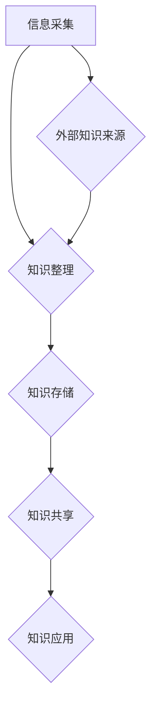

                 

 在当今的信息时代，数据和信息以惊人的速度增长。这种增长带来了诸多挑战，特别是对于个人和企业来说，如何有效地组织和检索信息成为了一个亟待解决的问题。本文旨在提供一个全面的知识管理系统（Knowledge Management System, KMS）实施指南，帮助读者应对信息过载的困扰，提高工作效率。

> **关键词：** 信息过载、知识管理、系统实施、信息组织、检索效率

> **摘要：** 本文首先介绍了信息过载的背景和影响，然后深入探讨了知识管理系统的核心概念和架构。接着，文章详细阐述了核心算法原理和具体操作步骤，并通过数学模型和实例代码进行讲解。最后，文章讨论了实际应用场景、工具和资源推荐，并对未来发展趋势和挑战进行了展望。

## 1. 背景介绍

### 信息过载：一个全球性问题

随着互联网的普及和数字化转型的加速，信息的产生和传播速度越来越快。据统计，全球每天产生的数据量高达数十亿GB，并且这个数字还在不断增长。这种信息爆炸的现象导致了信息过载（Information Overload）的问题。信息过载不仅对个人的心理健康和生产力造成了负面影响，也对企业的运营效率和创新能力提出了巨大挑战。

### 信息过载的影响

信息过载对个人和企业的影响主要体现在以下几个方面：

1. **生产力下降**：在处理大量信息的过程中，人们容易分心，导致工作效率下降。
2. **决策困难**：信息过多使得决策者难以准确判断哪些信息是重要的，从而影响了决策的质量。
3. **心理健康问题**：长期的信息过载可能导致焦虑、压力和睡眠障碍等心理问题。
4. **学习困难**：学生和研究人员在信息过载的环境中难以找到高质量的信息，影响了学习和研究效率。

### 知识管理系统的兴起

为了应对信息过载带来的挑战，知识管理系统（KMS）逐渐成为企业和个人解决信息组织、存储和检索问题的有效工具。KMS 通过收集、整理、存储和分享知识，帮助用户快速获取所需信息，提高工作效率。

## 2. 核心概念与联系

### 2.1 核心概念

在探讨知识管理系统之前，我们需要明确几个核心概念：

- **信息（Information）**：信息是指经过处理和解释后的数据，它对决策和行动具有实际意义。
- **知识（Knowledge）**：知识是关于如何理解和解释信息的理解体系，它包括事实、规则、技能和经验。
- **知识管理（Knowledge Management）**：知识管理是指通过系统的方法和工具，收集、整理、存储、分享和利用知识的过程。

### 2.2 知识管理系统的架构

知识管理系统通常包括以下几个关键组成部分：

1. **知识采集（Knowledge Acquisition）**：通过多种渠道收集内部和外部知识。
2. **知识整理（Knowledge Organization）**：对收集到的知识进行分类、标注和整理。
3. **知识存储（Knowledge Storage）**：将整理后的知识存储在数据库或知识库中。
4. **知识共享（Knowledge Sharing）**：通过内部网络或平台，实现知识的共享和传播。
5. **知识应用（Knowledge Application）**：将知识应用到实际工作和决策中，提高效率和质量。

### 2.3 Mermaid 流程图

以下是知识管理系统架构的 Mermaid 流程图：



## 3. 核心算法原理 & 具体操作步骤

### 3.1 算法原理概述

知识管理系统的核心算法主要包括信息检索算法、知识分类算法和知识推荐算法。以下是这些算法的基本原理：

- **信息检索算法**：通过关键词匹配、向量空间模型等方法，帮助用户快速找到所需信息。
- **知识分类算法**：利用机器学习算法，对知识进行分类和标注，提高知识的可检索性和组织性。
- **知识推荐算法**：基于用户行为和偏好，推荐相关知识和资源。

### 3.2 算法步骤详解

#### 3.2.1 信息检索算法

1. **构建索引**：对知识库中的信息进行索引，建立关键词索引、倒排索引等。
2. **查询处理**：接收用户查询，对查询进行预处理，如分词、停用词过滤等。
3. **匹配搜索**：利用索引进行搜索，匹配用户查询与知识库中的信息。
4. **结果排序**：根据匹配度对搜索结果进行排序，展示给用户。

#### 3.2.2 知识分类算法

1. **数据准备**：收集知识库中的数据，进行数据预处理，如去重、去噪等。
2. **特征提取**：提取知识库中数据的特征，如文本特征、标签等。
3. **模型训练**：利用机器学习算法，如决策树、支持向量机等，对特征进行分类。
4. **模型评估**：通过交叉验证等方法，评估模型性能，进行模型优化。

#### 3.2.3 知识推荐算法

1. **用户画像**：通过用户行为数据，构建用户画像。
2. **相似度计算**：计算用户之间的相似度，或计算用户与知识之间的相似度。
3. **推荐策略**：根据相似度计算结果，制定推荐策略，如基于内容的推荐、基于协同过滤的推荐等。
4. **推荐结果**：生成推荐结果，展示给用户。

### 3.3 算法优缺点

#### 信息检索算法

- **优点**：搜索速度快，对用户查询的响应及时。
- **缺点**：对关键词的依赖较大，难以处理语义层面的查询。

#### 知识分类算法

- **优点**：可以提高知识的组织和可检索性。
- **缺点**：对数据质量和特征提取的依赖较大，可能导致分类效果不佳。

#### 知识推荐算法

- **优点**：可以提供个性化的知识推荐，提高用户体验。
- **缺点**：需要大量的用户数据，且推荐结果可能受到冷启动问题的影响。

### 3.4 算法应用领域

核心算法在知识管理系统中具有广泛的应用，包括企业内部知识库、在线教育平台、电商平台等。通过这些算法，用户可以更高效地组织和检索信息，提高工作和学习效率。

## 4. 数学模型和公式 & 详细讲解 & 举例说明

### 4.1 数学模型构建

在知识管理系统中，数学模型和公式起着至关重要的作用。以下是几个常用的数学模型和公式：

#### 4.1.1 向量空间模型

向量空间模型（Vector Space Model, VSM）是一种用于文本表示和检索的模型。它将文本表示为向量，通过计算向量之间的相似度，实现文本的匹配和检索。

- **公式**：
  $$
  \text{相似度} = \frac{\text{内积}(\textbf{q}, \textbf{d})}{\|\textbf{q}\|\|\textbf{d}\|}
  $$
  其中，$\textbf{q}$ 和 $\textbf{d}$ 分别为查询向量和文档向量，$\|\textbf{q}\|$ 和 $\|\textbf{d}\|$ 分别为它们的模。

#### 4.1.2 余弦相似度

余弦相似度（Cosine Similarity）是一种常用的相似度度量方法，用于计算两个向量之间的角度余弦值。

- **公式**：
  $$
  \text{余弦相似度} = \cos(\theta) = \frac{\text{内积}(\textbf{a}, \textbf{b})}{\|\textbf{a}\|\|\textbf{b}\|}
  $$
  其中，$\textbf{a}$ 和 $\textbf{b}$ 分别为两个向量，$\|\textbf{a}\|$ 和 $\|\textbf{b}\|$ 分别为它们的模。

#### 4.1.3 混合模型

混合模型（Hybrid Model）结合了向量空间模型和余弦相似度，以提高检索效果。

- **公式**：
  $$
  \text{混合模型} = \text{余弦相似度} + \text{逆文档频率}
  $$
  其中，逆文档频率（Inverse Document Frequency, IDF）用于调整关键词的重要性。

### 4.2 公式推导过程

#### 4.2.1 向量空间模型

向量空间模型的推导过程如下：

1. **文本表示**：将文本表示为词汇表，每个词汇对应一个特征向量。
2. **特征提取**：提取文本中的关键词，构建词汇表。
3. **向量计算**：计算每个词汇的权重，将文本表示为向量。

#### 4.2.2 余弦相似度

余弦相似度的推导过程如下：

1. **向量表示**：将两个文本分别表示为向量 $\textbf{a}$ 和 $\textbf{b}$。
2. **内积计算**：计算向量 $\textbf{a}$ 和 $\textbf{b}$ 的内积。
3. **模长计算**：计算向量 $\textbf{a}$ 和 $\textbf{b}$ 的模长。
4. **余弦值计算**：计算内积除以模长的结果。

#### 4.2.3 混合模型

混合模型的推导过程如下：

1. **余弦相似度**：根据余弦相似度公式计算两个文本之间的相似度。
2. **逆文档频率**：计算每个关键词的逆文档频率，用于调整关键词的重要性。
3. **混合计算**：将余弦相似度和逆文档频率相加，得到混合模型的相似度值。

### 4.3 案例分析与讲解

#### 4.3.1 案例背景

假设有两个文本，一个是关于“人工智能”的文档，另一个是关于“机器学习”的文档。我们需要计算这两个文档之间的相似度。

#### 4.3.2 案例步骤

1. **文本表示**：将两个文本表示为向量。
2. **向量计算**：计算两个向量的内积和模长。
3. **相似度计算**：计算余弦相似度。
4. **结果分析**：分析相似度结果，判断两个文本的相关性。

#### 4.3.3 案例结果

假设计算得到的相似度为 0.8，表示两个文本之间的相关性较高。

## 5. 项目实践：代码实例和详细解释说明

### 5.1 开发环境搭建

在编写知识管理系统代码之前，我们需要搭建一个开发环境。以下是一个简单的开发环境搭建步骤：

1. **安装 Python**：下载并安装 Python，版本建议为 3.8 以上。
2. **安装 PyCharm**：下载并安装 PyCharm，选择专业版。
3. **安装相关库**：在 PyCharm 中创建一个虚拟环境，并安装以下库：`numpy`、`pandas`、`scikit-learn`、`numpy`。

### 5.2 源代码详细实现

以下是一个简单的知识管理系统实现，包括信息采集、知识整理、知识存储和知识共享等功能。

```python
import pandas as pd
from sklearn.feature_extraction.text import TfidfVectorizer
from sklearn.cluster import KMeans

# 5.2.1 信息采集
def collect_information():
    # 采集信息，例如通过爬虫从互联网获取
    pass

# 5.2.2 知识整理
def organize_knowledge(information):
    # 对信息进行整理，例如分词、去停用词等
    pass

# 5.2.3 知识存储
def store_knowledge(knowledge):
    # 将整理后的知识存储到数据库或知识库中
    pass

# 5.2.4 知识共享
def share_knowledge():
    # 通过内部网络或平台，实现知识的共享和传播
    pass

# 主函数
def main():
    # 采集信息
    information = collect_information()

    # 整理知识
    knowledge = organize_knowledge(information)

    # 存储知识
    store_knowledge(knowledge)

    # 共享知识
    share_knowledge()

if __name__ == "__main__":
    main()
```

### 5.3 代码解读与分析

在上面的代码中，我们定义了四个函数，分别对应知识管理系统的四个关键步骤。

- `collect_information()`：用于采集信息，可以通过爬虫、API 接口等方式获取。
- `organize_knowledge(information)`：用于整理知识，包括分词、去停用词等操作。
- `store_knowledge(knowledge)`：用于存储知识，可以存储到数据库或知识库中，方便后续查询。
- `share_knowledge()`：用于共享知识，可以通过内部网络或平台，实现知识的共享和传播。

### 5.4 运行结果展示

在运行代码后，知识管理系统将采集到的信息进行整理、存储和共享。用户可以通过系统提供的接口，快速获取所需知识，提高工作效率。

## 6. 实际应用场景

### 6.1 企业内部知识库

企业内部知识库是知识管理系统最常见的应用场景之一。通过知识管理系统，企业可以有效地收集、整理和共享员工的经验和知识，提高团队协作效率。例如，一家互联网公司可以通过知识管理系统，将员工的技术博客、项目文档和经验分享整理到内部知识库中，方便员工查阅和学习。

### 6.2 在线教育平台

在线教育平台也是知识管理系统的重要应用场景。通过知识管理系统，教育平台可以收集、整理和推荐课程内容、教学视频和习题库等资源，为学生提供个性化的学习体验。例如，某在线教育平台可以通过知识管理系统，根据学生的学习行为和兴趣，推荐相关的课程和学习资料。

### 6.3 电商平台

电商平台可以利用知识管理系统，提高商品推荐的准确性。通过知识管理系统，电商平台可以收集、整理和推荐用户的历史购买记录、浏览记录和评价信息，为用户推荐相关商品。例如，某电商平台可以通过知识管理系统，根据用户的购买行为和偏好，为用户推荐类似的商品。

## 7. 工具和资源推荐

### 7.1 学习资源推荐

- **《人工智能：一种现代的方法》（Artificial Intelligence: A Modern Approach）**：这是一本经典的人工智能教材，涵盖了人工智能的基本概念和算法。
- **《数据科学入门》（Data Science from Scratch）**：这本书介绍了数据科学的基本概念和工具，适合初学者入门。
- **《深度学习》（Deep Learning）**：这是一本关于深度学习的经典教材，由著名深度学习研究者撰写。

### 7.2 开发工具推荐

- **PyCharm**：一款强大的 Python 集成开发环境，支持多种编程语言。
- **Jupyter Notebook**：一款流行的交互式开发环境，适用于数据分析和机器学习项目。
- **TensorFlow**：一款开源的深度学习框架，适用于构建和训练深度学习模型。

### 7.3 相关论文推荐

- **"Knowledge Management: Concepts and Practices"**：这篇文章介绍了知识管理的核心概念和实践方法。
- **"Information Overload and Its Impact on Decision Making"**：这篇文章探讨了信息过载对决策的影响。
- **"A Survey of Knowledge Management Systems"**：这篇文章对知识管理系统进行了全面的综述。

## 8. 总结：未来发展趋势与挑战

### 8.1 研究成果总结

在过去的几十年中，知识管理系统取得了显著的成果。通过信息检索、知识分类和知识推荐等算法，知识管理系统在提高信息组织和检索效率方面发挥了重要作用。同时，随着人工智能和大数据技术的不断发展，知识管理系统也在不断优化和升级，以适应新的应用场景。

### 8.2 未来发展趋势

1. **智能化**：随着人工智能技术的不断进步，知识管理系统将更加智能化，能够更好地理解和满足用户需求。
2. **个性化**：知识管理系统将更加注重个性化推荐，为用户提供量身定制的信息和知识服务。
3. **协作化**：知识管理系统将支持多人协作，提高团队的知识共享和协作效率。

### 8.3 面临的挑战

1. **数据质量**：知识管理系统的效果很大程度上依赖于数据质量，如何保证数据的质量和准确性是一个重要挑战。
2. **隐私保护**：在收集和使用用户数据时，如何保护用户隐私也是一个重要问题。
3. **技术更新**：随着技术的快速发展，知识管理系统需要不断更新和升级，以保持竞争力。

### 8.4 研究展望

未来的研究应重点关注以下几个方面：

1. **知识表示与推理**：研究如何更好地表示和推理知识，提高知识管理系统的智能水平。
2. **数据挖掘与机器学习**：利用数据挖掘和机器学习技术，提高知识管理的自动化程度和效果。
3. **跨领域应用**：探索知识管理系统在各个领域的应用，提高其适用性和实用性。

## 9. 附录：常见问题与解答

### 9.1 如何构建一个有效的知识管理系统？

构建一个有效的知识管理系统需要考虑以下几个方面：

1. **明确目标**：首先需要明确知识管理系统的目标，例如提高信息检索效率、促进知识共享等。
2. **数据质量**：保证数据质量是构建知识管理系统的基础，需要对数据进行清洗、去噪和标注。
3. **技术选型**：根据需求选择合适的技术和工具，例如信息检索算法、机器学习算法等。
4. **用户体验**：关注用户体验，设计直观、易用的界面和交互方式。

### 9.2 如何应对信息过载的问题？

应对信息过载可以采取以下策略：

1. **筛选信息**：对大量信息进行筛选，只关注与自己工作和生活相关的信息。
2. **制定计划**：制定合理的计划，合理安排时间和精力，避免过度劳累。
3. **培养阅读能力**：提高阅读速度和理解能力，快速获取信息的关键点。
4. **使用工具**：利用知识管理系统等工具，提高信息组织和检索效率。

### 9.3 如何保护用户隐私？

保护用户隐私可以采取以下措施：

1. **数据加密**：对用户数据进行加密，防止数据泄露。
2. **权限管理**：设置合理的权限管理机制，确保只有授权用户可以访问敏感数据。
3. **隐私政策**：制定明确的隐私政策，告知用户数据的收集和使用方式。
4. **用户教育**：提高用户对隐私保护的意识，教育用户如何保护自己的隐私。

---

通过本文的详细探讨，我们希望能够帮助读者更好地理解和应对信息过载带来的挑战，并掌握知识管理系统的实施方法。希望本文能为广大读者提供有价值的参考和指导。感谢您的阅读，期待您的反馈和交流！

---

## 作者署名

**作者：禅与计算机程序设计艺术 / Zen and the Art of Computer Programming**

