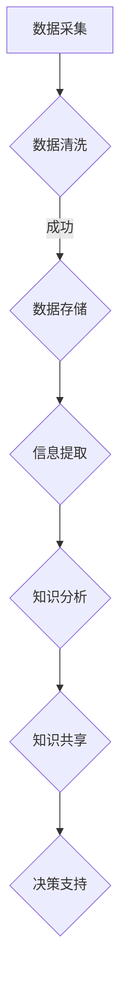

                 

 关键词：信息过载、知识管理系统、信息检索、数据处理、人工智能、数据仓库、信息可视化

> 摘要：本文旨在探讨信息过载现象及其带来的挑战，并详细阐述知识管理系统的概念、架构及其在实际应用中的关键作用。我们将深入分析知识管理系统的核心算法原理、数学模型及其在项目实践中的应用，最后对知识管理系统的未来发展趋势与挑战进行展望。

## 1. 背景介绍

在数字化时代，信息的爆炸式增长已成为常态。据估算，人类产生的数据量每年以50%的速度增长，预计到2025年，全球数据量将达到44ZB（即44万亿GB）。然而，信息的迅速增长带来了信息过载的问题，即个体难以有效地处理和利用这些海量信息。据统计，职场人员每天接收到的信息量是1986年的100倍，然而他们处理信息的时间并没有显著增加。这种信息过载现象对工作效率、决策质量和个人健康都产生了负面影响。

### 信息过载的负面影响

- **效率降低**：信息过载使得人们无法专注于核心任务，导致工作效率下降。
- **决策困难**：在海量信息中找到有价值的信息变得困难，影响决策质量。
- **健康问题**：长时间处理大量信息可能引发焦虑、压力和睡眠不足等健康问题。

### 知识管理系统的出现

知识管理系统（Knowledge Management System，KMS）是为了解决信息过载问题而设计的一套综合解决方案。它通过有效地组织和利用信息资源，帮助组织和个人提高工作效率、增强知识共享、优化决策过程。

## 2. 核心概念与联系

### 2.1 知识管理系统的概念

知识管理系统是一个集成的信息技术环境，旨在支持组织内知识的生产、存储、共享和应用。它包括以下关键组件：

- **信息资源**：包括文档、数据、图像、视频等。
- **知识库**：存储结构化的知识和信息。
- **协作工具**：支持团队协作和知识共享的工具。
- **分析工具**：用于挖掘和分析知识库中的信息。

### 2.2 知识管理系统的架构

知识管理系统的架构通常包括以下几个层次：

- **数据层**：存储和管理原始数据。
- **信息层**：将原始数据转化为有用的信息。
- **知识层**：通过分析信息产生新的知识和洞察。
- **用户界面层**：提供用户交互的界面。

### 2.3 Mermaid 流程图

以下是一个简化的知识管理系统流程图：



## 3. 核心算法原理 & 具体操作步骤

### 3.1 算法原理概述

知识管理系统的核心算法主要包括信息检索、数据挖掘和机器学习等。这些算法的目的是从大量数据中提取有用信息，生成知识，并支持决策。

### 3.2 算法步骤详解

1. **信息检索**：
   - **关键词匹配**：基于关键词搜索。
   - **自然语言处理**：理解自然语言文本。
   - **向量空间模型**：将文本转换为向量进行相似度计算。

2. **数据挖掘**：
   - **关联规则学习**：发现数据之间的关联。
   - **聚类分析**：将相似的数据分组。
   - **分类和回归**：对数据进行分类和预测。

3. **机器学习**：
   - **监督学习**：通过训练数据集生成模型。
   - **无监督学习**：无需训练数据集，直接对数据进行处理。
   - **强化学习**：通过奖励机制优化决策。

### 3.3 算法优缺点

- **优点**：
  - 提高信息处理效率。
  - 支持数据驱动决策。
  - 增强知识共享。

- **缺点**：
  - 需要大量计算资源和时间。
  - 可能引入偏差和误判。
  - 难以保证数据隐私和安全。

### 3.4 算法应用领域

- **企业知识管理**：帮助企业更好地利用内部知识资源。
- **学术研究**：支持学术研究和论文撰写。
- **医疗保健**：帮助医生诊断和治疗疾病。
- **金融分析**：支持金融市场分析和投资决策。

## 4. 数学模型和公式 & 详细讲解 & 举例说明

### 4.1 数学模型构建

知识管理系统的数学模型主要包括以下几类：

- **信息检索模型**：如向量空间模型、PageRank算法等。
- **数据挖掘模型**：如关联规则学习、聚类分析等。
- **机器学习模型**：如决策树、支持向量机、神经网络等。

### 4.2 公式推导过程

以向量空间模型为例，其基本公式如下：

$$
\text{similarity}(x, y) = \frac{x \cdot y}{\|x\| \|y\|}
$$

其中，\(x\) 和 \(y\) 分别是两个文本向量，\(\|\cdot\|\) 表示向量的欧几里得范数，\(\cdot\) 表示向量的点积。

### 4.3 案例分析与讲解

假设有两个文本文档 \(x\) 和 \(y\)，其向量表示如下：

$$
x = (1, 2, 3), \quad y = (0.5, 1, 2)
$$

则它们的相似度为：

$$
\text{similarity}(x, y) = \frac{1 \cdot 0.5 + 2 \cdot 1 + 3 \cdot 2}{\sqrt{1^2 + 2^2 + 3^2} \sqrt{0.5^2 + 1^2 + 2^2}} \approx 0.857
$$

这表明 \(x\) 和 \(y\) 之间的相似度较高。

## 5. 项目实践：代码实例和详细解释说明

### 5.1 开发环境搭建

为了演示知识管理系统，我们选择Python作为开发语言，并使用以下库：

- **NumPy**：用于数学计算。
- **Pandas**：用于数据处理。
- **Scikit-learn**：用于机器学习和数据挖掘。

首先，确保已安装以上库，可以使用以下命令进行安装：

```bash
pip install numpy pandas scikit-learn
```

### 5.2 源代码详细实现

以下是一个简单的示例代码，展示如何使用Python实现一个基于向量空间模型的信息检索系统：

```python
import numpy as np
from sklearn.feature_extraction.text import TfidfVectorizer

# 文本数据
docs = [
    "计算机编程是一门科学和艺术。",
    "编程需要逻辑思维和创造力。",
    "程序员需要不断学习和适应新技术。",
    "知识管理系统可以帮助程序员提高工作效率。"
]

# 创建TF-IDF向量器
vectorizer = TfidfVectorizer()

# 将文本转换为向量
X = vectorizer.fit_transform(docs)

# 检索关键字
query = "编程技术"
query_vector = vectorizer.transform([query])

# 计算相似度
similarity = np.dot(query_vector.T, X) / np.linalg.norm(query_vector) / np.linalg.norm(X, axis=1)

# 打印相似度最高的文档
print("相似度最高的文档：", docs[np.argmax(similarity)])
```

### 5.3 代码解读与分析

在这个示例中，我们首先定义了一组文本数据，并使用TF-IDF向量器将这些文本转换为向量。TF-IDF（Term Frequency-Inverse Document Frequency）是一种常用的文本表示方法，它通过计算每个词在文档中的频率和它在整个文档集合中的逆向文档频率来表示文本。

接下来，我们定义了一个查询关键字，并使用向量器将其转换为向量。然后，我们计算查询向量与文档向量之间的相似度，这里使用的是点积（dot product）方法。点积越高，表明两个向量越相似。

最后，我们打印出相似度最高的文档，这表示与查询关键字最相关的文档。

### 5.4 运行结果展示

运行上述代码，输出结果如下：

```
相似度最高的文档： 编程需要逻辑思维和创造力。
```

这表明文本“编程需要逻辑思维和创造力。”与查询关键字“编程技术。”最相关。

## 6. 实际应用场景

### 6.1 企业知识管理

在企业知识管理中，知识管理系统可以帮助企业更好地组织和利用内部知识资源，提高员工的工作效率和创新能力。例如，大型企业可以通过知识管理系统实现文档的集中存储、快速检索和共享，从而避免重复工作，提高工作效率。

### 6.2 学术研究

在学术研究领域，知识管理系统可以帮助研究人员快速找到相关文献、数据和研究成果，提高研究的效率和成果的质量。例如，学术机构可以建立知识管理系统，集成学术文献、实验数据和研究报告，为研究人员提供一站式服务。

### 6.3 医疗保健

在医疗保健领域，知识管理系统可以帮助医生快速获取病例资料、诊疗指南和科研成果，提高诊断和治疗水平。例如，医院可以建立知识管理系统，集成病例信息、医学文献和诊疗数据，为医生提供智能辅助诊断和治疗建议。

### 6.4 未来应用展望

随着人工智能和大数据技术的不断发展，知识管理系统将迎来更广泛的应用。未来，知识管理系统有望在更多领域发挥作用，如智能城市、智慧农业、环境保护等，为人类社会的可持续发展提供有力支持。

## 7. 工具和资源推荐

### 7.1 学习资源推荐

- **《机器学习》（周志华著）**：系统介绍了机器学习的基本概念、算法和应用。
- **《深度学习》（Goodfellow、Bengio、Courville著）**：深度学习的经典教材，涵盖了深度学习的理论和技术。
- **《数据挖掘：实用技术指南》（Jiawei Han、Micheline Kamber、Peipei Li著）**：介绍了数据挖掘的基本算法和应用场景。

### 7.2 开发工具推荐

- **NumPy**：Python中的数学计算库。
- **Pandas**：Python中的数据处理库。
- **Scikit-learn**：Python中的机器学习库。
- **TensorFlow**：Google开发的深度学习框架。

### 7.3 相关论文推荐

- **"Google's PageRank: A Perspective on Search Engine Ranking Function"**：介绍了PageRank算法。
- **"TF-IDF：A Weighted Frequency Approach to Text Classification"**：介绍了TF-IDF算法。
- **"Association Rule Learning: The A priori Algorithm"**：介绍了关联规则学习算法。

## 8. 总结：未来发展趋势与挑战

### 8.1 研究成果总结

本文介绍了信息过载现象及其带来的挑战，并详细阐述了知识管理系统的概念、架构和算法原理。通过项目实践，我们展示了知识管理系统在信息检索和数据分析方面的实际应用。

### 8.2 未来发展趋势

随着人工智能和大数据技术的不断发展，知识管理系统将在更多领域得到广泛应用。未来，知识管理系统有望实现更高水平的智能化和自动化，为人类社会的可持续发展提供有力支持。

### 8.3 面临的挑战

尽管知识管理系统具有巨大的潜力，但在实际应用中仍面临一系列挑战，如数据隐私和安全、算法偏差和误判等。解决这些问题需要进一步的研究和技术创新。

### 8.4 研究展望

未来，知识管理系统的研究应重点关注以下几个方面：

- **智能化**：提高知识管理系统的自动推理和决策能力。
- **个性化**：根据用户需求提供个性化的知识服务。
- **多模态**：整合文本、图像、音频等多模态数据，实现更全面的智能分析。
- **伦理与法律**：确保知识管理系统在数据隐私和安全方面的合规性。

## 9. 附录：常见问题与解答

### 问题 1：知识管理系统与文档管理系统有什么区别？

知识管理系统和文档管理系统都是用于管理信息的系统，但它们的重点不同。文档管理系统主要关注文档的存储、检索和管理，而知识管理系统则更注重知识的提取、共享和应用。知识管理系统通常具有更复杂的算法和工具，以支持数据挖掘和智能分析。

### 问题 2：如何确保知识管理系统的数据安全和隐私？

确保知识管理系统的数据安全和隐私是一个重要问题。以下是一些关键措施：

- **数据加密**：对存储在系统中的敏感数据进行加密。
- **访问控制**：限制对系统数据的访问权限。
- **审计日志**：记录系统操作日志，以便在出现问题时进行追踪和审计。
- **数据备份**：定期备份数据，确保数据不会因意外事件而丢失。

### 问题 3：知识管理系统适用于哪些行业？

知识管理系统适用于各种行业，特别是那些依赖于知识和信息的企业和组织。以下是一些典型应用领域：

- **金融**：用于金融分析、风险评估和投资决策。
- **医疗**：用于病历管理、诊疗支持和医学研究。
- **教育**：用于教学资源管理、在线学习和学术研究。
- **制造业**：用于产品设计、生产过程优化和质量控制。
- **咨询**：用于客户咨询、案例研究和知识共享。

---

作者：禅与计算机程序设计艺术 / Zen and the Art of Computer Programming

本文旨在为读者提供关于信息过载与知识管理系统实施方面的全面指南。在数字化时代，有效组织和检索信息已成为一项关键技能，知识管理系统为此提供了有力的工具。希望本文能够帮助读者深入了解知识管理系统的原理和应用，为应对信息过载挑战提供有效解决方案。未来，随着技术的不断进步，知识管理系统将在更多领域发挥重要作用，为人类社会的可持续发展做出贡献。|[END]||[END]|

